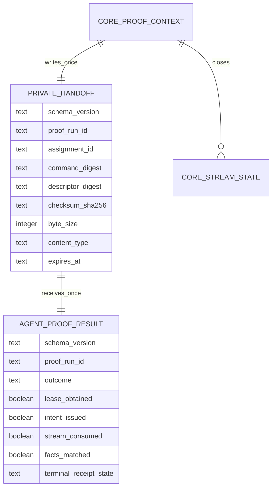
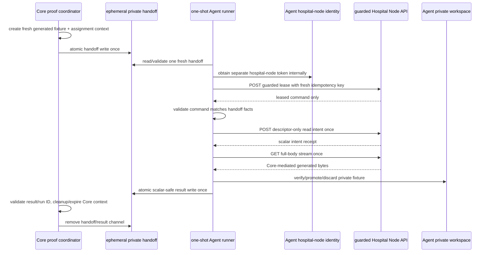
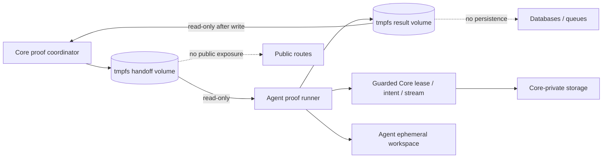

# Core–Agent Private Proof Handoff Coordination

**Status:** L4e2a design contract. No cross-repository proof coordinator, Agent runtime lease/stream runner, shared proof volume, target-runtime composition, Core/Azure request, generated-fixture transfer, training, update, submission, or aggregation behavior is implemented by this document.

**Scope:** The existing guarded Hospital Node API intentionally has no assignment-discovery route. A future proof therefore needs a tightly scoped coordination channel that lets Core’s private validation setup hand one newly created generated assignment to one ephemeral Agent runner without creating a public listing service, exposing an artifact locator, or converting the Agent into a general Core control client.

## 1. Nontechnical requirements and research decision

The Agent cannot safely infer which assignment to consume, and Core must not publish assignment discovery merely to simplify a test. The coordination boundary must therefore be **private, one-shot, and narrow**: Core creates fresh generated proof facts, passes one opaque handoff record over an ephemeral private channel, waits for one Agent terminal result, and closes the complete proof context. This mechanism exists only to prove the already documented Core-to-Agent delivery path; it is not a workload scheduler, a hospital queue, an onboarding mechanism, or a production assignment API.

| Requirement | Acceptance signal | Excluded claim |
|---|---|---|
| No public discovery | The Agent receives exactly one opaque handoff from the private proof channel; no route lists assignments or fixtures. | General assignment browsing, queue polling, hospital dashboard, or public node endpoint. |
| Core remains assignment authority | Core-private setup creates the assignment/fixture context and owns expiration/cleanup. | Agent-created assignment, mutable selector, direct provider setup, or release authority. |
| Agent retains authenticated consumption | Agent separately obtains the hospital-node identity, acquires the existing guarded lease, then issues one intent and opens one stream. | Core impersonation of the Agent, shared identity, human/ML-worker callback, or bypassing lease policy. |
| Minimal transferable facts | Handoff contains only a fresh proof-run ID, assignment ID, bounded expiry, and immutable expected descriptor facts. | Token, secret, URL, locator, key/version, provider response, header/body, data field, local path, training parameter, or update. |
| Falsifiable closure | Core receives one scalar-safe Agent result, then closes both proof channel and generated Core context. | Resilience, retry behavior, multiple Agents, durable message broker, production orchestration, or training outcome. |

> The private handoff is a proof-only rendezvous record. It is neither a new public API nor a credential that authorizes storage access.

## 2. Data contract and record schemas

The handoff and result are internal ephemeral files/records in a proof-only private channel. They are not persisted in Agent SQLite, Core public tables, application events, logs, status routes, or public documentation. Both records reject unknown fields and are deleted by the coordinator after terminal closure.



| Record | Required fields | Validation and lifecycle | Never present |
|---|---|---|---|
| `hospital-node-proof-handoff/v1` | Fresh proof-run UUID, assignment UUID, command/descriptor digests, checksum, positive bounded byte size, allowlisted generated content type, expiry. | Core writes atomically once; Agent validates exact fields/expiry before opening a lease; Core removes after result/timeout. | Token, secret, Core origin, endpoint, header/body, locator, provider data, fixture bytes, local path, user/patient/data field, selector. |
| `hospital-node-proof-result/v1` | Same proof-run UUID; fixed terminal outcome; lease/intent/stream/fact boolean claims; terminal receipt state. | Agent writes atomically once only after terminal local handling; Core accepts only matching run ID/known outcome and deletes it. | Assignment ID, token, URL, path, header/body, checksum text, provider detail, exception text, model/data/training/update value. |
| `core-proof-context` | Core-private fixture binding, assignment/lease/intent/stream lifecycle, cleanup state. | Remains Core-private and expires after agent result or coordinator timeout. | Shared file payload, token, Agent workspace path, provider locator in any Agent-visible field. |

The Agent result intentionally omits assignment and artifact facts. Core correlates it only through the private proof-run ID it created. This keeps the Agent-to-Core return channel narrower than the Core-to-Agent handoff and prevents the result from becoming a descriptor, storage, or workload-discovery channel.

## 3. Workflow and lease-first authority sequence



The existing guarded `POST /v1/workload-assignments/:assignmentId/lease` route is the only additional established Hospital Node operation needed for the proof. It is not a new human or storage route. The Agent uses a fresh proof-run-local idempotency key, validates the received command, and refuses a command whose immutable descriptor facts do not match the private handoff. The existing typed intent/stream client remains limited to the documented two stream-related guarded routes.

| Step | Normal proof behavior | Mandatory refusal or terminal behavior |
|---|---|---|
| Core setup | Create one fresh generated fixture/context using Core-private capabilities. | Refuse if a prior proof channel/runner is active or worker is enabled. |
| Handoff write | Atomic one-time file/record into the Agent-readable private channel. | Refuse unknown/nonempty/stale channel; no append/reuse. |
| Agent handoff read | Validate schema, UUIDs, expiry, bound, content type, and no unknown fields. | Write scalar `pre_route_refused` result or exit safely; do not obtain a token or call Core on invalid handoff. |
| Lease | Acquire one authenticated guarded lease for handoff assignment. | Terminal on nonmatching/denied/expired lease; do not discover a replacement assignment. |
| Command binding | Validate command/descriptor facts exactly against handoff. | Terminal `facts_matched=false`; no intent/stream request. |
| Intent and stream | One intent, then one full-body stream; L4d workspace validates and discards after proof. | Redirect/partial/denial/mismatch/interruption is terminal; no retry/Range/reuse. |
| Result and cleanup | Atomically write one scalar-safe result; Core validates proof-run ID and closes all context/channel state. | Cleanup uncertainty is a proof failure, not a second run. |

## 4. Private channel architecture and engineering standards

The future target-runtime profile uses two short-lived **private tmpfs volumes** owned by the proof composition: a handoff volume mounted read-only to the Agent after Core writes it, and a result volume mounted read-write only for Agent result write then read-only by Core during closure. It has no host bind mount and is removed with the profile. If the target runtime cannot provide this isolation, the proof is blocked rather than downgraded to an exposed file, named persistent volume, database table, message queue, or HTTP endpoint.



| Standard | Required enforcement |
|---|---|
| Closed channel | Fixed schema/version/file name, exclusive/atomic create, bounded size, fresh run UUID, expiry, delete-after-terminal behavior. |
| Mount direction | Core writes handoff then Agent sees it read-only; Agent writes result then Core sees it read-only. Neither side mounts a host path. |
| No discovery | Agent cannot enumerate contexts, list a directory, choose an assignment, or read a stale handoff. Coordinator provides exactly one expected file. |
| No implicit trust | Agent validates handoff before token acquisition and validates leased command against handoff before intent. Core validates result run UUID/schema/outcome before cleanup claim. |
| Output reduction | Result contains only fixed outcome/booleans/receipt state. No assignment/artifact/origin/token/path/provider/body/checksum value/free-text field. |
| No retry | Coordinator permits one Agent result writer and one runtime invocation. A timeout, missing result, mismatch, or cleanup failure is terminal for this run. |
| No operational expansion | No public port, daemon, job queue, message broker, database migration, scheduler, persistent volume, or aggregation worker change. |

## 5. API contract/readout and safe outcome vocabulary

```ts
export interface PrivateProofHandoff {
  readonly schemaVersion: "hospital-node-proof-handoff/v1";
  readonly proofRunId: string;
  readonly assignmentId: string;
  readonly commandDigest: string;
  readonly descriptorDigest: string;
  readonly checksumSha256: string;
  readonly byteSize: number;
  readonly contentType: "application/vnd.fedagg.base-model+zip";
  readonly expiresAt: string;
}

export interface PrivateProofResult {
  readonly schemaVersion: "hospital-node-proof-result/v1";
  readonly proofRunId: string;
  readonly outcome: "succeeded" | "pre_route_refused" | "terminal_failure";
  readonly leaseObtained: boolean;
  readonly intentIssued: boolean;
  readonly streamConsumed: boolean;
  readonly factsMatched: boolean;
  readonly terminalReceiptState: "verified" | "rejected" | "aborted" | "expired" | "not_started";
}
```

These files are private coordinator interfaces, not HTTP payloads. They do not create or extend any public API. The coordinator logs only the result outcome and booleans plus its own non-identifying aggregate closure counts. It does not log proof-run ID either; that ID is ephemeral coordination metadata, not public evidence.

## 6. Tests, protected release gates, and proof plan

| Layer | Required positive evidence | Required denial evidence |
|---|---|---|
| Contract | Exact field/schema/expiry parsing; result run ID match; atomic create/remove behavior. | Unknown field, stale/invalid UUID, expired handoff, oversized record, duplicated handoff/result, non-allowlisted content type, path/token/provider/header/body-like field. |
| Core coordinator fake | Fresh synthetic fixture context produces one handoff then closes after a matching result. | Existing channel, missing result, wrong run ID, timeout, cleanup failure, worker enabled, second execution attempt. |
| Agent coordinator fake | Lease-first, command/handoff fact equality, one intent/stream sequence, scalar result after terminal handling. | Invalid handoff, lease denial, descriptor mismatch, stream mismatch/interruption, result write failure, runner replay. |
| Composition static check | Two private tmpfs volumes, mount direction, no port/restart/default profile/host mount; opaque secret reference. | Persistent/host/public volume, public port, permissive mount, missing secret ref, direct storage/provider configuration. |
| Release preflight | Agent Core Quality Gates, Core quality/protected deployment, expected sources, target Compose render, Core health, disabled worker, zero runner/safe initial state. | Any failed/in-progress/mismatched gate blocks before fixture creation. |
| One-shot proof | One rebuilt profile, fresh generated fixture, one handoff, one lease/intent/stream, one safe result, terminal Core/Agent closure. | No automatic retry; publish actual failure and cleanup state before repair/retry. |

## 7. AI implementation handoff

| Slice | Deliverable | Stop condition |
|---|---|---|
| L4e2a | This contract and the exact private channel/result/readout limits. | No coordinator/runner/runtime composition code. |
| L4e2b Core | Core-private coordinator that creates/cleans generated context and writes/reads only typed private channel records, with fake tests. | No target-runtime invocation, provider disclosure, or public route. |
| L4e2b Agent | Handoff parser/result writer and lease-first proof application orchestration with fake ports/tests. | No live token/Core/FS/Compose run. |
| L4e2b composition | Static profile joining Core/Agent one-shot components only through private tmpfs channels and opaque protected references. | No deployment/run/profile activation. |
| L4e3 | Release/preflight verification and one `run --build` invocation if every documented gate succeeds. | One attempt only; no trainer/update/submission/aggregation. |

Any request to make the handoff discoverable, durable, externally callable, provider-aware, secret-bearing, data-bearing, path-bearing, retriable, multi-Agent, or usable outside the bounded proof is a fail-closed design change requiring a new ledger record.

## References

[1] [Core Hospital Node guarded assignment, lease, intent, and stream controller](https://github.com/hstu-research/federated-aggregator-core/blob/main/apps/api/src/hospital-node-assignments/hospital-node-assignments.controller.ts)

[2] [Agent deployment and bounded-proof dossier](https://github.com/hstu-research/federated-aggregator-docs/blob/main/docs/HOSPITAL_NODE_AGENT_DEPLOYMENT_AND_BOUNDED_PROOF.md)

[3] [Core-mediated generated-model streaming dossier](https://github.com/hstu-research/federated-aggregator-docs/blob/main/docs/CORE_MEDIATED_MODEL_STREAMING.md)
