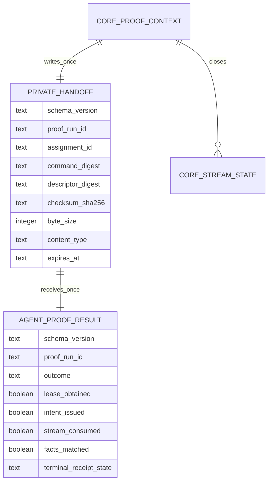
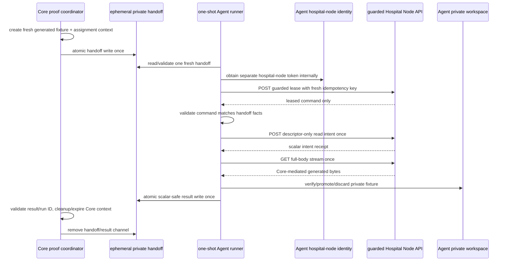
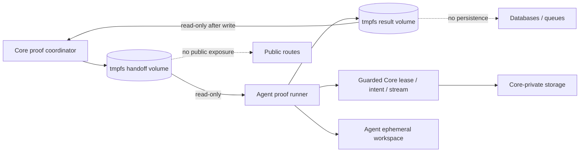

# Core–Agent Private Proof Handoff Coordination

**Status:** L4e2a design contract and L4e2b pure/fake-first Core–Agent coordination components implemented locally. No shared runtime channel, target-runtime composition, live token, Core/Azure request, generated-fixture transfer, training, update, submission, or aggregation behavior is implemented by this document.

**Scope:** The existing guarded Hospital Node API intentionally has no assignment-discovery route. A future proof therefore needs a tightly scoped coordination channel that lets Core’s private validation setup hand one newly created generated assignment to one ephemeral Agent runner without creating a public listing service, exposing an artifact locator, or converting the Agent into a general Core control client.

## 1. Nontechnical requirements and research decision

The Agent cannot safely infer which assignment to consume, and Core must not publish assignment discovery merely to simplify a test. The coordination boundary must therefore be **private, one-shot, and narrow**: Core creates fresh generated proof facts, passes one opaque handoff record over an ephemeral private channel, waits for one Agent terminal result, and closes the complete proof context. This mechanism exists only to prove the already documented Core-to-Agent delivery path; it is not a workload scheduler, a hospital queue, an onboarding mechanism, or a production assignment API.

| Requirement | Acceptance signal | Excluded claim |
|---|---|---|
| No public discovery | The Agent receives exactly one opaque handoff from the private proof channel; no route lists assignments or fixtures. | General assignment browsing, queue polling, hospital dashboard, or public node endpoint. |
| Core remains assignment authority | Core-private setup creates the assignment/fixture context and owns expiration/cleanup. | Agent-created assignment, mutable selector, direct provider setup, or release authority. |
| Agent retains authenticated consumption | Agent separately obtains the hospital-node identity, acquires the existing guarded lease, then issues one intent and opens one stream. | Core impersonation of the Agent, shared identity, human/ML-worker callback, or bypassing lease policy. |
| Minimal transferable facts | Handoff contains only a fresh proof-run ID, assignment ID, bounded expiry, and immutable expected descriptor facts. | Token, secret, URL, locator, key/version, provider response, header/body, data field, local path, training parameter, or update. |
| Falsifiable closure | Core receives one scalar-safe Agent result, then closes both proof channel and generated Core context. | Resilience, retry behavior, multiple Agents, durable message broker, production orchestration, or training outcome. |

> The private handoff is a proof-only rendezvous record. It is neither a new public API nor a credential that authorizes storage access.

## 2. Data contract and record schemas

The handoff and result are internal ephemeral files/records in a proof-only private channel. They are not persisted in Agent SQLite, Core public tables, application events, logs, status routes, or public documentation. Both records reject unknown fields and are deleted by the coordinator after terminal closure.



| Record | Required fields | Validation and lifecycle | Never present |
|---|---|---|---|
| `hospital-node-proof-handoff/v1` | Fresh proof-run UUID, assignment UUID, command/descriptor digests, checksum, positive bounded byte size, allowlisted generated content type, expiry. | Core writes atomically once; Agent validates exact fields/expiry before opening a lease; Core removes after result/timeout. | Token, secret, Core origin, endpoint, header/body, locator, provider data, fixture bytes, local path, user/patient/data field, selector. |
| `hospital-node-proof-result/v1` | Same proof-run UUID; fixed terminal outcome; lease/intent/stream/fact boolean claims; terminal receipt state. | Agent writes atomically once only after terminal local handling; Core accepts only matching run ID/known outcome and deletes it. | Assignment ID, token, URL, path, header/body, checksum text, provider detail, exception text, model/data/training/update value. |
| `core-proof-context` | Core-private fixture binding, assignment/lease/intent/stream lifecycle, cleanup state. | Remains Core-private and expires after agent result or coordinator timeout. | Shared file payload, token, Agent workspace path, provider locator in any Agent-visible field. |

The Agent result intentionally omits assignment and artifact facts. Core correlates it only through the private proof-run ID it created. This keeps the Agent-to-Core return channel narrower than the Core-to-Agent handoff and prevents the result from becoming a descriptor, storage, or workload-discovery channel.

## 3. Workflow and lease-first authority sequence



The existing guarded `POST /v1/workload-assignments/:assignmentId/lease` route is the only additional established Hospital Node operation needed for the proof. It is not a new human or storage route. The Agent uses a fresh proof-run-local idempotency key, validates the received command, and refuses a command whose immutable descriptor facts do not match the private handoff. The existing typed intent/stream client remains limited to the documented two stream-related guarded routes.

| Step | Normal proof behavior | Mandatory refusal or terminal behavior |
|---|---|---|
| Core setup | Create one fresh generated fixture/context using Core-private capabilities. | Refuse if a prior proof channel/runner is active or worker is enabled. |
| Handoff write | Atomic one-time file/record into the Agent-readable private channel. | Refuse unknown/nonempty/stale channel; no append/reuse. |
| Agent handoff read | Validate schema, UUIDs, expiry, bound, content type, and no unknown fields. | Write scalar `pre_route_refused` result or exit safely; do not obtain a token or call Core on invalid handoff. |
| Lease | Acquire one authenticated guarded lease for handoff assignment. | Terminal on nonmatching/denied/expired lease; do not discover a replacement assignment. |
| Command binding | Validate command/descriptor facts exactly against handoff. | Terminal `facts_matched=false`; no intent/stream request. |
| Intent and stream | One intent, then one full-body stream; L4d workspace validates and discards after proof. | Redirect/partial/denial/mismatch/interruption is terminal; no retry/Range/reuse. |
| Result and cleanup | Atomically write one scalar-safe result; Core validates proof-run ID and closes all context/channel state. | Cleanup uncertainty is a proof failure, not a second run. |

## 4. Private channel architecture and engineering standards

The future target-runtime profile uses two short-lived **private tmpfs volumes** owned by the proof composition: a handoff volume mounted read-only to the Agent after Core writes it, and a result volume mounted read-write only for Agent result write then read-only by Core during closure. It has no host bind mount and is removed with the profile. If the target runtime cannot provide this isolation, the proof is blocked rather than downgraded to an exposed file, named persistent volume, database table, message queue, or HTTP endpoint.



| Standard | Required enforcement |
|---|---|
| Closed channel | Fixed schema/version/file name, exclusive/atomic create, bounded size, fresh run UUID, expiry, delete-after-terminal behavior. |
| Mount direction | Core writes handoff then Agent sees it read-only; Agent writes result then Core sees it read-only. Neither side mounts a host path. |
| No discovery | Agent cannot enumerate contexts, list a directory, choose an assignment, or read a stale handoff. Coordinator provides exactly one expected file. |
| No implicit trust | Agent validates handoff before token acquisition and validates leased command against handoff before intent. Core validates result run UUID/schema/outcome before cleanup claim. |
| Output reduction | Result contains only fixed outcome/booleans/receipt state. No assignment/artifact/origin/token/path/provider/body/checksum value/free-text field. |
| No retry | Coordinator permits one Agent result writer and one runtime invocation. A timeout, missing result, mismatch, or cleanup failure is terminal for this run. |
| No operational expansion | No public port, daemon, job queue, message broker, database migration, scheduler, persistent volume, or aggregation worker change. |

## 5. API contract/readout and safe outcome vocabulary

```ts
export interface PrivateProofHandoff {
  readonly schemaVersion: "hospital-node-proof-handoff/v1";
  readonly proofRunId: string;
  readonly assignmentId: string;
  readonly commandDigest: string;
  readonly descriptorDigest: string;
  readonly checksumSha256: string;
  readonly byteSize: number;
  readonly contentType: "application/vnd.fedagg.base-model+zip";
  readonly expiresAt: string;
}

export interface PrivateProofResult {
  readonly schemaVersion: "hospital-node-proof-result/v1";
  readonly proofRunId: string;
  readonly outcome: "succeeded" | "pre_route_refused" | "terminal_failure";
  readonly leaseObtained: boolean;
  readonly intentIssued: boolean;
  readonly streamConsumed: boolean;
  readonly factsMatched: boolean;
  readonly terminalReceiptState: "verified" | "rejected" | "aborted" | "expired" | "not_started";
}
```

These files are private coordinator interfaces, not HTTP payloads. They do not create or extend any public API. The coordinator logs only the result outcome and booleans plus its own non-identifying aggregate closure counts. It does not log proof-run ID either; that ID is ephemeral coordination metadata, not public evidence.

## 6. Tests, protected release gates, and proof plan

| Layer | Required positive evidence | Required denial evidence |
|---|---|---|
| Contract | Exact field/schema/expiry parsing; result run ID match; atomic create/remove behavior. | Unknown field, stale/invalid UUID, expired handoff, oversized record, duplicated handoff/result, non-allowlisted content type, path/token/provider/header/body-like field. |
| Core coordinator fake | Fresh synthetic fixture context produces one handoff then closes after a matching result. | Existing channel, missing result, wrong run ID, timeout, cleanup failure, worker enabled, second execution attempt. |
| Agent coordinator fake | Lease-first, command/handoff fact equality, one intent/stream sequence, scalar result after terminal handling. | Invalid handoff, lease denial, descriptor mismatch, stream mismatch/interruption, result write failure, runner replay. |
| Composition static check | Two private tmpfs volumes, mount direction, no port/restart/default profile/host mount; opaque secret reference. | Persistent/host/public volume, public port, permissive mount, missing secret ref, direct storage/provider configuration. |
| Release preflight | Agent Core Quality Gates, Core quality/protected deployment, expected sources, target Compose render, Core health, disabled worker, zero runner/safe initial state. | Any failed/in-progress/mismatched gate blocks before fixture creation. |
| One-shot proof | One rebuilt profile, fresh generated fixture, one handoff, one lease/intent/stream, one safe result, terminal Core/Agent closure. | No automatic retry; publish actual failure and cleanup state before repair/retry. |

## 7. AI implementation handoff

| Slice | Deliverable | Stop condition |
|---|---|---|
| L4e2a | This contract and the exact private channel/result/readout limits. | No coordinator/runner/runtime composition code. |
| L4e2b Core | Core-private coordinator that creates/cleans generated context and writes/reads only typed private channel records, with fake tests. | No target-runtime invocation, provider disclosure, or public route. |
| L4e2b Agent | Handoff parser/result writer and lease-first proof application orchestration with fake ports/tests. | No live token/Core/FS/Compose run. |
| L4e2b composition | Static profile joining Core/Agent one-shot components only through private tmpfs channels and opaque protected references. | No deployment/run/profile activation. |
| L4e3 | Release/preflight verification and one `run --build` invocation if every documented gate succeeds. | One attempt only; no trainer/update/submission/aggregation. |

Any request to make the handoff discoverable, durable, externally callable, provider-aware, secret-bearing, data-bearing, path-bearing, retriable, multi-Agent, or usable outside the bounded proof is a fail-closed design change requiring a new ledger record.

## 8. Implementation evidence — L4e2b private contract and fake coordination

Core commit `a64488d` implements the pure `hospital-node-proof-handoff/v1` and `hospital-node-proof-result/v1` validators in the domain package. The Core contract accepts only strict fields, fresh UUIDs, valid immutable digest formats, a positive byte bound, exact generated content type, and unexpired handoff. It rejects unknown locator-like fields, stale values, uncorrelated result IDs, and impossible success claims before any coordinator/channel/storage/identity code could be composed. Core local quality passed formatting, lint, strict TypeScript, **67 TypeScript tests** (with 18 database-integration tests intentionally skipped under the non-integration command), and **9 Python tests**. The known pre-existing `infra/deploy/core.env.example` working-tree change remained unmodified and uncommitted.

Agent commit `8e53c22` mirrors the narrow private handoff/result contract and adds `runPrivateProofHandoff`. The use case consumes an already validated handoff through injected lease, typed Core client, receipt repository, private workspace, and scalar result-writer ports. Its fake-first path is lease → command fact binding → intent → stream → private verification → one narrow terminal result. It refuses locator-bearing handoffs and returns no assignment/artifact/checksum/route/token/path/provider/byte in the result. Agent local CI passed formatting, strict TypeScript, **37 TypeScript tests**, and **4 Python tests** using only deterministic fakes, in-memory SQLite, and in-memory workspace state.

No private filesystem channel, shared Compose volume, token acquisition, Core/Azure request, generated fixture transfer, target deployment, provider access, training, update, submission, aggregation, hospital data, or clinical workflow occurred. The next gate is release/safety verification: both source quality/release conclusions, target-runtime Compose rendering, Core release/health, disabled aggregation worker, no runner, and safe initial aggregate state must be recorded before the one-shot profile can be constructed or run.

## 9. Implementation evidence — deterministic Core channel fake

Core release `ca433554674a202167dd7327ef22c3fb52530d6c` adds `InMemoryHospitalNodeProofChannel`, a deterministic local-test implementation of the already defined Core channel port. It stores one typed handoff and at most one opaque test result in memory, refuses a non-empty/duplicate channel or result delivery before a handoff, and clears both values on coordinator removal. The only test-driver result-delivery seam is local and cannot select a path, enumerate a directory, open a socket, inspect a secret, call a provider, or compose a target runtime.

The coordinator test now proves one result delivery after a one-shot handoff, Core context closure, and channel clearing. Local `pnpm check` passed formatting, lint, strict TypeScript, **70 TypeScript tests** with **18 integration tests skipped** under the non-integration command, and **9 Python tests**. The known pre-existing `infra/deploy/core.env.example` modification remained untouched and uncommitted. Core Quality Gates run `32619421561` and the protected Azure deployment run `32619421515` both completed successfully.

This release does not provide a concrete shared filesystem channel, Core coordinator runner, Agent image, target composite profile, target Compose render, or proof invocation. Therefore, it does not change the safe pre-route block: no generated fixture, token, lease, intent, stream, workspace write, training, submission, provider contact, or aggregation has been authorized or performed.

## 10. Implementation evidence — explicit Core composition factory

Core release `3575ffa7095a1bcb9aaea2cf06eb7dd86364bf85` adds a composition factory that accepts only preconstructed context, channel, and wait ports plus an explicit enablement flag and positive bounded poll count. It refuses disabled or nonpositive/unbounded construction before touching a port and delegates one-shot behavior to the existing coordinator. It reads no environment, mounts no channel, resolves no secret, constructs no filesystem, network, token, storage/provider, database, or generated fixture adapter, and does not create a runner command.

Its local composition tests use the deterministic in-memory channel only; they cover explicit enabled composition, one terminal scalar result, and disabled/invalid-bound refusal. Local `pnpm check` passed formatting, lint, strict TypeScript, **72 TypeScript tests** with **18 integration tests skipped** under the non-integration command, and **9 Python tests**. The known pre-existing `infra/deploy/core.env.example` modification remained untouched and uncommitted. Core Quality Gates run `32656626047` and protected Azure deployment run `32656626055` both completed successfully.

The result is a source-only protected composition seam, not a target topology. Concrete private tmpfs channel adapters, a Core coordinator runner, an Agent image, an Azure composite profile/render, and an aggregate-safe runtime preflight remain separate required gates. The pre-route block therefore remains in force.

## 11. Implementation evidence — Core fixed-operation private file channel

Core release `91fa453bbc8dc6c68b44b77351b874508a96560e` adds a strict file-channel adapter behind an injected pathless filesystem port. The adapter accepts only fixed logical records named `handoff` and `result`; it can ensure the two private roots are empty, exclusively write one validated handoff, parse one result, and remove both records during terminal closure. It cannot enumerate a directory, accept a caller-selected path, read environment, resolve a secret, construct network/identity/storage/provider/database/fixture behavior, or create a runner. Malformed result serialization and stale channel content are denied before coordinator use.

Its deterministic tests use in-memory functions to prove one handoff/result exchange and two-record cleanup. Local `pnpm check` passed formatting, lint, strict TypeScript, **74 TypeScript tests** with **18 integration tests skipped** under the non-integration command, and **9 Python tests**. The known pre-existing `infra/deploy/core.env.example` modification remained untouched and uncommitted. Core Quality Gates run `32657908322` and protected Azure deployment run `32657908327` both completed successfully.

This adapter is not the concrete Azure tmpfs filesystem implementation and does not create a Core runner or target profile. The target Agent source/image, Core runner, concrete fixed-root filesystem port, composite Azure source/render, and final read-only preflight remain required before any proof could be considered.

## 12. Implementation evidence — concrete Core tmpfs filesystem port and repaired release gate

Core release `9e7128d` adds an isolated `@fedagg/proof-channel-tmpfs` edge package. It owns the two fixed internal roots and filenames, rejects non-directory/symlink/group-or-world-readable roots, bounds records to 4 KiB, uses exclusive `0600` writes, treats only missing files as empty during reads/removal, and exposes no path selection or directory enumeration to the application channel. Its tests use a deterministic node-filesystem fake; no host filesystem, target tmpfs, token, secret, provider, database, fixture, Core route, or runner was invoked locally. Local `pnpm check` passed formatting, lint, strict TypeScript, **76 TypeScript tests** with **18 integration tests skipped** under the non-integration command, and **9 Python tests**.

The first remote workflows for `9e7128d` failed before build or deployment because the new workspace package had not yet been represented in `pnpm-lock.yaml`; no runtime code or Azure target action occurred. Core release `9ef36ae702c0027a6e714c61b76aac322b360153` adds only the required lockfile workspace dependency entry. The same local quality command passed again. Core Quality Gates run `32658551164` and protected Azure deployment run `32658551195` then completed successfully. The known pre-existing `infra/deploy/core.env.example` modification remained untouched and uncommitted throughout.

This validates the source adapter and its protected release, not a deployed proof topology. The target still lacks Agent source/image and a reviewed composite profile; no target tmpfs mount render, Core coordinator runner, fixture, token, lease, intent, stream, workspace write, training, submission, provider access, or aggregation has occurred.

## 13. Implementation evidence — explicit Core tmpfs coordinator composition

Core release `bda376aaabfff48d7dca7832ead61ab6136c8c70` composes only the released fixed-root tmpfs filesystem adapter, fixed-operation file channel, and explicit coordinator factory. It requires the caller to inject the generated-context and bounded wait ports, so it cannot create a fixture, acquire identity, open transport, access a provider/database, read configuration, or start a runner. Its deterministic test uses only a fake node filesystem plus fake context/wait ports to prove one scalar pre-route result, one closure, and removal of both fixed records.

Local `pnpm check` passed formatting, lint, strict TypeScript, **77 TypeScript tests** with **18 integration tests skipped** under the non-integration command, and **9 Python tests**. The known pre-existing `infra/deploy/core.env.example` modification remained untouched and uncommitted. Core Quality Gates run `32659163268` and protected Azure deployment run `32659163281` both completed successfully.

This is still a composition helper, not an executable Azure runner. The required generated-context port, bounded wait implementation, Agent source/image, protected composite profile, target Compose render, and final read-only preflight remain unimplemented and keep the proof pre-route blocked.

## 14. Design record — bounded generated-context and wait ports

The next Core-only slice separates the two remaining inputs to the source composition helper. The **generated-context port** may return exactly one prevalidated handoff record for a synthetic proof-run identifier and must close or abort only through scalar-safe callbacks. The **wait port** may advance a bounded local poll count and return only a completion/timeout/interruption fact. Neither port is authorized to create a fixture, query persistence, contact object storage/provider services, read environment or secrets, acquire an identity token, open a network connection, construct an Agent channel, or invoke a Compose profile.

| Design dimension | Generated-context port | Wait port |
| --- | --- | --- |
| Input and output | One already-validated scalar handoff plus close/abort callbacks. | Positive maximum polls and scalar elapsed/timeout/interruption outcome. |
| Authority | A caller-provided fake or later separately reviewed runtime adapter. | A caller-provided fake or later separately reviewed runtime adapter. |
| State and closure | One context may be handed off once; a terminal callback may run once. | A wait cycle is bounded; timeout/interruption is terminal and never retries. |
| Explicit exclusions | No fixture construction, database, storage, provider, secret, token, network, route, worker, or public listener. | No scheduler, retry queue, configuration read, secret, transport, route, worker, or public listener. |
| Proof meaning | Proves local binding and denial behavior only. | Proves bounded polling and terminal classification only. |

The first implementation will use deterministic in-memory fakes, cover reuse, invalid/terminal handoff, nonpositive bounds, timeout, interruption, exact closure, and no-retry denial, and publish only scalar outcomes. Concrete generated-fixture setup and a real wait/runtime clock remain future separately reviewed adapters. This design does not authorize a target run or relax the existing pre-route block.

## 15. Implementation evidence — deterministic generated-context and bounded wait ports

Core release `bde985af2e2476bb9201258d2493144c1629e138` implements the documented fake-only context and wait ports. The context port validates one supplied handoff against an injected `now`, permits one issuance, accepts only one correlated terminal close or abort, and refuses reuse, uncorrelated callbacks, or terminal reopening. The wait port validates a positive maximum, returns only `continued`, `timed_out`, or `interrupted` scalar facts, and never uses a timer, scheduler, retry queue, configuration, identity, network, persistence, storage/provider, fixture, route, listener, or worker. The coordinator now closes and removes fixed channel records on immediate timeout or interruption rather than retrying.

Local `pnpm check` passed formatting, lint, strict TypeScript, **79 TypeScript tests** with **18 integration tests skipped** under the non-integration command, and **9 Python tests**. The known pre-existing `infra/deploy/core.env.example` modification remained untouched and uncommitted. Core Quality Gates run `32660088251` and protected Azure deployment run `32660088268` both completed successfully.

This validates local port behavior and terminal classification only. It does not create a generated fixture, runtime clock, Agent image, Core executable runner, protected composite profile, target Compose render, token, lease, intent, stream, workspace write, training, submission, provider interaction, or aggregation action. The safe pre-route block remains in force.

## 16. Design record — source-only Core proof-runner entrypoint

The next Core slice is a **source-only entrypoint**, not a container command or deployed runner. Its research value is to make the already-tested coordinator invocation and terminal readout explicit without silently constructing runtime authority. The entrypoint accepts an explicit enablement bit, a caller-supplied UTC `now`, and a preconstructed coordinator; it returns a versioned scalar readout containing only the runner state (`completed`, `timed_out`, or `refused`) and, for completion, the existing allowlisted scalar Agent outcome. It must deny disabled execution and invalid time before coordinator use.

| Boundary | Requirement and explicit non-goal |
| --- | --- |
| Authorization | Explicit caller opt-in only; no environment, CLI flag, secret, token, human, ML-worker, or callback identity read. |
| Immutable facts | The entrypoint binds only caller-supplied `now` and coordinator behavior already bound by the narrow handoff/result contracts. |
| Data and readout | Versioned scalar output only; no handoff/result record, assignment, digest, path, byte, header/body, provider, locator, token, secret, or free-text diagnostic projection. |
| Failure and closure | Disabled/invalid input is refused before use; coordinator-owned timeout/interruption/error closure remains mandatory and does not retry. |
| Architecture | Pure application package; it constructs no filesystem, channel, fixture, timer, database, transport, identity, provider, Compose, container, or public route. |
| Test/proof boundary | Deterministic coordinator fakes verify explicit enablement, exact scalar projections, refusal-before-use, and no-retry behavior. This is neither a target image nor a proof authorization. |

The following increment will implement this small entrypoint and tests only. A separate adapter/design gate remains required before any runtime command can supply a real generated context or wall-clock wait, and a distinct protected composite profile/render gate remains required before Azure activity.

## 17. Implementation evidence — source-only Core proof-runner entrypoint

Core release `550ebf842bc8b8dafae353e6cf027a94536085b2` implements the source-only entrypoint. It requires the caller to provide an explicit enablement bit, a valid UTC `Date`, and a preconstructed coordinator. It returns only the versioned `hospital-node-source-only-proof-runner-readout/v1` projection: `completed` together with the existing allowlisted scalar result, or `timed_out` / `refused` without diagnostic payload. Disabled or invalid input is refused before coordinator use; a coordinator refusal is projected once without retry.

The three deterministic tests cover completed scalar projection, refusal-before-use for disabled/invalid input, timeout/refusal projection, and one-call no-retry behavior. Local `pnpm check` passed formatting, lint, strict TypeScript, **82 TypeScript tests** with **18 integration tests skipped** under the non-integration command, and **9 Python tests**. The known pre-existing `infra/deploy/core.env.example` modification remained outside the commit. Core Quality Gates run `32665135582` and protected Azure deployment run `32665135576` both completed successfully.

This entrypoint is not an executable target runner: it does not read configuration, construct a channel, fixture, clock, filesystem, database, transport, identity, storage/provider client, container, listener, or Compose profile. There remains no target Agent image, Core runtime adapter binding, protected composite profile/render, fixture, token, lease, intent, stream, workspace write, training, submission, provider interaction, or aggregation action. The pre-route block remains active.

## References

[1] [Core Hospital Node guarded assignment, lease, intent, and stream controller](https://github.com/hstu-research/federated-aggregator-core/blob/main/apps/api/src/hospital-node-assignments/hospital-node-assignments.controller.ts)

[2] [Agent deployment and bounded-proof dossier](https://github.com/hstu-research/federated-aggregator-docs/blob/main/docs/HOSPITAL_NODE_AGENT_DEPLOYMENT_AND_BOUNDED_PROOF.md)

[3] [Core-mediated generated-model streaming dossier](https://github.com/hstu-research/federated-aggregator-docs/blob/main/docs/CORE_MEDIATED_MODEL_STREAMING.md)
