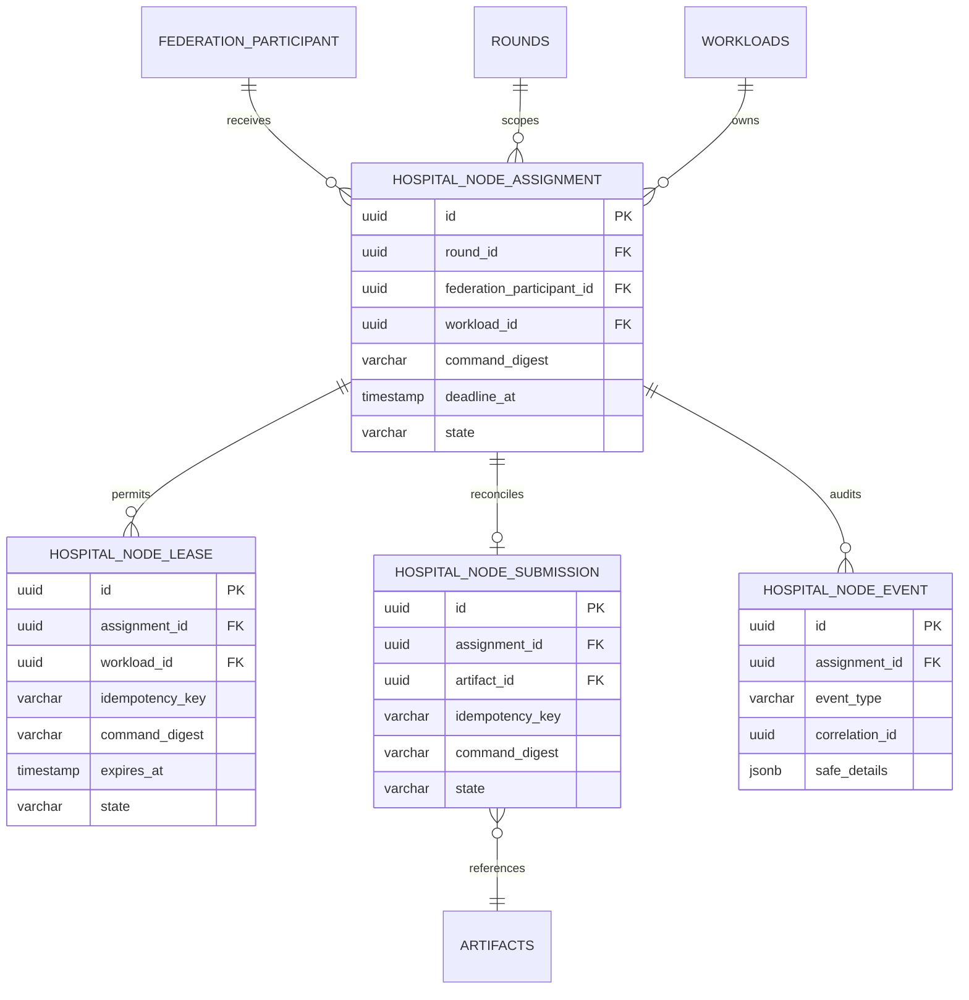
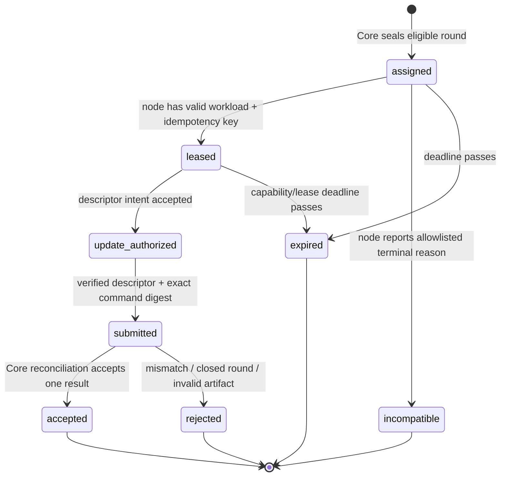
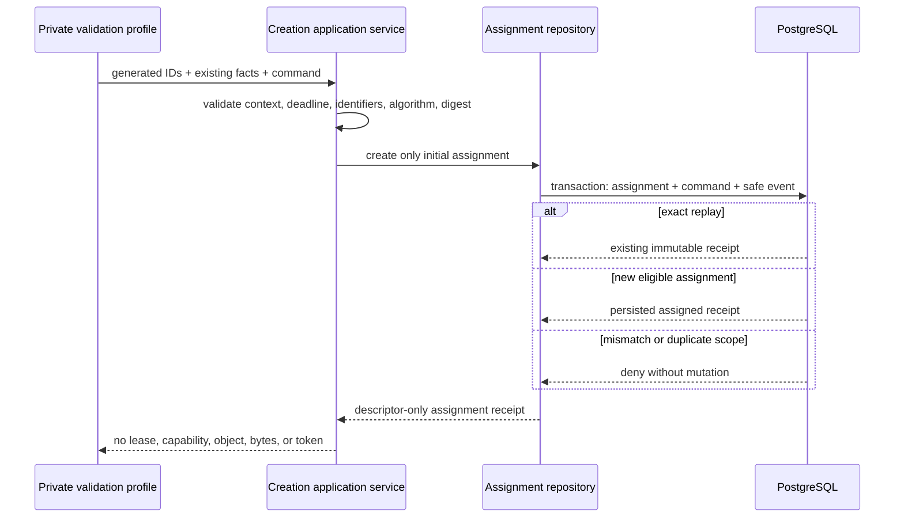
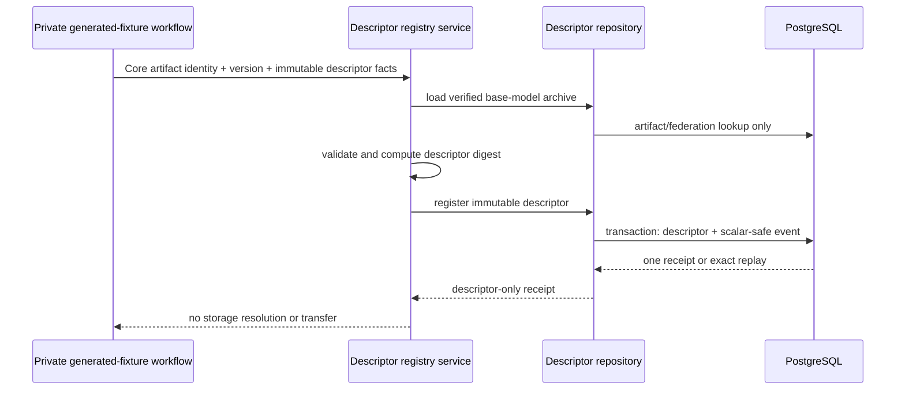

# Core — Hospital Node Workload Contract Design

**Status:** Additive Core lease, descriptor-only read-intent, and Core-mediated generated-model stream boundaries implemented and bounded Azure proofs validated; Agent local receipt/value persistence and fake-first in-memory verification implemented locally; Agent typed transport/private-workspace contract published but unimplemented; artifact update capability, submission, and training boundaries remain proposed.
**Decision date:** 22 August 2026  
**Depends on:** the public Hospital Node Agent dossier and the current Core artifact, workload-identity, aggregation, and audit boundaries.

## 1. Decision and non-negotiable boundary

The Core will add a **distinct `hospital_node` workload API** for assigned local training. It will not repurpose the human artifact-intent/round routes or the internal `ml_worker` aggregation-result callback. A node receives a round-scoped immutable command, short-lived read/upload capabilities, and submits a descriptor only. The Core remains authority for federation eligibility, protocol, round lifecycle, artifact verification, aggregation, candidate, release, and audit.

> The Core receives no raw image, patient identifier, local path, free-form local log, token, storage credential, model/update byte stream in an HTTP body, or editable local training configuration.

The proposed contract preserves already-existing Core facts: `hospital_node` is already a distinct workload kind alongside `ml_worker`; federation participation relates a workload to a federation; and `model_update_archive` is already an artifact category. The current routes, however, are still not node-usable because their guards/audience/policy remain human-only or `ml_worker`-only. [1] [2]

## 2. Required Core additions

| Concern | Additive design | Explicit non-design |
|---|---|---|
| OIDC audience | New audience **`fedagg-hospital-node`** accepted only by a dedicated `HospitalNodeAuthGuard`. | Reusing the `fedagg-worker-callback` audience or `ml_worker` principal. |
| Principal policy | Require active workload, `workloadKind = hospital_node`, matching organization, active federation participant, assigned open round, and unexpired lease. | Treating a workload as a human membership or granting federation-wide access from a token alone. |
| Assignment | Core-created one-assignment-per-round-participant projection with immutable command digest and deadline. | A node selecting a round, algorithm, model, local epochs, or release. |
| Object transfer | Core service creates existing descriptor-only artifact/upload-intent records after a valid lease. Direct object transfer uses a short-lived capability outside the Core API body. | Returning an object key, long-lived storage credential, or model/update byte stream from a Core route. |
| Submission | Node submits assignment ID, command digest, artifact descriptor, safe summary, and idempotency key. Core verifies exact assignment, verified artifact, checksum, size, and round state. | Allowing an unverified upload, a stale command, or a duplicate submission to affect aggregation twice. |
| Incompatibility | Node may write one allowlisted terminal code with safe environment category. | Patient-data diagnostics, raw Python exception text, dataset paths, or automatic round cancellation. |

## 3. Additive persistence model

The existing `federation_participants`, `rounds`, `artifacts`, `upload_intents`, aggregation job, outbox, round-event, and audit structures remain authoritative. The new tables link to them; they do not duplicate protocol, artifact bytes, object locators, human memberships, or OIDC secrets.

| Table | Core-owned fields | Critical constraints |
|---|---|---|
| `hospital_node_assignments` | round, participant, workload, immutable command digest, deadline, state, correlation ID. | Unique `(round_id, workload_id)`; active participant/workload must match at creation; no command JSON with data/local path fields. |
| `hospital_node_leases` | assignment, workload, idempotency key, command digest, issued/expiry/consumed/revoked state. | Unique `(assignment_id, idempotency_key)`; one active lease per assignment; expiry is enforced transactionally. |
| `hospital_node_submissions` | assignment, artifact ID, command digest, idempotency key, allowlisted summary, submission state. | Unique assignment and idempotency constraints; artifact must belong to assigned organization/round, have category `model_update_archive`, and be verified. |
| `hospital_node_events` | assignment event type, Core correlation ID, allowlisted reason/environment category, timestamp. | Append-only; safe-detail schema rejects unknown keys and all text blobs. |

## 4. Lifecycle and transaction rules

The assignment is created by a Core round service only after a round has the required frozen protocol/base-model facts and the participant’s active `hospital_node` workload is eligible. Leasing must atomically confirm principal, assignment, participant, round, deadline, and idempotency conditions before returning the canonical command. Update intent must atomically bind the new artifact record to the assignment and current lease. Submission must atomically ensure that the artifact is verified, descriptor fields equal the stored expected values, the assignment command digest equals the node-provided digest, and no accepted/terminal duplicate exists. On success it records safe audit/event/outbox evidence; aggregation dispatch proceeds under the existing Core policy rather than from the node itself.

An unknown transport outcome is never treated as permission to retrain or duplicate-submit. The node reuses the idempotency key and the Core returns the prior safe result. A capability/lease expiry is terminal for that capability and may require a new lease only while the assignment deadline and round remain open.

## 5. Proposed HTTP surface

All routes require `HospitalNodeAuthGuard` and the `fedagg-hospital-node` audience. They return no raw model/update bytes, object locator, credential, raw audit details, protected human policy, or other workload’s assignment.

| Route | Request | Safe response | Invariants |
|---|---|---|---|
| `GET /v1/workloads/self/assignments?cursor=` | Cursor only. | Assigned ID, status, expiry/deadline, digest summary, opaque cursor. | Returns only active principal’s eligible assignments. |
| `POST /v1/workload-assignments/:assignmentId/lease` | Idempotency key. | Immutable command; time-bounded **read capability** response. | Exact principal/assignment/workload; canonical command digest; no route chooses training configuration. |
| `POST /v1/workload-assignments/:assignmentId/update-intents` | Lease/idempotency binding; content type; expected checksum and size; manifest digest. | Artifact ID and time-bounded **write capability** response. | Assignment must be leased/open; creates only `model_update_archive`; no storage locator in Core persistent/event response. |
| `POST /v1/workload-assignments/:assignmentId/submissions` | Artifact ID, checksum/size/manifest digest, command digest, bounded training summary, idempotency key. | Accepted/rejected/retry-safe status plus correlation ID. | Verified descriptor, exact assignment binding, exact digest, one terminal result. |
| `POST /v1/workload-assignments/:assignmentId/outcomes` | Allowlisted incompatibility code and bounded environment category; idempotency key. | Recorded terminal safe outcome and correlation ID. | Cannot update an accepted/expired assignment or include arbitrary diagnostics. |

## 6. Command, capability, and submission requirements

The established `hospital-node-command/v1` shape remains the input contract. The Core must calculate its canonical digest itself and return the immutable envelope only after lease authorization. It must reject a node-supplied different digest, unsupported schema, expired command, unknown preprocessing/model digest, non-positive byte count, or a training summary that exceeds protocol policy.

Capabilities are protected response objects rather than database records containing usable storage credentials. Their safe Core evidence contains only assignment ID, operation (`read_base_model` or `write_model_update`), resource digest, expiry, and a non-secret capability ID/digest. The actual transfer mechanism is a provider-issued time-bounded URL/header policy delivered only to the authenticated client; it is never logged, sent to the public docs, or stored in Core SQL.

The summary is an allowlisted object: completed local epochs, policy-approved coarsened sample-count value when enabled, environment fingerprint digest, dataset-declaration digest, and bounded duration/resource category. It has no free text, arrays of metrics, local paths, image/patient fields, host details, raw logs, or update bytes.

## 7. Authorization matrix

| Action | Required principal and state | Must deny |
|---|---|---|
| List or lease | Active `hospital_node`; current assignment workload/organization/participant; assigned and unexpired. | `ml_worker`, human user, inactive workload, another hospital node, expired/terminal assignment. |
| Create update intent | Same active leased hospital node; open round; exact lease/idempotency binding. | Arbitrary artifact intent; other artifact category; stale/consumed lease. |
| Submit update | Same principal; verified bound artifact; open submission state. | Raw bytes, unverified/mismatched artifact, changed command digest, duplicate terminal state, human/ML-worker token. |
| Report incompatibility | Same principal; nonterminal assignment; allowlisted code. | Arbitrary exception string, accepted assignment, another workload’s assignment. |
| Dispatch aggregation | Existing Core-only aggregation policy after valid accepted submissions. | Direct node-triggered aggregation. |

## 8. Required test and evidence sequence

| Layer | Required proof before the next layer |
|---|---|
| Domain/application | Assignment creation eligibility, lease uniqueness, deadline behavior, terminal immutability, digest equality, idempotent submission/outcome semantics. |
| PostgreSQL/migration | Additive migration; organization/participant/workload/round/artifact FK constraints; rollback-safe transaction tests; no secret/locator column. |
| HTTP/auth | New audience only; `hospital_node` kind required; human and `ml_worker` denial; cross-assignment and cross-organization denial; schema/unknown-field rejection. |
| Artifact | Intent binds assignment/lease; descriptor-only response; checksum/byte/manifest mismatch rejection; verified artifact required. |
| Audit/outbox | Safe event schema/snapshot; no capability/URL/token/bytes; exactly one correlation path for accepted/rejected/incompatible results. |
| Node/Core contract | Shared golden commands/submissions; fake Node adapter exercises capabilities and recovery; no new human-route use. |
| Bounded Azure lease proof | One separate `hospital-node-synthetic` client, one generated synthetic workload/assignment and canonical command, one guarded lease, descriptor-only response validation, and immediate assignment/lease expiry. |
| Future artifact/submission Azure proof | Only after the relevant contracts, schema, authority, capability, and reconciliation tests exist: a verified descriptor intent and submission through the new node-only route, with no object locator, credential, bytes, or clinical data exposed. |

## 9. Delivery order and non-claims

1. Add Core domain/application contracts plus additive schema and tests.
2. Add dedicated audience/guard and guarded workload controller with fake storage/identity integration tests.
3. Extend descriptor-intent/verification/reconciliation through the new assignment service only; retain existing human/worker routes unchanged.
4. Use shared Node/Core fixtures and a local simulated node before Azure.
5. Run one bounded Azure synthetic proof only after all contract gates pass; record safe states/digests/IDs, immediately restore default-disabled behavior, and do not describe it as hospital deployment.

This design does **not** authorize a real hospital, clinical trial, real patient data, BreaKHis image transfer, public node endpoint, data-mount on Azure, automatic retry, Redis Sentinel work, blockchain/IPFS, MetaMask/SIWE, or Core release policy change.

## 10. Implementation record — first policy slice

Core commit `79bdcee` implements the first delivery-order item only: shared assignment/lease vocabulary; an explicit Core domain state-transition matrix; a lease-eligibility rule requiring active `hospital_node` kind, active participant, open round, assigned state, and unexpired deadline; an application repository port; and three deterministic application tests. It deliberately has **no** PostgreSQL migration, persistence adapter, Nest controller, OIDC audience/guard, Keycloak client, artifact capability, submission path, Node-to-Core request, or Azure synthetic node.

The full Core suite passed locally with 46 TypeScript tests (including database integration coverage) and 9 Python tests. GitHub Core Quality Gates completed successfully in 1 minute 32 seconds; the protected Azure deployment also completed successfully for `79bdcee4d336fb0b587e31310b2c341cf220c2ea`. Public liveness and strict dependency readiness both returned HTTP 200 after that policy-only rollout. The existing worker remains default-disabled; no worker profile, environment example, workload credential, or runtime activation change is part of this commit.

## 11. Implementation record — additive persistence slice

Core commit `31e7588` adds reviewed migration `0010_hospital_node_assignments.sql` and matching Drizzle declarations for Core-owned assignment, lease, and append-only safe-event records. The schema constrains every record through existing federation participant, round, and workload foreign keys; makes `(round_id, workload_id)` unique for assignments; makes `(assignment_id, idempotency_key)` unique for leases; and stores only digest, deadline/state, correlation, safe event type, and a scalar-only safe-details object. It contains no data field, path, token, capability, signed URL, object key, artifact byte, or remote response column.

The full local Core suite again passed with 46 TypeScript tests and 9 Python tests, including migration/integration execution. Core Quality Gates completed successfully in 1 minute 36 seconds and the protected Azure deployment completed successfully for `31e7588f0c57e5f14597e1927b75c5c903a87828`. Public liveness and strict dependency readiness returned HTTP 200 after the migration rollout. The deployment refreshed the existing containers but did not expose or call a hospital-node route; there is still no persistence adapter, controller, audience/guard, Keycloak client, update capability, submission path, real node, hospital data, or worker-gate change.

## 12. Implementation record — distinct identity guard

Core commit `92c6c53` adds `HospitalNodeAuthGuard` as a separate Nest provider. It verifies only the `fedagg-hospital-node` audience, hydrates an active local workload principal, and rejects any principal whose local workload kind is not `hospital_node`. Its tests prove that a correct active hospital-node identity is attached to the workload request and that an active `ml_worker` is refused. The existing `WorkloadAuthGuard` remains bound to the internal `fedagg-worker-callback` audience and is unchanged; no controller currently uses the new guard.

The full local suite passed with 48 TypeScript tests and 9 Python tests, including migration/integration execution. Core Quality Gates completed successfully in 1 minute 42 seconds; the protected Azure deployment completed successfully for `92c6c53a2a690390450c7b7da4ea95ea7b33ef57`; and public liveness/readiness returned HTTP 200. No Keycloak hospital-node client, route, token, capability, assignment persistence adapter, submission path, Node request, hospital data, or worker-gate change was added. The Azure worker still logs its explicit default-disabled state.

## 13. Implementation record — lease repository and migration execution

Core commit `263e596` adds `PostgresHospitalNodeAssignmentRepository` and a migrated-database integration test. The repository returns a lease context only when assignment/workload/participant records agree; recovers an existing `(assignment_id, idempotency_key)` lease; refuses a second active lease; advances the assignment from `assigned` to `leased` only when assignment, workload, digest, and current state all match; and appends one scalar-only `lease_issued` event. The migration journal was updated so migration `0010` executes in automated and deployed databases, and a partial unique index now enforces one active lease per assignment at the database boundary.

The full local suite passed with 49 TypeScript tests and 9 Python tests, including the new migrated-database lease test. Core Quality Gates completed successfully in 1 minute 37 seconds; the protected Azure deployment completed successfully in 2 minutes 49 seconds for `263e596a8e00dd77af476f4310c4c6a0de891839`; and public liveness/readiness returned HTTP 200. This still exposes no controller or route, Keycloak node client, capability, immutable command payload, artifact update intent, submission/reconciliation path, real node, hospital data, or worker-gate change.

## 14. Decision before route exposure — canonical command payload

The implemented Core protocol-version table currently contains the algorithm, architecture identifier, and immutable configuration digest, but it does not contain the exact fields that the already-tested Agent command validator requires: proximal coefficient, local epochs, model/preprocessing digests, and base-model checksum/size. A digest alone is insufficient to reconstruct or safely serve a command. Therefore, Core must add a **canonical descriptor-only command payload** to the assignment lifecycle before a lease route is exposed.

The new payload is strictly the `hospital-node-command/v1` value already validated by the Agent: assignment/correlation/federation/round IDs; expiry; algorithm/proximal coefficient/local epochs/model and preprocessing digests; and base-model checksum/byte size. It must exclude a provider URL, object key, credential, model byte, local data information, path, free text, or patient field. Core calculates the stored digest from that canonical payload at assignment creation and a lease route later returns the stored payload only after the existing assignment/participant/workload checks pass. This is an additive assignment column plus creation-policy work; it does not authorize a human route to hand-craft commands or allow a node to change any command field.

## 15. Implementation record — guarded lease endpoint

Core commit `0fd4e4b` adds the first dedicated hospital-node HTTP route: `POST /v1/workload-assignments/:assignmentId/lease`. It is guarded only by `HospitalNodeAuthGuard`, reads the workload ID from the verified workload principal rather than the request body, requires a UUID idempotency key, and delegates to the existing assignment/lease policy. Its successful response is deliberately limited to a lease receipt plus the already persisted canonical `hospital-node-command/v1` payload. It cannot return an object locator, provider URL, capability, credential, model byte, local data reference, or free-form diagnostic.

The controller test proves principal-derived workload binding and checks that the response serialization has neither `objectKey` nor `credential`. Full local CI passed with 50 TypeScript tests and 9 Python tests, including migration/integration execution. Core Quality Gates completed successfully in 1 minute 38 seconds; the protected Azure deployment completed successfully in 2 minutes 44 seconds for `0fd4e4b853fc46fa6afc3ef33a2ba8835e208c2f`; and public liveness/readiness returned HTTP 200. The route was not invoked against Azure because no hospital-node Keycloak client or pre-created assignment exists yet. There is still no assignment-creation route, Keycloak node client, base-model/update capability, artifact transfer, update submission/reconciliation route, real node connection, hospital data, or worker-gate change.

## 16. Decision before bounded endpoint proof — synthetic node identity and assignment fixture

The first endpoint proof will use one new **private Keycloak service client**, `hospital-node-synthetic`, with the `fedagg-hospital-node` audience and fixed `hospital_node` workload-kind claim. It will have its own Docker secret and host-side protected secret file; it will never reuse the `ml-worker` client, secret, audience, callback route, or workload mapping. Its token request, workload registration, synthetic federation/participant/round/assignment creation, and `POST /v1/workload-assignments/:assignmentId/lease` call will run only inside an opt-in bounded validation profile on the Core network.

The fixture will write only synthetic organization/federation/round metadata, a generated canonical command, digest/checksum/size descriptors, and allowlisted safe events. The profile must terminate after one expected lease response; the created assignment must be expired or otherwise made non-reusable immediately afterward, and the normal aggregation worker must remain default-disabled throughout. This proves audience separation, principal binding, canonical command retrieval, and idempotent lease behavior—not object transfer, training, update submission, clinical use, or a continuously operating hospital node.

## 17. Implementation record — bounded Azure hospital-node lease proof

Core commit `7d9218c` adds the deliberately opt-in `hospital-node-validation` Compose profile, a separate private `hospital-node-synthetic` Keycloak service client, an independent protected secret mount, and the one-shot `bounded-hospital-node-lease.mjs` runner. The normal deployment path does not start that profile. The client has the distinct `fedagg-hospital-node` audience and `hospital_node` workload claim; it does not reuse the ML-worker client, secret, audience, callback, or workload mapping. [5] [6]

The protected Azure deployment completed successfully after Core Quality Gates passed in 1 minute 37 seconds. Before the proof, the private client-credentials check succeeded without revealing its token or secret. The profile then ran **once**. It created generated synthetic Core facts only, mapped the separate workload identity, persisted one canonical descriptor-only command and its Core-computed digest, and called only `POST /v1/workload-assignments/:assignmentId/lease`. The runner accepted the response only when the assignment and digest matched and when the serialized response contained neither `objectKey` nor `credential`; it printed the safe success outcome only. No human route, ML-worker callback, object transfer, model training, update submission, real node, or hospital data path was invoked.

Post-run aggregate evidence recorded one expired synthetic assignment, zero active synthetic assignments, zero active synthetic leases, and one `bounded_validation_closed` safe event. The ephemeral runner was absent after completion, while Azure public liveness and readiness both returned HTTP 200. The aggregation worker remained configured as disabled and continued to log its default-disabled state. This is proof of a narrowly scoped Core lease boundary only; it is not a model-transfer, training, submission, reconciliation, hospital-integration, or clinical-use proof.

## 18. Next documented delivery gate — bounded assignment-creation authority

The next work is design-first, not a capability or submission implementation. The Core needs a narrowly privileged **synthetic assignment-creation authority** that can create an assignment only from eligible, already-frozen Core round and participant facts plus one Core-owned canonical command. It must not become a human self-service route, permit a node to select a round or training configuration, reuse the ML-worker identity, or create a general administrative bypass.

Before any code for this gate, the ledger must define the authority principal, input boundary, frozen-fact checks, idempotency and audit rules, terminal/expiry behavior, and the exact tests that prove denial for human, `ml_worker`, stale, cross-organization, and non-frozen inputs. Only after that authority is accepted should the design progress to safe base-model read capability, update-intent creation, verified artifact reconciliation, and node-only update submission. The successful lease proof does not authorize those later boundaries.

## 19. Increment A design — synthetic assignment-creation authority

### 19.1 Scope and authority boundary

This increment creates **no HTTP endpoint** and grants no human, hospital-node, or ML-worker principal the power to create an assignment. The authority is a private Core application service used only by a profile-gated, generated-fixture validation workflow. Its caller is a trusted Core process, not an OIDC subject. The service may create one initial `assigned` record from already persisted, generated Core facts and one Core-owned `hospital-node-command/v1` envelope; it cannot lease, issue a capability, transfer an object, train, submit an update, dispatch aggregation, or release a model.

> A synthetic creation authority is a bounded test-control capability, not a participant-facing API and not a general administrative bypass.

| Decision | Increment A rule | Explicit denial |
|---|---|---|
| Caller | Private synthetic-validation workflow invokes the application service directly. | Every browser, human API, hospital-node token, ML-worker token, callback, queue consumer, or public route. |
| Authority input | One UUID assignment identity, one UUID correlation identity, one existing participant/round/workload relationship, one future deadline, and one descriptor-only command. | Node-selected round, organization, algorithm, local epoch count, base-model locator, local path, bytes, free text, credential, or patient field. |
| Initial state | Persist exactly `assigned`; the existing lease service remains the only path to `leased`. | Direct creation of a lease, update authorization, submission, acceptance, or terminal success. |
| Evidence | Append one scalar-safe `assignment_created` hospital-node event in the same database transaction. No dispatch occurs, so this increment creates no outbox event. | Raw request payload, token, storage capability, URL, locator, bytes, environment details, or a fabricated operational audit trail. |
| Runtime | Source and tests deploy with the ordinary Core release; the authority executes only when a future explicit validation profile is enabled. | Re-running the completed lease proof, enabling the aggregation worker, or leaving a continuously active creation service. |

### 19.2 Required inputs and frozen-fact checks

The application service receives a fully specified `CreateSyntheticHospitalNodeAssignment` value from the private workflow. It reconstructs no clinical configuration and accepts no arbitrary JSON. Before repository mutation, it must load and verify that the existing workload is active and `hospital_node`; the active federation participant references that same workload and organization; the participant belongs to the supplied federation; the round belongs to that federation, is `open`, and references an existing protocol version; and the command names the same assignment, correlation, federation, round, and exact future deadline.

The command stays Core-owned: the service calculates `hospitalNodeCommandDigest(command)` itself and persists that result. Its algorithm must equal the round protocol algorithm, and its expiry must equal the assignment deadline. The source must reject a malformed schema version, non-positive base-model byte size, non-future expiry, mismatched identifiers, changed digest, inactive/suspended/revoked workload or participant, non-`hospital_node` workload, cross-federation round, or a non-open round. Protocol fields not currently represented in the Core protocol-version record remain fixed generated fixture facts in this increment; no human or node may supply them.

### 19.3 Persistence, replay, and terminal behavior

No schema migration is required for this increment. The current `hospital_node_assignments` primary key, `(round_id, workload_id)` uniqueness rule, one-to-one `hospital_node_commands` record, and append-only `hospital_node_events` table are sufficient. The repository must perform all of the following atomically: check context; calculate/compare the canonical command digest; insert the assignment with state `assigned`; insert exactly one matching command record; and append one `assignment_created` event with a scalar-safe source label such as `synthetic_validation`.

Creation replay identity is the Core-generated assignment UUID. A retried call with the same UUID must return the existing safe assignment receipt only if workload, participant, round, correlation, deadline, command, and canonical digest all match exactly. A changed replay must fail. A different UUID for the same `(round, workload)` must fail the existing unique boundary. This increment does not expire assignments automatically; the existing bounded validation teardown or a later explicit lifecycle job remains responsible for terminal expiry. No creation call can resurrect a terminal assignment.

### 19.4 Application and persistence surface

The new application port will expose a create method separate from the current lease method. Its safe result contains assignment ID, participant ID, workload ID, round ID, correlation ID, command digest, deadline, and `assigned` state only. It does not return the command body to the caller unless a later workflow requires it; lease remains the command-disclosure boundary. The Postgres adapter will extend the existing assignment repository rather than create a parallel data path, preserving the current canonical-command verification performed during a lease. [7]

| Layer | Additive responsibility | Must not do |
|---|---|---|
| Domain | Validate initial-state eligibility and immutable command-to-context consistency. | Know SQL, OIDC, HTTP, storage, or generated data content. |
| Application | Coordinate time, canonical digest, context validation, safe replay semantics, and repository call. | Accept a human principal, dispatch work, or widen the lease service. |
| Postgres adapter | Atomically persist assignment, command, and scalar-safe event; return a receipt or exact replay. | Store URLs, credentials, object keys, bytes, local path/data fields, or arbitrary diagnostics. |
| Validation profile | Generate the synthetic prerequisite facts and call the service only when explicitly enabled. | Become a daemon, public client, normal deployment dependency, or evidence of hospital operation. |

### 19.5 Required tests and acceptance evidence

| Test layer | Required evidence |
|---|---|
| Domain unit | Reject wrong workload kind/status, participant status, non-open/cross-federation round, identifier mismatch, past deadline, non-positive size, algorithm mismatch, and any attempt to begin outside `assigned`. |
| Application unit | Prove Core-calculated canonical digest, exact replay return, changed-replay refusal, and that creation returns a safe receipt without invoking lease, capability, dispatch, or submission behavior. |
| PostgreSQL integration | Prove atomic insertion of one assignment, one command, and one safe event; exact replay produces no duplicate rows; competing assignment for `(round, workload)` fails; mismatch rolls back all writes. |
| Regression | Preserve existing lease behavior: only an authenticated active hospital-node workload can transition the newly created record from `assigned` to `leased`; `ml_worker` and human routes remain denied. |
| Deployment | Pass Core Quality Gates and the protected Azure release; verify liveness/readiness HTTP 200 and the default-disabled aggregation-worker log. No runtime profile is invoked as part of this increment. |

The next code change may implement only these described domain, application, port, Postgres, and tests. Any capability, transfer, update intent, verification, submission, or new Azure execution must begin with its own design record.

## 20. Implementation record — private synthetic assignment authority

Core commit `a0f423b` implements Increment A without adding a controller, route, guard exception, OIDC client, profile invocation, migration, or runtime worker change. It adds a framework-free `SyntheticHospitalNodeAssignmentCreationService`, a separate repository port, an explicit domain eligibility policy, and a Postgres adapter extension. The service has no principal parameter and is not registered as an API provider; only a future private validation composition may instantiate it.

The service loads persisted workload, participant, round, and protocol facts; requires active `hospital_node` and participant state, same organization/federation binding, an open round, and algorithm/identifier/expiry/descriptor consistency; calculates the canonical command digest itself; and creates only an initial `assigned` receipt. The adapter atomically writes one assignment, one one-to-one canonical command record, and one scalar-safe `assignment_created` event. An exact assignment-UUID replay returns the existing receipt only when every immutable fact and canonical command match; a changed replay or a second assignment for the same `(round, workload)` fails. No storage locator, capability, credential, token, bytes, data field, path, free-text diagnostic, lease, outbox event, dispatch, or submission is written.

Local quality passed with 60 TypeScript tests and 9 Python tests, including four domain-eligibility tests, three application-service tests, and three migrated PostgreSQL creation tests in addition to existing regression coverage. GitHub Core Quality Gates completed successfully in 1 minute 41 seconds, and the protected Azure deployment completed successfully in 3 minutes 1 second. The deployed release returned public liveness/readiness HTTP 200, while the aggregation worker remained configured as disabled and logged its default-disabled state. No profile was run for this increment, so this is deployment evidence for the code boundary—not proof of a new assignment-creation execution.

## 21. Next documented delivery gate — bounded creation-only composition proof

The next increment must prove that the private service is composed and used by a controlled generated-fixture workflow before any model-read capability design begins. The current lease runner used direct SQL to build its synthetic assignment fixture because the authority did not yet exist. A **new creation-only validation runner** must instead seed only the already-established generated prerequisite facts, invoke `SyntheticHospitalNodeAssignmentCreationService` for the assignment/command/event write, assert the descriptor-only receipt and exact-replay behavior, expire the fixture, and append a single scalar-safe closure event.

This runner must be a new opt-in Compose profile with no public port, no human endpoint, no hospital-node token requirement, no ML-worker identity, no aggregation-worker enablement, no object storage, and no lease call. It may depend on migrated PostgreSQL but it must not be a normal deployment dependency or a daemon. Its safe output must say only whether the private creation authority accepted the generated facts, persisted one immutable assigned record and one command/event, recovered an exact replay, and closed the assignment. No record IDs, command body, token, secret, provider response, database URL, object locator, bytes, or local path may be emitted.

| Required proof step | Allowed evidence | Must remain absent |
|---|---|---|
| Generated prerequisites | Safe count/category that Core-side generated facts were seeded. | Any hospital, patient, image, path, dataset, or clinical field. |
| Service composition | Safe assertion that the private application service calculated the canonical digest and returned `assigned`. | Direct assignment insert for the created record, HTTP request, OIDC token, or a human principal. |
| Exact replay | One safe statement that replay returned the same descriptor-only receipt. | A second assignment/command/event, a new lease, or changed command acceptance. |
| Closure | Aggregate terminal state and one safe closure event. | Active assignment, active lease, capability, transfer, submission, job, or worker enablement. |

The runner, Compose profile, tests, and its bounded Azure execution require their own implementation record. Only after this creation-only proof is complete should the next design consider a time-bounded base-model read capability.

## 22. Implementation and evidence record — bounded creation-only composition proof

Core commit `0b48aeb` adds the new opt-in `hospital-node-assignment-creation-validation` Compose profile and its one-shot `bounded-hospital-node-assignment-creation.mjs` runner. The profile has no public port, no API, Keycloak, OIDC, storage, MinIO, aggregation-worker, dispatch-worker, or lease dependency. It depends only on completed migrations and receives the ordinary private database runtime configuration. The source runner is syntax-checked, and local full quality passed with 60 TypeScript tests and 9 Python tests. Core Quality Gates completed in 1 minute 48 seconds; protected Azure deployment completed in 2 minutes 46 seconds. [9] [6]

The first operator invocation stopped during Compose interpolation before a container was created because the general Compose topology requires protected secret-file references even though this profile consumes neither identity nor secret. It was rerun with only non-secret file references necessary to resolve the existing topology; no secret value was read or emitted. The validation container then built and ran **once**. It inserted generated prerequisite organizations, workload, federation, participant, protocol, and round facts only. The assignment itself was created exclusively by `SyntheticHospitalNodeAssignmentCreationService`, which computed the canonical command digest, returned an `assigned` descriptor-only receipt, and recovered one exact replay. Direct database access in the runner was limited to allowed prerequisite seeding, safe evidence assertions, and terminal cleanup—not the assignment/command/event creation under proof.

The runner accepted success only if the receipt matched the generated assignment and Core-computed digest, the receipt contained neither `objectKey` nor `credential`, exactly one `assignment_created` event and one canonical command existed, and exact replay returned the same receipt. It then expired the fixture and wrote one `bounded_assignment_creation_closed` safe event. Aggregate post-run evidence was **one closure event, one expired synthetic assignment, and zero active synthetic assigned/leased records**. The ephemeral runner had zero remaining instances. Azure public liveness and readiness both returned HTTP 200, and the aggregation worker remained configured as disabled with its default-disabled log state.

This proves the private creation service is actually composable and bounded for generated facts. It does **not** prove model access, object transfer, storage capability issuance, node download, training, update creation, update submission, aggregation, clinical integration, or hospital operation. No human route, `ml_worker` identity, hospital-node token, lease call, storage locator, credential, byte stream, data record, or model artifact was used.

## 23. Next documented delivery gate — descriptor-only base-model-read intent

The next increment is a design-only **base-model-read intent** boundary. It will not authorize a download or mint a signed URL. Its purpose is to give an already authenticated, active `hospital_node` workload an idempotent Core-owned record that a specific active lease is eligible to request base-model access later, while retaining every locator, credential, provider response, and model byte outside both API and PostgreSQL.

| Boundary decision | Required rule | Explicitly not provided |
|---|---|---|
| Caller | Only the existing `HospitalNodeAuthGuard` may reach a new node-only intent endpoint; workload ID is derived from its verified `fedagg-hospital-node` principal. | Human/admin route, `ml_worker` callback, reused secret, arbitrary workload header, public page, or browser portal. |
| Preconditions | Assignment and lease must match the principal workload, be `leased`/`active`, unexpired, and bound to the unmodified canonical command digest. The round remains in its permitted state. | Intent for an `assigned`, expired, consumed, revoked, cross-workload, cross-round, or changed-command lease. |
| Base-model evidence | Core must resolve a verified, Core-owned artifact reference from the frozen base-model version and preserve only immutable descriptor identity, checksum/digest, size, assignment, lease, and expiry. | Object key, URL, bucket, storage provider response, credential, byte range, model bytes, preprocessing payload, or patient field. |
| Persistence | Additive `hospital_node_base_model_read_intents` record with exact request idempotency, one active intent per lease, state (`issued`, `expired`, `revoked`), expiry, descriptor digest, and scalar-safe events. | A general capability table that permits upload, update submission, model release, queue dispatch, or a bearer credential. |
| Response | Descriptor-only intent receipt: IDs, command/base-model digest, size, expiry, and state. | Download link, credential, locator, bytes, opaque provider token, or an assertion that data has been read. |
| Later resolution | A separately designed private storage adapter may consume a live intent only after its own contract and proof exist. | Any object lookup, presigned URL, storage call, or Agent download in this increment. |

### 23.1 Required contract, flow, and tests before code

The contract must introduce a versioned `hospital-node-base-model-read-intent/v1` receipt with no expandable free-form payload. The request contains only an assignment identifier and UUID idempotency key; all workload, lease, model, round, protocol, and descriptor binding comes from Core records. Domain policy must reject every non-active/context-mismatched lease before persistence. The application service must calculate the descriptor digest from Core-held immutable facts, not accept it from the node. The Postgres transaction must return only an exact replay, refuse competing active intent, append a scalar-safe `base_model_read_intent_issued` event, and emit no work-dispatch outbox event.

Before implementation, the data design must identify the authoritative mapping from a round’s `baseModelVersionId` to a verified artifact descriptor. If the existing Core schema cannot represent that mapping without a locator in the boundary, the mapping itself is a prerequisite design change; it must not be simulated by accepting a node-supplied checksum or storage reference. The endpoint must serialize a receipt through an explicit redaction test that asserts the absence of object keys, URLs, credentials, bytes, and provider response fields.

The test sequence must include domain denials for human/ML-worker principal paths, wrong workload, lease state, expiry, command digest, round, and model binding; application idempotency and redaction tests; migrated PostgreSQL atomicity/replay/one-active-intent tests; controller guard/principal tests; and a future creation-only Azure proof that issues then expires an intent without storage access. The current creation-only proof does not authorize that future proof or any object transfer.

## 24. Prerequisite design — Core-owned verified base-model descriptor mapping

### 24.1 Discovery and decision

The Core schema confirms that `rounds.baseModelVersionId` is an opaque string. It has no foreign-keyed, verified descriptor mapping, while the current `artifact_category` enum has no base-model archive category. Therefore the string cannot safely authorize a Hospital Node read intent: neither a node nor a service may infer checksum, byte size, model digest, preprocessing digest, or artifact identity from it. The read-intent gate is consequently blocked until this separate Core-owned mapping is available. [4]

The next implementation will add a **private verified base-model descriptor registry**, not a retrieval API. It establishes immutable Core facts from an already verified artifact so later Hospital Node policy can prove that the command, round version, and selected base model agree. It will not resolve an object, call storage, issue a capability, return a locator, or let a node choose a model.

### 24.2 Additive schema and descriptor shape

Migration `0012_hospital_node_base_model_descriptors` will add the `base_model_archive` artifact category and the following registry. The existing internal `artifacts.objectKey` remains confined to existing Core storage code; this registry, application service, API, event data, tests, and public documentation must not copy or serialize it.

| Field | Purpose | Boundary rule |
|---|---|---|
| `id` | Opaque Core descriptor identity. | Never a provider/object identity. |
| `federation_id` | Binds the base-model version to its federation. | Must equal the round federation. |
| `base_model_version_id` | Freezes the existing round string as a Core lookup key. | Unique within federation; never node-selected for an active assignment. |
| `artifact_id` | References one existing `verified` `base_model_archive` artifact. | Storage locator remains in the artifact repository only. |
| `model_digest`, `preprocessing_digest` | Immutable training-compatibility facts. | Must match the canonical command before any later intent. |
| `checksum_sha256`, `byte_size` | Frozen descriptor evidence copied from the verified artifact. | Positive and equal to the verified artifact; no bytes. |
| `descriptor_digest` | Canonical Base64 SHA-256 digest over the registry’s descriptor-only values. | Calculated by Core, never supplied by a node. |
| `state` | `active` or `revoked`, with time/audit fields. | Revocation prevents future intents; no replacement mutation. |
| `hospital_node_base_model_descriptor_events` | Append-only registry evidence: descriptor ID, `base_model_descriptor_registered` or `base_model_descriptor_revoked`, correlation ID, and scalar-safe details. | No assignment dependency, object key, URL, provider response, token, bytes, or free text. |

The registry will have unique constraints on `(federation_id, base_model_version_id)`, `artifact_id`, and `descriptor_digest`. No update can replace its artifact or descriptor values. A revocation is an additive state transition with a scalar-safe event, not a deletion. The existing round string deliberately stays unchanged in this increment; the mapping gives it authoritative meaning without a breaking round migration.

### 24.3 Authority, workflow, and receipt

Only a private synthetic-validation application service may register a generated descriptor during this first mapping slice. It receives a Core-held artifact identity and registry facts, loads the artifact and federation, and rejects it unless the artifact is `verified`, category `base_model_archive`, federation-bound, positive-size, and checksum-consistent. It computes `descriptor_digest`, writes the immutable registry record, and appends one scalar-safe `base_model_descriptor_registered` registry event in the same transaction. It creates no assignment, lease, intent, OIDC principal, capability, storage call, dispatch, or outbox event.

The safe registration receipt contains only registry ID, federation ID, base-model version ID, artifact ID, model/preprocessing/descriptor digests, checksum, size, state, and timestamp. It contains no `objectKey`, `objectVersion`, bucket, URL, credential, provider response, content, bytes, local path, patient field, or free-text diagnostic. Exact registration replay returns the same receipt only when all immutable values agree; a changed replay, wrong federation, non-verified artifact, incorrect category, checksum/size mismatch, duplicate version, or duplicate artifact/digest fails without partial writes.

### 24.4 Required tests and proof sequence

| Layer | Required evidence | Prohibited behavior |
|---|---|---|
| Contract/domain | Canonical digest is deterministic; category/status/federation/size/checksum/revocation rules reject invalid facts. | Accepting node-supplied locator, bytes, provider data, or arbitrary JSON. |
| Application | Core resolves the artifact itself, returns a redacted receipt, and permits only exact replay. | HTTP, OIDC, lease, intent, capability, storage adapter, or dispatch invocation. |
| PostgreSQL | Migration and constraints prevent conflicting version/artifact/digest records; atomic registration writes one safe registry event. | Copying `object_key` into the registry/event/receipt. |
| Azure deployment | Core Quality Gates, protected release, liveness/readiness, and disabled worker must pass. | Any profile execution before the deployment gate passes. |
| Bounded future proof | One private generated registry record is registered, replayed exactly, revoked or otherwise closed, and observed only through aggregate-safe facts. | Model download, storage resolution, lease call, read intent, training, update, submission, aggregation, or real hospital data. |

Only after this registry is implemented, deployed, and evidenced may the previously documented base-model-read intent boundary begin. The later intent will consume the registry digest and immutable facts; it will not rediscover or expose an artifact location.

## 25. Implementation record — verified base-model descriptor registry

Core commit `9fce888` implements migration `0012_hospital_node_base_model_descriptors`, which adds the private `base_model_archive` artifact category, `hospital_node_base_model_descriptors` registry, independent scalar-safe registry-event table, and an `active`/`revoked` state vocabulary. The registry has unique federation/version, artifact, and canonical descriptor-digest constraints; it stores federation, version, artifact identity, model/preprocessing digest, checksum, byte size, state, and correlation only. It does not copy `artifacts.objectKey`, object version, bucket, URL, credential, provider response, bytes, local path, patient field, or free text into its table, event, or safe receipt. [11]

The framework-free private service loads artifact facts itself, requires a verified same-federation `base_model_archive`, computes a canonical descriptor digest, persists one immutable active descriptor and one `base_model_descriptor_registered` event atomically, and recovers only an exact replay. Domain tests reject invalid status/category/federation/checksum/size before a repository write; application tests assert Core digest calculation and receipt redaction; migrated PostgreSQL tests prove one descriptor/event, exact replay, and conflicting-version refusal. The mapping is not an HTTP endpoint and has no OIDC principal, lease, read intent, capability, storage adapter, object lookup, download, dispatch, update, submission, or aggregation behavior.

Local full quality passed with **68 TypeScript tests and 9 Python tests**. Core Quality Gates completed successfully in **1 minute 44 seconds**; protected Azure deployment completed successfully in **2 minutes 45 seconds**. Azure public liveness/readiness returned HTTP 200, and the aggregation worker remained configured as disabled with its default-disabled log state. No bounded mapping runtime profile was added or run, so this is deployment and persistence evidence only—not proof of descriptor registration against a deployed artifact and not a model-access proof.

## 26. Resumed delivery gate — descriptor-only base-model-read intent implementation

The mapping prerequisite is complete. The next code increment may now implement the previously documented `hospital-node-base-model-read-intent/v1` issuance boundary, but only as a guarded descriptor-only receipt. It must consume the active registry’s immutable digest and facts, not any storage location. Before code, its exact domain/application/persistence/controller test set and migration must remain aligned to Section 23; before a future Azure run, the route must be deployed, liveness/readiness and the disabled worker must be verified, and its separate proof must issue then expire an intent without storage access.

## 27. Implementation record — guarded descriptor-only base-model-read intent

Core commit `d9b55fc` implements migration `0013_hospital_node_base_model_read_intents`, a `issued`/`expired`/`revoked` receipt-state vocabulary, one active intent per lease, assignment/idempotency replay protection, positive descriptor size, and scalar-safe `base_model_read_intent_issued` evidence. It adds only `POST /v1/workload-assignments/:assignmentId/base-model-read-intents` under the existing dedicated `HospitalNodeAuthGuard`. The request supplies only a UUID idempotency key; the verified workload ID comes from the guard. The application service derives lease, command, round, descriptor, digest, checksum, size, correlation, and expiry from Core facts.

The private repository rechecks active `hospital_node` workload, leased assignment, active matching lease, open round, active descriptor, Core-bound federation/version mapping, unmodified command digest, and model/preprocessing/checksum/size equality before one receipt write. Exact replay returns the same receipt; a changed replay or competing active lease intent fails. The serialized result is `hospital-node-base-model-read-intent/v1` and carries only IDs, command/descriptor digests, checksum, size, state, and expiry. It has no object key, object version, bucket, URL, credential, provider response, model bytes, preprocessing payload, or patient field. The service and repository do not import a storage adapter, issue a capability, resolve an object, enqueue work, or perform training/submission.

Local full quality passed with **77 TypeScript tests and 9 Python tests**, including domain denials, application redaction, guarded-controller binding, and three migrated PostgreSQL atomicity/replay/one-active-intent tests. Core Quality Gates completed in **1 minute 54 seconds** and protected Azure deployment completed in **2 minutes 48 seconds**. Azure liveness/readiness returned HTTP 200; the aggregation worker stayed default-disabled. The route is deployed but has not yet been invoked in Azure, so this is implementation and deployment evidence only—not model access or transfer evidence.

## 28. Next documented delivery gate — one-shot read-intent issuance and expiry proof

The next validation is a new opt-in Compose profile named `hospital-node-base-model-read-intent-validation`. It will reuse only the existing separate `hospital-node-synthetic` Keycloak client and its protected file reference to authenticate the guarded Core request; it will not reuse the ML-worker identity, callback, audience, or secret. The profile will have no public port, no daemon behavior, no aggregation-worker enablement, and no storage/MinIO/S3 client or resolution call. Normal deployment must not start it.

| Proof step | Allowed action and evidence | Must remain absent |
|---|---|---|
| Generated prerequisites | Seed one generated organization/federation/workload/participant/protocol/open round, Core descriptor mapping, canonical command, assigned record, and active lease. Any database-only object reference required by the existing artifact schema stays internal and is never printed or returned. | Patient/image/data field, provider request, object resolution, URL, credential, bytes, hospital record, or real node. |
| Separate identity | Obtain one private token for the existing `fedagg-hospital-node` client and call only the guarded read-intent route once. | ML-worker identity/callback, human route, token/secret output, endpoint reuse, or a public service. |
| Receipt checks | Assert the `issued` state, matching assignment/lease/descriptor/command digest, and absence of object key, object version, URL, credential, provider response, and byte payload in the serialized response. | Download, storage metadata call, capability resolution, training, update, submission, dispatch, or aggregation. |
| Terminal closure | Mark the synthetic intent, lease, and assignment expired; write one `bounded_read_intent_closed` scalar-safe event; report aggregate closure counts and zero runner instances. | Active fixture, repeated route call, artifact movement, provider claim, model-read assertion, or worker enablement. |

The runner may write generated prerequisite facts and terminal cleanup directly only because they are Core-internal fixture setup/closure. It must not insert the intent itself: intent issuance under proof must occur through the guarded HTTP route and the new application service/repository. It must emit only safe success/failure markers. After deployment, the profile may run exactly once only after current release health and disabled-worker checks pass. This proof establishes authorization receipt issuance and closure only; it cannot establish storage access, a download, local training, model update, submission, aggregation, hospital connection, or clinical use.

### 28.1 Safe pre-route failure and workload-mapping correction

The first attempt to start the new profile encountered two configuration-prestart issues—an omitted explicit Compose file and a missing existing ML-worker **file reference** required only by the shared Compose secret interpolation. Neither started the profile. After those references were supplied without reading a secret value, the container built and began its generated-fixture transaction. It then stopped at the workload insert with PostgreSQL’s existing issuer/subject uniqueness constraint: the separate `hospital-node-synthetic` token subject already has the intended active Core workload mapping. The runner rolled the transaction back before any guarded API request, read-intent creation, assignment/lease closure, storage operation, object resolution, training, update, submission, dispatch, or aggregation action occurred.

This is a correctness signal, not a reason to create a second identity or bypass workload binding. The corrected runner will look up the existing active `hospital_node` workload by the verified issuer/subject pair and reuse only its Core workload and organization IDs for the generated federation-participant fixture. It will create fresh generated federation/round/descriptor/assignment/lease facts around that already-separate synthetic workload, then make the single guarded read-intent request. It will not print the subject, workload ID, organization ID, token, secret, database URL, or any generated identity. The corrected source must pass quality and protected deployment, and Azure liveness/readiness plus the disabled-worker gate must be rechecked before one corrected run.

### 28.2 Stale-image invocation correction

The workload-reuse correction passed local full quality, Core Quality Gates, and protected Azure deployment. A subsequent profile invocation nonetheless repeated the same pre-route duplicate-workload error before an API request because `docker compose run` reused the pre-correction local image tag; it did not build the newly released runner source. The resulting transaction again rolled back, leaving no intent, assignment/lease closure, storage operation, model access, training, update, submission, dispatch, or aggregation result.

The next and only remaining proof invocation must use `docker compose ... run --build` with the explicit deployed Compose file and the already required non-secret file references. The build step is an operational image-refresh safeguard, not a source or identity change. Before it runs, current release health and the default-disabled worker gate must be rechecked. Any runtime failure after the rebuilt runner begins its guarded request must be documented before another change or invocation; the profile must not be retried silently.

## 29. Evidence record — bounded Azure descriptor-intent issuance and expiry proof

The corrected workload-reuse runner commit `261a639` passed local full quality, Core Quality Gates, and protected Azure deployment. After a renewed release check showed public liveness/readiness HTTP 200 and the aggregation worker still disabled, the validation profile was invoked with an explicit image rebuild. The rebuilt runner reused the previously verified separate synthetic `hospital_node` workload mapping, created only fresh generated surrounding federation, participant, protocol, round, internal descriptor/assignment/lease facts, acquired the separate private client token, and called **only** `POST /v1/workload-assignments/:assignmentId/base-model-read-intents` once.

The response satisfied the descriptor-only contract: it had the expected intent state, assignment, lease, descriptor, command digest, and descriptor digest, while lacking object key, object version, URL, credential, provider response, and byte payload fields. The runner did not resolve an object, invoke a storage client, obtain a download URL, transfer model bytes, train locally, create an update, submit an update, dispatch work, invoke a worker callback, or enable aggregation. It then expired the synthetic intent, lease, and assignment and wrote `bounded_read_intent_closed`.

Aggregate terminal evidence was **one expired proof assignment, zero active leases, zero issued intents, one closure event, and zero remaining runner instances**. Azure liveness/readiness remained HTTP 200 and the aggregation worker remained disabled. The prior duplicate-workload and stale-image failures both rolled back before the guarded route; the rebuilt run is the sole successful guarded issuance proof. This establishes receipt authorization and closure only; it is not a storage-read, download, byte-transfer, training, submission, aggregation, hospital-operation, or clinical-use proof.

## 30. Next design gate — Core-mediated model-stream authorization

The next increment is design-only. A Hospital Node eventually needs model bytes for synthetic local training, but the system must not expose an object locator, bucket, provider credential, or presigned URL. The proposed boundary is a **Core-mediated model-stream authorization**: an authenticated `hospital_node` workload presents its own active read-intent receipt to a new node-only Core endpoint; Core validates workload ownership, unexpired issued intent, immutable descriptor/command binding, one-time consumption, and response headers, then streams verified bytes from an internal storage adapter over the existing authenticated connection. The node never receives storage credentials or an object address.

Before code, the ledger must define stream range policy, maximum response size, checksum verification behavior, content-type allowlist, cancellation and partial-transfer handling, intent-consumption timing, revocation/expiry race rules, binary audit evidence, rate limits, retention, and failure redaction. Its contract must make clear that a successful HTTP response is not training success and that no patient data, preprocessing input, local path, update, or model result may return to Core in the same increment. This design must be reviewed, tested, and separately proved with a generated non-clinical byte fixture before any Agent-side download or local FedAvg/FedProx integration begins.

## 31. Evidence record — bounded Azure Core-mediated generated-model stream proof

Core commit `707cf23` added the dedicated opt-in generated-fixture stream validation profile after the reviewed stream boundary from `d3516e4` was already deployed. Local full quality passed with 83 TypeScript and 9 Python tests. Core Quality Gates run `32567581955` succeeded in 2 minutes 1 second and protected Azure deployment run `32567581950` succeeded in 2 minutes 45 seconds from `707cf2367b96a5f8e4cde00120267238cef91eb6`. Renewed public/container liveness and readiness were HTTP 200 before the profile ran; the aggregation worker remained deployed but logged its explicit default-disabled state.

The profile used the explicit deployed Compose file and `run --build` once. It reused the existing separate synthetic `hospital_node` workload mapping, created one tiny generated non-clinical fixture by Core-private setup, created fresh generated supporting facts, obtained only the separate Hospital Node token for the guarded Core endpoints, issued one descriptor-only intent, and called the Core stream route once. The private runner compared body byte count/checksum and safe binary response behavior without emitting a fixture byte, storage locator, bucket, object version, provider endpoint/response, token, secret, header dump, database URL, local path, patient field, or training data.

Aggregate-safe terminal inspection observed one completed stream session, zero active stream sessions, one consumed intent, zero issued/streaming intents, zero active leases, one stream closure event, zero validation-runner containers, and HTTP 200 health after closure. The aggregate expired-assignment and expired-lease totals include earlier bounded fixtures and are therefore not presented as stream-run-only counts. The profile’s safe success marker confirms its generated stream state closed; fixture cleanup remained internal and was not inspected through any locator-bearing provider interface.

This establishes a one-shot **Core-mediated generated-fixture stream** only. It does not establish Agent receipt validation, local model persistence, direct storage access, model release, training, update packaging, update submission, aggregation, hospital operation, real data use, or clinical validity. The next gate is the separate Agent receipt-verification and synthetic-persistence dossier, which must be completed before implementation begins.

## 32. Evidence record — Agent local read-receipt contracts and persistence

Hospital Node Agent commit `a9561ff` implements the first Agent-side consumer prerequisite after the bounded Core stream proof. It adds the versioned `hospital-node-base-model-read-receipt/v1` projection; strict validators accept only scalar assignment/read-intent IDs, immutable digests, checksum, positive byte size, the exact generated-model content type, expiry, and `issued` state. Unknown token-, URL-, locator/version-, provider-, header/body-, path-, byte-, data-, and free-text-shaped fields are rejected. The corresponding observed-materialization value is scalar-only.

The Agent now has a pure local receipt state matrix and additive SQLite records for immutable receipt facts, a scalar observed materialization outcome, and append-only allowlisted events. Receipt issue plus its event, and later observed terminal outcome plus its event, are transactionally recorded. Exact issue replay is idempotent; terminal `verified` and `rejected` records remain terminal across a process restart. The code has no Core HTTP, OIDC, storage SDK, workspace, trainer, update, submission, aggregation, or Azure dependency.

Local quality passed with formatting, strict TypeScript, 17 TypeScript tests, and 4 Python tests. This is local contract/persistence evidence only: it does not prove a Core request, token use, response verification, bytes, workspace materialization, model delivery, training, submission, aggregation, hospital integration, real data use, or clinical validity. The next documented implementation gate is a fake-first local verification use case and temporary generated-fixture workspace adapter; a real Core client or Azure Agent proof remains prohibited until later slices are separately documented and validated.

## 33. Evidence record — Agent fake-first verification and generated-fixture cleanup

Hospital Node Agent commit `ec217dd` implements the next local consumer step without calling Core. The `verifyBaseModelReceiptLocally` use case accepts an already persisted receipt and generated in-memory byte chunks, incrementally computes checksum and byte count, compares exact scalar facts plus the allowlisted generated-model content type, and returns only a receipt ID, terminal class, and equality booleans. It does not expose a byte, temporary handle, promoted fixture, path, URL, raw header, token, credential, provider detail, or model payload.

The only workspace is an in-memory test adapter. It has temporary, promoted, cleaned, and discarded lifecycle counters but no filesystem or network operation. Exact generated bytes are promoted before the local terminal `verified` persistence step; if persistence fails, the fake fixture is discarded. A mismatch yields terminal `rejected` after temporary cleanup; an interrupted stream yields terminal `aborted` after cleanup; a restart-safe terminal receipt opens no workspace. These compensation semantics are local fake-state evidence, not a durable workspace, provider, Agent/Core transport, or production atomicity claim.

Local quality passed with formatting, strict TypeScript, 21 TypeScript tests, and 4 Python tests. No Core route, OIDC token, HTTP request, byte transfer across a network, filesystem path, storage provider, Azure resource, trainer, update, submission, aggregation, hospital system, real data, or clinical workflow was used. The next gate is a separately constrained typed Core client/private workspace design; it must not invoke Azure or enable training/submission/aggregation before its contract and quality records exist.

## 34. Design record — typed Agent Core client and private workspace adapter

The L4 documentation contract now fixes the next transport boundary before code. It allows only the separate hospital-node workload-token seam and exactly two guarded Core route families: descriptor-only intent issuance and the full-body Core stream. The contract accepts no direct object-store interaction, human/ML-worker identity, arbitrary URL/header map, redirect, Range request, partial response, raw header/body response, token/path/locator/provider projection, automatic retry, public listener, or training/update/submission/aggregation behavior.

The corresponding private workspace port receives a validated byte iterator and immutable expected facts but returns a receipt-only materialization capability. Its root/path/key/bytes/provider details remain adapter-internal and are excluded from Agent contracts, SQLite, events, status, logs, exports, and documentation. L4a is design evidence only. Its next code slice is L4b deterministic fakes, which must open no socket, token source, filesystem, provider, Azure resource, trainer, update, submission, or aggregation worker. A real client/workspace implementation and Agent/Core proof require later separately recorded gates.

## References

[1] [Hospital Node Agent Engineering and API Design](https://github.com/hstu-research/federated-aggregator-docs/blob/main/docs/HOSPITAL_NODE_AGENT_ENGINEERING_AND_API.md)

[2] [Hospital Node Agent Data and Schema Design](https://github.com/hstu-research/federated-aggregator-docs/blob/main/docs/HOSPITAL_NODE_AGENT_DATA_AND_SCHEMA.md)

[3] [Core workload identity port](https://github.com/hstu-research/federated-aggregator-core/blob/main/packages/application/src/ports/identity.ts)

[4] [Core persistence schema](https://github.com/hstu-research/federated-aggregator-core/blob/main/packages/persistence-postgres/src/schema.ts)

[5] [Bounded hospital-node lease runner](https://github.com/hstu-research/federated-aggregator-core/blob/main/infra/validation/bounded-hospital-node-lease.mjs)

[6] [Core Compose validation profile](https://github.com/hstu-research/federated-aggregator-core/blob/main/infra/deploy/compose.core.yaml)

[7] [Current Postgres hospital-node assignment repository](https://github.com/hstu-research/federated-aggregator-core/blob/main/packages/persistence-postgres/src/hospital-node-assignment-repository.ts)

[8] [Private assignment-creation application service](https://github.com/hstu-research/federated-aggregator-core/blob/main/packages/application/src/hospital-node-assignment-creation-service.ts)

[9] [Bounded assignment-creation validation runner](https://github.com/hstu-research/federated-aggregator-core/blob/main/infra/validation/bounded-hospital-node-assignment-creation.mjs)

[10] [Core round and artifact schema](https://github.com/hstu-research/federated-aggregator-core/blob/main/packages/persistence-postgres/src/schema.ts)

[11] [Verified base-model descriptor registry](https://github.com/hstu-research/federated-aggregator-core/blob/main/packages/persistence-postgres/src/hospital-node-base-model-descriptor-repository.ts)

[12] [Descriptor-only read-intent controller](https://github.com/hstu-research/federated-aggregator-core/blob/main/apps/api/src/hospital-node-assignments/hospital-node-assignments.controller.ts)

[13] [Bounded read-intent validation runner](https://github.com/hstu-research/federated-aggregator-core/blob/main/infra/validation/bounded-hospital-node-base-model-read-intent.mjs)
