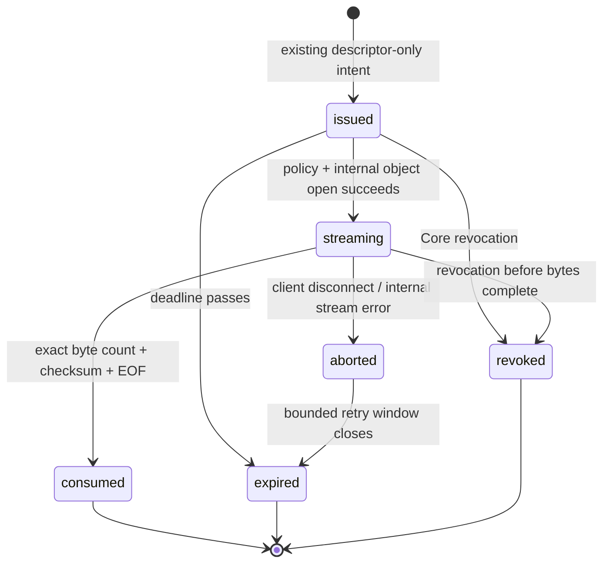
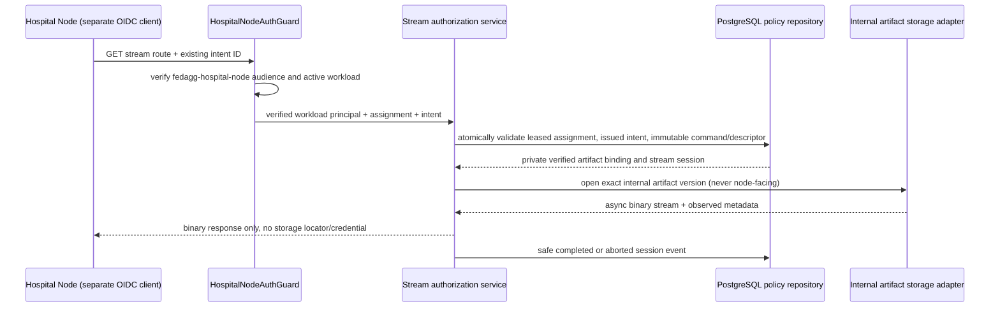

# Core-Mediated Generated-Model Streaming

**Status:** Core stream route and private storage-read boundary implemented; one bounded Azure generated-fixture stream proof validated. Agent receipt verification, local persistence, training, update, submission, and aggregation behavior remain unimplemented.
**Scope:** A narrowly bounded, synthetic-first Core capability that may eventually stream a verified generated base-model fixture to the authenticated Hospital Node over the existing Core connection, without giving the node a bucket name, object key, provider credential, or presigned URL.

## 1. Nontechnical requirements and research rationale

The purpose of streaming is not to create a hospital file portal. It is to close one tightly defined research gap between a proven descriptor-only read intent and synthetic local FedAvg/FedProx execution: the local agent cannot begin deterministic training until it receives a model representation. The Core remains the policy-enforcement point; the Hospital Node remains a separately authenticated workload whose local data, trainer, filesystem, and results are outside Core control.

The design follows a resource-centric zero-trust model. NIST states that zero trust removes implicit trust based on network location or ownership and applies separate authentication and authorization before a session to an enterprise resource is established. [1] The stream route therefore re-evaluates the principal, assignment, lease, issued intent, immutable command, and verified descriptor immediately before every new transfer; being on the Core network, possessing a prior receipt, or knowing an identifier is insufficient.

| Product requirement | Acceptance signal | Explicit non-goal |
|---|---|---|
| Preserve data locality | Only generated model bytes cross the Core-to-node response in the first proof; no local data travels to Core. | Patient data, image, identifier, dataset metadata, data path, or hospital record. |
| Preserve storage opacity | The node receives a Core HTTPS response only. | Bucket, object key/version, provider host, provider response, storage credential, or presigned URL. |
| Preserve research traceability | One safe session/event trail binds the stream to intent, lease, command digest, and descriptor digest. | Free-text logs, raw payload dumps, user telemetry, clinical audit claim, or model result claim. |
| Make failure safe | A failed/open-aborted stream is terminal or explicitly retryable according to documented state, never silently consumed. | Implicit retry, unlimited resume, concurrent streams, or silent content substitution. |
| Keep initial scope falsifiable | The Azure proof streams one generated non-clinical fixture and verifies checksum/byte count. | Real checkpoint distribution, production throughput, hospital rollout, or performance claim. |

## 2. Technical requirements and design principles

HTTP provides a uniform interface independent of a resource’s implementation, which supports a Core-mediated interface that hides the storage provider from the node. [2] The initial route uses a full-body response only. It deliberately rejects `Range` headers with `416 Range Not Satisfiable`; partial/resumable transfer is deferred until the replay and consumption semantics are independently designed. RFC 9110 describes range requests as a mechanism for interrupted transfers, but its flexibility is not appropriate to assume before this research boundary has a rigorously tested state machine. [2]

| Principle | Must | Must not |
|---|---|---|
| Policy before bytes | Authenticate through `HospitalNodeAuthGuard`, then verify workload, assignment, lease, intent, command, descriptor, round, and artifact state before storage open. | Treat a prior lease, intent ID, IP/network, or storage reachability as authorization. |
| Core as proxy | Core opens the verified object through an internal adapter and streams it over the authenticated response. | Redirect, return a storage URL, mint provider credentials, or expose internal locator/version fields. |
| Immutable binding | Bind the stream session to exact assignment, lease, intent, command digest, descriptor digest, checksum, size, and artifact version observed by Core. | Let the node supply a checksum, version, path, or model selection. |
| Full-body pilot | Enforce one request, one body, configured positive maximum size, and no `Range` support. | Implement multi-range, resumable download, compression transformation, or cache reuse in the first slice. |
| Binary safety | Set strict binary headers, no-store cache policy, exact `Content-Length`, allowlisted media type, and checksum evidence. | Serialize bytes in JSON, log body chunks, sniff content, or process archive contents. |
| Terminal evidence | Write state transitions and scalar-safe event labels without payloads. | Claim training, model correctness, storage correctness beyond observed checksum, or clinical validity. |

## 3. Data and schema design

The existing verified base-model descriptor registry remains the only bridge from `baseModelVersionId` to a Core-owned artifact reference. The proposed additive state is **not** a general download token table and cannot authorize updates or arbitrary artifact retrieval.

### 3.1 Proposed records

| Record | Key fields | State/constraint | Never persisted here |
|---|---|---|---|
| `hospital_node_model_stream_sessions` | `id`, `assignment_id`, `lease_id`, `read_intent_id`, `workload_id`, `artifact_id`, command/descriptor digests, checksum, byte size, content type, correlation ID, timestamps. | One active `streaming` session per intent; unique `(read_intent_id, attempt)`; immutable binding fields. | Object key, object version, bucket, URL, credential, provider response, payload, byte range, node local path. |
| `hospital_node_model_stream_events` | Session/assignment/intent reference, allowlisted `event_type`, correlation ID, scalar-safe details, timestamp. | One append-only record for `stream_authorized`, `stream_started`, `stream_completed`, `stream_aborted`, `stream_rejected`, or `stream_closed`. | Body, headers except allowlisted state/category, raw exception, provider error payload, remote address, dataset details. |
| Existing read intent | `issued`, `streaming`, `consumed`, `expired`, `revoked`. | `issued → streaming → consumed`; `issued → expired/revoked`; `streaming → aborted/expired/revoked`. | Storage implementation data or bytes. |

The descriptor registry already holds checksum, byte size, content type policy, and Core artifact identity. The persistence adapter alone may join the registry to the internal artifact locator for the storage adapter. The application receipt and controller never receive that locator. A future migration must use additive tables and indexes, register its migration journal entry, and preserve the existing `hospital_node_base_model_read_intents` history.

### 3.2 Session and intent state machine



The initial slice gives `streaming` a short immutable server-side deadline derived from the read-intent and lease deadline. It does **not** resume a partial transfer. A disconnect after any body byte causes `aborted`; the intent does not return automatically to `issued`. A later retry policy requires a separate design decision with a new intent, not a reused stream session.

## 4. Workflow and architecture



The Core API is the policy enforcement point; the storage adapter is a private infrastructure adapter. This separation is consistent with zero-trust’s focus on resource-level policy instead of network position. [1] The node receives one response under the same authenticated Core request. Core never makes a browser redirect and the Agent never communicates with the storage provider.

| Component | Responsibility | Boundary |
|---|---|---|
| `HospitalNodeAuthGuard` | Verifies existing separate audience, workload claim, kind, and active mapping. | Rejects human and `ml_worker` identities; never forwards raw JWT. |
| Stream controller | Parses assignment/intent identifiers and rejects Range/unsupported headers. | Writes headers/body only after service authorization; never constructs an S3 command. |
| Stream authorization application service | Performs immutable policy checks and coordinates state transitions. | Contains no Nest response API, S3 SDK, locator logging, or training code. |
| Stream repository | Loads Core-held descriptor/intent/lease context and writes sessions/events atomically. | Keeps internal artifact locator private to the storage-opening composition. |
| `ArtifactStorage` extension | Opens a known, verified internal artifact as an `AsyncIterable<Uint8Array>` with observed metadata. | Cannot list objects, accept node locator input, return provider URL, or mint a credential. |
| S3 adapter | Uses the configured private Core credential to execute an exact internal read. | Never serializes its request, endpoint, bucket, version, or provider error to the node/event/log. |

## 5. Engineering standards and operational rules

> The stream is a **resource transfer attempt**, not evidence of successful local training or a valid model update.

| Rule | Required implementation behavior |
|---|---|
| Identity | Only the existing separate `hospital-node-synthetic` test client may appear in a bounded proof. Production design remains workload-guarded; no ML-worker client, secret, callback, or human route is reused. |
| Input boundary | Controller accepts path assignment ID and intent ID only. No object name, version, checksum, model ID, range, local path, or training option is accepted from the node. |
| HTTP method | `GET` only, no JSON body. Reject `Range`, `If-Range`, multipart, and content negotiation extensions during the full-body pilot. |
| Response headers | `Content-Type` from a strict allowlist; exact `Content-Length`; `Cache-Control: no-store`; `X-Content-Type-Options: nosniff`; `Content-Disposition: attachment`; safe digest/intent/session correlation headers only if they do not disclose storage location. |
| Maximum size | A configuration allowlist applies before open; bounded proof fixture is tiny and generated. Larger research fixtures require a documented performance and buffering review. |
| Integrity | Compare observed content length and checksum to the frozen descriptor before success. Do not claim checksum success on a disconnect or read error. |
| Error handling | Return generic stable status/reason codes; never pass provider error body, stack trace, object identifier, signed URL, or credential. |
| Logging | Allow only IDs/digests/state/byte count/category/timing bucket. Prohibit raw header authorization, body chunks, storage endpoint, object key, exception object, patient data, and local path. |
| Rate and concurrency | One active session per intent, bounded request/body size, fixed controller timeout, and node-workload rate limiter. No queue dispatch. |
| Worker gate | `AGGREGATION_WORKER_ENABLED=false` remains unchanged; stream proof has no aggregation/dispatch dependency. |

## 6. Proposed API contract

### 6.1 Node-only stream route

```text
GET /v1/workload-assignments/:assignmentId/base-model-stream?intentId=:intentId
Authorization: Bearer <existing hospital-node workload token>
Accept: application/vnd.fedagg.base-model+zip
```

| Response | Meaning | Body boundary |
|---|---|---|
| `200 OK` | Core authorized one full-body generated-model stream. | Binary bytes only; no JSON envelope or storage data. |
| `401/403` | Guard/principal/workload/intent/lease mismatch. | Stable code only. |
| `404` | Assignment or intent not visible to that principal. | No existence disclosure beyond stable policy. |
| `409` | Intent/session is already streaming, consumed, aborted, expired, or revoked. | Safe state reason only. |
| `413` | Descriptor exceeds configured stream maximum. | No provider metadata. |
| `416` | Any range request in the pilot. | No partial content or `Content-Range`. |
| `422` | Frozen artifact/descriptor integrity precondition fails. | Stable integrity reason only. |
| `503` | Internal storage unavailable before body begins. | Generic dependency-unavailable reason, no provider body. |

The successful response must contain no object key, bucket, endpoint, provider version, presigned URL, provider credential, provider error, model filename derived from storage, byte range, patient field, or local training metadata. The public OpenAPI readout must label it as a **synthetic-first, descriptor-bound, server-mediated binary route** and must not claim production hospital readiness.

### 6.2 Internal storage port

```ts
export interface VerifiedArtifactReadRequest {
  readonly privateObjectKey: string;
  readonly expectedVersionId?: string;
  readonly expectedChecksumSha256: string;
  readonly expectedBytes: number;
  readonly expectedContentType: string;
}

export interface VerifiedArtifactRead {
  readonly body: AsyncIterable<Uint8Array>;
  readonly contentLength: number;
  readonly contentType: string;
  readonly checksumSha256: string;
}

export interface ArtifactStorage {
  openVerifiedRead(request: VerifiedArtifactReadRequest): Promise<VerifiedArtifactRead>;
}
```

These types are internal-only. `privateObjectKey` must never cross the application controller response, Hospital Node contract, public OpenAPI document, event, test snapshot, or log. The adapter must reject metadata mismatch before returning a body.

## 7. Test strategy and bounded Azure proof

| Layer | Required positive proof | Required denial proof |
|---|---|---|
| Contract/domain | Deterministic session binding and state transitions. | Illegal intent/lease/descriptor states, wrong digest, unsupported range, concurrent session. |
| Application | Exact principal/assignment/intent context opens a private read only after atomic session write. | Any caller-provided locator/version/checksum, wrong workload, expired/revoked/consumed state, byte-size mismatch. |
| Repository | Atomic one-session-per-intent transition and scalar-safe terminal events. | Race/replay conflict, changed immutable context, cross-federation/round artifact. |
| Storage adapter | Exact generated fixture returns expected content type, length, and checksum. | Missing object, changed version, checksum/length/type mismatch, provider error redaction. |
| Controller | Full-body binary headers and no-store policy; body forwards async chunks with cancellation. | Human/ML-worker principal, JSON body, range, malformed ID, error-body locator/credential leak. |
| Azure proof | One generated fixture goes through Core; proof verifies safe content hash/length and consumes/closes session/intent. | No URL, credential, object locator, provider response, raw bytes in logs/docs, Agent integration, training, update, submission, dispatch, or worker enablement. |

The bounded validation profile must use a generated non-clinical fixture whose expected checksum and byte count are held by Core test setup. It may report only `stream_authorized`, `stream_completed`, a safe checksum comparison result, byte-count equality, terminal state counts, public health codes, and disabled-worker state. It must never print fixture bytes, object key/version, bucket, provider endpoint, token, secret, database URL, or raw response headers.

## 8. AI implementation handoff

| Delivery slice | Deliverable | Acceptance gate |
|---|---|---|
| 1. Private contract | Add stream-session state/types and internal `openVerifiedRead` port; add pure domain tests. | No HTTP/storage SDK dependency in domain/application policy. |
| 2. Persistence | Additive session/event migration, repository context, atomic state/event tests, migration journal. | No locator copied into session/event/receipt and one active session constraint proven. |
| 3. Service and adapter | Implement stream authorization service and S3 exact-read adapter using private Core config. | Metadata mismatch rejected before body; no listing or signed-URL creation. |
| 4. Guarded route | Add hospital-node-only GET route, headers, cancellation handling, no-range pilot behavior, redaction tests. | Human/ML-worker denied; no locator/credential/provider data in every response/error snapshot. |
| 5. Quality/deploy | Full Core suite, migration integration, protected CI/deploy, Azure liveness/readiness, worker gate check. | Default aggregation worker still disabled. |
| 6. Bounded proof | New opt-in generated-fixture profile, exactly one Core-mediated stream, terminal closure. | No Agent change, no real model, no data, no training/update/submission/aggregation. |

Implementation must stop after each slice, publish ledger evidence, and begin the next slice only from the published contract. If any stream path forces a storage locator, provider credential, object response, payload byte, raw header, or patient/local-data field into a public boundary, the slice fails closed and must be redesigned before proceeding.

## 9. Implementation record and bounded proof-profile contract

Core commit `d3516e4` implements the reviewed stream boundary. It adds migration `0014`, `issued → streaming → consumed` / aborted intent vocabulary, private stream-session and scalar-safe stream-event tables, an internal `openVerifiedRead` storage operation, a stream authorization service/repository, and `GET /v1/workload-assignments/:assignmentId/base-model-stream?intentId=` behind `HospitalNodeAuthGuard`. The route rejects `Range`, sets full-body/no-store/nosniff/attachment headers, derives workload identity only from the verified principal, and serializes no storage metadata. Local full quality passed with **83 TypeScript tests and 9 Python tests**; Core Quality Gates completed in **1 minute 55 seconds** and protected Azure deployment completed in **2 minutes 46 seconds**. Azure liveness/readiness returned HTTP 200 and the aggregation worker remained disabled. No stream endpoint was invoked in Azure by this implementation increment.

The next runner is an opt-in profile named `hospital-node-base-model-stream-validation`. It reuses—not duplicates—the existing separate synthetic hospital-node workload mapping and protected client-secret reference. It may use Core-private setup access to write one tiny generated non-clinical fixture into the configured object store and to create generated Core prerequisite rows. That internal setup locator and its provider configuration are never printed, returned, committed, or included in public evidence. The Hospital Node simulation receives no storage configuration, URL, credential, locator, or object identity.

| Proof step | Required bounded behavior | Forbidden behavior |
|---|---|---|
| Fixture setup | Create one tiny generated binary fixture, verified `base_model_archive` artifact row, descriptor, leased assignment, and issued descriptor-only intent. | Real model, patient/image/data field, real hospital record, bucket/object details in output, or Agent source change. |
| Identity | Obtain one token through the existing `hospital-node-synthetic` client and reuse its active workload mapping. | ML-worker identity, human endpoint, duplicate workload identity, token/secret output, or a public service. |
| Stream | Call the guarded Core stream route once, read its binary response only in the private runner, and compare observed byte count/checksum with generated expected facts. | Range request, redirect, direct provider request by node, presigned URL, storage credential, byte/payload output, training, update, submission, dispatch, or aggregation. |
| Redaction | Confirm no response header/body projection contains object key/version, bucket, URL, credential, provider response, or local path. | Logging raw headers/body or treating a successful stream as training success. |
| Closure | Confirm one completed stream session, consumed intent, expired generated lease/assignment, closure event, fixture-object cleanup, zero remaining runner instances, healthy Core, and disabled worker. | Active proof state, repeated stream call, worker enablement, or a claim of object-provider/hospital readiness. |

The profile invocation must use an explicit Compose file and `run --build`, following the documented stale-image correction from the prior intent proof. It must not start until the profile source itself passes Core Quality Gates and protected Azure deployment, followed by renewed health and disabled-worker checks. A failure after a guarded stream request must be recorded and reviewed before another invocation.

## 10. Implementation and evidence record — generated-fixture stream proof

Core commit `707cf23` adds the opt-in `hospital-node-base-model-stream-validation` profile and its one-shot runner. The source passed local full quality with **83 TypeScript tests and 9 Python tests**. GitHub Core Quality Gates run `32567581955` completed successfully in **2 minutes 1 second** and protected Azure deployment run `32567581950` completed successfully in **2 minutes 45 seconds**, both from `707cf2367b96a5f8e4cde00120267238cef91eb6`. The deployed profile then remained dormant until renewed checks confirmed public and container liveness/readiness HTTP 200 and the aggregation worker’s explicit default-disabled marker.

The profile was invoked **once** through the explicit deployed Compose file with `run --build`. It reused the existing separate synthetic Hospital Node workload mapping, created one tiny generated non-clinical fixture only through Core-private setup, created fresh generated surrounding Core facts, acquired the separate Hospital Node identity only for the Core routes, issued one read intent, and called the guarded full-body stream route once. The runner emitted only its safe success marker: the bounded generated-model stream validation succeeded and synthetic stream state closed. It privately checked the expected byte count, checksum, content type, no-store/nosniff/attachment response behavior, and the absence of prohibited public response projections; no token, secret, storage locator, provider configuration/response, raw header, or fixture byte was printed.

Post-run aggregate-safe inspection observed **one completed stream session**, **zero active stream sessions**, **one consumed read intent**, **zero issued or streaming read intents**, **zero active leases**, **one stream closure event**, and **zero remaining validation-runner containers**. The terminal aggregate also contained four expired assignments and three expired leases, including earlier bounded fixtures; these non-identifying global counts are not attributed to the stream profile alone. Public and container liveness/readiness remained HTTP 200, and the deployed aggregation worker continued to log its default-disabled state. The runner performed its generated-fixture cleanup internally; no storage locator or provider response was inspected or published.

This is proof of a single Core-mediated generated-fixture transfer and safe Core terminal state only. It is **not** an Agent download/persistence proof, a real model distribution claim, a provider-readiness claim, a training result, an update/submission/aggregation proof, a hospital integration, or a clinical-use claim.

## 11. Next documentation gate — Agent receipt verification and synthetic persistence

The next slice is design-only and is documented in `HOSPITAL_NODE_AGENT_MODEL_RECEIPT_AND_PERSISTENCE.md`. It defines how the separate Agent may obtain a descriptor-only intent, verify a full-body Core response against immutable local facts, and persist only a scalar-safe receipt/materialization record for a generated fixture in a private local workspace. It does not authorize coding, Core changes, Agent deployment, training, update packaging, submission, aggregation, or a new Azure execution until its own contract and delivery slices are published and accepted.

## References

[1] [NIST SP 800-207: Zero Trust Architecture](https://csrc.nist.gov/pubs/sp/800/207/final)

[2] [RFC 9110: HTTP Semantics](https://datatracker.ietf.org/doc/html/rfc9110)

[3] [Core Hospital Node workload contract](https://github.com/hstu-research/federated-aggregator-docs/blob/main/docs/CORE_HOSPITAL_NODE_WORKLOAD_CONTRACT.md)

[4] [Current Core ArtifactStorage port](https://github.com/hstu-research/federated-aggregator-core/blob/main/packages/application/src/ports/artifact-storage.ts)

[5] [Current Core S3 adapter](https://github.com/hstu-research/federated-aggregator-core/blob/main/packages/storage-s3/src/index.ts)

[6] [Core-mediated stream implementation](https://github.com/hstu-research/federated-aggregator-core/tree/main/apps/api/src/hospital-node-assignments)
