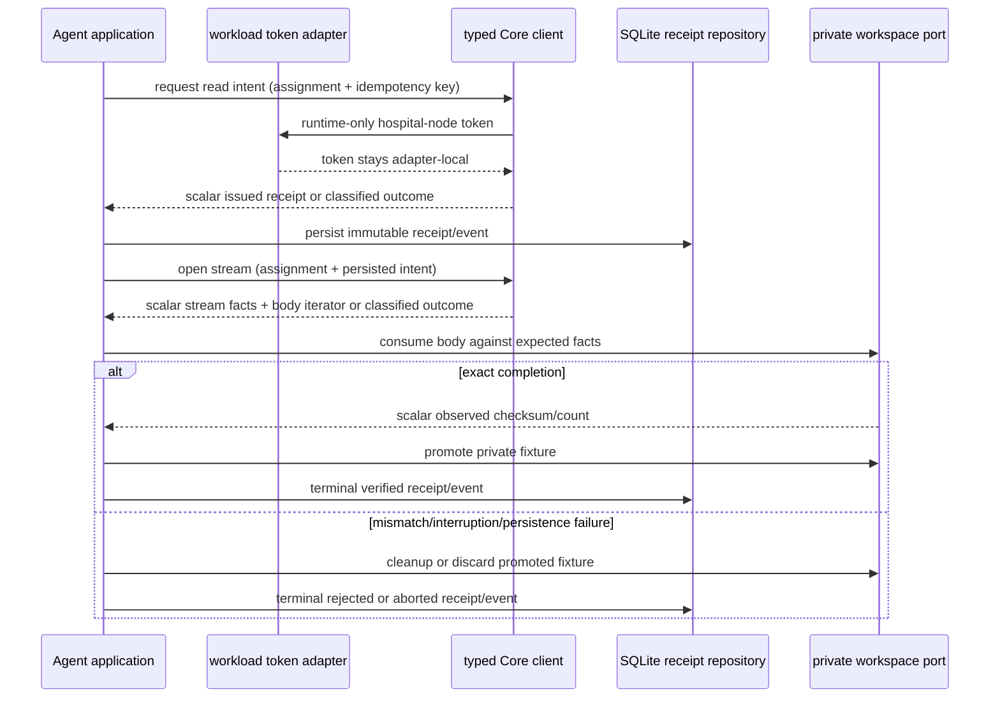
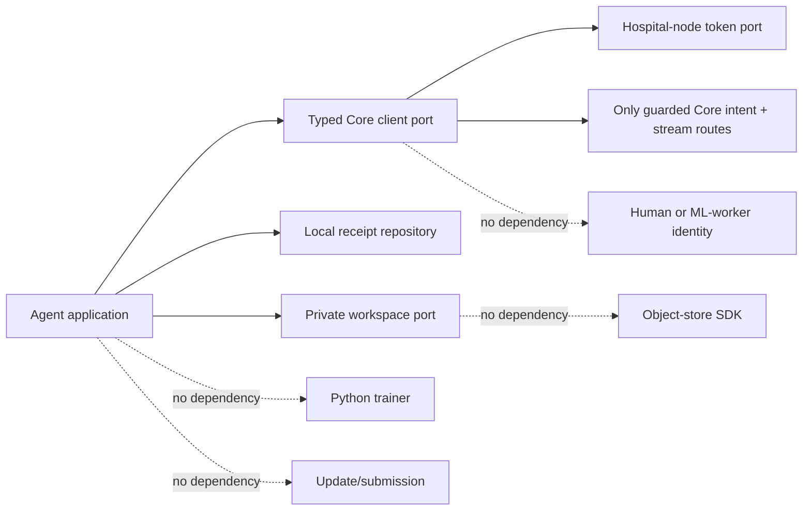

# Hospital Node Agent — Typed Core Client and Private Workspace Adapter Contract

**Status:** L4a contract and L4b deterministic fake typed-client/pathless-workspace compatibility adapters implemented locally. No workload-token call, HTTP request, real/private filesystem workspace, storage-provider access, Agent deployment, Azure execution, training, update, submission, or aggregation behavior is implemented by this document.

**Scope:** This contract follows the local-only L2 receipt persistence and L3 fake verifier. It specifies the only allowed future transport seam between a synthetic Hospital Node Agent and Core, plus the private workspace seam that may later materialize an already Core-mediated generated fixture. It is deliberately not a direct object-store contract, a generic HTTP client, a public download feature, a model-release API, or a clinical-data feature.

## 1. Nontechnical requirements and decision context

The bounded Core proof shows that the server can authorize and proxy a single generated non-clinical fixture. The L2/L3 Agent increments show that the Agent can preserve scalar receipt evidence and verify generated bytes locally without a network connection. The unresolved boundary is therefore narrow: an Agent must be able to speak only to the existing guarded Core routes while keeping the workload token, provider opacity, full-body restrictions, and local materialization boundary intact.

| Requirement | Required outcome | Explicitly excluded |
|---|---|---|
| Preserve Core as the sole delivery authority | The Agent requests a receipt and stream only from Core; Core remains responsible for storage composition and response policy. | Direct object-store SDK, bucket/key/version, presigned URL, provider credential, provider response, or provider retry behavior. |
| Preserve workload separation | Only the existing hospital-node workload identity can authorize the typed client. | Human session, ML-worker identity/callback, shared token cache, browser token, or a new public Agent listener. |
| Preserve local data sovereignty | The transport carries a generated model fixture and scalar Core facts only. | Dataset/image/patient field/identifier/path/metric transfer, hospital-system integration, or clinical claim. |
| Preserve falsifiable local evidence | The client and workspace expose allowlisted scalar outcomes and reason codes. | Header dump, URL, raw body, token, path, provider field, free-text exception, or data-bearing debug telemetry. |
| Preserve a staged proof sequence | Initial code is fake-only; a real transport or workspace requires separate review, quality evidence, deployment evidence, and a new bounded proof plan. | Azure Agent run, real generated model delivery, training, update submission, or aggregation in L4. |

> A typed transport boundary is an authorization and evidence seam, not proof that a fixture is fit for training, that an Agent has joined a hospital, or that any scientific result exists.

NIST’s zero-trust model centers authorization on protected resources rather than implicit trust in a network location. [1] The future typed client therefore treats every Core interaction as a narrowly classified resource request and every response as an input that must be checked against existing immutable receipt facts before any private workspace promotion.

## 2. Technical requirements and hard boundaries

The future client is a single-purpose adapter. It may acquire the separate hospital-node workload token only through an injected token port; it may call exactly two Core route families; it may construct no storage client and no generic URL method. The token must remain inside the transport adapter process boundary and never enter domain values, SQLite, local events, status readout, test snapshots, returned result objects, or logs.

| Concern | Required behavior | Prohibited behavior |
|---|---|---|
| Token seam | Inject `HospitalNodeWorkloadTokenSource`; request the configured hospital-node audience at the call boundary; construct the authorization header internally. | Token in application/domain/persistence values, token parameter in public method signatures, caching beyond the identity adapter’s own contract, or use of a human/ML-worker token. |
| Route allowlist | `POST /v1/workload-assignments/:assignmentId/base-model-read-intents` and `GET /v1/workload-assignments/:assignmentId/base-model-stream?intentId=...` only. | Lease route reuse, worker callback, human endpoint, arbitrary path, redirect follow, object-store endpoint, proxy bypass, or public Agent route. |
| Request shape | Use a fresh typed idempotency key for the intent call; use the locally persisted intent ID for the full-body stream call; do not send `Range`. | Caller-selected artifact, storage locator, content type, checksum, filename, Range, multipart, update, local data, or model selector. |
| Stream success | Accept only `200` with the Core allowlisted content type, positive exact content length, `no-store`, `nosniff`, attachment disposition, and the Core checksum projection. | `206`, redirect, compressed transformation, multipart, missing/inconsistent required facts, raw header exposure, or byte buffering outside the workspace stream. |
| Response classification | Return allowlisted scalar `ready`, terminal-denial, or pre-body retryable-unavailable outcomes. | Raw HTTP body/header/status text or unclassified exception propagation to application/domain/SQLite. |
| Workspace adapter | Receive only a validated byte iterator plus immutable expected facts; hold its configured root/private handle only inside the adapter; return a scalar materialization capability, never a path. | Expose a file path, bytes, provider locator, storage key, filename, data field, encryption key, or a public HTTP route. |
| Failure handling | Stop on terminal denial; clean temporary materialization on integrity/stream failure; use no automatic intent reuse or range resume. | Automatic retry, reuse of a consumed/aborted intent, retry after body opening, silent substitution, or trainer invocation. |

## 3. Typed API contract and safe response taxonomy

The routes below reflect the currently implemented Core controller. The stream route is full-body only and rejects `Range` at Core with `416`; Core emits `content-type`, `content-length`, `cache-control: no-store`, `x-content-type-options: nosniff`, `content-disposition: attachment`, and the safe checksum header on a successful stream. [2] The Agent client validates these within the adapter and projects only typed facts onward.

```ts
export interface HospitalNodeWorkloadTokenSource {
  getAccessToken(input: {
    readonly audience: "fedagg-hospital-node";
  }): Promise<string>;
}

export interface TypedCoreReadIntentClient {
  requestReadIntent(input: {
    readonly assignmentId: string;
    readonly idempotencyKey: string;
  }): Promise<
    | { readonly kind: "intent_issued"; readonly receipt: BaseModelReadReceipt }
    | { readonly kind: "terminal_denial"; readonly code: CoreTerminalDenialCode }
    | { readonly kind: "retryable_unavailable"; readonly code: CoreRetryableCode }
  >;
}

export interface TypedCoreModelStreamClient {
  openModelStream(input: {
    readonly assignmentId: string;
    readonly readIntentId: string;
  }): Promise<
    | {
        readonly kind: "stream_ready";
        readonly checksumSha256: string;
        readonly byteSize: number;
        readonly contentType: "application/vnd.fedagg.base-model+zip";
        readonly cachePolicy: "no-store";
        readonly nosniff: true;
        readonly disposition: "attachment";
        readonly body: AsyncIterable<Uint8Array>;
      }
    | { readonly kind: "terminal_denial"; readonly code: CoreTerminalDenialCode }
    | { readonly kind: "retryable_unavailable"; readonly code: CoreRetryableCode }
  >;
}

export type CoreTerminalDenialCode =
  | "unauthorized"
  | "forbidden"
  | "not_found"
  | "conflict"
  | "range_not_supported"
  | "unprocessable"
  | "redirect_denied"
  | "invalid_response";

export type CoreRetryableCode = "service_unavailable" | "transport_unavailable";
```

The contract deliberately omits base URL, headers, response text, status phrase, cookies, query construction, redirect target, certificate details, and token. `401`, `403`, `404`, `409`, `416`, and `422` classify as terminal for the presented receipt context. A `503` or a connection failure **before a response body starts** classifies only as `retryable_unavailable`; retry behavior requires a later explicit policy and a fresh intent decision. Any redirect, `206`, unexpected 2xx, forbidden content encoding, missing/invalid required stream fact, or post-body failure is terminal for the current intent.

## 4. Private workspace contract and data design

No new SQLite column is authorized in L4. The existing receipt, scalar materialization, and event records remain the public local control state. The future private workspace is an adapter-owned capability; it may use a configured private root or encrypted storage internally, but no root, path, filename, opaque file handle, bytes, key, or provider fact may enter the contracts below or the existing database tables.

```ts
export interface PrivateGeneratedFixtureWorkspace {
  begin(input: {
    readonly receiptId: string;
    readonly expectedChecksumSha256: string;
    readonly expectedByteSize: number;
    readonly expectedContentType: "application/vnd.fedagg.base-model+zip";
  }): Promise<PrivateFixtureWriteSession>;
}

export interface PrivateFixtureWriteSession {
  consume(body: AsyncIterable<Uint8Array>): Promise<{
    readonly observedChecksumSha256: string;
    readonly observedByteSize: number;
  }>;
  promote(): Promise<{ readonly receiptId: string; readonly state: "materialized" }>;
  cleanup(): Promise<void>;
  discardPromoted(): Promise<void>;
}
```

| State | Public/local scalar record | Adapter-internal state | Invariant |
|---|---|---|---|
| Ready | Existing `issued` receipt, no new fixture field. | No workspace session. | Core stream cannot be assumed. |
| Writing | No path-bearing local projection. | Temporary private stream sink, incremental hash/count. | No promotion before EOF and exact expected facts. |
| Materialized | Existing receipt/materialization transition plus `receiptId`-only capability. | Promoted private fixture. | No public/local persistence of a path or bytes. |
| Rejected/aborted | Existing allowlisted terminal state/event. | Temporary fixture removed; promoted fixture discarded on persistence failure. | No retained usable fixture after a failed verification/persistence path. |

The L3 in-memory workspace is a test-only predecessor and not an implementation of this private workspace contract. L4 may implement only a fake adapter conforming to the same narrow port; no filesystem implementation is allowed until a later review documents configuration handling, permissions, crash recovery, deletion verification, and delivery-proof limits.

## 5. Workflow and architecture





The application layer owns sequencing and scalar outcome handling. The typed client owns transport configuration, the runtime token, Core route allowlisting, response validation, and status classification. The workspace owns temporary and promoted private bytes but cannot initiate network activity. Domain/contracts own immutable fact checks and reason vocabulary. Persistence owns only safe scalar records/events. Python remains outside this boundary.

## 6. Engineering standards and observability

| Standard | Required enforcement |
|---|---|
| Dependency direction | Application depends on typed client/workspace ports; adapters depend inward. Neither domain nor SQLite imports fetch, token, filesystem, provider, or Python modules. |
| Transport minimization | The concrete client internally fixes scheme/host configuration and the two route templates; no caller can supply an arbitrary endpoint or header map. |
| Header minimization | Validate only the allowlisted success facts inside the client, then discard raw headers. The application sees no header object. |
| Body minimization | The client supplies one `AsyncIterable<Uint8Array>` only on validated `stream_ready`; no response `.text()`, `.json()`, or generic buffer projection is allowed. |
| Full-body-only | The client sends no Range request. `206` and `416` are denial classes. Resume/range support is out of scope. |
| Redacted errors | Convert adapter errors to allowlisted scalar codes. Log only code, route class, receipt state, and safe duration bucket; never log body, raw response, URL, token, header, path, bytes, or provider detail. |
| Workspace cleanup | All post-begin outcomes invoke cleanup or promoted-fixture discard as applicable. A cleanup failure becomes an allowlisted safe failure code and blocks readiness. |
| Test determinism | Fakes must use generated values, in-memory body iterators, and fixed typed response outcomes; they must not open sockets, read environment secrets, access filesystem/provider clients, or call Azure. |
| Stop conditions | Any need for a selector, locator, provider credential, public route, automatic retry, direct download, raw body logging, path-bearing result, training invocation, update submission, or aggregation worker is a fail-closed design change requiring a new dossier revision. |

## 7. Compatibility tests and bounded proof plan

| Layer | Required positive evidence | Required denial evidence |
|---|---|---|
| Fake typed client | One fake intent receipt and one fake full-body stream project only typed scalar facts and a byte iterator. | Arbitrary route, provider field, redirect, `206`, `416`, unallowlisted type, nonpositive/mismatched length, forbidden encoding, raw header/body, or token-shaped projection. |
| Fake workspace | Generated fixture consumes/promotes and returns receipt-only capability. | Mismatch, interruption, promotion failure, persistence failure, cleanup failure, path/bytes in result, or a retained usable fixture after a terminal failure. |
| Application composition | One fake intent → persisted receipt → one fake stream → fake workspace → terminal event sequence. | Reused terminal receipt, opened workspace after denial, automatic retry, Range, trainer/update/submission/aggregation invocation. |
| Contract compatibility | Core controller fixture remains aligned with guarded intent and full-body stream route facts. | Human/ML-worker route/identity/callback, direct storage API, non-hospital workload audience, or extra endpoint. |
| Later integration proof | One separately reviewed generated fixture through the real Core client and private workspace with aggregate-safe closure. | No L4 runtime proof: no Azure Agent run, actual model release, data/training/update/submission/aggregation, real hospital, or clinical use. |

The first real Client/Workspace proof is not authorized by L4a or L4b. It may start only after a future implementation record, local quality, Agent deployment decision, Core compatibility decision, fresh health/default-disabled-worker checks, and a separate one-shot proof profile have all been published. A failure after a real guarded request must be recorded before any retry.

## 8. AI implementation handoff

| Delivery slice | Deliverable | Stop condition |
|---|---|---|
| L4a — Design | This contract, route/status matrix, workspace lifecycle, safe schema boundary, tests, proof plan, and explicit redaction rules. | No Agent code, token call, HTTP client, filesystem, Azure action, training, update, submission, or aggregation. |
| L4b — Fakes | Deterministic fake typed client and fake private workspace adapters plus contract/application negative tests. | No socket, environment secret, OIDC source, real filesystem/provider, or Azure resource. |
| L4c — Adapter review | Separate reviewed concrete client/workspace implementation plan, configuration policy, error map, and deployment rationale. | No deployment or runtime Core call. |
| L4d — Concrete adapters | Implementation with local tests, safe logs, and compatibility tests after L4c evidence. | No Azure Agent proof, trainer, update, submission, or aggregation. |
| L4e — Proof dossier | A fresh bounded Agent/Core generated-fixture proof profile and closure plan. | No invocation until protected deployment/health/disabled-worker checks are recorded. |

Every delivery slice requires a dated public Research Ledger entry before the next slice. The implementation must preserve the two-route allowlist, separate hospital-node identity, no-locator/no-provider boundary, full-body-only behavior, scalar-safe persistence, private/pathless workspace result, and disabled aggregation worker. Any erosion of those constraints is a blocker, not an implementation shortcut.

## 9. Implementation evidence — L4b deterministic fake adapters

Hospital Node Agent commit `afc98d1` implements only the fake-adapter slice of this contract. `FakeTypedHospitalNodeCoreClient` admits two method classes and no generic transport surface: descriptor-intent issuance and stream opening. Its inputs contain only assignment/read-intent IDs and an idempotency key. Its outputs are a scalar typed receipt or a scalar-safe stream projection with checksum, byte size, allowlisted content type, `no-store`, `nosniff`, attachment disposition, and an async generated-byte iterator. The fake records only a route-class call log; it accepts no base URL, header map, token, Range, provider field, arbitrary route, selector, raw response, or storage capability.

The fake enforces intent-before-stream sequencing and classifies out-of-sequence calls as terminal conflict. Invalid idempotency yields terminal unprocessable; configured terminal/retryable fixtures remain typed outcomes. The fake has no socket, environment configuration, token source, HTTP library, redirect behavior, provider client, or Azure reference. It is a compatibility oracle for the L4 contract, not a Core connection.

`FakePrivateGeneratedFixtureWorkspace` separately implements the pathless private workspace port with generated in-memory bytes. It exposes only aggregate temporary/materialized/cleaned/discarded lifecycle counts. Exact expected checksum and byte size are prerequisites for promotion. Mismatch promotion is denied until cleanup, and an interrupted generated body requires cleanup. The adapter contains no filesystem root, path, filename, provider key, token, credential, network call, or public readout. It is not a concrete private filesystem adapter.

Local `pnpm run ci` passed after L4b: formatting, strict TypeScript, **25 TypeScript tests**, and **4 Python tests**. The new coverage verifies allowed intent→stream sequencing, out-of-sequence denial, invalid idempotency, terminal/retryable fixture classification, full-body scalar fact projection, pathless fake promotion, mismatch cleanup, and interrupted-body cleanup. No Core route, workload token, HTTP stream, socket, filesystem, storage provider, Azure resource, trainer, update, submission, aggregation worker, hospital data, or clinical workflow was used.

The next safe step is **L4c**, an adapter-review record for a future concrete client and concrete private workspace. It must decide configuration ownership, token-port wiring, HTTP response validator, error map, private-root permissions, cleanup failure behavior, and deployment posture before any production-shaped code. L4c does not authorize a Core request or Azure execution.

## References

[1] [NIST SP 800-207: Zero Trust Architecture](https://csrc.nist.gov/pubs/sp/800/207/final)

[2] [Core Hospital Node assignments controller — guarded intent and full-body stream routes](https://github.com/hstu-research/federated-aggregator-core/blob/main/apps/api/src/hospital-node-assignments/hospital-node-assignments.controller.ts)

[3] [Core-mediated generated-model streaming dossier](https://github.com/hstu-research/federated-aggregator-docs/blob/main/docs/CORE_MEDIATED_MODEL_STREAMING.md)

[4] [Agent receipt verification and synthetic persistence dossier](https://github.com/hstu-research/federated-aggregator-docs/blob/main/docs/HOSPITAL_NODE_AGENT_MODEL_RECEIPT_AND_PERSISTENCE.md)
