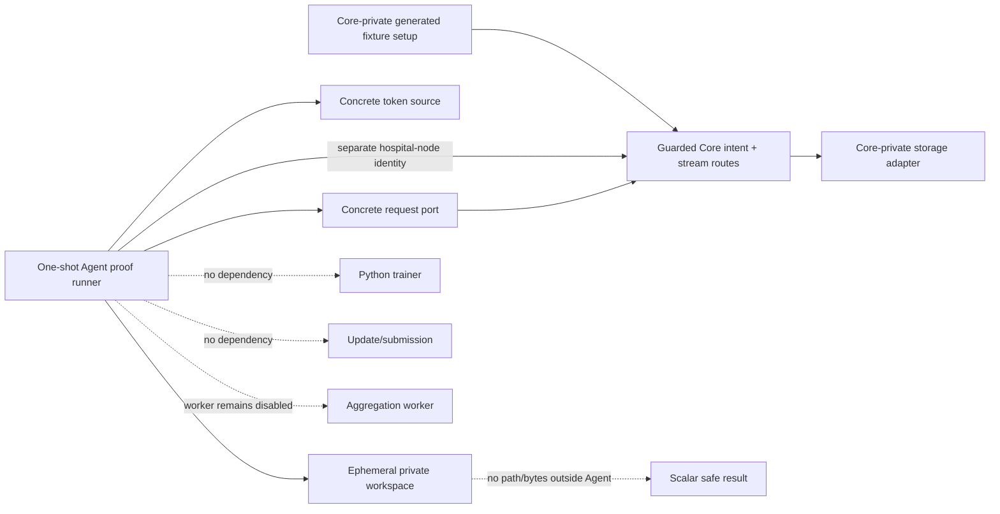
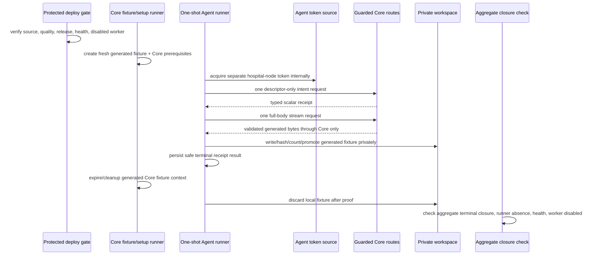
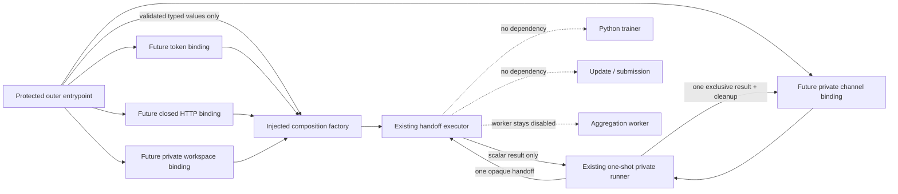

# Hospital Node Agent — Protected Deployment and One-Shot Generated-Fixture Proof

**Status:** L4e2k design and source-evidence dossier. It records injected-only local composition and the next target-safe binding design, but authorizes no protected Agent deployment, concrete request-port/token-source/filesystem wiring, Core/Azure invocation, generated-fixture transfer, training, update, submission, aggregation, hospital integration, or clinical operation.

**Scope:** This dossier closes the gap between locally tested injected adapter logic and a future one-shot synthetic proof. It defines how a protected Agent test composition could be released and checked without turning the Agent into a public service, without sharing storage/provider capability, and without treating a generated fixture as a production model or training input.

## 1. Nontechnical requirements and acceptance boundaries

L4d proves local adapter logic only. The next increment must demonstrate that a separately authenticated synthetic Agent can use the guarded Core boundary exactly once under a controlled runtime composition. The exercise is valuable only if it preserves the research ledger’s falsifiability: each source release, runtime gate, invocation, denial, closure, and limit must be time-ordered and publishable without any credential, locator, provider, body, header, local path, hospital, or patient detail.

| Requirement | Acceptance signal | Explicitly not established |
|---|---|---|
| Preserve Core authority | The Agent connects only to the already guarded Core intent/stream boundary; Core remains the only storage-facing authority. | Direct storage access, provider readiness, artifact release policy, or generalized download service. |
| Preserve Agent locality | One opt-in, non-public Agent runner uses only generated fixture bytes and private ephemeral workspace state. | Persistent hospital node, public endpoint, patient/EHR/PACS connection, local dataset use, or real hospital onboarding. |
| Preserve identity separation | The Agent uses the existing separate hospital-node audience/client reference, never a human, browser, ML-worker, callback, or provider identity. | A broadly reusable production identity, browser flow, delegated access, or identity federation claim. |
| Preserve bounded evidence | Exactly one successful guarded stream attempt is permitted only after all gates; aggregate-safe closure is checked. | Throughput, resilience, repeated retries, concurrent nodes, model quality, trainer compatibility, or clinical value. |
| Preserve aggregation safety | `AGGREGATION_WORKER_ENABLED=false` remains observable before and after the run. | A worker run, aggregation, round progression, update submission, or model release. |

> The proof, if later run, demonstrates one controlled Agent consumption of one generated non-clinical fixture through Core. It does not demonstrate a production download feature, a training start, a hospital integration, or scientific performance.

## 2. Technical requirements and protected configuration ownership

The Agent is not promoted to an always-on deployed service in L4e. Its proof form is a one-shot Compose runner with **no `ports` directive**, no public listener, `restart: "no"`, and no default profile activation. The protected composition root may reference opaque existing secret files and an opaque Core origin configuration, but it must not print, inspect, serialize, copy to Git, or write those values into logs, events, test output, status, or public documents.

| Component | Required future ownership | Permitted protected input | Forbidden value or behavior |
|---|---|---|---|
| Agent proof runner | Agent Compose profile and runner process. | Opaque runtime configuration reference, private OIDC secret reference, bounded proof enable flag. | Public port, daemon/restart, plaintext secret, generic Core URL input, training/update/aggregation flag. |
| Workload token source | Concrete Agent composition. | Existing separate hospital-node client reference and literal audience. | Human/ML-worker/callback token, token print/persistence, token passed through domain/SQLite/event/status. |
| Request port | Concrete Agent composition. | Fixed normalized Core origin and bounded time/size policy from protected runtime configuration. | Direct object-storage/provider endpoint, redirect following, generic route/header/body input, Range, raw error body. |
| Workspace port | Concrete Agent composition. | Private ephemeral mounted workspace root owned by Agent process. | Host/public/shared data mount, path persistence, fixture export, arbitrary directory scan, real local dataset. |
| Fixture authority | Core-private setup inside a bounded composite profile. | Tiny generated non-clinical fixture and fresh generated Core prerequisites. | Provider locator/credential disclosure, direct Agent setup access, persistent fixture, real model/data. |

Concrete request, token, and filesystem adapters must be composed only in the proof runner; the Agent application/domain/SQLite interfaces remain unchanged. The runner receives no command-line secret value. A missing protected reference must fail the profile before a route request and publish a safe configuration failure instead of falling back to an unprotected value.

## 3. Deployment topology and configuration schema



The proof profile is composed alongside the existing private Core validation environment rather than exposing a new host service. It must use a sealed internal network path or the controlled Core HTTPS entrypoint documented by the deployment configuration; no browser, public Agent port, host data directory, or provider network configuration is introduced. The Core side creates/cleans its own generated fixture through private test composition. The Agent sees only the guarded Core typed response.

| Schema class | Required fields | Persistence/redaction rule |
|---|---|---|
| Proof runtime config | Boolean enable flag, bounded byte limit, bounded timeouts, opaque Core origin reference, opaque secret-file reference, opaque private-workspace reference. | References are deployment-only and never logged, returned, committed, or stored in SQLite. |
| Agent proof record | Safe runner result (`succeeded`, classified pre-route refusal, or classified post-route failure), equality booleans, duration bucket, terminal receipt state. | No token, URL, header/body, fixture bytes, workspace path, provider detail, database value, data field, or free-text exception. |
| Core closure record | Existing stream session/read-intent/assignment/lease event aggregates. | Query/report aggregate-safe counts only; do not inspect locator-bearing artifact/provider data. |

## 4. One-shot workflow and state closure



The profile may invoke the guarded stream **once**. It must use a rebuilt image (`run --build`) and reuse the existing active separate hospital-node workload mapping rather than inserting another issuer/subject mapping. The Core-side fixture context must remain live only until the Agent terminal result is observed, then close generated Agent/Core proof state and remove the Agent’s ephemeral materialization. The proof does not invoke Python, local training, update packaging, submission, queue dispatch, or aggregation.

| Step | Required safe result | Stop/retry rule |
|---|---|---|
| Source/deployment gate | Both Agent and Core local quality/repository checks and required protected deployment conclusions are recorded. | A failed quality/deployment gate blocks all runtime work. |
| Preflight | Intended source releases, Core live/ready health, disabled worker marker, no prior runner, and no active proof state are observed safely. | Any mismatch blocks before fixture creation or route request. |
| Token | Separate hospital-node token acquired internally. | Failure is pre-route; record a safe code before repair/retry. |
| Intent/stream | One typed intent then one full-body stream; Agent checks all immutable facts and local integrity. | Redirect/partial/denial/mismatch/interruption is terminal for that intent; record before another attempt. |
| Local cleanup | Materialization is discarded after proof; Agent emits scalar-safe outcome only. | Cleanup failure blocks closure and requires publication before any retry. |
| Core cleanup | Runner expires/closes generated facts and fixture context. | Inspect only aggregate-safe state; no storage/provider inspection. |
| Postflight | Completed/consumed/terminal aggregate state, zero active proof state, zero runner, health, and disabled worker are checked. | Any residual state is a failure record, not a reason to repeat. |

## 5. Architecture, dependency direction, and safety controls

The concrete L4d adapters remain inside the Agent composition root. The L4e profile supplies real runtime implementations only through narrowly named ports: `HospitalNodeWorkloadTokenSource`, `HospitalNodeCoreRequestPort`, and `PrivateWorkspaceFilesystemPort`. No application/domain/contract/SQLite module may import a deployment, environment, HTTP, OIDC, filesystem, storage, or provider module. The proof runner is the only place where configuration references are resolved and must discard secrets immediately after adapter construction.

| Control | Required enforcement |
|---|---|
| Identity isolation | Literal hospital-node audience; no ML-worker/human/browser/callback identity; token remains adapter-local. |
| Route isolation | Internal concrete client permits only guarded intent and stream route constructors; no generic caller-selected path/query/header/body. |
| Response isolation | Redirect, `206`, multipart/encoded/unbounded/malformed responses are denied before body delivery; raw response is never parsed/logged. |
| Storage isolation | Core retains provider access; Agent workspace is local ephemeral state only and returns no path/bytes. |
| Resource bounds | Configure positive timeout/size limit; enforce stream size, exclusive temporary write, same-root promotion, cleanup/discard. |
| Observability | Allow only operation class, outcome code, equality booleans, safe duration/size bucket, and aggregate closure counts. |
| Runtime isolation | No public ports, no default profile, no restart, no persistent service, no host data mount, no trainer/update/submission/aggregation command. |
| Failure isolation | One shot only; post-route failure is published before any code change or retry; no automatic retry/resume/Range/reuse. |

## 6. API/readout contract and operational evidence

The proof uses no new public API. The Agent consumes the existing Core contract through its typed client and writes only existing local scalar receipt/materialization/event facts. The runner’s terminal process result is an allowlisted marker, not a body dump. The runner must not echo `Authorization`, a route URL, Core origin, headers, fixture content, checksum text, workspace root, or any provider/database detail.

```ts
export type BoundedAgentProofOutcome =
  | { readonly kind: "succeeded"; readonly receiptState: "verified"; readonly factsMatched: true }
  | { readonly kind: "pre_route_refused"; readonly code: "configuration" | "identity" | "preflight" }
  | { readonly kind: "terminal_failure"; readonly code: "intent" | "stream" | "integrity" | "workspace" | "cleanup" };

export interface AggregateProofClosure {
  readonly completedStreamSessions: number;
  readonly activeStreamSessions: number;
  readonly consumedReadIntents: number;
  readonly activeReadIntents: number;
  readonly activeLeases: number;
  readonly closureEvents: number;
  readonly runnerInstances: number;
  readonly workerEnabled: false;
}
```

The type is a readout constraint, not an implemented runtime interface. Counts may contain older bounded fixtures in an aggregate, so evidence must distinguish a run-specific safe marker from global terminal totals and never attribute unrelated expired records to the new proof.

## 7. Local tests, release gates, and bounded-proof plan

| Layer | Required positive evidence | Required denial evidence |
|---|---|---|
| Agent local code | L4d adapter tests plus concrete runtime-port configuration parsing in fakes. | Missing protected reference, wrong audience, non-HTTPS origin, public port, provider-style origin, redirect/partial/encoded response, unsafe root, cleanup failure. |
| Agent source quality | Formatting, strict types, TypeScript and Python tests, Compose/config static checks. | No source release if any test/static check fails. |
| Core compatibility | Existing guarded Core stream source remains compatible with the separate hospital-node audience and full-body contract. | No proof if Core release/contract changes or worker gate is not disabled. |
| Protected deployment | Agent proof image/profile and Core deployment complete under protected pipelines. | No proof on an unverified source release or a failed/in-progress deployment. |
| Runtime preflight | Release identity, Core HTTP 200 live/ready, disabled worker, zero prior runner, and safe initial aggregate state. | No fixture/profile run if any preflight check fails. |
| One-shot proof | One `run --build` profile invocation, one generated fixture context, one intent, one stream, private verification, cleanup. | No automatic retry; publish a failure before any repeat. |
| Closure | Safe runner marker, terminal aggregate state, zero runner, health, disabled worker. | No conclusion if active proof state or cleanup uncertainty remains. |

## 8. AI implementation handoff

| Slice | Deliverable | Stop condition |
|---|---|---|
| L4e1 | This dossier, evidence readout, release gates, workflow, failure policy, and proof plan. | No runtime wiring or invocation. |
| L4e2 | Protected Compose/profile, runtime port adapters, one-shot runner, static config tests, Agent local quality, source commit/push. | No Azure/Core invocation or public exposure. |
| L4e3a | Protected Agent release/deployment conclusion plus Core compatibility/release/health/worker preflight record. | No profile run until every conclusion/gate is green. |
| L4e3b | One rebuilt one-shot generated-fixture invocation and aggregate-safe postflight. | No training, update, submission, aggregation, provider inspection, retry, or second run. |
| L4e4 | Actual-outcome ledger/dossier/roadmap publication and checkpoint. | Do not begin a new boundary until terminal evidence is complete. |

Any need to expose an Agent port, copy a secret, use direct storage, inspect a locator/provider response, receive real data, run training, submit an update, enable aggregation, use a human/ML-worker identity, repeat a failed post-route run, or claim an unverified operational property is a fail-closed blocker requiring a new ledger decision.

## 9. Implementation evidence — L4e2 protected preflight profile

Hospital Node Agent commit `ea97b69` adds the protected proof-profile preparation without an invocation. The new Compose file defines the opt-in `hospital-node-core-stream-proof` profile with no `ports` directive, `restart: "no"`, no host data mount, an opaque secret-file reference, and a restricted tmpfs workspace. Its command is only `agent:proof-preflight`; it does not compose a request/token/filesystem runtime adapter or call Core.

The preflight command validates proof enablement, a normalized HTTPS Core origin, a `/run/secrets/` reference, a private `/run/hospital-node-proof/` workspace reference, and positive timeout/byte bounds. It returns only a scalar-safe ready/refused result; its public output excludes the Core origin, secret reference, workspace value, token, route, header/body, provider detail, and path. The configuration validator itself reads no environment; the entrypoint reads deployment values only at the composition boundary and does not acquire a token, create a request, or write a workspace.

Local `pnpm run ci` passed after L4e2: formatting, strict TypeScript, **35 TypeScript tests**, and **4 Python tests**. Tests verify the opt-in protected configuration and deny disabled, non-HTTPS/path-bearing, missing-secret-reference, unsafe-workspace, and nonpositive-size inputs. The sandbox has no Docker executable, so Compose semantic rendering could not be run locally; a non-executing source-level check confirmed the expected profile, preflight command, no `ports` declaration, `restart: "no"`, tmpfs, and secret-reference markers. Protected Compose rendering remains a required release gate in the target runtime before any invocation.

No profile has been run or deployed. No real token, Core/Azure request, socket, host filesystem action, fixture byte, provider interaction, training, update, submission, aggregation, hospital data, or clinical workflow occurred. `CORE_AGENT_PROOF_HANDOFF_COORDINATION.md` now has its local pure/fake coordination components: Core strict handoff/result validators and Agent lease-first orchestration. Only after source/release, target Compose, Core health/worker, runner, and safe-initial-state gates are recorded may the one-shot profile be considered.

## 10. Protected preflight record — source gates pass; target Agent composition remains absent

The Agent source release `8e53c22f988f433528a0363aca85446925eadc99` passed Hospital Node Quality Gates run `32617651527`. The Core pure handoff release `a64488d2fc688fbaea974e865aa89e25542978d8` passed Core Quality Gates run `32617558237` and protected Azure deployment run `32617559177`. Read-only Azure checks then observed public Core liveness/readiness HTTP 200 and the aggregation worker’s disabled marker. These are prerequisite observations only; they do not prove an Agent profile.

The same target-layout inspection found only the Core release structure under `/srv/fedagg` and no deployed Agent proof composition. The sandbox also has no Docker executable, so target Compose rendering cannot be substituted with a local render. Because the private handoff coordinator, directional ephemeral channel mounts, Agent image source, and Agent runtime profile are not yet target-composed, **L4e3 is blocked before fixture creation, token acquisition, lease, intent, stream, workspace write, or any Core route call**. This is a safe pre-route block, not a proof failure, and it does not authorize a retry.

## 11. Implementation evidence — private file-channel adapter and topology template

Agent release `d8857d31a0058db41ff106e63918c4446a4728b0` adds a narrow private file-channel adapter behind an injected filesystem port. The adapter can read one opaque handoff and write one exclusive serialized scalar result; it neither accepts a caller-selected path nor exposes a directory, network, token, provider, workspace, fixture byte, or result capability. Before writing, it revalidates the result schema and rejects unknown fields and impossible `succeeded` / `pre_route_refused` combinations. Its tests use in-memory functions only and show that the serialized result contains neither the handoff assignment identifier nor command digest.

The same release normalizes the non-executing Core/Agent topology template. It declares only the opt-in `hospital-node-private-proof` profile, one directional handoff mount from Core to Agent, one directional result mount from Agent to Core, read-only service roots, service tmpfs, `restart: "no"`, and opaque secret-file references. It exposes no `ports` directive, host bind, persistent application volume, default activation, runnable image binding, or target deployment. Local `pnpm run ci` passed formatting, strict TypeScript, **41 TypeScript tests**, and **4 Python tests**; Hospital Node Quality Gates run `32619077821` completed successfully.

Source review then found that the named directional channel volumes still used the Compose `local` driver’s default persistence semantics. Agent release `52f3130d850fbb0da1f5992296f6f0eba762ed1b` corrects both `proof-handoff` and `proof-result` with bounded `tmpfs` driver options (`64k`, mode `0700`). A source-level static check verified two tmpfs declarations, two tmpfs devices, the Core-to-Agent and Agent-to-Core read-only mounts, and the absence of ports or host binds. Local `pnpm run ci` again passed formatting, strict TypeScript, **41 TypeScript tests**, and **4 Python tests**; Hospital Node Quality Gates run `32621636293` succeeded. This correction validates source intent only; target Compose rendering must confirm runtime support before any profile invocation.

This is source and CI evidence only. The target still has no reviewed Agent image release, Core-side coordinator runtime runner, protected composite deployment, or Azure Compose render. The prior pre-route block therefore remains in force: no fixture creation, token acquisition, lease, intent, stream, workspace write, Core route call, training, submission, or aggregation is authorized by this release.

## 12. Azure read-only preflight — source/topology absence blocks rendering

After the Core coordinator composition and Agent tmpfs topology source gates completed, a read-only Azure preflight observed public Core liveness and readiness at HTTP `200`. The running aggregation worker emitted its explicit disabled-state marker. No Hospital Node Agent source directory, protected composite topology file, or running Hospital Node proof runner was present in the target layout.

Because the target has no deployable Agent source/image binding or composite profile to render, an Azure `docker compose config` invocation would not be meaningful and was not attempted. This is a **safe pre-route block**, not a proof failure: no generated fixture, secret read, Agent token, lease, intent, stream, workspace write, route request, training, submission, provider interaction, or aggregation was performed. The next allowed work is to deliver reviewed Core/Agent runtime adapters and a protected composite source release; any later render remains Azure-only and read-only.

## 13. Design record — protected Agent image and source-only entrypoint

The next Agent slice defines a dedicated protected image source and an intentionally non-invoking entrypoint. Its purpose is to replace the current test-only default status command with a reviewable proof-specific image contract while retaining the absence of live runtime wiring. The entrypoint may read only process-local protected configuration at the outer composition boundary, validate it with the existing scalar-safe validator, and emit a versioned scalar `ready` / `refused` readout. It must not acquire a token, construct the typed Core request client, open a channel, read a handoff, write a result, use a workspace, invoke `runPrivateProofRunner`, or contact Azure/Core/storage/provider services.

| Image/entrypoint control | Required source behavior | Explicitly excluded |
| --- | --- | --- |
| Image selection | A separate proof-runner Dockerfile/target with Node 22, frozen lockfile install, no added native or network client dependency, non-root process, and an explicit non-daemon command. | Build/push, tag publication, deployment binding, host mount, public port, default activation, restart loop. |
| Entrypoint authorization | Existing proof-enable flag and opaque protected references are validated at process start. | Secret value printing, generic CLI configuration, secret fallback, token acquisition, identity reuse. |
| Readout | Versioned allowlisted scalar status plus process exit code; no origins, paths, secret references, headers/bodies, fixture/result facts, diagnostic text, bytes, or provider data. | Runtime completion claim, Core/Agent communication claim, health endpoint, event persistence. |
| Dependency direction | Entrypoint depends only on runtime configuration validation and scalar readout types; `runPrivateProofRunner` remains uncalled until a later concrete adapter composition review. | Filesystem, OIDC, HTTP, storage, database, trainer, submission, aggregation, or channel import. |
| Tests | Deterministic subprocess-free function tests for ready/refused and sensitive-field exclusion; Dockerfile static tests verify no ports, no root default, no daemon/restart assumptions. | Docker build, container execution, Compose render, Azure access, fixture/proof invocation. |

The entrypoint’s initial `ready` status means only that a local process received a structurally valid protected configuration shape. It does **not** mean that a proof runner is executable, that any secret/reference works, that an image is built, that a channel is present, or that an Agent can contact Core. Concrete token/request/filesystem/channel composition and image build/release binding remain separate future gates.

## 14. Implementation evidence — protected Agent image source and non-invoking entrypoint

Agent release `714480d9451197c6d636427ae0b947d23dd12fc4` adds `Dockerfile.proof-runner` and a proof-image preflight command. The Dockerfile uses Node 22, a frozen lockfile install, repository files owned by the unprivileged `node` account, an explicit `USER node`, and an explicit `agent:proof-image-preflight` command. It declares no `EXPOSE` or `ENTRYPOINT`, does not invoke the private proof runner, and was not built, pushed, tagged, deployed, or run as a container.

The entrypoint projects existing protected configuration validation into `hospital-node-proof-image-readout/v1`: `ready` exposes only `proofEnabled: true` and `publicPort: false`; refusal exposes only the existing allowlisted code. It returns no origin, secret reference, workspace root, timeout, byte limit, handoff/result, token, header/body, fixture, provider, or diagnostic text. The command reads process environment at the outer boundary only and does not construct an OIDC source, Core client, channel, workspace, executor, or runtime proof invocation.

Three new deterministic tests cover ready-readout redaction, allowlisted refusal, non-root/static Dockerfile constraints, and absence of a public listener/runtime-runner command. Local `pnpm run ci` passed formatting, strict TypeScript, **44 TypeScript tests**, and **4 Python tests**; Hospital Node Quality Gates run `32665704597` completed successfully. This is source and CI evidence only. A target image build/release binding, concrete adapter composition, Azure topology render, and proof remain absent and blocked pre-route.

## 15. Focused review record — concrete Agent runtime adapter composition

The next Agent increment may compose the already reviewed `ConcreteHospitalNodeCoreClient`, `ConcretePrivateGeneratedFixtureWorkspace`, private file channel, and one-shot runner only through injected ports. It will be a pure composition factory with explicit enablement and a prevalidated configuration object. It must not implement a real token source, HTTP transport, filesystem access, Docker command, or target image binding in the same slice.

| Composition concern | Reviewed requirement | Denial / non-goal |
| --- | --- | --- |
| Configuration ownership | The outer protected entrypoint validates the environment once, discards concrete values from its readout, and supplies typed values only to the composition factory. | No environment access in package logic; no config, origin, workspace, timeout, or secret projection. |
| Identity seam | Factory accepts an injected `HospitalNodeWorkloadTokenSource`; the token remains within the concrete Core client. | No OIDC library, secret read, token cache, human/ML-worker/callback identity, or token output. |
| Transport seam | Factory accepts an injected closed `HospitalNodeCoreRequestPort`; fixed route and response policy remain inside the concrete Core client. | No fetch implementation, generic URL/header/body, redirect/Range/encoding fallback, retry scheduler, or provider client. |
| Workspace seam | Factory accepts an injected `PrivateWorkspaceFilesystemPort`; fixed root validation and pathless temporary/promote/discard lifecycle remain in the workspace adapter. | No Node filesystem import, host path/config persistence, directory scan, dataset mount, or exported file reference. |
| Channel seam | Factory accepts an injected private runner channel with one handoff read and one result write. | No channel directory enumeration, caller-selected file, network channel, repeated result, or public listener. |
| Executor binding | Factory binds the injected adapters to the existing fake-first lease → intent → stream → workspace orchestration. | No proof invocation, fixture creation, database/SQLite persistence change, training, update/submission, or aggregation. |
| Readout and closure | The factory returns the existing scalar runner result only; tests assert refusal-before-executor and no sensitive configuration/result projection. | No stdout process contract change, detailed error, bytes/path/token/URL/assignment/digest/provider field, or runtime success claim. |

The implementation test matrix will cover disabled/invalid configuration before any port call, ready composition with in-memory fakes, one handoff/result lifecycle, token/transport/workspace failures as scalar terminal results, and absence of retries. Real runtime adapters, actual OIDC secret handling, actual Core requests, actual tmpfs operations, image build/release, Azure Compose render, and a proof remain separate gates.

## 16. Implementation evidence — injected-only Agent runtime composition

Agent release `7983502a7a02b817600861a485ad15b6ad7f2315` implements the reviewed composition as `composeInjectedPrivateProofExecutor`. Its input requires an explicit enablement value, a prevalidated typed configuration object, and injected token, closed request, private-workspace filesystem, lease, and receipt-repository ports. The factory constructs only the pre-existing typed Core client and pathless private workspace, then binds them to the existing lease → intent → stream → verification orchestration. It never reads process configuration, parses a secret, acquires an identity, imports Node filesystem or HTTP APIs, discovers a channel, starts a profile, writes a terminal result directly, or binds an image/runtime target.

The existing one-shot private runner remains the sole owner of opaque handoff read, exactly-one scalar result write, and channel cleanup. The new executor returns the existing versioned scalar result to that runner; it cannot output a token, origin, timeout, workspace reference, assignment identifier, digest, header, body, fixture, provider field, path, or diagnostic. Deterministic fakes prove that disabled composition refuses before any supplied capability is touched; a ready composition yields one verified scalar result; and token, transport, or workspace failure ends in a terminal scalar outcome with the expected bounded call count and no retry.

Local `pnpm run ci` passed formatting, strict TypeScript, **47 TypeScript tests**, and **4 Python tests**. Hospital Node Quality Gates run `32666107849` completed successfully for the pushed release. This validates source wiring with fakes only. It does not validate a real OIDC source, HTTP request implementation, private filesystem implementation, handoff/result file-channel adapter binding, a built or released image, target Agent source, Core executable runner, Azure composite topology, Compose render, fixture, route call, or proof. The pre-route block remains active and the aggregation worker remains disabled.

The next permitted work is a separate design record for target-safe concrete runtime port bindings, split into distinct fake-first implementation slices. It must explicitly retain the distinction between static proof-image source and a built/released image, as well as Azure’s continuing absence of Agent source/image/profile material. No proof can be considered until those later source/release, target-staging, Azure-render, and renewed read-only preflight gates have all succeeded.

## 17. Design record — target-safe concrete runtime port bindings

This design turns the existing injected-port seams into four deliberately narrow future adapter contracts. It does not authorize their implementation or target use. The objective is to preserve the already proven source boundary while making any future target binding reviewable: one separate workload identity, two fixed Core request classes, one private workspace lifecycle, and one opaque directional handoff/result channel. Each adapter must be independently fake-tested, reviewed, released, and quality-gated before a composite target source can be staged.

> A future binding may connect a pre-existing protected runtime reference to a closed port. It may not widen the port, make a generic network/filesystem capability available, or treat a static source artifact as a built image, deployed service, or proof authorization.

### 17.1 Nontechnical and technical acceptance boundary

| Concern | Required future acceptance | Explicit non-goal |
| --- | --- | --- |
| Research value | The design makes a single synthetic Core-mediated receipt path auditable without exposing a provider capability or broad download surface. | Model quality, training benefit, clinical validity, hospital interoperability, or a production artifact service. |
| Identity | One injected adapter obtains a short-lived token only for the literal `fedagg-hospital-node` audience and keeps it adapter-local. | Human, browser, ML-worker, callback, provider, delegated, shared, cached, or printed token identity. |
| Transport | One injected adapter accepts only the closed request union owned by `ConcreteHospitalNodeCoreClient`; it cannot receive a caller-selected URL, header map, body, or redirect policy. | Generic HTTP client, direct storage/provider client, Range/resume, retry policy, body dump, or public listener. |
| Workspace | One injected adapter owns a private ephemeral root and realizes only the pathless temporary/append/close/promote/remove operations already declared. | Host bind, directory discovery, arbitrary path, dataset mount, fixture export, persistent artifact, or local-data scan. |
| Handoff/result | One injected adapter realizes only a fixed opaque handoff read and a fixed exclusive scalar-result write on directional temporary volumes. | File selection, enumeration, shared mutable channel, network channel, duplicate result, or handoff/result logging. |
| Closure | Every binding has a terminal denial/cleanup result and no automatic retry; the existing runner remains sole owner of exactly-one result output and final channel cleanup. | Silent recovery, retry loop, work resumption, aggregation enablement, update submission, or trainer call. |

### 17.2 Binding ownership, immutable configuration, and forbidden data

The protected outer entrypoint remains the only location that may resolve deployment references. It validates and converts those references into a typed configuration value before composition; the resulting factory and all application packages continue to receive only typed values and injected ports. No port constructor may read process environment, perform configuration discovery, or return configuration values through its public interface.

| Future binding | Protected owner | Internal immutable facts | Must never cross the port or public readout |
| --- | --- | --- | --- |
| Token source | Agent proof composition boundary | Literal audience; one bounded acquisition attempt; token expiry accepted internally. | Secret file content/reference, client identifier, token, claims, issuer, subject, cache key, exception text. |
| Closed request port | Agent proof composition boundary | Normalized HTTPS Core origin; positive connect/response limits; maximum byte size; fixed request union. | URL/origin, authorization header, raw request/response body, provider field, redirect chain, status text. |
| Private workspace filesystem | Agent process-private temporary root | Fixed root ownership/mode; exclusive opaque temporary reference; declared byte bound; same-root promotion/discard. | Root/path/filename, directory handle/listing, bytes, checksum working state, file descriptor, host mount detail. |
| Private proof channel filesystem | Agent/Core protected composite root | Fixed handoff/result names; handoff read-once; result exclusive-write-once; strict size/schema bounds. | Volume path/name, serialized handoff, assignment/digest, result file contents before validation, directory state. |

Future adapter code must explicitly reject missing or invalid typed inputs before initiating its underlying capability. A token adapter denial occurs before Core request construction; a request adapter denial returns the existing typed availability/terminal outcome; a workspace or channel denial closes through the existing terminal scalar result path. No adapter may create an additional event schema, persistence table, log sink, public status route, or retry scheduler.

### 17.3 Binding architecture and one-shot ownership



The diagram is a dependency rule rather than a deployment claim. The entrypoint supplies already-resolved values and port implementations; the executor receives only the existing handoff and returns only the existing scalar result. The request binding is not allowed to receive the private channel, workspace binding, or token output. The token binding is not allowed to receive a Core route, body, channel, workspace, or persistence handle. The workspace and channel bindings are independent fixed-operation adapters; neither may share an enumerating filesystem abstraction with application code.

### 17.4 State, failure, and cleanup matrix

| Stage | Permitted single action | Safe terminal outcome on failure | Mandatory closure / no-retry rule |
| --- | --- | --- | --- |
| Composition | Validate explicit enablement and typed values; construct closed ports. | Existing pre-route refusal before a port call. | No fallback configuration or alternate adapter. |
| Handoff | Read one opaque handoff through the channel adapter. | Existing scalar terminal result only after runner validation. | No re-read, discovery, or result write before valid handoff. |
| Lease/token/intent | Lease once; obtain token internally once per fixed operation; issue one typed intent. | Existing terminal/availability result projection. | No token cache exposure, route substitution, or automatic reattempt. |
| Full-body stream | Send only the fixed stream request and pass validated body iterator to workspace. | Existing terminal scalar after response/integrity denial. | No redirect, Range, partial/encoded body, resume, or second stream. |
| Workspace | Create one exclusive temporary reference; append, close, verify, promote or discard. | Existing terminal scalar after root/write/cleanup denial. | Remove temporary/promoted state as applicable; never export a path or bytes. |
| Result/closure | Runner writes one validated scalar result and invokes fixed cleanup. | Existing safe closure failure code. | No duplicate write, lingering record, runner restart, or proof repeat. |

### 17.5 Adapter-specific implementation requirements

| Slice | Required source boundary | Fake-first negative tests before any real binding | Stop condition |
| --- | --- | --- | --- |
| L4e2k1 token design then adapter | A single `HospitalNodeWorkloadTokenSource` implementation is configured solely by an opaque protected reference owned outside the adapter’s public API. The adapter asks for the literal audience and returns a token only to the concrete Core client. | Missing/unsafe typed binding; wrong audience; expired/empty acquisition projection; no token in result, error, event, or log double. | No secret read, token acquisition, identity-provider request, cache, or target process in the design slice. |
| L4e2k2 request design then adapter | A single `HospitalNodeCoreRequestPort` implementation translates only the existing `read_intent` and `model_stream` union into a bounded request; response validation remains in the concrete client. | Unsupported operation/method; invalid typed origin/limit; redirect; `206`; multipart/encoded response; missing safe stream facts; port failure; no raw projection. | No `fetch`, socket, Core request, provider request, generic client, or target invocation in the design slice. |
| L4e2k3 workspace design then adapter | A single `PrivateWorkspaceFilesystemPort` implementation maps opaque references to a restrictive Agent-private temporary root; creation is exclusive and promotion stays within that root. | Root ownership/mode denial; duplicate temporary; byte bound; close/append/promote/remove failure; crash compensation; no path/bytes observable to caller. | No host bind, arbitrary filesystem access, dataset mount, directory scan, or target container use in the design slice. |
| L4e2k3 channel design then adapter | A single `PrivateProofChannelFilesystemPort` implementation maps to fixed handoff/result records on directional bounded temporary volumes. | Missing/malformed/oversized handoff; duplicate/nonexclusive result; malformed scalar result; read/write/cleanup denial; no assignment/digest serialization exposure. | No discovery, directory enumeration, selectable file, public socket, shared persistence, or Compose render in the design slice. |

### 17.6 Engineering standards, compatibility, and proof preconditions

Every implementation slice must remain dependency-inverted: application/domain/contracts import only the port types, while deployment-specific modules import the port implementations at an outer composition boundary. The adapter must use allowlisted reason codes and scalar-safe test doubles; diagnostics must never include secret, URL, origin, token, header, body, path, locator, provider, handoff, digest, byte, or patient-shaped data. No new retry loop or background process is permitted. The exact Core response rules remain full-body-only and reject redirects, partial responses, multipart payloads, and unvalidated encodings.[1] [2]

Before a target profile can even be staged, the following distinct evidence is required: each adapter’s local negative suite and Agent quality gate; a separately reviewed image build/release binding; a separately released Core executable coordinator binding; a protected composite source placed in Azure; Azure-only `docker compose config` rendering with no invocation; and a renewed read-only release/health/disabled-worker preflight. A static Dockerfile, source composition factory, topology template, or success from a fake does not satisfy any of those runtime conditions. Until then, the pre-route block remains active.

### 17.7 AI implementation handoff

The next executable increment is **not** a combined adapter implementation. It must choose one port family, begin with deterministic fake validation, avoid target capabilities, run `pnpm run ci`, publish exact quality evidence, and then update this dossier and the Research Ledger. Token, request, workspace, and channel families must land in separate commits/releases or similarly isolated reviewable slices. Only after all four concrete adapters and their independent quality evidence exist may a later design decide image binding and target composite staging; neither decision authorizes a proof.

## 18. Implementation evidence — deterministic fake workload-token source

Agent release `7a29d0961f8aee51be09c8a6c8e17a3659b88ca2` implements only the first fake-first identity slice: `FakeHospitalNodeWorkloadTokenSource`. It satisfies the existing closed `HospitalNodeWorkloadTokenSource` seam and accepts its material only through an injected `readOnce()` port. The material schema admits exactly a version marker, one bounded issuance identifier, the literal `fedagg-hospital-node` audience, expiry, and an opaque non-whitespace token value. The adapter validates that shape internally, returns the token only to the typed Core client seam, and stores its injected port/clock in ECMAScript private fields so scalar serialization does not expose fixture token material.

The deterministic tests prove one successful literal-audience acquisition, denial before material access for a wrong audience, and fixed denials for missing, expired, malformed, or replayed injected material. They further confirm that token and issuance values are absent from serialized source objects. The adapter has no environment, secret-file, OIDC package, token cache, browser flow, identity-provider request, network, filesystem, image, target runtime, or proof dependency. It is not a real credential source and does not establish a protected identity integration.

Local `pnpm run ci` passed formatting, strict TypeScript, **50 TypeScript tests**, and **4 Python tests**. Hospital Node Quality Gates run `32666544019` completed successfully. This release is source and fake evidence only. Concrete secret-source design/implementation, actual token acquisition, HTTP request binding, workspace/channel bindings, image build/release, Agent target staging, Core executable runner, Azure Compose render, and the one-shot proof remain absent. The pre-route block remains active and the aggregation worker remains disabled.

## 19. Implementation evidence — deterministic closed Core request port

Agent release `6dc9f9e30c9e426595f9c47de86d663057255608` implements the second fake-first binding slice: `FakeScriptedHospitalNodeCoreRequestPort`. It accepts only the existing closed `read_intent` and `model_stream` request union and advances one finite injected script. It validates the expected operation/method pair, exposes only aggregate intent/stream counts and remaining script steps, and retains no URL, authorization header, idempotency key, token, request body, or response body in its observable state. Its internal script and counters are private fields, so source serialization contains neither test token, assignment identifier, checksum, nor response fixture.

The deterministic tests exercise one valid intent followed by one full-body stream, operation mismatch, script exhaustion, redirect, partial (`206`), multipart, encoded, missing-length, and simulated transport-refusal paths. The typed Core client converts port refusal to its pre-existing scalar availability outcome; there is no retry or route widening. Response policy remains owned by the existing concrete client, which continues to admit only validated full-body stream facts and reject unsafe response semantics.[2] [5]

Local `pnpm run ci` passed formatting, strict TypeScript, **53 TypeScript tests**, and **4 Python tests**. Hospital Node Quality Gates run `32666788271` completed successfully. This is a deterministic source double, not a real HTTP adapter. It imports no `fetch` or socket API, performs no Core/Azure/storage/provider request, reads no configuration/secret/token, and adds no image, target runtime, Compose, proof, training, submission, or aggregation behavior. Concrete transport implementation, workspace/channel bindings, image build/release, Azure staging/render, and all proof gates remain absent; the pre-route block and disabled aggregation worker remain in force.

## 20. Implementation evidence — deterministic private-workspace filesystem port

Agent release `cf6c2cbed1610fc1376f559e488c4013c6881f23` implements the third fake-first binding slice: `FakeScriptedPrivateWorkspaceFilesystem`. It satisfies the existing pathless `PrivateWorkspaceFilesystemPort` contract with an injected root-ready/denied state and a closed operation-refusal plan. It creates opaque receipt/nonce references, supports exclusive temporary allocation, append, close, same-root promotion, temporary removal, and promoted removal, while immediately discarding appended bytes. Its public snapshot reports only aggregate root checks, temporary/closed/promoted counts, removed count, and operation count; its maps, references, and plan remain private.

The deterministic tests cover successful consume → promote → discard closure, denied root, duplicate temporary allocation, append/close/promote refusal, and cleanup refusal. They assert that public serialization contains neither receipt identifier, opaque nonce, nor fixture bytes. Failed operations are returned as fixed local denials to the existing workspace/application path; no adapter retry or host-path fallback exists. The fake imports no Node filesystem module and cannot enumerate a directory, accept a caller-selected path, read a mount, retain a fixture body, or export a file reference.

Local `pnpm run ci` passed formatting, strict TypeScript, **56 TypeScript tests**, and **4 Python tests**. Hospital Node Quality Gates run `32667019348` completed successfully. This is a deterministic in-memory source double, not a private tmpfs/host filesystem implementation. No image binding, Agent target source, Core/Azure/storage/provider contact, container mount, Compose render, proof, training, submission, or aggregation occurred. The directional handoff/result channel binding remains a separate slice; all target-stage and pre-route proof blocks remain active.

## 21. Implementation evidence — deterministic fixed private proof channel filesystem port

Agent release `36a9c18a0f047dec440b784d91dabfe18d28bb85` implements the fourth fake-first binding slice: `FakeScriptedPrivateProofChannelFilesystem`. It satisfies the existing fixed `PrivateProofChannelFilesystemPort` with exactly one injected opaque handoff, one exclusive serialized scalar-result write, a closed operation-refusal plan, bounded serialized handoff/result sizes, aggregate-only snapshot, and explicit terminal cleanup. It has no caller-selected file, path, directory, mount, socket, or network capability. Its internal handoff, bounds, and refusal plan remain in private fields, so public serialization contains no assignment identifier, digest, handoff content, or result payload.

The deterministic tests exercise one valid opaque handoff read followed by one validated scalar result and explicit cleanup; absent, oversized, and malformed handoff behavior; duplicate result write; result-write refusal; and cleanup refusal. A malformed handoff is rejected by the existing runner before executor use, while the channel performs no automatic reread or write retry. The test contract confirms closed records and scalar-only result validation without exposing the underlying serialized material.

Local `pnpm run ci` passed formatting, strict TypeScript, **59 TypeScript tests**, and **4 Python tests**. Hospital Node Quality Gates run `32667220978` completed successfully. This is a deterministic in-memory source double, not a concrete tmpfs/Compose filesystem adapter. No host filesystem, Core/Azure/storage/provider contact, container/image binding, Agent target staging, Compose render, proof, training, submission, or aggregation occurred. With token, request, workspace, and channel fakes now separately evidenced, the next safe work is a single fake-only end-to-end composition test using those closed ports—not real adapter code or target staging. The pre-route block and disabled aggregation worker remain in force.

## 22. Implementation evidence — all-fake one-shot Agent composition

Agent release `8020cd63c817b0af484a760b1ad33b5db74100c2` composes the four separately validated deterministic port families through the existing injected composition factory and one-shot runner. The new harness supplies a fake workload token source, finite closed Core request script, pathless workspace filesystem, and fixed private channel, then drives one opaque handoff through lease, typed intent, full-body stream, materialization, scalar result write, workspace cleanup, and channel cleanup. It proves only local generated test fixtures and aggregate snapshots; no port exposes a secret, token, origin, authorization value, URL, body, path, opaque reference, handoff assignment, digest, fixture byte, provider fact, or raw result serialization.

The terminal matrix covers token-material failure, request-port transport refusal, workspace append refusal, scalar-result write refusal, and cleanup refusal. Each executable terminal path writes at most one scalar result when the channel allows it, then has explicit fake cleanup; result-write failure now propagates rather than entering the runner’s prior catch branch and attempting a second write. The runner therefore has no automatic retry for either execution or result-write failure. A successful run produces one verified scalar result, one intent operation, one stream operation, no remaining scripted request step, one channel result-write attempt, and zero active fake records after explicit closure.

Local `pnpm run ci` passed formatting, strict TypeScript, **62 TypeScript tests**, and **4 Python tests**. Hospital Node Quality Gates run `32667511970` completed successfully. This is an all-fake composition test, not a generated-fixture proof: it uses no secret file, OIDC provider, HTTP/fetch/socket, host or tmpfs filesystem, real private volume, image build/release, Core/Azure/storage/provider request, Compose render, target runner, training, update/submission, or aggregation. The next boundary is a separate **design-only** review of a concrete secret-source adapter; target image binding and Azure staging remain prohibited until every concrete adapter family receives its own design, fake-first implementation, quality evidence, and later protected release gate.

## References

[1] [NIST SP 800-207: Zero Trust Architecture](https://csrc.nist.gov/pubs/sp/800/207/final)

[2] [Core-mediated generated-model streaming dossier](https://github.com/hstu-research/federated-aggregator-docs/blob/main/docs/CORE_MEDIATED_MODEL_STREAMING.md)

[3] [Typed Core client and private workspace contract](https://github.com/hstu-research/federated-aggregator-docs/blob/main/docs/HOSPITAL_NODE_AGENT_CORE_CLIENT_AND_PRIVATE_WORKSPACE.md)

[4] [Reusable bounded federated control-plane workflow](https://github.com/hstu-research/federated-aggregator-docs/blob/main/docs/CORE_HOSPITAL_NODE_WORKLOAD_CONTRACT.md)

[5] [Hospital Node Core client and private workspace contract](https://github.com/hstu-research/federated-aggregator-docs/blob/main/docs/HOSPITAL_NODE_AGENT_CORE_CLIENT_AND_PRIVATE_WORKSPACE.md)
