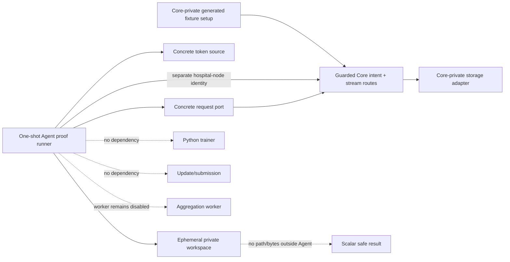
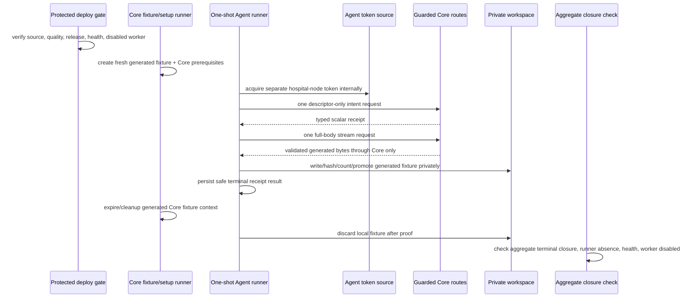

# Hospital Node Agent — Protected Deployment and One-Shot Generated-Fixture Proof

**Status:** L4e1 design dossier. It authorizes no protected Agent deployment, request-port/token-source/filesystem wiring, Core/Azure invocation, generated-fixture transfer, training, update, submission, aggregation, hospital integration, or clinical operation.

**Scope:** This dossier closes the gap between locally tested injected adapter logic and a future one-shot synthetic proof. It defines how a protected Agent test composition could be released and checked without turning the Agent into a public service, without sharing storage/provider capability, and without treating a generated fixture as a production model or training input.

## 1. Nontechnical requirements and acceptance boundaries

L4d proves local adapter logic only. The next increment must demonstrate that a separately authenticated synthetic Agent can use the guarded Core boundary exactly once under a controlled runtime composition. The exercise is valuable only if it preserves the research ledger’s falsifiability: each source release, runtime gate, invocation, denial, closure, and limit must be time-ordered and publishable without any credential, locator, provider, body, header, local path, hospital, or patient detail.

| Requirement | Acceptance signal | Explicitly not established |
|---|---|---|
| Preserve Core authority | The Agent connects only to the already guarded Core intent/stream boundary; Core remains the only storage-facing authority. | Direct storage access, provider readiness, artifact release policy, or generalized download service. |
| Preserve Agent locality | One opt-in, non-public Agent runner uses only generated fixture bytes and private ephemeral workspace state. | Persistent hospital node, public endpoint, patient/EHR/PACS connection, local dataset use, or real hospital onboarding. |
| Preserve identity separation | The Agent uses the existing separate hospital-node audience/client reference, never a human, browser, ML-worker, callback, or provider identity. | A broadly reusable production identity, browser flow, delegated access, or identity federation claim. |
| Preserve bounded evidence | Exactly one successful guarded stream attempt is permitted only after all gates; aggregate-safe closure is checked. | Throughput, resilience, repeated retries, concurrent nodes, model quality, trainer compatibility, or clinical value. |
| Preserve aggregation safety | `AGGREGATION_WORKER_ENABLED=false` remains observable before and after the run. | A worker run, aggregation, round progression, update submission, or model release. |

> The proof, if later run, demonstrates one controlled Agent consumption of one generated non-clinical fixture through Core. It does not demonstrate a production download feature, a training start, a hospital integration, or scientific performance.

## 2. Technical requirements and protected configuration ownership

The Agent is not promoted to an always-on deployed service in L4e. Its proof form is a one-shot Compose runner with **no `ports` directive**, no public listener, `restart: "no"`, and no default profile activation. The protected composition root may reference opaque existing secret files and an opaque Core origin configuration, but it must not print, inspect, serialize, copy to Git, or write those values into logs, events, test output, status, or public documents.

| Component | Required future ownership | Permitted protected input | Forbidden value or behavior |
|---|---|---|---|
| Agent proof runner | Agent Compose profile and runner process. | Opaque runtime configuration reference, private OIDC secret reference, bounded proof enable flag. | Public port, daemon/restart, plaintext secret, generic Core URL input, training/update/aggregation flag. |
| Workload token source | Concrete Agent composition. | Existing separate hospital-node client reference and literal audience. | Human/ML-worker/callback token, token print/persistence, token passed through domain/SQLite/event/status. |
| Request port | Concrete Agent composition. | Fixed normalized Core origin and bounded time/size policy from protected runtime configuration. | Direct object-storage/provider endpoint, redirect following, generic route/header/body input, Range, raw error body. |
| Workspace port | Concrete Agent composition. | Private ephemeral mounted workspace root owned by Agent process. | Host/public/shared data mount, path persistence, fixture export, arbitrary directory scan, real local dataset. |
| Fixture authority | Core-private setup inside a bounded composite profile. | Tiny generated non-clinical fixture and fresh generated Core prerequisites. | Provider locator/credential disclosure, direct Agent setup access, persistent fixture, real model/data. |

Concrete request, token, and filesystem adapters must be composed only in the proof runner; the Agent application/domain/SQLite interfaces remain unchanged. The runner receives no command-line secret value. A missing protected reference must fail the profile before a route request and publish a safe configuration failure instead of falling back to an unprotected value.

## 3. Deployment topology and configuration schema



The proof profile is composed alongside the existing private Core validation environment rather than exposing a new host service. It must use a sealed internal network path or the controlled Core HTTPS entrypoint documented by the deployment configuration; no browser, public Agent port, host data directory, or provider network configuration is introduced. The Core side creates/cleans its own generated fixture through private test composition. The Agent sees only the guarded Core typed response.

| Schema class | Required fields | Persistence/redaction rule |
|---|---|---|
| Proof runtime config | Boolean enable flag, bounded byte limit, bounded timeouts, opaque Core origin reference, opaque secret-file reference, opaque private-workspace reference. | References are deployment-only and never logged, returned, committed, or stored in SQLite. |
| Agent proof record | Safe runner result (`succeeded`, classified pre-route refusal, or classified post-route failure), equality booleans, duration bucket, terminal receipt state. | No token, URL, header/body, fixture bytes, workspace path, provider detail, database value, data field, or free-text exception. |
| Core closure record | Existing stream session/read-intent/assignment/lease event aggregates. | Query/report aggregate-safe counts only; do not inspect locator-bearing artifact/provider data. |

## 4. One-shot workflow and state closure



The profile may invoke the guarded stream **once**. It must use a rebuilt image (`run --build`) and reuse the existing active separate hospital-node workload mapping rather than inserting another issuer/subject mapping. The Core-side fixture context must remain live only until the Agent terminal result is observed, then close generated Agent/Core proof state and remove the Agent’s ephemeral materialization. The proof does not invoke Python, local training, update packaging, submission, queue dispatch, or aggregation.

| Step | Required safe result | Stop/retry rule |
|---|---|---|
| Source/deployment gate | Both Agent and Core local quality/repository checks and required protected deployment conclusions are recorded. | A failed quality/deployment gate blocks all runtime work. |
| Preflight | Intended source releases, Core live/ready health, disabled worker marker, no prior runner, and no active proof state are observed safely. | Any mismatch blocks before fixture creation or route request. |
| Token | Separate hospital-node token acquired internally. | Failure is pre-route; record a safe code before repair/retry. |
| Intent/stream | One typed intent then one full-body stream; Agent checks all immutable facts and local integrity. | Redirect/partial/denial/mismatch/interruption is terminal for that intent; record before another attempt. |
| Local cleanup | Materialization is discarded after proof; Agent emits scalar-safe outcome only. | Cleanup failure blocks closure and requires publication before any retry. |
| Core cleanup | Runner expires/closes generated facts and fixture context. | Inspect only aggregate-safe state; no storage/provider inspection. |
| Postflight | Completed/consumed/terminal aggregate state, zero active proof state, zero runner, health, and disabled worker are checked. | Any residual state is a failure record, not a reason to repeat. |

## 5. Architecture, dependency direction, and safety controls

The concrete L4d adapters remain inside the Agent composition root. The L4e profile supplies real runtime implementations only through narrowly named ports: `HospitalNodeWorkloadTokenSource`, `HospitalNodeCoreRequestPort`, and `PrivateWorkspaceFilesystemPort`. No application/domain/contract/SQLite module may import a deployment, environment, HTTP, OIDC, filesystem, storage, or provider module. The proof runner is the only place where configuration references are resolved and must discard secrets immediately after adapter construction.

| Control | Required enforcement |
|---|---|
| Identity isolation | Literal hospital-node audience; no ML-worker/human/browser/callback identity; token remains adapter-local. |
| Route isolation | Internal concrete client permits only guarded intent and stream route constructors; no generic caller-selected path/query/header/body. |
| Response isolation | Redirect, `206`, multipart/encoded/unbounded/malformed responses are denied before body delivery; raw response is never parsed/logged. |
| Storage isolation | Core retains provider access; Agent workspace is local ephemeral state only and returns no path/bytes. |
| Resource bounds | Configure positive timeout/size limit; enforce stream size, exclusive temporary write, same-root promotion, cleanup/discard. |
| Observability | Allow only operation class, outcome code, equality booleans, safe duration/size bucket, and aggregate closure counts. |
| Runtime isolation | No public ports, no default profile, no restart, no persistent service, no host data mount, no trainer/update/submission/aggregation command. |
| Failure isolation | One shot only; post-route failure is published before any code change or retry; no automatic retry/resume/Range/reuse. |

## 6. API/readout contract and operational evidence

The proof uses no new public API. The Agent consumes the existing Core contract through its typed client and writes only existing local scalar receipt/materialization/event facts. The runner’s terminal process result is an allowlisted marker, not a body dump. The runner must not echo `Authorization`, a route URL, Core origin, headers, fixture content, checksum text, workspace root, or any provider/database detail.

```ts
export type BoundedAgentProofOutcome =
  | { readonly kind: "succeeded"; readonly receiptState: "verified"; readonly factsMatched: true }
  | { readonly kind: "pre_route_refused"; readonly code: "configuration" | "identity" | "preflight" }
  | { readonly kind: "terminal_failure"; readonly code: "intent" | "stream" | "integrity" | "workspace" | "cleanup" };

export interface AggregateProofClosure {
  readonly completedStreamSessions: number;
  readonly activeStreamSessions: number;
  readonly consumedReadIntents: number;
  readonly activeReadIntents: number;
  readonly activeLeases: number;
  readonly closureEvents: number;
  readonly runnerInstances: number;
  readonly workerEnabled: false;
}
```

The type is a readout constraint, not an implemented runtime interface. Counts may contain older bounded fixtures in an aggregate, so evidence must distinguish a run-specific safe marker from global terminal totals and never attribute unrelated expired records to the new proof.

## 7. Local tests, release gates, and bounded-proof plan

| Layer | Required positive evidence | Required denial evidence |
|---|---|---|
| Agent local code | L4d adapter tests plus concrete runtime-port configuration parsing in fakes. | Missing protected reference, wrong audience, non-HTTPS origin, public port, provider-style origin, redirect/partial/encoded response, unsafe root, cleanup failure. |
| Agent source quality | Formatting, strict types, TypeScript and Python tests, Compose/config static checks. | No source release if any test/static check fails. |
| Core compatibility | Existing guarded Core stream source remains compatible with the separate hospital-node audience and full-body contract. | No proof if Core release/contract changes or worker gate is not disabled. |
| Protected deployment | Agent proof image/profile and Core deployment complete under protected pipelines. | No proof on an unverified source release or a failed/in-progress deployment. |
| Runtime preflight | Release identity, Core HTTP 200 live/ready, disabled worker, zero prior runner, and safe initial aggregate state. | No fixture/profile run if any preflight check fails. |
| One-shot proof | One `run --build` profile invocation, one generated fixture context, one intent, one stream, private verification, cleanup. | No automatic retry; publish a failure before any repeat. |
| Closure | Safe runner marker, terminal aggregate state, zero runner, health, disabled worker. | No conclusion if active proof state or cleanup uncertainty remains. |

## 8. AI implementation handoff

| Slice | Deliverable | Stop condition |
|---|---|---|
| L4e1 | This dossier, evidence readout, release gates, workflow, failure policy, and proof plan. | No runtime wiring or invocation. |
| L4e2 | Protected Compose/profile, runtime port adapters, one-shot runner, static config tests, Agent local quality, source commit/push. | No Azure/Core invocation or public exposure. |
| L4e3a | Protected Agent release/deployment conclusion plus Core compatibility/release/health/worker preflight record. | No profile run until every conclusion/gate is green. |
| L4e3b | One rebuilt one-shot generated-fixture invocation and aggregate-safe postflight. | No training, update, submission, aggregation, provider inspection, retry, or second run. |
| L4e4 | Actual-outcome ledger/dossier/roadmap publication and checkpoint. | Do not begin a new boundary until terminal evidence is complete. |

Any need to expose an Agent port, copy a secret, use direct storage, inspect a locator/provider response, receive real data, run training, submit an update, enable aggregation, use a human/ML-worker identity, repeat a failed post-route run, or claim an unverified operational property is a fail-closed blocker requiring a new ledger decision.

## 9. Implementation evidence — L4e2 protected preflight profile

Hospital Node Agent commit `ea97b69` adds the protected proof-profile preparation without an invocation. The new Compose file defines the opt-in `hospital-node-core-stream-proof` profile with no `ports` directive, `restart: "no"`, no host data mount, an opaque secret-file reference, and a restricted tmpfs workspace. Its command is only `agent:proof-preflight`; it does not compose a request/token/filesystem runtime adapter or call Core.

The preflight command validates proof enablement, a normalized HTTPS Core origin, a `/run/secrets/` reference, a private `/run/hospital-node-proof/` workspace reference, and positive timeout/byte bounds. It returns only a scalar-safe ready/refused result; its public output excludes the Core origin, secret reference, workspace value, token, route, header/body, provider detail, and path. The configuration validator itself reads no environment; the entrypoint reads deployment values only at the composition boundary and does not acquire a token, create a request, or write a workspace.

Local `pnpm run ci` passed after L4e2: formatting, strict TypeScript, **35 TypeScript tests**, and **4 Python tests**. Tests verify the opt-in protected configuration and deny disabled, non-HTTPS/path-bearing, missing-secret-reference, unsafe-workspace, and nonpositive-size inputs. The sandbox has no Docker executable, so Compose semantic rendering could not be run locally; a non-executing source-level check confirmed the expected profile, preflight command, no `ports` declaration, `restart: "no"`, tmpfs, and secret-reference markers. Protected Compose rendering remains a required release gate in the target runtime before any invocation.

No profile has been run or deployed. No real token, Core/Azure request, socket, host filesystem action, fixture byte, provider interaction, training, update, submission, aggregation, hospital data, or clinical workflow occurred. `CORE_AGENT_PROOF_HANDOFF_COORDINATION.md` now has its local pure/fake coordination components: Core strict handoff/result validators and Agent lease-first orchestration. Only after source/release, target Compose, Core health/worker, runner, and safe-initial-state gates are recorded may the one-shot profile be considered.

## 10. Protected preflight record — source gates pass; target Agent composition remains absent

The Agent source release `8e53c22f988f433528a0363aca85446925eadc99` passed Hospital Node Quality Gates run `32617651527`. The Core pure handoff release `a64488d2fc688fbaea974e865aa89e25542978d8` passed Core Quality Gates run `32617558237` and protected Azure deployment run `32617559177`. Read-only Azure checks then observed public Core liveness/readiness HTTP 200 and the aggregation worker’s disabled marker. These are prerequisite observations only; they do not prove an Agent profile.

The same target-layout inspection found only the Core release structure under `/srv/fedagg` and no deployed Agent proof composition. The sandbox also has no Docker executable, so target Compose rendering cannot be substituted with a local render. Because the private handoff coordinator, directional ephemeral channel mounts, Agent image source, and Agent runtime profile are not yet target-composed, **L4e3 is blocked before fixture creation, token acquisition, lease, intent, stream, workspace write, or any Core route call**. This is a safe pre-route block, not a proof failure, and it does not authorize a retry.

## 11. Implementation evidence — private file-channel adapter and topology template

Agent release `d8857d31a0058db41ff106e63918c4446a4728b0` adds a narrow private file-channel adapter behind an injected filesystem port. The adapter can read one opaque handoff and write one exclusive serialized scalar result; it neither accepts a caller-selected path nor exposes a directory, network, token, provider, workspace, fixture byte, or result capability. Before writing, it revalidates the result schema and rejects unknown fields and impossible `succeeded` / `pre_route_refused` combinations. Its tests use in-memory functions only and show that the serialized result contains neither the handoff assignment identifier nor command digest.

The same release normalizes the non-executing Core/Agent topology template. It declares only the opt-in `hospital-node-private-proof` profile, one directional handoff mount from Core to Agent, one directional result mount from Agent to Core, read-only service roots, service tmpfs, `restart: "no"`, and opaque secret-file references. It exposes no `ports` directive, host bind, persistent application volume, default activation, runnable image binding, or target deployment. Local `pnpm run ci` passed formatting, strict TypeScript, **41 TypeScript tests**, and **4 Python tests**; Hospital Node Quality Gates run `32619077821` completed successfully.

Source review then found that the named directional channel volumes still used the Compose `local` driver’s default persistence semantics. Agent release `52f3130d850fbb0da1f5992296f6f0eba762ed1b` corrects both `proof-handoff` and `proof-result` with bounded `tmpfs` driver options (`64k`, mode `0700`). A source-level static check verified two tmpfs declarations, two tmpfs devices, the Core-to-Agent and Agent-to-Core read-only mounts, and the absence of ports or host binds. Local `pnpm run ci` again passed formatting, strict TypeScript, **41 TypeScript tests**, and **4 Python tests**; Hospital Node Quality Gates run `32621636293` succeeded. This correction validates source intent only; target Compose rendering must confirm runtime support before any profile invocation.

This is source and CI evidence only. The target still has no reviewed Agent image release, Core-side coordinator runtime runner, protected composite deployment, or Azure Compose render. The prior pre-route block therefore remains in force: no fixture creation, token acquisition, lease, intent, stream, workspace write, Core route call, training, submission, or aggregation is authorized by this release.

## 12. Azure read-only preflight — source/topology absence blocks rendering

After the Core coordinator composition and Agent tmpfs topology source gates completed, a read-only Azure preflight observed public Core liveness and readiness at HTTP `200`. The running aggregation worker emitted its explicit disabled-state marker. No Hospital Node Agent source directory, protected composite topology file, or running Hospital Node proof runner was present in the target layout.

Because the target has no deployable Agent source/image binding or composite profile to render, an Azure `docker compose config` invocation would not be meaningful and was not attempted. This is a **safe pre-route block**, not a proof failure: no generated fixture, secret read, Agent token, lease, intent, stream, workspace write, route request, training, submission, provider interaction, or aggregation was performed. The next allowed work is to deliver reviewed Core/Agent runtime adapters and a protected composite source release; any later render remains Azure-only and read-only.

## 13. Design record — protected Agent image and source-only entrypoint

The next Agent slice defines a dedicated protected image source and an intentionally non-invoking entrypoint. Its purpose is to replace the current test-only default status command with a reviewable proof-specific image contract while retaining the absence of live runtime wiring. The entrypoint may read only process-local protected configuration at the outer composition boundary, validate it with the existing scalar-safe validator, and emit a versioned scalar `ready` / `refused` readout. It must not acquire a token, construct the typed Core request client, open a channel, read a handoff, write a result, use a workspace, invoke `runPrivateProofRunner`, or contact Azure/Core/storage/provider services.

| Image/entrypoint control | Required source behavior | Explicitly excluded |
| --- | --- | --- |
| Image selection | A separate proof-runner Dockerfile/target with Node 22, frozen lockfile install, no added native or network client dependency, non-root process, and an explicit non-daemon command. | Build/push, tag publication, deployment binding, host mount, public port, default activation, restart loop. |
| Entrypoint authorization | Existing proof-enable flag and opaque protected references are validated at process start. | Secret value printing, generic CLI configuration, secret fallback, token acquisition, identity reuse. |
| Readout | Versioned allowlisted scalar status plus process exit code; no origins, paths, secret references, headers/bodies, fixture/result facts, diagnostic text, bytes, or provider data. | Runtime completion claim, Core/Agent communication claim, health endpoint, event persistence. |
| Dependency direction | Entrypoint depends only on runtime configuration validation and scalar readout types; `runPrivateProofRunner` remains uncalled until a later concrete adapter composition review. | Filesystem, OIDC, HTTP, storage, database, trainer, submission, aggregation, or channel import. |
| Tests | Deterministic subprocess-free function tests for ready/refused and sensitive-field exclusion; Dockerfile static tests verify no ports, no root default, no daemon/restart assumptions. | Docker build, container execution, Compose render, Azure access, fixture/proof invocation. |

The entrypoint’s initial `ready` status means only that a local process received a structurally valid protected configuration shape. It does **not** mean that a proof runner is executable, that any secret/reference works, that an image is built, that a channel is present, or that an Agent can contact Core. Concrete token/request/filesystem/channel composition and image build/release binding remain separate future gates.

## 14. Implementation evidence — protected Agent image source and non-invoking entrypoint

Agent release `714480d9451197c6d636427ae0b947d23dd12fc4` adds `Dockerfile.proof-runner` and a proof-image preflight command. The Dockerfile uses Node 22, a frozen lockfile install, repository files owned by the unprivileged `node` account, an explicit `USER node`, and an explicit `agent:proof-image-preflight` command. It declares no `EXPOSE` or `ENTRYPOINT`, does not invoke the private proof runner, and was not built, pushed, tagged, deployed, or run as a container.

The entrypoint projects existing protected configuration validation into `hospital-node-proof-image-readout/v1`: `ready` exposes only `proofEnabled: true` and `publicPort: false`; refusal exposes only the existing allowlisted code. It returns no origin, secret reference, workspace root, timeout, byte limit, handoff/result, token, header/body, fixture, provider, or diagnostic text. The command reads process environment at the outer boundary only and does not construct an OIDC source, Core client, channel, workspace, executor, or runtime proof invocation.

Three new deterministic tests cover ready-readout redaction, allowlisted refusal, non-root/static Dockerfile constraints, and absence of a public listener/runtime-runner command. Local `pnpm run ci` passed formatting, strict TypeScript, **44 TypeScript tests**, and **4 Python tests**; Hospital Node Quality Gates run `32665704597` completed successfully. This is source and CI evidence only. A target image build/release binding, concrete adapter composition, Azure topology render, and proof remain absent and blocked pre-route.

## References

[1] [NIST SP 800-207: Zero Trust Architecture](https://csrc.nist.gov/pubs/sp/800/207/final)

[2] [Core-mediated generated-model streaming dossier](https://github.com/hstu-research/federated-aggregator-docs/blob/main/docs/CORE_MEDIATED_MODEL_STREAMING.md)

[3] [Typed Core client and private workspace contract](https://github.com/hstu-research/federated-aggregator-docs/blob/main/docs/HOSPITAL_NODE_AGENT_CORE_CLIENT_AND_PRIVATE_WORKSPACE.md)

[4] [Reusable bounded federated control-plane workflow](https://github.com/hstu-research/federated-aggregator-docs/blob/main/docs/CORE_HOSPITAL_NODE_WORKLOAD_CONTRACT.md)
