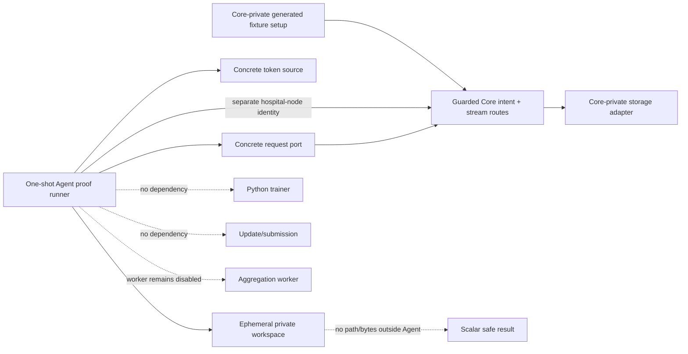
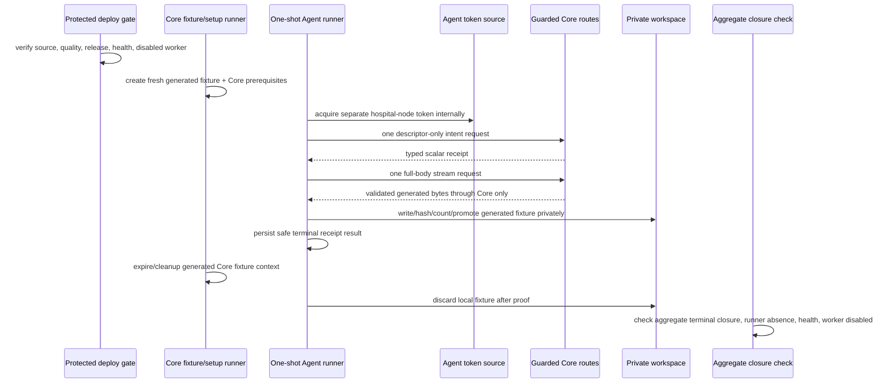
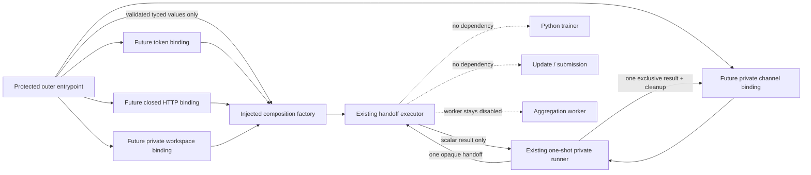

# Hospital Node Agent — Protected Deployment and One-Shot Generated-Fixture Proof

**Status:** L4e2k design and source-evidence dossier. It records injected-only local composition and the next target-safe binding design, but authorizes no protected Agent deployment, concrete request-port/token-source/filesystem wiring, Core/Azure invocation, generated-fixture transfer, training, update, submission, aggregation, hospital integration, or clinical operation.

**Scope:** This dossier closes the gap between locally tested injected adapter logic and a future one-shot synthetic proof. It defines how a protected Agent test composition could be released and checked without turning the Agent into a public service, without sharing storage/provider capability, and without treating a generated fixture as a production model or training input.

## 1. Nontechnical requirements and acceptance boundaries

L4d proves local adapter logic only. The next increment must demonstrate that a separately authenticated synthetic Agent can use the guarded Core boundary exactly once under a controlled runtime composition. The exercise is valuable only if it preserves the research ledger’s falsifiability: each source release, runtime gate, invocation, denial, closure, and limit must be time-ordered and publishable without any credential, locator, provider, body, header, local path, hospital, or patient detail.

| Requirement | Acceptance signal | Explicitly not established |
|---|---|---|
| Preserve Core authority | The Agent connects only to the already guarded Core intent/stream boundary; Core remains the only storage-facing authority. | Direct storage access, provider readiness, artifact release policy, or generalized download service. |
| Preserve Agent locality | One opt-in, non-public Agent runner uses only generated fixture bytes and private ephemeral workspace state. | Persistent hospital node, public endpoint, patient/EHR/PACS connection, local dataset use, or real hospital onboarding. |
| Preserve identity separation | The Agent uses the existing separate hospital-node audience/client reference, never a human, browser, ML-worker, callback, or provider identity. | A broadly reusable production identity, browser flow, delegated access, or identity federation claim. |
| Preserve bounded evidence | Exactly one successful guarded stream attempt is permitted only after all gates; aggregate-safe closure is checked. | Throughput, resilience, repeated retries, concurrent nodes, model quality, trainer compatibility, or clinical value. |
| Preserve aggregation safety | `AGGREGATION_WORKER_ENABLED=false` remains observable before and after the run. | A worker run, aggregation, round progression, update submission, or model release. |

> The proof, if later run, demonstrates one controlled Agent consumption of one generated non-clinical fixture through Core. It does not demonstrate a production download feature, a training start, a hospital integration, or scientific performance.

## 2. Technical requirements and protected configuration ownership

The Agent is not promoted to an always-on deployed service in L4e. Its proof form is a one-shot Compose runner with **no `ports` directive**, no public listener, `restart: "no"`, and no default profile activation. The protected composition root may reference opaque existing secret files and an opaque Core origin configuration, but it must not print, inspect, serialize, copy to Git, or write those values into logs, events, test output, status, or public documents.

| Component | Required future ownership | Permitted protected input | Forbidden value or behavior |
|---|---|---|---|
| Agent proof runner | Agent Compose profile and runner process. | Opaque runtime configuration reference, private OIDC secret reference, bounded proof enable flag. | Public port, daemon/restart, plaintext secret, generic Core URL input, training/update/aggregation flag. |
| Workload token source | Concrete Agent composition. | Existing separate hospital-node client reference and literal audience. | Human/ML-worker/callback token, token print/persistence, token passed through domain/SQLite/event/status. |
| Request port | Concrete Agent composition. | Fixed normalized Core origin and bounded time/size policy from protected runtime configuration. | Direct object-storage/provider endpoint, redirect following, generic route/header/body input, Range, raw error body. |
| Workspace port | Concrete Agent composition. | Private ephemeral mounted workspace root owned by Agent process. | Host/public/shared data mount, path persistence, fixture export, arbitrary directory scan, real local dataset. |
| Fixture authority | Core-private setup inside a bounded composite profile. | Tiny generated non-clinical fixture and fresh generated Core prerequisites. | Provider locator/credential disclosure, direct Agent setup access, persistent fixture, real model/data. |

Concrete request, token, and filesystem adapters must be composed only in the proof runner; the Agent application/domain/SQLite interfaces remain unchanged. The runner receives no command-line secret value. A missing protected reference must fail the profile before a route request and publish a safe configuration failure instead of falling back to an unprotected value.

## 3. Deployment topology and configuration schema



The proof profile is composed alongside the existing private Core validation environment rather than exposing a new host service. It must use a sealed internal network path or the controlled Core HTTPS entrypoint documented by the deployment configuration; no browser, public Agent port, host data directory, or provider network configuration is introduced. The Core side creates/cleans its own generated fixture through private test composition. The Agent sees only the guarded Core typed response.

| Schema class | Required fields | Persistence/redaction rule |
|---|---|---|
| Proof runtime config | Boolean enable flag, bounded byte limit, bounded timeouts, opaque Core origin reference, opaque secret-file reference, opaque private-workspace reference. | References are deployment-only and never logged, returned, committed, or stored in SQLite. |
| Agent proof record | Safe runner result (`succeeded`, classified pre-route refusal, or classified post-route failure), equality booleans, duration bucket, terminal receipt state. | No token, URL, header/body, fixture bytes, workspace path, provider detail, database value, data field, or free-text exception. |
| Core closure record | Existing stream session/read-intent/assignment/lease event aggregates. | Query/report aggregate-safe counts only; do not inspect locator-bearing artifact/provider data. |

## 4. One-shot workflow and state closure



The profile may invoke the guarded stream **once**. It must use a rebuilt image (`run --build`) and reuse the existing active separate hospital-node workload mapping rather than inserting another issuer/subject mapping. The Core-side fixture context must remain live only until the Agent terminal result is observed, then close generated Agent/Core proof state and remove the Agent’s ephemeral materialization. The proof does not invoke Python, local training, update packaging, submission, queue dispatch, or aggregation.

| Step | Required safe result | Stop/retry rule |
|---|---|---|
| Source/deployment gate | Both Agent and Core local quality/repository checks and required protected deployment conclusions are recorded. | A failed quality/deployment gate blocks all runtime work. |
| Preflight | Intended source releases, Core live/ready health, disabled worker marker, no prior runner, and no active proof state are observed safely. | Any mismatch blocks before fixture creation or route request. |
| Token | Separate hospital-node token acquired internally. | Failure is pre-route; record a safe code before repair/retry. |
| Intent/stream | One typed intent then one full-body stream; Agent checks all immutable facts and local integrity. | Redirect/partial/denial/mismatch/interruption is terminal for that intent; record before another attempt. |
| Local cleanup | Materialization is discarded after proof; Agent emits scalar-safe outcome only. | Cleanup failure blocks closure and requires publication before any retry. |
| Core cleanup | Runner expires/closes generated facts and fixture context. | Inspect only aggregate-safe state; no storage/provider inspection. |
| Postflight | Completed/consumed/terminal aggregate state, zero active proof state, zero runner, health, and disabled worker are checked. | Any residual state is a failure record, not a reason to repeat. |

## 5. Architecture, dependency direction, and safety controls

The concrete L4d adapters remain inside the Agent composition root. The L4e profile supplies real runtime implementations only through narrowly named ports: `HospitalNodeWorkloadTokenSource`, `HospitalNodeCoreRequestPort`, and `PrivateWorkspaceFilesystemPort`. No application/domain/contract/SQLite module may import a deployment, environment, HTTP, OIDC, filesystem, storage, or provider module. The proof runner is the only place where configuration references are resolved and must discard secrets immediately after adapter construction.

| Control | Required enforcement |
|---|---|
| Identity isolation | Literal hospital-node audience; no ML-worker/human/browser/callback identity; token remains adapter-local. |
| Route isolation | Internal concrete client permits only guarded intent and stream route constructors; no generic caller-selected path/query/header/body. |
| Response isolation | Redirect, `206`, multipart/encoded/unbounded/malformed responses are denied before body delivery; raw response is never parsed/logged. |
| Storage isolation | Core retains provider access; Agent workspace is local ephemeral state only and returns no path/bytes. |
| Resource bounds | Configure positive timeout/size limit; enforce stream size, exclusive temporary write, same-root promotion, cleanup/discard. |
| Observability | Allow only operation class, outcome code, equality booleans, safe duration/size bucket, and aggregate closure counts. |
| Runtime isolation | No public ports, no default profile, no restart, no persistent service, no host data mount, no trainer/update/submission/aggregation command. |
| Failure isolation | One shot only; post-route failure is published before any code change or retry; no automatic retry/resume/Range/reuse. |

## 6. API/readout contract and operational evidence

The proof uses no new public API. The Agent consumes the existing Core contract through its typed client and writes only existing local scalar receipt/materialization/event facts. The runner’s terminal process result is an allowlisted marker, not a body dump. The runner must not echo `Authorization`, a route URL, Core origin, headers, fixture content, checksum text, workspace root, or any provider/database detail.

```ts
export type BoundedAgentProofOutcome =
  | { readonly kind: "succeeded"; readonly receiptState: "verified"; readonly factsMatched: true }
  | { readonly kind: "pre_route_refused"; readonly code: "configuration" | "identity" | "preflight" }
  | { readonly kind: "terminal_failure"; readonly code: "intent" | "stream" | "integrity" | "workspace" | "cleanup" };

export interface AggregateProofClosure {
  readonly completedStreamSessions: number;
  readonly activeStreamSessions: number;
  readonly consumedReadIntents: number;
  readonly activeReadIntents: number;
  readonly activeLeases: number;
  readonly closureEvents: number;
  readonly runnerInstances: number;
  readonly workerEnabled: false;
}
```

The type is a readout constraint, not an implemented runtime interface. Counts may contain older bounded fixtures in an aggregate, so evidence must distinguish a run-specific safe marker from global terminal totals and never attribute unrelated expired records to the new proof.

## 7. Local tests, release gates, and bounded-proof plan

| Layer | Required positive evidence | Required denial evidence |
|---|---|---|
| Agent local code | L4d adapter tests plus concrete runtime-port configuration parsing in fakes. | Missing protected reference, wrong audience, non-HTTPS origin, public port, provider-style origin, redirect/partial/encoded response, unsafe root, cleanup failure. |
| Agent source quality | Formatting, strict types, TypeScript and Python tests, Compose/config static checks. | No source release if any test/static check fails. |
| Core compatibility | Existing guarded Core stream source remains compatible with the separate hospital-node audience and full-body contract. | No proof if Core release/contract changes or worker gate is not disabled. |
| Protected deployment | Agent proof image/profile and Core deployment complete under protected pipelines. | No proof on an unverified source release or a failed/in-progress deployment. |
| Runtime preflight | Release identity, Core HTTP 200 live/ready, disabled worker, zero prior runner, and safe initial aggregate state. | No fixture/profile run if any preflight check fails. |
| One-shot proof | One `run --build` profile invocation, one generated fixture context, one intent, one stream, private verification, cleanup. | No automatic retry; publish a failure before any repeat. |
| Closure | Safe runner marker, terminal aggregate state, zero runner, health, disabled worker. | No conclusion if active proof state or cleanup uncertainty remains. |

## 8. AI implementation handoff

| Slice | Deliverable | Stop condition |
|---|---|---|
| L4e1 | This dossier, evidence readout, release gates, workflow, failure policy, and proof plan. | No runtime wiring or invocation. |
| L4e2 | Protected Compose/profile, runtime port adapters, one-shot runner, static config tests, Agent local quality, source commit/push. | No Azure/Core invocation or public exposure. |
| L4e3a | Protected Agent release/deployment conclusion plus Core compatibility/release/health/worker preflight record. | No profile run until every conclusion/gate is green. |
| L4e3b | One rebuilt one-shot generated-fixture invocation and aggregate-safe postflight. | No training, update, submission, aggregation, provider inspection, retry, or second run. |
| L4e4 | Actual-outcome ledger/dossier/roadmap publication and checkpoint. | Do not begin a new boundary until terminal evidence is complete. |

Any need to expose an Agent port, copy a secret, use direct storage, inspect a locator/provider response, receive real data, run training, submit an update, enable aggregation, use a human/ML-worker identity, repeat a failed post-route run, or claim an unverified operational property is a fail-closed blocker requiring a new ledger decision.

## 9. Implementation evidence — L4e2 protected preflight profile

Hospital Node Agent commit `ea97b69` adds the protected proof-profile preparation without an invocation. The new Compose file defines the opt-in `hospital-node-core-stream-proof` profile with no `ports` directive, `restart: "no"`, no host data mount, an opaque secret-file reference, and a restricted tmpfs workspace. Its command is only `agent:proof-preflight`; it does not compose a request/token/filesystem runtime adapter or call Core.

The preflight command validates proof enablement, a normalized HTTPS Core origin, a `/run/secrets/` reference, a private `/run/hospital-node-proof/` workspace reference, and positive timeout/byte bounds. It returns only a scalar-safe ready/refused result; its public output excludes the Core origin, secret reference, workspace value, token, route, header/body, provider detail, and path. The configuration validator itself reads no environment; the entrypoint reads deployment values only at the composition boundary and does not acquire a token, create a request, or write a workspace.

Local `pnpm run ci` passed after L4e2: formatting, strict TypeScript, **35 TypeScript tests**, and **4 Python tests**. Tests verify the opt-in protected configuration and deny disabled, non-HTTPS/path-bearing, missing-secret-reference, unsafe-workspace, and nonpositive-size inputs. The sandbox has no Docker executable, so Compose semantic rendering could not be run locally; a non-executing source-level check confirmed the expected profile, preflight command, no `ports` declaration, `restart: "no"`, tmpfs, and secret-reference markers. Protected Compose rendering remains a required release gate in the target runtime before any invocation.

No profile has been run or deployed. No real token, Core/Azure request, socket, host filesystem action, fixture byte, provider interaction, training, update, submission, aggregation, hospital data, or clinical workflow occurred. `CORE_AGENT_PROOF_HANDOFF_COORDINATION.md` now has its local pure/fake coordination components: Core strict handoff/result validators and Agent lease-first orchestration. Only after source/release, target Compose, Core health/worker, runner, and safe-initial-state gates are recorded may the one-shot profile be considered.

## 10. Protected preflight record — source gates pass; target Agent composition remains absent

The Agent source release `8e53c22f988f433528a0363aca85446925eadc99` passed Hospital Node Quality Gates run `32617651527`. The Core pure handoff release `a64488d2fc688fbaea974e865aa89e25542978d8` passed Core Quality Gates run `32617558237` and protected Azure deployment run `32617559177`. Read-only Azure checks then observed public Core liveness/readiness HTTP 200 and the aggregation worker’s disabled marker. These are prerequisite observations only; they do not prove an Agent profile.

The same target-layout inspection found only the Core release structure under `/srv/fedagg` and no deployed Agent proof composition. The sandbox also has no Docker executable, so target Compose rendering cannot be substituted with a local render. Because the private handoff coordinator, directional ephemeral channel mounts, Agent image source, and Agent runtime profile are not yet target-composed, **L4e3 is blocked before fixture creation, token acquisition, lease, intent, stream, workspace write, or any Core route call**. This is a safe pre-route block, not a proof failure, and it does not authorize a retry.

## 11. Implementation evidence — private file-channel adapter and topology template

Agent release `d8857d31a0058db41ff106e63918c4446a4728b0` adds a narrow private file-channel adapter behind an injected filesystem port. The adapter can read one opaque handoff and write one exclusive serialized scalar result; it neither accepts a caller-selected path nor exposes a directory, network, token, provider, workspace, fixture byte, or result capability. Before writing, it revalidates the result schema and rejects unknown fields and impossible `succeeded` / `pre_route_refused` combinations. Its tests use in-memory functions only and show that the serialized result contains neither the handoff assignment identifier nor command digest.

The same release normalizes the non-executing Core/Agent topology template. It declares only the opt-in `hospital-node-private-proof` profile, one directional handoff mount from Core to Agent, one directional result mount from Agent to Core, read-only service roots, service tmpfs, `restart: "no"`, and opaque secret-file references. It exposes no `ports` directive, host bind, persistent application volume, default activation, runnable image binding, or target deployment. Local `pnpm run ci` passed formatting, strict TypeScript, **41 TypeScript tests**, and **4 Python tests**; Hospital Node Quality Gates run `32619077821` completed successfully.

Source review then found that the named directional channel volumes still used the Compose `local` driver’s default persistence semantics. Agent release `52f3130d850fbb0da1f5992296f6f0eba762ed1b` corrects both `proof-handoff` and `proof-result` with bounded `tmpfs` driver options (`64k`, mode `0700`). A source-level static check verified two tmpfs declarations, two tmpfs devices, the Core-to-Agent and Agent-to-Core read-only mounts, and the absence of ports or host binds. Local `pnpm run ci` again passed formatting, strict TypeScript, **41 TypeScript tests**, and **4 Python tests**; Hospital Node Quality Gates run `32621636293` succeeded. This correction validates source intent only; target Compose rendering must confirm runtime support before any profile invocation.

This is source and CI evidence only. The target still has no reviewed Agent image release, Core-side coordinator runtime runner, protected composite deployment, or Azure Compose render. The prior pre-route block therefore remains in force: no fixture creation, token acquisition, lease, intent, stream, workspace write, Core route call, training, submission, or aggregation is authorized by this release.

## 12. Azure read-only preflight — source/topology absence blocks rendering

After the Core coordinator composition and Agent tmpfs topology source gates completed, a read-only Azure preflight observed public Core liveness and readiness at HTTP `200`. The running aggregation worker emitted its explicit disabled-state marker. No Hospital Node Agent source directory, protected composite topology file, or running Hospital Node proof runner was present in the target layout.

Because the target has no deployable Agent source/image binding or composite profile to render, an Azure `docker compose config` invocation would not be meaningful and was not attempted. This is a **safe pre-route block**, not a proof failure: no generated fixture, secret read, Agent token, lease, intent, stream, workspace write, route request, training, submission, provider interaction, or aggregation was performed. The next allowed work is to deliver reviewed Core/Agent runtime adapters and a protected composite source release; any later render remains Azure-only and read-only.

## 13. Design record — protected Agent image and source-only entrypoint

The next Agent slice defines a dedicated protected image source and an intentionally non-invoking entrypoint. Its purpose is to replace the current test-only default status command with a reviewable proof-specific image contract while retaining the absence of live runtime wiring. The entrypoint may read only process-local protected configuration at the outer composition boundary, validate it with the existing scalar-safe validator, and emit a versioned scalar `ready` / `refused` readout. It must not acquire a token, construct the typed Core request client, open a channel, read a handoff, write a result, use a workspace, invoke `runPrivateProofRunner`, or contact Azure/Core/storage/provider services.

| Image/entrypoint control | Required source behavior | Explicitly excluded |
| --- | --- | --- |
| Image selection | A separate proof-runner Dockerfile/target with Node 22, frozen lockfile install, no added native or network client dependency, non-root process, and an explicit non-daemon command. | Build/push, tag publication, deployment binding, host mount, public port, default activation, restart loop. |
| Entrypoint authorization | Existing proof-enable flag and opaque protected references are validated at process start. | Secret value printing, generic CLI configuration, secret fallback, token acquisition, identity reuse. |
| Readout | Versioned allowlisted scalar status plus process exit code; no origins, paths, secret references, headers/bodies, fixture/result facts, diagnostic text, bytes, or provider data. | Runtime completion claim, Core/Agent communication claim, health endpoint, event persistence. |
| Dependency direction | Entrypoint depends only on runtime configuration validation and scalar readout types; `runPrivateProofRunner` remains uncalled until a later concrete adapter composition review. | Filesystem, OIDC, HTTP, storage, database, trainer, submission, aggregation, or channel import. |
| Tests | Deterministic subprocess-free function tests for ready/refused and sensitive-field exclusion; Dockerfile static tests verify no ports, no root default, no daemon/restart assumptions. | Docker build, container execution, Compose render, Azure access, fixture/proof invocation. |

The entrypoint’s initial `ready` status means only that a local process received a structurally valid protected configuration shape. It does **not** mean that a proof runner is executable, that any secret/reference works, that an image is built, that a channel is present, or that an Agent can contact Core. Concrete token/request/filesystem/channel composition and image build/release binding remain separate future gates.

## 14. Implementation evidence — protected Agent image source and non-invoking entrypoint

Agent release `714480d9451197c6d636427ae0b947d23dd12fc4` adds `Dockerfile.proof-runner` and a proof-image preflight command. The Dockerfile uses Node 22, a frozen lockfile install, repository files owned by the unprivileged `node` account, an explicit `USER node`, and an explicit `agent:proof-image-preflight` command. It declares no `EXPOSE` or `ENTRYPOINT`, does not invoke the private proof runner, and was not built, pushed, tagged, deployed, or run as a container.

The entrypoint projects existing protected configuration validation into `hospital-node-proof-image-readout/v1`: `ready` exposes only `proofEnabled: true` and `publicPort: false`; refusal exposes only the existing allowlisted code. It returns no origin, secret reference, workspace root, timeout, byte limit, handoff/result, token, header/body, fixture, provider, or diagnostic text. The command reads process environment at the outer boundary only and does not construct an OIDC source, Core client, channel, workspace, executor, or runtime proof invocation.

Three new deterministic tests cover ready-readout redaction, allowlisted refusal, non-root/static Dockerfile constraints, and absence of a public listener/runtime-runner command. Local `pnpm run ci` passed formatting, strict TypeScript, **44 TypeScript tests**, and **4 Python tests**; Hospital Node Quality Gates run `32665704597` completed successfully. This is source and CI evidence only. A target image build/release binding, concrete adapter composition, Azure topology render, and proof remain absent and blocked pre-route.

## 15. Focused review record — concrete Agent runtime adapter composition

The next Agent increment may compose the already reviewed `ConcreteHospitalNodeCoreClient`, `ConcretePrivateGeneratedFixtureWorkspace`, private file channel, and one-shot runner only through injected ports. It will be a pure composition factory with explicit enablement and a prevalidated configuration object. It must not implement a real token source, HTTP transport, filesystem access, Docker command, or target image binding in the same slice.

| Composition concern | Reviewed requirement | Denial / non-goal |
| --- | --- | --- |
| Configuration ownership | The outer protected entrypoint validates the environment once, discards concrete values from its readout, and supplies typed values only to the composition factory. | No environment access in package logic; no config, origin, workspace, timeout, or secret projection. |
| Identity seam | Factory accepts an injected `HospitalNodeWorkloadTokenSource`; the token remains within the concrete Core client. | No OIDC library, secret read, token cache, human/ML-worker/callback identity, or token output. |
| Transport seam | Factory accepts an injected closed `HospitalNodeCoreRequestPort`; fixed route and response policy remain inside the concrete Core client. | No fetch implementation, generic URL/header/body, redirect/Range/encoding fallback, retry scheduler, or provider client. |
| Workspace seam | Factory accepts an injected `PrivateWorkspaceFilesystemPort`; fixed root validation and pathless temporary/promote/discard lifecycle remain in the workspace adapter. | No Node filesystem import, host path/config persistence, directory scan, dataset mount, or exported file reference. |
| Channel seam | Factory accepts an injected private runner channel with one handoff read and one result write. | No channel directory enumeration, caller-selected file, network channel, repeated result, or public listener. |
| Executor binding | Factory binds the injected adapters to the existing fake-first lease → intent → stream → workspace orchestration. | No proof invocation, fixture creation, database/SQLite persistence change, training, update/submission, or aggregation. |
| Readout and closure | The factory returns the existing scalar runner result only; tests assert refusal-before-executor and no sensitive configuration/result projection. | No stdout process contract change, detailed error, bytes/path/token/URL/assignment/digest/provider field, or runtime success claim. |

The implementation test matrix will cover disabled/invalid configuration before any port call, ready composition with in-memory fakes, one handoff/result lifecycle, token/transport/workspace failures as scalar terminal results, and absence of retries. Real runtime adapters, actual OIDC secret handling, actual Core requests, actual tmpfs operations, image build/release, Azure Compose render, and a proof remain separate gates.

## 16. Implementation evidence — injected-only Agent runtime composition

Agent release `7983502a7a02b817600861a485ad15b6ad7f2315` implements the reviewed composition as `composeInjectedPrivateProofExecutor`. Its input requires an explicit enablement value, a prevalidated typed configuration object, and injected token, closed request, private-workspace filesystem, lease, and receipt-repository ports. The factory constructs only the pre-existing typed Core client and pathless private workspace, then binds them to the existing lease → intent → stream → verification orchestration. It never reads process configuration, parses a secret, acquires an identity, imports Node filesystem or HTTP APIs, discovers a channel, starts a profile, writes a terminal result directly, or binds an image/runtime target.

The existing one-shot private runner remains the sole owner of opaque handoff read, exactly-one scalar result write, and channel cleanup. The new executor returns the existing versioned scalar result to that runner; it cannot output a token, origin, timeout, workspace reference, assignment identifier, digest, header, body, fixture, provider field, path, or diagnostic. Deterministic fakes prove that disabled composition refuses before any supplied capability is touched; a ready composition yields one verified scalar result; and token, transport, or workspace failure ends in a terminal scalar outcome with the expected bounded call count and no retry.

Local `pnpm run ci` passed formatting, strict TypeScript, **47 TypeScript tests**, and **4 Python tests**. Hospital Node Quality Gates run `32666107849` completed successfully for the pushed release. This validates source wiring with fakes only. It does not validate a real OIDC source, HTTP request implementation, private filesystem implementation, handoff/result file-channel adapter binding, a built or released image, target Agent source, Core executable runner, Azure composite topology, Compose render, fixture, route call, or proof. The pre-route block remains active and the aggregation worker remains disabled.

The next permitted work is a separate design record for target-safe concrete runtime port bindings, split into distinct fake-first implementation slices. It must explicitly retain the distinction between static proof-image source and a built/released image, as well as Azure’s continuing absence of Agent source/image/profile material. No proof can be considered until those later source/release, target-staging, Azure-render, and renewed read-only preflight gates have all succeeded.

## 17. Design record — target-safe concrete runtime port bindings

This design turns the existing injected-port seams into four deliberately narrow future adapter contracts. It does not authorize their implementation or target use. The objective is to preserve the already proven source boundary while making any future target binding reviewable: one separate workload identity, two fixed Core request classes, one private workspace lifecycle, and one opaque directional handoff/result channel. Each adapter must be independently fake-tested, reviewed, released, and quality-gated before a composite target source can be staged.

> A future binding may connect a pre-existing protected runtime reference to a closed port. It may not widen the port, make a generic network/filesystem capability available, or treat a static source artifact as a built image, deployed service, or proof authorization.

### 17.1 Nontechnical and technical acceptance boundary

| Concern | Required future acceptance | Explicit non-goal |
| --- | --- | --- |
| Research value | The design makes a single synthetic Core-mediated receipt path auditable without exposing a provider capability or broad download surface. | Model quality, training benefit, clinical validity, hospital interoperability, or a production artifact service. |
| Identity | One injected adapter obtains a short-lived token only for the literal `fedagg-hospital-node` audience and keeps it adapter-local. | Human, browser, ML-worker, callback, provider, delegated, shared, cached, or printed token identity. |
| Transport | One injected adapter accepts only the closed request union owned by `ConcreteHospitalNodeCoreClient`; it cannot receive a caller-selected URL, header map, body, or redirect policy. | Generic HTTP client, direct storage/provider client, Range/resume, retry policy, body dump, or public listener. |
| Workspace | One injected adapter owns a private ephemeral root and realizes only the pathless temporary/append/close/promote/remove operations already declared. | Host bind, directory discovery, arbitrary path, dataset mount, fixture export, persistent artifact, or local-data scan. |
| Handoff/result | One injected adapter realizes only a fixed opaque handoff read and a fixed exclusive scalar-result write on directional temporary volumes. | File selection, enumeration, shared mutable channel, network channel, duplicate result, or handoff/result logging. |
| Closure | Every binding has a terminal denial/cleanup result and no automatic retry; the existing runner remains sole owner of exactly-one result output and final channel cleanup. | Silent recovery, retry loop, work resumption, aggregation enablement, update submission, or trainer call. |

### 17.2 Binding ownership, immutable configuration, and forbidden data

The protected outer entrypoint remains the only location that may resolve deployment references. It validates and converts those references into a typed configuration value before composition; the resulting factory and all application packages continue to receive only typed values and injected ports. No port constructor may read process environment, perform configuration discovery, or return configuration values through its public interface.

| Future binding | Protected owner | Internal immutable facts | Must never cross the port or public readout |
| --- | --- | --- | --- |
| Token source | Agent proof composition boundary | Literal audience; one bounded acquisition attempt; token expiry accepted internally. | Secret file content/reference, client identifier, token, claims, issuer, subject, cache key, exception text. |
| Closed request port | Agent proof composition boundary | Normalized HTTPS Core origin; positive connect/response limits; maximum byte size; fixed request union. | URL/origin, authorization header, raw request/response body, provider field, redirect chain, status text. |
| Private workspace filesystem | Agent process-private temporary root | Fixed root ownership/mode; exclusive opaque temporary reference; declared byte bound; same-root promotion/discard. | Root/path/filename, directory handle/listing, bytes, checksum working state, file descriptor, host mount detail. |
| Private proof channel filesystem | Agent/Core protected composite root | Fixed handoff/result names; handoff read-once; result exclusive-write-once; strict size/schema bounds. | Volume path/name, serialized handoff, assignment/digest, result file contents before validation, directory state. |

Future adapter code must explicitly reject missing or invalid typed inputs before initiating its underlying capability. A token adapter denial occurs before Core request construction; a request adapter denial returns the existing typed availability/terminal outcome; a workspace or channel denial closes through the existing terminal scalar result path. No adapter may create an additional event schema, persistence table, log sink, public status route, or retry scheduler.

### 17.3 Binding architecture and one-shot ownership



The diagram is a dependency rule rather than a deployment claim. The entrypoint supplies already-resolved values and port implementations; the executor receives only the existing handoff and returns only the existing scalar result. The request binding is not allowed to receive the private channel, workspace binding, or token output. The token binding is not allowed to receive a Core route, body, channel, workspace, or persistence handle. The workspace and channel bindings are independent fixed-operation adapters; neither may share an enumerating filesystem abstraction with application code.

### 17.4 State, failure, and cleanup matrix

| Stage | Permitted single action | Safe terminal outcome on failure | Mandatory closure / no-retry rule |
| --- | --- | --- | --- |
| Composition | Validate explicit enablement and typed values; construct closed ports. | Existing pre-route refusal before a port call. | No fallback configuration or alternate adapter. |
| Handoff | Read one opaque handoff through the channel adapter. | Existing scalar terminal result only after runner validation. | No re-read, discovery, or result write before valid handoff. |
| Lease/token/intent | Lease once; obtain token internally once per fixed operation; issue one typed intent. | Existing terminal/availability result projection. | No token cache exposure, route substitution, or automatic reattempt. |
| Full-body stream | Send only the fixed stream request and pass validated body iterator to workspace. | Existing terminal scalar after response/integrity denial. | No redirect, Range, partial/encoded body, resume, or second stream. |
| Workspace | Create one exclusive temporary reference; append, close, verify, promote or discard. | Existing terminal scalar after root/write/cleanup denial. | Remove temporary/promoted state as applicable; never export a path or bytes. |
| Result/closure | Runner writes one validated scalar result and invokes fixed cleanup. | Existing safe closure failure code. | No duplicate write, lingering record, runner restart, or proof repeat. |

### 17.5 Adapter-specific implementation requirements

| Slice | Required source boundary | Fake-first negative tests before any real binding | Stop condition |
| --- | --- | --- | --- |
| L4e2k1 token design then adapter | A single `HospitalNodeWorkloadTokenSource` implementation is configured solely by an opaque protected reference owned outside the adapter’s public API. The adapter asks for the literal audience and returns a token only to the concrete Core client. | Missing/unsafe typed binding; wrong audience; expired/empty acquisition projection; no token in result, error, event, or log double. | No secret read, token acquisition, identity-provider request, cache, or target process in the design slice. |
| L4e2k2 request design then adapter | A single `HospitalNodeCoreRequestPort` implementation translates only the existing `read_intent` and `model_stream` union into a bounded request; response validation remains in the concrete client. | Unsupported operation/method; invalid typed origin/limit; redirect; `206`; multipart/encoded response; missing safe stream facts; port failure; no raw projection. | No `fetch`, socket, Core request, provider request, generic client, or target invocation in the design slice. |
| L4e2k3 workspace design then adapter | A single `PrivateWorkspaceFilesystemPort` implementation maps opaque references to a restrictive Agent-private temporary root; creation is exclusive and promotion stays within that root. | Root ownership/mode denial; duplicate temporary; byte bound; close/append/promote/remove failure; crash compensation; no path/bytes observable to caller. | No host bind, arbitrary filesystem access, dataset mount, directory scan, or target container use in the design slice. |
| L4e2k3 channel design then adapter | A single `PrivateProofChannelFilesystemPort` implementation maps to fixed handoff/result records on directional bounded temporary volumes. | Missing/malformed/oversized handoff; duplicate/nonexclusive result; malformed scalar result; read/write/cleanup denial; no assignment/digest serialization exposure. | No discovery, directory enumeration, selectable file, public socket, shared persistence, or Compose render in the design slice. |

### 17.6 Engineering standards, compatibility, and proof preconditions

Every implementation slice must remain dependency-inverted: application/domain/contracts import only the port types, while deployment-specific modules import the port implementations at an outer composition boundary. The adapter must use allowlisted reason codes and scalar-safe test doubles; diagnostics must never include secret, URL, origin, token, header, body, path, locator, provider, handoff, digest, byte, or patient-shaped data. No new retry loop or background process is permitted. The exact Core response rules remain full-body-only and reject redirects, partial responses, multipart payloads, and unvalidated encodings.[1] [2]

Before a target profile can even be staged, the following distinct evidence is required: each adapter’s local negative suite and Agent quality gate; a separately reviewed image build/release binding; a separately released Core executable coordinator binding; a protected composite source placed in Azure; Azure-only `docker compose config` rendering with no invocation; and a renewed read-only release/health/disabled-worker preflight. A static Dockerfile, source composition factory, topology template, or success from a fake does not satisfy any of those runtime conditions. Until then, the pre-route block remains active.

### 17.7 AI implementation handoff

The next executable increment is **not** a combined adapter implementation. It must choose one port family, begin with deterministic fake validation, avoid target capabilities, run `pnpm run ci`, publish exact quality evidence, and then update this dossier and the Research Ledger. Token, request, workspace, and channel families must land in separate commits/releases or similarly isolated reviewable slices. Only after all four concrete adapters and their independent quality evidence exist may a later design decide image binding and target composite staging; neither decision authorizes a proof.

## 18. Implementation evidence — deterministic fake workload-token source

Agent release `7a29d0961f8aee51be09c8a6c8e17a3659b88ca2` implements only the first fake-first identity slice: `FakeHospitalNodeWorkloadTokenSource`. It satisfies the existing closed `HospitalNodeWorkloadTokenSource` seam and accepts its material only through an injected `readOnce()` port. The material schema admits exactly a version marker, one bounded issuance identifier, the literal `fedagg-hospital-node` audience, expiry, and an opaque non-whitespace token value. The adapter validates that shape internally, returns the token only to the typed Core client seam, and stores its injected port/clock in ECMAScript private fields so scalar serialization does not expose fixture token material.

The deterministic tests prove one successful literal-audience acquisition, denial before material access for a wrong audience, and fixed denials for missing, expired, malformed, or replayed injected material. They further confirm that token and issuance values are absent from serialized source objects. The adapter has no environment, secret-file, OIDC package, token cache, browser flow, identity-provider request, network, filesystem, image, target runtime, or proof dependency. It is not a real credential source and does not establish a protected identity integration.

Local `pnpm run ci` passed formatting, strict TypeScript, **50 TypeScript tests**, and **4 Python tests**. Hospital Node Quality Gates run `32666544019` completed successfully. This release is source and fake evidence only. Concrete secret-source design/implementation, actual token acquisition, HTTP request binding, workspace/channel bindings, image build/release, Agent target staging, Core executable runner, Azure Compose render, and the one-shot proof remain absent. The pre-route block remains active and the aggregation worker remains disabled.

## 19. Implementation evidence — deterministic closed Core request port

Agent release `6dc9f9e30c9e426595f9c47de86d663057255608` implements the second fake-first binding slice: `FakeScriptedHospitalNodeCoreRequestPort`. It accepts only the existing closed `read_intent` and `model_stream` request union and advances one finite injected script. It validates the expected operation/method pair, exposes only aggregate intent/stream counts and remaining script steps, and retains no URL, authorization header, idempotency key, token, request body, or response body in its observable state. Its internal script and counters are private fields, so source serialization contains neither test token, assignment identifier, checksum, nor response fixture.

The deterministic tests exercise one valid intent followed by one full-body stream, operation mismatch, script exhaustion, redirect, partial (`206`), multipart, encoded, missing-length, and simulated transport-refusal paths. The typed Core client converts port refusal to its pre-existing scalar availability outcome; there is no retry or route widening. Response policy remains owned by the existing concrete client, which continues to admit only validated full-body stream facts and reject unsafe response semantics.[2] [5]

Local `pnpm run ci` passed formatting, strict TypeScript, **53 TypeScript tests**, and **4 Python tests**. Hospital Node Quality Gates run `32666788271` completed successfully. This is a deterministic source double, not a real HTTP adapter. It imports no `fetch` or socket API, performs no Core/Azure/storage/provider request, reads no configuration/secret/token, and adds no image, target runtime, Compose, proof, training, submission, or aggregation behavior. Concrete transport implementation, workspace/channel bindings, image build/release, Azure staging/render, and all proof gates remain absent; the pre-route block and disabled aggregation worker remain in force.

## 20. Implementation evidence — deterministic private-workspace filesystem port

Agent release `cf6c2cbed1610fc1376f559e488c4013c6881f23` implements the third fake-first binding slice: `FakeScriptedPrivateWorkspaceFilesystem`. It satisfies the existing pathless `PrivateWorkspaceFilesystemPort` contract with an injected root-ready/denied state and a closed operation-refusal plan. It creates opaque receipt/nonce references, supports exclusive temporary allocation, append, close, same-root promotion, temporary removal, and promoted removal, while immediately discarding appended bytes. Its public snapshot reports only aggregate root checks, temporary/closed/promoted counts, removed count, and operation count; its maps, references, and plan remain private.

The deterministic tests cover successful consume → promote → discard closure, denied root, duplicate temporary allocation, append/close/promote refusal, and cleanup refusal. They assert that public serialization contains neither receipt identifier, opaque nonce, nor fixture bytes. Failed operations are returned as fixed local denials to the existing workspace/application path; no adapter retry or host-path fallback exists. The fake imports no Node filesystem module and cannot enumerate a directory, accept a caller-selected path, read a mount, retain a fixture body, or export a file reference.

Local `pnpm run ci` passed formatting, strict TypeScript, **56 TypeScript tests**, and **4 Python tests**. Hospital Node Quality Gates run `32667019348` completed successfully. This is a deterministic in-memory source double, not a private tmpfs/host filesystem implementation. No image binding, Agent target source, Core/Azure/storage/provider contact, container mount, Compose render, proof, training, submission, or aggregation occurred. The directional handoff/result channel binding remains a separate slice; all target-stage and pre-route proof blocks remain active.

## 21. Implementation evidence — deterministic fixed private proof channel filesystem port

Agent release `36a9c18a0f047dec440b784d91dabfe18d28bb85` implements the fourth fake-first binding slice: `FakeScriptedPrivateProofChannelFilesystem`. It satisfies the existing fixed `PrivateProofChannelFilesystemPort` with exactly one injected opaque handoff, one exclusive serialized scalar-result write, a closed operation-refusal plan, bounded serialized handoff/result sizes, aggregate-only snapshot, and explicit terminal cleanup. It has no caller-selected file, path, directory, mount, socket, or network capability. Its internal handoff, bounds, and refusal plan remain in private fields, so public serialization contains no assignment identifier, digest, handoff content, or result payload.

The deterministic tests exercise one valid opaque handoff read followed by one validated scalar result and explicit cleanup; absent, oversized, and malformed handoff behavior; duplicate result write; result-write refusal; and cleanup refusal. A malformed handoff is rejected by the existing runner before executor use, while the channel performs no automatic reread or write retry. The test contract confirms closed records and scalar-only result validation without exposing the underlying serialized material.

Local `pnpm run ci` passed formatting, strict TypeScript, **59 TypeScript tests**, and **4 Python tests**. Hospital Node Quality Gates run `32667220978` completed successfully. This is a deterministic in-memory source double, not a concrete tmpfs/Compose filesystem adapter. No host filesystem, Core/Azure/storage/provider contact, container/image binding, Agent target staging, Compose render, proof, training, submission, or aggregation occurred. With token, request, workspace, and channel fakes now separately evidenced, the next safe work is a single fake-only end-to-end composition test using those closed ports—not real adapter code or target staging. The pre-route block and disabled aggregation worker remain in force.

## 22. Implementation evidence — all-fake one-shot Agent composition

Agent release `8020cd63c817b0af484a760b1ad33b5db74100c2` composes the four separately validated deterministic port families through the existing injected composition factory and one-shot runner. The new harness supplies a fake workload token source, finite closed Core request script, pathless workspace filesystem, and fixed private channel, then drives one opaque handoff through lease, typed intent, full-body stream, materialization, scalar result write, workspace cleanup, and channel cleanup. It proves only local generated test fixtures and aggregate snapshots; no port exposes a secret, token, origin, authorization value, URL, body, path, opaque reference, handoff assignment, digest, fixture byte, provider fact, or raw result serialization.

The terminal matrix covers token-material failure, request-port transport refusal, workspace append refusal, scalar-result write refusal, and cleanup refusal. Each executable terminal path writes at most one scalar result when the channel allows it, then has explicit fake cleanup; result-write failure now propagates rather than entering the runner’s prior catch branch and attempting a second write. The runner therefore has no automatic retry for either execution or result-write failure. A successful run produces one verified scalar result, one intent operation, one stream operation, no remaining scripted request step, one channel result-write attempt, and zero active fake records after explicit closure.

Local `pnpm run ci` passed formatting, strict TypeScript, **62 TypeScript tests**, and **4 Python tests**. Hospital Node Quality Gates run `32667511970` completed successfully. This is an all-fake composition test, not a generated-fixture proof: it uses no secret file, OIDC provider, HTTP/fetch/socket, host or tmpfs filesystem, real private volume, image build/release, Core/Azure/storage/provider request, Compose render, target runner, training, update/submission, or aggregation. The next boundary is a separate **design-only** review of a concrete secret-source adapter; target image binding and Azure staging remain prohibited until every concrete adapter family receives its own design, fake-first implementation, quality evidence, and later protected release gate.

## 23. Design record — target-safe concrete secret-source adapter

### 23.1 Boundary and nontechnical requirements

This record defines only the future Agent-side seam that could obtain a workload credential for the already closed `HospitalNodeWorkloadTokenSource` interface. Its research value is auditable least-privilege identity handling without expanding the Agent into a general credential broker. The future adapter must be deployment-owned, noninteractive, private, and observable only through an allowlisted scalar outcome. It must never make a clinical, hospital-integration, production-readiness, training, update, submission, or aggregation claim.

> **Stop condition:** this design neither authorizes reading a secret nor proves that an identity provider, a workload credential, an issuer, or a target Agent runtime exists.

### 23.2 Technical contract and protected ownership

The composition root may receive a typed `HospitalNodeSecretSourceConfig` value only after an outer protected deployment reviewer has validated it. The value contains a version marker, the literal `fedagg-hospital-node` audience, a bounded clock-skew allowance, and an opaque **secret-reference class**; it contains neither a secret string, raw file path, issuer URL, endpoint, client ID, token, provider locator, callback, nor transport option. The concrete adapter is the sole module allowed to resolve that protected reference inside the target image after a later dedicated implementation/release decision.

| Concern | Required future rule | Explicit prohibition |
|---|---|---|
| Reference ownership | Deployment owns one fixed, private secret projection; application callers receive no secret value or path. | Caller-provided paths, environment fallback, volume discovery, directory enumeration. |
| Read discipline | One bounded in-process read per acquisition attempt; validate expected file kind/mode/owner at the concrete edge; clear transient buffers at the narrowest practical boundary. | Persistence, cache, serialization, error interpolation, status/metric labels, or log fields containing credential material. |
| Audience and time | Accept only the literal audience; reject invalid clock, issuer-policy, expiry, not-before, rotation, or key-validation facts through fixed scalar codes. | Audience override, human/browser/device identity, ML-worker/callback identity reuse, silent expiry grace, token reuse beyond the later policy. |
| Provider coupling | A later provider client may exist only behind this adapter and must return an opaque token to the typed Core client seam. | Provider response projection, generic OAuth/OIDC SDK access from application code, direct Core token handling. |

### 23.3 Minimal schema, states, and redaction

The future configuration and readout are additive, versioned scalar values. `secretReferenceClass` is an enum such as `hospital_node_workload_projection`; it is deliberately not a locator. The adapter may hold a transient opaque credential buffer internally but must never place it in SQLite, receipts, events, `PrivateProofResult`, public documentation, output JSON, test snapshots, or exception messages. `SecretSourceReadout` may expose only `{ schemaVersion, outcome }`, where `outcome` is one of `ready`, `disabled`, `reference_denied`, `secret_unavailable`, `secret_invalid`, `provider_unavailable`, `token_invalid`, `token_expired`, or `policy_denied`.

The finite workflow is **disabled → reference validated → bounded read → internal credential validation → bounded provider exchange → opaque token returned → terminal scalar outcome**. Any denial is terminal for that composition attempt. There is no retry loop, refresh loop, background rotation watcher, cache, fallback identity, or replay of a failed request. If an outer deployment rotates the protected projection, a later run receives that change only through a newly constructed adapter after an explicit release/restart policy; the adapter does not watch or log rotation state.

### 23.4 Architecture, dependencies, and engineering standards

The dependency direction is fixed: one protected outer composition root → concrete secret-source adapter → closed `HospitalNodeWorkloadTokenSource` interface → existing typed Core client. The adapter must not depend on the runner, workspace, channel, repository, trainer, Python package, aggregation worker, or public listener. It may not export a generic read, generic identity client, raw token parser, issuer configuration, or shared credential utility. Real filesystem/secret access and real provider transport must be separate concrete sub-adapters behind private interfaces, not implicit imports in the application layer.

Engineering acceptance requires strict unknown-field rejection at the protected config boundary; constant allowlists for audience and scalar errors; bounded buffers and timeouts; no raw input/provider error propagation; no secret-bearing object serialization; deterministic fake clock/material/provider doubles; and a static import check proving that all other Agent packages lack secret, provider, filesystem, and browser identity imports. The adapter’s only permissible public method is `getAccessToken({ audience: 'fedagg-hospital-node' })`, and its only permitted return on success is an opaque string passed directly to the closed Core-client seam.

### 23.5 Fake-first implementation, gates, and AI handoff

The first executable slice must remain fake-only: a new `SecretMaterialPort` and `WorkloadIdentityExchangePort` with deterministic injected material, fake clock, and fixed scalar refusal outcomes. It must test absent/wrong-kind/unsafe-mode/oversized/malformed material; forbidden audience; clock skew; expired/not-before facts; issuer/key-policy failure; unavailable provider; invalid response; no cache; no retry; and absence of secret/token/reference text from snapshots, errors, results, or logs. It must not open a secret projection, contact an issuer, acquire a token, or add an SDK.

After that fake-only slice, a separate design and implementation record is required for the protected secret read edge, followed by a separate provider exchange edge, independent local quality evidence, image binding, protected release/deployment evidence, Azure Agent source staging, target Compose render, read-only safety preflight, and only then consideration of a one-shot proof. This design does not advance any of those gates.

## 24. Implementation evidence — deterministic fake secret material and identity exchange

Agent release `fd438132d1d173759b9ed76b6d45aa0f1baf8b2e` implements the first executable identity slice exactly as designed: a deterministic `FakeSecretMaterialPortDouble`, a deterministic `FakeWorkloadIdentityExchangePortDouble`, and a closed `FakeSecretBackedHospitalNodeWorkloadTokenSource`. The material contract contains only reference class, kind, mode, version, and byte-length facts; it deliberately contains no secret bytes, file path, mount, handle, issuer, endpoint, client identifier, provider response, or token. The exchange contract accepts only validated fake material, literal audience, and injected time, then returns an opaque fake token only to the existing typed Core-client seam.

The tests cover a valid one-read/one-exchange flow, wrong audience before any material access, invalid kind/mode/length/unknown-field material, future not-before, expiry, policy denial, unavailable exchange, malformed exchange response, and serialization redaction. Every failed case has a bounded attempt count with no cache, fallback identity, retry, secret/reference/token/provider output, or background rotation behavior. The test doubles contain no filesystem, environment, OIDC SDK, browser/device flow, socket, HTTP client, or provider capability.

Local `pnpm run ci` passed formatting, strict TypeScript, **65 TypeScript tests**, and **4 Python tests**. Hospital Node Quality Gates run `32668003652` completed successfully. This validates only fake identity contracts; it is not a protected secret read, OIDC/client-credential exchange, token acquisition, image build/release, Agent target, Azure staging, Compose render, or proof. The next safe boundary is a separate design-only protected secret-read edge with its own nonpersistent buffer, expected kind/mode/owner validation, and fake-first test plan. The aggregation worker remains disabled and all pre-route proof blocks remain active.

## 25. Design record — protected concrete secret-read edge

### 25.1 Purpose, authorization, and hard stop

This design isolates the only future adapter that could inspect a deployment-projected workload credential before it reaches the separately designed provider-exchange edge. It reduces the trust surface from “application can read a secret” to “one protected edge can use one deployment-owned projection under a fixed policy.” The edge is not a token source, OIDC client, credential validator, provider client, general filesystem wrapper, config loader, or public API.

> **Hard stop:** the record does not authorize Node filesystem imports, opening a projection, inspecting a credential, contacting a provider, acquiring a token, constructing an image, deploying an Agent, rendering Compose, or invoking a proof.

### 25.2 Fixed projection policy and minimal contract

The protected composition root may pass only a versioned `SecretProjectionPolicy` to the later concrete edge. It contains the enum `hospital_node_workload_projection`, a fixed maximum material size, expected `regular_file` kind, literal owner-only mode policy, and an expected deployment-identity class. It contains no secret, filesystem location, path segment, mount name, environment-variable name, user/group identifier, provider endpoint, issuer, client ID, or token. The path/volume mapping remains outside source control in a protected deployment binding that the application never reads or reports.

| Check | Required future edge behavior | Terminal scalar denial |
|---|---|---|
| Projection selection | Resolve exactly one deployment-owned reference class; reject absent or ambiguous binding. | `projection_unavailable` or `projection_policy_denied` |
| File kind | Accept only a non-symlink regular file; reject directory, device, socket, FIFO, or link. | `projection_kind_denied` |
| Access policy | Require the literal restrictive owner-only mode and expected deployment-identity class. | `projection_access_denied` |
| Bounds | Check size before read; read once within a fixed bound; reject zero, oversize, incomplete, or changed-on-read material. | `projection_size_denied` or `projection_read_denied` |
| Lifetime | Keep material only within one closed exchange attempt and dispose of transient buffers in a `finally` boundary. | `projection_disposal_failed` (terminal, redacted) |

The public-facing shape is deliberately scalar: `SecretReadOutcome = { schemaVersion, outcome }`. A successful internal read yields an opaque, nonserializable internal lease usable only by the immediately adjacent exchange adapter in the same protected composition root. No application component, runner, Core client, workspace, channel, result, repository, event, test snapshot, metric label, log, or public document receives the buffer, its length beyond policy-safe aggregate, a path, a mount, or a reference value.

### 25.3 Lifecycle, deletion, rotation, and restart semantics

The state machine is **unbound → policy-reviewed → metadata-validated → bounded-read → internal-lease-active → disposed → closed**. Any failed metadata or read check closes the attempt before exchange; a later fresh composition may try again only if its caller starts a separately authorized run. There is no internal retry, open-handle reuse, cache, file watcher, polling loop, reload signal, fallback identity, or automatic rotation. The edge must close its descriptor/handle immediately after the bounded read, dispose of transient material in `finally`, and record only the allowlisted scalar terminal outcome.

Rotation is an outer deployment event, not an adapter feature. A later target policy may replace a projection only through a controlled deployment/restart process that constructs a fresh edge; the existing edge neither discovers a replacement nor reports version/location. On process crash or restart, no material, token, lease, open-handle identity, or rotation state is restored. A failed disposal is terminal and requires operator investigation in protected infrastructure records; it does not reopen, reread, or switch identities.

### 25.4 Architecture, observability, and failure taxonomy

The only permitted dependency chain is protected deployment binding → concrete secret-read edge → internal opaque lease → future concrete exchange edge → closed workload-token source. The secret-read edge cannot import the Core client, runner, workspace, private channel, repository, Python trainer, aggregation worker, public server, or generic filesystem/service-discovery helper. Node filesystem APIs, if later approved, are confined to this edge alone and are prohibited elsewhere by static import checks.

Allowed observability fields are adapter schema version, scalar outcome code, attempt ordinal fixed at one, and a bounded non-sensitive duration bucket. Forbidden fields include secret bytes, raw/derived token material, path, mount, file name, owner/group ID, mode value, inode/handle, provider request/response, exception text, body/header, or secret-reference class rendering. The error map is fixed to `disabled`, `projection_unavailable`, `projection_policy_denied`, `projection_kind_denied`, `projection_access_denied`, `projection_size_denied`, `projection_read_denied`, `projection_disposal_failed`, and `internal_denied`; unknown errors collapse to `internal_denied`.

### 25.5 Fake-first delivery plan and proof boundary

The next executable slice must create an injected fake metadata/read port, an opaque in-memory lease, and deterministic fake closure behavior—**not** a Node filesystem adapter. Tests must simulate absent binding, wrong kind, symlink-like kind, unsafe mode/owner, zero/oversize/incomplete/changing bytes, lease-use failure, disposal failure, duplicate-use refusal, restart with no restoration, unknown error collapse, no cache/watch/retry, and redaction from every public representation. The test fixture must not represent a real secret, path, mount, or provider credential.

Only after that slice and its separate quality evidence may a new design review consider the concrete Node filesystem edge. Later concrete secret-read implementation, provider exchange, request transport, image binding, protected release, Azure Agent source staging, Compose render, read-only preflight, and one-shot proof remain distinct gates. This design advances none of them.

## 26. Implementation evidence — deterministic fake protected-projection lifecycle

Agent release `041c386e48b16b908b4aa70b6576de8ef0455023` implements the first fake-only secret-read slice: `FakeProtectedProjectionPort`, an opaque `FakeOpaqueProtectedProjectionLease`, and a bridge into the existing fake secret-material identity seam. The port accepts only injected metadata/material facts—regular-file kind, owner-only mode, deployment identity class, version, and bounded size—and exposes aggregate inspection/open/disposal/active-lease counts. It cannot receive a path, mount, file descriptor, caller-selected reference, secret byte, environment variable, provider option, or Node filesystem capability.

The deterministic tests prove one inspect → open → consume-once → dispose lifecycle with no active lease after closure; absent/wrong-kind/unsafe-access/zero/oversize/changed-on-read/read-refusal denial; duplicate lease-use refusal; restart with no restored lease; disposal failure; and unknown-error collapse to a scalar internal denial. The bridge closes every lease in `finally`; there is no cache, watcher, reload loop, retry, fallback identity, or secret/reference/token/provider serialization. Fake exchange remains downstream of validated material facts and is not invoked on projection denial.

Local `pnpm run ci` passed formatting, strict TypeScript, **68 TypeScript tests**, and **4 Python tests**. Hospital Node Quality Gates run `32668418777` completed successfully. This is an in-memory deterministic test double, not a protected projection open or Node filesystem adapter. No projection, secret byte, mount, provider request, token acquisition, image binding, Azure Agent staging, Compose render, proof, training, submission, or aggregation occurred. The next safe boundary is a separate design-only review of the concrete Node filesystem edge; the pre-route block and disabled aggregation worker remain in force.

## 27. Design record — concrete Node filesystem secret-read edge

### 27.1 Scope, platform posture, and hard stop

This review defines the one future Node-only edge that could implement the already documented protected projection policy. It translates a deployment-owned opaque binding into descriptor-first metadata/read/close operations and nothing else. It is not a generic filesystem utility, path resolver, directory walker, mount inspector, file watcher, configuration loader, secret manager, token source, provider client, or application service.

> **Hard stop:** no Node filesystem module, path utility, projection binding, container mount, secret, or target environment is accessed in this design increment. The design creates no runtime capability and does not authorize image binding, Azure staging, Compose rendering, preflight, or proof.

The later concrete edge is supported only on a protected Node runtime whose deployment binding can provide the documented non-following descriptor-first primitives. An unsupported operating system, unavailable primitive, or policy ambiguity fails closed as `platform_unsupported` or `projection_policy_denied`; it must never silently fall back to path-following behavior, ordinary `readFile`, a generic helper, or a different identity source.

### 27.2 Fixed binding and descriptor-first policy

The outer protected deployment binding owns the sole fixed projection mapping. Application configuration receives only the existing `hospital_node_workload_projection` enum; it never receives a path, environment key, mount, filename, owner value, or descriptor. In the later implementation, one private `NodeProtectedProjectionSyscallPort` is the only module permitted to import Node filesystem primitives. Static checks must reject those imports everywhere else in the Agent repository.

| Stage | Required future edge action | Mandatory denial / prohibition |
|---|---|---|
| Resolve binding | Obtain the one protected projection only from the outer deployment binding. | No caller path, glob, directory enumeration, alternate mount, or environment fallback. |
| Open | Use a non-following, read-only, close-on-exec descriptor-first open through the platform port. | Reject unsupported non-following semantics; never follow symlinks or open by a post-validation path. |
| Inspect | Read descriptor metadata and require regular-file kind, literal owner-only policy, expected deployment identity class, one link, and bounded pre-read size. | Reject directory, symlink, device, socket, FIFO, unsafe policy, unknown ownership, zero/oversize file, or metadata error. |
| Read and recheck | Read once to the fixed bound from that descriptor; re-check same-object identity and policy facts after read. | Reject short/overlong/changing object facts; do not reopen, reread, retry, or switch to another descriptor. |
| Close and dispose | Close descriptor in `finally`; zero the narrow mutable buffer before its local lifetime ends; return only the internal opaque lease. | No caching, watcher, reload, persistence, exception text, path/descriptor rendering, or raw buffer projection. |

The platform port’s private metadata comparison must use sufficient same-object facts to detect replacement or policy change between pre-read and post-read inspection. Those facts remain inside the edge; no inode, device, mode bit, owner identifier, timestamp, descriptor, or mount information may cross into application records, logs, metrics, events, results, or documentation.

### 27.3 Internal lease, buffer, and close behavior

The future edge allocates one bounded mutable byte buffer only after pre-read policy checks. It reads at most the allowed size, obtains post-read metadata before releasing the descriptor, and validates that the byte count and protected same-object facts remain valid. The edge then constructs an opaque internal lease consumed once by the adjacent future exchange edge. Its public return remains the existing scalar `SecretReadOutcome`; no method returns raw bytes or a generic file handle.

All open/inspection/read/recheck failures converge through `finally` close. Once the exchange callback finishes, fails, or is refused, the lease’s bounded mutable buffer is cleared and marked unusable. Runtime-managed copies cannot be claimed erased; the evidence claim is deliberately limited to clearing the edge-owned buffer and retaining no reference in adapter state. A close/disposal error is terminal and scalar-safe. It cannot trigger a second read, retry, cache, reopen, or fallback identity.

### 27.4 Scalar failures, observability, and compatibility

The concrete edge maps all low-level failures into only `disabled`, `platform_unsupported`, `projection_unavailable`, `projection_policy_denied`, `projection_kind_denied`, `projection_access_denied`, `projection_size_denied`, `projection_changed_on_read`, `projection_read_denied`, `projection_close_failed`, `projection_disposal_failed`, or `internal_denied`. Unknown system errors collapse to `internal_denied`. Only schema version, scalar code, fixed attempt ordinal, and bounded duration class may be observed. Error objects, errno text, raw stat values, paths, mounts, descriptors, bytes, secret references, token data, or provider values are forbidden from all output channels.

Compatibility is defined by the documented injected `NodeProtectedProjectionSyscallPort`, not by a target mount. Its deterministic fake will script descriptor-first operations—open, inspect, bounded read, re-inspect, close—without importing Node filesystem modules. It must model unsupported platform, non-following open refusal, kind/access/size mismatches, changed facts, short/oversize read, close/dispose failure, duplicate use, redaction, and exact no-retry closure. This fake-first syscall-port slice is the next permitted implementation step.

### 27.5 Delivery gates and proof boundary

After the syscall fake and local quality record, a **separate** review must inspect the Node-specific implementation code and platform tests before any image is built. A later protected release must then provide Agent source/image binding, quality/deployment evidence, Azure target staging, a real composite source, `docker compose config`, fresh read-only safety preflight, and every retained no-training/no-submission/no-aggregation gate before a one-shot proof could even be considered. This review authorizes none of those steps.

## 28. Implementation evidence — deterministic descriptor-first syscall port

Agent release `1d56fdded0cad8a6bbcbe398e4a34e9f6e5a5993` implements the final fake-first syscall layer: `FakeNodeProtectedProjectionSyscallPort` and its bridge to the existing fake identity seam. The port has exactly four fixed operations—non-following open, metadata inspect, bounded read, and close—using opaque in-memory handles and injected metadata/material facts. Its public snapshot exposes only aggregate operation and active-handle counts. It cannot accept or reveal a path, mount, descriptor number, reference, environment value, byte payload, secret, provider option, or Node filesystem primitive.

The deterministic tests prove one descriptor-first sequence with open → inspect → read → re-inspect → close, exact one close after a successful open, and no active handle after normal closure. They cover unsupported platform, open/metadata/kind/access/size/change/short-read/read refusal, close failure, duplicate and foreign opaque handle refusal, unknown-error scalar collapse, redaction, and no cache/watch/retry. A close attempt in the material bridge occurs in `finally`; if it fails, the fixed close scalar replaces the prior outcome without a reopen or second read.

Local `pnpm run ci` passed formatting, strict TypeScript, **71 TypeScript tests**, and **4 Python tests**. Hospital Node Quality Gates run `32668776028` completed successfully. This is a deterministic in-memory syscall double, not a Node filesystem implementation: it imports no `node:fs`, opens no projection, reads no secret, and contacts no provider. No image binding, Agent target staging, Azure Compose render, proof, training, submission, or aggregation occurred. The next action is not automatic concrete filesystem code; a separate review must decide whether an audited Node-specific implementation is appropriate for the protected target boundary. All pre-route blocks and the disabled aggregation worker remain in force.

## 29. Authorization record — source-only concrete secret-read edge

On 23 August 2026, the project owner explicitly authorized the narrow Azure **test-target** concrete secret-read edge after review of its fake syscall port. The authorization applies only to source-local implementation and local negative testing of the single protected Node edge described in §27. It does **not** authorize a generic filesystem API, caller-selected path, environment/config discovery, secret output, provider exchange, token acquisition, image build/release, Azure staging, Compose render, preflight, proof invocation, training, update submission, aggregation, or any public listener.

The protected composition root remains the only future owner of the deployment binding. It must supply the binding internally, keep target platform mapping outside ordinary application configuration, and never route a filesystem capability through the runner, Core client, workspace, private channel, public server, or test readout. The source edge must fail closed on unsupported platform, binding ambiguity, non-following open failure, unsafe metadata, size mismatch, changed object facts, read failure, close failure, or disposal failure. It may project only a fixed scalar outcome.

| Decision control | Authorized source-only implementation rule | Retained containment |
|---|---|---|
| Scope | One `node:fs`-importing edge behind a fixed protected projection binding and private syscall port. | No generic helper, directory access, path argument at read call sites, mount discovery, watcher, cache, retry, or fallback identity. |
| Platform | Linux-compatible Azure test target only; unsupported primitives fail closed. | No portability fallback or ambient platform probe beyond the edge’s allowlisted capability check. |
| Secret handling | Bounded mutable buffer, opaque one-use internal lease, `finally` close, and edge-owned buffer clearing. | No raw material in logging, status, errors, results, public docs, persistence, events, snapshots, or tests. |
| Review and rollback | The user delegates source-slice execution to this task; source quality gates remain mandatory. | Any failure beyond local source tests stops before image binding. Rollback is source checkpoint reversion; no runtime secret or target state is created by this increment. |

The next slice may therefore author the isolated Node edge and exercise it only through injected syscall doubles. It must not open an actual projection in test or deployment. After source quality evidence, a new separate decision is required before image binding or Azure target staging.

## 30. Implementation evidence — authorized source-only Node secret-read edge

Agent release `1982f5d6740ce8d321f6541d988a50e627d7f012` implements the authorized source-only `NodeProtectedProjectionSecretReadEdge` and the sole production-source `node:fs` adapter, `ConcreteNodeProtectedProjectionSyscallPort`. A protected composition root must construct an opaque binding; the binding location is held in a private `WeakMap` and is not accepted by read calls, exposed in adapter state, or returned by the edge. The concrete port accepts only its fixed binding, uses a Linux-only read-only non-following open with a fail-closed close-on-exec capability check, obtains descriptor metadata before and after a bounded read, and returns no public descriptor/path/byte capability.

The reader enforces regular-file kind, fixed owner-only mode, expected deployment owner, single link, bounded size, exact read length, and same-object metadata facts. It clears the edge-owned mutable buffer and attempts descriptor close after every path; a close/disposal failure is terminal and scalar-safe, with no reopen, reread, retry, cache, watch, fallback identity, raw system error, or locator/token/provider projection. The production-source quality guard now allows `node:fs` imports only in this edge module; existing test fixtures remain outside runtime capability enforcement.

All tests exercise the edge through injected syscall doubles only. They cover normal bounded consumption/clearing/close, open, kind, access, size, changed-object, short-read, read, close, and unknown failures, no retry, and redaction. No real projection was opened, no secret byte was read, and no provider/token operation occurred. Local `pnpm run ci` passed formatting, the production-source filesystem-import guard, strict TypeScript, **74 TypeScript tests**, and **4 Python tests**. Hospital Node Quality Gates run `32689071998` completed successfully.

This is **source-quality evidence only**, not deployment evidence and not a target proof. The adapter is not bound into an image or Agent composition root, no protected projection binding exists in Azure source, no image has been built or released, and no Azure Compose profile has been rendered. Before a new decision on image binding or target staging, the project still needs a separate target-binding review, release-image evidence, a protected composite source, target render validation, renewed read-only safety preflight, and all retained no-training/no-submission/no-aggregation gates.

## 31. Decision record — Azure test-target binding and release containment

### 31.1 Decision scope and non-authorization

This record defines the **criteria** for a later Azure test-target binding; it does not perform binding, create an image, contact Azure, render a profile, or open a protected projection. The decision accepts `azure_test_hospital_node` only as an opaque target class. It does not expose a host, subscription, resource locator, mount, projection reference, service account, environment variable, image registry, digest, or deployment command.

The deployment binding owner is the protected Azure deployment control plane, outside Agent source and ordinary application configuration. The Agent composition root receives only a versioned scalar binding class and may construct the approved source edge only when a later protected deployment record admits the exact release. The runner, Core client, workspace, private channel, public server, docs application, test readouts, and data plane remain incapable of resolving a target binding.

### 31.2 Immutable release-admission record

Before any later image build is even reviewed, the release process must produce a redacted immutable admission record containing only the fields below. No target command can accept unbound source, a mutable tag, a branch name, a latest pointer, a local image name, or a caller-supplied projection selector.

| Required scalar fact | Binding rule | Failure behavior |
|---|---|---|
| Source revision | Exact immutable Agent source revision whose protected-fs guard and quality gate succeeded. | `release_source_unverified`; no image admission. |
| Dependency identity | Lockfile digest and runtime major/minor class recorded by the release pipeline. | `release_dependency_unverified`; no rebuild fallback. |
| Image identity | Immutable content digest produced by a later protected build; no tag-only deployment. | `release_image_unverified`; no target bind. |
| Policy identity | Versioned binding-policy class, allowed Linux capability class, and source import-guard result. | `release_policy_unverified`; fail closed. |
| Quality identity | Completed Agent Quality Gates result tied to the exact source revision. | `release_quality_unverified`; no waiver. |
| Deployment identity | Separate protected target deployment record with a nonhuman Agent deployment-identity class. | `target_binding_unverified`; no profile or projection. |

The first three facts do not yet exist for the source-only release; therefore it is deliberately **inadmissible** for target binding. The factual status is `source_validated_target_unbound`, not release candidate, deployed Agent, or proof-ready workload.

### 31.3 Admission state machine and rollback containment

The later control plane may move only through `source_validated_target_unbound → image_reviewed_target_unbound → image_released_target_unbound → target_binding_reviewed → staged_not_invoked → preflight_passed_not_invoked → one_shot_opted_in`. This record establishes only the first state. Every other transition requires a fresh record with exact observed evidence. A denial is terminal for that candidate and cannot silently reuse a different image, identity, binding, or profile.

| State / event | Permitted action | Containment and rollback |
|---|---|---|
| `source_validated_target_unbound` | Documentation and local source testing only. | No image, target source, projection, Compose render, or invocation exists to roll back. |
| Image/release review denial | Preserve scalar denial evidence; retain no target binding. | Revert source or release candidate in source control; do not retry a target route. |
| Target binding/staging denial | Stop before projection access and before runner start. | Remove candidate binding record/profile admission; leave aggregation disabled. |
| Post-stage failure (future) | Publish a redacted failure record before any new candidate. | Quarantine the candidate identity/image mapping; no automatic retry or mapping reuse. |

No deployment state may be inferred from Core liveness. Azure Core health and the disabled aggregation marker remain safety observations only; they do not prove Agent image availability, binding validity, platform support, or private projection access.

### 31.4 Verification and next safe boundary

The future target-binding review must use aggregate-safe verification only: exact source/release identities, policy class, quality conclusion, static import-guard conclusion, desired state class, no-runner/no-profile state before staging, and retained disabled aggregation. It must never inspect or publish a binding locator, projection path, secret/token bytes, provider response, headers, bodies, storage facts, database values, or host-level configuration.

The next safe activity is a separate **design-only protected image-build and release-mapping record**. It may describe reproducibility, non-root image constraints, static guard execution, immutable digest admission, and no-runtime default, but cannot build/push an image or stage Azure. Only after that record, its isolated implementation and quality evidence, and a later new authorization could target staging be considered.

## 32. Decision record — protected image build and immutable release mapping

### 32.1 Scope and non-authorization

This decision defines an image-build control plane for the existing source-only Agent release. It authorizes no build, no container daemon use, no registry contact, no image push, no mutable tag, no Azure contact, no Agent source staging, no Compose render, no projection open, and no proof. The current factual state remains `source_validated_target_unbound`; there is no image identity to deploy.

The future build owner is an opaque `protected_agent_release_builder` class operating outside the Agent process and outside the Azure target. Registry credentials, if separately authorized later, belong only to that build/release control plane. They cannot be passed to the image, Agent code, test process, Dockerfile build arguments, logs, labels, runtime environment, or documentation.

### 32.2 Build admission and deterministic constraints

Any future protected build must receive one immutable, redacted `AgentImageBuildAdmission` record. It contains only exact source revision, lockfile identity, runtime class, Dockerfile revision, protected-fs import-guard conclusion, local/remote quality conclusion, and policy version. It rejects branch names, mutable tags, working-tree builds, unpinned dependencies, unverified base references, generic build arguments, runtime secrets, target binding selectors, and ad hoc Docker commands.

| Build constraint | Required later behavior | Failure / prohibition |
|---|---|---|
| Source and dependencies | Build the exact admitted source and lockfile; record only immutable scalar revision identities. | `build_source_unverified` or `build_dependency_unverified`; no substitution. |
| Base/runtime | Pin the approved runtime/base class by immutable identity; use a frozen lockfile. | `build_base_unverified`; no floating base or package update fallback. |
| Privilege and listener | Run as non-root, expose no public port, and use a scalar preflight/readiness default—not a runner, proof, trainer, or service listener. | `build_runtime_policy_denied`; no image admission. |
| Filesystem boundary | Re-run the production-source `node:fs` import guard and verify only the approved edge imports it. | `build_import_policy_denied`; no build output. |
| Inputs | Admit no registry secret, projection, token, provider fact, target hostname, or dataset into build context/arguments. | `build_sensitive_input_denied`; fail closed. |
| Output | Emit one immutable content digest, associated only with its scalar admission facts. | `build_digest_unverified`; no release mapping or target use. |

### 32.3 Release mapping, logs, and quarantine

A later successful build may create exactly one `AgentImageReleaseMapping` with scalar source revision, policy version, quality conclusion, immutable image digest, and a `released_target_unbound` state. A mutable tag, image alias, target-specific pull instruction, host, registry location, signature body, manifest body, layer value, build argument, or raw build log is not part of the mapping.

Build observability is restricted to allowlisted state codes and bounded duration/resource classes: `build_admission_denied`, `build_started`, `build_failed`, `build_output_quarantined`, `build_digest_verified`, `release_mapping_denied`, and `release_mapping_created_target_unbound`. Unknown tool output collapses to `build_internal_denied`. Logs must redact command lines, paths, registry details, environment names, build arguments, credentials, layers, and outputs. A failed or revoked candidate is quarantined by immutable digest/revision class and cannot be retagged, rerun automatically, mapped to a target, or reused as a different candidate.

### 32.4 Delivery gates and retained target block

The first executable slice after this decision may add a source-only build-admission validator and deterministic release-mapping tests; it may not build or push an image. A separate later review is required before enabling any protected builder. Docker is unavailable in the local sandbox, which is a declared local limitation rather than evidence about the Azure target. The later sequence remains: build-admission implementation and quality → protected builder authorization/build evidence → immutable release mapping → separate Azure staging decision → protected composite source → target Compose render → fresh read-only preflight → explicit one-shot proof decision.

Nothing in this decision changes the aggregation worker’s disabled state or authorizes training, update packaging/submission, provider contact, hospital integration, clinical data, or public exposure.

## 33. Implementation evidence — source-only image admission and release mapping contracts

Agent release `a4bf11a771eb74a7d0c6bd40ca1eeab609eb83ab` implements pure, versioned `AgentImageBuildAdmission`, `AgentImageReleaseMapping`, and `AgentImageReleaseQuarantine` contracts plus an in-memory `AgentImageReleaseBook`. The admission validator accepts only the narrow scalar source revision, lockfile digest, Node runtime class, policy version, completed quality/import-guard facts, and scalar-preflight default. It rejects unknown fields and malformed or mutable/source-incomplete values, including tag, registry, target, projection, and credential-shaped fields.

The release book can create one `released_target_unbound` mapping only when supplied with an exact admitted source revision and a syntactically valid immutable digest value. It has no build, registry, Docker, Azure, filesystem, target, runner, projection, or network dependency. Its in-memory mapping and quarantine sets are private; snapshots expose only aggregate counts. A duplicate mapping is terminal, and a quarantined candidate remains terminal without retry or alternate mapping. The synthetic digest is a contract input only—it is **not** evidence that an image, manifest, registry object, or target release exists.

Deterministic tests cover normal scalar admission/mapping, malformed source/lockfile/runtime/policy/quality/import-guard denial, unknown sensitive or mutable-shaped fields, source mismatch, invalid target state, mapping duplicate, quarantine, and redaction of source/digest values from book serialization. Local `pnpm run ci` passed formatting, the production-source filesystem-import guard, strict TypeScript, **77 TypeScript tests**, and **4 Python tests**. Hospital Node Quality Gates run `32689772080` completed successfully.

This validates source-only contract behavior, not a protected build or release. Docker remains unavailable locally; no build daemon, image, registry contact, push, manifest, signature, Azure target, Compose render, projection, token, provider request, runner, proof, training, submission, or aggregation occurred. The next boundary is a separate protected-builder authorization/design decision; target staging remains blocked.

## 34. Decision record — protected-builder authorization, custody, and rollback

### 34.1 Scope, ownership classes, and non-authorization

This is a documentation-only authorization record for a **future** protected-builder boundary. It names the required classes and stop conditions; it neither appoints an external operator nor authorizes a remote builder invocation, registry operation, image build/push, Docker use, Azure contact, target staging, Compose render, projection, proof, training, update submission, or aggregation. The factual release state remains `source_validated_target_unbound` and image-free.

The future control plane separates three opaque roles. `agent_release_policy_authority` alone can approve the immutable admission policy and approved base/runtime class. `protected_agent_release_builder` may later execute one admitted candidate only after a distinct execution approval. `registry_release_approver` separately controls a bounded release channel. No target operator, Agent process, test process, Core service, Azure host, runtime image, human/browser session, ML worker, callback identity, or documentation publisher may act as any of these roles or inherit their authority.

### 34.2 Immutable admission, environment, and credential custody

The future builder may accept only an exact `AgentImageBuildAdmission` already passed by the source-only contracts: immutable source and lockfile identities, fixed Dockerfile and policy revisions, approved runtime/base identity, completed quality/import-guard facts, and scalar preflight default. The builder must refuse a mutable reference, working tree, tag, unpinned base/dependency, target selector, ad hoc command, build argument, secret-shaped field, projection, dataset, provider fact, public listener, runner mode, or runtime configuration. An approval of a base **class** is not an approval of a particular external base object until its immutable identity is independently recorded at the later executable gate.

| Control area | Required future condition | Terminal denial or stop condition |
|---|---|---|
| Builder environment | An isolated, disposable, non-root build environment receives only the admitted scalar facts and a frozen dependency resolution. It has no target credentials, host binding, public port, runtime listener, projection, or workload identity. | `builder_environment_denied`; no candidate is created. |
| Registry custody | A registry release authority may later use a one-candidate, one-release opaque capability outside build arguments, image layers, labels, logs, test environments, Agent runtime, Core, Azure target, or documentation. The capability is not created or used by this record. | `registry_custody_denied`; no pull/push, mapping, or retry. |
| Evidence and redaction | The control plane retains only admission/revision/digest classes, bounded duration/resource classes, and allowlisted outcome codes. Commands, paths, registry details, credentials, environment names, arguments, layer/manifest/signature data, and tool output are suppressed. | Unknown output becomes `builder_internal_denied`. |
| Independent review | A policy authority and a registry-release approver must independently attest the same admitted candidate before any future execution approval. Neither attestation binds a target. | `builder_review_denied`; candidate remains absent or quarantined. |

### 34.3 Quarantine, rollback, and no-target-deployment attestation

Every denied, failed, revoked, or later-disputed candidate closes terminally as `builder_candidate_quarantined`. Quarantine binds only immutable candidate/revision classes; it must revoke any future one-candidate release capability, forbid mutable retagging, mapping substitution, automatic rerun, automatic retry, target binding, or reuse under a new candidate identity. A rollback is a policy-side withdrawal of the candidate's future release eligibility, not an image deletion, registry assertion, or Azure operation. It may be recorded only as redacted scalar state with an independent reviewer class.

Before any later builder execution approval, the record must carry a `no_target_deployment_attested` conclusion: there is no Agent target binding, target credential, image pull instruction, Compose source/render, projection, target runner, proof request, or Azure staging action. Any contrary fact ends the future builder path at `target_separation_denied` and requires a new target-bound dossier rather than a correction or retry.

### 34.4 Next bounded slice and retained block

The only prospective follow-up is a **source-only** protected-builder admission-orchestration design and its deterministic fakes. It may model role separation, scalar authorization, terminal quarantine, and redacted readout; it must not mint a credential, call a builder or registry, construct an image, stage a target, render Compose, open a projection, or invoke proof. An actual external build still requires a separately published execution approval, independently established credential/registry custody, quality evidence for the orchestration, and a later target-staging decision.

## 35. Design record — source-only protected-builder admission orchestration

### 35.1 Research value, scope, and explicit non-goals

This narrow slice tests whether the approved scalar facts can move through independent policy and registry-approval seams without collapsing them into the Agent, target, or one another. Its measurable outcome is a deterministic, one-request terminal decision with an aggregate-only readout; it provides **no** evidence of a real builder, registry, image, release channel, credential, or deployment.

The orchestration accepts an already-valid `AgentImageBuildAdmission` and a small scalar request bound to the admission source revision and policy version. It may return only a typed source-only terminal outcome: `authorized_source_only`, `admission_denied`, or `candidate_quarantined`. It stores no candidate identity in a public projection and never yields an image digest, build command, base reference, registry fact, target selector, credential, path, token, manifest, signature, log, byte, or error text.

### 35.2 State machine, ports, and immutable facts

| State | Allowed next state | Required fact | Terminal rule |
|---|---|---|---|
| `admission_received` | `policy_authorized` or `admission_denied` | Validated immutable admission plus one bounded request identifier. | Invalid, duplicate, or role-mismatched inputs deny without fallback. |
| `policy_authorized` | `registry_approved_source_only` or `admission_denied` | Exact source revision and policy version remain bound. | Policy denial closes the request and does not call the next seam. |
| `registry_approved_source_only` | `authorized_source_only` or `candidate_quarantined` | The same admitted source/policy facts are reconfirmed. | Approval is only a fake scalar attestation; it cannot request execution. |
| `admission_denied` | none | Allowlisted scalar reason only. | Terminal; no retry, replay under a new role, or quarantine escape. |
| `candidate_quarantined` | none | Allowlisted quarantine reason only. | Terminal; no automatic retry, remapping, release, or target binding. |
| `authorized_source_only` | none | A bounded count-only authorization result. | Terminal; it is not a build permit, credential, image identity, or deployment authorization. |

The design uses three injected, source-only ports: `ProtectedBuilderPolicyAuthorityPort`, `ProtectedBuilderRegistryApprovalPort`, and `ProtectedBuilderAdmissionReadout`. Each accepts/returns only strict typed scalar objects. The policy and registry fakes have no filesystem, process, network, Docker, registry SDK, credential, environment, target, or runtime-image dependency. The orchestration itself cannot construct a builder request; its final result is deliberately named `authorized_source_only` to prevent accidental reuse as an execution permission.

### 35.3 Data, validation, observability, and engineering constraints

Input validation rejects unknown fields, mutable references, image-digest fields, tags, base references, registry names, targets, credentials, paths, commands, environment fields, provider facts, payload bytes, free-text diagnostics, and any role outside the fixed allowlist. It validates the existing admission before either seam. The policy seam must run before registry approval. A denial suppresses later seams; a registry quarantine closes the admission record. Each request may be evaluated once only; exact replay, duplicate request identifier, cross-admission replay, conflict, or readout mutation fails closed.

Only aggregate counts—received, authorized, denied, and quarantined—may appear in `ProtectedBuilderAdmissionReadout`. All internal request/admission values stay private. The code must contain a file-level design comment recording that the module is source-only, fake-first, no-execution, and forbidden from importing `node:fs`, child-process, network clients, Docker/registry SDKs, Azure tooling, runtime configuration, projection, runner, or target composition modules. Tests must prove this through allowed imports and deterministic behavior rather than by invoking any external system.

### 35.4 Test plan, quality gate, and stop conditions

The local test suite must cover valid policy-plus-registry fake authorization; malformed/unknown/mutable-shaped input; invalid admission; wrong/duplicate role; policy denial with registry suppression; registry denial; registry quarantine; duplicate and cross-admission replay; readout redaction; and no retry. A new production-source static import guard must deny forbidden execution-capability imports in the orchestration module. The existing Agent `pnpm run ci` gate remains mandatory before any source commit.

This implementation stops after source-only tests and quality evidence. It must not create a credential or owner binding, invoke a builder/registry, build/push/pull/tag an image, touch Azure, bind a target, render Compose, open a projection, start a runner, invoke proof, train, submit an update, or enable aggregation. A later actual build still needs a separate execution-authorization record and distinct deployment/target gates.

## 36. Implementation evidence — source-only protected-builder admission orchestration

Agent release `8052024d820463af655d01474599c1f81fcf6c07` adds a pure `ProtectedBuilderAdmissionOrchestrator` with strict scalar request validation, immutable admission binding, one-request terminal closure, and aggregate-only readout. It composes only injected `ProtectedBuilderPolicyAuthorityPort` and `ProtectedBuilderRegistryApprovalPort` seams. The included deterministic fakes consume an in-memory scalar script and expose only call/remaining counts; they cannot resolve or use an identity, credential, external process, network, Docker engine, registry, image, Azure target, filesystem, projection, runner, or runtime configuration.

The orchestrator validates the existing admission before any policy seam, then binds request source revision and policy version exactly. It suppresses the registry seam on invalid input or policy denial. Valid policy and registry fake attestation yields `authorized_source_only`, whose type and name intentionally prohibit interpretation as an execution/build permission. Registry quarantine is terminal. Invalid fake role/state, duplicate request, cross-admission replay, malformed or unknown fields, and mismatched facts fail closed without retry. Internal request and admission values remain private; snapshots contain only received/authorized/denied/quarantined counts.

The release adds a production-source import guard for the orchestration module, denying Node, process, Docker, cloud SDK, and common HTTP-client imports. Deterministic tests cover authorization, malformed/unknown/mutable-shaped input, invalid admission, source mismatch, policy suppression, duplicate/cross-admission replay, registry quarantine, invalid fake roles, redaction, and no retry. Local `pnpm run ci` passed formatting, the protected filesystem and builder-import guards, strict TypeScript, **81 TypeScript tests**, and **4 Python tests**. Hospital Node Quality Gates run `32690357676` completed successfully.

This validates source-only orchestration and deterministic fake behavior only. No credential or external owner binding was created; no builder/registry/Docker operation, image, pull/push/tag, Azure activity, target binding, Compose render, projection, runner, proof, training, update submission, or aggregation occurred. Any actual external builder execution remains a separately documented authorization and credential-custody decision, followed by separate quality, deployment, staging, and proof gates.

## 37. Decision record — external builder execution readiness and credential custody

### 37.1 Scope, non-delegable authority, and non-authorization

This is a documentation-only readiness decision. It defines the authority separation and evidence that a future external execution decision would need; it does **not** appoint an operator, create or rotate a credential, configure a builder or registry, perform a build/pull/push/tag, create an image, contact Azure, stage a target, render Compose, open a projection, run a proof, train, submit an update, or enable aggregation. The current Agent is still source-validated, image-free, and `source_validated_target_unbound`.

No one role may self-authorize external execution. A future one-candidate decision needs three non-delegable, mutually isolated classes: `agent_release_policy_authority` to bind the admitted source/policy/base facts; `protected_builder_execution_approver` to attest a bounded isolated execution window; and `registry_release_approver` to attest the bounded release channel. Credential lifecycle authority is a fourth, separate `protected_builder_credential_custodian` class. The Agent, Core, target operator, Azure host, runtime image, test process, human/browser session, ML worker, callback identity, documentation publisher, execution approver, and registry approver cannot create, observe, rotate, export, or reuse the future credential.

### 37.2 Readiness state machine and evidence anchors

| Readiness state | Required future evidence anchor | Allowed next state | Terminal failure |
|---|---|---|---|
| `execution_not_ready` | Exact source-only admission/orchestration quality evidence and a current no-target-deployment attestation. | `execution_review_pending` | Missing/stale/contradictory facts remain not ready. |
| `execution_review_pending` | Independently bound immutable source, lockfile, Dockerfile, policy, and base-object identities; one bounded candidate class; independent policy and registry review classes. | `execution_ready_not_authorized` | `execution_review_denied`; no credential lifecycle action. |
| `execution_ready_not_authorized` | A controlled readiness record with expiry class, audit policy revision, quarantine/revocation owner, and isolated builder class. | none in this decision | It is **not** an execution permit or builder instruction. |
| `execution_revoked` or `candidate_quarantined` | Allowlisted scalar cause and independent review class. | none | Terminal; no automatic retry, reissue, retag, target binding, or reuse. |

All future readiness anchors must be immutable scalar identities or allowlisted policy/result codes. They may not contain an image value, registry location, credential, token, secret, path, command, environment variable, layer/manifest/signature body, raw tool output, host, target selector, provider response, patient field, or free-text diagnostic. The readiness record must be append-only and redacted; its public readout may show only counts by terminal state and policy class.

### 37.3 Credential lifecycle and external-failure closure

The credential custodian may later create a one-candidate, one-window opaque execution capability only after a distinct execution authorization record exists. Its creation, rotation, and revocation must be independent of the policy, builder-execution, registry-release, Agent, and target roles. The capability must never cross into source control, tests, build arguments, image metadata/layers, logs, runtime environment, Core, Azure target, documentation, or public readout. Rotation cannot extend a candidate scope or revive a terminal record; revocation is immediate policy-side ineligibility, not evidence that a remote system was contacted or that an artifact was deleted.

| Event class | Required future response | Retained proof boundary |
|---|---|---|
| Approval expiry, disagreement, or missing anchor | Close as `execution_review_denied`; do not issue or refresh a capability. | Redacted scalar decision and aggregate count only. |
| Candidate dispute, execution-policy violation, or audit gap | Close as `candidate_quarantined` or `execution_revoked`; independently revoke future eligibility. | Immutable candidate/policy class and allowlisted code only. |
| Builder/registry/platform failure after a later external route | Stop and publish the redacted failure before any further attempt. No automatic retry or alternate channel. | Bounded duration/resource class and allowlisted failure state only. |
| Any target/deployment fact appears | Close as `target_separation_denied`; require a separate target-bound dossier. | No target locator, host, configuration, or body is recorded. |

### 37.4 Isolated builder, registry, audit, and retained stop conditions

Any future builder must be disposable, non-root, isolated from the Agent, Core, Azure target, runtime environment, projection, workload identity, public listener, and target credentials. It may receive only a one-candidate admitted source/base/policy identity set after a separate execution authorization. The future registry channel must be release-only, candidate-scoped, and unable to replace immutable inputs with a tag or alternate identity. Base and source pins must be re-verified at the future execution gate; the present source-only validation cannot substitute for that future external fact.

Future audit retains only policy/candidate identity classes, state transitions, bounded duration/resource classes, role classes, and allowlisted outcomes. It must redact invocation details, credential lifecycle material, registry details, host/environment data, commands, tool output, layers, manifests, signatures, and artifact bytes. Candidate deletion and quarantine custody remains with the external policy/custodian boundary and may be reported only as a redacted terminal policy state.

The next safe activity is a source-only readiness-record contract and deterministic fake review, not an external execution. Actual execution remains blocked until that separate source quality evidence exists, a later execution authorization records all independent approvals, credential custody is established outside the Agent and target, and subsequent quality/deployment/staging/proof gates are individually documented and passed.

## 38. Design record — source-only protected-builder execution readiness

### 38.1 Scope, non-goals, and measurable acceptance

This source-only slice tests whether one exact prior admission can be evaluated through separate policy, execution-approval, registry, and credential-custody seams without creating an execution capability. Its sole measurable result is a deterministic terminal readiness projection: `ready_not_authorized`, `not_ready`, `execution_revoked`, or `candidate_quarantined`. A `ready_not_authorized` result means all fake scalar attestations agreed inside the source process; it is expressly not a builder instruction, credential, image identity, registry authorization, target binding, deployment approval, or proof request.

The slice admits only an already-valid `AgentImageBuildAdmission`, a bounded readiness request carrying exact source/policy facts and a scalar expiry, and injected fake ports. It may return only allowlisted state/code pairs and aggregate counts. It never returns a secret, credential handle, image/base/registry fact, command, path, environment value, target selector, manifest, signature, log, byte, provider response, host, or free-text diagnostic.

### 38.2 State machine and strict port contracts

| State | Preconditions | Allowed terminal result | Later seam behavior |
|---|---|---|---|
| `readiness_received` | Valid strict request and exact admission/source-policy binding. | `not_ready` | Malformed, unknown, mismatched, expired, or duplicate request closes before any port. |
| `policy_ready` | Fixed `agent_release_policy_authority` fake attestation. | `not_ready` or continue. | Policy refusal/invalid role suppresses all later seams. |
| `execution_review_ready` | Fixed `protected_builder_execution_approver` fake attestation. | `not_ready` or `execution_revoked` or continue. | Refusal/revocation suppresses registry and custody seams. |
| `registry_ready_source_only` | Fixed `registry_release_approver` fake attestation. | `not_ready` or `candidate_quarantined` or continue. | Refusal/quarantine suppresses custody seam. |
| `custody_ready_source_only` | Fixed `protected_builder_credential_custodian` fake attestation with no credential material. | `ready_not_authorized`, `not_ready`, or `execution_revoked`. | It can attest readiness only; it cannot create, rotate, revoke, export, or use a capability. |
| terminal states | Allowlisted scalar code only. | none. | No retry, alternate role, replay, target binding, or external action. |

The production module will define strict `ProtectedBuilderExecutionReadinessRequest`, `ProtectedBuilderExecutionReadinessDecision`, and aggregate readout types plus four injected port interfaces. Port inputs bind one request identifier, source revision, policy version, and expiry class only. An explicit scalar `now` argument makes expiry deterministic; the module may not call the system clock. The record is one-use within the process: duplicate request, cross-admission replay, conflict, expired window, role mismatch, malformed state, or mutable/unknown field closes terminally.

### 38.3 Data protection, engineering controls, and fake isolation

Validation rejects mutable references, tags, image/base/registry fields, credential-shaped fields, paths, commands, environment variables, target selectors, provider facts, logs, bytes, and unknown keys. The private record state may retain only values necessary to prevent replay; JSON serialization and public snapshots must expose only aggregate received/ready/not-ready/revoked/quarantined counts. No fake may retain an input identity in its snapshot or expose a scripted reason beyond its fixed scalar outcome.

The module must use a file-level source-only/no-execution design comment and a production-source import guard denying Node built-ins, process APIs, Docker/registry/cloud SDKs, and common HTTP clients. It cannot import runtime configuration, target composition, projection, runner, Agent identity, Core client, workspace, or image release mapping modules. Deterministic tests must inject all ports and prove behavior without a credential, process, network, Docker daemon, registry, image, Azure, filesystem, target, projection, runner, training, submission, or aggregation operation.

### 38.4 Test plan and stop conditions

Tests must cover valid four-fake readiness; malformed/unknown/mutable-shaped request; invalid admission; source/policy mismatch; expired window; policy/approval/registry/custody refusal with later-seam suppression; invalid fake role/state; revocation; quarantine; duplicate and cross-admission replay; aggregate-only redaction; and no retry. The Agent quality gate must pass locally and remotely before any evidence is published.

The implementation stops at source-only contracts and deterministic fake tests. It does not create an external readiness record or appointment, mint/rotate/revoke/use a credential, invoke any external builder/registry, construct/pull/push/tag an image, contact Azure, bind/stage a target, render Compose, open a projection, start a runner, invoke proof, train, submit an update, or enable aggregation. A later actual execution decision remains separately blocked.

## 39. Implementation evidence — source-only protected-builder execution readiness

Agent release `8d3c4150ead15c500c4b5e8509ddc463aee8e89f` adds a pure `ProtectedBuilderExecutionReadinessRecord` with strict request/admission binding, an explicit injected scalar clock, one-use request/candidate closure, and aggregate-only readout. It composes four deterministic in-memory fakes: policy, execution approval, registry approval, and credential custody. None can create, rotate, revoke, read, export, or use a credential; invoke an external process; contact a network service; or access Docker, registry, image, Azure, filesystem, target, projection, runner, runtime configuration, training, submission, or aggregation capability.

The record validates exact source/policy facts and bounded expiry before any seam. Policy refusal suppresses execution, registry, and custody. Execution refusal/revocation suppresses registry and custody. Registry refusal/quarantine suppresses custody. All four fake attestations can close only as `ready_not_authorized`, which cannot be interpreted as an execution permit. Malformed/unknown fields, invalid admission, mismatch, expiry, duplicate request, candidate replay, invalid role/state, revocation, and quarantine are terminal without retry. Internal request/admission bindings are private; snapshots expose only received/ready/not-ready/revoked/quarantined counts.

The release adds a dedicated production-source import guard for the readiness module, denying Node, process, Docker, cloud SDK, and common HTTP-client imports. Deterministic tests cover valid four-fake closure, malformed/unknown/mutable-shaped inputs, invalid admission, mismatch, expiry, policy and execution suppression, revocation, quarantine, duplicate/cross-admission replay, invalid role, aggregate redaction, and no retry. Local `pnpm run ci` passed formatting, the protected filesystem, builder-orchestration, and readiness import guards, strict TypeScript, **86 TypeScript tests**, and **4 Python tests**. Hospital Node Quality Gates run `32690774152` completed successfully.

This validates source-only readiness and deterministic fake behavior only. No external execution record or appointment exists; no credential, builder, registry, Docker, image, Azure, target, Compose, projection, runner, proof, training, update submission, or aggregation action occurred. Any actual external execution remains subject to a separate authorization record, credential-custody establishment, and separate quality/deployment/staging/proof gates.

## 40. Decision record — one-candidate external execution-authorization envelope

### 40.1 Scope and retained prohibition

This is a documentation-only envelope for a possible future **one-candidate** external execution decision. It names the required facts, freshness, closure, and publication rules; it does not issue an authorization, designate a candidate, appoint an operator, create or use a credential, call a builder or registry, build/pull/push/tag an image, contact Azure, bind or stage a target, render Compose, open a projection, run proof, train, submit an update, or enable aggregation. The only current factual state is still source-validated, image-free, target-unbound, and external-execution-blocked.

The envelope is scoped to one immutable candidate class and expires before any later external invocation. It cannot be copied to another source, base, policy, registry channel, builder class, target, or time window. The Agent, Core, target host, Azure host, runtime image, test process, human/browser session, ML worker, callback identity, documentation publisher, and any one approving role are prohibited from turning this record into a capability or external request.

### 40.2 Required immutable anchors and approval freshness

| Anchor class | Required future binding | Freshness / failure rule |
|---|---|---|
| Candidate admission | Exact source revision, lockfile identity, Dockerfile revision, policy revision, runtime/base object identity, completed quality/import-guard conclusion, and scalar preflight default. | All facts must match one candidate and the declared freshness class; any mismatch, stale fact, mutable reference, tag, or missing fact closes `authorization_not_ready`. |
| Independent reviews | Separate policy, execution-approval, registry-release, and credential-custody readiness conclusions over the same anchor set. | Each review must remain within the same predeclared bounded freshness class; role reuse, disagreement, expiry, or missing review closes `authorization_denied`. |
| Credential custody readiness | A custodian's scalar readiness attestation only, with no credential material, handle, name, location, or lifecycle event. | It cannot create, refresh, reveal, or consume a credential; absence or revocation closes `authorization_revoked`. |
| Target separation | A renewed `no_target_deployment_attested` conclusion covering target binding, pull instruction, Compose source/render, projection, runner, proof, and Azure staging. | Any target fact closes `target_separation_denied` and requires a separate target-bound dossier. |

The future authorization record may expose only an opaque authorization class, immutable candidate/policy class, bounded freshness/expiry class, role classes, and allowlisted terminal status. It must not store or publish credentials, tokens, registry facts, builder/host details, image/manifest/layer/signature values, commands, logs, paths, environment data, request/response bodies, provider facts, or clinical data.

### 40.3 State transitions and invocation stop rules

| State | Required condition | Permitted transition | Stop rule |
|---|---|---|---|
| `authorization_draft` | No external facts or capabilities exist. | `authorization_review_pending`. | No external action. |
| `authorization_review_pending` | All immutable anchors and independent scalar reviews are fresh and mutually consistent. | `authorization_ready_not_executable`, `authorization_denied`, or `authorization_revoked`. | Any invalid/expired/disagreed/reused review terminally closes. |
| `authorization_ready_not_executable` | The one-candidate envelope is complete and target separation is re-attested. | none in this decision. | It is **not** a build instruction or permission; a separate later execution action must be explicitly recorded before any route. |
| `authorization_denied`, `authorization_revoked`, `candidate_quarantined`, `target_separation_denied` | Allowlisted scalar cause only. | none. | No automatic retry, alternate channel, credential refresh, candidate substitution, mutable tag, or target reuse. |

Before any later external route, a new pre-route record must re-verify the complete anchor set, freshness class, and no-target-deployment conclusion. It must stop before routing if any check fails. Once any external builder or registry route is attempted, the path is considered post-route: a failure must close terminally, publish a redacted scalar failure record, and prohibit retry or fallback until a separately documented diagnosis and new decision exist. A post-route failure must never be hidden by candidate deletion, retagging, record replacement, new credential issuance, or target reuse.

### 40.4 Audit, candidate retirement, and next safe slice

Audit is append-only and redacted. It may retain only status/policy/candidate/freshness/role classes and bounded duration/resource classes; unknown external output collapses to `external_execution_internal_denied`. Candidate retirement, revocation, and quarantine are policy-side terminal declarations recorded by immutable class only. They do not assert image deletion, registry modification, or target action.

The next safe activity is a source-only one-candidate authorization-envelope contract with deterministic fakes and a forbidden-import guard. It may model freshness, role disagreement, expiry, post-route placeholder failure, revocation, quarantine, and redacted aggregate readout; it cannot create an execution instruction or interact with any external builder, registry, Docker, credential, Azure, target, projection, Compose, runner, proof, training, submission, or aggregation path.

## 41. Design record — source-only one-candidate execution-authorization envelope

### 41.1 Scope, value, and non-execution acceptance

This slice tests whether one exact, already-valid admission and source-only readiness conclusion can be bound to a finite authorization envelope without becoming a capability. Its acceptance criterion is a deterministic terminal scalar result: `ready_not_executable`, `authorization_denied`, `authorization_revoked`, `candidate_quarantined`, or `post_route_placeholder_failed`. It does not identify a real candidate, base object, operator, registry, builder, or target. A ready result is merely local contract evidence that the injected fake reviews agreed over a bounded scalar input.

The source-only request binds a bounded request identifier, exact source revision, policy version, freshness expiry, and the previous `ready_not_authorized` state. It excludes lockfile/base/image/registry/credential values, commands, paths, host/environment facts, target selectors, logs, bodies, bytes, provider facts, and free text. The code may use deterministic fixture strings internally to verify shape, but no such value may appear through its public readout or serialization.

### 41.2 State machine, ports, and one-candidate closure

| State | Required scalar condition | Terminal/next state | Non-execution rule |
|---|---|---|---|
| `authorization_received` | Strict request, exact admission/readiness binding, and explicit injected time before expiry. | review sequence or `authorization_denied`. | Malformed, unknown, mismatch, stale, duplicate, or replay closes before a review seam. |
| `policy_reviewed` | Fixed policy fake agrees. | execution review or `authorization_denied`. | Policy refusal suppresses every later seam. |
| `execution_reviewed` | Fixed execution-approval fake agrees. | registry review, `authorization_denied`, or `authorization_revoked`. | It cannot issue an execution instruction. |
| `registry_reviewed` | Fixed registry fake agrees. | custody review, `authorization_denied`, or `candidate_quarantined`. | It cannot name/contact a registry or image. |
| `custody_reviewed` | Fixed custody fake agrees without credential material. | `ready_not_executable`, `authorization_denied`, or `authorization_revoked`. | It cannot mint, rotate, reveal, or use a credential. |
| `post_route_placeholder_failed` | A source-only deterministic placeholder models the mandatory later post-route closure. | none. | It asserts no external route occurred and blocks re-evaluation/retry. |
| any terminal state | Allowlisted scalar code only. | none. | No retry, candidate replacement, alternate reviewer, credential refresh, tag, target binding, or external action. |

The production module will define a strict request, decision, aggregate readout, and four injected review-port interfaces plus a source-only post-route-placeholder closure method. Each review input contains only request/source/policy/freshness facts. The record binds a candidate by source/policy class in private state; duplicate request and candidate replay must fail closed. An explicit scalar `now` parameter is mandatory; the module must not read a system clock.

### 41.3 Architecture, storage, observability, and imports

The module belongs to `packages/application` and depends only on the existing admission/readiness validators and TypeScript language/runtime primitives. It does not become a composition root and cannot import runtime configuration, identity, Core client, workspace, image mapping, target composition, projection, runner, Node built-ins, child-process APIs, HTTP/network clients, Docker/registry/cloud SDKs, or external authorization libraries. Four deterministic fakes consume only bounded in-memory outcome labels and report only call/remaining counts.

Private sets may retain bounded request/candidate keys solely to suppress replay. `snapshot()` exposes only received/ready/denied/revoked/quarantined/post-route-placeholder-failed counts. JSON serialization must not reveal request, source, policy, freshness, or fake-script values. The import guard must reject forbidden execution-capability imports in production source. All errors collapse to allowlisted scalar codes; no raw error, command, header, body, provider, credential, locator, or diagnostic crosses the boundary.

### 41.4 Tests, handoff, and stop conditions

Tests must cover valid four-fake ready-not-executable closure; malformed/unknown/mutable-shaped request; invalid admission/readiness; source/policy/state mismatch; expiry; policy/execution/registry/custody refusal with later-seam suppression; role conflict; duplicate/candidate replay; revocation; quarantine; source-only post-route placeholder closure; redaction; and no retry. The likely files are the new application module, its deterministic tests, and the package quality script for a dedicated import guard. Local and GitHub quality gates must pass before publishing evidence.

The slice stops at source-only contracts and fakes. It must not create an execution instruction, authorization capability, candidate appointment, credential, process, network request, Docker operation, registry interaction, image, Azure action, target binding, Compose render, projection open, runner, proof, training, update submission, or aggregation effect. A later real execution action remains a separate decision that cannot be inferred from this contract.

## 42. Implementation evidence — source-only one-candidate execution-authorization envelope

Agent release `b50fdc9fd3fb5e34808736c52c44fd57be1795f7` adds a pure `ProtectedBuilderAuthorizationEnvelope` with strict admission/readiness/request binding, injected scalar time, one-request and one-candidate closure, and aggregate-only readout. It composes deterministic in-memory policy, execution-approval, registry, and custody fakes. None can issue an execution instruction, appoint a candidate, create/rotate/reveal/use a credential, invoke a process or network request, contact a builder/registry, or access Docker, image, Azure, filesystem, target, projection, Compose, runner, proof, training, submission, or aggregation capability.

The envelope validates admission, exact source/policy facts, prior source-only readiness state, and freshness before any review seam. Policy denial suppresses all later reviews; execution denial/revocation suppresses registry/custody; registry denial/quarantine suppresses custody. Four fake approvals yield only `ready_not_executable`, never an execution permission. Unknown/mutable fields, invalid admission/readiness, mismatch, expiry, duplicate request, candidate replay, invalid role/state, denial, revocation, quarantine, and a deterministic source-only post-route-placeholder failure close terminally without retry. The placeholder records that no external route occurred and permanently blocks ready-request reuse. Private bindings remain unprojected; snapshots expose only aggregate state counts.

The release adds a dedicated production-source import guard for the authorization-envelope module, denying Node, process, Docker, cloud SDK, and common HTTP-client imports. Deterministic tests cover normal ready-not-executable closure, malformed/mutable input, invalid readiness, mismatch, freshness expiry, review suppression, revocation, quarantine, duplicate/replay, invalid role, post-route placeholder closure, redaction, and no retry. Local `pnpm run ci` passed formatting, the protected filesystem, builder-orchestration, readiness, and authorization-envelope import guards, strict TypeScript, **91 TypeScript tests**, and **4 Python tests**. Hospital Node Quality Gates run `32691244949` completed successfully.

This validates source-only authorization-envelope behavior and deterministic fakes only. No execution instruction, external candidate appointment, credential, builder, registry, Docker, image, Azure, target, Compose render, projection, runner, proof, training, update submission, or aggregation action occurred. A later real external execution action remains a separate decision and requires explicit independent credential custody, builder/registry readiness, target separation, and distinct quality/deployment/staging/proof gates.

## 43. Decision record — one-candidate external execution action and closure

### 43.1 Documentation-only action decision and hard block

This decision defines how a **future** one-candidate external execution action would be consumed and closed. It does not consume an authorization envelope, name a candidate, designate a builder/registry, create or use a credential, invoke a process, contact a builder/registry, use Docker, construct/pull/push/tag an image, contact Azure, bind/stage a target, render Compose, open a projection, run proof, train, submit an update, or enable aggregation. The current factual state remains source-only, image-free, target-unbound, and external-execution-blocked.

No current source-only contract may cause an external route. The only possible future action is one separately recorded consumption of one still-fresh `ready_not_executable` envelope after all independent pre-route checks pass. That later record must remain non-transferable: it cannot be copied to a different candidate, source/policy/base identity, time/freshness class, registry channel, builder class, target, or action. An expired, revoked, quarantined, retired, post-route-closed, missing, or contradictory envelope is terminal and cannot be refreshed, recreated, retagged, or substituted automatically.

### 43.2 Pre-route consumption matrix and custody-handoff prohibition

| Pre-route check | Required future conclusion | Immediate stop condition |
|---|---|---|
| Envelope | One exact non-expired, not-revoked, not-quarantined, not-retired `ready_not_executable` class with all immutable facts still equal. | `action_envelope_denied`; no route declaration. |
| Independent approvals | Policy, execution, registry, and custody readiness classes remain fresh, mutually independent, and bound to the same candidate/policy class. | `action_review_denied`; no route declaration or alternate reviewer. |
| Custody handoff | The Agent, Core, target, runtime image, test process, documentation site, human/browser, ML worker, and callback identity receive no credential, handle, environment value, path, or provider instruction. The future custodian remains external to these boundaries. | `action_custody_denied`; no credential creation, refresh, or handoff. |
| Target separation | A renewed `no_target_deployment_attested` conclusion excludes target binding, pull instruction, Compose source/render, projection, runner, proof, and Azure staging. | `target_separation_denied`; stop and require a target-bound dossier. |
| External route declaration | A later declaration may contain only a one-candidate action class and redacted time/resource class; it cannot include an endpoint, registry, host, command, credential, image, request/response body, log, or provider fact. | `action_route_not_started`; no external route. |

The transition `action_route_not_started` → `action_route_started_placeholder` is a documentation/contract state only in the current scope. It does **not** assert that a route was opened. It permits no code path to execute. A separate future execution action must record the exact permitted route class and re-evaluate every pre-route condition immediately before a real route; any failed condition stops before the route and closes as `action_pre_route_denied`.

### 43.3 Post-route closure, publication, and candidate retirement

If a future real route is ever opened, it becomes post-route immediately. Any failure must close as `action_post_route_failed`, publish one redacted scalar record before further action, and prohibit retry, fallback channel, candidate substitution, tag change, credential refresh, source rebuild, target binding, or reuse. Publication may contain only immutable candidate/policy classes, an allowlisted failure code, and bounded duration/resource classes. It must omit credentials, registry/provider details, endpoints, commands, logs, artifact values, bodies, headers, hosts, paths, and environment values.

Candidate retirement is an independent policy-side terminal declaration by an opaque `candidate_retirement_authority` class. It can mark the candidate `retired`, `quarantined`, or `revoked` but cannot claim deletion, registry mutation, credential revocation, builder activity, or target action unless such claims have their own later evidence. The retirement declaration is append-only, redacted, and blocks every future action use of the candidate class.

| Closure state | Required consequence | Prohibited recovery |
|---|---|---|
| `action_pre_route_denied` | No route has opened; record one scalar denial and keep the candidate ineligible for this envelope. | Auto-refresh, alternative review, or credential activity. |
| `action_post_route_failed` | Publish one redacted scalar closure before any new proposal. | Retry, fallback, retagging, replacement, or hiding the failure. |
| `candidate_retired`, `candidate_quarantined`, or `action_revoked` | Candidate cannot be consumed again. | Reuse under a new request, policy, or target. |
| `target_separation_denied` | Stop the action path and create a separate target-bound dossier. | Azure staging, Compose render, projection, runner, or proof. |

### 43.4 Next safe slice and retained proof block

The next safe activity is a source-only action-consumption state contract with deterministic fakes. It may model one-candidate pre-route eligibility, route-not-started, a non-executing route-started placeholder, terminal pre/post-route closure, retirement, redacted aggregate readout, and forbidden imports. It cannot create an instruction or capability; it cannot interact with a credential, builder, registry, Docker, image, Azure, target, Compose, projection, runner, proof, training, submission, or aggregation path. Any later real action still requires a distinct external authorization, necessary permission/credential readiness, and separately documented execution/deployment/staging/proof gates.

## 44. Implementation evidence — reconciled source-only action consumption

### 44.1 Baseline reconciliation and bounded contract

Before implementation, the clean local Agent checkout was found at the older `1d56fdd` release while authoritative `origin/main` advertised the documented `b50fdc9` authorization-envelope baseline. The checkout was fast-forwarded without reconstructing or changing prior releases. A fresh local quality run on restored `b50fdc9` passed formatting, all existing protected import guards, strict TypeScript, **91 TypeScript tests**, and **4 Python tests**. This reconciliation establishes local source provenance only; it does not create an image, credential, builder route, registry contact, target binding, Azure action, Compose render, projection, proof, training, submission, or aggregation effect.

Agent release `909470e6716c617c879244dc3d3575843514fb2e` then adds pure `ProtectedBuilderActionConsumption` state. The strict request binds one exact admission, one prior authorization-envelope request, the `ready_not_executable` decision, source/policy facts, a bounded expiry, and injected scalar time. It composes only deterministic pre-route and candidate-retirement fakes. The module has no instruction/capability output and cannot create/consume a credential, open a process/socket, contact a builder or registry, use Docker, operate on an image, contact Azure, bind a target, render Compose, open a projection, start a runner, invoke proof, train, submit an update, or enable aggregation.

### 44.2 State, quality outcome, and retained stop

The source-only state can close only as `route_not_started`, a local `route_started_placeholder`, `post_route_closed`, `pre_route_denied`, `action_revoked`, `candidate_quarantined`, or `candidate_retired`. The placeholder is an in-memory record that asserts no route occurred. Unknown/mutable fields, invalid envelope, source/policy mismatch, expiry, duplicate action, candidate replay, role conflict, denial, revocation, quarantine, retirement, and invalid state ordering are terminal without retry. Readout serializes aggregate counts only; internal request, source, policy, expiry, and fake-script values remain private.

The release adds a dedicated production-source import guard for action-consumption source, denying Node, process, Docker, cloud SDK, and common HTTP-client imports. Deterministic tests cover the valid non-executing placeholder lifecycle; malformed/mutable/envelope/mismatch/expiry denials; fake suppression; revocation; quarantine; retirement; duplicate/replay; role conflict; redaction; and no retry. Local `pnpm run ci` passed formatting, the protected filesystem, builder-orchestration, readiness, authorization-envelope, and action-consumption import guards, strict TypeScript, **96 TypeScript tests**, and **4 Python tests**. Hospital Node Quality Gates run `32693437721` completed successfully.

This is source-only quality evidence. No real authorization was consumed; no candidate appointment, credential, builder, registry, Docker, image, Azure, target, Compose render, projection, runner, proof, training, update submission, or aggregation action occurred. The next step is not automatic external execution: a separately named external builder/registry provider, explicit credential/permission authority, immutable external candidate/base evidence, target-staging dossier, and user confirmation are required before any security-critical external action.

## 45. Decision record — repository-hosted protected builder and registry control plane

### 45.1 Selected control plane, scope, and retained non-authorization

The selected future control plane is a **dedicated GitHub Actions protected-builder workflow** in the Agent repository with a **private GitHub Container Registry package**. This selection reuses the repository-hosted CI authority already evidenced by Hospital Node Quality Gates, but it does not modify that quality workflow, create a workflow, configure a package, issue a token, build or publish an image, contact Azure, bind a target, render Compose, open a projection, invoke proof, train, submit an update, or enable aggregation.

The future builder is not the existing `Hospital Node Quality Gates` workflow. It must be a separate, disabled-by-default workflow with no pull-request or `pull_request_target` release trigger. It may be enabled only after a later one-candidate authorization record, protected-environment review, and a fresh no-target-deployment attestation. The selected registry package must be private, repository-linked, and unavailable to forks or unrelated repositories. No registry location, package name, image digest, tag, or pull instruction is created by this decision.

### 45.2 Identity, least privilege, and immutable provenance

The future builder job may use the GitHub-issued, ephemeral workflow token rather than a long-lived personal access token. Its job-level permissions are limited to `contents: read`, `packages: write`, `attestations: write`, and `id-token: write`; every other permission remains absent. This matches GitHub’s documented permission set for container-image attestations while preserving least privilege. [6] [7] The workflow must use full-length commit-SHA pins for every third-party action, including checkout, build, and attestation steps. [8]

| Control role | Future authority | Explicit prohibition |
|---|---|---|
| `protected_agent_release_builder` | A dedicated Actions job can evaluate one approved immutable source/base policy set after environment review. | It cannot receive a target credential, projection, clinical data, runner configuration, public-listener setting, or direct Azure capability. |
| `registry_release_approver` | A repository/package administrator can approve private package visibility, repository linkage, and one-candidate publication policy. | It cannot delegate package write to the Agent, Core, test process, target runtime, browser/human session, or callback identity. |
| `protected_builder_credential_custodian` | A protected GitHub environment controls the job’s temporary approval path and any future secret inventory. | It cannot expose a token, secret, handle, or environment value to source, build arguments, image layers, logs, documentation, or target runtime. |
| `agent_release_policy_authority` | Reviews the immutable source, lockfile, base identity, quality state, and authorization record. | It cannot open a builder/registry route or self-approve its own external action. |

Every future workflow run must bind the exact admitted source revision, lockfile identity, Dockerfile revision, approved immutable base identity, policy revision, and completed quality conclusion before any build step. A digest and provenance attestation may be recorded only after a later successful external build; no tag is an admissible target identity. GitHub documents build attestations for container images and requires the subject’s digest rather than a tag. [6]

### 45.3 Trigger, review, redaction, quarantine, and revocation

The future workflow’s only release trigger is an approved manual dispatch from a protected environment after the one-candidate record is fresh. It must reject a branch, tag, mutable reference, arbitrary command, build argument, target selector, registry override, credential-shaped input, path, provider fact, or free-text diagnostic. Before a future external route, the workflow must recheck independent policy, execution, registry, and custody readiness; it must then issue an aggregate-safe route declaration without a host, package locator, credential, command, body, header, or target fact.

Build and registry logs must retain only allowlisted state codes, immutable candidate/policy classes, bounded duration/resource classes, and attestation verification state. Commands, environment values, token material, registry details, image layers, manifests, signatures, raw build output, target facts, and provider responses are redacted. GitHub advises least-privilege workflow tokens, required review for protected environment secrets, and removal/rotation when a secret may be exposed. [8] This decision does not create a secret or protected environment.

| Future event | Required terminal policy response | Forbidden response |
|---|---|---|
| Missing review, stale source/base fact, or failed provenance verification | `builder_pre_route_denied`; no route, token use, package mutation, or target binding. | Retrying with a branch/tag, fallback base, alternate registry, or changed candidate. |
| Build or registry failure after a later route | `builder_post_route_failed`; publish one redacted scalar closure and quarantine the candidate. | Automatic retry, a new token, retagging, hidden replacement, or target use. |
| Credential/policy concern | `builder_credential_revoked`; disable future candidate eligibility through the custody boundary. | Printing, exporting, reusing, or handing a credential to Agent/Core/target/runtime identity. |
| Package visibility/access mismatch | `registry_visibility_denied`; retain no target release mapping. | Making the package public, granting fork access, or using a human/long-lived token workaround. |

### 45.4 Remaining gates and explicit stop

Before any external build can be considered, the project still requires a committed one-candidate execution authorization, protected-environment/reviewer configuration, private package access verification, immutable base-source confirmation, a dedicated workflow design with SHA-pinned actions, a source-only workflow-policy validator, and fresh quality evidence. Before any target use, it separately requires a target-staging dossier, composite source, render validation, read-only safety preflight, aggregation-disabled confirmation, and a distinct one-shot proof decision.

> **Hard stop:** selecting GitHub Actions and a private GitHub Container Registry package is not an authorization to execute. No provider, credential, package, image, registry route, Azure target, projection, Compose render, proof, training, update submission, or aggregation action occurs in this increment.

## 46. Decision record — protected-environment reviewer and workflow policy

### 46.1 Scope, platform feasibility, and non-authorization

This record defines the future protection posture for the selected GitHub Actions builder. It does not create a GitHub environment, change repository or organization settings, create a workflow, grant a reviewer, add a secret, configure a package, issue or use a token, build or publish an image, contact Azure, bind a target, render Compose, open a projection, invoke proof, train, submit an update, or enable aggregation.

GitHub environments can require reviewers, branch restrictions, wait timers, and administrator-bypass controls; a job that references an environment can access environment secrets only after required review passes. [9] [10] However, availability of environment protection features depends on repository visibility and the organization’s plan. The future builder path therefore has an explicit feasibility precheck: a repository administrator must verify that the intended private-package/repository posture supports the required environment protections **before** any workflow references the environment. A workflow reference to a nonexistent environment can create it without protection rules, so neither the future workflow nor Agent source may implicitly create the environment. [9]

### 46.2 Review state machine and role separation

The selected policy uses a separate protected environment whose name is an internal control-plane value and is not written into Agent source, docs readouts, package metadata, image labels, or runtime configuration. The user who manually dispatches a future one-candidate run cannot approve that run. Administrator bypass is disabled. A designated independent reviewer class may approve only after the source-only authorization envelope, action-consumption record, source/base facts, quality conclusion, package-visibility evidence, and no-target-deployment attestation agree. GitHub supports up to six environment reviewers but permits one listed reviewer to approve, so this control supplements—rather than replaces—the independent policy/execution/registry/custody approvals documented earlier. [9] [10]

| State | Required scalar conditions | Terminal denial / closure |
|---|---|---|
| `environment_unconfigured` | No workflow/environment/package/credential change exists. | External route prohibited. |
| `environment_feasibility_verified` | Repository administrator confirms protection availability, private-package policy, no-bypass setting, manual-only trigger design, and independent reviewer configuration. | Any unavailable control yields `environment_capability_denied`. |
| `one_candidate_review_pending` | Exact immutable candidate/source/base/policy facts, current quality, fresh authorization, and no-target-deployment attestation are bound before dispatch. | Stale, missing, mutable, contradictory, self-reviewed, or reused record yields `environment_review_denied`. |
| `review_approved_not_executable` | Independent environment review is logged with bounded approval/expiry classes. | Still not a build instruction or a credential handoff. |
| `review_rejected`, `review_cancelled`, or `review_revoked` | Allowlisted scalar closure reason and candidate class only. | Terminal; no retry, bypass, alternate reviewer, token refresh, or target action. |

### 46.3 Future workflow policy and credential boundary

The dedicated builder workflow must be disabled by default and use only manual dispatch after a separate decision. It must not trigger on `push`, pull request, tag, schedule, `pull_request_target`, or `workflow_run`. It must be separate from Hospital Node Quality Gates and must not check out untrusted fork content. The workflow may accept only an opaque one-candidate authorization class; it rejects free text, branch/tag names, mutable revisions, commands, build arguments, registry overrides, provider facts, target selectors, credentials, paths, or payloads.

Its future protected job has a one-candidate concurrency group with cancellation disabled while a reviewed run is pending or active. Any cancellation must close as `review_cancelled`/`builder_pre_route_denied` before a builder route; a post-route failure must close once, publish redacted scalar evidence, and quarantine/retire the candidate without automatic retry. The job permissions remain exactly `contents: read`, `packages: write`, `attestations: write`, and `id-token: write`; no broad repository write, administration, deployment, issue, pull-request, secret, or cloud permission is allowed. Third-party actions must be pinned to full commit SHAs. [6] [7] [8]

No environment secret is authorized by this record. If a future credential is needed beyond the ephemeral workflow token, it must reside only in the protected environment, be unavailable until approval, be individually scoped rather than structured, never appear in source/build arguments/layers/logs/runtime, and be revoked after a suspected exposure. [8] The Agent, Core, target, runtime image, test process, browser/human identity, ML worker, and callback identity cannot receive or reuse the credential.

### 46.4 Audit, revocation, and retained stop

The future audit record is append-only and contains only candidate/policy classes, reviewer role class, approval state, bounded freshness/duration/resource classes, cancellation/closure state, and provenance-verification conclusion. It excludes names, secrets, package/image/registry locators, runner/host data, commands, raw logs, headers, bodies, manifests, signatures, provider responses, target facts, and clinical data. A rejection, cancellation, exposure concern, review disagreement, source/base mismatch, package-visibility failure, or environment-policy drift revokes the candidate’s future eligibility and requires a new documentation decision before any further proposal.

> **Hard stop:** this is a policy decision only. The next safe work is a source-only workflow-policy validator. Environment/package/workflow configuration and every external execution action remain security-critical gates requiring the documented feasibility precheck, external permission boundary, and a later explicit action decision.

## 47. Design record — source-only protected-builder workflow-policy validator

### 47.1 Research value, scope, and non-goals

This source-only slice tests whether a proposed protected-builder policy can be reduced to strict immutable scalar facts and denied before any workflow, environment, package, credential, image, registry, Azure, target, Compose, projection, proof, training, submission, or aggregation capability is introduced. Its measurable result is a deterministic policy decision and aggregate-only readout; it cannot create, parse, modify, or run a workflow definition.

The validator does not model a real GitHub environment, package, user, team, action, secret, job, image, registry, target, or provider response. It validates a synthetic policy class only. A passing result is named `policy_validated_source_only` to ensure it cannot be treated as an environment approval, credential grant, workflow dispatch, package permission, build instruction, release, or deployment authorization.

### 47.2 Technical requirements, schema, and workflow

The module may depend only on strict scalar validation and one injected fake review port. It must not import YAML/workflow engines, filesystem, process, network, Docker, registry/cloud SDKs, runtime configuration, Agent identity, Core client, target composition, workspace, channel, runner, or trainer modules. A dedicated production-source import guard must reject Node, process, Docker, cloud SDK, HTTP-client, and workflow-parser imports.

| Required policy fact | Required fixed value | Denial condition |
|---|---|---|
| Activation | `manual_dispatch_only` | Any push, pull request, tag, schedule, reusable, workflow-run, or target-trigger class. |
| Review | `independent_non_self_review_no_bypass` | Self review, bypass, absent reviewer boundary, or mutable reviewer identity. |
| Package posture | `private_repository_linked` | Public, internal, unlinked, fork, or alternate registry posture. |
| Permissions | Exact `contents_read_packages_write_attestations_write_id_token_write` class. | Missing, broad, unknown, credential-shaped, or extra permission class. |
| Action integrity | `full_commit_sha_pins_only` | Tag, branch, short SHA, free text, or unverified action class. |
| Runtime control | `single_candidate_no_cancellation` and a bounded timeout class. | Parallel, auto-cancel, unbounded, or target-bound class. |
| Target state | `target_unbound` | Any target, projection, runner, proof, or Azure-stage class. |

The strict request carries a schema version, bounded request identifier, exact source/policy revision class, the above policy facts, and a scalar expiry. It rejects unknown fields, arrays, nested provider configuration, action names, branch/tag text, commands, paths, URLs, credentials, environment values, package/image identifiers, target selectors, payloads, and free-text diagnostics. The decision state is only `policy_validated_source_only`, `policy_denied`, `policy_revoked`, or `policy_quarantined`; internal facts stay private.

### 47.3 Architecture, test plan, and stop conditions

`ProtectedBuilderWorkflowPolicyValidator` receives a value plus injected `ProtectedBuilderWorkflowPolicyReviewPort`. The deterministic fake may return only `approved`, `denied`, `revoked`, or `quarantined` through fixed role/state objects and aggregate call counts. Validation occurs before the fake. A refusal, invalid role/state, expiry, duplicate request, cross-policy replay, or unknown field closes terminally and suppresses any later operation. Public snapshots expose only received/validated/denied/revoked/quarantined counts. There is no persistence, retry, cache, watcher, configuration mutation, or dispatch.

Tests must cover one valid scalar policy, malformed/unknown/mutable policy values, every forbidden trigger/review/package/permission/pin/runtime/target class, expiry, fake denial/revocation/quarantine, role conflict, duplicate/cross-policy replay, aggregate redaction, and no retry. The delivery slice changes only an application contract, deterministic tests, package quality guard, and public evidence. It must pass local and GitHub quality gates before publication.

> **Hard stop:** the validator proves only source-policy structure. It may not configure a protected environment or package, issue/use credentials, create a workflow file, dispatch a run, build/pull/push/tag an image, contact Azure, bind a target, render Compose, open a projection, invoke proof, train, submit an update, or enable aggregation.

### 47.4 Implementation evidence — source-only workflow-policy validator

Agent release `2b0a018fd98a9946e13e6cbae63e2f6b498a65dc` adds pure `ProtectedBuilderWorkflowPolicyValidator` contracts with a deterministic injected review fake. It accepts only the fixed scalar classes for manual activation, independent non-self review/no bypass, private repository-linked package posture, exact least-privilege permission set, full commit-SHA pinning, single-candidate/no-cancellation runtime control, bounded timeout, and target-unbound state. The validator has no workflow-engine, filesystem, process, network, Docker, registry, cloud, target, projection, runner, proof, training, submission, or aggregation dependency.

Validation occurs before the review fake. Invalid/unknown/mutable-shaped policy values, forbidden activation/review/package/permission/pin/runtime/target classes, expiry, duplicate request, and cross-candidate replay close as `policy_denied`; fake denial, revocation, and quarantine close terminally without retry. A successful four-field fake review closes only as `policy_validated_source_only`, explicitly not an environment approval, workflow dispatch, credential grant, package permission, image build, release, or deployment authorization. Public readout contains aggregate received/validated/denied/revoked/quarantined counts only.

The release adds a production-source import guard denying Node, process, Docker, cloud SDK, HTTP-client, YAML, and workflow-action package imports. Deterministic tests cover valid policy, malformed/unknown/mutable values, forbidden trigger/review/package/permission/pin/runtime/target classes, expiry, duplicate/replay, fake denial/revocation/quarantine, role conflict, aggregate redaction, and no retry. Local `pnpm run ci` passed formatting, all protected import guards, strict TypeScript, **101 TypeScript tests**, and **4 Python tests**. Hospital Node Quality Gates run `32694621127` completed successfully.

This validates source-only policy structure and deterministic fixtures only. No environment, workflow, package, credential, image, registry route, Azure action, target binding, Compose render, projection, runner, proof, training, update submission, or aggregation action occurred. The next safe boundary is an evidence-only environment-feasibility record; provider configuration remains a separate security-critical gate.

## 48. Design record — evidence-only protected-environment feasibility

### 48.1 Scope and data-minimizing evidence model

This slice records whether the selected repository-hosted builder can be configured in a later, separately authorized step. It is read-only and evidence-only: it must not create, modify, or delete a GitHub environment, workflow, package, credential, image, registry route, Azure resource, target binding, Compose render, projection, runner, proof, training, update submission, or aggregation state.

The record may retain only scalar capability classes: repository visibility/eligibility class, read-only environment-inventory availability, protected-environment feature status, repository-administrator custody status, reviewer-separation status, bypass-policy status, private-package-policy status, and a terminal feasibility code. It must never retain or publish environment names, package/image/registry identifiers, reviewer names, organization membership, plan/billing details, credentials, provider responses, workflow bodies, target facts, logs, hosts, paths, commands, raw headers/bodies, or clinical data.

### 48.2 Feasibility matrix and terminal closure

| Evidence class | Read-only question | Feasible conclusion | Terminal blocker |
|---|---|---|---|
| Repository eligibility | Does the repository’s visibility and provider feature posture support the required protection model? | `repository_feature_eligible` | `repository_feature_unverified` or `repository_feature_denied` |
| Environment inventory | Can the repository’s existing environment inventory be inspected without creating one? | `environment_inventory_readable` | `environment_inventory_unavailable` |
| Reviewer custody | Is an independent administrator/reviewer assignment possible without reusing Agent/Core/target/runtime identities? | `reviewer_custody_pending_assignment` | `reviewer_custody_conflicted` |
| Bypass posture | Can administrator bypass be disabled as required by the policy? | `no_bypass_pending_configuration` | `no_bypass_unavailable` |
| Private package policy | Can the future package remain private and repository-linked without fork/unrelated-repository access? | `private_package_policy_pending_verification` | `private_package_policy_unavailable` |
| Implicit creation risk | Can configuration be held outside a workflow reference so an unprotected environment cannot be created accidentally? | `implicit_creation_risk_controlled_by_process` | `implicit_creation_risk_unresolved` |

The aggregate result may be `feasibility_evidence_recorded`, `feasibility_blocked`, or `feasibility_unverified`. It cannot be `configuration_approved`, `workflow_authorized`, `credential_authorized`, `package_authorized`, or `execution_ready`. Unknown, inaccessible, or ambiguous provider facts are blockers and must not be replaced with an automatic configuration attempt or a lower security posture.

### 48.3 Read-only inspection and stop conditions

Read-only inspection is limited to repository-level capability and aggregate environment readiness facts using the existing repository authority. The inspector must project only allowlisted scalar states; a provider error, permission limit, missing package, unverified plan feature, or unavailable environment endpoint becomes a terminal blocker. It does not retry through another identity, browser session, personal token, package creation, workflow reference, or target account.

> **Hard stop:** feasibility evidence cannot configure the provider. A future configuration step still requires an independently assigned administrator/reviewer/custodian, private-package access confirmation, no-bypass control, a fresh one-candidate authorization, immutable external source/base evidence, a target-staging dossier, and a security-critical action decision.

### 48.4 Read-only feasibility evidence and blocked outcome

The selected Agent repository was inspected through read-only repository and Actions endpoints. The projected facts are: the repository is private and active; default workflow-token permission is read-only; automatic pull-request approval is disabled; and the environment inventory is readable with a count of zero. No environment, workflow, package, credential, image, registry route, Azure resource, target, Compose profile, projection, proof, training, update submission, or aggregation setting was created, changed, or invoked.

The evidence result is `feasibility_blocked`, not configuration approval. Read-only inventory proves that there is no existing protected environment to review, so no reviewer/custodian assignment, no-bypass rule, branch restriction, protected secret boundary, or environment capability is yet evidenced. The absence of a package also leaves private package access policy unverified. The repository’s default read-only workflow-token posture is compatible with a later job-scoped least-privilege design, but it is not itself proof of the required protected-environment controls. These blockers close terminally; no automatic environment reference, workflow creation, package creation, alternate identity, browser action, personal-token workaround, or provider configuration was attempted.

The only next safe decision is whether to authorize a specific protected-environment and private-package configuration plan after assigning independent administrator/reviewer/custodian roles. Actual configuration, credential use, image building, registry publication, Azure staging, target binding, projection access, proof, training, update submission, and aggregation remain separately blocked.

## 49. Evidence record — configuration authority and independent-reviewer blocker

### 49.1 Read-only authority and source-prerequisite findings

Read-only inspection confirms that the existing repository authority has administrator-level repository permission. The repository is not archived, and a tracked container-build source is present for a future protected-builder workflow. These findings establish only that a later configuration proposal has a repository administrator and source prerequisite; they do not approve a provider change, environment creation, package access, credential issuance, image build, registry publication, Azure action, target binding, Compose render, projection, proof, training, update submission, or aggregation.

The organization-plan capability was not exposed to the available read-only integration. Team inventory access was denied to that integration. A separate read-only organization view shows one visible member and no configured teams. The resulting role status is `independent_reviewer_custodian_unavailable`: the currently visible owner identity cannot both dispatch and independently review a protected-builder action, and no existing team can be selected as a separate reviewer/custodian boundary.

### 49.2 Terminal block and required external prerequisite

This is a terminal configuration block, not a temporary implementation error. Creating a synthetic reviewer, reusing the dispatcher/owner identity, disabling self-review prevention, using administrator bypass, exposing a credential, or creating an unprotected environment/package would violate the already published control-plane policy. The project will not create a workaround identity or lower the review requirement.

| Finding class | Recorded conclusion | Configuration consequence |
|---|---|---|
| Repository authority | `repository_admin_present` | A future configuration proposal can be reviewed after role separation exists. |
| Container source | `builder_source_prerequisite_present` | A future synthetic build source may be assessed after workflow-policy and environment gates. |
| Organization plan feature | `feature_capability_unverified` | Protected-environment feature availability cannot be assumed. |
| Team visibility | `team_inventory_inaccessible_to_integration` | No team-based reviewer/custodian may be inferred. |
| Independent role availability | `independent_reviewer_custodian_unavailable` | Environment/package/workflow configuration is blocked. |

To reopen this boundary, an externally controlled second GitHub user or an existing independent team must be assigned repository access and designated as protected-builder reviewer/custodian. After that assignment, a new read-only feasibility record must verify role separation, environment capability, private package access, no-bypass eligibility, and fresh one-candidate source/base facts before any configuration. Until then, all provider configuration, credential use, image build/push, registry route, Azure staging, target binding, projection, proof, training, update submission, and aggregation remain blocked.

## 50. Decision record — user-authorized test-only single-admin exception

### 50.1 Scope and reduced-assurance disclosure

The project owner explicitly authorized a **test-only single-admin exception** after the independent-reviewer/custodian blocker was evidenced. This exception allows one repository administrator to configure and operate a narrowly bounded synthetic protected-builder control plane where an independent reviewer/custodian is unavailable. It is a reduced-assurance test boundary only: it must not be represented as production segregation of duties, hospital integration, clinical processing, training evidence, update submission, aggregation capability, target authorization, or proof authorization.

The exception is limited to one private test environment, one private repository-linked package boundary, a disabled-by-default manual workflow, one exact source/base candidate at a time, no environment secrets, no long-lived credential, minimal ephemeral job permissions, SHA-pinned action classes, immutable provenance, redacted scalar audit, and terminal no-retry closure. It does not authorize a public package, fork access, arbitrary command/input, branch/tag selection, mutable base, provider configuration outside the documented controls, Azure staging, target binding, projection, runner, proof, training, update submission, or aggregation.

### 50.2 Test-only state machine and ownership

| State | Required test-only condition | Terminal closure |
|---|---|---|
| `single_admin_exception_authorized` | Explicit owner authorization recorded, independent-role blocker retained, and synthetic-only/non-production scope fixed. | Any production, clinical, target, proof, training, submission, or aggregation claim yields `exception_scope_denied`. |
| `test_environment_unconfigured` | No environment/package/workflow/credential/image exists. | No external route is available. |
| `test_configuration_ready` | One named test environment with no secrets, a private package policy, and a manual-only source-reviewed workflow design. | Missing/mutable/public/credential-bearing configuration yields `test_configuration_denied`. |
| `test_candidate_ready_not_dispatched` | Exact source/base/policy facts, source quality, scalar test authorization, and aggregation-disabled attestation agree. | Expiry, mismatch, duplicate, or target fact yields `test_candidate_denied`. |
| `test_build_closed` | One redacted outcome is recorded and candidate is retired/quarantined. | No retry, fallback, re-tag, target binding, or proof. |

The repository administrator is the sole test operator and remains prohibited from exporting any provider credential or substituting a human/browser/ML-worker/callback identity into Agent, Core, runtime, target, or proof boundaries. The protected environment is a test scope marker, not proof of independent review. No secret may be placed in it; any later request for a credential ends this exception and requires a new boundary decision.

### 50.3 Required test-only workflow posture

The future test workflow must be a separate file from Hospital Node Quality Gates, use `workflow_dispatch` only, be disabled by default through an explicit scalar input, have no `push`, pull-request, tag, schedule, reusable, workflow-run, or automatic retry trigger, and accept no free-text inputs. It may operate only on a fixed scalar candidate class tied to full source/base revisions. Its permissions are limited to `contents: read`, `packages: write`, `attestations: write`, and `id-token: write`; every action is pinned to a full commit SHA. The test workflow cannot access Agent/Core secrets, environment values, Azure, target data, projection, Compose, proof, training, submission, or aggregation interfaces.

Before any one test dispatch, a source-only validator must separately validate this exception-specific policy and quality must pass. The dispatch decision must record only scalar candidate/policy/expiry/state classes. A failed or cancelled run closes terminally with redacted state, retires/quarantines the candidate, and prohibits retry or target use. The future package remains private and unreferenced by any target/pull instruction.

> **Hard stop:** this exception permits only a later synthetic test builder configuration and one redacted test build after its source and configuration gates. It does not permit a real hospital workload, patient data, public release, target deployment, Azure staging, projection, proof, training, update submission, or aggregation.

## 51. Decision record — real live-test protected-builder and synthetic deployment path

### 51.1 Authorization, scope, and retained safety boundaries

The project owner explicitly authorizes a **real functioning live-test path**, replacing the prior no-op interpretation of the single-admin exception. The path may create a real private GitHub environment, a real manual builder workflow, a real private package, one bounded image build/push, later real Azure staging, and one bounded synthetic proof. It remains a test deployment: it cannot process patient/clinical/hospital data, expose a public Agent API, access direct storage/provider services, acquire broad identity, reuse human/browser/ML-worker/callback identity in the Agent, train, package/submit an update, or enable aggregation.

The current single-admin exception remains transparently reduced assurance. The repository administrator is the real test operator; there is no claim of independent reviewer/custodian segregation. The test environment contains no secret. A later Azure package-pull credential, if required, is a distinct deployment secret boundary and must be configured only in the target-staging gate with no source/doc/log projection.

### 51.2 Real test path state machine

| State | Real test operation permitted | Mandatory limit |
|---|---|---|
| `live_test_control_approved` | Create a private test environment and private package policy. | No environment secret, public package, target mapping, image, or workflow dispatch. |
| `live_test_builder_quality_passed` | Commit a separate manual-only builder workflow after source quality evidence. | No automatic trigger, mutable candidate, arbitrary input, or build dispatch. |
| `live_test_candidate_authorized` | Dispatch exactly one real workflow against one immutable synthetic candidate. | No retry, tag-based target selection, target binding, Azure action, or proof. |
| `live_test_image_closed` | Record a redacted scalar build/provenance conclusion and retire/quarantine the candidate. | No public package, target pull, staging, proof, training, submission, or aggregation. |
| `live_test_target_staging_authorized` | Begin a separate target dossier only after fresh image/pull/target safety evidence. | No proof until a separate one-shot decision and preflight pass. |

Any failure is terminal for that candidate and must be published as redacted scalar evidence before a new candidate is proposed. The path forbids automatic retry, fallback registry, source/base substitution, mutable tag reuse, target reuse, hidden package visibility change, or aggregation-worker activation.

### 51.3 Implementation and deployment contracts

The real builder workflow must use `workflow_dispatch` only and require an explicit scalar enablement value. It accepts no repository/branch/tag/command/path/URL/credential/provider/target/payload free text; the committed workflow fixes the source context and validates only immutable candidate facts. It uses a repository-issued ephemeral token with the documented minimal `contents: read`, `packages: write`, `attestations: write`, and `id-token: write` job permissions. Each third-party action is pinned to a full commit SHA. The workflow builds only the tracked Agent container source, publishes only to a private repository-linked package, and writes an attestation only for the resulting immutable artifact. [6] [7] [8]

Azure staging is a later independent boundary. It must not discover or accept an image tag; it must receive a verified immutable image identity through a redacted deployment record, use a narrowly scoped package-pull credential stored only on the target, and retain the Core aggregation-disabled marker. The target will have no public Agent port and no clinical/provider/storage credential. The later proof may use generated fixture data only, one opt-in route, exact scalar closure, and no training/update/submission/aggregation effect.

### 51.4 Evidence and stop conditions

Each real operation produces a distinct evidence record: source quality, environment/package configuration, workflow quality, image build/provenance, target staging, preflight, and one-shot proof. Evidence is aggregate/redacted and never includes package/image/registry locators, secret/token values, host/target identifiers, request/response bodies, headers, source paths, provider facts, or fixture bytes.

> **Hard stop:** owner authorization does not merge the build, staging, and proof gates. Configuration is the next real action; image build/push, Azure staging, target binding, and proof remain blocked until their preceding evidence records pass.

### 51.5 Live-test environment and builder-workflow evidence

The real private test environment is now configured under the user-authorized single-admin exception. Its projected configuration has zero protection rules, no branch policy, and **zero environment secrets**. The absent reviewer/no-bypass/wait controls reflect the documented private-repository plan limitation; they are not represented as protection. The environment is a real GitHub scope marker only. No package exists yet, no image has been built or published, and no target mapping, provider credential, Azure action, target binding, Compose render, projection, proof, training, update submission, or aggregation action occurred.

Agent release `ffc588bb88f5dd18c76d0198f4d2e9322e9d9abd` adds the separate real `Protected Builder Live Test` workflow and a static source test. The workflow has `workflow_dispatch` only, an explicit Boolean execution input defaulting false, a main-branch guard, one-candidate concurrency with cancellation disabled, a bounded timeout, the configured test environment, job-level `contents: read`, `packages: write`, `attestations: write`, and `id-token: write` permissions, full commit-SHA pins for all five third-party actions, ephemeral registry authentication, immutable SHA tag construction, and provenance attestation. It contains no automatic trigger or Azure/target/Compose/projection/proof/training/submission/aggregation step.

The static policy test rejects automatic triggers, unpinned actions, unsafe permission drift, non-ephemeral secret references, cancellation, target/runtime keywords, and missing manual/branch/concurrency/environment constraints. Local `pnpm run ci` passed formatting, all protected import guards, strict TypeScript, **104 TypeScript tests**, and **4 Python tests**. Hospital Node Quality Gates run `32696009922` completed successfully. This is source/configuration quality evidence only; the manual builder workflow has not been dispatched.

### 51.6 Terminal live-image result — private attestation capability unavailable

One authorized manual synthetic candidate was dispatched from the immutable builder-workflow release. Its real checkout, build platform setup, private registry authentication, and build/publish step completed. The run then closed at the provenance-attestation persistence step because GitHub attestation storage is unavailable for the organization’s current private-repository capability. The workflow’s final conclusion is therefore `live_build_attestation_feature_unavailable`, not a successful attested release.

The candidate is terminally closed. No workflow retry, alternate registry, mutable tag, source/base substitution, target pull, Azure action, target binding, Compose render, projection, proof, training, update submission, or aggregation action was attempted. Independent package inventory access is unavailable to the current integration, so no package visibility, locator, image identity, or artifact state is claimed publicly beyond the observed build/publish-step completion and terminal attestation failure.

The next candidate must be a fresh source revision after a separate workflow policy change: GitHub’s unavailable attestation-persistence action will be removed and BuildKit OCI provenance will be enabled directly on the private image build through a fixed `provenance: mode=max` setting. This is a compatibility provenance mechanism, not GitHub attestation storage; its successful use must be separately observed and recorded before target staging. The closed candidate will not be retried.

### 51.7 Fresh candidate policy — BuildKit OCI provenance

Agent release `2d384537aa66019863648ab6ba81eba858a4b97e` creates the fresh candidate policy revision. It removes the unavailable GitHub attestation-persistence action and its unneeded `attestations: write`/`id-token: write` permissions. The real manual builder retains only `contents: read` and `packages: write`, the same immutable main-branch SHA context, ephemeral registry token, private-package target, single-candidate/no-cancellation guard, bounded timeout, and no automatic trigger. It now requests `provenance: mode=max` directly from BuildKit as OCI image provenance.

The static policy test requires that exact OCI provenance mode, rejects the removed GitHub-attestation action and permissions, and continues to reject unpinned actions, automatic triggers, target/runtime capabilities, cancellation, and non-ephemeral secret references. Local `pnpm run ci` passed formatting, all protected import guards, strict TypeScript, **104 TypeScript tests**, and **4 Python tests**. Hospital Node Quality Gates run `32696462452` completed successfully. This is source-quality evidence only; the fresh candidate has not been dispatched and the closed prior candidate has not been retried.

### 51.8 Fresh live synthetic image result — BuildKit OCI provenance path

Exactly one fresh manual synthetic candidate was dispatched from the immutable BuildKit provenance workflow revision. The real checkout, build platform setup, private registry authentication, build/publish step, and workflow completion all succeeded. The workflow requested the fixed BuildKit OCI provenance mode directly as part of the private image build, avoiding the unavailable GitHub attestation-persistence service. The build record is `live_private_image_build_succeeded_with_oci_provenance_requested`.

The result remains target-unbound. The available integration cannot list organization package inventory, so the record does not project a package name, image identity, visibility, digest, manifest, provenance body, or locator. The prior candidate remains terminally closed and was not retried. No target pull, Azure action, target binding, Compose render, projection, proof, training, update submission, or aggregation action occurred.

The next boundary is a separate real Azure target-staging dossier. It must define a private package-pull credential held only on the target, verified immutable image identity within a redacted deployment record, no public Agent port, Compose source/render validation, aggregation-disabled recheck, and a later one-shot synthetic proof preflight. This image result is not target readiness or proof evidence.

## 52. Design record — Azure target staging for the private synthetic Agent image

### 52.1 Nontechnical requirements and acceptance boundary

This gate tests whether the already built **synthetic-only private Agent image** can be introduced into the authoritative Azure test environment without converting it into a hospital integration or a proof. The research value is operational reproducibility: a separately controlled build artifact reaches a controlled target while retaining data sovereignty, no public Agent surface, and the existing Core aggregation-disabled baseline. It does not establish clinical suitability, hospital ownership, model quality, training, model update submission, federation, aggregation, or production readiness.

| Acceptance fact | Required evidence | Explicit non-goal |
|---|---|---|
| Private target binding | A target-local, least-privilege pull credential is held outside source and public records. | Reusing a human, browser, Core, ML-worker, callback, or repository-job identity. |
| Immutable image selection | A redacted deployment record verifies one expected immutable image fact before activation. | Tags, mutable discovery, public package checks, digest or locator publication. |
| Non-public Agent posture | No host port, ingress route, or public Agent listener is rendered or started. | Exposing health, status, control, upload, or model routes. |
| Core safety retained | Authoritative Core liveness/readiness and the aggregation-disabled marker are rechecked immediately before staging. | Treating Core health as Agent proof or enabling aggregation. |
| Bounded future proof path | The staged process remains inert until a later separately authorized one-shot generated-fixture proof. | Training, local data access, update packaging/submission, or automatic execution. |

### 52.2 Technical requirements, authority, and failure posture

The staging composition has exactly three authority planes. The protected builder owns private publication; the target owns a narrow `packages:read`-equivalent pull secret; and the Agent process owns no registry, provider, storage, Core-administrator, human, browser, or callback credential. The target secret is an opaque deployment-only handle and cannot appear in repository source, Compose values, documentation, shell history, runtime output, volume mounts visible to the Agent, or the later proof channel. The target may pull one preverified immutable candidate but may not select a tag, query package inventory, fall back to a second registry, or refresh credentials through an interactive flow. [7] [8]

The concrete target source must bind a non-public Agent service to an internal/private composition only. It must have no published port, no ingress, no restart loop, no default activation, no `privileged` mode, no host networking, no Docker socket, no direct object-store/provider mount, and no clinical-data mount. The existing Agent status listener remains disabled unless a later proof-specific gate explicitly changes that fact; this staging gate does not do so. Any missing credential, pull denial, identity mismatch, immutable-binding mismatch, render violation, Core-health failure, aggregation-enabled marker, process exit, or observation/redaction failure is terminal for the staging candidate. It must be recorded before any revised candidate is proposed; it receives no automatic retry.

### 52.3 Minimal target record and redaction rules

The target may retain only additive scalar staging facts: a candidate class, image-binding verification state, target deployment state, non-public-port state, pull outcome class, process state, aggregation-disabled preflight state, Core-health class, render-validation state, timestamp class, and terminal reason code. It must not retain or project an image/package/registry locator, digest, manifest, tag, secret reference, token, host name, IP address, compose path, raw command, environment value, provider response, header, body, patient field, fixture byte, local workspace path, or free-text diagnostic.

| State | Entry condition | Terminal result |
|---|---|---|
| `target_staging_designed` | This dossier is public and image evidence is closed. | A missing preceding build or malformed target specification yields `target_staging_denied`. |
| `target_preflight_ready` | Target-only pull-secret ownership, immutable binding procedure, non-public render contract, and Core safety checks are separately verified. | Any unresolved credential, mutable selection, public-port, Core-health, or aggregation check yields `target_preflight_denied`. |
| `target_staging_authorized` | One exact staging candidate is recorded with all preflight facts. | A state, identity, render, or image-binding mismatch yields `target_staging_denied`. |
| `target_staging_closed` | Redacted scalar deployment outcome and cleanup/disabled posture are recorded. | No proof may start without a separate one-shot proof decision. |

### 52.4 Workflow, lifecycle, and stop conditions

The normal sequence is deliberately split. First, a read-only Azure inspection verifies the authoritative Core baseline and discovers only scalar deployment seams. Second, source changes create a static, opt-in target composition that references opaque deployment-owned configuration rather than values. Third, local source quality and static render checks pass. Fourth, target configuration introduces the narrow pull secret without writing it to source or public evidence. Fifth, one exact immutable candidate is pulled and started with no public port; deployment evidence then records only scalar state. The process remains inert and does not invoke the proof runner.

Interrupted pull, failed image admission, start failure, unexpected exit, missing disabled marker, bad render, unsupported credential posture, or cleanup/readout failure closes the candidate. There is no in-place retry, force-pull, tag substitution, image rebuild, package visibility change, target reuse, public diagnostic, proof invocation, trainer start, update path, or aggregation enablement. A new target candidate needs a new published diagnosis and source/configuration revision.

### 52.5 Architecture and composition direction

The composition root belongs to the Agent repository, while the deployment secret and exact image binding belong to the Azure target. The Agent consumes injected opaque configuration through reviewed adapters only; it cannot use the composition layer to discover credentials, inspect deployment metadata, reach a registry, or bind a host port. The private package is an input to the target runtime, not a dependency in application code. Core remains remote and authoritative for its own health and disabled aggregation marker, but no Core-to-Agent request, proof handoff, or API invocation occurs in this gate.

> **Forbidden dependency direction:** Agent application code must not import Compose, Azure, registry, package, Docker, target-secret, provider, or public-server concerns. The target composition must not add a public route or transport bypass to compensate for a missing proof boundary.

### 52.6 Engineering standards and safe readout

Before target contact, static checks must reject a published port, ingress label, host network, privileged flag, default start, restart policy, Docker socket, mutable image selector, secret value, provider/storage configuration, public health endpoint, trainer invocation, update/submission code path, or aggregation flag. Local validation must include the Agent’s existing strict CI plus a target-composition policy test. The resulting release requires the relevant Hospital Node Quality Gate before target use.

Readout is limited to a versioned scalar result: `staging_state`, `image_binding_state`, `non_public_port_state`, `pull_state`, `process_state`, `core_health_state`, `aggregation_state`, `proof_state`, and `terminal_reason`. The only legal proof state at the end of this gate is `not_invoked`. No raw target/provider output is stored or published. The authoritative Azure environment, rather than documentation hosting or backup services, supplies any later runtime truth.

### 52.7 Test, deployment, and future proof plan

Local tests cover policy denials, opaque configuration shape, immutable-binding admission, disabled-by-default composition, no-port render, no restart, and redacted readout. The staging deployment gate proves only that the private image can be admitted and run in the target’s non-public inert posture. It does not prove the Core channel, identity exchange, stream, workspace, generated fixture, model integrity, cleanup, training, submission, or aggregation.

A later proof dossier must separately require: a fresh Core liveness/readiness check; an immediately observed aggregation-disabled marker; expected release/image binding verification; target-local secret custody confirmation; non-public render; exact one-shot generated-fixture enablement; bounded wait; scalar result/closure; zero active runners/containers; and a terminal no-retry policy. That proof remains out of scope here.

### 52.8 AI handoff and implementation slices

| Slice | Permitted work | Stop condition and published evidence |
|---|---|---|
| S1 — Azure preflight | Read-only scalar inspection of Core health, disabled aggregation, and target deployment seams. | Any missing or unsafe fact closes preflight; no source/target change. |
| S2 — source composition | Add static target composition, policy validator, and redacted scalar types. | Quality evidence only; no target secret, image binding, render, or Azure action. |
| S3 — release quality | Run Agent CI and Hospital Node Quality Gates on the source change. | Failed quality closes the source candidate. |
| S4 — target staging | Configure the target-only pull secret and deploy one immutable candidate after a fresh preflight. | Record scalar deployment closure; no proof invocation. |
| S5 — proof decision | Draft a separate one-shot generated-fixture proof dossier. | No execution until its independent quality, target, and preflight gates pass. |

> **Hard stop:** this dossier authorizes analysis and a later isolated staging gate only. It does not authorize target-secret creation/use, image pull, Azure configuration, Compose render, Agent start, Core call, proof, clinical/patient data, training, model update submission, or aggregation in this design increment.

### 52.9 Read-only Azure preflight evidence

The authoritative Azure test target was inspected through a scalar-only, read-only preflight after publication of this dossier. Target reachability and Docker availability were confirmed. Exactly one labelled Core API candidate and one labelled aggregation-worker candidate were present; the API’s internal liveness and readiness checks both succeeded. The running worker’s resolved enabled state was `disabled`. No Agent candidate was present, and no target secret, package pull, image binding, Compose render, Agent start, Core-to-Agent call, proof, training, submission, or aggregation action was performed.

This is **preflight evidence**, not a staging result. The broad initial container-name heuristic was discarded because it could not identify the aggregation configuration safely; the final check used exact Core Compose project/service labels and a scalar-only resolved-state classifier. A fresh preflight remains required immediately before any later target staging. The only newly permitted slice is static Agent target-composition source with local quality checks.

### 52.10 Static target composition and source-quality evidence

Agent release `c6207471b77c7410da52e905a7610756e42577c6` adds an opt-in Azure target-staging composition template and static policy test. The template accepts only a target-owned opaque immutable-image reference, has no default profile activation, uses `restart: 'no'`, read-only/non-root execution, an isolated runtime network, dropped capabilities, no-new-privileges, bounded process/memory limits, and a small private tmpfs. It explicitly keeps the Agent status listener disabled and runs only the existing inert status command. It declares no port, build source, secret, volume, Core/identity setting, proof/training/submission/aggregation capability, or image value.

The static test rejects public ports, host network, privileged mode, Docker socket use, status enablement, build/secrets/volumes, and Core/identity/token/proof/training/submission/aggregation/HTTP configuration. Local `pnpm run ci` passed formatting, all protected import guards, strict TypeScript, **106 TypeScript tests**, and **4 Python tests**. Hospital Node Quality Gates run `32697410462` completed successfully. This is source-quality evidence only: it has not rendered or pulled a target image, configured a target secret, touched Azure deployment configuration, started an Agent, contacted Core, or invoked a proof.

### 52.11 Target-only package-pull credential preflight — blocked before route

The target was checked only for the presence of an existing private-registry login, without reading credential material. No private-registry credential was present. This is a pre-route blocker, not a deployment failure: no target secret was created, no human/browser/repository-job credential was reused, and no image/package inventory query, image binding, image pull, Compose render, Agent start, Core call, proof, training, submission, or aggregation action was attempted.

The target-staging candidate remains unstarted. The next required input is a newly provisioned target-only private-package pull credential with the narrow package-read scope required by the private image. It must be installed only on the Azure target, never committed, rendered into application configuration, exposed to the Agent process, or recorded in logs/public evidence. Once independently provisioned, the sequence must repeat the scalar Core/aggregation preflight before one exact immutable image staging attempt. The absent credential does not authorize fallback to a user, browser, Core, ML-worker, callback, registry-discovery, or alternative package identity.

### 52.12 Owner authorization — target-only credential provisioning increment

The project owner authorizes proceeding with the target-only credential increment. This authority permits a new, narrow private-package read identity to be created and installed solely at the Azure target, followed by the documented single inert staging attempt after renewed preflight. It does **not** weaken the no-reuse rule: the repository operator’s credential, browser identity, Core identity, ML-worker identity, callback identity, package discovery capability, or any public/package-wide credential remains ineligible for the target.

The credential record must remain target-local and opaque. Public evidence may state only that target-only custody is installed/absent/invalid and that an exact immutable binding was admitted/denied; it must not state the credential mechanism, identifier, scope string, secret value, package/image locator, or target location. No pull, render, Agent start, Core call, proof, training, submission, or aggregation action is implied by this authorization alone.

### 52.13 Terminal target-credential attempt — registry authentication denied and credential revoked

The authorized target-only credential increment was attempted through a newly created time-limited package-read credential after the fine-grained form proved unable to offer the required package-read capability. The target’s private-registry authentication was denied. No private package/image was listed, selected, pulled, bound, rendered, or started; no Azure deployment configuration changed; and no Agent, Core, proof, training, submission, or aggregation action occurred.

The credential encountered an observability failure during the denied installation path and was immediately revoked through the issuer. Target registry custody remains absent and the remote session was closed. This is a terminal credential-attempt closure, not an image-build or target-staging retry. The attempt will not be repeated. A new staging path requires a separately published diagnosis of package-access authorization and an alternative target-only identity mechanism; it may not reuse the revoked credential, existing user/browser/repository-job identity, Core/ML-worker/callback identity, package discovery route, or a wider package/public credential.

## 53. Design record — private-package access diagnosis and dedicated target machine identity

### 53.1 Diagnosis facts, uncertainty, and nontechnical requirement

GitHub documents that the Container registry and GitHub Packages authenticate non-workflow private package access with a classic personal access token; a download requires `read:packages`, and organizations that require SSO require the token to be SSO-enabled. Fine-grained personal access tokens do not supply the documented Container-registry authentication route. [12] [13] The observed denial therefore proves only that the first target credential could not authenticate to the private registry. It does **not** identify a missing package, package visibility, source repository linkage, inherited package access, organization SSO policy, member entitlement, or image state; those conclusions would require forbidden package/image discovery or a later narrowly authorized access review.

The replacement boundary must supply a distinct non-human **target machine identity**, not treat a personal credential as target segregation. Its research value is a minimally auditable private artifact-consumption mechanism for the synthetic test environment. It does not provide a hospital identity, organization segregation, public access, production credential program, clinical data connection, training authorization, update submission, or aggregation capability.

### 53.2 Replacement authority and data model

The proposed identity is a newly created dedicated machine account, owned by the research organization and used only to mint one time-bounded classic package-read token for the Azure target. The account must receive only the access necessary to read the linked private package, either through verified repository inheritance or an explicit package-level read grant, not broad repository administration. Where the organization enforces SSO, its package-read token must be separately authorized for that organization before target installation. [12] [14]

| Scalar record | Allowed value classes | Prohibited content |
|---|---|---|
| `machine_identity_state` | `designed`, `created`, `package_read_granted`, `denied`, `revoked` | Account name, email, user identifier, credential or SSO data. |
| `package_access_state` | `inheritance_verified`, `explicit_read_verified`, `unknown`, `denied` | Package/image/repository locator, visibility, manifest, version, or metadata. |
| `target_custody_state` | `absent`, `installed`, `invalidated` | Token, Docker config, file path, host, or deployment location. |
| `staging_state` | `blocked_before_route`, `preflight_ready`, `staging_closed` | Pull output, image digest, target command, or provider response. |

### 53.3 Workflow, architecture, and engineering standards

The first new slice is read-only authorization diagnosis. It may inspect only scalar organization/package-access capability classes and must stop on a permission error rather than switching identities, listing packages, or probing image routes. The second slice—only after diagnosis is public—is dedicated machine-account creation, separate organization membership/access approval, and one short-lived classic `read:packages` token. The third slice is target-local installation through a non-echoing secret channel, followed by a fresh Core health/aggregation-disabled preflight and one inert image admission attempt.

The Agent remains unaware of the machine identity and token. The Docker credential store remains target-owned; no source, Compose field, environment variable, Agent mount, proof channel, log, browser record, public document, or status projection may carry the credential. Static composition retains no network, host port, restart loop, secret declaration, image value, or runtime proof capability. A token-creation, SSO-authorization, access-grant, target-login, or staging denial closes its candidate with redacted scalar evidence and prohibits same-candidate retry.

### 53.4 API/readout, test plan, and handoff

The diagnostic API/readout is limited to `diagnosis_state`, `package_access_state`, `machine_identity_state`, `target_custody_state`, `core_health_state`, `aggregation_state`, and `terminal_reason`. It cannot return an account identifier, secret, package/image state, locator, raw provider response, header, body, or target detail. Tests must cover denial before package discovery, denied SSO/access class, absent/expired/revoked target custody, no fallback identity, no retry, and redaction.

The implementation handoff is deliberately split: first publish source-only scalar contracts for the authorization diagnosis; then run quality gates; then perform a single read-only diagnosis. The creation or invitation of the dedicated machine account, package-level access grant, SSO authorization, token issuance, target installation, and staging attempt each remain separate credential-sensitive decisions. No image pull, Azure target render, Agent start, Core call, proof, training, submission, or aggregation is authorized in this design increment.

> **Hard stop:** this design does not authorize a second credential attempt. It defines the facts that must be established before a new isolated identity/custody gate can be opened.

### 53.5 Read-only authorization diagnostic outcome and next safe slice

The available repository integration was asked only for the current operator’s scalar organization-membership class. The provider returned an integration-access denial. No package, image, version, visibility, linkage, inheritance, package access, SSO enrollment, member identity, credential, or target fact was read. This result cannot distinguish a missing membership privilege from an integration-token limitation; it is recorded as `organization_authorization_unavailable_to_integration` rather than a package-access conclusion.

The diagnostic route is closed with no identity switch, browser-role substitution, package query, or retry. The next safe slice is source-only: versioned scalar diagnostic contracts and deterministic denials for organization-authorization-unavailable, package-access-unknown, machine-identity-uncreated, target-custody-absent, and no-retry closure. A future real machine-account provisioning gate remains blocked until an organization-authorized administrator can verify the necessary membership, SSO, and package-read access facts through a separately documented decision. No credential, image pull, render, Agent start, Core call, proof, training, submission, or aggregation action follows from this result.

### 53.6 Source-only diagnostic-contract increment

The next implementation slice introduces a pure, versioned target-machine-identity diagnostic contract in the Agent application layer. Its request accepts only allowlisted scalar classes: `organization_authorization_unavailable`, `package_access_unknown`, `machine_identity_uncreated`, `target_custody_absent`, and `identity_path_unavailable`. It cannot accept a provider response, account/member reference, credential, package/image/repository locator, scope, SSO fact, target location, path, URL, header/body, or free-text diagnostic.

The transition matrix permits only terminal `blocked` outcomes: `organization_authorization_unavailable`, `package_access_unknown`, `machine_identity_uncreated`, `target_custody_absent`, `fallback_identity_denied`, and `diagnostic_replay_denied`. A deterministic fake may supply these scalar classes but cannot read configuration, open a socket, enumerate a package, acquire/mint/store a credential, invoke a browser, access Azure, or activate a target. The public readout contains only a schema version, terminal code, scalar state classes, aggregate invocation count, and `retryAllowed: false`.

Local tests must prove valid terminal mapping, malformed/unknown-value denial before fake invocation, fallback-identity denial, repeat/replay closure, redaction, no retry, and absence of provider/runtime imports. This source increment cannot prove organization authorization, package access, machine-account existence, target custody, image availability, or staging readiness. It establishes only deterministic control-state behavior.

### 53.7 Source-quality evidence — scalar authorization diagnostic

Agent release `63359ba52018d3e42afb7090759cb165dbba2043` implements the versioned scalar authorization-diagnostic validator and deterministic fake. The contract accepts a narrow diagnostic identifier and one of two identity-class values; it rejects unknown fields and malformed identifiers before fake invocation. It produces only terminal blocked/no-retry codes for organization authorization unavailable, package access unknown, machine identity uncreated, target custody absent, identity path unavailable, forbidden fallback identity, invalid observation, and replay. The aggregate readout excludes diagnostic identifiers and the source guard prohibits provider/runtime imports.

Local `pnpm run ci` passed formatting, all protected import guards, strict TypeScript, **110 TypeScript tests**, and **4 Python tests**. Hospital Node Quality Gates run `32702812459` completed successfully. This is source-quality evidence only; no provider, organization, package, credential, machine account, target, image, Azure, render, Agent start, Core call, proof, training, submission, or aggregation action occurred. The external authorization block remains open. The next safe low-risk slice is source-only scalar persistence/restart design, not another credential or package-access attempt.

### 53.8 Source-only terminal diagnostic persistence and restart boundary

The next increment makes terminal diagnostic closure additive and restart-safe without adding a filesystem, database, network, provider, or deployment adapter. A persistence port may append and reload a minimal terminal record containing only a schema version, bounded sequence, `blocked` state, allowlisted terminal code, `replay_suppressed` state, and `retryAllowed: false`. It must never retain diagnostic identifiers, account/member data, package/image/repository references, credentials, scopes, SSO facts, target details, paths, URLs, raw provider output, free text, timestamps, or fixture payloads.

The restart rule is intentionally conservative: once any terminal diagnostic closure is reloaded, the reconstructed validator enters `closed_after_restart` and denies every subsequent evaluation with `diagnostic_replay_denied` before the deterministic observation fake is called. This proves restart suppression, not durable identity deduplication or permission state. An empty/absent store starts in its ordinary source-only state; a malformed, unknown-schema, unknown-code, non-monotonic, duplicate-sequence, nonterminal, retryable, or redaction-violating record denies hydration and remains closed.

The port direction is application-to-persistence only. The fake store holds scalar records in memory, offers deterministic append/load fault classes, and cannot open a socket, resolve a path, read/write a file, access SQLite, inspect configuration, acquire a credential, query an organization/package, start a target, or invoke proof/training/submission/aggregation. Tests must cover clean startup, append/reload, closed-after-restart suppression before fake invocation, malformed/unknown/tampered record rejection, persistence failure closure, idempotent replay, aggregate readout, and forbidden import scanning.

> **Hard stop:** this contract is not a real durable store and does not authorize a machine account, credential, package access, image pull, target render, Agent start, Core call, proof, training, submission, or aggregation.

### 53.9 Source-quality evidence — terminal persistence and restart suppression

Agent release `4c7d3522c71859ed5634ea28b7d60b51e00c1476` implements the pure terminal-record coordinator, restart-safe wrapper, scalar record validator, and deterministic in-memory persistence fake. The record has only its schema version, bounded sequence, blocked state, allowlisted terminal code, replay-suppressed state, and retry-disabled flag. It rejects malformed, unknown-code, non-monotonic, duplicate-sequence, and forbidden-shaped records. A clean source-only start permits one evaluator result to be recorded; a reloaded terminal record or append fault closes the wrapper and suppresses later evaluator invocation with terminal replay denial.

Local `pnpm run ci` passed formatting, all protected import guards, strict TypeScript, **114 TypeScript tests**, and **4 Python tests**. Hospital Node Quality Gates run `32703315914` completed successfully. This is source-quality evidence only: the store is in-memory and no filesystem, database, provider, organization, credential, machine account, package, target, image, Azure, render, Agent start, Core call, proof, training, submission, or aggregation action occurred. The external authorization block remains open. A real durable-store adapter would require its own focused design review; it is not implied by this result.

## 54. Design record — durable terminal-diagnostic store adapter

### 54.1 Requirement, scope, and acceptance boundary

This adapter would preserve the already terminal, scalar-only authorization-diagnostic closure across a real process restart. Its research value is evidence continuity: a restart cannot silently reopen a blocked identity path. It does not establish organization authorization, package access, machine-account existence, target custody, image availability, staging readiness, hospital integration, clinical data access, training, submission, or aggregation. The only acceptable persistent payload remains the terminal scalar record defined in §53.8.

| Acceptance fact | Required adapter behavior | Explicit exclusion |
|---|---|---|
| Private ownership | The composition root supplies one prevalidated private state-root capability. | Dynamic paths, user-provided paths, home-directory fallback, shared workspace, or public mount. |
| Scalar encoding | A fixed file name stores one canonical terminal record with an exact schema. | Identifiers, credentials, package/image locators, target data, free text, raw provider facts, or diagnostic input. |
| Atomicity | Write temporary file, flush, validate, atomically promote, then flush parent metadata. | Partial/append writes, overwrite-before-validation, retry-on-failure, or in-place migration. |
| Restart closure | Load is bounded and strict; one valid closure produces restart-wide replay suppression. | Restarting into an open/authorized state or reconstructing an identity permission. |
| Safe failure | Any configuration, permission, decode, integrity, or cleanup failure closes the diagnostic. | Error-body projection, permissive recovery, hidden reset, or target escalation. |

### 54.2 Technical architecture and composition ownership

The application layer retains the existing persistence port. A future infrastructure adapter alone may import the filesystem runtime API. The composition root—not the application, diagnostic request, test fixture, Agent runtime, target, Core, or browser—resolves a private state-root capability from a separately owned deployment configuration seam. It passes only a constructed adapter into the application. The fixed terminal filename is adapter-owned and cannot be derived from a request, identity, package, image, target, or provider fact.

The adapter must validate that its root is absolute, private, non-symlinked, and owned by the executing service account before use. It must create the root and its fixed internal file with least-privilege mode; reject an unexpected owner/mode/type; never follow a symlink; and never expose a root, temporary, final, backup, or cleanup path in readout. The Agent process receives no credential, provider, package, Core, target, or public-server setting through this adapter.

### 54.3 Data model, encoding, and integrity

The durable document contains exactly one versioned `TargetMachineIdentityAuthorizationDiagnosticTerminalRecord`. Its canonical serialization uses a fixed key order, UTF-8, one terminal newline, a bounded byte limit, and no optional fields. On read, the adapter enforces exact bytes/encoding, exact key set, schema version, numeric bounds, allowlisted terminal code, blocked state, replay-suppressed state, and `retryAllowed: false` before passing the scalar record to the application. It does not accept legacy/unknown schema versions, comments, multiple records, partial JSON, extraneous whitespace, duplicate keys, timestamps, migration hints, backup records, or a reset field.

| Event | Adapter result | Application-visible scalar result |
|---|---|---|
| Absent fixed record | No mutation; start from source-only state. | `persistence_empty` |
| Exact valid record | Load exactly one verified terminal record. | `persistence_rehydrated_closed` |
| Invalid/corrupt/unexpected record | Preserve evidence, do not modify it, and close. | `persistence_record_invalid` |
| New terminal record | Write/flush/validate/promote once. | `diagnostic_terminal_recorded` |
| Write, permission, flush, rename, or cleanup failure | Best-effort private temporary cleanup; do not retry. | `persistence_append_failed` |

### 54.4 Lifecycle, recovery, and observability

Load occurs once during explicitly controlled Agent composition. A missing record is the only open-state condition. Corruption or a stale temporary artifact never reopens state: the adapter records an internal allowlisted failure class, leaves final evidence untouched, removes only an adapter-created temporary file if safe, and returns a closed outcome. A successful write may never be overwritten by an ordinary later request because the application coordinator already suppresses replay. On crash/restart, a remaining temporary file is treated as a closed corruption/recovery condition; it is not promoted or parsed as a final record.

Observability is aggregate-only: `load_attempted`, `empty`, `rehydrated_closed`, `record_invalid`, `append_attempted`, `append_failed`, `append_recorded`, `temporary_cleanup_attempted`, and `restart_replay_suppressed`. Log/status output may contain only that allowlisted class and a bounded operation counter. It must not contain a path, owner, mode, byte count, raw JSON, error message, stack trace, identifier, secret, provider result, package/image fact, target reference, or diagnostic input.

### 54.5 Test plan, deployment constraints, and AI handoff

The first implementation slice, if separately authorized, is local-only adapter code with temporary private fixtures. It must test absent, valid, malformed, oversized, duplicate-key, unknown-schema, unknown-code, symlink, wrong-owner/mode/type, write/flush/rename failure, cleanup failure, crash-temporary, restart replay, and no-path/no-content redaction cases. It must not contact Azure, GitHub, a package registry, Core, a target image, or a real database. Static guards must confine filesystem imports to the infrastructure adapter and reject them from application contracts, fakes, status projection, and tests outside isolated temporary fixtures.

The concrete adapter needs a second quality release, then a separately documented deployment configuration review that defines root provisioning and permission assertions without publishing a path. A later target staging gate must recheck all retained restrictions before the adapter is used in an inert Agent process. No durable-store implementation, deployment configuration, filesystem change, target start, credential action, package/image action, proof, training, submission, or aggregation is authorized by this design record.

> **Hard stop:** this record designs a future private scalar store. It does not create a directory, file, database, configuration value, or target artifact and cannot be treated as durable-state or runtime evidence.

### 54.6 Local-only implementation increment authorization

The next increment is authorized solely for a local Agent-repository infrastructure adapter and isolated temporary-fixture tests. The adapter must receive a test-created private root capability through its constructor; test code may create and remove only its own bounded temporary fixtures. It must not read environment configuration, access the developer home, use the Azure target, query GitHub/registry/Core, bind a port, or accept a path from an application request. Its public contract must expose only the existing scalar persistence port and aggregate-safe results.

Required quality gates are strict formatting, TypeScript, all existing tests, new corruption/permission/symlink/atomic/restart fixture tests, and a static import guard limiting filesystem imports to the adapter and isolated fixture test. The release is source-quality evidence only. Any later deployment-root configuration, real Agent composition, target staging, identity/credential change, package access, proof, training, submission, or aggregation action remains separately blocked.

### 54.7 Source-quality evidence — local durable terminal store adapter

Agent release `8ad309f7b579307ccfb408021602d5674a0de88f` implements the isolated local durable-store adapter and temporary-fixture suite. The adapter receives an injected private-root capability, uses one fixed terminal-record name, validates private root/file ownership, mode and type, rejects symlinks and temporary artifacts, enforces bounded canonical scalar JSON, and writes through temporary private file, flush, atomic promotion, and root flush. Corrupt, duplicate-key, unknown-field, oversized, permission-invalid, symlinked, existing, or temporary states close safely; no raw path/content/error is projected.

An initial local redaction assertion detected that the injected root capability was enumerable in object serialization. The implementation was corrected to retain that capability in a private field before the final quality run. Local `pnpm run ci` then passed formatting, all import guards, strict TypeScript, **118 TypeScript tests**, and **4 Python tests**. Hospital Node Quality Gates run `32704209672` completed successfully. The adapter touched only test-created temporary local fixtures; it did not read environment configuration or any developer home, and no target, Azure, provider, organization, credential, package, image, Agent runtime, Core call, proof, training, submission, or aggregation action occurred.

This is source-quality evidence, not deployment evidence. The next safe gate is a separate local composition/configuration design that decides whether and how a private-root capability could be supplied without exposing it to application contracts, public logs, or the Agent status surface. No composition, configuration, target, or runtime activation is implied here.

## 55. Design record — private-root composition, rollout, and rollback for terminal diagnostic state

### 55.1 Ownership and composition boundary

The durable-store adapter may receive a private-root capability only from a new **target composition root**. The target operator owns provisioning; a deployment configuration owner owns an opaque root reference; the infrastructure composition owns validation and adapter construction; and the application owns only the existing persistence-port interface. The Agent status surface, request payload, diagnostic record, Core path, registry path, proof path, environment-derived application configuration, and public documentation must never carry a root reference, mount identity, filesystem location, or permission detail.

The root must be created before process start by the target’s dedicated service identity and have exclusively private ownership and mode. It must be mounted only into the intended Agent execution context, be non-symlinked, and be available before the composition builds the adapter. The adapter’s fixed file name is unchanged. A missing, wrong-owner, wrong-mode, wrong-type, unexpected mount, or pre-existing temporary artifact causes the composition to select a closed/no-store state and prevents diagnostic execution; it cannot fall back to a home directory, shared workspace, temporary global directory, Core volume, or an alternate root.

| Plane | Permitted fact | Prohibited capability |
|---|---|---|
| Target operator | Private root is provisioned or absent. | Providing a path/value to application code, status, logs, or public evidence. |
| Deployment configuration | Opaque root-reference binding and service-identity assignment. | Committing a root location, mounting shared/public storage, or enabling the diagnostic by default. |
| Infrastructure composition | Scalar root-validity check and adapter construction. | Reading generic environment variables, discovering paths, creating roots, or broadening Agent scope. |
| Application | Existing terminal persistence port. | Filesystem imports, root handling, target/provider/package/identity access. |

### 55.2 Activation mode and preflight sequence

The composition is opt-in and disabled by default. Its release must not alter the current inert Agent entrypoint, non-public posture, disabled status listener, disabled aggregation, or image/staging status. Before any real activation, a new immutable image candidate and distinct target-staging dossier would be required; the existing successful image candidate predates this source slice and is not silently repurposed.

The future sequence is: first quality-gate source-only composition tests; second build one new private immutable image candidate; third run a scalar-only target preflight that checks only root-state class, Agent absent/inert state, Core liveness/readiness, and aggregation-disabled state; fourth perform one opt-in inert composition activation; fifth publish scalar closure. No package pull, identity/credential change, Core request, proof, training, submission, or aggregation may be bundled into the root-composition gate.

### 55.3 Observability, rollback, and recovery

Composition-level observability is limited to `root_state` (`absent`, `ready`, `invalid`, `temporary_artifact_present`), `adapter_state` (`not_composed`, `composed_closed`, `composed_open`), `activation_state` (`disabled`, `preflight_denied`, `inert_started`, `closed`), `rollback_state` (`not_required`, `stopped`, `preserved_for_investigation`), and a terminal reason code. It must not return filesystem location, owner, group, mode, mount, record content, temporary-file fact beyond its class, error text, stack trace, target identity, image/package locator, credential, or provider output.

Rollback is conservative. Before activation, remove the composition binding only. After an inert start, stop the Agent process, remove the composition binding, and preserve a final terminal record for investigation. A temporary artifact, invalid record, or permission anomaly blocks future activation; it is not repaired, reset, deleted, promoted, or retried by the rollback path. Any cleanup is separately bounded to adapter-owned temporary artifacts only and never deletes a final terminal record. Rollback does not enable a listener, aggregation, proof, or a different identity path.

### 55.4 Test and handoff plan

The next source-only implementation, if separately authorized, should introduce a pure composition contract with deterministic fakes for root states, target posture, and rollback results. It must test default disabled mode, valid binding, every denied root state, no fallback, redacted readout, invalid configuration, no-change rollback, stopped rollback, and release-image incompatibility. It must reject environment configuration, filesystem imports outside the adapter, Docker/Compose imports in application code, provider/registry/Core imports, and runtime activation.

The subsequent target-composition deployment design would need exact service ownership, mount lifecycle, image binding, target-only package identity, Core aggregation-disabled precheck, redacted scalar monitoring, rollout stop conditions, and one-shot proof segregation. Those items are blocked behind this design and separate evidence gates.

> **Hard stop:** this design does not create a private root, add an environment/configuration value, mount storage, change an image, configure Azure, start an Agent, pull a package, or authorize identity, proof, training, submission, or aggregation action.

### 55.5 Source-only private-root composition contract increment

The next Agent increment is a pure versioned composition validator with deterministic fakes. It accepts only allowlisted scalar facts for `root_state`, `binding_state`, `activation_state`, `runtime_posture`, and `rollback_state`; it returns only terminal disabled or blocked decisions with retry disabled. Valid source-only states may model an unbound/disabled composition or a ready-but-not-activated composition. No decision can express a path, mount, user, permission, image, package, credential, target, Azure setting, process result, or public listener.

Malformed/unknown fields, invalid state combinations, fallback roots, default activation, target/runtime capability claims, rollback that deletes/presumes a final record, and replay must be denied before a deterministic fake is invoked. The aggregate readout is limited to decision class, root/binding/activation/rollback classes, blocked count, and retry state. Static guards must reject filesystem, environment, Docker/Compose, provider, credential, package, target, Core, proof, training, submission, and aggregation imports.

This contract proves control-state policy only. It does not construct an adapter, configuration, root, mount, image, container, process, target, identity, or credential. Local/remote quality gates are required before it can be cited as source-quality evidence.

### 55.6 Source-quality evidence — private-root composition contract

Agent release `e3070f30ab59bb83eaebee3a4d51757d6c6d779e` implements the pure versioned private-root composition validator and deterministic fake. It accepts only scalar composition identifiers, opaque-binding requests, disabled activation requests, and scalar root/binding/activation/runtime/rollback observations. It maps root absence/invalidity/temporary artifacts, unbound state, target-runtime claims, destructive-final-record rollback, fallback roots, default activation, malformed observations, and replay to terminal retry-disabled outcomes. Only an inert ready-not-activated state or a binding-removed rollback state can produce a disabled result; neither constructs an adapter or activates a runtime.

Local `pnpm run ci` passed formatting, all protected import guards, strict TypeScript, **122 TypeScript tests**, and **4 Python tests**. Hospital Node Quality Gates run `32704963862` completed successfully. This is source-quality evidence only: no filesystem, environment configuration, Docker/Compose, deployment configuration, private root, mount, target, Azure, provider, organization, credential, package, image, Agent runtime, Core call, proof, training, submission, or aggregation action occurred. A real composition/configuration adapter remains a separate focused design and implementation boundary.

## 56. Design record — concrete private-root configuration and release-image mapping

### 56.1 Configuration ownership and two-stage parsing

The future configuration adapter belongs exclusively to infrastructure composition. It has two strictly separated stages. The first is a scalar-safe intent parser that accepts only a schema version, `disabled` or `private_terminal_store` mode, binding-presence class, source-release verification class, image-binding class, and activation class. It produces no path-bearing value. The second is a target-only injector that may supply one raw private-root reference directly to the durable adapter factory only after the intent parser yields `private_terminal_store` and all release/activation gates are closed. It cannot expose that reference to application contracts, status, logs, test snapshots, package build metadata, or public documents.

| Input class | Allowed values | Denial rule |
|---|---|---|
| `mode` | `disabled`, `private_terminal_store` | Unknown/default-enabled values deny. |
| `binding_presence` | `absent`, `provided` | Provided binding in disabled mode, or absent binding in private mode, denies. |
| `source_release_state` | `unverified`, `verified_for_composition` | Private mode denies unless verified. |
| `image_binding_state` | `not_selected`, `fresh_immutable_candidate_verified` | Private mode denies unless a fresh immutable candidate is verified. |
| `activation_state` | `disabled`, `ready_not_activated` | Any active/default/runtime value denies. |

The raw root reference is never interpreted as a generic environment variable by application code. The composition implementation, if later authorized, must take it through a target-owned injector type with a private nonenumerable field, reject empty/relative/control-character/home/substitution-shaped strings, and immediately pass it to the already reviewed durable-store adapter boundary. No fallback location, mutable root selection, automatic directory creation, or imported host configuration is allowed.

### 56.2 Release-image mapping and candidate lifecycle

The current successful private image candidate is not eligible for this composition because it predates the durable-store and composition source releases. A later build must be a **fresh candidate** from an immutable source release that includes the future reviewed configuration adapter, the durable store, and the composition contract. The protected builder still owns build/publish, and the Azure target may only consume a target-approved immutable binding. Package/image/digest/manifest/registry identifiers remain internal and must not appear in documentation, logs, status, or the Agent.

The deployment record may retain only scalar facts: `source_release_state`, `configuration_contract_state`, `builder_quality_state`, `private_image_publication_state`, `provenance_state`, `image_binding_state`, `target_preflight_state`, `activation_state`, and `terminal_reason`. A state cannot be promoted from `not_selected` to `fresh_immutable_candidate_verified` without a new published builder result; a target must reject a stale, mutable, unavailable, unverified, or cross-release candidate. This mapping proves neither package access nor target readiness.

### 56.3 Static render, rollback, and future test plan

The future target-composition source must statically render disabled by default, with no host port, ingress, restart policy, public status route, privileged mode, host network, Docker socket, provider/storage/Core configuration, proof/training/submission/aggregation capability, or raw root reference. The only permitted private binding in the opt-in profile is a target-owned injector input that remains outside application-visible configuration. A static renderer must deny missing/extra configuration keys, path-like public values, active mode, mismatched release/image classes, and any alteration to current disabled Agent listener posture.

Rollback removes the target composition binding and returns to disabled while preserving a final terminal record. It does not delete a final record, try an alternate root, retag/select a different image, reuse a previous image candidate, invoke another build, alter target credentials, or open a listener. Tests must cover all scalar parser states, malformed/unknown combinations, redaction, release-image mismatch, stale-candidate denial, disabled render, forbidden render fields, and rollback without final-record deletion. A real configuration adapter, fresh image build, target preflight, or activation requires its own subsequent decision and evidence gate.

> **Hard stop:** this is a configuration and image-mapping design only. It does not add an environment/configuration parser, root injection, Compose file, image build, package pull, target configuration, Agent activation, credential, proof, training, submission, or aggregation action.

### 56.4 Source-only configuration intent and fresh-image eligibility contract increment

The next Agent increment is a pure versioned configuration-intent validator with a deterministic fake. It accepts only `mode`, `binding_presence`, `source_release_state`, `image_binding_state`, and `activation_state` scalar facts. It cannot receive an environment variable name, root reference, path, mount, image/package/digest/registry fact, target detail, credential, provider response, process state, or public listener value. Its output is terminal `disabled` or `blocked` with retry disabled and contains only allowlisted scalar reason codes.

The only source-only disabled state is exactly `mode=disabled`, `binding_presence=absent`, `activation_state=disabled`, and no private image selected. Private terminal-store intent must deny before a fake if binding is absent, source release is unverified, image binding is stale/mutable/unavailable/unverified, activation is active/default, or the request has unknown/malformed/fallback/replay data. A deterministic fake may model scalar `fresh_immutable_candidate_verified` eligibility only; it cannot build, discover, inspect, select, publish, pull, or bind an image.

Aggregate readout is limited to received, disabled, blocked, invalid, stale-image, fallback, and replay counts. Static guards must reject environment, filesystem, Docker/Compose, provider, credential, package, target, Core, proof, training, submission, and aggregation imports. This contract proves only configuration-policy and image-eligibility denial behavior; it cannot inject a root, configure a target, build/pull an image, or activate an Agent.

### 56.5 Source-quality evidence — configuration intent and fresh-image eligibility

Agent release `c3353e6a2edcfdf3cd299c0e09288ef255685fcb` implements the pure versioned configuration-intent validator and deterministic fake. It evaluates only scalar mode, binding presence, source-release, image-binding, and activation facts. Its disabled outcomes are limited to exact disabled/no-binding/no-selected-image and a fully eligible but ready-not-activated private configuration. It terminally denies missing root, unverified source release, not-selected/stale/mutable/unavailable image candidates, active runtime, mode mismatch, unsafe disabled binding/image state, malformed observations, and replay. The fake cannot parse/inject configuration or discover/select/build/publish/pull/bind any root or image.

Local `pnpm run ci` passed formatting, all protected import guards, strict TypeScript, **126 TypeScript tests**, and **4 Python tests**. Hospital Node Quality Gates run `32706064358` completed successfully. This is source-quality evidence only: no environment/configuration parsing, filesystem, Docker/Compose, deployment configuration, root, mount, image build, package pull, target, Azure, provider, organization, credential, Agent runtime, Core call, proof, training, submission, or aggregation action occurred. The next safe low-risk slice is a separate target-owned injection-adapter design that preserves raw-root nonenumerability and source-only test boundaries; it is not an authorization to implement or deploy that adapter.

## 57. Design record — target-owned private-root injection adapter

### 57.1 Trust boundary and ownership

The only future component allowed to handle the raw private-root reference is a target-owned infrastructure injector. It runs at target composition time and must hand the application a ready persistence-port capability, never a string, path, root object, configuration envelope, or serializable adapter. The application and every source-only policy continue to receive only scalar configuration intent and the preexisting persistence port. The injector itself may be constructed only by a separately controlled target composition root after the configuration-intent contract has closed as eligible and ready-not-activated.

| Actor | May receive | Must never receive or emit |
|---|---|---|
| Target configuration owner | Opaque deployment-held private-root reference. | Application request, status/log/public projection, package/image/credential value. |
| Target injector | One raw reference, then a private nonenumerable internal capability. | Generic environment map, alternate root, provider/package/Core/identity access, or serializable reference. |
| Durable-store adapter | Constructor-only private-root capability. | Request-derived path, fallback, deployment metadata, target credential, or status projection. |
| Application/composition policy | Scalar mode/binding/release/image/activation decision and persistence port. | Raw reference, root object, mount, permission detail, or filesystem operation. |

### 57.2 Injection protocol and validation

The target composition root first obtains a scalar `configuration_ready_not_activated` decision from the reviewed configuration-intent validator. Only then may it invoke the injector with one target-owned opaque reference. The injector performs bounded syntax validation internally: nonempty absolute form; no control characters, home expansion, substitution syntax, traversal segments, generic temporary roots, or provider/URL-shaped value. It then creates a `PrivateRootCapability` whose value is held in a private nonenumerable field; no method returns that value, and `toJSON`, inspection, error, and status behavior emit only allowlisted scalar classes.

The injector passes the capability once to the reviewed durable-store adapter constructor. The adapter remains responsible for actual root/file ownership, type, permission, symlink, temporary-artifact, canonical-record, and atomic-write validation. Any injector-validation or adapter-construction error returns `injection_denied` with retry disabled and immediately selects disabled composition; it does not normalize, repair, create, change, or select a root. It must not read `process.env`, parse arbitrary configuration files, create a mount, invoke Docker/Compose, select an image, issue a package pull, bind a port, or start an Agent.

### 57.3 API/readout, fixtures, and redaction

The future injector API has a narrow one-way shape: `compose(eligibleScalarIntent, targetOwnedOpaqueReference) -> { persistencePort | terminalDisabledReason }`. Only the caller in target composition may hold the opaque reference. Application-visible output is a persistence port or one of `injection_not_requested`, `injection_denied`, `adapter_construction_denied`, `composition_disabled`, and `rollback_binding_removed`. No output exposes reference content, a path/mount, owner/group/mode, byte count, parser input, exception, image/package locator, credential, provider result, or target detail.

Source-only compatibility fixtures must use synthetic opaque sentinels whose raw content cannot resemble a real root. Tests verify nonenumerability, `JSON.stringify`/inspection redaction, one-time handoff, denial-before-adapter on malformed sentinel, adapter-construction failure closure, no fallback/retry, and rollback binding removal. They may not read an environment variable, create a directory, access a developer home, invoke a container, or touch Azure/GitHub/package/Core services.

### 57.4 Activation, rollback, and future staging sequence

The injector is disabled by default and cannot make a composition active. A later target configuration must pair it with an opt-in inert profile, fresh immutable image candidate, new package-access decision, scalar Core health/aggregation-disabled preflight, and a separately documented deployment gate. The current image cannot be reused. The first eventual runtime state is inert/no-port/no-listener and proof remains `not_invoked`.

Rollback destroys the injector/composition binding and returns disabled without deleting a final terminal record, rereading a reference, selecting another root/image, altering a credential, starting a listener, or enabling aggregation. A failed injection closes the candidate and requires a new documented diagnosis before any revised injector candidate. No raw-root implementation, configuration parser, mount, image build/pull, target action, credential, proof, training, submission, or aggregation action is authorized by this record.

> **Hard stop:** this record designs a one-way target-owned injection boundary. It does not create, read, or test a real private-root reference and cannot be treated as configuration, target, durable-state, or runtime evidence.

### 57.5 Source-only synthetic injection contract increment

The next Agent increment is a pure source-only synthetic injection contract. Its only reference input is a fixed-format synthetic sentinel that cannot resemble a root, path, environment key, URL, package/image locator, credential, or provider value. The contract requires a scalar `configuration_ready_not_activated` eligibility decision, one unused synthetic injection identifier, and a deterministic adapter-construction fake. It returns only `injection_not_requested`, `injection_denied`, `adapter_construction_denied`, `persistence_port_constructed`, `composition_disabled`, or replay/fallback/invalid terminal classes; it never returns a reference, root, adapter object, or filesystem capability.

The sentinel must live in a private nonenumerable field whose serialization, inspection, own-property enumeration, and error pathways expose only scalar classes. Malformed sentinels, noneligible/default/active configuration state, fallback reference class, duplicate injection, or fake construction failure deny before a retry or alternate root. The fake may issue a synthetic scalar construction outcome only; it cannot parse/inject configuration, read environment/filesystem, create a root, construct a real durable adapter, or touch Docker/Compose, a target, Azure, GitHub, registry/package, Core, credential, proof, training, submission, or aggregation capability.

Tests must verify reference redaction, one-time handoff, nonenumerability, fake non-invocation on each precondition denial, construction failure closure, replay denial, aggregate-only readout, and import guards. This is an application-contract hypothesis, not a target injector or composition result.

### 57.6 Source-quality evidence — synthetic injection and nonenumerability

Agent release `19340fc661f37f2bd2ecb80b70b09003b8cd9c1f` implements the pure synthetic injection validator, a private-field synthetic reference marker, deterministic construction fake, and redaction fixtures. A sentinel has a fixed non-path format and is retained in a private field; serialization, inspection, own-property enumeration, errors, validator snapshots, and decisions do not project it. Exactly one eligible/ready-not-activated scalar request can hand a synthetic reference to the fake. Malformed, noneligible, fallback, invalid-sentinel, construction-failure, and replay cases close terminally without a retry or alternate reference.

Local `pnpm run ci` passed formatting, all protected import guards, strict TypeScript, **130 TypeScript tests**, and **4 Python tests**. Hospital Node Quality Gates run `32706887942` completed successfully. This is source-quality evidence only: no raw private-root reference, environment/configuration parser, filesystem, Docker/Compose, deployment configuration, mount, image build, package pull, target, Azure, provider, organization, credential, Agent runtime, Core call, proof, training, submission, or aggregation action occurred. A static target-composition render design remains the next separate low-risk boundary; no target configuration is authorized.

## 58. Design record — static target-composition render

### 58.1 Boundary, acceptance, and non-goals

This is a **design-only** contract for deciding whether a later target-owned composition would be eligible to remain disabled and not rendered. It neither represents, generates, writes, nor invokes a Compose configuration. It may not accept a raw private-root reference, environment value, image/package identifier, registry location, host/property value, credential, provider response, deployment argument, or free-text diagnostic. It does not revise the existing target-staging template, construct a renderer, bind an image, or configure a target.

| Required design section | Static render-design decision |
|---|---|
| Nontechnical requirement | The target owner retains private-root custody while reviewers can establish that an inert configuration shape would remain disabled and non-public. Acceptance is a complete scalar validation/denial matrix, not a target render or staging result. |
| Technical requirement | A later pure contract may admit only a versioned scalar request whose configuration intent is eligible, image eligibility is fresh, synthetic injection is prepared, opaque root binding is reserved, and activation remains disabled. Unknown fields, fallback state, identity/access claims, or a missing retained control close terminally. |
| Data and retention | The only future persisted fact is a minimal scalar decision record: contract version, opaque render correlation, allowlisted input-state labels, terminal decision, and allowlisted denial code. It must never store a root, path, image/package/registry reference, target detail, secret, credential, provider output, manifest body, environment value, or free text. |
| Workflow | Validate exact immutable scalar fields; deny before a render decision on malformed/state-conflicted input; project one disabled/not-rendered or denied scalar result; suppress replay and retry. There is no normal path that creates a manifest, invokes a process, accesses a filesystem, resolves an image, queries a registry, opens a network connection, or contacts a target. |
| Architecture | The first future code slice is a pure application policy with a deterministic fake decision sink. It may depend only on local value types. It must not import Compose/Docker, child-process, filesystem, environment parser, HTTP/registry/cloud client, token source, Core client, trainer, submission, or aggregation control. |
| Engineering and observability | Inputs and outputs are frozen scalar values; validators reject unknown keys and sensitive-shaped strings; rendered-text, error, snapshot, and structured-log projections remain absent. A terminal error map is allowlisted and non-retryable. |
| API/readout | The future typed readout is scalar-only: `disabled_not_rendered`, `denied`, or `closed_replay`, with an allowlisted reason. It has no configuration text, capability, location, process result, target observation, or runtime-health field. |
| Test/proof plan | Deterministic fixtures will cover the one synthetic eligible matrix plus malformed, unknown, fallback, not-fresh, not-prepared, root-unreserved, activation-enabled, public-ingress, restart-enabled, forbidden-field, decision-sink failure, and replay denials. A future static source test is distinct from any renderer or target proof. |
| AI handoff and stop condition | The next potential implementation is only a pure scalar render-intent/decision contract and deterministic fake tests. Stop before a render engine, Compose-file update, root injection, release-image binding, target configuration, package access, credential action, Azure preflight, Agent start, proof, training, submission, or aggregation. |

### 58.2 Fixed inert shape and forbidden-field matrix

The fixed design target is a **disabled, non-public, no-restart, no-ingress, no-host-network, no-port** shape. Its later policy must additionally require a target-owned opaque binding state, no fallback root state, an approved fresh-image eligibility label, and a retained no-proof/no-training/no-submission/no-aggregation posture. These are predicates over scalar labels; they neither resolve nor disclose the values they protect.

| Category | Must be present as a scalar policy fact | Must be refused or absent |
|---|---|---|
| Activation | `disabled` and `not_rendered` | enabled, automatic start, restart, proof or runtime assertion |
| Exposure | no-port, no-ingress, no-public-listener, no-host-network | address, hostname, port value, endpoint, listener, target identifier |
| Private-root custody | opaque target-owned binding reserved and no fallback | root/path/value, mount string, volume text, environment reference, permission detail |
| Image eligibility | fresh eligibility label only | image/package/registry locator, digest, manifest, pull/result claim |
| Control plane | Core interaction and aggregation disabled | request, token, callback, training, update, submission, aggregation state mutation |
| Observability | allowlisted correlation and denial reason | raw configuration, provider output, secret, credential, header/body, free-text diagnostic |

### 58.3 Failure, rollback, and later staging prerequisites

Because this increment creates no render artifact or target state, rollback is the terminal scalar decision `not_rendered` followed by replay suppression; there is nothing to delete, restart, unmount, pull, or roll back. A later render implementation must define its own conservative cleanup rule: leave activation disabled, preserve no-port/no-ingress/no-restart/no-host-network constraints, and close on any validation, source-check, release-mapping, or binding failure without fallback.

The separate staging/proof gate remains blocked. It still requires independently evidenced target-only package-access authorization, a target-only identity mechanism, an eligible fresh candidate without locator disclosure, a target-owned binding review, a new scalar Core/aggregation preflight, a static source-quality result for any renderer, and an explicit inert-staging decision. The prior denied-and-revoked credential path is not a prerequisite and must not be retried, substituted, or reused.

### 58.4 Source-only render-intent and decision contract increment

The next Agent increment is a pure versioned static render-intent policy plus deterministic decision-sink fake. It may accept only these exact scalar labels: configuration `eligible_ready_not_activated`; image `fresh_eligible`; synthetic injection `prepared`; opaque binding `reserved`; activation `disabled`; exposure `no_public_ingress`; restart `no_restart`; and network `no_host_network`. It also accepts one unused bounded synthetic render identifier. The eligible result is only `disabled_not_rendered`; it is a decision about a future shape, not a rendered configuration, file, process, or target state.

Malformed, unknown, missing, fallback, active, exposure-enabled, restart-enabled, host-network-enabled, not-fresh, injection-unprepared, binding-unreserved, sink-failure, duplicate, or replay inputs must close as terminal scalar denials before retry, alternate value, render, or target operation. The fake may record only one scalar disabled decision and aggregate invocation count. It cannot receive a configuration body, render text, filesystem handle, image/root reference, environment map, package/registry fact, credential, target field, provider result, or operational command.

Source guards must prohibit Docker/Compose/render libraries, child-process APIs, filesystem, environment/config parsers, HTTP/registry/cloud/OIDC clients, Core/Agent runtime modules, and trainer/submission/aggregation imports. Tests must cover the one exact eligible disabled-not-rendered decision; every listed denial; fake non-invocation before validation; sink failure closure; replay suppression; frozen/nonenumerable redaction; and aggregate-only serialization. This creates source-quality evidence only and authorizes no renderer implementation, Compose-file change, root/image binding, package access, target action, staging, proof, training, submission, or aggregation.

### 58.5 Source-quality evidence — static render intent

Agent release `ad2e2ed4f0a0863bd08a4f2ce2ce2ea97631a7ce` implements the pure versioned static render-intent validator, terminal decision policy, private deterministic decision sink, frozen readouts, and import guard. The only successful fake handoff records one scalar `disabled_not_rendered` decision. The policy denies malformed, unknown, missing, configuration-ineligible, image-not-fresh, injection-unprepared, opaque-binding-unreserved, fallback-binding, activation-enabled, public-ingress, restart-enabled, host-network, decision-sink failure, and replay cases without retry. A corrected private sink field prevents injected fake state or synthetic identifiers from appearing in policy serialization.

Local `pnpm run ci` passed formatting, all protected import guards, strict TypeScript, **134 TypeScript tests**, and **4 Python tests**. Hospital Node Quality Gates run `32707838712` completed successfully. This is source-quality evidence only: no configuration artifact, Compose file, render engine, process, filesystem, environment/configuration parser, root/image binding, package/registry access, credential, target, Azure, Core interaction, Agent runtime, staging, proof, training, submission, or aggregation action occurred. A focused concrete static-renderer design review remains a separate low-risk boundary; it authorizes neither a renderer implementation nor target configuration.

## 59. Design record — concrete static target-composition renderer review

### 59.1 Boundary, authority, and non-goals

This review defines a future **concrete static renderer** without writing or executing one. Its sole future responsibility is to transform an already accepted scalar `disabled_not_rendered` decision and a target-owned opaque fixed-blueprint capability into internal temporary render text for validation. It does not own policy eligibility, package access, image resolution, root binding, identity, deployment, or process invocation. The renderer is not a generic template engine, configuration parser, environment loader, or command launcher.

| Component | Future responsibility | Must never receive, return, or perform |
|---|---|---|
| Render-intent policy | Produces scalar eligible/denied decision only. | Blueprint text, root/image/package/target value, render path, process result, or runtime state. |
| Target-owned blueprint authority | Holds the fixed private blueprint and protected deployment-specific values. | Application request, public status/log/document projection, dynamic caller-supplied template, or fallback source. |
| Concrete renderer | Maps fixed internal placeholders, checks inert shape, creates/validates/discards private temporary text, and emits only a scalar render receipt. | Generic variables, arbitrary template/path, external read, image/package discovery, credential acquisition, target command, listener, start, proof, or aggregation control. |
| Future target composition owner | May privately promote a validated render artifact under a later separate deployment gate. | Silent activation, automatic restart, root/image fallback, public ingress, or disclosure of a rendered artifact. |

> **Hard stop:** this record is a design review. It creates no blueprint, temporary file, promoted artifact, Compose file, target configuration, image/root binding, package access, credential, process, staging action, proof, training, submission, or aggregation effect.

### 59.2 Opaque blueprint and internal render lifecycle

The future blueprint is a target-owned capability, not a serializable application value. It must be constructed only within a controlled composition root after the render-intent policy closes as `disabled_not_rendered`. It can contain the protected values necessary for a target-owned file, but its content must never cross into application types, fake inputs, events, errors, snapshots, logs, test names, documentation, source-control output, or scalar receipts. The renderer accepts no caller-provided string, dynamic field map, environment lookup, file name, path, image value, root value, credential, or external reference.

The future lifecycle is bounded and one-way: accept exact scalar intent; obtain one internal immutable blueprint capability; map a fixed allowlist of internal placeholders; produce private temporary text under a target-owned protected workspace; parse/validate only for the defined inert shape; either discard it on any failure or, at a later separately approved deployment boundary, atomically promote it to an opaque target-owned configuration slot. A renderer must not leave a temporary artifact after denial, validation failure, interruption, promotion failure, or cleanup failure. A cleanup uncertainty is terminal and blocks later promotion or retry until published as a separate evidence item.

| Lifecycle point | Required internal check | Scalar-safe external projection |
|---|---|---|
| Intent admission | Exact schema, unused render identifier, `disabled_not_rendered`; no caller values. | `accepted_for_private_render` or terminal denial code. |
| Blueprint acquisition | Target-owned immutable fixed capability; no fallback or dynamic source. | `blueprint_unavailable` or `blueprint_rejected`; never a value or location. |
| Temporary render | Bounded private creation and fixed allowlisted mapping. | `temporary_render_created` only as an internal event class; no artifact text or path. |
| Inert-shape validation | Enforce no-port, no-ingress, no-public-listener, no-restart, no-host-network, disabled activation, no root/image fallback, and no training/submission/aggregation command. | `inert_shape_validated` or allowlisted terminal denial. |
| Promotion or discard | Atomic target-owned promotion is forbidden until a future deployment gate; otherwise discard with cleanup confirmation. | `not_promoted`, `discarded`, or terminal cleanup failure; no file reference. |

### 59.3 Fixed mapping, validation, and redaction controls

The future renderer may map only a predeclared finite blueprint field set whose names and values remain internal. The render source is fixed and versioned by target authority; no caller can select template sections, override a control, choose a root/image, vary a listener, or inject a command. The parser must reject unknown keys, duplicate structural fields, active profile/default behavior, port/ingress/listener forms, restart/host-network forms, host bind/device/socket forms, volume/mount text outside a reserved opaque binding, secret/environment materialization outside target authority, generic `build` instructions, package/pull logic, and any proof/training/update/submission/aggregation control.

Any future diagnostic must reduce to an allowlisted scalar class: `intent_denied`, `blueprint_denied`, `inert_shape_denied`, `temporary_write_denied`, `promotion_denied`, `cleanup_denied`, or `closed_replay`. It must not carry render text, parser output, a line/column, key name, path, root/image/package/registry reference, target attribute, credential, provider response, process state, or free-text exception. Receipt/readout state is aggregate-only: attempted, accepted, denied by class, discarded, promotion-forbidden, cleanup-uncertain, and replay-suppressed counts.

### 59.4 Compatibility fixtures, quality gates, rollback, and staging prerequisites

The future source-only renderer implementation must begin with deterministic injected blueprint and private-workspace fakes. Its fixture matrix must prove one fixed inert render candidate, unknown/extra field denial, missing/duplicate field denial, every forbidden exposure/runtime/command form, dynamic-value/fallback denial, temporary creation interruption, validation failure discard, promotion refusal, cleanup failure closure, and restart/replay suppression. Fakes must not read environment/filesystem, write an artifact, invoke Docker/Compose, contact a registry/provider/target/Core/Azure service, or start a process.

Source quality, protected release, target configuration, preflight, inert staging, and one-shot proof are separate gates. A later concrete implementation requires its own local source-quality evidence before any protected release. A later target configuration requires independently evidenced package access and a target-only identity mechanism, fresh eligible image mapping, target-owned root binding review, scalar Core/aggregation-disabled preflight, and an explicit inert-staging decision. Rollback of the future adapter is conservative: promotion remains forbidden, any temporary state is discarded only after safe cleanup confirmation, all activation/exposure/restart/network constraints stay disabled, and no alternative blueprint, root, image, credential, or target action is selected.

### 59.5 Source-only deterministic blueprint and workspace fake increment

The next Agent increment is limited to deterministic **in-memory fakes** that model the reviewed renderer boundary without producing render text or touching a filesystem. A versioned request may contain only an unused synthetic render identifier, the existing scalar `disabled_not_rendered` intent class, one fixed non-path synthetic blueprint sentinel, and a scalar private-workspace state. The blueprint sentinel must be private and nonenumerable; it cannot resemble a template, configuration document, path, root, image/package/registry reference, target, credential, provider response, environment key, or command.

The fake blueprint port may return only `available`, `unavailable`, `invalid`, or `fallback_denied`; it never returns blueprint content. The fake workspace port may advance only through symbolic states `temporary_opened`, `inert_shape_accepted`, `discarded`, `validation_denied`, `temporary_denied`, or `cleanup_denied`; it never allocates a file, writes text, parses a configuration, or returns a path, byte count, artifact, or promoted state. The application result is a scalar `not_rendered`, `denied`, or `closed_replay` decision with a retry-disabled allowlisted reason and aggregate-only counters.

Tests must prove one fixed inert candidate can flow once through available/temporary/inert/discarded fake states; malformed, unknown, missing, duplicate, fallback, unavailable, invalid, temporary-denied, validation-denied, cleanup-denied, and replay cases close terminally with no alternate sentinel or retry. They must prove nonenumerability/serialization redaction, fake non-invocation before request validation, no promoted state, and no render/write capability. Static guards must prohibit filesystem, child-process, Docker/Compose/render, environment/configuration, HTTP/registry/cloud/OIDC, Core/Agent runtime, trainer, submission, and aggregation imports. This is fake-only source work and does not authorize a renderer, configuration artifact, target action, staging, proof, training, submission, or aggregation.

### 59.6 Source-quality evidence — deterministic blueprint and workspace fakes

Agent release `f829bfd77c797df548d3dcb0ffd5dbecdbf4f0b4` implements a pure fake-only renderer orchestrator, private nonenumerable synthetic blueprint reference, deterministic scalar blueprint fake, deterministic symbolic private-workspace fake, aggregate-only frozen readout, and source import guard. One fixed candidate can progress only as fake blueprint available → temporary opened → inert shape accepted → discarded, producing the terminal scalar decision `not_rendered_after_discard`. No render text, configuration artifact, filesystem state, promoted state, path, byte count, image/root reference, or target action exists in the contract.

The fake suite terminally closes malformed, unknown, missing, non-disabled, workspace-unready, fallback blueprint, unavailable blueprint, invalid blueprint, fake fallback, temporary denial, validation denial, cleanup denial, and replay cases. Synthetic sentinel/object serialization and orchestration serialization expose no sentinel content. Local `pnpm run ci` passed formatting, all protected import guards, strict TypeScript, **139 TypeScript tests**, and **4 Python tests**. Hospital Node Quality Gates run `32708496990` completed successfully. This is source-quality evidence only: no renderer, configuration text/file, filesystem, environment, Docker/Compose, image/root binding, package/registry access, credential, target, Azure, Core interaction, Agent runtime, staging, proof, training, submission, or aggregation action occurred. A separate concrete renderer implementation design/quality gate remains required before any renderer code or target configuration.

## 60. Source-only implementation plan — concrete static renderer

### 60.1 First implementation slice and hard boundary

The next code slice may implement a **source-only, injected-only renderer policy** against deterministic fakes. It may validate a fixed abstract blueprint shape and orchestrate only symbolic temporary, validation, discard, and promotion-disabled outcomes. It must not create render text, a configuration object/file, filesystem effect, promoted artifact, target configuration, or process. The code is an implementation of boundary contracts, not a renderer execution or a target-staging result.

| Planned module | Allowed responsibility | Prohibited responsibility |
|---|---|---|
| `StaticRendererRequestValidator` | Strictly validate versioned scalar intent class, one unused synthetic render identity, blueprint availability class, and workspace readiness class. | Parse environment, accept configuration text, caller-selected fields, paths, root/image values, target fields, credentials, package/registry values, or free text. |
| `FixedBlueprintParser` | Consume only an injected private synthetic blueprint handle and emit an internal fixed abstract shape class after exact structural validation. | Return/render blueprint text, deserialize caller input, select a template, substitute variables, or expose field names/values. |
| `PrivateRenderWorkspacePort` | Model bounded temporary allocation, internal-shape validation, discard confirmation, and a promotion-disabled response. | Open/write/read a file, return a path/bytes/handle, retain temporary text, atomically promote, or access host state. |
| `StaticRendererPolicy` | Sequence validator → parser → workspace symbolic lifecycle once; return a scalar terminal receipt. | Spawn a process, invoke Docker/Compose, bind image/root, start an Agent, contact Core/target/provider, or mutate deployment state. |

The fixed parser accepts only the internal structural classes required to assert disabled activation, no public ingress, no restart, no host network, reserved opaque root binding, fresh eligible image state, and no proof/training/submission/aggregation control. It rejects duplicate, missing, unknown, mutable, active, exposure-enabled, restart-enabled, host-network, fallback-binding, stale-image, command-bearing, or promotion-enabled structural classes before any workspace fake. The planned parser never emits its source text, parsed object, field identifiers, values, or diagnostics.

### 60.2 Private interfaces and bounded internal text lifecycle

The planned interfaces are injected-only and private by construction. A `StaticBlueprintHandle` has no public data-returning method and is held in a private nonenumerable field. A `FixedBlueprintParserPort` receives the handle and returns only an allowlisted shape class. A `PrivateRenderWorkspacePort` receives a correlation token and abstract shape class, never text; it may report symbolic `temporary_prepared`, `inert_shape_validated`, `discarded`, or one terminal failure class. The abstract renderer policy may know only a fixed compile-time bound exists for internal text work; neither the bound nor the text becomes an application request, result, event, log, exception, snapshot, or public record.

| Interface boundary | Planned input | Planned output | Explicit non-disclosure |
|---|---|---|---|
| Blueprint authority → parser | Private handle built by target composition in a later environment; fake non-path handle in source tests. | Fixed abstract shape class or terminal scalar refusal. | No blueprint/template string, variable map, path, root/image, package, credential, target, or provider fact. |
| Parser → workspace | Scalar correlation plus abstract inert-shape class. | Symbolic temporary/validated/discarded or terminal failure class. | No rendered text, file descriptor, location, byte count, configuration object, or promotion token. |
| Workspace → renderer policy | Allowlisted lifecycle class only. | Terminal `not_rendered`, `denied`, or `closed_replay` receipt with retry disabled. | No internal artifact/failure detail or target observation. |
| Promotion seam | No callable promotion operation in the first implementation slice. | `promotion_disabled_by_policy` only. | No atomic writer, target slot, package/image/root binding, or activation path. |

### 60.3 Error/readout map, no-artifact rollback, and source gates

The planned terminal map is intentionally narrow: `request_invalid`, `intent_not_disabled`, `blueprint_unavailable`, `blueprint_shape_denied`, `temporary_denied`, `inert_shape_denied`, `discard_denied`, `promotion_disabled_by_policy`, and `closed_replay`. Every error is retry-disabled for that synthetic identity. Aggregate readout can expose only received, not-rendered, denied by allowlisted class, discarded, promotion-disabled, cleanup-uncertain, and replay-suppressed counters. It cannot expose a cause string, line/column, configuration field, text fragment, path, provider response, credential, target, or runtime result.

Rollback is a no-artifact invariant. A successful source-only lifecycle finishes with symbolic discard; a failure returns a terminal scalar state. Promotion is disabled before and after every branch, so there is no promoted artifact to remove and no fallback blueprint/root/image/credential/target choice. A cleanup uncertainty closes the identity and blocks replay; it cannot trigger an automatic retry, an alternate temporary location, or an operator action.

The first implementation’s deterministic fake matrix must cover a sole inert abstract shape; malformed/unknown/missing/duplicate request classes; every rejected shape class; unavailable/invalid/fallback blueprint handles; temporary/validation/discard failures; promotion-disabled behavior; redaction/nonenumerability; fake invocation ordering; no-artifact serialization; and replay suppression. Source guards must reject filesystem, process, Docker/Compose/render, configuration/environment, networking, cloud/registry/OIDC, Core/Agent runtime, trainer, submission, and aggregation dependencies. Quality gates remain local formatting/types/tests and Hospital Node Quality Gates only. A separate review is required before a real parser, private writer, protected release, target render, Azure preflight, inert staging, or proof decision.

### 60.4 Source-only injected parser and workspace policy increment

The next Agent increment implements only a pure policy that composes the existing deterministic scalar blueprint and symbolic private-workspace fakes with one injected fixed-shape parser fake. It accepts a versioned scalar request containing an unused synthetic render identifier, `disabled_not_rendered` intent, a private non-path synthetic blueprint sentinel, private-workspace-ready class, and `promotion_disabled_by_policy`. It cannot accept rendered text, a configuration body/object, field name/value, path, root, image/package/registry reference, target, credential, environment value, provider result, command, or promotion token.

The parser receives the private handle only after request validation and blueprint availability. It may emit one abstract class: `inert_shape`, `unknown_field`, `missing_field`, `duplicate_field`, `active_shape`, `exposed_shape`, `restart_shape`, `host_network_shape`, `fallback_binding`, `stale_image`, `command_bearing`, or `promotion_enabled`. Only `inert_shape` may advance into the existing symbolic workspace temporary → inert validation → discard sequence. Every other class closes terminally before workspace use. The policy has no callable promotion path: `promotion_disabled_by_policy` is the required accepted input state, while a requested promotion is a terminal denial. A successful path ends only in scalar `not_rendered_after_discard`.

The implementation must keep all ports in private nonenumerable fields, freeze request/result/readout projections, call no fake before validator closure, call no workspace fake after parser denial, call no promotion operation at all, and suppress replay after any terminal outcome. Tests must cover the one inert shape; every parser shape denial; malformed/unknown/missing/fallback/unavailable/invalid blueprint; temporary/validation/discard failures; promotion requested; serialization redaction; exact fake order; and replay closure. Static guards must prohibit filesystem, process, Docker/Compose/render, environment/configuration, HTTP/registry/cloud/OIDC, Core/Agent runtime, trainer, submission, and aggregation imports. This remains source-only policy evidence, not a renderer, file, target configuration, staging, proof, training, submission, or aggregation result.

### 60.5 Source-quality evidence — injected parser and workspace policy

Agent release `05a87a3` implements the source-only injected static renderer policy, private fixed-shape parser fake, private blueprint/workspace ports, frozen scalar readout, and import guard. Exactly one synthetic inert abstract shape can proceed through symbolic temporary open → inert validation → discard and return `not_rendered_after_discard`. The policy contains no promotion operation: the only accepted promotion state is `promotion_disabled_by_policy`, while a promotion request terminally denies before blueprint, parser, or workspace use.

The policy terminally closes malformed, unknown, missing, non-disabled, workspace-unready, fallback, promotion-requested, unavailable/invalid/fallback blueprint, every fixed parser denial class, temporary failure, validation failure, cleanup failure, and replay. Its ports and synthetic identifiers remain private/nonenumerable and absent from serialization. Local `pnpm run ci` passed formatting, all protected import guards, strict TypeScript, **144 TypeScript tests**, and **4 Python tests**. Hospital Node Quality Gates run `32709516280` completed successfully. This is source-quality evidence only: no renderer execution, render text/file, filesystem, environment, Docker/Compose, image/root binding, package/registry access, credential, target, Azure, Core interaction, Agent runtime, staging, proof, training, submission, or aggregation action occurred. A separate concrete abstract-shape validator design is required before replacing the parser fake.

## 61. Design record — concrete abstract-shape validator

### 61.1 Boundary and immutable scalar contract

This review defines a future concrete **abstract-shape validator** that consumes only a versioned synthetic scalar shape object. It does not parse text, inspect a configuration document, read a file/environment, resolve an image/root, access a target, or construct a renderer. Its purpose is to replace the parser fake with a strict local value validator that can distinguish one canonical inert shape from a fixed denial taxonomy. The validator has no target, deployment, package, identity, credential, provider, Core, Agent runtime, training, submission, or aggregation dependency.

| Scalar field class | Sole accepted canonical value | Fixed denial classes |
|---|---|---|
| Schema and identity | Versioned schema plus one unused synthetic correlation identity. | malformed, unknown, missing, invalid identity, replay. |
| Activation | `disabled`. | active, default/unspecified. |
| Exposure | `no_public_ingress`. | exposed, listener/port/ingress claimed. |
| Restart and network | `no_restart`, `no_host_network`. | restart-enabled, host-network. |
| Binding and image | `reserved_opaque_binding`, `fresh_eligible_image`. | fallback/unreserved binding, stale/unavailable/mutable image. |
| Workload and promotion | `no_workload_command`, `promotion_disabled_by_policy`. | command-bearing, proof/training/submission/aggregation claim, promotion requested/enabled. |

The input must have exactly the allowlisted field names and scalar enum values. The future validator creates a new frozen canonical value after strict validation rather than retaining the caller object. It retains the accepted canonical state and used synthetic identity only in private nonenumerable fields. Public output is only a versioned abstract class `inert_shape` or an allowlisted terminal refusal; neither objects nor outputs may contain a text fragment, configuration field/value, path, root/image/package/registry reference, target, credential, provider result, error body, or free text.

### 61.2 Normalization, denial map, and parser replacement seam

Normalization is a deterministic object-to-object operation: it rejects arrays, non-objects, inherited/mutable prototypes, unexpected keys, missing keys, invalid enum classes, replayed identity, and any value that is not a finite allowlisted scalar. It freezes a new canonical internal object and maps it to `inert_shape` only when every field is exact. The future validator is not responsible for duplicate syntax detection because it receives no text; a preceding future text parser—if ever separately designed—must project any duplicate-field observation as the scalar denial class `duplicate_field_detected` before this boundary. The validator refuses that class rather than attempting repair or choosing a field.

| Denial family | Terminal scalar code | Retry/repair posture |
|---|---|---|
| Object/schema | `shape_invalid`, `shape_unknown`, `shape_missing`, `shape_mutable`, `shape_duplicate_detected` | Close identity; no normalization fallback. |
| Inert controls | `activation_denied`, `exposure_denied`, `restart_denied`, `host_network_denied` | No render/workspace call; no control substitution. |
| Custody/release | `binding_denied`, `image_denied` | No alternate binding/image or lookup. |
| Workload/promotion | `command_denied`, `promotion_denied` | No command construction or promotion seam. |
| Identity/lifecycle | `shape_replay_denied` | Replay-suppressed; no retry. |

The replacement seam is a narrow `AbstractShapeValidatorPort.validate(syntheticScalarShape) -> inert_shape | terminal_deny` interface. The renderer policy remains unchanged in direction: it receives only the abstract result and must call workspace fakes only after `inert_shape`. The validator emits no actual parser output and cannot be treated as a configuration parser, renderer, or target render proof.

### 61.3 Compatibility fixtures, redaction, and future gates

The first implementation must use deterministic synthetic scalar fixtures only. It must prove canonical inert normalization, frozen/nonenumerable ownership, rejected caller mutation after input, every denial family, no fallback, no workspace invocation before success, denial/replay suppression, and serialization/snapshot/error redaction. Tests cannot instantiate a file, render text, YAML/JSON parser, environment map, path, root, image/package/registry locator, target reference, credential, HTTP client, or process.

Source guards must ban filesystem, process, Docker/Compose/render/template/YAML libraries, environment/configuration, HTTP/registry/cloud/OIDC, Core/Agent runtime, trainer, submission, and aggregation imports. Quality evidence is limited to local formatting/types/tests and Hospital Node Quality Gates. A concrete renderer remains a later separate decision requiring a dedicated private-writer review, protected release evidence, independently evidenced package access and target-only identity, fresh eligible release mapping, target-owned binding review, new scalar Core/aggregation-disabled preflight, explicit inert-staging decision, and a separately authorized one-shot proof. No target configuration is authorized by this review.

### 61.4 Source-only synthetic scalar validator increment

The next Agent increment implements a pure synthetic scalar abstract-shape validator from the preceding design. It accepts exactly one versioned object with a synthetic identity and scalar classes for disabled activation, no public ingress, no restart, no host network, reserved opaque binding, fresh eligible image, no workload command, and promotion disabled by policy. The validator receives no text, file, path, environment value, root/image/package/registry locator, target, credential, provider response, header/body, or free-text diagnostic. It does not compose a configuration, call a parser, invoke the renderer policy/workspace, or create an artifact.

After strict input validation, the validator must construct a new frozen canonical internal result whose state is only `inert_shape`; it must never retain or return the caller object. Its correlation identity and canonical result are private/nonenumerable. A terminal scalar decision projects only `inert_shape`, `denied` with an allowlisted code, or `closed_replay`; it carries no canonical object, field value, object key, text, error detail, or operational observation. Every valid identity becomes terminal on its first decision and all later calls close as replay without a retry or alternate shape.

| Test category | Required synthetic assertion |
|---|---|
| Canonical acceptance | The sole exact inert scalar fixture normalizes to a frozen private result and scalar `inert_shape` decision. |
| Validation boundary | Arrays, non-objects, inherited/mutable prototypes, unknown/missing/invalid fields, invalid identity, and duplicate-detected class deny before internal normalization. |
| Inert controls | Active, exposed, restart, host-network, fallback/unreserved binding, stale image, command-bearing, proof/training/submission/aggregation, and promotion-requested/enabled classes deny terminally. |
| Privacy and isolation | Caller mutation after invocation cannot change the result; serialization/inspection/readout expose no identity or canonical fields; no workspace/policy fake is invoked. |
| Closure | Every denial and canonical acceptance consumes the identity and a subsequent call closes as replay. |

Source guards must prohibit filesystem, process, Docker/Compose/render/template/YAML, environment/configuration, HTTP/registry/cloud/OIDC, Core/Agent runtime, trainer, submission, and aggregation imports. This is source-quality work only. It does not provide a text parser, real shape validator over configuration text, renderer, configuration artifact, private writer, target configuration, package/credential access, staging, proof, training, submission, or aggregation result.

### 61.5 Source-quality evidence — synthetic scalar validator

Agent release `1408470` implements the source-only synthetic scalar abstract-shape validator, private canonical inert marker, immutable request normalization, frozen scalar readout, replay suppression, deterministic fixture coverage, and import guard. Exactly one fully canonical synthetic scalar object produces `inert_shape_validated`. Its private canonical marker and used-identity state are nonenumerable and never projected through serialization, inspection, decision, or readout. The validator contains no port to a workspace, parser, renderer, filesystem, or target.

The validator terminally closes malformed, unknown, missing, inherited-prototype, invalid-identity, mutable, duplicate-detected, active, exposed, restart-enabled, host-network, fallback/unreserved-binding, stale/mutable-image, command-bearing/workload-requested, promotion-requested/enabled, and replay cases. Local `pnpm run ci` passed formatting, all protected import guards, strict TypeScript, **149 TypeScript tests**, and **4 Python tests**. Hospital Node Quality Gates run `32710333192` completed successfully. This is source-quality evidence only: no text parser, renderer execution, configuration text/file, filesystem, environment, Docker/Compose, image/root binding, package/registry access, credential, target, Azure, Core interaction, Agent runtime, staging, proof, training, submission, or aggregation action occurred. A separate source-only validator-to-renderer-policy injection design is required before replacing the parser fake.

## 62. Design record — validator-to-renderer-policy injection

### 62.1 Narrow seam and identity ownership

The next design boundary connects two existing source-only contracts without granting either contract a configuration, writer, or runtime capability. A future `SyntheticShapeAdmissionCoordinator` receives only a versioned scalar operation envelope containing an unused synthetic operation identity, a scalar shape request, and scalar policy intent. It returns one frozen scalar receipt. It does not pass the validator’s private canonical object to the renderer policy and does not accept a caller-supplied parser result, configuration object/text, path, root, image/package/registry reference, target, credential, provider response, command, or promotion capability.

| Identity | Owner | First terminal consumer | Required closure |
|---|---|---|---|
| Synthetic operation identity | Admission coordinator | The coordinator after envelope acceptance. | Every accepted operation becomes terminal; the same identity is replay-suppressed regardless of a validator or policy outcome. |
| Synthetic shape identity | Scalar validator | The validator after shape-schema acceptance. | Validator acceptance or denial consumes the shape identity; repeated validation returns only scalar replay closure. |
| Synthetic renderer identity | Renderer policy | The renderer policy only after a validator scalar `inert_shape` receipt. | Policy outcomes consume the renderer identity; it is not allocated or exposed when validator admission denies. |

The coordinator performs envelope schema validation and cross-identity matching before claiming an operation. A malformed envelope has no trusted identity to consume and returns a non-retryable scalar invalid result; it invokes neither validator nor renderer policy. A cross-identity conflict is terminal before validator/policy invocation, cannot choose an alternate identity, and emits no identity value. For a valid matched envelope, the coordinator claims the operation identity, calls the scalar validator, and invokes the renderer policy only when the validator returns scalar `inert_shape`. There is no code path from a validator denial to a parser, renderer policy, workspace, temporary state, discard, promotion, file, or target action.

### 62.2 Private canonical lifetime and scalar projections

The validator’s canonical inert result remains entirely private to the validator. The coordinator receives a minimal scalar receipt (`inert_shape`, terminal denial, or replay) and stores no canonical object. The renderer policy receives only a coordinator-created scalar admission class, not the validator request or canonical result. The admission class can say `validator_inert_shape_accepted` but cannot include an object, field name/value, text fragment, locator, handle, path, byte count, image/root/package/registry fact, target, credential, provider observation, or error detail.

| Stage | Allowed input | Allowed output | Explicitly absent |
|---|---|---|---|
| Coordinator envelope check | Version, synthetic operation/shape/render identity relation, scalar policy intent. | Invalid or admitted scalar operation class. | Parser output, configuration, canonical shape, target/deployment fields. |
| Validator | Synthetic scalar shape only. | `inert_shape`, scalar deny, or replay. | Public canonical result, mutable caller object, text/file/environment. |
| Coordinator admission | Validator scalar receipt plus scalar policy intent. | `validator_denied`, `policy_admitted`, or terminal scalar close. | Canonical marker, error detail, replay identity values. |
| Renderer policy | Scalar admitted class and its own synthetic renderer identity. | Existing symbolic not-rendered/denied/replay receipt. | Validator request/object, text/artifact/workspace capability prior to admission. |

The aggregate readout is limited to received, envelope-invalid, cross-identity-denied, validator-denied, policy-admitted, policy-denied, workspace-denied, no-artifact-discarded, and replay-suppressed counts. It cannot publish raw operation/shape/render identities, canonical object presence, failure detail, private storage state, text, configuration, target, or runtime information.

### 62.3 Ordering matrix, fixtures, and future gates

| Fixture condition | Required call order | Terminal projection |
|---|---|---|
| Malformed envelope | No validator; no policy; no workspace. | `envelope_invalid` with retry disabled. |
| Cross-identity conflict | No validator; no policy; no workspace. | `identity_relation_denied` with retry disabled. |
| Validator schema/control denial | Validator only; no policy; no workspace. | `validator_denied` with allowlisted family. |
| Validator inert result plus policy precondition denial | Validator, then policy; no workspace if policy closes before workspace. | `policy_denied` with retry disabled. |
| Validator inert result plus workspace failure | Validator, policy, then symbolic workspace closure. | `workspace_denied` with no artifact/promotion. |
| Valid synthetic no-artifact path | Validator, policy, symbolic temporary/validation/discard only. | `not_rendered_after_discard`; promotion disabled. |
| Replay at any accepted identity | First owning component detects closure; later components are not invoked. | `closed_replay` with retry disabled. |

Deterministic compatibility fixtures must prove private canonical-result non-disclosure, validator denial before policy/workspace, policy denial before workspace where applicable, one-way operation/shape/renderer identity consumption, cross-identity closure, no fallback, frozen scalar receipts/readouts, and no-text/no-artifact serialization. Static guards must reject filesystem, process, Docker/Compose/render/template/YAML, environment/configuration, HTTP/registry/cloud/OIDC, Core/Agent runtime, trainer, submission, and aggregation imports. This review authorizes neither a coordinator implementation nor any modification to validator/policy behavior. A later source-only coordinator slice must be documented and quality-gated separately; text parsing, renderer implementation, private writer, package access, target configuration, staging, proof, training, submission, and aggregation remain separate blocked decisions.

### 62.4 Source-only synthetic admission coordinator increment

The next Agent increment implements the narrow synthetic admission coordinator described above, using only the existing scalar validator and source-only renderer-policy fakes. The coordinator accepts one versioned envelope containing an operation identity and two existing scalar requests. It validates the exact synthetic operation/shape/render identity relation before consuming the operation. It must not accept a parser result, canonical object, configuration object/text, path, root, image/package/registry locator, target, credential, provider result, command, promotion capability, or free text.

The normal sequence is fixed: validate envelope → verify identity relation → claim operation identity → call scalar validator → call renderer policy only after `inert_shape` → project frozen scalar terminal receipt. A malformed envelope or cross-identity conflict calls neither validator nor renderer policy. Validator denial calls no renderer policy or workspace. Renderer policy denial may close before workspace; a symbolic workspace closure remains no-artifact and promotion-disabled. The coordinator owns operation replay suppression; existing validator and renderer-policy identities retain their own replay semantics. No component may substitute an alternate shape/render identity or retry a terminal result.

| Terminal route | Validator call | Renderer policy call | Public scalar receipt |
|---|---|---|---|
| Envelope malformed | No | No | `envelope_invalid` |
| Identity relation denied | No | No | `identity_relation_denied` |
| Operation replay | No | No | `operation_replay_denied` |
| Validator denied/replayed | Yes | No | `validator_denied` or `validator_replay` |
| Validator inert; policy denied/replayed | Yes | Yes | `policy_denied` or `policy_replay` |
| Validator inert; symbolic discard closure | Yes | Yes | `not_rendered_after_discard` |

Coordinator tests must use deterministic source-only fixtures to prove the call order, private port storage, no-policy/no-workspace path for malformed/cross-identity/validator-denial cases, scalar-only serialization, replay closure, and no artifact/promotion. They must not add parser, renderer, workspace writer, file, environment, process, Docker/Compose, network, package/registry, credential, target, Core/Agent runtime, staging, proof, training, submission, or aggregation capability. Source guards must reject those dependencies. This is source-quality work only and does not provide an integrated runtime renderer or staging result.

### 62.5 Source-quality evidence — synthetic admission coordinator

Agent release `26b471b` implements the source-only synthetic admission coordinator, private validator/policy ports, operation replay set, frozen scalar readout, deterministic integration fixtures, and import guard. It verifies matched synthetic operation/shape/render identity suffixes before operation consumption, calls the scalar validator first, calls the existing renderer policy only after scalar `inert_shape`, and projects a scalar `not_rendered_after_discard` only after the existing symbolic discard closure. The validator’s private canonical marker is never read, stored, or projected by the coordinator.

The coordinator terminally closes malformed envelopes and cross-identity inputs before validator/policy invocation; validator denial before policy/workspace; policy precondition denial before workspace; symbolic cleanup denial without an artifact or promotion; and repeated operation identity without re-invocation. Its serialized object contains neither identities nor port state. Local `pnpm run ci` passed formatting, all protected import guards, strict TypeScript, **154 TypeScript tests**, and **4 Python tests**. Hospital Node Quality Gates run `32711294107` completed successfully. This is source-quality evidence only: no parser, renderer execution, configuration text/file, filesystem, environment, Docker/Compose, image/root binding, package/registry access, credential, target, Azure, Core interaction, Agent runtime, staging, proof, training, submission, or aggregation action occurred. A separate coordinator terminal-record/persistence design is required before durable restart behavior is considered.

## 63. Design record — coordinator terminal record and durable persistence

### 63.1 Boundary, minimal scalar ledger, and private-root ownership

This review defines a future **source-only** durability seam for the admission coordinator. It does not wire the existing durable-store adapter, request a private-root capability, create a root, write a record, or modify coordinator behavior. Its purpose is to define how a later adapter may make operation closure restart-safe without persisting a configuration artifact or any protected operational value. The existing local durable terminal diagnostic store remains the only previously allowed filesystem adapter; it is not imported, constructed, or referenced by runtime composition in this increment.

The ledger is append-only and contains only private opaque identity material plus allowlisted scalar classes. A public readout may never expose the opaque operation identity or internal record. No record may contain a shape/render identity, canonical validator object, parser output, configuration/object/text, path/root, image/package/registry locator, target, credential, environment value, provider result, command, error detail, raw log, body/header, model/training/update/submission/aggregation fact, or clinical data.

| Record element | Private durable representation | Aggregate/public projection |
|---|---|---|
| Record version and sequence | Fixed schema version plus monotonic append sequence. | Schema-support count only. |
| Operation correlation | Opaque operation identity retained only inside the private adapter. | Never projected. |
| Claim state | `claimed` written before coordinator invocation. | Active-claim count only during adapter-private processing; no public identifier. |
| Terminal state | Allowlisted terminal class: envelope/identity/validator/policy/workspace/no-artifact/replay/persistence close. | Terminal category counts, not raw code/identity. |
| Integrity/lifecycle | Canonical scalar encoding, atomic-promotion outcome, append/hydrate scalar status. | Closed/invalid/corrupt/permission/temporary-denial aggregate counts. |

### 63.2 Idempotent append, hydrate, and restart closure

The later coordinator persistence sequence is deliberately fail-closed. It must hydrate and validate existing private records before any coordinator route. A valid terminal record suppresses all validator/policy/workspace invocation. A valid `claimed` record without a matching terminal record is treated after restart as `closed_interrupted`; it must not resume, retry, or choose an alternate shape/render identity. A malformed, corrupt, non-canonical, non-monotonic, duplicate, symlink-affected, permission-denied, temporary-write-denied, or atomic-promotion-denied record closes the relevant operation before route invocation.

| Sequence step | Required behavior | Forbidden behavior |
|---|---|---|
| Hydrate | Validate private root, record schema, monotonic sequence, canonical scalar fields, and no forbidden-shaped values. | Scan arbitrary files, enumerate a root, expose a path, repair/rewrite corruption, or infer a missing operation. |
| Claim append | Atomically append one private scalar `claimed` record before validator/policy work. If it fails, close without calling the coordinator. | Best-effort retry, alternate root, shared/human/provider identity, or any route invocation before claim durability. |
| Coordinator route | Invoke the existing source-only coordinator once only after claim success. | Text parse, renderer/configuration/file/target/package/credential/runtime action. |
| Terminal append | Append one terminal scalar record after the route. If append fails, close in memory; later hydrate sees the claim and suppresses re-entry. | Replay/continue the coordinator, overwrite a claim, promote an artifact, or treat failure as success. |
| Restart | Terminal records deny re-entry; orphan claims become closed-interrupted. | Resume range/work, automatic retry, fallback mapping, or silent deletion. |

### 63.3 Failure map, fixtures, rollback, and future gates

The terminal failure map is allowlisted: `hydrate_denied`, `record_corrupt`, `record_permission_denied`, `record_temporary_denied`, `record_atomic_promotion_denied`, `claim_append_denied`, `terminal_append_denied`, `closed_interrupted`, and `replay_suppressed`. Each failure is non-retryable for the private operation correlation. Rollback is not deletion or rewrite: the adapter preserves a scalar closure fact, suppresses re-entry, and leaves all target activation disabled. No record lifecycle can create a configuration artifact, root/image binding, renderer action, target action, or aggregate effect.

Deterministic future fixtures must cover empty private state; valid claim and terminal hydration; terminal replay; orphan claim restart closure; duplicate/non-monotonic/forbidden-field/corrupt scalar record rejection; private-root/file/permission/temporary/atomic/symlink denial; terminal append failure; redacted canonical serialization; and no coordinator invocation until claim append success. Static guards must isolate any later filesystem adapter from the application policy and preserve forbidden imports in the coordinator. A separately documented source-only adapter-composition slice is required before wiring the existing durable store. Target-root injection, actual target configuration, package access, fresh release mapping, Azure preflight, inert staging, proof, training, submission, and aggregation remain separate blocked gates.

## 64. Design record — durable-store composition for coordinator closure

### 64.1 Narrow injected seam and ownership

This review defines the future composition seam between the synthetic admission coordinator and the already quality-gated local durable terminal diagnostic store. It remains **design-only**: no store is imported into application composition, no private-root capability is requested, no record is created, and the coordinator is not modified. The future application receives a narrow injected `CoordinatorTerminalRecordPort`; only the local-state composition root may construct its concrete adapter. The private-root capability belongs exclusively to that composition root and the target owner. It never enters the coordinator request, policy, validator, public readout, documentation, terminal output, or test fixture value.

The application-facing port has no enumeration, query, delete, update, list, path, byte, or raw-record method. It can only hydrate an opaque private correlation into scalar closure status, append one scalar claim, and append one scalar terminal closure. A later port result may express only `empty`, `claimed`, `terminal_closed`, `closed_interrupted`, or an allowlisted denial class. It cannot expose an operation/shape/render identity, root/path, file name, record text, byte count, permission detail, temporary name, symlink detail, checksum, provider result, target fact, or free-text diagnostic.

| Composition concern | Future private-side responsibility | Application-side projection |
|---|---|---|
| Root capability | Target-owned composition root injects it into the local durable adapter only. | Absent. |
| Opaque correlation | Adapter privately maps the accepted operation correlation to a canonical scalar record key. | Never returned or logged. |
| Hydration | Adapter validates canonical scalar records and reports only closure class. | `empty`, terminal/replay close, or allowlisted persistence denial. |
| Claim append | Adapter atomically records private scalar `claimed` before coordinator route. | `claim_recorded` or terminal close. |
| Terminal append | Adapter records one allowlisted terminal category after coordinator result. | `terminal_recorded` or terminal close. |
| Aggregate readout | Adapter maintains local aggregate facts only. | Counts by closure family, never per-operation facts. |

### 64.2 Canonical record mapping and ordering

The future mapper preserves the coordinator’s finite terminal model without copying its raw request or readout. Each private record is a versioned canonical scalar fact whose identity correlation is private. The claim is append-only, and the terminal record is additive; neither overwrites prior state. The concrete adapter may use an internal atomic-promotion mechanism, but the application sees only its scalar result and cannot observe a temporary record. No promotion refers to model artifacts, configuration, or renderer output.

| Coordinator event family | Private durable record category | Allowed application outcome |
|---|---|---|
| First accepted operation | `claimed` | `claim_recorded` |
| Envelope/identity/validator close | `terminal_validation_closed` | `terminal_closed` |
| Policy/workspace/no-artifact close | `terminal_no_artifact_closed` | `terminal_closed` |
| Coordinator replay close | `terminal_replay_closed` | `terminal_closed` |
| Existing terminal on hydrate | Existing terminal retained unchanged. | `replay_suppressed` |
| Existing orphan claim on hydrate | `closed_interrupted` closure fact, append-only if safely available. | `restart_closed` |
| Persistence invalidity/failure | `persistence_closed` when a canonical append is possible; otherwise in-memory terminal close. | Allowlisted denial, retry disabled. |

The defined order is hydrate → validate scalar closure result → append claim if empty → invoke the existing coordinator once → append terminal result → return frozen aggregate-safe receipt. Terminal or interrupted hydrate states suppress coordinator invocation. Claim failure suppresses coordinator invocation. Terminal append failure returns a terminal persistence close; it never replays the coordinator. The future concrete adapter must define atomic behavior internally and fail closed on non-canonical, missing, corrupt, duplicate, non-monotonic, symlink-affected, permission-denied, or temporary/promotion failure.

### 64.3 Fixtures, rollback, and future gates

The deterministic design fixture matrix includes empty state; canonical claimed and terminal state; terminal replay; orphan claim restart closure; malformed/unknown/forbidden-shaped records; duplicate/non-monotonic transition; private-root validation failure; file/permission/temporary/atomic/symlink failure; claim append denial; terminal append denial; immutable aggregate readout; and no coordinator invocation prior to a successful claim append. All fixture identities are synthetic, private, non-path, and absent from serialization. Tests must assert that no configuration, text, artifact, file content, workspace, renderer, image/root binding, target, package, credential, network, provider, Core/Agent runtime, training, submission, or aggregation capability is exposed.

Rollback is a scalar terminal closure and re-entry suppression, never deletion, rewrite, root substitution, alternate identity, or target cleanup. A later implementation remains a separate source-only composition slice and must use the existing local durable adapter through an injected private capability. A further, separately documented target-wiring review is required before target root injection. Package authorization, fresh release mapping, scalar target preflight, inert staging, proof, training, submission, and aggregation remain independently blocked.

### 64.4 Source-only deterministic composition adapter increment

The next Agent increment implements a pure, fake-only composition adapter that models the sequence in §64.2 without importing or constructing the durable store. The adapter receives two narrow private ports: a `SyntheticCoordinatorRecordPort` that returns only scalar hydration/claim/terminal classes, and a `SyntheticAdmissionRoutePort` that returns only an allowlisted scalar coordinator terminal category. Both ports are deterministic test fakes. Neither port accepts nor returns a root/path, record text, byte sequence, file state, configuration/object/text, parser result, canonical shape, image/package/registry locator, target, credential, provider response, command, artifact, or workload capability.

The adapter accepts only an unused fixed-format synthetic operation correlation. It calls hydrate first. Terminal and orphan states close before the route. Empty state must append a scalar claim before the route can be invoked. Route output is mapped to a scalar terminal category, after which exactly one terminal append is attempted. A terminal append failure closes the in-memory operation and suppresses later route invocation; it does not retry or change correlation. The adapter owns an operation closure set only; the fake record port retains its own deterministic fixture state. All result and aggregate-readout objects are frozen and expose counts/classes only.

| Hydrate class | Required sequence | Scalar terminal outcome |
|---|---|---|
| `empty` | Claim → one fake route → terminal append. | Recorded coordinator terminal category or `terminal_append_denied`. |
| `terminal_closed` | No claim; no route; no terminal append. | `replay_suppressed`. |
| `claimed` / `closed_interrupted` | No claim; no route; no terminal append. | `restart_closed`. |
| Hydrate denial | No claim; no route; no terminal append. | Allowlisted `hydrate_denied`. |
| Claim denial | No route; no terminal append. | `claim_append_denied`. |
| Terminal append denial | Route once; no retry; later replay suppresses route. | `terminal_append_denied`. |

Fixtures must prove empty admission; terminal/orphan/replay suppression; corrupt, permission, temporary, atomic, and claim/terminal failure closure; route order; frozen readout; private/nonenumerable port/correlation state; serialization redaction; and forbidden dependency guards. This implementation validates only deterministic scalar fake behavior. It does not wire a concrete durable adapter, request a root capability, create records, alter the existing coordinator, parse text, execute a renderer, write configuration, access filesystem/environment/package/credential/target/Azure/Core, or establish staging, proof, training, submission, or aggregation evidence.

### 64.5 Source-quality evidence — fake durable-store composition adapter

Agent release `34d2d5d` implements the source-only deterministic durable-store composition adapter, private scalar record/route ports, in-memory operation closure set, frozen aggregate readout, deterministic fakes, and import guard. It accepts only a fixed-format synthetic operation correlation and invokes a route only after fake hydration reports `empty` and fake claim append reports `claim_recorded`. A route result is reduced to an allowlisted scalar terminal category, after which exactly one fake terminal append is attempted. The adapter owns no root, record, file, filesystem capability, parser, renderer, or target capability.

The fake suite terminally closes malformed input before any port invocation; valid terminal hydration as replay; claimed/orphan hydration as restart closure; hydration denial; claim denial before route; terminal append denial without route retry; and operation replay after every accepted closure. Port state and operation correlations remain private/nonenumerable and absent from serialization. Local `pnpm run ci` passed formatting, all protected import guards, strict TypeScript, **158 TypeScript tests**, and **4 Python tests**. Hospital Node Quality Gates run `32721983548` completed successfully. This is source-quality evidence only: no concrete durable store, root capability, record/file, filesystem, parser, renderer execution, configuration text/file, environment, Docker/Compose, image/root binding, package/registry access, credential, target, Azure, Core interaction, Agent runtime, staging, proof, training, submission, or aggregation action occurred. A separate concrete durable-adapter composition review is required before filesystem-backed composition is considered.

## 65. Design record — concrete durable-adapter composition

### 65.1 Compatibility decision and constructor-only capability ownership

The existing `DurableTerminalDiagnosticStore` cannot be used directly for coordinator claim-and-terminal persistence. It is intentionally limited to one final authorization-diagnostic record, one fixed `blocked` state, and a fixed allowlist of authorization-diagnostic reason codes. It has no claim state, no two-event sequence, no coordinator terminal category, and no operation correlation. Reusing it by coercion, record overwrite, or reason-code substitution would invalidate its existing contract. Therefore, the future concrete composition must use a **new parallel local-only durable adapter**, leaving the existing diagnostic store unchanged.

The future adapter may be constructed only in a local-state composition root with a constructor-injected private-root capability. It must never derive a root from environment configuration, request input, target response, package metadata, credential, or user/session identity. The capability remains private to the adapter and cannot be reflected by the application composition, coordinator, readout, error, event, test fixture, browser, log, or public ledger. The target root is not selected, created, or accessed in this design increment.

| Decision | Required design rule | Explicit prohibition |
|---|---|---|
| Existing diagnostic store | Preserve its one-terminal-record schema and source isolation unchanged. | Do not adapt, subclass for coordinator use, coerce codes, or share a record slot. |
| Coordinator durable adapter | Define a new constructor-only, local-only adapter with a narrow scalar port. | Do not instantiate it in application composition or request a root. |
| Root capability | Inject once into the local adapter’s constructor from a future target-owned composition root. | Do not pass it into coordinator requests, synthetic fakes, configuration, environment, or public state. |
| Record correlation | Keep a canonical opaque correlation private inside the adapter. | Do not store/project raw operation, shape, or render identity. |
| Record location | Reserve a non-overlapping private record slot under the injected root. | Do not name or disclose a path, file, temporary name, or locator. |

### 65.2 Canonical record model and atomic lifecycle

The future dedicated adapter must accept only a versioned scalar record with exactly: schema version, private opaque correlation, monotonic sequence, lifecycle state, allowlisted terminal category when applicable, replay-suppressed fact, and `retryAllowed: false`. A first record represents `claimed`; a second additive record represents terminal closure. The adapter must not persist raw coordinator codes, requests, canonical shape objects, parser outputs, configuration/text, bytes, image/root/package/registry information, target/credential/provider facts, commands, errors, or free-text diagnostics. Its public port returns only `empty`, `claimed`, `terminal_closed`, `closed_interrupted`, or an allowlisted persistence denial.

The write algorithm is internally atomic: validate the private root and current canonical sequence; encode canonical JSON; create a private temporary candidate; write and flush; verify expected ownership/mode/non-symlink status; atomically promote; flush the parent root; and expose only a scalar stored/denied outcome. A temporary residue, missing record during a required transition, unexpected final record, duplicate/non-monotonic sequence, or any failed ownership/mode/canonical validation closes terminally. Cleanup is best-effort only and a remaining temporary candidate becomes terminal invalidity on later hydrate; it cannot trigger retry, deletion of final state, root substitution, or coordinator re-entry.

| Lifecycle stage | Concrete adapter action | Application projection |
|---|---|---|
| Hydrate | Strict private-root and canonical-record validation; no raw record leaves adapter. | Empty, terminal/restart close, or persistence denial. |
| Claim | Validate empty state; atomically persist one scalar claim sequence. | Claim stored or terminal denial. |
| Terminal | Require matching prior claim; atomically persist one terminal sequence. | Terminal stored or terminal denial. |
| Restart | Terminal sequence suppresses entry; orphan claim becomes closed-interrupted. | Replay/restart closure only. |
| Cleanup fault | Preserve close posture; later hydrate treats residue as invalid. | Persistence closure only. |

### 65.3 Failure map, compatibility fixtures, and future gates

The concrete adapter’s allowlisted failure projection is limited to private-root invalid, missing/unexpected record, corrupt/non-canonical record, duplicate/non-monotonic sequence, symlink/ownership/mode denial, permission denial, temporary/atomic/promotion denial, cleanup-residue denial, claim-transition denial, terminal-transition denial, and replay/restart closure. It must not surface platform errors, paths, filenames, descriptors, bytes, stack traces, or raw JSON. Readout remains aggregate-only: load/empty/claim/terminal/invalid/failure/temporary-cleanup counts, without a root or operation dimension.

Compatibility fixtures must prove the existing authorization-diagnostic store remains untouched; root is constructor-only; each exact canonical claim/terminal sequence validates; existing terminal and orphan state close; malformed/unknown/forbidden/duplicate/non-monotonic records deny; mode/ownership/symlink/permission/temporary/atomic/cleanup failures close; no route occurs before claim promotion; terminal failure does not replay a route; and serialization redacts private capability/correlation state. The future adapter must be isolated in the local-state package; application code may depend only on its narrow port. Static guards prohibit filesystem imports in application/coordinator modules and prohibit environment, network, package/registry, credential, target, Core/Agent runtime, parser, renderer, trainer, submission, and aggregation dependencies in the new adapter.

This is a design review, not a concrete adapter, root capability, record/file, or target operation. A later source-only local-adapter implementation requires its own documentation record, local temporary-root fixture gate, quality gate, and redacted source-quality evidence. A further target-root injection review, package-access authorization, fresh release mapping, scalar preflight, inert staging, proof, training, submission, and aggregation remain separate blocked decisions.

### 65.4 Parallel local durable adapter increment

The next Agent increment implements the reviewed parallel local durable adapter **only against temporary fixture roots created by tests**. It is a local infrastructure adapter, isolated under the local-state package. It does not enter application composition, receives no target-owned root, and has no environment/configuration, network, provider, package/registry, credential, target, Core/Agent runtime, parser, renderer, trainer, submission, or aggregation dependency.

The constructor receives a test-only private root capability. The adapter stores a versioned canonical scalar claim and a subsequent canonical terminal record inside a non-overlapping private slot. The opaque synthetic correlation remains private to the adapter; no method, result, error, snapshot, serialization, log, or documentation projection exposes it. A load/hydrate call reports only empty, claimed, terminal closed, interrupted closed, or allowlisted denial. Append operations report only stored or denied. Aggregate readout has no root, path, record, byte, identity, or error-detail dimension.

| Fixture lifecycle | Required adapter behavior | Forbidden behavior |
|---|---|---|
| Empty temporary root | Validate root, atomically append one canonical claim. | Route invocation, target root fallback, text/configuration artifact, or external access. |
| Valid claim | Atomically append exactly one matching terminal record. | Claim overwrite, second terminal, record enumeration, or correlation projection. |
| Valid terminal | Hydrate as terminal closure and suppress later claim/terminal work. | Resume, retry, deletion, rewrite, or alternate correlation. |
| Orphan claim | Hydrate as interrupted closure. | Resume/range continuation, route replay, or silent repair. |
| Invalid/faulted root or record | Close with an allowlisted scalar denial and attempt only bounded safe cleanup. | Expose filesystem detail, scan beyond the fixed slot, switch root, or retry. |

The adapter must enforce absolute private fixture root, private ownership/mode, non-symlink root/final/temporary candidates, bounded canonical UTF-8/JSON, exact key allowlist, strictly increasing scalar sequence, atomic temporary create/flush/promote/root-flush ordering, and bounded cleanup. Temporary residue, mode/ownership/symlink, permission, malformed/unknown, duplicate/non-monotonic, corruption, temporary, atomic, or cleanup fault becomes a terminal close. Tests must prove redaction and that the adapter cannot interact with the coordinator, parser, renderer, configuration, target, package, credential, or runtime systems. This is local temporary-root fixture evidence only, not a target-root, staging, proof, or deployment result.

### 65.5 Source-quality evidence — parallel local durable adapter

Agent release `ce171d8` implements the parallel local claim-terminal durable adapter in the local-state package, constructor-injected temporary-root fixture capability, canonical scalar claim/terminal record validation, atomic temporary/flush/promote/root-flush lifecycle, aggregate-only readout, and filesystem import isolation. It is intentionally parallel to the existing authorization-diagnostic store; neither schema nor record slot is changed. The adapter accepts one synthetic opaque correlation internally, persists exactly claim sequence one then terminal sequence two, and hydrates only scalar `empty`, `terminal_closed`, `closed_interrupted`, or `invalid` outcomes.

Temporary-root fixtures prove empty → claim → terminal → terminal closure; duplicate claim/terminal and mismatched-terminal rejection; malformed/noncanonical, temporary-residue, symlink-root, and mode-invalid-root closure; and serialization redaction. Local `pnpm run ci` passed formatting, protected filesystem and source import checks, strict TypeScript, **162 TypeScript tests**, and **4 Python tests**. Hospital Node Quality Gates run `32723031344` completed successfully. This is local temporary-root source-quality evidence only: no target root, application composition wiring, coordinator call, parser, renderer, configuration text/file, target, package/registry access, credential, Azure, Core interaction, Agent runtime, staging, proof, training, submission, or aggregation action occurred. A separate adapter-port integration design is required before any application composition or target-root consideration.

## 66. Design record — local adapter-port integration

### 66.1 Narrow port and private containment

The future integration must not pass a root or correlation through application or coordinator methods. Instead, a local composition root may construct one **operation-scoped** `CoordinatorTerminalRecordPort` whose private closure owns the parallel adapter, its constructor-injected root capability, and opaque correlation. The port exposes only three scalar operations: `hydrate()`, `appendClaim()`, and `appendTerminal(allowlistedTerminalCategory)`. Hydrate returns only empty, terminal closed, interrupted closed, or persistence denied; append methods return only stored or denied. No method accepts or exposes a root/path, correlation/identity, record, text, bytes, error, filesystem status, configuration, parser result, image/package/registry detail, target, credential, provider fact, command, artifact, or runtime object.

The operation-scoped port lifetime begins inside the local composition root before the future coordinator is constructed. It is private to that one coordinator instance and ends permanently when a terminal scalar result is returned. The root capability and correlation cannot be obtained from the port, serialized with the coordinator, copied into an error/readout, reused for another coordinator, or transferred to any external target. The local composition root is not implemented or wired by this design increment.

| Port operation | Adapter mapping | Required projection |
|---|---|---|
| `hydrate()` | Read the internal canonical claim/terminal sequence against private state. | `empty`, terminal/restart closure, or scalar persistence denial. |
| `appendClaim()` | Attempt one atomic first sequence only after empty hydrate. | `stored` or scalar denial. |
| `appendTerminal(category)` | Attempt one matching atomic terminal sequence only after claim. | `stored` or scalar denial. |
| Port disposal | Retire after any terminal closure; later use maps to replay suppression. | No raw state, no retry, and no alternate capability. |

### 66.2 Dependency direction and compatibility fixtures

The dependency direction is one-way: local-state adapter → scalar port → future source-only coordinator composition. Application policy may depend only on the port interface, never on local-state classes or filesystem libraries. The local-state package may depend only on its own private root capability and local filesystem primitives; it cannot depend on application coordinator, renderer, parser, configuration, Core/Agent runtime, network, package/registry, credential, target, or model workflow modules. Existing fake composition remains the default compatibility harness; a temporary-root-backed port is an additional **local fixture only**, not an application integration result.

Compatibility fixtures must create two independent operation-scoped ports with distinct private test roots/correlations; prove that an empty sequence performs hydrate → claim → route → terminal exactly once; prove terminal and orphan hydration block route; prove claim failure blocks route; prove terminal failure suppresses future route; prove port disposal/replay closure; and verify all JSON/object/readout/error paths exclude correlations, roots, records, and filesystem details. Static guards must keep filesystem imports in local-state only. Rollback is disposal plus replay suppression, not record deletion, root reuse, coordinator reconstruction, or alternate correlation.

### 66.3 Future root and deployment boundary

The first possible implementation is source-only composition against temporary-root fixtures, with no target root. It requires a separate implementation record, local quality gate, and redacted evidence. Any later target-root injection requires independently documented target ownership/custody, no fallback root, least privilege and root validation, access identity/package authorization, fresh release mapping, scalar target preflight, and an explicit inert staging decision. It remains separate from proof, training, submission, and aggregation. This design authorizes no adapter wiring, coordinator runtime modification, root acquisition, target configuration, parser, renderer, configuration artifact, package/credential action, or external runtime behavior.

## 67. Source-only temporary-root port-factory contract

The next increment implements the operation-scoped port described in §66 only for test-created temporary roots. A local-state factory receives a private fixture-root capability and one fixed-format synthetic correlation at construction. It constructs the parallel local durable adapter privately, then returns a scalar `CoordinatorTerminalRecordPort` with `hydrate()`, `appendClaim()`, `appendTerminal(allowlistedCategory)`, `dispose()`, and `snapshot()` operations. No factory output accepts a root or correlation, and no method projects one.

The port is single-use. Hydrate must be invoked before append claim; claim before terminal; a terminal result or explicit dispose marks the port closed. Any later operation returns scalar replay closure and makes no adapter call. Hydrate terminal/interrupted/invalid state closes the port before claim. Claim denial closes before terminal. Terminal denial closes with no retry. Dispose does not delete records or roots; it only suppresses later operations in memory. Snapshot exposes operation counts and scalar state classes only, and every snapshot/result is frozen.

| Port input/state | Required effect | Required projection |
|---|---|---|
| Fresh port | One private adapter construction against a temporary fixture root. | No construction/root/correlation detail. |
| Empty hydrate | Keep port eligible for one claim. | `empty` scalar state. |
| Claim stored | Allow one terminal append. | `claim_stored` scalar state. |
| Terminal stored or terminal denial | Close port. | Terminal scalar closure; later use is replay-suppressed. |
| Terminal/orphan/invalid hydrate or claim denial | Close before a later operation. | Scalar closure only. |
| Explicit dispose | Close port in memory. | `disposed` then replay-suppressed. |

Fixtures must prove independent ports on independent temporary roots, canonical empty/claim/terminal flow, terminal/orphan/invalid hydrate closure, claim/terminal denial closure, disposal/replay, aggregate snapshot and JSON redaction, and no root/correlation adapter property enumeration. Static source guards must keep the factory in local-state; application, coordinator, parser, renderer, configuration, target, credential, package/registry, network, runtime, proof, training, submission, and aggregation modules cannot import it. This is local temporary-root source-quality work only; it does not wire application composition, inject a target root, or alter any live behavior.

### 67.1 Source-quality evidence — temporary-root port factory

Agent release `059c9c8` implements the local-only temporary-root coordinator terminal-record port factory, private parallel-store/root/correlation closure, frozen scalar readout, single-use lifecycle, compatibility fixtures, and local-state import guard. The returned port exposes only hydrate, claim append, terminal append, dispose, and snapshot. Empty hydration permits one claim and one terminal append. Terminal or interrupted hydration closes before later work; claim/terminal denial closes without retry; explicit disposal closes in memory; all later calls are replay-suppressed. Roots, correlations, records, paths, bytes, adapter state, and error details remain absent from serialization and own-property enumeration.

Temporary-root fixtures prove canonical empty → claim → terminal closure, terminal and orphan hydration closure, claim denial from temporary residue, terminal/replay suppression, independent ports on separate roots, disposal behavior, and redaction. Local `pnpm run ci` passed formatting, protected filesystem and source import checks, strict TypeScript, **166 TypeScript tests**, and **4 Python tests**. Hospital Node Quality Gates run `32723808639` completed successfully. This is local temporary-root source-quality evidence only: no target root, application composition wiring, coordinator runtime call, parser, renderer, configuration text/file, target, package/registry access, credential, Azure, Core interaction, Agent runtime, staging, proof, training, submission, or aggregation action occurred. A separate source-only coordinator compatibility boundary design is required before any composition wiring.

## 68. Design record — source-only coordinator compatibility boundary

### 68.1 Test-only scalar durability interface

The next boundary is a **test-only** compatibility interface between a future source-only coordinator fake and the temporary-root durability port. The coordinator-facing interface retains exactly five scalar operations: `hydrate()`, `appendClaim()`, `appendTerminal(allowlistedTerminalCategory)`, `dispose()`, and `snapshot()`. It is structurally compatible with the local port, but the future coordinator fake imports only this interface; it does not import local-state, adapter factory, root capability, filesystem primitive, correlation type, record type, or a path-bearing value.

The interface does not carry an operation identity as a string or object. The composition fixture owns the factory input, constructs a unique port, then injects the port reference into one fake coordinator instance. The fake coordinator may project only a frozen scalar admission receipt and aggregate operation counts. It cannot enumerate or serialize the injected port, request a second port, reconstruct a port, retain a port after terminal closure, access factory input, or delegate the port outside the test fixture.

| Fake coordinator input | Required scalar sequence | Permitted receipt |
|---|---|---|
| Eligible synthetic admission | Hydrate empty → append claim stored → deterministic no-artifact route → append terminal stored. | `closed_after_terminal`. |
| Hydrate terminal or orphan | Hydrate only, then coordinator closes. | `closed_before_route`. |
| Claim denied | Hydrate empty → claim denied, with no route or terminal call. | `closed_before_route`. |
| Route or terminal denial | Claim stored → route/terminal closes; no retry or alternative port. | `closed_after_terminal`. |
| Explicit disposal or any replay | No further port transition. | `replay_suppressed`. |

### 68.2 Lifetime, dependency direction, and compatibility fixtures

The fixture composition root constructs the port before the fake coordinator and retains all private factory inputs. The fake coordinator uses the injected scalar interface for one admission only. Its lifetime ends at a terminal receipt, port disposal, or any denial; the fixture then discards the coordinator and port together. Rebuilding a fake coordinator does not resurrect the prior port. Rollback is terminal close plus fixture disposal, never record deletion, root reuse, port reconstruction, or fallback identity.

Dependencies remain one-way: local-state temporary-root factory → scalar interface → source-only coordinator fake test. Application code, existing admission coordinator, parser, renderer, configuration, target, package/registry, credential, network, Core/Agent runtime, trainer, submission, and aggregation modules may not import the factory or this test-only fake. Compatibility fixtures must prove normal sequence; terminal/orphan/invalid hydration; claim/route/terminal denial ordering; explicit disposal; replay; independent coordinators/ports; no root/correlation/record in receipts, errors, snapshots, or serialization; and no application import. The compatibility boundary does not modify a coordinator runtime or establish application integration.

### 68.3 Future decision boundary

The first possible implementation is a new source-only fake coordinator and its compatibility fixtures. It requires a local quality gate and redacted source-quality evidence. A later application-composition decision must separately specify controller ownership, target-root policy, concrete coordinator lifecycle, error mapping, runtime preflight, protected identity/package access, and an inert staging decision. It remains separate from parser, renderer, configuration artifact, target setup, proof, training, submission, and aggregation. This design authorizes no port wiring, coordinator runtime change, target-root injection, or external action.

## 69. Source-only fake coordinator compatibility-fixture contract

The next increment implements a **new test-only fake coordinator**, not the existing admission coordinator. It receives an injected structural scalar durability interface that carries only `hydrate`, `appendClaim`, `appendTerminal`, `dispose`, and `snapshot`; this test-only application interface must not import local-state or expose construction/root/correlation types. A fixture may adapt the temporary-root port to that structural interface, but the fake coordinator receives only the interface reference. It cannot enumerate, serialize, retain after closing, clone, replace, or invoke a factory for the port.

The fake coordinator has one method, `admitSyntheticNoArtifact()`. It first hydrates. An `empty` result permits one claim; stored claim permits one deterministic internal **no-artifact** route result; then it attempts one terminal append with an allowlisted no-artifact category. It returns only a frozen scalar receipt: `closed_after_terminal`, `closed_before_route`, `closed_after_route`, or `replay_suppressed`, plus aggregate-only local call counts. It cannot parse content, construct text, use a workspace, write a file, call a renderer, create a configuration, access a root/correlation/record, read environment, open a network connection, invoke Core/Agent runtime, train, submit, or aggregate.

| Fixture condition | Permitted fake coordinator behavior | Terminal receipt |
|---|---|---|
| Empty hydration and claim stored | Invoke exactly one internal no-artifact route, then one terminal append. | `closed_after_terminal` |
| Terminal/orphan/invalid hydration | Do not claim, route, or append terminal. | `closed_before_route` |
| Claim denied | Do not route or append terminal. | `closed_before_route` |
| Internal route closed or terminal denied | Do not retry, replace the port, or reopen admission. | `closed_after_route` |
| Explicit fixture disposal or any replay | Do not perform another durability operation. | `replay_suppressed` |

The test-only port lifetime is one fake coordinator instance. It ends after any terminal receipt or fixture disposal. Independent temporary-root fixture ports yield independent fake coordinators, and neither can affect the other. Tests must prove the normal sequence; all hydration, claim, route, terminal, disposal, and replay closures; frozen receipts; serialization redaction; independent fixture isolation; and that no application runtime/local-state implementation import is introduced into the fake coordinator. The only intended local evidence is deterministic fixture behavior and source quality. No application wiring, target root, target configuration, parser, renderer, configuration artifact, package/credential action, runtime invocation, staging, proof, training, submission, or aggregation is authorized.

## 70. Source-only fake coordinator compatibility fixture — quality result

The design is now implemented as the source-only fake coordinator compatibility fixture at Agent revision `e907f20`. It accepts only the injected five-operation structural scalar interface and returns frozen scalar receipts. The fake coordinator uses a deterministic no-artifact route mode only; it has no import of local-state implementation, filesystem, environment, package, credential, network, target, Core, runtime, or operational services. The temporary-root fixture owns its capability and correlation privately. No root, correlation, path, record, artifact text, bytes, configuration, target, credential, or runtime value is part of a receipt or coordinator public shape.

| Quality evidence | Observed result | Scope limitation |
|---|---|---|
| Focused strict TypeScript and fixture test | Eight deterministic fixture checks passed locally. | Local synthetic behavior only; not a coordinator runtime. |
| Full Agent local quality chain | 174 TypeScript tests and 4 Python tests passed. | Source quality only; Python checks do not use this fake coordinator. |
| Remote Agent Quality Gates | Run `32724807579` completed successfully for revision `e907f20`. | CI evidence only; not deployment or runtime proof. |

The new tests cover the one normal empty→claim→no-artifact-route→terminal sequence; terminal, orphan, and invalid hydration closures; claim denial; route closure; terminal denial; explicit fixture disposal; coordinator replay suppression; independent temporary-root fixture isolation; receipt freezing/redaction; and no local-state/filesystem/runtime import. This establishes only deterministic local contract behavior. It does not wire application composition, alter an existing coordinator runtime, inject a target root, parse or render anything, write configuration, access a package or credential, start an Agent, reach a Core service, stage an image, produce proof, train, submit an update, or aggregate.

## 71. Design-only source-only application-composition ownership review

The quality-gated fake coordinator fixture is still not an application composition. This review defines the next **design-only** seam: a future test composition module may create exactly one operation fixture, privately obtain a test-created temporary-root factory input and synthetic correlation, construct one temporary-root scalar port, and inject that port into one new fake coordinator. It is the only proposed owner of those construction inputs. The fake coordinator receives no factory, root, correlation, record, path, configuration, or disposal capability beyond the five-operation scalar interface already admitted by the compatibility boundary.

| Required design concern | Design-only rule | Explicitly not established |
|---|---|---|
| Composition authority | A dedicated test-composition module is the sole creator of one port and one fake coordinator per operation. | Production/application composition, controller ownership, or runtime dependency injection. |
| Private capability ownership | Factory input, temporary root, and correlation remain private to composition. The coordinator gets only the structural scalar port. | Target-root ownership, configuration resolution, environment access, or any general factory. |
| Lifetime | One `admitSyntheticNoArtifact()` attempt consumes the operation. Composition then disposes the port exactly once if it remains open and discards both objects. | Reuse, pooling, retry, restart recovery, cross-operation sharing, or record deletion. |
| Readout/redaction | Composition may combine only frozen aggregate call counts and the coordinator scalar receipt into a frozen test assertion. | Root/correlation/record/path/text/bytes/error/configuration/target/credential/runtime projection. |
| Dependency direction | Temporary-root factory → scalar port interface ← fake coordinator; test composition joins them. Existing application/runtime modules do not import this composition. | Existing admission coordinator modification, local-state import into application logic, or runtime wiring. |

### 71.1 One-operation ownership and closure matrix

The composition object starts in `unconstructed`, privately constructs the port/coordinator, calls the coordinator once, snapshots only scalar state for its assertion, and disposes only when the returned result has not already terminally closed the port. It must never inspect a durable record to decide whether to retry. A second call, a construction error, a fixture exception, a denied transition, or a disposal error ends the operation; there is no alternate port, replacement coordinator, or fallback identity. The only permitted outcome classes are the existing `closed_after_terminal`, `closed_before_route`, `closed_after_route`, and `replay_suppressed` values.

| Condition | Proposed composition behavior | Permitted observation |
|---|---|---|
| Fresh valid fixture | Construct once, inject scalar port once, admit once, capture receipt/readout, dispose only if still open. | Frozen scalar receipt and aggregate call counts. |
| Private construction failure | Close the fixture attempt without coordinator admission or a replacement factory. | One allowlisted `construction_closed` test assertion; no error text. |
| Hydration/claim/route/terminal closure | Do not inspect, retry, reconstruct, or forward the port. | Existing frozen terminal scalar receipt. |
| Explicit disposal path | Dispose once, discard the coordinator/port pair, and suppress later calls. | Aggregate disposal/replay counts only. |
| Unexpected fixture exception | Treat as terminal test failure; clean up the current fixture best-effort and publish no raw error or private fact. | One allowlisted `fixture_closed` assertion only. |

### 71.2 Contract, testing, and future gates

The future test-composition interface must accept no caller-supplied root, correlation, path, text, configuration, target, package, credential, transport, or identity. It must return no stateful object, callback, Promise, or capability—only a frozen local assertion. Its import guard must prohibit local-state implementation use outside the designated test-composition seam and prohibit all filesystem, environment, process, network, target, Core, package, credential, parser, renderer, configuration, trainer, submission, and aggregation dependencies. Compatibility fixtures must cover sole-owner construction, successful terminal closure, every closure class, disposal exactly once, replay suppression, independent operations, scalar-only serialization, and source import isolation.

The implementation handoff is deliberately split. A first low-risk slice may add only a source-only test-composition fake with deterministic injected scripted ports and import guards. A separate target-root decision must later define which protected composition root, if any, receives a concrete root reference, with strict configuration, ownership, permission, cleanup, and evidence rules. A later application/runtime decision must separately define controller authority, error mapping, lifecycle observability, deployment controls, identity seam, and a new proof gate. This review authorizes none of those changes; it does not authorize filesystem use outside existing temporary-root fixtures, application wiring, runtime modification, target-root injection, parser/renderer/configuration behavior, package/credential action, target interaction, staging, proof, training, submission, or aggregation.

## 72. Source-only scripted-port test-composition contract

The first implementation of the ownership review is a **pure scripted-port test composition**. It must not call the temporary-root factory. A caller supplies one exact versioned plain-object script with four scalar outcomes: hydration, claim append, terminal append, and deterministic no-artifact route mode. The composition validates and freezes a new script copy, constructs one fresh in-memory scalar port internally, injects it into one `SyntheticCoordinatorPortCompatibilityFixture`, admits once, and returns a frozen scalar assertion. The script is not a root/correlation/record/path/configuration/target/credential/identity/transport capability, and the assertion must contain none of those values.

| Contract element | Required exact rule | Forbidden expansion |
|---|---|---|
| Script input | One exact schema version and only `hydration`, `claim`, `terminal`, and `routeMode` allowlisted scalar fields. Unknown, inherited, mutable, duplicate, or malformed values terminally close before in-memory port construction. | Root, correlation, path, record, bytes, text, configuration, target, credential, identity, callback, or executable input. |
| Internal port | The composition constructs a fresh deterministic in-memory port and never returns it. The port models only scalar lifecycle/readout transitions. | Temporary-root factory call, filesystem access, port sharing, replacement, enumeration, or stateful capability return. |
| Composition run | One run consumes the composition even if validation fails. A second call returns a frozen replay assertion without constructing a port. | Retry, resume, new script substitution, fallback port, or coordinator reuse. |
| Assertion | Versioned, frozen, scalar-only state/code, aggregate durability call counts, and `retryAllowed: false`. | Error text, script object, root/correlation/record/path, object reference, configuration, target, credential, or runtime projection. |

### 72.1 State, closure, and test matrix

The composition begins `fresh`; on its first invocation it moves to `consumed` before validation. A valid script creates exactly one fresh in-memory port/coordinator pair. The coordinator determines normal or denial closure and the composition captures only the scalar receipt/readout. A malformed script returns `script_invalid`; any subsequent invocation returns `composition_replay`. Port disposal occurs at most once: the route-closed case uses the existing scalar fake's disposal path; every other terminal/denial path is already closed by the deterministic port. There is no persistence, restart recovery, cleanup of external material, or durable record.

| Scripted condition | Required result | Required aggregate call shape |
|---|---|---|
| `empty` / `stored` / no-artifact / `stored` | `closed_after_terminal` | Hydrate 1, claim 1, terminal 1, dispose 0. |
| Terminal, orphan, invalid, or denied hydration | `closed_before_route` or terminal replay closure as applicable. | Hydrate 1; claim, terminal, and dispose 0. |
| Empty then denied claim | `closed_before_route`. | Hydrate 1, claim 1; terminal and dispose 0. |
| Empty then route-closed | `closed_after_route`. | Hydrate 1, claim 1, terminal 0, dispose 1. |
| Empty then denied terminal | `closed_after_route`. | Hydrate 1, claim 1, terminal 1, dispose 0. |
| Malformed initial script or any second run | `script_invalid` or `composition_replay`. | No port calls for malformed/replay. |

### 72.2 Dependency, evidence, and handoff limits

The composition may import only the existing pure fake coordinator interface/types. It must import no local-state durable implementation, temporary-root factory, Node built-in, environment/process API, network/client, package/credential/target/Core/Azure integration, parser, renderer, configuration, trainer, submission, or aggregation module. Tests must prove strict script validation; freezing and redaction; normal and every listed closure; disposal exactly once; replay; independent composition isolation; absence of a temporary-root-factory or runtime import; and no externally observable state beyond frozen scalar assertions.

Passing these tests would establish a pure source-only composition seam, not application wiring, a runtime coordinator, a durable adapter composition, a target-root decision, target configuration, deployment, staging, proof, hospital integration, training, update submission, or aggregation. A later target-root design remains the next separate concrete-capability gate, and a later application/runtime review remains required before any production composition change.

## 73. Source-only scripted-port test composition — quality result

The scripted-port composition is now implemented at Agent revision `923b8eb`. It accepts one frozen exact scalar script, privately constructs one new in-memory port, injects that port into one fake coordinator, consumes the composition once, and returns only a frozen scalar assertion. The implementation does not import or call the temporary-root factory, local-state adapter, Node built-in, environment/process API, network/client, package/credential/target/Core integration, parser, renderer, configuration, trainer, submission, or aggregation module. It returns no stateful object or capability.

| Quality evidence | Observed result | Scope limitation |
|---|---|---|
| Focused strict TypeScript and fixture test | Eight deterministic scripted-composition checks passed locally. | In-memory scripted contract behavior only; not application composition or a runtime coordinator. |
| Full Agent local quality chain | 182 TypeScript tests and 4 Python tests passed. | Source quality only; no Python training or delivery behavior was invoked. |
| Remote Agent Quality Gates | Run `32725658219` completed successfully for revision `923b8eb`. | CI evidence only; not deployment, staging, or runtime proof. |

The new coverage proves normal closure; terminal, orphan, denied, and replay hydration closure; claim and terminal denial; route-closed disposal exactly once; malformed-script closure before port construction; composition replay; independent composition isolation; scalar assertion freezing/redaction; and absence of temporary-root/local-state/filesystem/runtime imports. This evidence remains strictly source-only. It does not create or wire a temporary-root port from an application composition, modify an existing coordinator runtime, inject a target root, access filesystem/environment/network/package/credential/target/Core/Azure, parse/render/write configuration, deploy, stage, prove, train, submit, or aggregate.

## 74. Design-only protected target-root capability boundary

The next boundary is a review only. It does not grant or inject a root. If a later concrete adapter is authorized, exactly one named protected composition module—not application code, the fake coordinator, a controller, a test script, or a caller—may resolve one opaque deployment configuration reference into one private-root capability. The capability remains private to a concrete local-state adapter constructor. Neither the composition module nor adapter returns the root, its reference, a path, record, byte, error text, configuration value, filesystem handle, or factory. The application sees only the established scalar port and frozen aggregate readout.[1]

| Requirement | Design-only rule | Explicitly not established |
|---|---|---|
| Authority and identity | A future protected composition module is the sole resolver of an opaque deployment configuration reference. No user, request, coordinator, or application object supplies root material. | Environment lookup, secret read, configuration parsing, runtime dependency injection, or deployed identity action. |
| Root acceptance | Future validation must require a configured private local directory with strict ownership, private permissions, no symlink, no unexpected temporary material, and no shared/public mount. | Any observed filesystem check, root creation, cleanup execution, or target binding. |
| Capability lifetime | Resolve once during protected construction; hand off only to the concrete local-state adapter; discard at terminal adapter disposal or construction failure. | Root reuse, path persistence, factory export, cross-operation sharing, or deletion/recreation strategy. |
| Scalar projection | Emit only allowlisted classes such as `configuration_closed`, `root_closed`, `adapter_closed`, and aggregate count buckets. | Root/reference/path/record/bytes/owner/mode/error/configuration/target/credential/runtime fact. |
| Failure posture | Missing, malformed, non-private, shared, symlinked, unavailable, cleanup-uncertain, or replayed capability states close before coordinator admission. | Fallback root, automatic repair, retry, alternate environment, or partial startup. |

### 74.1 Future finite lifecycle and cleanup authority

The future protected composition has a closed finite state machine: `unresolved` → `configuration_validated` → `root_validated` → `adapter_constructed` → `operation_closed` → `disposed`. Any validation or construction failure reaches terminal `configuration_closed` or `root_closed`; any cleanup uncertainty reaches terminal `adapter_closed`. No transition returns to an earlier state. The composition owns best-effort disposal of the adapter it constructed; it must not delete records, enumerate arbitrary content, or recreate a root. The concrete adapter owns only its documented local terminal-record lifecycle. A future application or coordinator never gains cleanup authority over either root or adapter.

| Closure condition | Required future response | Allowed observability |
|---|---|---|
| Configuration reference absent or malformed | Refuse before root resolution and suppress coordinator construction. | `configuration_closed` count only. |
| Root validation denied | Do not construct an adapter, substitute a root, or issue a port. | `root_closed` count only. |
| Adapter construction/operation close | Dispose the adapter once; suppress later operation or construction attempts. | `adapter_closed`/replay count only. |
| Disposal uncertainty | Freeze the operation as closed and require publication before any later design revision. | `adapter_closed` count only; no error text. |

### 74.2 Architecture, tests, and evidence gates

Dependencies remain one-way: opaque protected configuration reference → protected composition → concrete local-state adapter → scalar port → application/coordinator. The protected composition must be isolated from parser, renderer, configuration artifact generation, package access, registry/image binding, credential exchange, target/Core integration, trainer, submission, aggregation, and public listener modules. A future source-only implementation must add import guards and deterministic fakes for each configuration/root/adapter closure class without reading environment variables or the filesystem. It must prove capability non-projection, construction ownership, one-use disposal, replay suppression, and independent fake compositions. Quality evidence would remain distinct from any future protected deployment conclusion and from an opt-in runtime proof.

Implementation is deliberately staged. The next possible low-risk source slice may model only a strict scalar **configuration-reference validator fake** and its closure matrix; it must not inspect a real configuration or root. Only after that is quality-gated and documented may a separate concrete-adapter review decide whether to introduce filesystem-backed root validation. Deployment, target binding, runtime invocation, staging, proof, training, submission, and aggregation require their own later gates. This review authorizes none of them.

## 75. Source-only scalar configuration-reference validator contract

The first executable target-root slice is a pure validator that receives only one symbolic, frozen, versioned reference shape. It neither resolves nor dereferences that reference. The only accepted object has exactly four scalar fields: schema version, symbolic category `private_root_reference`, binding `protected_composition_only`, and state `unresolved_only`. These values state an intention, not a configuration location, name, secret, root, path, identifier, target, or runtime property. The validator copies only the accepted scalar intent into a private frozen marker and emits a frozen scalar receipt.

| Contract aspect | Required rule | Forbidden projection or behavior |
|---|---|---|
| Input trust boundary | Accept a plain, own-property-only, deeply frozen exact object. Reject arrays, mutable objects, inherited values, unknown/missing keys, unsupported category/binding/state, and replay. | Environment/configuration/secret/root/path/filesystem lookup, parsing, interpolation, or fallback. |
| Receipt | Return schema version, `closed` or `closed_replay`, allowlisted code, aggregate counts, and `retryAllowed: false`. | Input reference, root/path/configuration/secret/target/credential/runtime object, error text, or callback. |
| One-use lifecycle | First call consumes the validator before validation; every later call is replay-suppressed. | Repair, replacement reference, re-validation, alternate binding, or retry. |
| Private marker | Keep canonical intent private/nonenumerable and exclude it from `Object.keys`, serialization, snapshot, and receipt. | Identity token, location, path, configuration handle, root capability, or external object. |

### 75.1 Closure matrix and engineering controls

The validator starts `fresh` and consumes itself on the first call. A valid frozen reference yields `reference_validated` and terminal `closed`. Any invalid value yields `reference_invalid` and terminal `closed`. A later invocation yields `reference_replay_suppressed` and `closed_replay`, without validation again. The snapshot contains only aggregate `received`, `validated`, `invalid`, and `replaySuppressed` counts. No durable state is written; no root is created, inspected, stored, or cleaned up.

| Input or event | Required terminal code | Required aggregate effect |
|---|---|---|
| One exact frozen symbolic reference | `reference_validated` | Received 1, validated 1. |
| Mutable, inherited, malformed, unknown, missing, or unsupported reference | `reference_invalid` | Received 1, invalid 1. |
| Any later call | `reference_replay_suppressed` | Replay count increments; no validator re-entry. |
| Independent validator instance | Evaluate only its own first symbolic reference. | No shared state or cross-instance effect. |

The source file must import no Node built-in, local-state adapter, temporary-root factory, environment/process API, network/client, package/credential/target/Core/Azure integration, parser, renderer, configuration artifact, trainer, submission, or aggregation module. Tests must prove strict validation, one-use closure, frozen receipt/snapshot, marker nonenumerability, serialization redaction, independent instances, and import isolation. Passing tests establish only a scalar intent validator. They do not establish configuration resolution, protected composition, root validation, filesystem use, application/runtime wiring, deployment, target binding, staging, proof, training, submission, or aggregation.

## 76. Source-only scalar configuration-reference validator — quality result

The scalar validator is now implemented at Agent revision `543f172`. It accepts one exact frozen symbolic intent, privately canonicalizes only the allowlisted scalar category/binding/state, and emits frozen scalar receipts/readouts. It neither resolves nor dereferences the input. The implementation has no configuration/environment/secret/root/path/filesystem/local-state/network/package/credential/target/Core/runtime/parser/renderer/trainer/submission/aggregation import. The private marker is nonenumerable and serializes as an empty record; no receipt or snapshot exposes a symbolic reference or a capability.

| Quality evidence | Observed result | Scope limitation |
|---|---|---|
| Focused strict TypeScript and fixture test | Six deterministic validator checks passed locally. | Symbolic intent validation only; not configuration resolution or root validation. |
| Full Agent local quality chain | 188 TypeScript tests and 4 Python tests passed. | Source quality only; no environment, filesystem, or Python execution path was invoked by this validator. |
| Remote Agent Quality Gates | Run `32726445658` completed successfully for revision `543f172`. | CI evidence only; not deployment, target binding, or runtime proof. |

The new coverage proves valid frozen input; mutable, inherited, unknown, missing, and unsupported closure; one-use replay suppression after valid or invalid first input; independent validator isolation; receipt/snapshot freezing and redaction; marker nonenumerability; and import separation. This establishes only a pure scalar contract. It does not resolve a configuration reference, read environment or secrets, inject or inspect a root, access a filesystem/network/package/credential/target/Core/Azure, wire an application or runtime, deploy, stage, prove, train, submit, or aggregate.

## 77. Source-only scalar adapter-construction eligibility contract

The next source-only slice does **not** construct an adapter or a port. It evaluates a frozen, versioned symbolic eligibility envelope produced in a test fixture only. The envelope has exactly five scalar fields: schema version, configuration intent state, construction state, root-binding state, and dependency surface. Eligibility means only that a future protected composition could proceed to a *separate* construction review; it does not authorize construction, root injection, configuration resolution, filesystem access, or a runtime dependency.

| Envelope field | Canonical eligible value | Closed alternatives |
|---|---|---|
| Configuration intent state | `reference_validated` | `reference_unresolved` or `reference_invalid` → reference closure. |
| Construction state | `adapter_unconstructed` | `construction_denied` or `construction_requested` → construction-state closure. |
| Root binding | `not_injected` | `root_requested` → root-binding closure. |
| Dependency surface | `scalar_only` | `runtime_dependency` → dependency-surface closure. |

The evaluator requires an own-property-only, exact-key, frozen plain object. It privately canonicalizes only the canonical scalar state and returns a frozen scalar receipt: `adapter_construction_eligible`, `reference_not_validated`, `construction_state_denied`, `root_binding_denied`, `dependency_surface_denied`, `eligibility_envelope_invalid`, or `eligibility_replay_suppressed`. The receipt and aggregate snapshot include no envelope, configuration reference, root, path, record, bytes, adapter, port, function, error text, target, credential, or runtime object.

### 77.1 One-use closure and safety matrix

The evaluator is `fresh` until its first call, which consumes it before envelope validation. A valid eligible envelope yields an eligibility receipt and terminal closure. Any malformed or denied envelope yields its allowlisted terminal closure. Every later call yields replay suppression without evaluation again. The private canonical marker is nonenumerable and serializes to an empty record. No durable state, adapter object, port, callback, capability, root, configuration handle, or cleanup action exists in this slice.

| Input or event | Required terminal receipt | Aggregate observation |
|---|---|---|
| Exact eligible frozen envelope | `adapter_construction_eligible` | Received 1, eligible 1. |
| Unresolved/invalid configuration intent | `reference_not_validated` | Received 1, denied 1. |
| Denied/requested construction state | `construction_state_denied` | Received 1, denied 1. |
| Requested root or runtime dependency surface | `root_binding_denied` or `dependency_surface_denied` | Received 1, denied 1. |
| Mutable, inherited, unknown, missing, or malformed envelope | `eligibility_envelope_invalid` | Received 1, invalid 1. |
| Any later call | `eligibility_replay_suppressed` | Replay count increments; no re-entry. |

### 77.2 Dependency, test, and future-gate limits

The evaluator may import no Node built-in, adapter, port, local-state implementation, temporary-root factory, configuration/environment/process/secret API, filesystem/network client, package/credential/target/Core/Azure module, parser, renderer, trainer, submission, or aggregation module. Tests must cover the eligible case; every stated closure; mutable/inherited/unknown/missing envelopes; replay after eligible and invalid input; independent evaluators; freezing/redaction/nonenumerability; and import isolation.

Passing this test suite would prove only the deterministic scalar ordering between configuration intent and a later adapter-construction decision. It would not construct an adapter/port, resolve configuration, validate a root, access the filesystem, modify application/runtime composition, deploy, bind a target, stage, prove, train, submit, or aggregate. A later concrete-adapter design must separately decide whether construction may receive a protected root capability, under its own configuration, filesystem, deployment, and proof gates.

## 78. Source-only scalar adapter-construction eligibility — quality result

The scalar eligibility evaluator is now implemented at Agent revision `139db42`. It consumes one exact frozen symbolic envelope, privately canonicalizes only the all-allowlisted eligibility state, and emits frozen scalar receipts/readouts. An eligible receipt expresses ordering only: no adapter, port, configuration, root, path, filesystem handle, callback, target, credential, or runtime object is constructed, retained, or returned. The evaluator imports no adapter/local-state/temporary-root/configuration/environment/filesystem/network/package/credential/target/Core/runtime/parser/renderer/trainer/submission/aggregation module.

| Quality evidence | Observed result | Scope limitation |
|---|---|---|
| Focused strict TypeScript and fixture test | Eight deterministic eligibility checks passed locally. | Scalar eligibility ordering only; not adapter/port construction or protected composition. |
| Full Agent local quality chain | 196 TypeScript tests and 4 Python tests passed. | Source quality only; no configuration, root, filesystem, or training action was invoked. |
| Remote Agent Quality Gates | Run `32727048481` completed successfully for revision `139db42`. | CI evidence only; not deployment, target binding, or runtime proof. |

The new coverage proves eligible frozen input; unresolved/invalid configuration-intent closure; denied/requested construction closure; root-requested and runtime-dependent closure; mutable/inherited/unknown/malformed envelope closure; replay after eligible and invalid input; independent evaluator isolation; receipt/snapshot freezing and redaction; marker nonenumerability; and import separation. This establishes only a pure scalar pre-construction contract. It does not construct an adapter or port, resolve configuration, inject/inspect a root, access filesystem/environment/network/package/credential/target/Core/Azure, modify an application/runtime, deploy, stage, prove, train, submit, or aggregate.

## 79. Critical path: concrete protected local durable-adapter design review

The direct thesis-critical path now stops adding isolated scalar seams and focuses on the durable local boundary required before a bounded synthetic Agent proof can ever be considered. This section is a **design review**, not an authorization to resolve configuration, access a protected root, modify application composition, deploy an Agent, or invoke training or aggregation. The existing `CoordinatorClaimTerminalStore` is a temporary-test-root source adapter only. It must remain separate from the one-record authorization diagnostic store because their record schemas and state machines differ.

### 79.1 Authority, configuration, and capability flow

Exactly one future protected composition module may receive an opaque root grant after a separately authorized configuration-resolution gate. The application, fake coordinator, public request, test script, and ordinary caller may never provide or receive a root string, configuration value, path, factory, filesystem handle, or adapter constructor. The protected composition validates the capability, constructs one claim-terminal adapter, and injects only the established scalar port. The adapter owns the root privately and never returns it.

| Boundary | Required responsibility | Explicit prohibition |
|---|---|---|
| Opaque configuration reference | Symbolically identifies the protected composition policy only. | No environment lookup, secret value, location, path, target, or parsing in the current source slice. |
| Protected root grant | Future protected composition receives it once and validates it before adapter construction. | No application/coordinator/request ownership; no reuse, export, serialization, or fallback root. |
| Claim-terminal adapter | Owns private filesystem operations for one operation and projects only hydrate/append/dispose scalar results. | No Core/network/package/credential/trainer/submission/aggregation dependency. |
| Scalar port | Carries only lifecycle inputs and scalar outcomes. | No root/path/record/bytes/configuration/target/credential/runtime projection. |

### 79.2 Required private-root and record rules

The protected constructor must reject rather than repair a root that is non-absolute, missing, not a directory, symbolic, not privately permissioned, not process-owned, or contains unexpected material. Its known names are only the canonical claim record, canonical terminal record, and one private temporary prefix. Any unexpected entry, pre-existing incompatible record, remaining temporary artifact, lstat failure, or cleanup uncertainty closes the operation. The implementation must not recursively clean, enumerate outside the granted directory, delete unknown files, create a fallback directory, or change ownership or permissions.

Claim and terminal records remain fixed-shape, bounded-size, UTF-8, canonical JSON plus newline. They contain only the existing synthetic correlation, sequence, lifecycle state/category, replay state, and `retryAllowed: false`; they must not add patient, model, weight, dataset, token, URL, path, provider, target, credential, diagnostic text, or free-form fields. A claim is sequence 1 and terminal is sequence 2; existing or malformed records close rather than reopen a workflow. Public readout remains aggregate-only.

### 79.3 Write, cleanup, and replay posture

The future adapter must create one uniquely named private temporary file with exclusive creation and mode `0600`, write the complete canonical byte sequence, flush the file, close it, atomically rename within the same validated root, and flush the directory. A short write, close/flush/rename/directory-flush failure, or discovery of a competing record is terminal failure. Cleanup is best effort only for the owned temporary file; if cleanup is uncertain, later hydration must treat the residue as terminal invalidity. No automatic retry, alternate filename after a failure, root replacement, or terminal-record overwrite is permitted.

| Condition | Required closure | Allowed outward fact |
|---|---|---|
| Root or configuration capability invalid | Close before adapter/port construction. | Aggregate `root_closed` or `configuration_closed` only. |
| Existing/malformed/symlinked/unexpected record material | Close hydration or append without mutation. | Scalar `invalid`/`failed` only. |
| Write/flush/rename/cleanup uncertainty | Close the operation; retain no retry path. | Scalar `failed`/cleanup count only. |
| Prior claim without terminal | Close as interrupted; do not resume. | Scalar interrupted closure only. |
| Prior terminal or repeated caller action | Suppress replay. | Scalar terminal/replay closure only. |

### 79.4 Direct implementation and evidence gates

The next implementation slice may improve only the existing temporary-root claim-terminal adapter's bounded local mechanics: exact full-write handling, root-entry allowlisting, residual temporary closure, canonical read validation, one-use port behavior, and deterministic fault fixtures. It must remain test-root-only and may not add configuration resolution, protected composition, application/runtime wiring, target binding, package/credential access, Agent start, staging, proof, training, submission, or aggregation.

Required tests include private-root acceptance/denial, symbolic-root non-projection, canonical claim/terminal sequence, pre-existing/malformed/symlinked/oversized/interrupted/temp-residue closure, short-write/flush/rename/cleanup failure closure, independent roots, replay suppression, and aggregate-safe redaction. Local and remote quality evidence is a prerequisite only. A later protected deployment review must separately establish identity, configuration ownership, intended release, retained disabled controls, and one opt-in synthetic proof precondition. FedProx training, update submission, and aggregation remain later independent thesis evidence gates.

## 80. Direct path durable-adapter hardening — source-quality result and runtime prerequisites

The temporary-test-root claim-terminal adapter is hardened at Agent revision `6d1235f`. It now allows only the two canonical record names within a test root, treats any temporary or unexpected entry as terminal invalidity, writes the complete canonical byte sequence before flushing and rename, and continues to reject symbolic/non-private roots, record symlinks, malformed/oversized/truncated records, interrupted claim state, duplicate transitions, and replay. The private root, correlation, filenames, records, bytes, and internal error details remain outside public readout. This is still a local test-root adapter; no protected composition, deployment, or runtime binding was introduced.

| Quality evidence | Observed result | Scope limitation |
|---|---|---|
| Focused strict TypeScript and temporary-root adapter test | Five deterministic adapter checks passed locally. | Temporary-test-root behavior only; not protected composition or a deployed Agent. |
| Full Agent local quality chain | 197 TypeScript tests and 4 Python tests passed. | Source quality only; no external configuration, target, training, or update path ran. |
| Remote Agent Quality Gates | Run `32733992659` completed successfully for revision `6d1235f`. | CI evidence only; not staging, protected deployment, or runtime proof. |

### 80.1 Protected-runtime prerequisite checklist — blocked by design

The following checklist defines the shortest honest route to the thesis proof path. It is not a runtime action plan and authorizes no credential retry, package discovery, target configuration, image pull, Agent start, Core interaction, proof, training, update submission, or aggregation. A blocked item must be resolved through a separately authorized evidence record before moving to the next one.

| Prerequisite | Present evidence | State required before a one-shot synthetic Agent proof |
|---|---|---|
| Source boundary | Local quality and remote Quality Gates passed for the bounded adapter. | **Complete as source quality only.** |
| Protected package/identity route | Earlier package-access route was denied and revoked; it must not be retried in this increment. | A separately authorized, least-privilege, non-human route with redacted success/failure evidence. |
| Intended target-bound release | Earlier image evidence remained target-unbound. | A protected release record bound to the intended synthetic target; no locator or credential publication. |
| Protected composition configuration | Only symbolic validator/eligibility contracts and temporary-root fixtures exist. | A separately reviewed protected composition with private-root ownership and configuration evidence. |
| Agent process and ingress posture | No Agent is started and no public listener is authorized. | Explicit non-public, bounded invocation plan with cleanup and aggregate-only observation. |
| Core and aggregation controls | Core health was previously observed separately; aggregation remains disabled. | Fresh pre-proof health/control evidence and aggregation-disabled verification immediately before proof. |

The next actual runtime gate remains blocked. When, and only when, all prerequisites have separately passed, one synthetic proof may be designed as a single bounded invocation with no clinical data, no trainer effect, no update submission, and aggregation disabled. FedProx training evidence then remains a later local mathematical/training gate; submission and aggregation each remain separate controls and must not be inferred from the adapter result.

## 81. Critical path: protected-composition deployment-readiness review

The remaining path to a bounded synthetic Agent proof is an evidence problem, not a coding problem. This review establishes a minimal protected-composition preflight contract. It does **not** authorize package access, identity creation or use, target inspection/binding, configuration resolution, Agent start, target contact, proof invocation, training, update submission, or aggregation. The review deliberately treats the prior denied-and-revoked package route as historical blocker evidence only; it does not provide a reason to retry that route.

### 81.1 Five independent evidence packets

No single packet admits a proof. Each packet has an owner that observes only its own boundary, records an aggregate-safe redacted outcome, binds the exact expected fact set, and sets a short applicability window. The future protected composition consumes only an admission decision derived from all five packets; it never receives a credential, root, package locator, image locator, target locator, raw response, or secret.

| Packet | Evidence owner | Minimum redacted fact | Does not establish |
|---|---|---|---|
| Source-quality | Agent repository quality workflow | Expected source revision passed declared quality gates. | Release selection, deployment, runtime behavior, or proof. |
| Protected package/identity authorization | Separately authorized identity/governance boundary | Least-privilege route is authorized for the sole declared operation and has not been revoked. | Package contents, target reachability, or Agent start. |
| Target-bound release | Protected release boundary | Intended synthetic release is immutably associated with the declared bounded target class. | Private-root ownership, process start, Core readiness, or proof. |
| Protected composition/configuration | Protected composition boundary | Opaque policy/configuration and private-root lifecycle passed the approved deployment review. | External contact, training, submission, or aggregation. |
| Immediate Core-control preflight | Authoritative Core control boundary | Fresh readiness/control observation confirms aggregation remains disabled and proof guard is closed. | Agent delivery, training, or proof success. |

The packet model prohibits raw target descriptions, package names, registry coordinates, paths, configuration values, roots, secrets, tokens, headers, bodies, database details, patient data, model bytes, and clinical facts in the ledger or public readout. Each owner must use an allowlisted scalar status, revision or opaque binding class, observation class, and expiry class only.

### 81.2 Finite preflight and closure matrix

The protected composition may move only through the following finite sequence. A packet cannot be replaced mid-preflight, and a later packet cannot repair an earlier defect. All invalid paths close without target contact, process start, credential retry, fallback identity, public listener, or cleanup beyond locally owned temporary state.

| State | Entry condition | Next allowed state | Terminal closure |
|---|---|---|---|
| `absent` | No packet has been supplied. | `supplied_redacted` for one named packet. | None; proof remains closed. |
| `supplied_redacted` | Owner supplied the allowlisted scalar packet shape. | `independently_valid` only after owner-bound verification. | `packet_invalid` for malformed, unknown, broadened, or non-redacted input. |
| `independently_valid` | Required immutable fact class matches its declared boundary. | `current` only inside the packet’s bounded applicability window. | `packet_mismatch` for revision/policy/control disagreement. |
| `current` | All five packet classes are independently valid and time-bounded current. | `proof_admitted` only after one final aggregate gate evaluation. | `packet_stale` if any packet expires or is revoked. |
| `proof_admitted` | One bounded synthetic proof plan has explicit unchanged stop conditions. | A separately authorized one-shot proof only. | `proof_closed` after any pre-route cancellation or post-route outcome; no automatic retry. |

The proof-admission decision is scalar-only: `admitted` or a single allowlisted closure code with aggregate packet counts. It must not project which package, target, root, identity, configuration, or Core fact caused a closure. The composition must dispose of locally owned transient decision state after either admission consumption or closure. A duplicated admission, changed packet, stale observation, changed aggregation control, or attempted public listener is terminal proof closure.

### 81.3 One-shot proof boundary and retained thesis gates

If all packets become independently current through a separately authorized external record, the next increment will be a **design-and-preflight only** review of one opt-in synthetic invocation. Before the invocation, the authoritative environment must freshly re-establish the intended release identity, readiness, private non-public process posture, aggregation-disabled control, and cleanup plan. A pre-route stop closes with no start. A post-route result—success, failure, or interruption—must be recorded before any new decision. The proof may use no clinical data, must not invoke the trainer, must not submit an update, and must leave aggregation disabled.

FedProx local-training evidence starts only after the Agent proof has its own recorded result; it remains a separate mathematical and synthetic-data/training dossier. Update submission and aggregation each require later independent safety, state, and evidence gates. Neither source quality nor deployment readiness proves a thesis experiment, model quality, or clinical viability.

## 82. Critical path: one-shot synthetic-proof preflight design

This design defines the smallest possible future runtime proof after—and only after—the five independent deployment-readiness packets are independently current. It is not a proof execution request. It creates no package or identity access, binds no release or target, starts no Agent, and contacts no Core service. Its role is to ensure that a future authorized proof has exactly one bounded synthetic command class, finite terminal outcomes, no public listener, no clinical workload, no trainer effect, no update submission, and aggregation disabled throughout.

### 82.1 Immutable proof admission facts

The future proof admission consumes only the scalar `proof_admitted` decision derived from the five current packets. It binds a one-time opaque proof class, a one-time synthetic-operation class, a private-process posture class, aggregation-disabled class, and cleanup-required class. The admission must not include or reveal a command string, release identity, target, root, path, configuration, credential, request body/header, database detail, model byte, dataset field, patient fact, or callback endpoint. The composition must refuse any attempt to add a second operation, broaden scope, alter aggregation state, or replace a packet after admission.

| Invariant | Required future behavior | Explicitly excluded |
|---|---|---|
| Workload | One deterministic synthetic no-artifact operation only. | Clinical data, datasets, models, trainer invocation, model release, or performance measurement. |
| Process posture | Non-public, no listener, one private bounded process. | Public ingress, browser/human identity, fallback identity, sidecar exposure, or long-running service. |
| Core control | Fresh aggregate evidence says aggregation is disabled before and after the operation. | Enabling, scheduling, or inferring aggregation. |
| Data effect | No update submission and no persistent training effect. | Weight generation, update packaging, model transfer, or state promotion. |
| Cleanup | Terminal process/port/temporary-state cleanup is required before closure. | Reuse, background retry, residue promotion, or implicit recovery. |

### 82.2 Finite proof lifecycle

The lifecycle is intentionally linear. A proof may have one terminal observation only. `pre_route_cancelled` covers any stop before process start; `terminal_observed` covers the first completed, failed, or interrupted post-start observation. Both paths require cleanup before final closure. No state permits retry, packet refresh, command replacement, fallback identity, listener creation, or a second synthetic operation.

| State | Entry condition | Permitted next state | Closure rule |
|---|---|---|---|
| `packet_current` | Five independently valid, current packets exist. | `proof_admitted` or `pre_route_cancelled`. | Any expiry/revocation/mismatch closes admission. |
| `proof_admitted` | Immutable scalar proof facts pass final control evaluation. | `invocation_started` or `pre_route_cancelled`. | A duplicate/admission change closes without start. |
| `invocation_started` | One private synthetic process is observed as started. | `terminal_observed`. | No retry, second process, or target substitution. |
| `terminal_observed` | First aggregate terminal outcome is recorded. | `cleanup_verified`. | Outcome is published before any later decision. |
| `pre_route_cancelled` | A pre-start control/cleanup condition fails. | `cleanup_verified`. | No target contact or Agent process start. |
| `cleanup_verified` | Required process/temporary-state cleanup class is observed. | `closed`. | Residual/unknown cleanup closes as failed; no reuse. |
| `closed` | Redacted proof record is complete. | None. | Future work requires a new independently authorized admission. |

### 82.3 Allowed evidence projection and proof record

The record may contain only the following aggregate-safe assertions. An outcome is not a training, submission, aggregation, hospital integration, or clinical claim.

| Evidence assertion | Permitted values | Prohibited projection |
|---|---|---|
| Preflight class | `admitted` or one allowlisted closure class. | Packet contents, identities, release/target/root/configuration details. |
| Process posture class | `private_non_public` or a closure class. | Ports, hosts, commands, process IDs, listener details. |
| Aggregation-control class | `disabled_confirmed` or a closure class. | Internal control payloads or queue/job details. |
| Terminal outcome class | `completed_synthetic`, `failed_synthetic`, or `interrupted_synthetic`. | Model/data/transport body, metrics, model weights, provider response. |
| Cleanup class | `cleaned`, `residual_closed`, or `cleanup_unknown_closed`. | Paths, filenames, root details, process diagnostics. |
| Retained-control class | `trainer_not_invoked`, `submission_not_invoked`, `aggregation_disabled`. | Training/update/aggregation implementation facts. |

The future redacted proof record must name the evidence class, immutable proof class, terminal class, cleanup class, retained controls, and the statement that no clinical data, trainer, submission, or aggregation action occurred. It must not include any raw operational detail. A successful synthetic terminal observation proves only that the bounded synthetic proof contract completed under its own controls; it cannot prove hospital integration, model validity, FedProx quality, submission, or aggregation.

## 83. Critical path: FedProx local-training evidence design

The thesis requires a scientific boundary separate from Agent delivery and deployment. This design specifies a future **synthetic-only** FedProx local-training evidence run. It does not fetch or inspect any dataset, invoke the Python trainer, create model weights, start an Agent, submit an update, or enable aggregation. Its purpose is to bind the mathematical claims, fixture provenance, result record, and terminal failure posture before a separately authorized local synthetic-training gate.

### 83.1 Bound mathematical claim

For a selected synthetic client objective, the planned local calculation is the empirical loss plus the FedProx proximal penalty:

> `objective = empirical_loss + (mu / 2) × squared_distance(local_parameters, reference_parameters)`

The existing Python mathematical tests establish only narrow arithmetic behavior: the objective equals empirical loss when `mu = 0`, the expected penalty is added for a fixed toy vector, weighted mean is deterministic for fixed scalar inputs, and incompatible shapes are rejected. They do not train a model, process a dataset, measure accuracy, or represent a hospital workload. A future synthetic experiment may claim only that its declared synthetic arithmetic and local-epoch contract produced the recorded deterministic scalar result under the recorded fixture class.

### 83.2 Immutable experiment manifest and result record

The future runner must validate and freeze one exact manifest before any local step. The manifest and result record carry no raw sample, label, image, model parameter, path, URL, environment value, credential, provider fact, free text, or clinical attribute. The seed is an opaque deterministic seed class, not a disclosed raw seed. Fixture provenance is a synthetic-generator/dimension/distribution class plus an integrity-digest class, not fixture contents.

| Record field class | Permitted projection | Prohibited projection |
|---|---|---|
| Contract version | Versioned FedProx synthetic-experiment schema. | Unversioned algorithm or runtime behavior. |
| Synthetic fixture provenance | Generator, dimension, distribution, and integrity-digest classes. | Dataset name, samples, labels, images, patient facts, or local data location. |
| Determinism | Opaque seed class and declared replay class. | Raw seed, random-state object, or environment value. |
| Hyperparameters | Allowlisted `mu`, learning-rate, batch-size, and local-epoch classes. | Arbitrary optimizer object, executable callback, or free-form setting. |
| Scalar evidence | Count, loss, proximal-penalty, gradient-norm, weighted-mean, and finite-value classes. | Weights, gradients, predictions, per-sample values, or model bytes. |
| Terminal fact | Completed, rejected, interrupted, or cleanup-closed class. | Raw exception, stack trace, filesystem details, or external service response. |

### 83.3 Deterministic validation and closure matrix

The runner’s eventual input path is finite and one-use. Every rejection happens before a trainer effect, and no rejection can be repaired by replacing inputs or rerunning automatically. A completed synthetic local calculation also closes the manifest; it cannot be reused for update submission or aggregation.

| Check | Required result | Closure on failure |
|---|---|---|
| Manifest shape/version | Exact frozen allowlisted keys and schema version. | `manifest_invalid`; no trainer invocation. |
| Fixture provenance | Synthetic-only class and integrity-digest class match. | `fixture_closed`; no data load. |
| FedProx arithmetic | Finite scalar loss, nonnegative finite `mu`, compatible shape class, and expected proximal-term calculation. | `arithmetic_closed`; no local epoch. |
| Local epochs | Positive bounded integer class and declared deterministic sequence. | `epoch_closed`; no partial/retry epoch. |
| Determinism/replay | Identical manifest class gives only one terminal result class; changed/replayed input closes. | `replay_closed`; no replacement run. |
| Metrics | Aggregate finite scalar evidence and digest class are internally consistent. | `metric_closed`; no artifact promotion. |
| Interruption/cleanup | Temporary synthetic state is discarded and terminal closure recorded. | `cleanup_closed`; no resume. |

### 83.4 Scientific non-claims and later gates

Passing future arithmetic or synthetic local-epoch checks would not demonstrate breast-cancer classification accuracy, clinical validity, generalization, privacy performance, data-silo integration, hospital deployment, update submission, or aggregation. It would validate only a bounded deterministic synthetic FedProx local-training contract. The later sequence remains strict: first the separately gated Agent synthetic proof, then independently authorized synthetic training execution, then a distinct update-submission safety boundary, and finally a distinct aggregation boundary. No stage implies the next.

## 84. Source-only pure synthetic FedProx manifest-validator contract

The first executable FedProx evidence slice is a pure TypeScript manifest validator, not a Python trainer and not an experiment run. It will accept one exact frozen intent whose fields express only allowlisted **classes**: schema version, synthetic fixture class, opaque deterministic seed class, proximal-parameter class, learning-rate class, batch-size class, local-epoch class, parameter-shape class, and retained `trainer_not_invoked`, `submission_not_invoked`, and `aggregation_disabled` controls. It may privately canonicalize that intent and emit a frozen scalar receipt, but it must not retain or return a manifest, fixture, seed, hyperparameter value, parameter vector, gradient, model, callback, path, or capability.

| Input class | Sole allowed value class | Closure if absent, changed, or broadened |
|---|---|---|
| Schema | `hospital-node-fedprox-synthetic-manifest/v1` only. | `manifest_invalid` |
| Fixture and determinism | `synthetic_vector_fixture` plus `deterministic_opaque_seed`. | `fixture_closed` or `seed_closed` |
| Hyperparameters | `finite_nonnegative_mu`, `finite_positive_learning_rate`, `bounded_positive_batch`, and `bounded_positive_epochs`. | `hyperparameter_closed` or `epoch_closed` |
| Parameter expectation | `matching_synthetic_vector_shape` only. | `shape_closed` |
| Retained controls | Trainer/submission not invoked and aggregation disabled. | `state_closed` |

The validator is one-use. A valid or invalid first call closes its instance; any second call produces scalar `replay_closed` without re-entry or replacement input. Receipts/readouts are frozen and expose only an eligibility class, closure class, aggregate validation count, and consumed class. A nonenumerable private marker must serialize to no manifest facts. The file may import no Python runner, trainer, data/dataset loader, weight/model library, environment/process API, filesystem, local-state adapter, network/client, package/credential/target/Core/Azure integration, Agent runtime, submission, or aggregation module.

Tests must cover eligible exact frozen intent; invalid fixture/seed/hyperparameter/epoch/shape/control classes; mutable, inherited, malformed, missing, and unknown values; replay after valid and invalid first values; independent validators; receipt/readout freezing and redaction; marker nonenumerability; and import isolation. Passing tests would prove only synthetic experiment-intent eligibility. They would not load data, train, create weights, compute an experiment metric, start an Agent, submit an update, or aggregate.

## 85. Source-only pure synthetic FedProx manifest validator — quality result

The pure validator is now implemented at Agent revision `950491e`. It accepts one exact frozen versioned intent, privately canonicalizes only allowlisted synthetic fixture, opaque seed, hyperparameter, local-epoch, shape, and retained-control classes, and emits a frozen scalar receipt/readout. It imports no Python runner, trainer, data/dataset loader, model/weight library, environment/process API, filesystem, local-state adapter, network/client, package/credential/target/Core/Azure integration, Agent runtime, submission, or aggregation module. The canonical marker is nonenumerable and serializes to no manifest facts.

| Quality evidence | Observed result | Scope limitation |
|---|---|---|
| Focused strict TypeScript and manifest test | Six deterministic validator checks passed locally. | Manifest-intent validation only; not data loading, a trainer, or an experiment. |
| Full Agent local quality chain | 203 TypeScript tests and 4 Python tests passed. | Source quality only; no dataset, model, local epoch, metric, Agent, submission, or aggregation path ran. |
| Remote Agent Quality Gates | Run `32754612654` completed successfully for revision `950491e`. | CI evidence only; not training, deployment, runtime proof, or scientific result. |

The new coverage proves exact eligible intent; fixture, seed, hyperparameter, epoch, shape, and retained-control closure; mutable/inherited/malformed/missing/unknown rejection; replay after eligible or invalid first input; independent validator isolation; frozen redacted receipt/readout; marker nonenumerability; and import separation. This establishes only synthetic experiment-intent eligibility. It does not access data, create a model or weight, invoke a trainer, compute a metric, start an Agent, submit an update, or aggregate.

## 86. Source-only pure FedProx arithmetic-admission contract

The next bounded source slice is a pure TypeScript admission contract between manifest eligibility and any later synthetic local calculation. It does not calculate over real or synthetic parameter vectors. It accepts one exact frozen envelope of **symbolic arithmetic classes** and answers only whether a future scalar arithmetic check is eligible to proceed under retained no-trainer, no-submission, and aggregation-disabled controls. It has no access to a dataset, weight, gradient, model, local-epoch loop, Python function, metric, file, environment, network, or runtime service.

| Envelope class | Sole allowed class | Closure when absent, changed, or broadened |
|---|---|---|
| Manifest result | `synthetic_manifest_eligible`. | `manifest_closed` |
| Proximal term | `finite_nonnegative_proximal_term`. | `proximal_term_closed` |
| Local epochs | `bounded_positive_epoch_sequence`. | `epoch_closed` |
| Numeric safety | `all_scalar_terms_finite`. | `nonfinite_closed` |
| Shape expectation | `matching_synthetic_vector_shape`. | `shape_closed` |
| Retained controls | `trainer_not_invoked`, `submission_not_invoked`, `aggregation_disabled`. | `state_closed` |

The one-use admission returns one frozen scalar receipt with `arithmetic_admitted` or an allowlisted terminal closure code. Its readout contains only received, admitted, invalid, and replay-suppressed counts. It must not expose the envelope, numeric values, dimensions, parameter content, manifest, or any capability. A private canonical marker must be nonenumerable and serialize as an empty record. Any replay after a valid or invalid first envelope closes as `arithmetic_replay_suppressed`; no input replacement or automatic retry is permitted.

The implementation file may import no Python/FedProx arithmetic runtime, trainer, data/dataset/model/weight/gradient library, environment/process API, filesystem, local-state adapter, network/client, package/credential/target/Core/Azure integration, Agent runtime, submission, or aggregation module. Tests must establish exact admission, each denial class, malformed/inherited/mutable/unknown input, replay, independent instances, frozen redacted projections, nonenumerability, and import isolation. Passing tests prove only a scalar pre-arithmetic control boundary, not proximal-term calculation, local-epoch execution, model training, metric generation, update submission, or aggregation.

## 87. Source-only pure FedProx arithmetic admission — quality result

The pre-arithmetic admission contract is now implemented at Agent revision `7fee7a5`. It accepts one exact frozen symbolic envelope, privately canonicalizes only manifest, proximal-term, local-epoch, finite-state, shape, and retained-control classes, and emits a frozen scalar receipt/readout. It computes no term and imports no Python/FedProx runtime, trainer, data/dataset/model/weight/gradient library, environment/process API, filesystem, local-state adapter, network/client, package/credential/target/Core/Azure integration, Agent runtime, submission, or aggregation module. Its canonical marker remains nonenumerable and serializes to no envelope facts.

| Quality evidence | Observed result | Scope limitation |
|---|---|---|
| Focused strict TypeScript and arithmetic-admission test | Six deterministic admission checks passed locally. | Symbolic pre-arithmetic control only; not a proximal calculation or local epoch. |
| Full Agent local quality chain | 209 TypeScript tests and 4 Python tests passed. | Source quality only; no data, parameters, gradients, trainer, Agent, update, or aggregation path ran. |
| Remote Agent Quality Gates | Run `32801142127` completed successfully for revision `7fee7a5`. | CI evidence only; not training, deployment, runtime proof, or scientific result. |

The new coverage proves exact admission; manifest/proximal-term/epoch/nonfinite/shape/retained-control closure; mutable/inherited/malformed/missing/unknown rejection; replay after admitted or invalid first input; independent admission isolation; frozen redacted projections; marker nonenumerability; and import separation. This establishes only an arithmetic-eligibility boundary. It does not calculate an objective, execute an epoch, access data, create a model/weight/gradient, invoke a trainer or Agent, submit an update, or aggregate.

## 88. Source-only synthetic FedProx local-epoch state-machine contract

The next boundary models the **control sequence** of a future bounded local-epoch operation without performing any epoch computation. It is a pure TypeScript state machine that accepts one exact frozen admitted class, `synthetic_arithmetic_admitted`, plus an opaque two-symbolic-epoch declaration and retained controls. The two symbolic positions are deliberately identifiers of control progression only; they are not integer loop values and do not represent data batches, loss calculations, parameters, gradients, optimizer steps, model state, or Python trainer work.

| Phase | Allowed next action | Resulting scalar class | Prohibited behavior |
|---|---|---|---|
| `not_started` | `start` | `epoch_one_open` | No trainer, data load, calculation, or external connection. |
| `epoch_one_open` | `advance` or `interrupt` | `epoch_two_open` or `terminal_interrupted` | No batch, parameter, gradient, model, or metric projection. |
| `epoch_two_open` | `advance` or `interrupt` | `terminal_sequence_complete` or `terminal_interrupted` | No implicit third epoch, retry, or update construction. |
| Terminal symbolic sequence | `cleanup` once | `closed_clean` or `closed_cleanup_failed` | No reuse, resume, trainer invocation, submission, or aggregation. |
| Closed | None | `replay_suppressed` for every later call | No replacement envelope or automatic recovery. |

The frozen initialization envelope must contain only the version, `synthetic_arithmetic_admitted`, `two_symbolic_epochs`, `trainer_not_invoked`, `submission_not_invoked`, and `aggregation_disabled` classes. Any missing, malformed, mutable, inherited, unknown, non-admitted, broadened, or retained-control-invalid envelope closes before the first symbolic phase. A transition receipt and aggregate readout may expose only a state/code/count class. A private marker must be nonenumerable and serialize as an empty record; it must not retain or project the envelope, phase material, parameters, data, model, or capability.

The source file may import no Python runtime, trainer, data/dataset/model/weight/gradient/optimizer library, environment/process API, filesystem, local-state adapter, network/client, package/credential/target/Core/Azure integration, Agent runtime, submission, or aggregation module. Tests must cover normal symbolic sequence, non-admission, malformed state, count mismatch, invalid transition, interruption, cleanup failure, replay, independent machines, frozen/redacted receipts, marker nonenumerability, and import isolation. Passing tests prove only finite control ordering and terminal closure—not a local epoch, a FedProx objective, training, metrics, update submission, or aggregation.

## 89. Source-only synthetic FedProx local-epoch state machine — quality result

The finite symbolic state machine is now implemented at Agent revision `e755da5`. It accepts one exact frozen arithmetic-admitted envelope, opens only the declared first symbolic position, permits one symbolic advance, closes terminal completion or interruption, requires one cleanup outcome, and suppresses every subsequent replay. It performs no loop, calculation, data load, parameter/gradient/model operation, trainer invocation, or external action. The canonical marker is nonenumerable and serializes to no envelope facts; receipts and readouts are frozen and scalar-only.

| Quality evidence | Observed result | Scope limitation |
|---|---|---|
| Focused strict TypeScript and state-machine test | Six deterministic state-machine checks passed locally. | Symbolic control ordering only; not an epoch loop, objective, or trainer. |
| Full Agent local quality chain | 215 TypeScript tests and 4 Python tests passed. | Source quality only; no data, parameters, gradients, model, Agent, update, or aggregation path ran. |
| Remote Agent Quality Gates | Run `32801527624` completed successfully for revision `e755da5`. | CI evidence only; not training, deployment, runtime proof, or scientific result. |

The new coverage proves normal two-symbolic-position closure; arithmetic/declaration/control/malformed/mutable/inherited/unknown initialization closure; invalid transition closure; interruption and cleanup-failure closure; terminal replay suppression; independent machine isolation; frozen redacted projections; marker nonenumerability; and import separation. This establishes only finite control sequencing and cleanup. It does not execute a local epoch, compute a FedProx objective, access data, create a model/weight/gradient, invoke a trainer or Agent, submit an update, or aggregate.

## 90. Source-only synthetic FedProx metric-integrity contract

The next thesis boundary validates the **integrity envelope for a future aggregate metric record**, not a metric computation. It accepts one exact frozen symbolic terminal local-epoch closure and a set of declared aggregate-result classes. It may state only whether a future record has the required terminal, finiteness, consistency, cleanup, and retained-control classes. It may not receive, calculate, persist, return, or inspect a loss, accuracy, gradient norm, sample count, prediction, label, model parameter, model byte, artifact, dataset field, or clinical fact.

| Envelope class | Sole allowed class | Closure if absent, changed, or broadened |
|---|---|---|
| Terminal local epoch | `synthetic_epoch_sequence_closed`. | `terminal_closed` |
| Aggregate metric result | `aggregate_metrics_declared`. | `metric_closed` |
| Finiteness evidence | `all_aggregate_metrics_finite`. | `nonfinite_closed` |
| Cross-field consistency | `manifest_metric_integrity_matched`. | `consistency_closed` |
| Cleanup | `synthetic_epoch_cleanup_clean`. | `cleanup_closed` |
| Retained controls | `trainer_not_invoked`, `submission_not_invoked`, `aggregation_disabled`. | `state_closed` |

The one-use validator returns only a frozen scalar `integrity_admitted` receipt or one terminal closure code. Its aggregate readout consists only of received, admitted, invalid, and replay-suppressed counts. A private canonical marker must be nonenumerable and serialize as an empty record. No receipt, readout, marker, public document, or test result may project raw or derived metric values, artifact/model/weight facts, data, paths, URLs, credentials, environment values, raw exceptions, or a capability.

The source file may import no metric/loss/accuracy/trainer/data/dataset/model/weight/gradient/optimizer/Python library, environment/process API, filesystem, local-state adapter, network/client, package/credential/target/Core/Azure integration, Agent runtime, submission, or aggregation module. Tests must cover admission; terminal/metric/nonfinite/consistency/cleanup/control denial; malformed/inherited/mutable/unknown input; replay; independent validators; frozen/redacted projections; marker nonenumerability; and import isolation. Passing tests prove only synthetic metric-record eligibility. They do not calculate metrics, perform a local epoch, train, create artifacts, submit updates, or aggregate.

## 91. Source-only synthetic FedProx metric integrity — quality result

The pure metric-integrity validator is now implemented at Agent revision `b37bd21`. It accepts one exact frozen symbolic aggregate-record envelope, privately canonicalizes only terminal, metric-result, finiteness, consistency, cleanup, and retained-control classes, and emits a frozen scalar receipt/readout. It contains no metric values, sample counts, predictions, labels, parameters, gradients, model, artifact, data, trainer, or runtime capability. The canonical marker is nonenumerable and serializes to no record facts.

| Quality evidence | Observed result | Scope limitation |
|---|---|---|
| Focused strict TypeScript and metric-integrity test | Six deterministic validator checks passed locally. | Aggregate-record eligibility only; not metric computation or artifact creation. |
| Full Agent local quality chain | 221 TypeScript tests and 4 Python tests passed. | Source quality only; no data, metric, model, trainer, Agent, update, or aggregation path ran. |
| Remote Agent Quality Gates | Run `32801979010` completed successfully for revision `b37bd21`. | CI evidence only; not training, deployment, runtime proof, or scientific result. |

The new coverage proves exact integrity admission; terminal/metric/nonfinite/consistency/cleanup/retained-control closure; mutable/inherited/malformed/missing/unknown rejection; replay after admitted or invalid input; independent validator isolation; frozen redacted projections; marker nonenumerability; and import separation. This establishes only an aggregate metric-record control boundary. It does not calculate or expose a metric, access data, create a model/weight/artifact, invoke a trainer or Agent, submit an update, or aggregate.

## 92. Source-only synthetic FedProx update-envelope eligibility contract

The next boundary controls **whether a future update envelope could enter a separately gated packaging review**. It does not create an update. It accepts one exact frozen symbolic metric-integrity admission and only declared envelope/descriptor/retained-control classes. It must reject an unknown, mutable, malformed, broadened, inconsistent, or non-admitted request before it reaches any serializer, model representation, file, byte buffer, transport, Core route, or submission port.

| Envelope class | Sole allowed class | Closure if absent, changed, or broadened |
|---|---|---|
| Metric-integrity admission | `synthetic_metric_integrity_admitted`. | `integrity_closed` |
| Update-envelope intent | `synthetic_update_envelope_declared`. | `envelope_closed` |
| Descriptor intent | `aggregate_safe_update_descriptor_declared`. | `descriptor_closed` |
| Trainer state | `trainer_not_invoked`. | `state_closed` |
| Submission state | `submission_not_invoked`. | `state_closed` |
| Aggregation state | `aggregation_disabled`. | `state_closed` |

The one-use validator returns only a frozen scalar `update_envelope_eligible` receipt or a terminal closure code. Its aggregate readout contains only received, eligible, invalid, and replay-suppressed counts. A private canonical marker must be nonenumerable and serialize as an empty record. It must not retain or expose an envelope, descriptor, payload, byte sequence, digest, model/weight/gradient, metric, path, URL, token, target, response, capability, or free-text diagnostic.

The source file may import no model/weight/gradient/artifact/package/serializer/compression/Python/trainer/data library, environment/process API, filesystem, local-state adapter, network/client, Core/target/credential/Azure integration, Agent runtime, submission, or aggregation module. Tests must cover eligibility; integrity/envelope/descriptor/control denial; malformed/inherited/mutable/unknown input; replay; independent validators; frozen/redacted projections; marker nonenumerability; and import isolation. Passing tests prove only pre-packaging symbolic eligibility. They do not create, serialize, package, persist, expose, submit, or aggregate an update.

## 93. Source-only synthetic FedProx update-envelope eligibility — quality result

The pure pre-packaging validator is now implemented at Agent revision `d61409c`. It accepts one exact frozen symbolic envelope, privately canonicalizes only metric-integrity, envelope, descriptor, and retained-control classes, and emits a frozen scalar receipt/readout. It contains no update, descriptor, payload, bytes, digest, model/weight/gradient, artifact, transport, or capability. The canonical marker is nonenumerable and serializes to no envelope facts.

| Quality evidence | Observed result | Scope limitation |
|---|---|---|
| Focused strict TypeScript and update-envelope test | Six deterministic validator checks passed locally. | Pre-packaging eligibility only; not update creation, serialization, persistence, or submission. |
| Full Agent local quality chain | 227 TypeScript tests and 4 Python tests passed. | Source quality only; no update/model/artifact/trainer/Agent/Core/submission/aggregation path ran. |
| Remote Agent Quality Gates | Run `32802372949` completed successfully for revision `d61409c`. | CI evidence only; not training, deployment, runtime proof, or scientific result. |

The new coverage proves exact eligibility; metric-integrity/envelope/descriptor/retained-control closure; mutable/inherited/malformed/missing/unknown rejection; replay after eligible or invalid input; independent validator isolation; frozen redacted projections; marker nonenumerability; and import separation. This establishes only a symbolic pre-packaging boundary. It does not create, serialize, package, persist, expose, submit, or aggregate an update; access data; or invoke a trainer, Agent, or Core service.

## 94. Source-only synthetic FedProx update-submission admission contract

The next boundary controls **whether a future update submission could enter a separately gated transport review**. It does not construct a request or send anything. It accepts one exact frozen symbolic update-envelope eligibility and only declared route, identity, idempotency, and retained-control classes. It must reject an unknown, mutable, malformed, broadened, inconsistent, or non-admitted request before it reaches any request builder, body/header encoder, socket, listener, Core route, identity source, credential, target, or submission port.

| Admission class | Sole allowed class | Closure if absent, changed, or broadened |
|---|---|---|
| Update-envelope eligibility | `synthetic_update_envelope_eligible`. | `envelope_closed` |
| Route intent | `core_submission_route_declared`. | `route_closed` |
| Identity intent | `workload_identity_not_resolved`. | `identity_closed` |
| Idempotency intent | `single_use_submission_intent`. | `idempotency_closed` |
| Trainer state | `trainer_not_invoked`. | `state_closed` |
| Submission state | `submission_not_invoked`. | `state_closed` |
| Aggregation state | `aggregation_disabled`. | `state_closed` |

The one-use validator returns only a frozen scalar `submission_admitted` receipt or a terminal closure code. Its aggregate readout contains only received, admitted, invalid, and replay-suppressed counts. A private canonical marker must be nonenumerable and serialize as an empty record. It must not retain or expose an update, descriptor, payload, byte sequence, digest, route, identity, token, credential, target, request, response, header, body, socket, listener, callback, model/weight/gradient, artifact, or free-text diagnostic.

The source file may import no request/HTTP/client/socket/listener/transport/Core/target/credential/identity/Python/trainer/data/model/weight/gradient/artifact library, environment/process API, filesystem, local-state adapter, Agent runtime, submission, or aggregation module. Tests must cover admission; envelope/route/identity/idempotency/control denial; malformed/inherited/mutable/unknown input; replay; independent validators; frozen/redacted projections; marker nonenumerability; and import isolation. Passing tests prove only pre-transport symbolic admission. They do not create an update, construct a request, contact Core, resolve identity, open a connection, submit, or aggregate.

## 95. Source-only synthetic FedProx update-submission admission — quality result

The pure pre-transport validator is now implemented at Agent revision `44bd982`. It accepts one exact frozen symbolic envelope, privately canonicalizes only update-envelope, route, identity, idempotency, and retained-control classes, and emits a frozen scalar receipt/readout. It contains no update, payload, route, identity, token, credential, target, request, response, header, body, socket, listener, callback, transport, Core, or capability. The canonical marker is nonenumerable and serializes to no envelope facts.

| Quality evidence | Observed result | Scope limitation |
|---|---|---|
| Focused strict TypeScript and submission-admission test | Six deterministic validator checks passed locally. | Pre-transport admission only; not request construction, identity resolution, Core contact, or submission. |
| Full Agent local quality chain | 233 TypeScript tests and 4 Python tests passed. | Source quality only; no update/request/transport/trainer/Agent/Core/submission/aggregation path ran. |
| Remote Agent Quality Gates | Run `32802753224` completed successfully for revision `44bd982`. | CI evidence only; not training, deployment, runtime proof, or scientific result. |

The new coverage proves exact admission; envelope/route/identity/idempotency/retained-control closure; mutable/inherited/malformed/missing/unknown rejection; replay after admitted or invalid input; independent validator isolation; frozen redacted projections; marker nonenumerability; and import separation. This establishes only symbolic pre-transport admission. It does not create an update, construct a request, resolve identity, contact Core, open a connection, submit, or aggregate.

## 96. Design record — bounded source-only synthetic FedProx training-execution gate

### 96.1 Research value, stakeholder boundary, and non-goals

The next low-risk increment is a **symbolic execution-intent gate**, not a trainer or training loop. It tests whether the previously admitted, frozen synthetic submission intent can be bound once to a finite, scalar-safe execution lifecycle while keeping all clinical and protected-runtime capabilities unavailable. Its only measurable source-quality result is deterministic acceptance or terminal closure of an immutable symbolic intent. This adds an explicit bridge between the prior admission ladder and any future independently authorized bounded experiment, while preventing prior control facts from being mistaken for a training result.

The gate must not invoke a trainer, resolve a workload identity, start an Agent, read data, labels, images, models, weights, gradients, artifacts, configuration, or environment values; open a socket, listener, or file; construct an update/request/payload; contact Core; submit; or enable aggregation. It has no hospital, patient, model-quality, clinical-validity, deployment, runtime-proof, update-submission, or aggregation claim.

### 96.2 Technical contract, schema, and scalar-safe readout

The single request is an exact frozen object with schema version `synthetic-fedprox-training-execution-gate/v1`; one prior private admission marker; the fixed `bounded_symbolic_execution_intent` class; a bounded two-position control class; and retained safety classes `trainer_not_invoked`, `data_not_accessed`, `model_not_accessed`, `update_not_created`, `submission_not_invoked`, and `aggregation_disabled`. The private marker binds only an already admitted symbolic submission result; no route, identity, idempotency token, payload, update, descriptor, model, artifact, data, or provider value is copied into the new public result.

| Required gate fact | Sole allowed class | Terminal closure if absent, changed, or broadened |
|---|---|---|
| Prior admission binding | `synthetic_submission_admitted` | `admission_closed` |
| Execution intent | `bounded_symbolic_execution_intent` | `intent_closed` |
| Position bound | `two_symbolic_positions_only` | `bounds_closed` |
| Trainer/data/model state | `trainer_not_invoked`, `data_not_accessed`, `model_not_accessed` | `state_closed` |
| Update/submission/aggregation state | `update_not_created`, `submission_not_invoked`, `aggregation_disabled` | `state_closed` |

The result is only a frozen scalar `execution_intent_admitted` receipt or a terminal closure code. Its public aggregate readout contains received, admitted, invalid, and replay-suppressed counts. A private canonical marker is nonenumerable and serializes to an empty record. It must not retain or expose data, labels, images, model/weight/gradient values, artifact facts, routes, identities, tokens, credentials, targets, requests, responses, headers, bodies, paths, diagnostics, or capabilities.

### 96.3 Workflow, architecture, and failure closure

The gate follows one finite path: strict own-property and freeze validation; private canonicalization; exact prior-admission verification; retained-control and bound checks; one symbolic-intent admission; scalar receipt projection; terminal replay suppression. Any malformed, inherited, mutable, unknown, missing, broadened, non-admitted, or control-violating input closes before an execution intent is admitted. Both invalid and admitted inputs consume their independent one-use identity; neither can reopen after replay. No timer, loop, retry, persistence, cache, scheduler, runner, or background process is permitted.

The planned module is a pure application validator that may depend only on TypeScript value validation. It must import no Python, trainer, data, model, weight, gradient, artifact, filesystem, environment/process, package, network, HTTP, socket, listener, transport, Core, target, credential, identity, local-state, Agent runtime, submission, or aggregation module. A production-source import guard must encode this dependency direction and prevent capability drift.

### 96.4 Engineering, proof, and AI handoff

The implementation slice may change only one application contract, one deterministic test file, and the quality-chain import guard. Tests must cover valid admission; prior-admission, intent, bound, and every retained-control denial; malformed/inherited/mutable/missing/unknown input; replay after valid and invalid input; independent validator isolation; frozen/redacted public projections; marker nonenumerability; and forbidden imports. Local and remote CI evidence may prove deterministic source quality only.

> **Hard stop:** if implementation would require a trainer, dataset, model, update, request, transport, identity, Core interaction, Agent/runtime execution, protected composition, target, proof invocation, submission, or aggregation capability, this increment stops before coding. Any future actual synthetic training experiment requires its own approved dossier, concrete adapter design, protected release, target-bound composition, fresh Core-control evidence, and one-shot runtime proof decision.

## 97. Review result — symbolic execution gate stopped before implementation

The required source-interface review closed the proposed execution gate before coding. The published submission-admission validator is deliberately one-use and keeps its canonical admission facts in a private marker. Its public receipt contains only a schema version, terminal state, allowlisted code, and `retryAllowed: false`; the source exposes no immutable cross-validator binding that a second validator can safely verify. Reusing the public `submission_admitted` code would be forgeable and would not demonstrate continuity with the prior admission. Exporting the private marker or adding a public proof token would create a new cross-module capability/binding boundary that the current dossier has not authorized.

| Review question | Observed source fact | Decision |
|---|---|---|
| Who is authorized to bind admission to execution intent? | No separate authorization or cross-validator binding authority exists. | Stop; do not infer authorization from a scalar receipt. |
| What immutable fact can the next gate verify? | Only an internal private canonical marker; it is intentionally not exported. | Stop; do not manufacture or expose a marker. |
| What would cross the boundary? | The public receipt is scalar-safe but cannot prove provenance. | Do not treat its code as evidence of prior admission. |
| How does failure close? | The current validator terminally suppresses replay but does not compose with another validator. | Record `execution_binding_unavailable`; no source change or retry. |
| What is proved? | The review proved that the current interface intentionally lacks the required binding. | No trainer, execution, training, runtime, submission, or aggregation claim. |

The result is `execution_binding_unavailable`, a design-and-source-review blocker rather than a quality, deployment, or runtime failure. No Agent source file changed; no test, trainer, dataset, model, update, request, transport, identity, Core, runtime, protected composition, target, proof, submission, or aggregation action occurred. The remaining direct path is not another symbolic validator: it remains the separately blocked package/identity, target-bound release, protected composition, and fresh Core-control evidence required before any future one-shot synthetic proof can be reconsidered.

## 98. Direct-path reconciliation — no remaining authorized internal increment

The current direct path was reconciled against the chronological dossier and active roadmap. The protected-composition readiness review already defines the five independent packets (§81); the one-shot proof design already fixes its admission, lifecycle, redaction, and cleanup limits (§82); and the FedProx evidence design already separates synthetic mathematical claims from deployment and runtime (§83). The subsequent manifest, arithmetic, epoch, metric, update-envelope, and submission-admission records provide source-quality controls only (§84–95). The proposed next symbolic execution gate was then stopped because it lacks an authorized immutable cross-validator binding (§97).

| Required proof packet | Current recorded state | What remains before it can be considered current |
|---|---|---|
| Source quality | Agent revision `44bd982` passed its recorded local and remote quality evidence. | A future proof candidate must independently bind the exact approved source/release facts. |
| Protected package/identity authorization | Blocked by the previously closed authorization route; no retry is authorized. | A separately authorized, least-privilege identity/governance record. |
| Target-bound release | Not evidenced. | An immutable candidate-to-declared-target association after the authorization packet is current. |
| Protected composition/configuration | Source design exists; target-bound deployment review is not evidenced. | An approved protected-composition review and target-bound configuration evidence. |
| Immediate Core-control preflight | No fresh observation exists for a future invocation. | A new authoritative, aggregate-safe readiness/control observation immediately before any proof decision. |

There is therefore no remaining authorized internal source, test, or documentation increment that advances runtime proof without either duplicating an existing design, creating another isolated symbolic control, or attempting an external boundary. The project will not retry credentials, access a package or target, inspect/bind configuration, start an Agent, contact Core, or invoke proof autonomously. The next action is externally gated: a future separately authorized evidence record must first close the protected package/identity, target-release, protected-composition, and fresh Core-control prerequisites. Until then, no training, update submission, or aggregation action is available.

## 99. Design record — target-only package-read operator handoff and bounded access test

### 99.1 Scope, roles, and retained non-goals

This handoff converts the remaining package/identity blocker into one externally operated, testable prerequisite. It permits a designated external administrator to establish one **target-only, package-read** identity and provide a redacted attestation. It does not authorize this repository, Agent source, Core, browser/human identity, ML worker, callback identity, or documentation process to create, receive, print, store, inspect, or reuse a credential. It also does not authorize package listing, package-content publication, release binding, target configuration discovery, Agent start, Core contact, proof invocation, training, update submission, or aggregation.

| Role | Sole responsibility | Explicit prohibition |
|---|---|---|
| Package authority | Scope one private read grant to the declared test target and the single approved release class. | No broad organization grant, public visibility change, source-code credential, or personal-token substitution. |
| Target administrator | Install the identity only in the target’s protected host-level custody boundary and retain revocation control. | No pass-through to Agent/Core/environment variables/logs, no embedding in image/source, and no identity reuse. |
| Evidence owner | Return only an allowlisted redacted attestation and terminal state. | No credential, package/target identifier, command, raw log, response, header/body, host, path, or provider detail. |
| Project operator | Review scalar evidence and advance only after all five packets are current. | No credential retry, package access, target binding, runtime activation, or proof by this handoff. |

### 99.2 Attestation contract and failure closure

The external operator’s public evidence is a frozen scalar record, `target-package-access-attestation/v1`. It contains only an opaque evidence class, an access state (`configured`, `verified`, `denied`, `revoked`, or `expired`), an identity-separation state, a one-release read-scope state, a target-custody state, an expiry class, and a terminal closure class. It must never include a credential, secret reference, identity name, package coordinate, release locator, target name, target path, command, provider response, network detail, or free-text diagnostic.

| Condition | Required redacted outcome | Required response |
|---|---|---|
| Target-only separation, one-release read scope, protected custody, and bounded validity are independently attested. | `target_package_access_configured` | The packet remains pending until the bounded target verification is separately authorized. |
| The bounded verifier confirms the declared immutable release class through the target custody boundary. | `target_package_access_verified` | The evidence owner records only the scalar success class; package data remains unprojected. |
| Any missing scope/custody/separation fact, denial, expiry, revocation, or ambiguity occurs. | `target_package_access_denied`, `target_package_access_revoked`, or `target_package_access_expired` | Terminal closure; no retry, identity substitution, package fallback, target configuration change, or proof. |

### 99.3 Bounded target access-verification protocol

No package-read verification begins until the external attestation exists and the other independently required packet owners have supplied current source-quality, target-release, protected-composition/configuration, and Core-control classes. A separately authorized verifier then performs one target-local, no-output check of only the declared immutable release class. It returns a scalar `verified`, `denied`, `revoked`, `expired`, or `uncertain` outcome. It must not disclose bytes, metadata, image/package names, locators, headers, bodies, commands, host facts, paths, logs, or errors; start the Agent; contact Core; open a listener; create a workspace; invoke a trainer; create an update; submit; or enable aggregation.

The verifier has one terminal observation. Any failure or uncertainty closes the candidate and requires a new external decision; it cannot retry, refresh an identity, select another release, modify a target, or continue toward proof. A verified package-read result proves only the access boundary for one immutable release class. It is not a release deployment, Agent startup, protected-composition proof, hospital integration, training result, update submission, or aggregation result.

> **Hard stop:** this record is an operator handoff and test design only. No identity was created or installed, no credential or package was accessed, no target was contacted or bound, and no Agent/Core/runtime/proof/training/submission/aggregation action occurred.

## 100. Read-only SSH target inspection — pre-route closure

On 25 August 2026, one user-authorized SSH session reached the declared test target for a **read-only scalar inspection**. The inspection did not read configuration, credentials, package contents, service logs, paths, database state, or application data; it did not run privileged commands; and it did not modify, install, start, stop, restart, bind, or invoke anything. The returned process-posture classes were `agent_not_observed` and `aggregation_not_observed`.

| Required evidence class | Read-only scalar observation | Pre-route decision |
|---|---|---|
| SSH reachability | `reachable` | The declared target accepted a read-only administrative session; this does not establish package access or release binding. |
| Target-only package-read attestation | `unverified` | Close; no package validation or credential action. |
| Immutable target-bound release | `unverified` | Close; no release selection, lookup, or binding. |
| Protected composition/configuration | `unverified` | Close; no configuration or deployment inspection. |
| Fresh Core-control preflight | `unverified` | Close; no Core contact or control query. |
| Agent / aggregation process posture | `agent_not_observed`; `aggregation_not_observed` | A narrow point-in-time observation only; not a runtime, deployment, or aggregation proof. |

The aggregate result is `target_access_preflight_closed`. The access test defined in §99.3 was **not attempted** because the required attestation and the other four current packet classes were absent. No package-read request, Agent start, listener, Core contact, proof invocation, trainer, update creation, submission, or aggregation action occurred. This result does not establish release deployment, target composition, hospital integration, training quality, update submission, or aggregation.

## 101. Target-local Hospital Node build path — design and preflight closure

The project owner clarified that no separately supplied Hospital Node application or external release target exists. The SSH-accessible test VM is therefore the candidate Hospital Node target. To avoid inventing a package identity or relying on an unavailable external release provider, the proposed alternative is a **target-local build** from one exact validated Agent source revision. This is a new release boundary, not a continuation of the package-read route, and it remains build-only until its own source-to-target and non-public runtime gates are complete.

| Contract element | Required target-local build rule | Explicitly excluded |
|---|---|---|
| Source selection | One exact previously quality-gated Agent revision, represented internally by an immutable revision/integrity class. | Mutable branch pull, repository discovery, package registry access, or source substitution. |
| Transfer boundary | One authorized, one-way source transfer into a new target-private workspace after integrity verification. | Credential transfer, target-to-source copy, configuration transfer, raw path/log projection, or repeated sync. |
| Build boundary | A finite local build may use only the declared source and declared toolchain, then return a scalar build receipt. | Model/data access, trainer, update, submission, aggregation, Core contact, listener, or persistent Agent service. |
| Runtime posture | No process starts as part of source transfer or build. | Public port, daemon, automatic restart, background worker, or health endpoint. |
| Closure | Any unavailable tool, integrity mismatch, workspace uncertainty, transfer failure, build failure, or cleanup uncertainty is terminal. | Tool installation, automatic repair, fallback toolchain, image pull, retry, or reuse without a new decision. |

### 101.1 Read-only target build-prerequisite observation

One non-modifying SSH check was used to evaluate only scalar build readiness. The target was reachable; a source-control client and a container client were present; private-workspace eligibility and sufficient build-capacity classes were observed; and neither an Agent nor aggregation-related process was observed. The native Node runtime, Corepack, and pnpm toolchain classes were unavailable. No source transfer, package access, configuration inspection, image construction, dependency installation, service start, proof, training, submission, or aggregation action was attempted.

| Preflight fact class | Scalar observation | Consequence |
|---|---|---|
| Target reachability | `reachable` | Read-only prerequisite inspection completed. |
| Private workspace / capacity | `eligible`; `sufficient` | Candidate only; no workspace was created. |
| Native Node build chain | `node_runtime_missing`; `corepack_missing`; `pnpm_missing` | Terminal build-preflight closure. |
| Source-control / container client | `available`; `available` | Not a substitute for the required declared build toolchain. |
| Existing Agent / aggregation process | `agent_not_observed`; `aggregation_not_observed` | Point-in-time posture only; not a runtime or aggregation proof. |

The result is `target_local_build_preflight_closed`. A container-based workaround would require a separately reviewed immutable build-image source and a new provider/image trust boundary, so it is not inferred from the container client’s presence. No target-local source was transferred, no tools or dependencies were installed, no image was built, no container or Agent started, and no model/data/trainer/update/submission/aggregation activity occurred.

## 102. Native target build-toolchain boundary — design only

The validated Agent metadata declares the exact package-manager class `pnpm@10.16.1` and carries Node 22 type definitions; it does not declare a Node engine range. The local quality witness used a Node 22 runtime class, while the target preflight found no native Node, Corepack, or pnpm toolchain. The target-local build therefore requires one deliberate toolchain seed rather than an ambient package installation, container image pull, or mutable system repository route.

| Requirement | Selected design rule | Not established or permitted in this increment |
|---|---|---|
| Runtime class | One fixed Node 22 native-runtime class compatible with the previously observed quality witness and target platform class. | Package URL, system repository, dynamic version selection, or target-side network download. |
| Package-manager class | Exact `pnpm@10.16.1`, as declared by the Agent. | Substitution with the target’s ambient tooling, mutable latest resolution, or arbitrary package-manager version. |
| Seed provenance | A future local seed must contain only the declared runtime and package-manager classes and carry one internally checked integrity class before transfer. | Credential, registry/package locator, raw checksum, archive contents, source code, or target filesystem detail in public evidence. |
| Target custody | One private build-toolchain workspace owned only by the designated target build identity; it is used for one finite build and then closed. | Global system installation, shared host toolchain, profile mutation, automatic update, service account reuse, or persistence beyond a separately authorized decision. |
| Build consequence | A compatible, integrity-checked seed may admit exactly one source-build attempt under no-listener/no-runtime/no-data controls. | Agent startup, Core contact, proof, training, update, submission, aggregation, or automatic retry. |

### 102.1 Finite toolchain lifecycle

The lifecycle is `unprepared` → `toolchain_selected` → `seed_integrity_verified` → `private_build_admitted` → `terminal_closed`. Any missing, changed, incompatible, unavailable, untrusted, or cleanup-uncertain toolchain reaches `toolchain_closed` before source transfer or build. A terminal outcome does not permit fallback to another runtime, package manager, system install, container image, provider, retry, or runtime action. Only a later separately reviewed decision may select a new toolchain class.

At this point, the native build seed is not prepared or transferred. The target-native toolchain remains `toolchain_unavailable`; this is a design result, not a package download, installation, deployment, or build result. No source transfer, target change, dependency resolution, image creation, container/Agent start, Core contact, proof, model/data use, trainer, update, submission, or aggregation action occurred.

## 103. Local native-toolchain seed feasibility — pre-seed closure

The local seed feasibility check found a Node 22 runtime class, Corepack, and a pnpm client, but the exact Agent-declared `pnpm@10.16.1` class was not locally available. The design requires exact package-manager equality; accepting the available different pnpm class would make the seed mutable relative to the Agent contract. The outcome is therefore `toolchain_seed_preflight_closed`.

| Seed prerequisite | Scalar observation | Result |
|---|---|---|
| Node 22 runtime class | `available` | Necessary but not sufficient. |
| Corepack class | `available` | Necessary but not sufficient. |
| Any pnpm client | `available` | Not sufficient because the declared class must match exactly. |
| Exact `pnpm@10.16.1` class | `unavailable` | Terminal closure before seed creation. |
| Seed / transfer | `not_prepared`; `not_attempted` | No artifact was created, sealed, read, or moved. |

No network package resolution, provider access, runtime/package download, Corepack activation, target connection, tool installation, source transfer, source build, container/Agent start, Core contact, proof, model/data use, trainer, update, submission, or aggregation action occurred. A future attempt would need a separate immutable acquisition-boundary decision for the exact pnpm class; this result does not authorize a download or substitution.

## 104. Exact pnpm acquisition boundary — design only

The exact package-manager acquisition boundary selects the official pnpm release provenance class for `pnpm@10.16.1`; it does **not** accept a mutable tag, an ambient package-manager version, an arbitrary mirror, a target-side installer, a script piped to a shell, or an unverified cache. Official pnpm guidance supports choosing a specific version and identifies Node 22 as compatible with pnpm v10.[15] Its supply-chain guidance further recommends locked dependencies and cautious handling of package trust.[16] npm provenance can provide a verifiable build/source link, but it is not a claim that a package is harmless; it remains an input to trust evaluation, not a substitute for the integrity gate.[17]

| Boundary fact | Required future acquisition rule | Explicit rejection |
|---|---|---|
| Exact selector | Only `pnpm@10.16.1`; one version request; no tag/range/latest resolution. | Different version, substitute package manager, dynamic update, or retry with a changed selector. |
| Provenance | Accept only the designated official pnpm provenance class plus an internally verified expected integrity class. | Unnamed source, alternate mirror, opaque cache, unverified redirect, or missing/ambiguous provenance. |
| Acquisition method | One local-only, noninteractive retrieval into transient seed custody after all checks admit it. | Target-side download, installer execution, package activation, global install, configuration mutation, or provider credential. |
| Verification | Verify exact version class, expected integrity class, finite size class, and read-only self-check before seed admission. | Executing content before verification, raw digest/source/body projection, or retaining an unverified candidate. |
| Projection | Emit only `provenance_accepted`, `integrity_verified`, or one allowlisted closure class. | URL, registry, package metadata, signature body, cache location, script, logs, headers, or content. |

### 104.1 Finite acquisition lifecycle

The lifecycle is `acquisition_unprepared` → `provenance_accepted` → `integrity_verified` → `local_seed_admitted` → `terminal_closed`. A provenance mismatch, missing or changed integrity fact, expiry, redirect, unexpected content/size, self-check failure, storage uncertainty, or any target/runtime broadening reaches terminal `acquisition_closed`. Terminal closure rejects automatic retry, provenance substitution, cache fallback, activation, seed transfer, tool installation, source transfer/build, target contact, Agent start, Core contact, proof, data/model use, trainer, update, submission, and aggregation.

This is a design-only review. No package resolution, network retrieval, Corepack activation, package verification, seed creation, target transfer, installation, source build, container/Agent start, Core contact, proof, training, submission, or aggregation action occurred.

## 105. One-use exact pnpm acquisition attempt — terminal closure

One local acquisition attempt for the exact `pnpm@10.16.1` class was executed under the boundary in §104. The attempt did not reach exact-version verification, integrity admission, or seed sealing. Its transient custody was closed, and a post-attempt scalar check confirmed that no sealed local seed remained. The result is `pnpm_acquisition_closed`.

| Attempt fact | Observed scalar result | Required closure |
|---|---|---|
| Attempt cardinality | `one` | No automatic retry or alternate acquisition route. |
| Exact-version verification | `not_reached` | Do not admit a package-manager class. |
| Integrity verification | `not_reached` | Do not create or transfer a seed. |
| Sealed local seed | `absent` | No artifact remains eligible for target transfer or activation. |
| Target/runtime boundary | `untouched` | No target change, source build, Agent/Core/runtime/proof/data/training/submission/aggregation action. |

The failure internals, provider response, package content, source, URL, cache detail, and diagnostic text are deliberately not projected. This outcome proves only that the designed one-use acquisition closed safely before package-manager admission; it does not establish package availability, integrity, toolchain readiness, release build, deployment, hospital integration, training, update submission, or aggregation. A subsequent acquisition would require a new separately recorded decision rather than reuse or retry of this closed attempt.

## 106. Independent npm-client exact pnpm acquisition route — design only

The closed Corepack attempt is not retried. A separate local npm-client route is instead defined for the same exact `pnpm@10.16.1` selector. A local compatibility check confirms that the alternate client is available and supports an exact-version package request; it did not resolve or download a package. npm documents that provenance can establish where and how a package was published and that signature/provenance checks can expose missing or invalid attestations after a package download.[18] Provenance is useful evidence, not a claim that package contents are safe.[17]

| Independent route fact | Required rule | Terminal denial |
|---|---|---|
| Client separation | Use only the local npm-client class, not Corepack, for one declared exact-version request. | Corepack reuse, mixed-client fallback, global activation, or multiple requests. |
| Selector | Only `pnpm@10.16.1`; no tag, range, latest, alias, mirror, or alternate registry. | Any non-exact or redirected selector. |
| Local custody | Receive into a newly created private transient directory, with scripts disabled and no reuse of ambient cache. | Shared cache, project dependency change, arbitrary postinstall execution, or target-facing output. |
| Verification | Before seed admission, confirm exact manifest version, finite size, independently computed integrity class, and available provenance/signature evidence class. | Missing/mismatched version, integrity uncertainty, unexpected content/size, absent/invalid required evidence, or unreadable candidate. |
| Outcome | Return only `npm_route_admitted` or an allowlisted terminal closure code. | Raw package bytes, source, URL, metadata, signature, cache path, header, body, or failure text. |

### 106.1 Independent route lifecycle

The lifecycle is `npm_route_unprepared` → `exact_request_authorized` → `private_candidate_received` → `version_integrity_provenance_verified` → `local_seed_admitted` → `terminal_closed`. The first uncertain stage—request failure, redirect, provenance absence/invalidity, version mismatch, integrity/size mismatch, self-check failure, residual-custody uncertainty, or any target/runtime broadening—closes the route and removes transient material. A terminal result permits no retry, provenance substitution, package-manager substitution, global activation, target transfer, tool installation, source transfer/build, Agent start, Core contact, proof, data/model use, trainer, update, submission, or aggregation.

No npm resolution, download, candidate inspection, signature check, seed creation, target transfer, installation, source build, runtime, proof, data/model use, training, submission, or aggregation action has occurred for this independent route.

## 107. One-use npm-client acquisition — local seed retained, target use blocked

One independent npm-client acquisition attempt for exact `pnpm@10.16.1` completed into private transient custody with scripts disabled. The candidate’s manifest exact-version class, finite-size class, and locally computed integrity class were verified before it was sealed into private local custody. Registry integrity metadata was present but not independently cross-verified, and no provenance attestation was evaluated. The sealed object is therefore **not admitted for target transfer, installation, or build use**; it is a local integrity witness only.

| Evidence class | Observed scalar outcome | Permitted conclusion |
|---|---|---|
| Independent route | `completed_once` | The alternate client route did not reuse Corepack. |
| Exact package-manager version | `verified` | The locally sealed candidate matches the declared version class. |
| Local integrity / self-check | `verified` | The sealed candidate remained readable and matched its locally recorded integrity class. |
| Registry integrity metadata | `present_not_cross_verified` | Do not describe registry integrity as independently verified. |
| Provenance attestation | `not_evaluated` | Do not treat the candidate as provenance-verified or target-admissible. |
| Target / runtime controls | `untouched` | No transfer, install, source build, Agent/Core/runtime, proof, data/model/trainer, submission, or aggregation action. |

The result is `local_seed_integrity_verified_provenance_unassessed`. The local seed is private and inert; it cannot be copied, installed, activated, used to resolve dependencies, or exposed to the target. A later separate provenance and registry-integrity review must decide whether it is eligible for a target-admission design. No claims are made about package safety, deployment, Hospital Node operation, model/data handling, training, update submission, or aggregation.

## 108. Read-only seed evidence review — integrity verified, provenance unavailable

One read-only evidence review compared the sealed candidate’s locally computed registry-integrity class with the exact registry-integrity class for the declared selector. The classes matched. No provenance/attestation metadata was available for this review, so package provenance remains unavailable. The outcome is `local_seed_registry_integrity_verified_provenance_unavailable`.

| Review fact | Scalar outcome | Target-admission consequence |
|---|---|---|
| Exact selector | `verified` | Matches the declared `pnpm@10.16.1` class. |
| Local sealed seed | `read_only` | No activation, extraction, mutation, transfer, or dependency resolution. |
| Registry integrity | `verified` | The local seed matches the exact registry-integrity class. |
| Provenance / attestation | `not_available` | Terminal non-admissibility for the current target path. |
| Target-admission decision | `blocked` | Do not transfer/install/use the seed or begin any source build. |

The review read no credentials and created no new package candidate. It did not activate a package manager, change cache or configuration, contact the target, transfer the seed, install a tool, transfer source, build, start an Agent or container, contact Core, invoke proof, access model/data, train, submit, or aggregate. Registry integrity establishes byte correspondence for the selected candidate; it does not replace unavailable provenance or establish package safety, deployment, runtime, hospital integration, scientific validity, update submission, or aggregation.

## 109. Provenance-exception and target-admission control review — no exception authorized

The integrity-verified local seed lacks available provenance. NIST’s SSDF describes a risk-based, outcome-oriented secure-development framework and includes protecting software components and retaining provenance data as relevant supply-chain practices.[19] SLSA describes provenance as verifiable information about how an artifact was produced so that consumers can assess whether it was built according to expectations.[20] These references support disciplined review; they do **not** turn unavailable provenance into verified provenance or authorize a target exception. This review therefore defines an exception-control contract only; no exception is active.

| Control area | Required rule | Current state |
|---|---|---|
| Authorization owner | A designated security/risk owner, distinct from the build operator and Agent runtime, must explicitly approve one bounded exception. | `not_authorized` |
| Immutable subject | One exact seed identity class tied to the verified selector and registry-integrity result; no substitute, re-download, or mutable selector. | `defined_not_admitted` |
| Purpose and scope | Private target-local build-toolchain preparation only; never a model, dataset, trainer, update, Core, or aggregation capability. | `defined_not_active` |
| Expiry / one use / revocation | One bounded decision, short-lived, nonrenewing, and terminable on any mismatch or missing packet. | `defined_not_active` |
| Compensating controls | Independent source revision evidence, isolated private workspace, non-public/no-listener posture, no Agent start, aggregation disabled, scalar receipt, cleanup, and fresh Core control. | `not_current` |
| Evidence projection | Allowlisted status classes only; no seed, provider, target, config, credential, raw digest, metadata, or log facts. | `enforced_by_design` |

### 109.1 Target-admission matrix

| Required independently current packet | Current class | Admission rule |
|---|---|---|
| Exact seed selector and registry integrity | `verified` | Necessary, never sufficient. |
| Provenance or explicitly authorized exception | `provenance_unavailable`; `exception_not_authorized` | Deny. |
| Source/release identity | Source-quality evidence exists, but no target-bound release identity exists. | Deny. |
| Protected target composition/configuration | `unverified` | Deny. |
| Fresh Core-control evidence | `unverified` | Deny. |
| No-public / no-Agent / aggregation-disabled posture | Design-only and point-in-time process observations only. | Deny for any runtime or proof. |

The result is `provenance_exception_not_authorized`. No target contact, transfer, installation, activation, source build, service, Agent, container, Core request, proof, model/data access, trainer, update, submission, or aggregation action is authorized by this review. A future exception decision must be explicit, identify the bounded risk owner, establish expiry and revocation, and still satisfy every other current packet before any target-admission design can be considered. NIST’s risk-based guidance does not lessen the need to preserve evidence and apply controls appropriate to risk.[19] [21]

## 110. Read-only protected target-composition review — terminal closure

One user-authorized SSH session completed the protected-composition review using only scalar posture checks. The candidate target has an eligible private workspace and cleanup posture; no Agent, aggregation-related process, or corresponding application listener was observed at that point in time. Its native Node/Corepack/pnpm toolchain class is absent, so target composition closes before any seed transfer, installation, source build, or service activation.

| Composition fact | Scalar observation | Scope limit |
|---|---|---|
| Private workspace | `eligible` | No workspace was created or inspected beyond eligibility. |
| Cleanup posture | `eligible` | No cleanup operation was run. |
| Agent process | `not_observed` | Point-in-time process class; not a deployment or runtime proof. |
| Aggregation-related process | `not_observed` | Point-in-time posture only; not aggregation evidence. |
| Application listener | `not_observed` | Relative only to the absent Agent; not a network/firewall certification. |
| Native build toolchain | `absent` | Blocks target-local tool installation, build, and activation under the current contract. |

The result is `target_composition_closed`. No configuration, credential, path, log, process argument, package/seed content, model/data, or database fact was read. No target resource changed, and no seed transfer, tool installation, source transfer/build, listener, service, Agent, container, Core request, proof, trainer, update, submission, or aggregation action occurred. This composition review does not cure the separate provenance-exception, source/release, or fresh Core-control blocks.

## 111. One-use target-native toolchain provision contract — design only

The missing native build toolchain is addressed only by a narrowly bounded provision contract for the locally sealed exact package-manager seed. This is not an authorization to transfer or install it. The seed has verified selector and registry-integrity classes, but provenance remains unavailable and no exception is authorized; source/release, protected composition, and fresh Core-control packets also remain incomplete. The contract therefore defines the controls that would be required before a later execution decision, not a current action.

| Control plane element | Required provision rule | Explicitly prohibited |
|---|---|---|
| Authority separation | A distinct risk owner authorizes an exception; a distinct provision operator performs one bounded transfer; the target runtime is not a provision identity. | Human/browser/ML-worker/Agent/Core identity reuse or implicit authority. |
| Immutable seed | One exact locally sealed seed class, checked again before private target placement. | Substitute, re-download, mutable selector, cache fallback, or unverified artifact. |
| Target custody | One new private target workspace, one private toolchain scope, and no exposure beyond the declared build boundary. | Global path/system installation, shared workspace, user-profile mutation, automatic update, or package network fetch. |
| Transfer and install | One-way, one-use transfer followed by private local self-check only after all current packets admit it. | Range/resume, retry, return transfer, target-side resolution, postinstall script, or dependency install. |
| Runtime separation | Provisioning returns a scalar toolchain receipt and then closes. | Listener, service, container, Agent, Core request, proof, trainer, model/data access, update, submission, or aggregation. |
| Cleanup and revocation | Expiry, one-use consumption, cleanup verification, and terminal closure on any uncertainty. | Replay, automatic repair, rollover, continued seed retention, or silent re-open. |

### 111.1 Finite provision lifecycle

The lifecycle is `non_admitted` → `authorization_current` → `transfer_preflight_passed` → `private_install_permitted` → `self_check_passed` → `scalar_receipt_emitted` → `cleanup_verified` → `terminal_closed`. Any missing/expired authorization, unavailable provenance exception, stale packet, seed or integrity mismatch, workspace uncertainty, native-toolchain drift, listener/runtime broadening, cleanup uncertainty, or unrecognized fact reaches `provision_closed` before transfer or installation. A terminal closure prohibits retry or a different provision route without a new independently recorded decision.

The only permissible receipt classes are `toolchain_selector_verified`, `target_private_scope_verified`, `self_check_verified`, `cleanup_verified`, and one allowlisted closure code. A receipt may never project seed bytes, paths, target/configuration details, credentials, provider facts, installation commands, package content, logs, source, model/data, or runtime facts. No provision was attempted under this design, and no target transfer/install, source build, service, Agent/container, Core request, proof, data/model access, training, submission, or aggregation action occurred.

## 112. Source-to-release identity review — source verified, release binding absent

The published Agent source revision `44bd982` was checked as an immutable local source identity. The local working head matches that revision and its working tree is clean. The recorded remote Hospital Node Quality Gates run `32802753224` for that revision was independently checked as successful. These facts establish source-quality evidence only. They do not identify, create, or bind a release to the candidate target.

| Source packet fact | Scalar outcome | Release consequence |
|---|---|---|
| Exact Agent revision | `verified` | Immutable source identity is available for a future release design. |
| Local source state | `head_matching`; `working_tree_clean` | No unrecorded local source divergence was observed. |
| Remote quality gate | `verified` | Source quality evidence is current for the reviewed revision. |
| Toolchain compatibility class | `declared` | Requires the separate target-native provision packet; not evidence of installation. |
| Target-bound release identity | `absent` | Terminal closure before target binding, transfer, build, or activation. |

The result is `source_quality_verified_release_binding_absent`. The source identity is not a release artifact, target binding, deployment, or Hospital Node runtime. No source was transferred, no package/seed was transferred or installed, no target configuration was inspected or changed, and no build, listener, service, Agent, container, Core request, proof, model/data access, trainer, update, submission, or aggregation action occurred. Any future binding must be one-way, expiry-bounded, integrity-checked, target-specific, and independently current with the provenance-exception, protected-composition, and Core-control packets.

## 113. One-way target-bound release identity contract — design only

The verified Agent source is not yet a target-bound release. This contract defines the only acceptable future binding: a release authority, distinct from the provision operator and runtime, binds one immutable source-quality class, one exact toolchain/seed class, and one declared target-identity class for one expiry-bounded build admission. The binding is an internal scalar control fact; it must never become a raw source location, package locator, target address, configuration, credential, artifact, or runtime capability.

| Binding element | Required rule | Explicitly prohibited |
|---|---|---|
| Source / quality | Use the already verified source revision and successful quality-gate class only. | Mutable branch/tag/image/package selection, source substitution, or artifact creation. |
| Toolchain / seed | Bind the exact declared toolchain and integrity-reviewed seed class only after the provenance/exception packet becomes current. | Ambient toolchain, seed replacement, re-download, cache fallback, or unverified dependency. |
| Target identity | Bind one opaque declared target-identity class, independently checked at admission time. | Host/address/path/configuration disclosure, target scanning, target selection drift, or identity reuse. |
| Authority separation | Release authority is distinct from source operator, provision operator, and target runtime. | Implicit authority, browser/human/ML-worker/Agent/Core identity reuse, or self-approval. |
| One-way lifecycle | One intent, one expiry, one independent verification, one terminal close. | Rebind, rollback, replay, automatic retry, dual target, or concurrent release intent. |
| Readout | Emit only `release_intent_bound`, `binding_verified`, `binding_expired`, or allowlisted closure classes. | Raw revision, seed, target, provider, configuration, credential, path, log, or runtime fact. |

### 113.1 Finite binding lifecycle and current closure

The lifecycle is `unbound` → `all_packets_current` → `release_authority_present` → `release_intent_bound` → `independently_verified` → `terminal_closed`. A missing provenance exception, source or seed mismatch, unavailable target identity, stale protected-composition or Core-control evidence, identity reuse, expiry, or any transfer/runtime broadening reaches `release_binding_closed` before a target is contacted or a release is created.

Current packet state closes at `unbound`: source quality is verified, but provenance exception is not authorized, the seed is not target-admissible, protected composition remains closed on an absent native toolchain, fresh Core control is unavailable, and no release authority or target identity has been supplied. The result is `target_release_identity_design_only`. No release was created or bound; no target was contacted or inspected; and no source/seed transfer, installation, build, listener, service, Agent, container, Core request, proof, data/model access, training, submission, or aggregation action occurred.

## 114. Release-authority attestation protocol — design only

The release-authority protocol governs a future decision; it does not appoint an authority or authorize an exception. Its purpose is to ensure that the authority who may later decide on one target-bound release is distinguishable from the source operator, provision operator, target runtime, Agent, Core, and any human/browser/ML-worker execution identity. The protocol retains scalar evidence only and cannot represent a target address, source/package/seed locator, provider, credential, configuration, path, raw body/header, log, clinical fact, model/data, or runtime capability.

| Protocol dimension | Required control | Current state |
|---|---|---|
| Authority eligibility | A designated risk/release owner, independent of source, provision, and runtime operation, is required. | `unassigned` |
| Purpose | One expiry-bounded decision for one already-defined release intent only. | `design_only` |
| Evidence inputs | Scalar classes for source quality, seed integrity/provenance decision, protected composition, Core control, release intent, and target identity. | `not_current` |
| Decision readout | Only `attestation_recorded`, `attestation_denied`, `attestation_expired`, `attestation_revoked`, or allowlisted closure. | `not_active` |
| Retention | Minimal append-only scalar decision/expiry/revocation/closure facts, with no raw decision rationale or operational detail. | `not_active` |
| Separation | The attestor cannot self-approve a widened purpose or substitute packet/target/release identity. | `required` |

### 114.1 Finite lifecycle

The lifecycle is `unassigned` → `candidate_designated` → `evidence_reviewed` → `decision_recorded` → `expiry_or_revocation` → `terminal_closed`. It closes at `attestation_closed` if the authority is ambiguous, self-approving, unavailable, or stale; if any packet is missing/stale/mismatched; if the purpose broadens; if a second target/release is introduced; if transfer/runtime behavior appears; or if a projected field contains sensitive operational material. A terminal close cannot be reopened by retry, substitution, or a second decision without a new independently recorded protocol instance.

The current protocol remains `unassigned`. No authority has been appointed, no provenance exception or release intent has been authorized, and no target contact, release creation/binding, transfer, installation, source build, listener, service, Agent, container, Core request, proof, data/model access, training, submission, or aggregation action occurred.

## 115. Provenance-exception decision record and evidence matrix — design only

The integrity-verified local seed has unavailable provenance. This decision record structures a future exception review without changing that state. It is not a waiver mechanism: an exception can exist only if a distinct authorized decision is recorded against one immutable seed and one already-defined release intent, with a bounded purpose, expiry, revocation path, independent evidence review, and all other packets current. The record stores scalar classes only and cannot carry a credential, target, source/package/seed locator, provider, configuration, path, log, body, clinical fact, model/data, or runtime capability.

| Decision-record field class | Permitted values | Current class |
|---|---|---|
| Seed identity and integrity | Exact selector/integrity class; `verified` or closure. | `verified` |
| Provenance class | `verified`, `unavailable`, or allowlisted closure. | `unavailable` |
| Source quality / release identity | `verified` with one release-intent class, or closure. | Source quality verified; release identity design only. |
| Protected composition | `current`, `closed`, or closure. | `closed` |
| Fresh Core control | `current`, `absent`, or closure. | `absent` |
| Authority / reviewer separation | `designated_independent`, `unassigned`, or closure. | `unassigned` |
| Compensating-control set | Allowlisted private-workspace, no-listener, no-Agent, aggregation-disabled, scalar receipt, cleanup, and expiry classes. | `not_current` |
| Decision and time bound | `recorded`, `denied`, `expired`, `revoked`, or closure. | `not_recorded` |

### 115.1 Finite exception-review lifecycle

The lifecycle is `unreviewed` → `packets_checked` → `compensating_controls_current` → `independently_reviewed` → `decision_recorded` → `expiry_or_revocation` → `terminal_closed`. It closes at `exception_record_closed` if provenance is absent without an independently authorized exception; integrity is unverified; authority/reviewer separation is missing; source, composition, or Core evidence is stale or absent; the purpose widens; the target/release changes; transfer or runtime activity appears; or a projected field contains sensitive operational material. A denial, expiry, revocation, or closure cannot reopen through retry, substitution, cache reuse, a second target, or a different release intent.

The current matrix is insufficient for a decision: provenance is unavailable, no authority/reviewer is designated, protected composition is closed, Core control is absent, and no release identity has been activated. The result is `provenance_exception_decision_not_recordable`. No owner was appointed, no exception was authorized, no seed status changed, no release was created or bound, and no target contact, transfer, installation, source build, runtime, proof, data/model access, training, submission, or aggregation action occurred.

## 116. Reversible private target-local source-quality bootstrap — implementation contract

The task owner has directed a concrete Hospital Node build on the existing candidate VM. This increment is deliberately smaller than a protected release or proof: it creates one isolated, private source-quality workspace and runs only the repository quality chain. The owner's operational authorization for this reversible build does **not** appoint a release authority, approve the unavailable-provenance exception, bind a release, or admit a protected runtime proof. The only claim sought is whether the exact reviewed source revision can be built and tested on the candidate target in a non-public, non-running state.

| Boundary | Allowed once in this increment | Explicitly excluded |
|---|---|---|
| Source | Transfer exactly one reviewed Agent revision through a one-way integrity-checked channel into a new private workspace. | Source mutation, branch substitution, target-origin push, or any clinical/model/data material. |
| Toolchain | Prefer an isolated, disposable Node 22 build container with the declared package-manager class; no global runtime/package-manager or system-repository mutation. | Service installation, daemon enablement, global dependency installation, or unbounded toolchain reuse. |
| Build and test | Run the declared source-quality command only, with no published ports and no retained process after completion. | Agent start, Compose profile, Core call, token/credential resolution, HTTP/socket/listener, model/data access, trainer, update submission, or aggregation. |
| Evidence | Retain only revision, exact-toolchain compatibility, finite quality outcome, container-cleanup, and no-listener/no-active-Agent aggregate classes. | Locators, digests, registry/package details, target address, paths, logs, source content, configuration, credentials, patient facts, model/data, or raw command output. |
| Cleanup | Remove the disposable build container and leave the private workspace non-running; a failed setup/build closes this instance without automatic retry. | Runtime promotion, release declaration, proof invocation, or reuse as evidence for a release decision. |

### 116.1 Lifecycle, ownership, and stop conditions

The lifecycle is `bootstrap_not_started` → `target_readiness_checked` → `isolated_method_selected` → `source_copied` → `quality_running` → `quality_closed` → `workspace_nonrunning` → `terminal_closed`. The source operator may create and remove only this workspace; the disposable build container may execute only the source-quality command; neither may create a public listener, service, scheduling rule, Core route, identity source, or target-wide configuration. The target is the factual source for build and cleanup observations, but its observations cannot become a release, deployment, runtime-proof, hospital-integration, training, update-submission, aggregation, or scientific claim.

This increment stops terminally before or during execution on absent private workspace eligibility, unavailable isolated Node/package-manager compatibility, revision or transfer-integrity mismatch, dependency-install failure, quality failure, unexpected listener/process, any request for a secret/credential/identity, any Core/network/trainer/data/model/update/submission/aggregation behavior, or failure to remove the disposable container. It has no automatic retry. A later repair requires a newly recorded bootstrap instance and must not silently reuse this instance's result.

### 116.2 Test and publication plan

The target checks only scalar capacity/workspace/Docker/readiness and inactive-process classes. The implementation then transfers the reviewed revision, runs the repository's declared quality command inside the isolated build method, and records exact test counts only if observed. The closure check confirms no published port, no retained Agent/container, and a non-running workspace. The dossier, Research Ledger, Hospital Node page, and roadmap will report the observed outcome and every retained limitation after the command ends.

> **Hard stop:** This is not a release-authority, provenance-exception, protected-composition, Core-control, Agent/Core proof, training, submission, or aggregation increment. No package locator, credential, data/model, target address, or raw build output may be published. No action may activate an Agent runtime, listener, profile, service, or worker.

### 116.3 Readiness outcome — bootstrap stopped before workspace creation

One bounded scalar readiness check reached the candidate target. It observed Docker availability and a writable home/workspace class, while native Node remained absent. The same deliberately non-inspective check returned non-empty listener and `hospital-node` process-match classes. Those classes are not attributed to this project and no process, port, configuration, package, log, credential, or target content was inspected to resolve them. Under §116 they are sufficient ambiguity to close this bootstrap instance before selecting a method or creating a workspace.

The terminal result is `target_bootstrap_readiness_closed`. No source was copied; no workspace, image, container, toolchain, dependency, file, service, profile, listener, Core call, identity/credential action, data/model access, trainer, update, submission, or aggregation action occurred. The target is therefore unchanged by this increment. A future bootstrap requires a new, narrow readiness record that can establish isolation without broad target inspection; it must not silently reuse this closed result.

## 117. One-use Docker-isolated source-quality build — implementation contract

The prior host-readiness closure remains final for its instance. The current owner-authorized increment creates a **new** construction boundary: one disposable Docker build container that can compile and test the exact reviewed Agent revision without constructing a Hospital Node runtime. It does not treat host listener or process observations as project state, and it does not inspect, stop, alter, or rely on them. Its limited purpose is target compatibility and repository source-quality evidence.

| Contract element | Fixed decision | Closure / non-goal |
|---|---|---|
| Source input | One exact reviewed source revision, copied through an integrity-checked one-way bundle into an empty private target workspace. | Close on revision/integrity mismatch; never alter the source repository or push from target. |
| Build environment | A disposable Node 22 container with the declared `pnpm@10.16.1` class, no published port, restart policy, host network, privileged mode, Docker socket, target configuration, secret, data/model, or host-root mount. | Close on unavailable/changed toolchain class or any disallowed container setting. |
| Dependency custody | Package installation is limited to the build container and the declared lockfile before the quality command; no global target package installation or long-lived package process. | No package registry/provider, locator, body, cache, or log projection. |
| Executable scope | Only the repository's declared `pnpm run ci` quality chain may run. | No Agent status/proof/runtime command, Compose profile, service, listener, Core request, identity/token resolution, trainer, update/submission, or aggregation. |
| Closure | The container exits, is removed, and leaves no published port or running container. The workspace remains non-running. | Close on quality failure, non-zero teardown, unexpected container capability, or cleanup uncertainty; no automatic retry. |

### 117.1 Sequence, evidence, and retained limits

The source operator first validates the exact source revision and creates an integrity-checked private bundle. The target receives this one bundle into a newly created private workspace. The isolated builder then resolves only the declared Node/package-manager/dependency classes, executes `pnpm run ci`, and removes itself regardless of outcome. A final aggregate check may record only exact revision class, Node/package-manager compatibility class, pass/fail and observed test-count class, no-published-port/no-running-container class, workspace non-running class, and terminal cleanup class.

This is **source-quality evidence on the candidate target only**. It is not a release, deployment, runtime proof, hospital integration, model/data access, training, update-submission, aggregation, or scientific result. It cannot discharge the independent unavailable-provenance, release-authority, protected-composition, or Core-control records. No raw source, package/registry detail, target address, path, target configuration, secret, credential, log, body, patient fact, model/data, or command output may enter the public record.

> **Hard stop:** Any request to publish a port, keep a container, bind the Docker socket, mount a target configuration/secret/data/model location, use host networking/privileged mode, invoke Agent runtime/proof/Compose, contact Core, resolve identity, access a trainer, create an update, submit, or aggregate closes this build instance before that action.

### 117.2 Actual outcome — isolated image built; one quality invocation closed without a pass claim

The exact reviewed source revision was transferred to one new private target workspace through the documented integrity check. A disposable Node 22 / declared package-manager image was built successfully. One container invocation then ran the declared quality command under the documented no-network, no-port, non-privileged, read-only, capability-dropped, unprivileged, resource-bounded configuration. Its scalar terminal result was `isolated_quality_closed`, not a pass claim.

The private quality transcript was intentionally removed during deterministic cleanup before an exact pass/fail/test-count classification could be safely recorded. It is therefore not permissible to infer a quality success, partial success, or source-quality evidence from the image-build result. The one-use contract prohibits a retry. The post-run scalar cleanup check observed an absent named container, absent disposable image, and a retained non-running private source workspace. No listener, service, Agent runtime/profile, Core call, identity/credential action, data/model access, trainer, update, submission, aggregation, release, deployment, runtime proof, hospital integration, or scientific result occurred.

The terminal result is `isolated_quality_outcome_unclassified_closed`. A later quality attempt must be separately documented with a safe deterministic pass/fail/test-count receipt captured before private-log disposal; it must not reuse this closed instance as evidence.

## 118. Fresh isolated quality outcome receipt — implementation contract

This is a new one-use instance, distinct from the closed §117 attempt. Its sole corrective purpose is to classify the next isolated quality invocation without retaining or projecting its transcript. The result is a versioned scalar receipt, not a log summary: it must establish one execution state, the expected TypeScript/Python test-count classes, required hardening classes, and completed cleanup before transcript disposal. It must reject all unknown, absent, mismatched, mutable, stale, sensitive, or prior-instance facts.

| Receipt field class | Allowed values | Terminal closure |
|---|---|---|
| Schema / instance | `target-isolated-quality-receipt/v1` and one fresh instance class. | `receipt_identity_closed` |
| Source | Exact reviewed source-revision class and integrity-verified transfer class. | `source_closed` |
| Quality state | `quality_passed` or `quality_failed`. | `quality_state_closed` |
| Test counts | `typescript_expected_233` / `typescript_other`; `python_expected_4` / `python_other`. | `test_count_closed` when state/counts disagree or no count is available. |
| Container hardening | `network_none`, `ports_absent`, `non_privileged`, `read_only`, `capabilities_dropped`, `unprivileged_user`. | `hardening_closed` |
| Cleanup | `named_container_removed`, `disposable_image_removed`, `workspace_nonrunning`, `transcript_removed`. | `cleanup_closed` |

### 118.1 Collector order and stop conditions

The collector starts a fresh private workspace/image/container identity; verifies the one source bundle internally; runs only `pnpm run ci` under the fixed isolated configuration; obtains exit state and the two count classes from the private transcript; verifies hardening facts from the stopped container; validates the scalar receipt **before** removing the transcript; removes the named container and disposable image; removes the transcript; then reports the receipt and cleanup classes only. The workspace remains private and non-running. The public ledger must never contain transcript lines, a test name, package/registry detail, source content, path, target address, configuration, credential, environment, model/data, or clinical fact.

`quality_passed` is admissible only with `typescript_expected_233`, `python_expected_4`, all six hardening classes, and all four cleanup classes. A non-zero quality exit, unexpected count, incomplete hardening, malformed receipt, cleanup failure, or any sensitive projection yields an allowlisted terminal closure and no pass claim. This instance must not reuse a container/image/workspace identity or outcome from §117 and has no automatic retry.

> **Hard stop:** The receipt collector may not start a listener/service/Agent/profile, publish a port, retain a container/image, bind a Docker socket, mount target configuration/secret/data/model, use host networking or privileged mode, resolve an identity, contact Core, access data/model, invoke a trainer, create/update/submit anything, or enable aggregation. A classified source-quality result remains neither a release nor deployment/runtime/hospital/scientific evidence.

### 118.2 Actual outcome — fresh receipt closed without a classified quality result

The fresh instance used a distinct private workspace, source bundle, image, and container identity. Its exact reviewed source transfer and disposable Node/package-manager image build completed. The single hardened `pnpm run ci` invocation then closed as `fresh_quality_receipt_closed`; the pre-cleanup collector did not satisfy every required scalar receipt predicate. No raw transcript, individual test name, exit diagnostic, source content, target path, configuration, credential, or package detail was retained or inspected after the closure.

The post-closure scalar check observed an absent named container, absent disposable image, and a retained non-running private workspace. The fresh instance therefore creates no source-quality pass claim and cannot be used to infer a release, deployment, runtime proof, hospital integration, model/data access, training, update submission, aggregation, or scientific result. It is terminal and cannot be retried. A third, separate diagnostic design would need to emit one allowlisted **reason class** before transcript removal while preserving the same no-sensitive-projection boundary.

## 119. Final isolated quality reason-class receipt — implementation contract

This third instance is the final target-quality attempt for the reviewed source under this workstream. It inherits every prior isolation control and introduces only a finite **reason-class** projection so that a terminal outcome can be actionable without exposing a transcript. It is not a new runtime, release, deployment, or proof path. Its fresh workspace/image/container identity is distinct from §117 and §118; both prior instances remain closed and are never reused.

| Reason class | Strict precedence condition | What it does not reveal |
|---|---|---|
| `quality_exit_nonzero` | The declared quality command exits non-zero. | No command output, failing step/test, stack trace, source, path, package, or environment fact. |
| `typescript_count_mismatch` | Quality exits zero but the observed TypeScript count is not the exact expected class. | No test names, files, or output. |
| `python_count_mismatch` | Prior conditions pass but the observed Python count is not the exact expected class. | No test names, files, or output. |
| `hardening_mismatch` | Prior conditions pass but any required isolated-container class is absent or changed. | No container ID, mount/source detail, port, or configuration value. |
| `cleanup_mismatch` | Prior conditions pass but transcript/container/image removal or final absence fails. | No target/container/image/path detail. |
| `receipt_malformed` | The collector cannot produce exactly one valid state/reason pair. | No raw collector/transcript detail. |
| `quality_passed_expected_counts` | Quality exits zero; both expected count classes, all hardening classes, and all cleanup classes are exact. | No transcript, test name, target, source, package, or configuration detail. |

### 119.1 Final collector lifecycle and terminal limit

The final collector creates a fresh private source bundle/workspace/image/container identity, validates the source transfer internally, runs `pnpm run ci` once in the fixed no-network/no-port/non-privileged/read-only/no-mount configuration, derives exactly one reason by the table's precedence, removes the named container and disposable image, deletes the transcript and transfer/build transients, confirms final absence, and emits only the reason class plus `workspace_nonrunning`. It must not start a listener, service, Agent, profile, scheduler, Core route, identity source, trainer, update/submission, or aggregation path.

No target-quality retry is allowed after this instance. If the result is not `quality_passed_expected_counts`, the target-quality path stops and future work requires user guidance before any new diagnostic or build action. Even a passed result establishes source-quality evidence on the candidate target only; it cannot discharge provenance, release-authority, protected-composition, Core-control, runtime, hospital, data/model, training, submission, aggregation, or scientific boundaries.

### 119.2 Actual outcome — final reason class is `quality_exit_nonzero`; target-quality retries stop

The final instance used a fresh private source bundle, workspace, disposable image, and hardened container identity. The exact reviewed source transfer and image build completed. Its single declared quality invocation emitted the scalar reason class `quality_exit_nonzero`. By design, this does not identify a failing command, test, file, package, source line, path, environment fact, target configuration, credential, or transcript content. The private transcript and build-transfer transients were removed before publication.

The post-run scalar closure check observed an absent named container, absent disposable image, and a retained non-running private workspace. The three bounded target-quality attempts are now exhausted. No further target diagnostic, build, or retry action is permitted without new user guidance. No source-quality pass, release, deployment, runtime proof, hospital integration, Core call, identity/credential action, data/model access, trainer, update submission, aggregation, or scientific result was created.

## 120. Guided redacted stage-level quality diagnostic — implementation contract

After the terminal third attempt, the owner directed the task to proceed. This new increment is not a fourth `pnpm run ci` attempt. It is one distinct, one-use diagnostic that executes the repository's declared quality **stages in order** and emits only the first closed stage class. It retains the same disposable container and no-runtime boundary, and it deletes all transcripts before publication. Its single purpose is to identify a remediation category—not a test, command, source file, package, environment, target, or infrastructure fact.

| Ordered stage class | Internal command family | Public projection |
|---|---|---|
| Format | Repository formatting check. | `format_closed` or continue. |
| Protected imports | The repository's complete protected-import check sequence. | `protected_import_closed` or continue. |
| TypeScript compile | Strict TypeScript no-emit check. | `typescript_closed` or continue. |
| TypeScript tests | Repository TypeScript test command. | `typescript_test_closed` or continue. |
| Python tests | Repository Python test command. | `python_test_closed` or `all_declared_quality_stages_passed`. |

### 120.1 One-use lifecycle and hard stops

The guided diagnostic creates a fourth, fresh private source/workspace/image/container identity; validates the exact source transfer internally; executes exactly one stage at a time in the fixed order; stops immediately at the first non-zero result; emits only that allowlisted stage class; then removes the container, disposable image, private transcript, and transfer/build transients. If every stage exits zero, the only allowed positive readout is `all_declared_quality_stages_passed`. An absent/multiple/unknown/sensitive result closes as `stage_receipt_malformed`.

The container remains no-network, no-port, non-privileged, read-only, unprivileged-user, capability-dropped, no-host-network, no-Docker-socket, and no-target-configuration/secret/data/model-mount. No Agent runtime/profile/service/listener, scheduler, Core route, identity source, trainer, update/submission, or aggregation path may run. The receipt never carries transcript text, stage command, test name, source/package/provider/target/configuration/credential/path/environment/model/data fact. The resulting category may guide a separate remediation design but cannot itself establish a source-quality pass, release, deployment, runtime proof, hospital integration, training, submission, aggregation, or scientific result.

### 120.2 Actual outcome — `format_closed` in the guided stage diagnostic

The guided diagnostic used a fresh private source bundle, workspace, disposable image, and hardened container identity. The exact source transfer and stage-diagnostic image build completed. The first declared stage emitted `format_closed`, so no later protected-import, compile, TypeScript-test, or Python-test stage ran. The result is an allowlisted remediation category only; it identifies neither a specific format difference nor a test, command, file, source line, path, package, provider, target, configuration, credential, environment, transcript, model, or data fact.

The scalar closure check observed an absent named container, absent disposable image, and a retained non-running private workspace. No listener, service, Agent runtime/profile, Core call, identity/credential action, data/model access, trainer, update, submission, aggregation, source-quality pass, release, deployment, runtime proof, hospital integration, or scientific result occurred. A later remediation must be separately designed around the `format_closed` category; this diagnostic instance is terminal and cannot be retried.

## 121. Local formatting-only source remediation — implementation contract

The guided `format_closed` category permits a narrow remediation on the local reviewed Agent source only. The fixed baseline is the reviewed source revision used in the stage diagnostic. The remediation runs the repository's declared formatter exactly once and accepts a resulting revision only when every changed file is a formatter-produced whitespace/layout change. It does not contact the candidate target, reuse any target workspace, change a package/lock/configuration/workflow/test/runtime file, or alter semantics. It is a local source-custody action, not a target proof or release decision.

| Control | Required state | Terminal closure |
|---|---|---|
| Baseline | Exact reviewed Agent revision with a clean pre-format working tree. | `format_baseline_closed` |
| Allowed action | One declared formatter invocation only. | `format_invocation_closed` |
| Allowed delta | Formatter-only whitespace/layout change in existing source-controlled files. | `format_delta_closed` |
| Precluded delta | Dependency, lock, configuration, workflow, test intent, behavior, API, runtime, secret, model/data, or target artifact change. | `non_format_delta_closed` |
| Validation | Local declared quality chain passes after the formatter. | `format_quality_closed` |
| Publication | Exact local outcome, changed/no-change class, local quality class, and retained limits only. | `format_publication_closed` |

### 121.1 Lifecycle and non-goals

The lifecycle is `format_baseline_checked` → `formatter_invoked` → `delta_classified` → `local_quality_closed` → `format_commit_or_no_change_closed`. A no-change result closes as `format_no_change_closed`; a valid formatting-only delta may be committed with the required author identity after the local quality chain passes. Any disallowed delta or non-zero local quality result closes without manual repair or target follow-on. The remediation must not start a listener, service, Agent, container, profile, scheduler, Core route, identity path, trainer, update/submission, or aggregation path; it must not access clinical data or a model.

> **Hard stop:** A local formatter result is neither candidate-target evidence nor a source-to-release/protected-composition/Core-control/provenance exception. It cannot establish deployment, runtime, hospital integration, training, update submission, aggregation, or scientific evidence.

### 121.2 Actual outcome — declared formatter produced `format_no_change`

The local reviewed Agent tree was clean before the one permitted formatter invocation. The declared formatter completed and produced `format_no_change`: no tracked source delta was created. Consequently, the quality chain did not run and no source revision was committed or pushed. This local result does not explain, negate, or override the candidate target's redacted `format_closed` category; it only closes this local remediation instance without a change.

No target contact or target workspace action occurred. No listener, service, Agent runtime/profile, container, Core call, identity/credential action, data/model access, trainer, update, submission, aggregation, source-quality pass, release, deployment, runtime proof, hospital integration, or scientific result occurred.

## 122. Redacted local-to-target formatting composition comparison — implementation contract

The unresolved `format_closed` / local `format_no_change` divergence permits one diagnostic comparison of immutable build-context facts. The comparison does not read or publish source content. A local receipt is derived from a fresh archive of the exact reviewed revision; a separate target receipt is derived inside a fresh no-network disposable container from the same transferred archive. Raw counts/digests exist only in private one-use receipt files; the public projection contains one comparison state and cleanup classes.

| Receipt fact class | Private validation | Public projection |
|---|---|---|
| Revision and source-tree composition | Exact revision class, aggregate source-file count, and aggregate content digest equality. | Included only in `composition_matches` / `composition_differs`. |
| Ignore-policy composition | Presence and aggregate equality of the formatter ignore policy. | Included only in `composition_matches` / `composition_differs`. |
| Runtime and package-manager class | Expected Node-major and declared package-manager class. | Included only in `composition_matches` / `composition_differs`. |
| Receipt integrity | Schema, unique instance, required fields, scalar parsing, and one-use lifecycle. | `receipt_closed` if invalid. |
| Cleanup | Named container/image absence and workspace non-running class. | `cleanup_complete` or `cleanup_closed`. |

### 122.1 Lifecycle, allowed projection, and stop conditions

The lifecycle is `local_receipt_sealed` → `target_receipt_collected` → `comparison_closed` → `private_receipts_removed` → `cleanup_closed`. The target image may install the declared package-manager dependencies while building, but the receipt run has no network, no port, no host network, no privileged mode, no Docker socket, no target configuration/secret/data/model mount, no identity source, and no runtime command. It executes no formatting or quality stage. It may return only `composition_matches`, `composition_differs`, or `receipt_closed`, followed by cleanup class; it may not return a dimension-level difference, raw count, digest, filename, path, source text, package/provider, target identifier, configuration, credential, model/data, or transcript detail.

Any missing/unknown/mutable/multiple/sensitive receipt fact; wrong revision; unexpected container capability; source/package-manager/runtime mismatch; cleanup failure; listener/service/Agent/profile/Core/identity/trainer/update/submission/aggregation behavior; or attempt to reuse a previous instance closes the comparison. A match does not validate formatting, source quality, deployment, runtime, release, hospital integration, training, submission, aggregation, or scientific performance. A difference only authorizes a separately designed remediation category.

### 122.2 Actual outcome — composition receipt closed without a comparison state

The local scalar receipt was sealed from the reviewed source, and the candidate target completed the fresh private workspace, exact source transfer, and disposable composition-image build. The one receipt invocation then closed as `receipt_closed` before emitting either `composition_matches` or `composition_differs`. No dimension-level fact, raw count, digest, filename, path, source text, package/provider, target identifier, configuration, credential, model/data, or transcript detail was retained or inspected.

The post-run scalar closure check observed an absent named container, absent disposable image, and a retained non-running private workspace; local receipt/staging artifacts were removed. The result therefore does not explain the formatting divergence and does not establish composition equality or inequality. No listener, service, Agent runtime/profile, Core call, identity/credential action, data/model access, trainer, update, submission, aggregation, source-quality pass, release, deployment, runtime proof, hospital integration, or scientific result occurred. Any successor requires a separately designed receipt-closure diagnostic and may not reuse this instance.

## 123. Redacted composition-receipt closure diagnostic — implementation contract

The closed §122 receipt permits one successor diagnostic whose purpose is limited to classifying the first collector boundary that cannot project a composition state. It creates a fresh source bundle, workspace, image, and container identity. It runs no formatting or quality stage and compares no source values. Instead, it internally checks the ordered receipt prerequisites and emits exactly one scalar category. This is a collector-health diagnostic, not a composition or source-quality evaluation.

| Ordered internal boundary | Allowed scalar projection |
|---|---|
| Required receipt inputs are readable, scalar-shaped, and complete. | `receipt_input_closed` |
| Runtime command surface needed by the collector is available. | `receipt_runtime_closed` |
| Declared package-manager surface needed by the collector is available. | `receipt_package_manager_closed` |
| Aggregate-digest operation can execute on the private source tree. | `receipt_digest_closed` |
| Scalar state can be emitted through the collector projection. | `receipt_projection_closed` |
| Hardened container/cleanup facts remain exact. | `receipt_hardening_closed` |
| All ordered collector prerequisites and hardening facts are exact. | `receipt_collector_ready` |

### 123.1 Lifecycle and strict output boundary

The lifecycle is `closure_instance_sealed` → `inputs_checked` → `runtime_checked` → `package_manager_checked` → `digest_checked` → `projection_checked` → `hardened_cleanup_closed`. The diagnostic stops at its first failed internal boundary and projects only that allowlisted class; when all prerequisites and hardening facts are exact, it projects `receipt_collector_ready`. It never outputs a command, stderr/stdout line, file, path, source text, package/provider, target identity, configuration, credential, raw digest/count, model/data, or transcript. An unknown/multiple/missing/sensitive value returns `receipt_projection_closed`.

The fresh container remains no-network, no-port, non-privileged, read-only, unprivileged-user, capability-dropped, no host network, no Docker socket, and no configuration/secret/data/model mount. It has no listener, service, Agent/profile, Core route, identity path, trainer, update/submission, or aggregation behavior. Transcript, receipt, container, image, and transfer/build transients are removed before publication. This diagnostic is terminal and may guide only a separately designed collector remediation; it cannot establish composition equality, formatting, source quality, release, deployment, runtime, hospital, training, submission, aggregation, or scientific evidence.

### 123.2 Actual outcome — package-manager collector boundary closed

The fresh source bundle, private workspace, and disposable closure-diagnostic image were created successfully. The one hardened invocation emitted `receipt_package_manager_closed`: the collector's declared package-manager surface was not available to the unprivileged, read-only diagnostic context. No version value, executable location, cache state, command, stderr/stdout content, path, configuration, credential, source/package/provider/target fact, model/data, or transcript was retained or inspected.

The scalar closure check observed an absent named container, absent disposable image, and a retained non-running private workspace; local diagnostic staging artifacts were removed. The outcome identifies a collector-remediation category only. It does not establish composition equality, formatting, source quality, release, deployment, runtime proof, hospital integration, Core interaction, identity use, data/model access, training, update submission, aggregation, or scientific evidence. A successor must separately design a package-manager accessibility remediation and cannot reuse this diagnostic instance.

## 124. Image-local package-manager accessibility remediation — implementation contract

The `receipt_package_manager_closed` result permits one narrowly scoped remediation of the **disposable image only**. It does not activate the earlier local seed, provision the target host, or alter the Agent source. During an image build with its normal build-time network boundary, the image may install exactly the package-manager version declared by the reviewed Agent manifest through scripts-disabled package installation. The final validation runs as the unprivileged collector user in a read-only, no-network runtime and projects only accessibility/version equality or an allowlisted closure.

| Boundary | Required condition | Excluded action |
|---|---|---|
| Version binding | Exact declared package-manager version only; private build check rejects mismatch. | Floating version, alternate manager, or package-manager activation on the host. |
| Installation scope | Image layer only; discarded with the named image. | Host global install, system package change, Corepack state change, seed transfer/activation, or persistent cache. |
| Build action | Scripts-disabled exact install, private logs, fresh image identity. | Agent dependency install, quality stage, source mutation, listener/service/profile, Core/identity route, or data/model access. |
| Runtime validation | Unprivileged user; read-only root; no network/port/host network/privilege/Docker socket/mounts. | Agent execution, training, update submission, aggregation, or public evidence beyond scalar result. |
| Projection and closure | `package_manager_accessible`, `package_manager_version_closed`, `package_manager_access_closed`, or `package_manager_hardening_closed` plus cleanup class. | Version string, executable/cache/path, registry/provider, raw logs, target fact, credential, model/data, or transcript projection. |

### 124.1 Lifecycle and proof limit

The lifecycle is `remediation_instance_sealed` → `exact_image_install_built` → `unprivileged_access_checked` → `hardened_cleanup_closed`. A build/install/version/access/hardening/cleanup failure closes this instance without retry. The target workspace is private and non-running; the image, container, transfer/build transients, and local staging are removed after the scalar receipt. A successful receipt establishes only that the disposable image-local package-manager surface is accessible to the hardened collector user. It cannot establish host provisioning, source quality, composition equality, release, deployment, runtime, hospital integration, training, submission, aggregation, or scientific evidence.

> **Hard stop:** No host package state, target-native toolchain, previous seed, Agent source, service, listener, profile, Core route, identity, data/model, trainer, update, submission, or aggregation path is changed by this remediation.

### 124.2 Actual outcome — image-local package-manager accessibility validated

The fresh exact-source workspace and disposable remediation image completed. Its image-local, scripts-disabled exact package-manager installation completed during the isolated build, and the single unprivileged, read-only, no-network validation emitted `package_manager_accessible`. This validates only the accessibility of the image-local exact package-manager surface to the hardened collector user. No version string, executable/cache/location, package/provider/registry, target configuration, credential, source content, data/model, or transcript was retained or inspected.

The scalar closure check observed an absent named container, absent disposable image, and a retained non-running private workspace; local remediation staging was removed. The target host remains unmodified. No Agent runtime/profile, listener/service, Core call, identity action, data/model access, trainer, update, submission, aggregation, source-quality pass, composition equality, release, deployment, runtime proof, hospital integration, or scientific result occurred. A subsequent fresh collector gate may use this image-local accessibility design only after its own contract is recorded.

## 125. Remediated redacted composition receipt — implementation contract

The `package_manager_accessible` result permits one fresh composition receipt that uses the same **image-local**, scripts-disabled exact package-manager design. It is a new diagnostic identity and does not reuse the earlier closed receipt. The comparison binds the exact reviewed source revision to a sealed local scalar receipt and a fresh target receipt generated from the same exact source in the disposable image. It compares only internal scalar categories and projects exactly one state: `composition_matches`, `composition_differs`, `composition_receipt_closed`, or `composition_hardening_closed`.

| Element | Permitted scope | Excluded facts and activity |
|---|---|---|
| Local receipt | Revision class, source-tree aggregate-digest equality class, ignore-policy equality class, Node/package-manager compatibility classes. | Raw count/digest, filename/path, source text, source mutation, package/provider/registry, or persistent receipt. |
| Target receipt | Same scalar schema from an exact-source disposable image with image-local package-manager accessibility. | Host package state, previous seed, source/runtime install, configuration/credential, raw output, model/data, or target identity. |
| Comparison | Internal equality test of the schema fields; one allowlisted outcome only. | Dimension-level public readout, formatting/quality command, Agent/profile/service/listener, Core/identity route, trainer, update/submission, or aggregation. |
| Containment | No network at runtime; no port, host network, privilege, restart, Docker socket, mount, or retained container/image/transient. | Release, deployment, runtime proof, hospital integration, or scientific claim. |

### 125.1 Lifecycle and terminal closure

The lifecycle is `remediated_receipt_sealed` → `local_scalar_receipt_created` → `image_local_manager_built` → `target_scalar_receipt_created` → `comparison_projected` → `hardened_cleanup_closed`. It terminally closes on wrong revision, malformed/multiple/sensitive receipt, absent or mismatched image-local package-manager, unavailable digest/projection, unexpected runtime capability, or cleanup uncertainty. Every closure removes local staging, target transfer/build transients, container, and image; the private workspace stays non-running.

> **Proof limit:** A matching receipt is diagnostic context only. It cannot prove formatting, source quality, target-host provisioning, release, deployment, runtime, hospital integration, Core interaction, identity use, data/model access, training, update submission, aggregation, or scientific performance.

### 125.2 Actual outcome — remediated composition receipts match

The sealed local receipt, fresh exact-source workspace, and disposable image-local package-manager composition image completed. The single hardened comparison emitted `composition_matches` after the repository-relative digest normalization. No raw receipt value, count, digest, filename, path, source text, package/provider/registry, target/configuration/credential, model/data, or transcript was retained or inspected.

The scalar closure check observed an absent named container, absent disposable image, and a retained non-running private workspace; all local comparison staging was removed. This establishes only that the designated scalar composition categories matched for this one disposable comparison. It does not establish formatting, source quality, target-host provisioning, release, deployment, runtime proof, hospital integration, Core interaction, identity use, data/model access, training, update submission, aggregation, or scientific evidence. Any next gate must be separately designed and bound to current prerequisites.

## 126. Target formatting-check normalization diagnostic — design-only contract

### 126.1 Boundary and requirements

The closed target `format_closed` category, the local `format_no_change` closure, and the later `composition_matches` context permit **one future normalization diagnostic design only**. Its purpose is not to re-run a quality chain or to repair source. It may determine whether the already declared formatting stage can be invoked with an immutable, image-local package-manager command surface and with a fixed, source-declared normalization profile. The contract accepts no source content, formatter output, changed-file identity, diff, path, command text, package/provider/registry fact, target/configuration/credential fact, model/data, or transcript as a public or persisted value.

| Required design section | Formatting-normalization decision |
|---|---|
| Nontechnical requirement | Preserve source custody, reviewer traceability, and hospital-data isolation while resolving only the reproducibility precondition for a later formatting diagnostic. Acceptance is a scalar-safe contract, not a formatting pass. |
| Technical requirement | Bind one reviewed source revision, its declared package-manager class, a canonicalization-profile label, an unused diagnostic identity, and retained hardened-container controls. Any uncertainty terminally closes. |
| Data and retention | Retain only an ephemeral scalar terminal receipt and aggregate cleanup class. Never retain source/output/diff/file/path/command/package/target/credential/model/data/transcript facts. |
| Workflow | Validate scalar preconditions, admit one future formatting invocation only if its frozen normalization profile is exact, project one terminal class, remove private transients, and suppress retry/replay. |
| Architecture | A future collector composes a pure scalar admission policy with an injected command-surface fake. It must not import an Agent runtime, transport, identity, data/model, trainer, update, submission, aggregation, filesystem, Docker API, or target configuration. |
| Engineering standards | Immutable inputs, deny-before-fake validation, no network/port/privilege/host-network/Docker-socket/mounts at diagnostic runtime, strict read-only collector posture, bounded resources, scalar-only observability, and independent cleanup verification. |
| API/readout | The only permitted future result is `format_normalized`, `format_normalization_closed`, `format_hardening_closed`, or `format_cleanup_closed`, plus cleanup class. No positive state means formatting passed. |
| Test/proof plan | Deterministic local fakes cover exact admission, malformed/unknown/mutable/replayed input, missing image-local manager, profile mismatch, hardening failure, fake failure, and cleanup uncertainty. A target diagnostic, source-quality evaluation, release, deployment, or runtime proof is separate. |
| AI handoff | First implement only the pure source-only admission contract and fakes after its own decision record. Stop before any actual formatter invocation, source mutation, image build, target action, or quality command. |

### 126.2 Fixed normalization profile, state matrix, and denial posture

The canonicalization profile is an internal fixed label bound to the declared formatter semantics and the repository-relative source normalization already used by §125. It cannot select a formatter version, override ignore behavior, alter source, add a flag, read a configuration value, resolve an environment variable, or apply a fallback. The future collector may only receive a scalar `declared_profile_exact` class; it cannot receive the profile body or command construction.

| Scalar precondition | Exact admissible class | Terminal closure on any other class |
|---|---|---|
| Reviewed source | `reviewed_revision_bound` | `format_normalization_closed` |
| Composition context | `composition_context_matched` | `format_normalization_closed` |
| Package-manager surface | `image_local_manager_available` | `format_normalization_closed` |
| Normalization profile | `declared_profile_exact` | `format_normalization_closed` |
| Runtime posture | `no_runtime_capability` | `format_hardening_closed` |
| Diagnostic identity | `unused` | `format_normalization_closed` |
| Cleanup posture | `cleanup_confirmable` | `format_cleanup_closed` |

An eligible request may produce only `format_normalized`, meaning that a future isolated diagnostic has normalized its admission context. It does **not** run formatting and cannot mean the formatter is clean, the source is correctly formatted, the quality chain passes, or a protected release is eligible. Malformed, unknown, inherited, mutable, duplicate, profile-mismatched, capability-broadened, or sensitive-shaped input denies before the fake. The fake may emit one scalar command-surface class only; it cannot invoke a formatter, create a container/image, read a repository, write a workspace, resolve packages, or access a target.

### 126.3 Containment, lifecycle, and subsequent gate

The future diagnostic lifecycle is `normalization_intent_sealed` → `scalar_admission_checked` → `command_surface_classified` → `terminal_projection` → `private_transients_removed` → `cleanup_closed`. It must use a new one-use identity, no runtime network, no port, no host network, no privilege, no Docker socket, no mount, no target configuration/secret/data/model input, no identity source, and no Agent/profile/service/listener/Core/trainer/update/submission/aggregation behavior. The post-run closure may inspect only named-container absence, disposable-image absence, and non-running-workspace class.

> **Hard stop:** This is a design record only. It does not implement a collector, invoke formatting, execute a quality stage, modify source, build or run an image/container, access the target, configure an identity, contact Core, read data/model material, train, submit an update, aggregate, or establish a release, deployment, runtime, hospital, or scientific claim.

The next bounded implementation, if undertaken, is a source-only scalar admission validator with deterministic fakes and import guards. It must be documented, quality-gated, and published before any separately designed target diagnostic. No target-facing step is authorized by `composition_matches` or by this record.

### 126.4 Source-quality evidence — scalar formatting-normalization admission

Agent release `6f62662f771ff3f3311ea561108f52934f0c4a13` implements the versioned source-only formatting-normalization admission validator, a deterministic injected command-surface fake, frozen scalar receipts/readouts, replay suppression, and an import-isolation gate. The policy admits only the exact frozen reviewed-revision, composition-context, image-local-manager, fixed-profile, no-runtime, unused-identity, and cleanup-confirmable classes. It denies malformed, inherited, mutable, unknown, missing, revision, composition, manager, profile, runtime, identity, and cleanup deviations before fake invocation. The fake maps only scalar normalized, closure, hardening-closure, or cleanup-closure classes; it cannot invoke a formatter or create any command, source, image, container, filesystem, target, or runtime capability.

Local `pnpm run ci` passed formatting, all protected import guards, strict TypeScript, **239 TypeScript tests**, and **4 Python tests**. Hospital Node Quality Gates run `32826769570` completed successfully. This is source-quality evidence only: no formatter invocation, source mutation beyond this reviewed implementation, image/container build, target access, configuration/credential action, Agent runtime/profile/service/listener, Core interaction, identity use, data/model access, trainer, update submission, aggregation, release, deployment, hospital integration, or scientific result occurred. A later target diagnostic remains a separate design, quality, and one-use evidence gate.

## 127. One-use target formatting diagnostic and cleanup closure — design-only contract

### 127.1 Boundary, authority, and immutable admission facts

This record defines a future **single target formatting diagnostic**, not an execution. Its sole future purpose is to run the declared formatting stage once against a fresh exact-source disposable image after the source-only admission policy and composition context are independently current. The candidate target retains custody of its private workspace, container engine, and image lifecycle; the diagnostic collector owns only its one-use scalar decision. No human/browser/ML-worker/callback/Agent/Core identity may be used. The collector accepts no target configuration, credential, package/provider/registry, command string, source text, changed-file/diff, path, transcript, model/data, or runtime fact.

| Required design section | Target diagnostic and cleanup decision |
|---|---|
| Nontechnical requirement | Produce one reviewable scalar formatting-stage outcome without broadening into a quality retry, host provision, source repair, or clinical workload. Acceptance requires terminal closure and cleanup confirmation, not a pass claim. |
| Technical requirement | Bind one quality-gated source release class, one composition-context match class, one declared image-local manager class, one source-only admission-policy class, one unused diagnostic identity, and no-runtime controls. Any stale, missing, mismatched, mutable, or unsafe class closes before stage invocation. |
| Data and retention | Hold private receipts/transcript only for the active diagnostic and delete them before publication. Project only one stage outcome and cleanup classes; never retain or project a source/output/diff/file/path/command/image/package/target/credential/model/data/transcript fact. |
| Workflow | Seal local scalar admission → construct fresh image-local manager image → run exactly the declared stage once under hardened controls → classify one scalar outcome → remove private receipt/transcript/transients/container/image → independently check cleanup classes → terminally close. |
| Architecture | The future host-side collector is a single-use outer diagnostic harness. The reviewed Agent policy remains source-only and supplies no command, target, identity, filesystem, transport, data/model, trainer, submission, or aggregation capability. |
| Engineering standards | No runtime network, port, host network, privilege, restart policy, Docker socket, mount, target configuration/secret/data/model input, identity source, listener, service, Agent/profile, Core route, trainer, update, submission, or aggregation behavior. Use read-only, unprivileged, capability-dropped, resource-bounded execution and fixed scalar output parsing. |
| API/readout | Emit exactly one of `format_stage_clean`, `format_stage_closed`, `format_diagnostic_hardening_closed`, `format_diagnostic_cleanup_closed`, or `format_diagnostic_receipt_closed`, followed by cleanup class. `format_stage_clean` means only that one declared formatting stage exited cleanly in this instance. |
| Test/proof plan | Review the harness before any execution; test malformed/multiple/sensitive receipt, admission mismatch, hardened-control failure, stage closure, transcript disposal, container/image removal, non-running workspace, and replay suppression. A source-quality chain, release, deployment, runtime proof, or clinical claim remains separate. |
| AI handoff | Do not invoke the target diagnostic in this design slice. A later execution requires a new immutable diagnostic identity, a preflight design record confirming the retained controls, one isolated run, an independently observed cleanup class, and publication before any follow-on work. |

### 127.2 One-use stage and terminal-output matrix

The only future stage is the repository-declared formatting stage. The harness cannot select an alternate formatter, change version or flags, bypass the declared ignore policy, invoke any later protected-import/compile/test stage, write a repair, accept a source delta, or retry. A normalizer admission class is a necessary control condition; it is not a formatting execution or a substitute for the target-stage receipt.

| Future condition | Internal handling | Public scalar projection |
|---|---|---|
| Exact admission, hardening, and one declared stage exits cleanly | Stop immediately; do not run later stages. | `format_stage_clean` |
| Declared stage is unavailable or exits nonzero | Stop immediately; discard private transcript. | `format_stage_closed` |
| Missing/malformed/multiple/sensitive admission or receipt | Stop before or at receipt parsing; discard private material. | `format_diagnostic_receipt_closed` |
| Any forbidden network/exposure/privilege/mount/runtime capability | Stop before stage or on hardened-control check. | `format_diagnostic_hardening_closed` |
| Cleanup cannot be independently classified | Do not reopen, retry, or retain a diagnostic artifact. | `format_diagnostic_cleanup_closed` |

No projected outcome may name a failed command, diff, file, source line, formatter/package version, package/provider/registry, image, path, target, configuration, credential, model/data, or transcript detail. `format_stage_clean` does not establish full CI, source quality, protected release, target-host provisioning, deployment, runtime proof, hospital integration, Core interaction, identity use, training, update submission, aggregation, or scientific performance.

### 127.3 Cleanup, rollback, and stop conditions

Cleanup is a terminal part of the future diagnostic rather than a best-effort postscript. After every pre-stage closure, stage outcome, interruption, or parser uncertainty, the harness must remove private receipt/transcript records, transfer/build transients, the named container, and the disposable image. It must then observe only three scalar closure facts: named-container absent, disposable-image absent, and private-workspace non-running/present. The workspace remains non-running rather than being inspected for contents. Local staging must be removed. Any uncertain cleanup class suppresses all later work; no alternate image, workspace, source bundle, toolchain, identity, target, or rerun is permitted.

> **Hard stop:** This record does not connect to the target, create a workspace, transfer source, build or run an image/container, invoke formatting, mutate source, read configuration/credentials/logs/transcripts, start an Agent/service/listener, contact Core, use an identity, read data/model material, train, submit, aggregate, release, deploy, or prove any runtime behavior.

The next gate is a separate pre-execution review that binds the fresh target diagnostic identity and confirms the source-quality, composition-context, source-only admission, and hardened-cleanup predicates are current. Only after that review may one isolated target diagnostic be considered; it must publish its actual scalar result and cleanup closure before any further work.

## 128. Target formatting-diagnostic pre-execution review — implementation contract

### 128.1 Narrow purpose and scalar preconditions

The first permitted successor to §127 is one **read-only scalar pre-execution review**. It does not construct, reserve, or run the diagnostic; instead, it confirms whether a later one-use identity could be admitted without reusing a closed container/image/workspace or relaxing the retained controls. The review checks no source text, receipt, transcript, diff, command, package/provider/registry, image identifier, target configuration, credential, model/data, process argument, or runtime output.

| Precondition class | Exact admissible state | Terminal review closure |
|---|---|---|
| Source-quality evidence | `format_admission_quality_gated` | `format_preflight_closed` |
| Composition context | `composition_context_matched` | `format_preflight_closed` |
| Source-only policy | `normalization_admission_quality_gated` | `format_preflight_closed` |
| Target container engine | `container_engine_available` | `format_preflight_closed` |
| Future one-use identity | `unused_candidate_identity` | `format_preflight_closed` |
| Disposable resource residue | `candidate_resources_absent` | `format_preflight_cleanup_closed` |
| Future workspace posture | `workspace_not_created_nonrunning` | `format_preflight_cleanup_closed` |
| Runtime containment | `diagnostic_not_started` | `format_preflight_hardening_closed` |

The review may emit only `format_preflight_ready`, `format_preflight_closed`, `format_preflight_hardening_closed`, or `format_preflight_cleanup_closed`. It does not grant a general target capability, establish a release, or begin a diagnostic. Any unrecognized, multiple, sensitive-shaped, or broadened result closes as `format_preflight_closed`.

### 128.2 Read-only workflow, ownership, and terminal cleanup

The target operator owns the candidate VM and container engine; the review performs no mutation. The finite lifecycle is `preflight_identity_selected` → `source_context_checked` → `target_scalar_posture_checked` → `preflight_projected` → `review_transcript_removed` → `review_closed`. The only target observation categories are container-engine availability, exact future-resource absence, future-workspace not-created/non-running, and diagnostic-not-started. No directory enumeration, package/toolchain/configuration inspection, image pull/build, source transfer, workspace creation, container create/start, port query, environment read, listener probe, process argument read, Docker socket mount, secret/credential access, or host change is permitted.

The review stores no persistent fact beyond its scalar projection. Its private command transcript is removed before publication. A closed review cannot be retried under the same identity and cannot fall back to a different target, workspace, source, image, toolchain, container, identity, or runtime posture. A ready review expires before a later target diagnostic and must be revalidated within that separately recorded diagnostic identity; it does not authorize a source-quality rerun, release, deployment, runtime, hospital integration, Core call, data/model access, training, submission, aggregation, or scientific claim.

> **Hard stop:** This contract does not contact a package/provider, transfer or inspect source, build/pull/run a container/image, invoke a formatter, mutate the target, create a workspace, access configuration/credentials/logs/transcripts, start an Agent/service/listener, contact Core, use an identity, access data/model material, train, submit, aggregate, release, deploy, or prove runtime behavior.

### 128.3 Actual outcome — scalar formatting-diagnostic preflight ready

The one read-only candidate-VM pre-execution review completed and emitted `format_preflight_ready`. It confirmed only the documented container-engine, unused future-resource, not-created/non-running workspace, and diagnostic-not-started posture classes alongside the already published source-quality, composition-context, and source-only policy evidence. No host or Docker resource was created, changed, configured, inspected beyond the allowlisted scalar posture classes, or retained.

No source, package/provider/registry, image, path, command, configuration, credential, log, transcript, process argument, model/data, or database fact was read or published. No formatting command, source transfer, image/container build or run, workspace creation, Agent/profile/service/listener, Core call, identity action, data/model access, trainer, update submission, aggregation, release, deployment, runtime proof, hospital integration, or scientific result occurred. This readiness class expires and does not authorize a diagnostic itself; a separately recorded identity revalidation and one-use invocation decision remain required.

## 129. Fresh formatting-diagnostic identity revalidation and receipt — design-only contract

### 129.1 Ownership, identity lifecycle, and expiry

This record defines the future one-use identity that binds a later target formatting diagnostic to a **fresh revalidation** of the expired §128 posture. It is an opaque diagnostic correlation held only by the outer diagnostic harness; it is not an Agent, human, browser, workload, ML-worker, callback, Core, package, image, container, target, source, path, credential, or runtime identity. The identity is never printed, persisted in public records, exposed to application code, or reused after any closure.

| Lifecycle state | Required transition | Terminal or prohibited behavior |
|---|---|---|
| `unbound` | Fresh opaque candidate generated only by the future harness. | Cannot inherit or reuse the preflight identity or any closed diagnostic identity. |
| `revalidation_pending` | Recheck all §128 scalar predicates at the time of the future candidate. | No source transfer, image/container action, formatter invocation, or resource reservation. |
| `admitted_unconsumed` | Exact fresh revalidation and one unused identity; a private short-lived expiry class remains valid. | Does not mean the diagnostic has started or may be retried. |
| `consumed` | Exactly one separately authorized diagnostic invocation begins. | No re-entry, reuse, renewal, or second stage. |
| `closed` | Any precondition failure, expiry, hardening divergence, cleanup uncertainty, or post-start terminal result. | No alternate identity, target, workspace, source, image, toolchain, or retry. |

The time boundary is represented only by private `valid` or `expired` classes. Neither a timestamp, duration, clock, nonce, counter, identity value, nor allocator detail may appear in an API, receipt, event, log, test fixture, status, or public document. A revalidation that is not immediately consumed expires by policy and must not be refreshed or promoted.

### 129.2 Fresh predicate binding and scalar receipt

The future harness must re-evaluate every predicate rather than trust the earlier ready projection. It may accept only the exact scalar classes below and must close before a diagnostic on any unavailable, stale, multiple, unknown, sensitive-shaped, or broadened result.

| Fresh predicate | Required exact class | Closure class on any other result |
|---|---|---|
| Source-quality evidence | `format_admission_quality_gated` | `format_identity_revalidation_closed` |
| Composition context | `composition_context_matched` | `format_identity_revalidation_closed` |
| Source-only policy | `normalization_admission_quality_gated` | `format_identity_revalidation_closed` |
| Target container engine | `container_engine_available` | `format_identity_revalidation_closed` |
| Candidate residue | `candidate_resources_absent` | `format_identity_revalidation_cleanup_closed` |
| Future workspace | `workspace_not_created_nonrunning` | `format_identity_revalidation_cleanup_closed` |
| Containment | `diagnostic_not_started` | `format_identity_revalidation_hardening_closed` |
| Identity and expiry | `fresh_unconsumed_valid` | `format_identity_revalidation_closed` |

The scalar receipt has only a schema-version class, state (`admitted_unconsumed` or `closed`), one allowlisted decision, and `retry_allowed=false`. Permitted decisions are `format_identity_revalidation_ready`, `format_identity_revalidation_closed`, `format_identity_revalidation_hardening_closed`, `format_identity_revalidation_cleanup_closed`, and `format_identity_revalidation_replay_closed`. It must never contain an identity, time, receipt payload, transcript, source, command, package/provider, image/container, target, configuration, credential, model/data, or runtime fact.

### 129.3 Workflow, cleanup, and stop conditions

The future lifecycle is `fresh_identity_private` → `fresh_predicates_checked` → `expiry_checked` → `scalar_receipt_projected` → `receipt_private_state_removed_or_consumed` → `terminal_closed`. Revalidation itself must remain read-only: it may inspect only the fixed scalar target posture categories authorized by §128. It cannot create a workspace, source bundle, image, container, port, listener, profile, configuration, credential, secret, service, or runtime process. If it closes, all private identity/receipt/transcript state is removed and the later diagnostic stays prohibited. If it is ready but not immediately consumed under a separately recorded one-use decision, it expires and is removed without retry.

> **Hard stop:** This is a design record only. It neither creates nor checks a real diagnostic identity, revalidates the target, transfers source, builds/pulls/runs an image/container, invokes formatting, modifies source or target state, reads configuration/credentials/logs/transcripts, starts an Agent/service/listener, contacts Core, uses an identity, accesses data/model material, trains, submits, aggregates, releases, deploys, or proves runtime behavior.

The next potential increment is a separate design-only one-use invocation decision that specifies when an admitted identity may be consumed and how pre-start cancellation or immediate expiry closes. It must remain distinct from the eventual target formatting diagnostic.

## 130. One-use formatting-diagnostic invocation decision and pre-start cancellation — design-only contract

### 130.1 Decision authority and immutable inputs

This record governs the narrow decision that may consume a future `admitted_unconsumed` identity after a fresh §129 revalidation. The decision authority is the outer bounded-diagnostic harness policy only; it is not an Agent, target, human, browser, workload, ML-worker, callback, Core, package, image, source, credential, or runtime authority. Its purpose is to prevent the existence of an admitted identity from becoming an implicit execution right.

| Required decision input | Required scalar class | Immediate closure on any other class |
|---|---|---|
| Identity revalidation receipt | `format_identity_revalidation_ready` | `format_invocation_closed` |
| Identity lifecycle | `admitted_unconsumed` | `format_invocation_closed` |
| Expiry class | `valid` | `format_invocation_expired` |
| Target containment | `diagnostic_not_started` | `format_invocation_hardening_closed` |
| Candidate residue | `candidate_resources_absent` | `format_invocation_cleanup_closed` |
| Decision identity | `unused` | `format_invocation_closed` |
| Decision scope | `one_declared_format_stage` | `format_invocation_closed` |

The decision receives no identity value, timestamp, source, formatter command, diff, file, package/provider/registry fact, image/container reference, target detail, configuration, credential, model/data, transcript, process result, or runtime capability. It cannot select a different stage, expand the scope, prebuild an image, reserve a workspace, create a container, resolve a package, or access a target.

### 130.2 Decision and cancellation state machine

The lifecycle is `not_decided` → `authorized_unstarted` → either `consumed_once` or `cancelled_prestart` → `closed`. Authorization is a private scalar control state, not an invocation. The only public scalar readouts are `format_invocation_authorized`, `format_invocation_cancelled`, `format_invocation_closed`, `format_invocation_expired`, `format_invocation_hardening_closed`, `format_invocation_cleanup_closed`, and `format_invocation_replay_closed`; all report `retry_allowed=false`.

| Event | Required outcome | Prohibited follow-on |
|---|---|---|
| Exact inputs and one unused decision | `format_invocation_authorized` with identity still unconsumed. | No target access or diagnostic start merely because authorization exists. |
| Expiry before consumption | `format_invocation_expired`; remove private decision/identity state. | Renewal, refresh, reuse, alternate identity, or invocation. |
| Explicit pre-start cancellation or any predicate drift | `format_invocation_cancelled` or allowlisted closure; remove private state. | Source transfer, image/container action, workspace creation, formatter invocation, or retry. |
| Any attempted second decision, consumption, or state reopening | `format_invocation_replay_closed`. | Re-entry, next-stage selection, alternate resource, or fallback. |
| Exactly one separate later invocation consumes authorization | `consumed_once` is retained privately until that invocation publishes closure. | A second invocation, later quality stage, or new authorization. |

The cancellation path runs before **any** diagnostic side effect. It must remove the private decision and identity state without inspecting or creating source, package, image, container, workspace, configuration, credential, log, transcript, model/data, or process resource. A cancellation is a final diagnostic-family closure and requires a new published design decision before a different candidate could be considered.

### 130.3 Observability, cleanup, and stop conditions

The scalar decision receipt may retain only schema class, terminal state, allowlisted decision, and `retry_allowed=false`. It must be removed after cancellation, expiry, or future invocation closure. A public record may state only the scalar decision category and adjacent blocks; it may never identify the decision, identity, time, target, image/container, source, command, package/provider, configuration, credential, transcript, or data/model facts.

> **Hard stop:** This record does not create, revalidate, authorize, or consume a real diagnostic identity; contact the target; transfer source; build/pull/run an image/container; invoke formatting; modify a source or target; create a workspace; read configuration/credentials/logs/transcripts; start an Agent/service/listener; contact Core; use an identity; access data/model material; train; submit; aggregate; release; deploy; or prove runtime behavior.

The next potential gate is a separate implementation-free target revalidation invocation plan. It may perform one read-only §129 revalidation only after explicitly binding a fresh candidate identity and this decision contract; it remains distinct from the later format-stage diagnostic.

## 131. Read-only fresh target-revalidation invocation — design-only plan

### 131.1 Invocation scope and scalar-safe control flow

This plan defines the **one future read-only execution** of the §129 revalidation, not the later formatting diagnostic. It may begin only when a private §130 decision is `authorized_unstarted`, the identity is fresh and valid, and every source-side scalar prerequisite remains current. The invocation uses one opaque candidate identity and one finite target control session; it emits no identity, time, source, command, package/provider/registry, image/container, target, configuration, credential, log, transcript, process, model/data, or runtime fact.

| Invocation step | Permitted internal action | Scalar output or terminal closure |
|---|---|---|
| Private candidate binding | Associate one newly generated opaque identity with the authorized decision. | No public identity projection. |
| Source-side recheck | Confirm the published source-quality, composition-context, and source-only-policy classes. | `format_revalidation_closed` on any stale/missing/mismatched class. |
| Target scalar recheck | Read only container-engine availability, candidate-resource absence, workspace not-created/non-running, and diagnostic-not-started posture classes. | `format_revalidation_ready` or allowlisted closure. |
| Private receipt | Freeze one schema/state/decision/retry-disabled receipt. | `format_revalidation_ready`, `format_revalidation_closed`, `format_revalidation_hardening_closed`, `format_revalidation_cleanup_closed`, `format_revalidation_expired`, or `format_revalidation_replay_closed`. |
| Expiry/closure | Consume the receipt only in the next separately recorded decision or remove it on expiry/closure. | No reuse, refresh, alternate candidate, or target diagnostic. |

### 131.2 Exact target observation and containment boundary

The target session may only perform read-only scalar classification of the four allowed posture categories. It must not enumerate directories, inspect source or package metadata, build/pull/inspect an image, create/start/inspect a container beyond exact candidate-resource absence, create a workspace, query ports/listeners/process arguments, read environment/configuration/secrets/logs/transcripts, access model/data/database content, or mutate the host. It must use no mount, no Docker socket in a runtime container, no published port, no host network, no privileged mode, no restart policy, no Agent/profile/service/listener, no Core route, no identity source, no trainer, no update/submission, and no aggregation behavior.

Any connection, parsing, multiple-result, unknown-result, sensitive-shaped result, predicate drift, capability expansion, private-receipt uncertainty, or cleanup uncertainty closes terminally. The read-only session cannot retry. A failure does not authorize another candidate identity, another target session, a changed source/image/workspace/toolchain, a fallback identity, or the formatting diagnostic.

### 131.3 Receipt, expiry, and post-invocation closure

The future receipt retains only a version class, terminal state, one allowlisted decision, and `retry_allowed=false`. `format_revalidation_ready` means only that this one fresh scalar recheck found the limited predicates exact when observed; it does not consume the decision, start a diagnostic, create a resource, or establish quality/release/deployment/runtime/hospital/Core/identity/data/model/training/submission/aggregation/scientific evidence. The ready receipt is short-lived, private, and must be removed if not immediately consumed by a later separately recorded diagnostic-start decision.

> **Hard stop:** This design record does not bind an identity, contact or revalidate the target, create a workspace, transfer source, build/pull/run an image/container, invoke formatting, modify source or target state, access configuration/credentials/logs/transcripts, start an Agent/service/listener, contact Core, use an identity, access data/model material, train, submit, aggregate, release, deploy, or prove runtime behavior.

The next gate is an independent diagnostic-start decision that can consume only a current `format_revalidation_ready` receipt. It must define pre-start cancellation and terminal cleanup again in the actual candidate context; the declared formatting stage remains a separate future invocation.

## 132. Isolated formatting-diagnostic start decision and final pre-start cleanup — design-only contract

### 132.1 Decision boundary and exact admissibility

This record defines the last **decision-only** gate before any target format-stage diagnostic could be invoked. It may consume only one current private `format_revalidation_ready` receipt that belongs to one authorized, unconsumed candidate. The decision does not create a source bundle, workspace, image, container, or runtime process; it neither invokes the declared formatting stage nor changes the target. Its purpose is to prove that no earlier authorization, revalidation, or cleanup state silently becomes a start.

| Required input class | Exact admissible state | Closure on any other state |
|---|---|---|
| Invocation decision | `format_invocation_authorized` | `format_start_closed` |
| Fresh revalidation | `format_revalidation_ready` | `format_start_closed` |
| Candidate state | `authorized_unstarted` | `format_start_closed` |
| Receipt expiry | `valid` | `format_start_expired` |
| Named future container | `absent` | `format_start_cleanup_closed` |
| Disposable future image | `absent` | `format_start_cleanup_closed` |
| Future workspace | `not_created_nonrunning` | `format_start_cleanup_closed` |
| Diagnostic process | `not_started` | `format_start_hardening_closed` |
| Start decision | `unused` | `format_start_replay_closed` |

The decision receives only those scalar classes. It cannot receive a receipt value, identity, time, target, source, command, package/provider/registry fact, image/container reference, path, configuration, credential, log, transcript, process detail, model/data, or database fact. Any malformed, multiple, unknown, sensitive-shaped, stale, inherited, mutable, or broadened input closes before resource creation.

### 132.2 Final cleanup check and cancellation sequence

The final pre-start cleanup check is read-only and observes only three candidate-resource classes—named future container absent, disposable future image absent, and future workspace not-created/non-running—plus diagnostic-not-started. It does not inspect existing unrelated containers/images/workspaces, contents, package/toolchain state, source, logs, configuration, credentials, ports, listeners, processes, data/model material, or database state. A check failure is terminal for this candidate and produces no cleanup attempt that might widen scope.

The state machine is `pending_start` → `prestart_cleanup_checked` → either `start_authorized_unconsumed` or `cancelled_prestart` → `closed`. A cancellation, expiry, revalidation drift, receipt uncertainty, cleanup failure, or replay removes the private candidate/receipt/decision record and forbids source transfer, image/container construction, workspace creation, or formatter invocation. It cannot renew, revalidate, retry, select an alternate candidate, or fall back to another target/source/image/toolchain/identity. `format_start_authorized` is private control evidence only; it is not a formatting outcome and expires if not consumed immediately by a later separately recorded one-shot invocation.

### 132.3 Receipt, readout, and hard stop

The private receipt may contain only schema class, terminal state, allowlisted decision, and `retry_allowed=false`. Its public projection is exactly one of `format_start_authorized`, `format_start_cancelled`, `format_start_closed`, `format_start_expired`, `format_start_hardening_closed`, `format_start_cleanup_closed`, or `format_start_replay_closed`. The receipt must be removed on every closure or when the later invocation terminally closes.

> **Hard stop:** This is a design record only. It does not create or consume a real start authorization, contact the target, transfer or inspect source, build/pull/run an image/container, invoke formatting, modify source or target state, create a workspace, access configuration/credentials/logs/transcripts, start an Agent/service/listener, contact Core, use an identity, access data/model material, train, submit, aggregate, release, deploy, or prove runtime behavior.

The next potential gate is a narrow one-shot format-stage invocation plan that specifies the exact hardened disposable execution, scalar stage-result parser, mandatory cleanup, and post-invocation closeout. It must be reviewed and published separately before any target invocation.

## 133. Hardened one-shot format-stage diagnostic — design-only invocation contract

### 133.1 Scope, immutable binding, and containment

This record defines the one future **format-stage-only** diagnostic that may consume a current `format_start_authorized` control state. It binds one reviewed source-release class, the matching composition-context class, image-local package-manager availability, fresh revalidation, final start receipt, and one private one-use candidate. The stage is the repository-declared formatting stage only. It cannot select a formatter, alter a version/flag/ignore policy, run a later quality stage, repair source, or invoke any Agent/runtime/profile/service/listener/Core/identity/data/model/trainer/update/submission/aggregation behavior.

| Future execution concern | Required design rule | Explicit prohibition |
|---|---|---|
| Source and image | Create a fresh private exact-source bundle and disposable image with the already bounded image-local package-manager pattern. | Source mutation, prior workspace/image reuse, target-host package state, persistent toolchain installation, package/provider/registry output. |
| Runtime posture | Run once as an unprivileged, read-only, capability-dropped, resource-bounded disposable container with no runtime network, port, host network, mount, restart policy, or Docker socket. | Listener, service, host bind, public exposure, configuration/credential/model/data input, identity source, Core interaction. |
| Stage scope | Invoke only the declared format stage and project one scalar result. | Import/type/test chain, retries, alternate formatter, source repair, quality/release/deployment claim. |
| Observability | Parse one allowlisted scalar; discard private stage transcript before publication. | Source/diff/file/path/command/output, package/provider, target/configuration/credential, model/data, process/runtime detail. |
| Cleanup | Remove private bundle/transcript/build transients, named container, disposable image, and local staging; observe only scalar absence/non-running classes. | Workspace content inspection, cleanup retry with alternate resources, retained diagnostic artifact. |

### 133.2 One-shot stage result parser and terminal matrix

The collector accepts exactly one internally generated stage-result token and a terminal exit classification. It must reject an absent, malformed, multiple, sensitive-shaped, unexpected, or capability-broadened result without retaining any raw output. A clean stage result is **not** a full CI result: it establishes only that this one isolated invocation of the declared formatting stage exited cleanly under the described container posture.

| Future observed condition | Scalar projection | Required terminal action |
|---|---|---|
| One exact stage token and clean terminal classification | `format_stage_clean` | Stop; do not run a subsequent stage; begin cleanup. |
| Declared stage unavailable or non-clean classification | `format_stage_closed` | Discard transcript; begin cleanup; no retry. |
| Result parsing/receipt uncertainty | `format_stage_receipt_closed` | Discard private material; begin cleanup; no retry. |
| Hardened runtime posture divergence | `format_stage_hardening_closed` | Do not accept stage outcome; begin cleanup; no fallback. |
| Cleanup observation uncertainty | `format_stage_cleanup_closed` | Suppress all later work; do not recreate resources or retry. |
| Any reuse or second invocation | `format_stage_replay_closed` | Terminal family closure; no alternate candidate. |

No result may name an exit code, formatter package/version, changed file, source line, diff, command, path, raw output, image/container, target, configuration, credential, model/data, or transcript fact. The parser is a scalar boundary only; it cannot pass a source-quality, release, deployment, runtime, hospital, Core, identity, training, submission, aggregation, or scientific claim through its outcome.

### 133.3 Mandatory post-invocation closure

The future lifecycle is `start_control_consumed` → `fresh_bundle_sealed` → `disposable_image_built` → `one_stage_invoked` → `scalar_stage_projected` → `private_transients_removed` → `cleanup_classes_observed` → `terminal_closed`. Post-invocation cleanup must remove the private source bundle, private transcript, build transfer/transients, named container, disposable image, and local staging regardless of terminal stage outcome. It may observe only named-container absent, disposable-image absent, and private-workspace non-running/present classes. Any uncertainty closes the entire diagnostic family. There is no retry, retry-with-fix, source repair, package fallback, alternate image/workspace, target change, identity renewal, or later quality stage.

> **Hard stop:** This is a design record only. It does not consume a start control, contact the target, transfer or inspect source, build/pull/run an image/container, invoke formatting, modify source or target state, create a workspace, access configuration/credentials/logs/transcripts, start an Agent/service/listener, contact Core, use an identity, access data/model material, train, submit, aggregate, release, deploy, or prove runtime behavior.

The next gate is an isolated execution readiness review that must bind a freshly generated candidate to all current scalar prerequisites and this design; only then may the single target invocation be considered. Its outcome and cleanup must be published before any subsequent work.

## 134. Hardened format-stage execution-readiness review — implementation contract

### 134.1 Read-only scope and exact prerequisites

The first permitted successor to §133 is one **read-only execution-readiness review**. It binds a fresh private candidate to the current source-quality, composition-context, source-only admission, revalidation, invocation-decision, start-control, and hardened-execution design classes. The review does not consume the candidate, transfer source, build an image, create a workspace/container, invoke the stage, or change the target. It checks no source, receipt value, command, package/provider/registry fact, image/container identifier, target configuration, credential, process argument, transcript, model/data, or database fact.

| Required prerequisite | Exact admissible class | Terminal review closure |
|---|---|---|
| Source-quality evidence | `format_admission_quality_gated` | `format_execution_readiness_closed` |
| Composition context | `composition_context_matched` | `format_execution_readiness_closed` |
| Source-only admission | `normalization_admission_quality_gated` | `format_execution_readiness_closed` |
| Revalidation/decision/start controls | `current_unconsumed` | `format_execution_readiness_closed` |
| Candidate identity | `fresh_unused_valid` | `format_execution_readiness_closed` |
| Target engine | `container_engine_available` | `format_execution_readiness_closed` |
| Future candidate resources | `absent` | `format_execution_readiness_cleanup_closed` |
| Future workspace | `not_created_nonrunning` | `format_execution_readiness_cleanup_closed` |
| Target diagnostic posture | `not_started` | `format_execution_readiness_hardening_closed` |

The review may emit only `format_execution_ready`, `format_execution_readiness_closed`, `format_execution_readiness_hardening_closed`, `format_execution_readiness_cleanup_closed`, or `format_execution_readiness_replay_closed`. A ready result neither consumes the candidate nor authorizes/starts the format stage. Unknown, multiple, stale, inherited, mutable, sensitive-shaped, or broadened facts close before the target posture check.

### 134.2 Observation, retention, and terminal closure

The target observation is read-only and may classify only the container-engine availability, future named-container absence, future disposable-image absence, future workspace not-created/non-running, and diagnostic-not-started posture. It cannot enumerate unrelated resources or inspect their contents; read configuration, credentials, logs, source, package/toolchain, ports/listeners, process details, model/data, or database state; mount a Docker socket; create a resource; or change a host setting. The future candidate identity, timestamp, counter, receipt, command transcript, and target detail remain private and are deleted before publication.

The lifecycle is `fresh_candidate_private` → `source_controls_checked` → `target_posture_checked` → `readiness_projected` → `private_review_state_removed_or_expired` → `review_closed`. Every closure removes private review state and prevents revalidation, reuse, alternate target/resource/toolchain, or diagnostic invocation under that candidate. A ready class expires without a separately documented one-shot consumption decision. No source-quality, release, deployment, runtime, hospital, Core, identity, data/model, training, submission, aggregation, or scientific claim may be inferred.

> **Hard stop:** This contract does not bind or consume a real candidate; transfer or inspect source; build/pull/run an image/container; invoke formatting; create a workspace; modify source or target state; access configuration/credentials/logs/transcripts; start an Agent/service/listener; contact Core; use an identity; access data/model material; train; submit; aggregate; release; deploy; or prove runtime behavior.

### 134.3 Actual outcome — scalar format-stage execution readiness

The one isolated read-only execution-readiness review completed and emitted `format_execution_ready`. It confirmed only the documented current source/control classes and the candidate target posture classes: container-engine availability, future candidate-resource absence, future workspace not-created/non-running, and diagnostic-not-started. No candidate was consumed, and no host or Docker resource was created, changed, configured, inspected beyond the allowlisted scalar posture classes, or retained.

No source, receipt value, package/provider/registry, image, path, command, configuration, credential, log, transcript, process argument, model/data, or database fact was read or published. No formatting command, source transfer, image/container build or run, workspace creation, Agent/profile/service/listener, Core call, identity action, data/model access, trainer, update submission, aggregation, release, deployment, runtime proof, hospital integration, or scientific result occurred. The readiness class expires and does not authorize the diagnostic itself; a separate one-shot candidate-consumption decision remains required.

## 135. Fresh format-stage candidate consumption and immediate expiry — design-only contract

### 135.1 Freshness and consumption boundary

This record defines the sole future decision that may convert a fresh private candidate from `unconsumed` to `consumed_once` for the hardened format-stage diagnostic. The earlier `format_execution_ready` observation is historical evidence and cannot be reused; a future consumption decision must bind a new opaque candidate to a newly observed, current execution-readiness receipt. The candidate is a harness-only correlation, never an Agent, user, workload, Core, source, image, container, target, credential, or runtime identity.

| Required current class | Exact admissible state | Terminal closure on any other state |
|---|---|---|
| Source-quality, composition, and admission controls | `current_exact` | `format_candidate_consumption_closed` |
| Fresh execution-readiness receipt | `format_execution_ready` | `format_candidate_consumption_closed` |
| Start control | `format_start_authorized` | `format_candidate_consumption_closed` |
| Candidate | `fresh_unconsumed_valid` | `format_candidate_consumption_closed` |
| Future container/image/workspace | `absent_not_created_nonrunning` | `format_candidate_consumption_cleanup_closed` |
| Diagnostic posture | `not_started` | `format_candidate_consumption_hardening_closed` |
| Consumption decision | `unused` | `format_candidate_consumption_replay_closed` |

The decision has no identity value, timestamp, source, command, package/provider/registry, image/container reference, target detail, configuration, credential, log, transcript, process fact, model/data, or database input. It cannot allocate a workspace, transfer source, build an image, create a container, invoke formatting, alter the declared stage, or broaden capability.

### 135.2 Immediate expiry and terminal state machine

The private lifecycle is `candidate_private` → `current_readiness_bound` → either `consumed_once` or `expired_unconsumed` → `closed`. Consumption is permitted only as the immediately preceding private transition to a separately recorded one-shot invocation. It is not a stage result and cannot be held, queued, renewed, refreshed, or used by another process. If the invocation does not begin immediately under the same candidate, the candidate and all private decision/receipt state expire and are removed.

| Event | Scalar projection | Required closure |
|---|---|---|
| Exact current inputs and one unused candidate | `format_candidate_consumption_authorized` | Candidate remains private; next action must be the one-shot invocation or expiry. |
| Candidate not immediately used | `format_candidate_consumption_expired` | Remove private state; no retry, refresh, or alternate candidate. |
| Cancellation, predicate drift, or receipt uncertainty before consumption | `format_candidate_consumption_cancelled` or closure | Remove private state; prohibit all diagnostic resources. |
| Any repeat, reuse, or reopened state | `format_candidate_consumption_replay_closed` | Terminal family closure; no fallback. |

All decisions project `retry_allowed=false`. Any close removes the private candidate, decision, receipt, and transcript state without inspecting or creating source, package, image, container, workspace, configuration, credential, model/data, process, or target resource. A public record may report only the scalar outcome; it must not identify the candidate or disclose timing.

### 135.3 Non-goals and next gate

> **Hard stop:** This is a design record only. It does not create or consume a real candidate, revalidate or contact the target, transfer or inspect source, build/pull/run an image/container, invoke formatting, modify source or target state, create a workspace, access configuration/credentials/logs/transcripts, start an Agent/service/listener, contact Core, use an identity, access data/model material, train, submit, aggregate, release, deploy, or prove runtime behavior.

The next gate is one isolated fresh candidate-binding and execution-readiness invocation that may emit only a new scalar readiness result or terminal closure. It must not consume the candidate or invoke the format stage; any later consumption and stage invocation remain separately recorded.

## 136. Fresh candidate execution-readiness instance — implementation contract

### 136.1 Purpose, candidate lifetime, and exact scalar boundary

This increment is one fresh-instance rehearsal of the §135 candidate rule: bind a new opaque candidate privately, make one read-only target posture observation, project one scalar result, and immediately expire/remove the candidate without consumption. It is not a durable admission, start authorization, or format-stage invocation. It cannot reuse the earlier execution-readiness evidence or carry this candidate into a later task.

| Required observation | Exact admissible class | Terminal closure |
|---|---|---|
| Published source/control baseline | `current_exact` | `format_fresh_candidate_closed` |
| Candidate | `fresh_unused_valid` | `format_fresh_candidate_closed` |
| Container engine | `container_engine_available` | `format_fresh_candidate_closed` |
| Future candidate container/image | `absent` | `format_fresh_candidate_cleanup_closed` |
| Future candidate workspace | `not_created_nonrunning` | `format_fresh_candidate_cleanup_closed` |
| Diagnostic posture | `not_started` | `format_fresh_candidate_hardening_closed` |

The only projected results are `format_fresh_candidate_ready`, `format_fresh_candidate_closed`, `format_fresh_candidate_hardening_closed`, `format_fresh_candidate_cleanup_closed`, and `format_fresh_candidate_replay_closed`. No candidate identity, time, source, receipt value, command, package/provider/registry, image/container, target, configuration, credential, log, transcript, process, model/data, or database fact may be stored or published.

### 136.2 Read-only run and terminal expiry

The one run performs no source transfer/inspection, image/container/workspace creation, formatter invocation, package resolution, target configuration, environment/secret/log/process inspection, port/listener query, mount, Docker socket use, Agent/profile/service/Core/identity/data/model/trainer/submission/aggregation behavior, or host mutation. It may classify only the allowlisted engine, named-future-resource absence, workspace posture, and diagnostic-not-started states. Every non-ready or malformed/multiple/sensitive/broadened state closes. A ready result expires immediately after projection; the private candidate and review transcript are removed, no follow-on authorization is retained, and no retry or alternate candidate/resource/target/toolchain is permitted.

> **Hard stop:** This contract does not create or consume a real candidate, contact the target beyond the allowlisted scalar posture check, transfer or inspect source, build/pull/run an image/container, invoke formatting, modify source or target state, create a workspace, access configuration/credentials/logs/transcripts, start an Agent/service/listener, contact Core, use an identity, access data/model material, train, submit, aggregate, release, deploy, or prove runtime behavior.

### 136.3 Actual outcome — fresh candidate readiness emitted and expired

The one fresh-candidate read-only execution-readiness instance completed and emitted `format_fresh_candidate_ready`. It confirmed only the current baseline/control and allowlisted candidate target posture classes. The private candidate was not consumed, immediately expired after projection, and was removed with its private review state; no follow-on authorization remains.

No host or Docker resource was created, changed, configured, inspected beyond the scalar posture classes, or retained. No source, receipt value, package/provider/registry, image, path, command, configuration, credential, log, transcript, process argument, model/data, or database fact was read or published. No format-stage invocation, source transfer, image/container build or run, workspace creation, Agent/profile/service/listener, Core call, identity action, data/model access, trainer, update submission, aggregation, release, deployment, runtime proof, hospital integration, or scientific result occurred. Any future invocation candidate must be newly designed, bound, and reviewed again.

## 137. Immediate format-stage invocation consumption and final receipt — design-only contract

### 137.1 Atomic private sequence

This record defines the only future path from a fresh candidate to a one-shot format-stage invocation. The candidate must be created, revalidated, decision-bound, final-prestart-checked, consumed, and invoked within one private, finite control sequence. It cannot be returned to a caller, persisted, queued, held across sessions, or observed publicly. Any interruption or transition outside the sequence expires and removes the candidate before source transfer or resource creation.

| Atomic step | Required scalar fact | Immediate closure on any divergence |
|---|---|---|
| Fresh candidate creation | `fresh_unused_valid` | `format_stage_commit_closed` |
| Current control revalidation | `current_exact` | `format_stage_commit_closed` |
| Fresh target readiness | `format_fresh_candidate_ready` | `format_stage_commit_closed` |
| Final resource posture | `absent_not_created_nonrunning` | `format_stage_commit_cleanup_closed` |
| Containment posture | `diagnostic_not_started` | `format_stage_commit_hardening_closed` |
| Final receipt | `single_exact_unexpired` | `format_stage_commit_receipt_closed` |
| Consumption | `unused` | `format_stage_commit_replay_closed` |

The sequence receives and retains no identity value, time, source, command, package/provider/registry, image/container reference, target detail, configuration, credential, log, transcript, process, model/data, or database fact. It cannot modify the declared stage, substitute a toolchain, add a later quality step, or grant a reusable execution authority.

### 137.2 Final pre-start receipt and immediate expiry

The final private receipt contains only a schema class, state, one allowlisted decision, and `retry_allowed=false`. Its allowable pre-stage projections are `format_stage_commit_ready`, `format_stage_commit_closed`, `format_stage_commit_hardening_closed`, `format_stage_commit_cleanup_closed`, `format_stage_commit_receipt_closed`, `format_stage_commit_expired`, and `format_stage_commit_replay_closed`. `format_stage_commit_ready` exists only inside the atomic sequence and is consumed immediately by the declared format-stage invocation; it cannot be surfaced as a general authorization, refreshed, replayed, or used after an interrupt.

If a stage invocation does not begin in the same sequence immediately after `format_stage_commit_ready`, the candidate/receipt/decision state expires and is removed. If a stage begins, no second stage, retry, recovery stage, source repair, alternate image/workspace/toolchain/target, identity renewal, or follow-on quality chain may run. The next observable result must be the scalar format-stage outcome and mandatory cleanup closure defined in §133.

### 137.3 Separation from the actual diagnostic

> **Hard stop:** This is a design record only. It does not create/revalidate/consume a real candidate, contact the target, transfer or inspect source, build/pull/run an image/container, invoke formatting, modify source or target state, create a workspace, access configuration/credentials/logs/transcripts, start an Agent/service/listener, contact Core, use an identity, access data/model material, train, submit, aggregate, release, deploy, or prove runtime behavior.

The next gate is one compound, one-shot hardened format-stage execution that implements this exact atomic sequence and the §133 cleanup. It must emit only its allowlisted scalar stage outcome and independently verified cleanup classes, then be published before any subsequent work.

## References

[1] [NIST SP 800-207: Zero Trust Architecture](https://csrc.nist.gov/pubs/sp/800/207/final)

[2] [Core-mediated generated-model streaming dossier](https://github.com/hstu-research/federated-aggregator-docs/blob/main/docs/CORE_MEDIATED_MODEL_STREAMING.md)

[3] [Typed Core client and private workspace contract](https://github.com/hstu-research/federated-aggregator-docs/blob/main/docs/HOSPITAL_NODE_AGENT_CORE_CLIENT_AND_PRIVATE_WORKSPACE.md)

[4] [Reusable bounded federated control-plane workflow](https://github.com/hstu-research/federated-aggregator-docs/blob/main/docs/CORE_HOSPITAL_NODE_WORKLOAD_CONTRACT.md)

[5] [Hospital Node Core client and private workspace contract](https://github.com/hstu-research/federated-aggregator-docs/blob/main/docs/HOSPITAL_NODE_AGENT_CORE_CLIENT_AND_PRIVATE_WORKSPACE.md)

[6] [GitHub Docs: Using artifact attestations to establish provenance for builds](https://docs.github.com/actions/security-for-github-actions/using-artifact-attestations/using-artifact-attestations-to-establish-provenance-for-builds)

[7] [GitHub Docs: Publishing and installing a package with GitHub Actions](https://docs.github.com/en/packages/managing-github-packages-using-github-actions-workflows/publishing-and-installing-a-package-with-github-actions)

[8] [GitHub Docs: Secure use reference](https://docs.github.com/en/actions/reference/security/secure-use)

[9] [GitHub Docs: Managing environments for deployment](https://docs.github.com/actions/deployment/targeting-different-environments/using-environments-for-deployment)

[10] [GitHub Docs: Deployments and environments](https://docs.github.com/en/actions/reference/workflows-and-actions/deployments-and-environments)

[11] [GitHub Docs: Reviewing deployments](https://docs.github.com/actions/managing-workflow-runs/reviewing-deployments)

[12] [GitHub Docs: Working with the Container registry](https://docs.github.com/en/packages/working-with-a-github-packages-registry/working-with-the-container-registry)

[13] [GitHub Docs: Introduction to GitHub Packages](https://docs.github.com/en/packages/learn-github-packages/introduction-to-github-packages)

[14] [GitHub Docs: Configuring a package's access control and visibility](https://docs.github.com/en/packages/learn-github-packages/configuring-a-packages-access-control-and-visibility)

[15] [pnpm: Installation and compatibility guidance](https://pnpm.io/installation)

[16] [pnpm: Mitigating supply chain attacks](https://pnpm.io/supply-chain-security)

[17] [npm Docs: Generating provenance statements](https://docs.npmjs.com/generating-provenance-statements/)

[18] [npm Docs: Viewing package provenance](https://docs.npmjs.com/viewing-package-provenance/)

[19] [NIST: Secure Software Development Framework (SSDF)](https://csrc.nist.gov/projects/ssdf)

[20] [SLSA: Build Provenance Specification](https://slsa.dev/spec/v1.2/build-provenance)

[21] [NIST: Software Supply Chain Attesting to Conformity](https://www.nist.gov/itl/executive-order-14028-improving-nations-cybersecurity/software-supply-chain-security-guidance-17)
