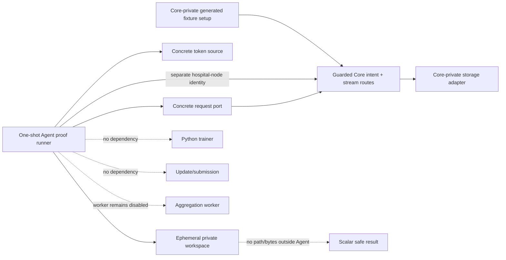
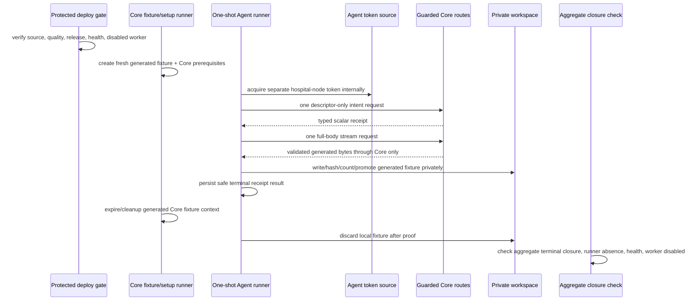
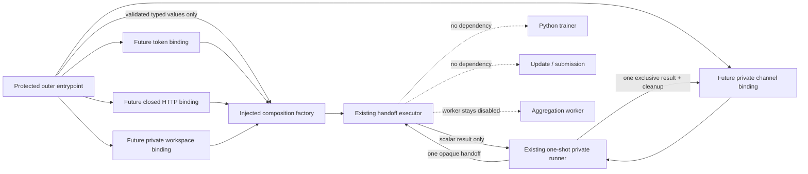

# Hospital Node Agent — Protected Deployment and One-Shot Generated-Fixture Proof

**Status:** L4e2k design and source-evidence dossier. It records injected-only local composition and the next target-safe binding design, but authorizes no protected Agent deployment, concrete request-port/token-source/filesystem wiring, Core/Azure invocation, generated-fixture transfer, training, update, submission, aggregation, hospital integration, or clinical operation.

**Scope:** This dossier closes the gap between locally tested injected adapter logic and a future one-shot synthetic proof. It defines how a protected Agent test composition could be released and checked without turning the Agent into a public service, without sharing storage/provider capability, and without treating a generated fixture as a production model or training input.

## 1. Nontechnical requirements and acceptance boundaries

L4d proves local adapter logic only. The next increment must demonstrate that a separately authenticated synthetic Agent can use the guarded Core boundary exactly once under a controlled runtime composition. The exercise is valuable only if it preserves the research ledger’s falsifiability: each source release, runtime gate, invocation, denial, closure, and limit must be time-ordered and publishable without any credential, locator, provider, body, header, local path, hospital, or patient detail.

| Requirement | Acceptance signal | Explicitly not established |
|---|---|---|
| Preserve Core authority | The Agent connects only to the already guarded Core intent/stream boundary; Core remains the only storage-facing authority. | Direct storage access, provider readiness, artifact release policy, or generalized download service. |
| Preserve Agent locality | One opt-in, non-public Agent runner uses only generated fixture bytes and private ephemeral workspace state. | Persistent hospital node, public endpoint, patient/EHR/PACS connection, local dataset use, or real hospital onboarding. |
| Preserve identity separation | The Agent uses the existing separate hospital-node audience/client reference, never a human, browser, ML-worker, callback, or provider identity. | A broadly reusable production identity, browser flow, delegated access, or identity federation claim. |
| Preserve bounded evidence | Exactly one successful guarded stream attempt is permitted only after all gates; aggregate-safe closure is checked. | Throughput, resilience, repeated retries, concurrent nodes, model quality, trainer compatibility, or clinical value. |
| Preserve aggregation safety | `AGGREGATION_WORKER_ENABLED=false` remains observable before and after the run. | A worker run, aggregation, round progression, update submission, or model release. |

> The proof, if later run, demonstrates one controlled Agent consumption of one generated non-clinical fixture through Core. It does not demonstrate a production download feature, a training start, a hospital integration, or scientific performance.

## 2. Technical requirements and protected configuration ownership

The Agent is not promoted to an always-on deployed service in L4e. Its proof form is a one-shot Compose runner with **no `ports` directive**, no public listener, `restart: "no"`, and no default profile activation. The protected composition root may reference opaque existing secret files and an opaque Core origin configuration, but it must not print, inspect, serialize, copy to Git, or write those values into logs, events, test output, status, or public documents.

| Component | Required future ownership | Permitted protected input | Forbidden value or behavior |
|---|---|---|---|
| Agent proof runner | Agent Compose profile and runner process. | Opaque runtime configuration reference, private OIDC secret reference, bounded proof enable flag. | Public port, daemon/restart, plaintext secret, generic Core URL input, training/update/aggregation flag. |
| Workload token source | Concrete Agent composition. | Existing separate hospital-node client reference and literal audience. | Human/ML-worker/callback token, token print/persistence, token passed through domain/SQLite/event/status. |
| Request port | Concrete Agent composition. | Fixed normalized Core origin and bounded time/size policy from protected runtime configuration. | Direct object-storage/provider endpoint, redirect following, generic route/header/body input, Range, raw error body. |
| Workspace port | Concrete Agent composition. | Private ephemeral mounted workspace root owned by Agent process. | Host/public/shared data mount, path persistence, fixture export, arbitrary directory scan, real local dataset. |
| Fixture authority | Core-private setup inside a bounded composite profile. | Tiny generated non-clinical fixture and fresh generated Core prerequisites. | Provider locator/credential disclosure, direct Agent setup access, persistent fixture, real model/data. |

Concrete request, token, and filesystem adapters must be composed only in the proof runner; the Agent application/domain/SQLite interfaces remain unchanged. The runner receives no command-line secret value. A missing protected reference must fail the profile before a route request and publish a safe configuration failure instead of falling back to an unprotected value.

## 3. Deployment topology and configuration schema



The proof profile is composed alongside the existing private Core validation environment rather than exposing a new host service. It must use a sealed internal network path or the controlled Core HTTPS entrypoint documented by the deployment configuration; no browser, public Agent port, host data directory, or provider network configuration is introduced. The Core side creates/cleans its own generated fixture through private test composition. The Agent sees only the guarded Core typed response.

| Schema class | Required fields | Persistence/redaction rule |
|---|---|---|
| Proof runtime config | Boolean enable flag, bounded byte limit, bounded timeouts, opaque Core origin reference, opaque secret-file reference, opaque private-workspace reference. | References are deployment-only and never logged, returned, committed, or stored in SQLite. |
| Agent proof record | Safe runner result (`succeeded`, classified pre-route refusal, or classified post-route failure), equality booleans, duration bucket, terminal receipt state. | No token, URL, header/body, fixture bytes, workspace path, provider detail, database value, data field, or free-text exception. |
| Core closure record | Existing stream session/read-intent/assignment/lease event aggregates. | Query/report aggregate-safe counts only; do not inspect locator-bearing artifact/provider data. |

## 4. One-shot workflow and state closure



The profile may invoke the guarded stream **once**. It must use a rebuilt image (`run --build`) and reuse the existing active separate hospital-node workload mapping rather than inserting another issuer/subject mapping. The Core-side fixture context must remain live only until the Agent terminal result is observed, then close generated Agent/Core proof state and remove the Agent’s ephemeral materialization. The proof does not invoke Python, local training, update packaging, submission, queue dispatch, or aggregation.

| Step | Required safe result | Stop/retry rule |
|---|---|---|
| Source/deployment gate | Both Agent and Core local quality/repository checks and required protected deployment conclusions are recorded. | A failed quality/deployment gate blocks all runtime work. |
| Preflight | Intended source releases, Core live/ready health, disabled worker marker, no prior runner, and no active proof state are observed safely. | Any mismatch blocks before fixture creation or route request. |
| Token | Separate hospital-node token acquired internally. | Failure is pre-route; record a safe code before repair/retry. |
| Intent/stream | One typed intent then one full-body stream; Agent checks all immutable facts and local integrity. | Redirect/partial/denial/mismatch/interruption is terminal for that intent; record before another attempt. |
| Local cleanup | Materialization is discarded after proof; Agent emits scalar-safe outcome only. | Cleanup failure blocks closure and requires publication before any retry. |
| Core cleanup | Runner expires/closes generated facts and fixture context. | Inspect only aggregate-safe state; no storage/provider inspection. |
| Postflight | Completed/consumed/terminal aggregate state, zero active proof state, zero runner, health, and disabled worker are checked. | Any residual state is a failure record, not a reason to repeat. |

## 5. Architecture, dependency direction, and safety controls

The concrete L4d adapters remain inside the Agent composition root. The L4e profile supplies real runtime implementations only through narrowly named ports: `HospitalNodeWorkloadTokenSource`, `HospitalNodeCoreRequestPort`, and `PrivateWorkspaceFilesystemPort`. No application/domain/contract/SQLite module may import a deployment, environment, HTTP, OIDC, filesystem, storage, or provider module. The proof runner is the only place where configuration references are resolved and must discard secrets immediately after adapter construction.

| Control | Required enforcement |
|---|---|
| Identity isolation | Literal hospital-node audience; no ML-worker/human/browser/callback identity; token remains adapter-local. |
| Route isolation | Internal concrete client permits only guarded intent and stream route constructors; no generic caller-selected path/query/header/body. |
| Response isolation | Redirect, `206`, multipart/encoded/unbounded/malformed responses are denied before body delivery; raw response is never parsed/logged. |
| Storage isolation | Core retains provider access; Agent workspace is local ephemeral state only and returns no path/bytes. |
| Resource bounds | Configure positive timeout/size limit; enforce stream size, exclusive temporary write, same-root promotion, cleanup/discard. |
| Observability | Allow only operation class, outcome code, equality booleans, safe duration/size bucket, and aggregate closure counts. |
| Runtime isolation | No public ports, no default profile, no restart, no persistent service, no host data mount, no trainer/update/submission/aggregation command. |
| Failure isolation | One shot only; post-route failure is published before any code change or retry; no automatic retry/resume/Range/reuse. |

## 6. API/readout contract and operational evidence

The proof uses no new public API. The Agent consumes the existing Core contract through its typed client and writes only existing local scalar receipt/materialization/event facts. The runner’s terminal process result is an allowlisted marker, not a body dump. The runner must not echo `Authorization`, a route URL, Core origin, headers, fixture content, checksum text, workspace root, or any provider/database detail.

```ts
export type BoundedAgentProofOutcome =
  | { readonly kind: "succeeded"; readonly receiptState: "verified"; readonly factsMatched: true }
  | { readonly kind: "pre_route_refused"; readonly code: "configuration" | "identity" | "preflight" }
  | { readonly kind: "terminal_failure"; readonly code: "intent" | "stream" | "integrity" | "workspace" | "cleanup" };

export interface AggregateProofClosure {
  readonly completedStreamSessions: number;
  readonly activeStreamSessions: number;
  readonly consumedReadIntents: number;
  readonly activeReadIntents: number;
  readonly activeLeases: number;
  readonly closureEvents: number;
  readonly runnerInstances: number;
  readonly workerEnabled: false;
}
```

The type is a readout constraint, not an implemented runtime interface. Counts may contain older bounded fixtures in an aggregate, so evidence must distinguish a run-specific safe marker from global terminal totals and never attribute unrelated expired records to the new proof.

## 7. Local tests, release gates, and bounded-proof plan

| Layer | Required positive evidence | Required denial evidence |
|---|---|---|
| Agent local code | L4d adapter tests plus concrete runtime-port configuration parsing in fakes. | Missing protected reference, wrong audience, non-HTTPS origin, public port, provider-style origin, redirect/partial/encoded response, unsafe root, cleanup failure. |
| Agent source quality | Formatting, strict types, TypeScript and Python tests, Compose/config static checks. | No source release if any test/static check fails. |
| Core compatibility | Existing guarded Core stream source remains compatible with the separate hospital-node audience and full-body contract. | No proof if Core release/contract changes or worker gate is not disabled. |
| Protected deployment | Agent proof image/profile and Core deployment complete under protected pipelines. | No proof on an unverified source release or a failed/in-progress deployment. |
| Runtime preflight | Release identity, Core HTTP 200 live/ready, disabled worker, zero prior runner, and safe initial aggregate state. | No fixture/profile run if any preflight check fails. |
| One-shot proof | One `run --build` profile invocation, one generated fixture context, one intent, one stream, private verification, cleanup. | No automatic retry; publish a failure before any repeat. |
| Closure | Safe runner marker, terminal aggregate state, zero runner, health, disabled worker. | No conclusion if active proof state or cleanup uncertainty remains. |

## 8. AI implementation handoff

| Slice | Deliverable | Stop condition |
|---|---|---|
| L4e1 | This dossier, evidence readout, release gates, workflow, failure policy, and proof plan. | No runtime wiring or invocation. |
| L4e2 | Protected Compose/profile, runtime port adapters, one-shot runner, static config tests, Agent local quality, source commit/push. | No Azure/Core invocation or public exposure. |
| L4e3a | Protected Agent release/deployment conclusion plus Core compatibility/release/health/worker preflight record. | No profile run until every conclusion/gate is green. |
| L4e3b | One rebuilt one-shot generated-fixture invocation and aggregate-safe postflight. | No training, update, submission, aggregation, provider inspection, retry, or second run. |
| L4e4 | Actual-outcome ledger/dossier/roadmap publication and checkpoint. | Do not begin a new boundary until terminal evidence is complete. |

Any need to expose an Agent port, copy a secret, use direct storage, inspect a locator/provider response, receive real data, run training, submit an update, enable aggregation, use a human/ML-worker identity, repeat a failed post-route run, or claim an unverified operational property is a fail-closed blocker requiring a new ledger decision.

## 9. Implementation evidence — L4e2 protected preflight profile

Hospital Node Agent commit `ea97b69` adds the protected proof-profile preparation without an invocation. The new Compose file defines the opt-in `hospital-node-core-stream-proof` profile with no `ports` directive, `restart: "no"`, no host data mount, an opaque secret-file reference, and a restricted tmpfs workspace. Its command is only `agent:proof-preflight`; it does not compose a request/token/filesystem runtime adapter or call Core.

The preflight command validates proof enablement, a normalized HTTPS Core origin, a `/run/secrets/` reference, a private `/run/hospital-node-proof/` workspace reference, and positive timeout/byte bounds. It returns only a scalar-safe ready/refused result; its public output excludes the Core origin, secret reference, workspace value, token, route, header/body, provider detail, and path. The configuration validator itself reads no environment; the entrypoint reads deployment values only at the composition boundary and does not acquire a token, create a request, or write a workspace.

Local `pnpm run ci` passed after L4e2: formatting, strict TypeScript, **35 TypeScript tests**, and **4 Python tests**. Tests verify the opt-in protected configuration and deny disabled, non-HTTPS/path-bearing, missing-secret-reference, unsafe-workspace, and nonpositive-size inputs. The sandbox has no Docker executable, so Compose semantic rendering could not be run locally; a non-executing source-level check confirmed the expected profile, preflight command, no `ports` declaration, `restart: "no"`, tmpfs, and secret-reference markers. Protected Compose rendering remains a required release gate in the target runtime before any invocation.

No profile has been run or deployed. No real token, Core/Azure request, socket, host filesystem action, fixture byte, provider interaction, training, update, submission, aggregation, hospital data, or clinical workflow occurred. `CORE_AGENT_PROOF_HANDOFF_COORDINATION.md` now has its local pure/fake coordination components: Core strict handoff/result validators and Agent lease-first orchestration. Only after source/release, target Compose, Core health/worker, runner, and safe-initial-state gates are recorded may the one-shot profile be considered.

## 10. Protected preflight record — source gates pass; target Agent composition remains absent

The Agent source release `8e53c22f988f433528a0363aca85446925eadc99` passed Hospital Node Quality Gates run `32617651527`. The Core pure handoff release `a64488d2fc688fbaea974e865aa89e25542978d8` passed Core Quality Gates run `32617558237` and protected Azure deployment run `32617559177`. Read-only Azure checks then observed public Core liveness/readiness HTTP 200 and the aggregation worker’s disabled marker. These are prerequisite observations only; they do not prove an Agent profile.

The same target-layout inspection found only the Core release structure under `/srv/fedagg` and no deployed Agent proof composition. The sandbox also has no Docker executable, so target Compose rendering cannot be substituted with a local render. Because the private handoff coordinator, directional ephemeral channel mounts, Agent image source, and Agent runtime profile are not yet target-composed, **L4e3 is blocked before fixture creation, token acquisition, lease, intent, stream, workspace write, or any Core route call**. This is a safe pre-route block, not a proof failure, and it does not authorize a retry.

## 11. Implementation evidence — private file-channel adapter and topology template

Agent release `d8857d31a0058db41ff106e63918c4446a4728b0` adds a narrow private file-channel adapter behind an injected filesystem port. The adapter can read one opaque handoff and write one exclusive serialized scalar result; it neither accepts a caller-selected path nor exposes a directory, network, token, provider, workspace, fixture byte, or result capability. Before writing, it revalidates the result schema and rejects unknown fields and impossible `succeeded` / `pre_route_refused` combinations. Its tests use in-memory functions only and show that the serialized result contains neither the handoff assignment identifier nor command digest.

The same release normalizes the non-executing Core/Agent topology template. It declares only the opt-in `hospital-node-private-proof` profile, one directional handoff mount from Core to Agent, one directional result mount from Agent to Core, read-only service roots, service tmpfs, `restart: "no"`, and opaque secret-file references. It exposes no `ports` directive, host bind, persistent application volume, default activation, runnable image binding, or target deployment. Local `pnpm run ci` passed formatting, strict TypeScript, **41 TypeScript tests**, and **4 Python tests**; Hospital Node Quality Gates run `32619077821` completed successfully.

Source review then found that the named directional channel volumes still used the Compose `local` driver’s default persistence semantics. Agent release `52f3130d850fbb0da1f5992296f6f0eba762ed1b` corrects both `proof-handoff` and `proof-result` with bounded `tmpfs` driver options (`64k`, mode `0700`). A source-level static check verified two tmpfs declarations, two tmpfs devices, the Core-to-Agent and Agent-to-Core read-only mounts, and the absence of ports or host binds. Local `pnpm run ci` again passed formatting, strict TypeScript, **41 TypeScript tests**, and **4 Python tests**; Hospital Node Quality Gates run `32621636293` succeeded. This correction validates source intent only; target Compose rendering must confirm runtime support before any profile invocation.

This is source and CI evidence only. The target still has no reviewed Agent image release, Core-side coordinator runtime runner, protected composite deployment, or Azure Compose render. The prior pre-route block therefore remains in force: no fixture creation, token acquisition, lease, intent, stream, workspace write, Core route call, training, submission, or aggregation is authorized by this release.

## 12. Azure read-only preflight — source/topology absence blocks rendering

After the Core coordinator composition and Agent tmpfs topology source gates completed, a read-only Azure preflight observed public Core liveness and readiness at HTTP `200`. The running aggregation worker emitted its explicit disabled-state marker. No Hospital Node Agent source directory, protected composite topology file, or running Hospital Node proof runner was present in the target layout.

Because the target has no deployable Agent source/image binding or composite profile to render, an Azure `docker compose config` invocation would not be meaningful and was not attempted. This is a **safe pre-route block**, not a proof failure: no generated fixture, secret read, Agent token, lease, intent, stream, workspace write, route request, training, submission, provider interaction, or aggregation was performed. The next allowed work is to deliver reviewed Core/Agent runtime adapters and a protected composite source release; any later render remains Azure-only and read-only.

## 13. Design record — protected Agent image and source-only entrypoint

The next Agent slice defines a dedicated protected image source and an intentionally non-invoking entrypoint. Its purpose is to replace the current test-only default status command with a reviewable proof-specific image contract while retaining the absence of live runtime wiring. The entrypoint may read only process-local protected configuration at the outer composition boundary, validate it with the existing scalar-safe validator, and emit a versioned scalar `ready` / `refused` readout. It must not acquire a token, construct the typed Core request client, open a channel, read a handoff, write a result, use a workspace, invoke `runPrivateProofRunner`, or contact Azure/Core/storage/provider services.

| Image/entrypoint control | Required source behavior | Explicitly excluded |
| --- | --- | --- |
| Image selection | A separate proof-runner Dockerfile/target with Node 22, frozen lockfile install, no added native or network client dependency, non-root process, and an explicit non-daemon command. | Build/push, tag publication, deployment binding, host mount, public port, default activation, restart loop. |
| Entrypoint authorization | Existing proof-enable flag and opaque protected references are validated at process start. | Secret value printing, generic CLI configuration, secret fallback, token acquisition, identity reuse. |
| Readout | Versioned allowlisted scalar status plus process exit code; no origins, paths, secret references, headers/bodies, fixture/result facts, diagnostic text, bytes, or provider data. | Runtime completion claim, Core/Agent communication claim, health endpoint, event persistence. |
| Dependency direction | Entrypoint depends only on runtime configuration validation and scalar readout types; `runPrivateProofRunner` remains uncalled until a later concrete adapter composition review. | Filesystem, OIDC, HTTP, storage, database, trainer, submission, aggregation, or channel import. |
| Tests | Deterministic subprocess-free function tests for ready/refused and sensitive-field exclusion; Dockerfile static tests verify no ports, no root default, no daemon/restart assumptions. | Docker build, container execution, Compose render, Azure access, fixture/proof invocation. |

The entrypoint’s initial `ready` status means only that a local process received a structurally valid protected configuration shape. It does **not** mean that a proof runner is executable, that any secret/reference works, that an image is built, that a channel is present, or that an Agent can contact Core. Concrete token/request/filesystem/channel composition and image build/release binding remain separate future gates.

## 14. Implementation evidence — protected Agent image source and non-invoking entrypoint

Agent release `714480d9451197c6d636427ae0b947d23dd12fc4` adds `Dockerfile.proof-runner` and a proof-image preflight command. The Dockerfile uses Node 22, a frozen lockfile install, repository files owned by the unprivileged `node` account, an explicit `USER node`, and an explicit `agent:proof-image-preflight` command. It declares no `EXPOSE` or `ENTRYPOINT`, does not invoke the private proof runner, and was not built, pushed, tagged, deployed, or run as a container.

The entrypoint projects existing protected configuration validation into `hospital-node-proof-image-readout/v1`: `ready` exposes only `proofEnabled: true` and `publicPort: false`; refusal exposes only the existing allowlisted code. It returns no origin, secret reference, workspace root, timeout, byte limit, handoff/result, token, header/body, fixture, provider, or diagnostic text. The command reads process environment at the outer boundary only and does not construct an OIDC source, Core client, channel, workspace, executor, or runtime proof invocation.

Three new deterministic tests cover ready-readout redaction, allowlisted refusal, non-root/static Dockerfile constraints, and absence of a public listener/runtime-runner command. Local `pnpm run ci` passed formatting, strict TypeScript, **44 TypeScript tests**, and **4 Python tests**; Hospital Node Quality Gates run `32665704597` completed successfully. This is source and CI evidence only. A target image build/release binding, concrete adapter composition, Azure topology render, and proof remain absent and blocked pre-route.

## 15. Focused review record — concrete Agent runtime adapter composition

The next Agent increment may compose the already reviewed `ConcreteHospitalNodeCoreClient`, `ConcretePrivateGeneratedFixtureWorkspace`, private file channel, and one-shot runner only through injected ports. It will be a pure composition factory with explicit enablement and a prevalidated configuration object. It must not implement a real token source, HTTP transport, filesystem access, Docker command, or target image binding in the same slice.

| Composition concern | Reviewed requirement | Denial / non-goal |
| --- | --- | --- |
| Configuration ownership | The outer protected entrypoint validates the environment once, discards concrete values from its readout, and supplies typed values only to the composition factory. | No environment access in package logic; no config, origin, workspace, timeout, or secret projection. |
| Identity seam | Factory accepts an injected `HospitalNodeWorkloadTokenSource`; the token remains within the concrete Core client. | No OIDC library, secret read, token cache, human/ML-worker/callback identity, or token output. |
| Transport seam | Factory accepts an injected closed `HospitalNodeCoreRequestPort`; fixed route and response policy remain inside the concrete Core client. | No fetch implementation, generic URL/header/body, redirect/Range/encoding fallback, retry scheduler, or provider client. |
| Workspace seam | Factory accepts an injected `PrivateWorkspaceFilesystemPort`; fixed root validation and pathless temporary/promote/discard lifecycle remain in the workspace adapter. | No Node filesystem import, host path/config persistence, directory scan, dataset mount, or exported file reference. |
| Channel seam | Factory accepts an injected private runner channel with one handoff read and one result write. | No channel directory enumeration, caller-selected file, network channel, repeated result, or public listener. |
| Executor binding | Factory binds the injected adapters to the existing fake-first lease → intent → stream → workspace orchestration. | No proof invocation, fixture creation, database/SQLite persistence change, training, update/submission, or aggregation. |
| Readout and closure | The factory returns the existing scalar runner result only; tests assert refusal-before-executor and no sensitive configuration/result projection. | No stdout process contract change, detailed error, bytes/path/token/URL/assignment/digest/provider field, or runtime success claim. |

The implementation test matrix will cover disabled/invalid configuration before any port call, ready composition with in-memory fakes, one handoff/result lifecycle, token/transport/workspace failures as scalar terminal results, and absence of retries. Real runtime adapters, actual OIDC secret handling, actual Core requests, actual tmpfs operations, image build/release, Azure Compose render, and a proof remain separate gates.

## 16. Implementation evidence — injected-only Agent runtime composition

Agent release `7983502a7a02b817600861a485ad15b6ad7f2315` implements the reviewed composition as `composeInjectedPrivateProofExecutor`. Its input requires an explicit enablement value, a prevalidated typed configuration object, and injected token, closed request, private-workspace filesystem, lease, and receipt-repository ports. The factory constructs only the pre-existing typed Core client and pathless private workspace, then binds them to the existing lease → intent → stream → verification orchestration. It never reads process configuration, parses a secret, acquires an identity, imports Node filesystem or HTTP APIs, discovers a channel, starts a profile, writes a terminal result directly, or binds an image/runtime target.

The existing one-shot private runner remains the sole owner of opaque handoff read, exactly-one scalar result write, and channel cleanup. The new executor returns the existing versioned scalar result to that runner; it cannot output a token, origin, timeout, workspace reference, assignment identifier, digest, header, body, fixture, provider field, path, or diagnostic. Deterministic fakes prove that disabled composition refuses before any supplied capability is touched; a ready composition yields one verified scalar result; and token, transport, or workspace failure ends in a terminal scalar outcome with the expected bounded call count and no retry.

Local `pnpm run ci` passed formatting, strict TypeScript, **47 TypeScript tests**, and **4 Python tests**. Hospital Node Quality Gates run `32666107849` completed successfully for the pushed release. This validates source wiring with fakes only. It does not validate a real OIDC source, HTTP request implementation, private filesystem implementation, handoff/result file-channel adapter binding, a built or released image, target Agent source, Core executable runner, Azure composite topology, Compose render, fixture, route call, or proof. The pre-route block remains active and the aggregation worker remains disabled.

The next permitted work is a separate design record for target-safe concrete runtime port bindings, split into distinct fake-first implementation slices. It must explicitly retain the distinction between static proof-image source and a built/released image, as well as Azure’s continuing absence of Agent source/image/profile material. No proof can be considered until those later source/release, target-staging, Azure-render, and renewed read-only preflight gates have all succeeded.

## 17. Design record — target-safe concrete runtime port bindings

This design turns the existing injected-port seams into four deliberately narrow future adapter contracts. It does not authorize their implementation or target use. The objective is to preserve the already proven source boundary while making any future target binding reviewable: one separate workload identity, two fixed Core request classes, one private workspace lifecycle, and one opaque directional handoff/result channel. Each adapter must be independently fake-tested, reviewed, released, and quality-gated before a composite target source can be staged.

> A future binding may connect a pre-existing protected runtime reference to a closed port. It may not widen the port, make a generic network/filesystem capability available, or treat a static source artifact as a built image, deployed service, or proof authorization.

### 17.1 Nontechnical and technical acceptance boundary

| Concern | Required future acceptance | Explicit non-goal |
| --- | --- | --- |
| Research value | The design makes a single synthetic Core-mediated receipt path auditable without exposing a provider capability or broad download surface. | Model quality, training benefit, clinical validity, hospital interoperability, or a production artifact service. |
| Identity | One injected adapter obtains a short-lived token only for the literal `fedagg-hospital-node` audience and keeps it adapter-local. | Human, browser, ML-worker, callback, provider, delegated, shared, cached, or printed token identity. |
| Transport | One injected adapter accepts only the closed request union owned by `ConcreteHospitalNodeCoreClient`; it cannot receive a caller-selected URL, header map, body, or redirect policy. | Generic HTTP client, direct storage/provider client, Range/resume, retry policy, body dump, or public listener. |
| Workspace | One injected adapter owns a private ephemeral root and realizes only the pathless temporary/append/close/promote/remove operations already declared. | Host bind, directory discovery, arbitrary path, dataset mount, fixture export, persistent artifact, or local-data scan. |
| Handoff/result | One injected adapter realizes only a fixed opaque handoff read and a fixed exclusive scalar-result write on directional temporary volumes. | File selection, enumeration, shared mutable channel, network channel, duplicate result, or handoff/result logging. |
| Closure | Every binding has a terminal denial/cleanup result and no automatic retry; the existing runner remains sole owner of exactly-one result output and final channel cleanup. | Silent recovery, retry loop, work resumption, aggregation enablement, update submission, or trainer call. |

### 17.2 Binding ownership, immutable configuration, and forbidden data

The protected outer entrypoint remains the only location that may resolve deployment references. It validates and converts those references into a typed configuration value before composition; the resulting factory and all application packages continue to receive only typed values and injected ports. No port constructor may read process environment, perform configuration discovery, or return configuration values through its public interface.

| Future binding | Protected owner | Internal immutable facts | Must never cross the port or public readout |
| --- | --- | --- | --- |
| Token source | Agent proof composition boundary | Literal audience; one bounded acquisition attempt; token expiry accepted internally. | Secret file content/reference, client identifier, token, claims, issuer, subject, cache key, exception text. |
| Closed request port | Agent proof composition boundary | Normalized HTTPS Core origin; positive connect/response limits; maximum byte size; fixed request union. | URL/origin, authorization header, raw request/response body, provider field, redirect chain, status text. |
| Private workspace filesystem | Agent process-private temporary root | Fixed root ownership/mode; exclusive opaque temporary reference; declared byte bound; same-root promotion/discard. | Root/path/filename, directory handle/listing, bytes, checksum working state, file descriptor, host mount detail. |
| Private proof channel filesystem | Agent/Core protected composite root | Fixed handoff/result names; handoff read-once; result exclusive-write-once; strict size/schema bounds. | Volume path/name, serialized handoff, assignment/digest, result file contents before validation, directory state. |

Future adapter code must explicitly reject missing or invalid typed inputs before initiating its underlying capability. A token adapter denial occurs before Core request construction; a request adapter denial returns the existing typed availability/terminal outcome; a workspace or channel denial closes through the existing terminal scalar result path. No adapter may create an additional event schema, persistence table, log sink, public status route, or retry scheduler.

### 17.3 Binding architecture and one-shot ownership



The diagram is a dependency rule rather than a deployment claim. The entrypoint supplies already-resolved values and port implementations; the executor receives only the existing handoff and returns only the existing scalar result. The request binding is not allowed to receive the private channel, workspace binding, or token output. The token binding is not allowed to receive a Core route, body, channel, workspace, or persistence handle. The workspace and channel bindings are independent fixed-operation adapters; neither may share an enumerating filesystem abstraction with application code.

### 17.4 State, failure, and cleanup matrix

| Stage | Permitted single action | Safe terminal outcome on failure | Mandatory closure / no-retry rule |
| --- | --- | --- | --- |
| Composition | Validate explicit enablement and typed values; construct closed ports. | Existing pre-route refusal before a port call. | No fallback configuration or alternate adapter. |
| Handoff | Read one opaque handoff through the channel adapter. | Existing scalar terminal result only after runner validation. | No re-read, discovery, or result write before valid handoff. |
| Lease/token/intent | Lease once; obtain token internally once per fixed operation; issue one typed intent. | Existing terminal/availability result projection. | No token cache exposure, route substitution, or automatic reattempt. |
| Full-body stream | Send only the fixed stream request and pass validated body iterator to workspace. | Existing terminal scalar after response/integrity denial. | No redirect, Range, partial/encoded body, resume, or second stream. |
| Workspace | Create one exclusive temporary reference; append, close, verify, promote or discard. | Existing terminal scalar after root/write/cleanup denial. | Remove temporary/promoted state as applicable; never export a path or bytes. |
| Result/closure | Runner writes one validated scalar result and invokes fixed cleanup. | Existing safe closure failure code. | No duplicate write, lingering record, runner restart, or proof repeat. |

### 17.5 Adapter-specific implementation requirements

| Slice | Required source boundary | Fake-first negative tests before any real binding | Stop condition |
| --- | --- | --- | --- |
| L4e2k1 token design then adapter | A single `HospitalNodeWorkloadTokenSource` implementation is configured solely by an opaque protected reference owned outside the adapter’s public API. The adapter asks for the literal audience and returns a token only to the concrete Core client. | Missing/unsafe typed binding; wrong audience; expired/empty acquisition projection; no token in result, error, event, or log double. | No secret read, token acquisition, identity-provider request, cache, or target process in the design slice. |
| L4e2k2 request design then adapter | A single `HospitalNodeCoreRequestPort` implementation translates only the existing `read_intent` and `model_stream` union into a bounded request; response validation remains in the concrete client. | Unsupported operation/method; invalid typed origin/limit; redirect; `206`; multipart/encoded response; missing safe stream facts; port failure; no raw projection. | No `fetch`, socket, Core request, provider request, generic client, or target invocation in the design slice. |
| L4e2k3 workspace design then adapter | A single `PrivateWorkspaceFilesystemPort` implementation maps opaque references to a restrictive Agent-private temporary root; creation is exclusive and promotion stays within that root. | Root ownership/mode denial; duplicate temporary; byte bound; close/append/promote/remove failure; crash compensation; no path/bytes observable to caller. | No host bind, arbitrary filesystem access, dataset mount, directory scan, or target container use in the design slice. |
| L4e2k3 channel design then adapter | A single `PrivateProofChannelFilesystemPort` implementation maps to fixed handoff/result records on directional bounded temporary volumes. | Missing/malformed/oversized handoff; duplicate/nonexclusive result; malformed scalar result; read/write/cleanup denial; no assignment/digest serialization exposure. | No discovery, directory enumeration, selectable file, public socket, shared persistence, or Compose render in the design slice. |

### 17.6 Engineering standards, compatibility, and proof preconditions

Every implementation slice must remain dependency-inverted: application/domain/contracts import only the port types, while deployment-specific modules import the port implementations at an outer composition boundary. The adapter must use allowlisted reason codes and scalar-safe test doubles; diagnostics must never include secret, URL, origin, token, header, body, path, locator, provider, handoff, digest, byte, or patient-shaped data. No new retry loop or background process is permitted. The exact Core response rules remain full-body-only and reject redirects, partial responses, multipart payloads, and unvalidated encodings.[1] [2]

Before a target profile can even be staged, the following distinct evidence is required: each adapter’s local negative suite and Agent quality gate; a separately reviewed image build/release binding; a separately released Core executable coordinator binding; a protected composite source placed in Azure; Azure-only `docker compose config` rendering with no invocation; and a renewed read-only release/health/disabled-worker preflight. A static Dockerfile, source composition factory, topology template, or success from a fake does not satisfy any of those runtime conditions. Until then, the pre-route block remains active.

### 17.7 AI implementation handoff

The next executable increment is **not** a combined adapter implementation. It must choose one port family, begin with deterministic fake validation, avoid target capabilities, run `pnpm run ci`, publish exact quality evidence, and then update this dossier and the Research Ledger. Token, request, workspace, and channel families must land in separate commits/releases or similarly isolated reviewable slices. Only after all four concrete adapters and their independent quality evidence exist may a later design decide image binding and target composite staging; neither decision authorizes a proof.

## 18. Implementation evidence — deterministic fake workload-token source

Agent release `7a29d0961f8aee51be09c8a6c8e17a3659b88ca2` implements only the first fake-first identity slice: `FakeHospitalNodeWorkloadTokenSource`. It satisfies the existing closed `HospitalNodeWorkloadTokenSource` seam and accepts its material only through an injected `readOnce()` port. The material schema admits exactly a version marker, one bounded issuance identifier, the literal `fedagg-hospital-node` audience, expiry, and an opaque non-whitespace token value. The adapter validates that shape internally, returns the token only to the typed Core client seam, and stores its injected port/clock in ECMAScript private fields so scalar serialization does not expose fixture token material.

The deterministic tests prove one successful literal-audience acquisition, denial before material access for a wrong audience, and fixed denials for missing, expired, malformed, or replayed injected material. They further confirm that token and issuance values are absent from serialized source objects. The adapter has no environment, secret-file, OIDC package, token cache, browser flow, identity-provider request, network, filesystem, image, target runtime, or proof dependency. It is not a real credential source and does not establish a protected identity integration.

Local `pnpm run ci` passed formatting, strict TypeScript, **50 TypeScript tests**, and **4 Python tests**. Hospital Node Quality Gates run `32666544019` completed successfully. This release is source and fake evidence only. Concrete secret-source design/implementation, actual token acquisition, HTTP request binding, workspace/channel bindings, image build/release, Agent target staging, Core executable runner, Azure Compose render, and the one-shot proof remain absent. The pre-route block remains active and the aggregation worker remains disabled.

## 19. Implementation evidence — deterministic closed Core request port

Agent release `6dc9f9e30c9e426595f9c47de86d663057255608` implements the second fake-first binding slice: `FakeScriptedHospitalNodeCoreRequestPort`. It accepts only the existing closed `read_intent` and `model_stream` request union and advances one finite injected script. It validates the expected operation/method pair, exposes only aggregate intent/stream counts and remaining script steps, and retains no URL, authorization header, idempotency key, token, request body, or response body in its observable state. Its internal script and counters are private fields, so source serialization contains neither test token, assignment identifier, checksum, nor response fixture.

The deterministic tests exercise one valid intent followed by one full-body stream, operation mismatch, script exhaustion, redirect, partial (`206`), multipart, encoded, missing-length, and simulated transport-refusal paths. The typed Core client converts port refusal to its pre-existing scalar availability outcome; there is no retry or route widening. Response policy remains owned by the existing concrete client, which continues to admit only validated full-body stream facts and reject unsafe response semantics.[2] [5]

Local `pnpm run ci` passed formatting, strict TypeScript, **53 TypeScript tests**, and **4 Python tests**. Hospital Node Quality Gates run `32666788271` completed successfully. This is a deterministic source double, not a real HTTP adapter. It imports no `fetch` or socket API, performs no Core/Azure/storage/provider request, reads no configuration/secret/token, and adds no image, target runtime, Compose, proof, training, submission, or aggregation behavior. Concrete transport implementation, workspace/channel bindings, image build/release, Azure staging/render, and all proof gates remain absent; the pre-route block and disabled aggregation worker remain in force.

## 20. Implementation evidence — deterministic private-workspace filesystem port

Agent release `cf6c2cbed1610fc1376f559e488c4013c6881f23` implements the third fake-first binding slice: `FakeScriptedPrivateWorkspaceFilesystem`. It satisfies the existing pathless `PrivateWorkspaceFilesystemPort` contract with an injected root-ready/denied state and a closed operation-refusal plan. It creates opaque receipt/nonce references, supports exclusive temporary allocation, append, close, same-root promotion, temporary removal, and promoted removal, while immediately discarding appended bytes. Its public snapshot reports only aggregate root checks, temporary/closed/promoted counts, removed count, and operation count; its maps, references, and plan remain private.

The deterministic tests cover successful consume → promote → discard closure, denied root, duplicate temporary allocation, append/close/promote refusal, and cleanup refusal. They assert that public serialization contains neither receipt identifier, opaque nonce, nor fixture bytes. Failed operations are returned as fixed local denials to the existing workspace/application path; no adapter retry or host-path fallback exists. The fake imports no Node filesystem module and cannot enumerate a directory, accept a caller-selected path, read a mount, retain a fixture body, or export a file reference.

Local `pnpm run ci` passed formatting, strict TypeScript, **56 TypeScript tests**, and **4 Python tests**. Hospital Node Quality Gates run `32667019348` completed successfully. This is a deterministic in-memory source double, not a private tmpfs/host filesystem implementation. No image binding, Agent target source, Core/Azure/storage/provider contact, container mount, Compose render, proof, training, submission, or aggregation occurred. The directional handoff/result channel binding remains a separate slice; all target-stage and pre-route proof blocks remain active.

## 21. Implementation evidence — deterministic fixed private proof channel filesystem port

Agent release `36a9c18a0f047dec440b784d91dabfe18d28bb85` implements the fourth fake-first binding slice: `FakeScriptedPrivateProofChannelFilesystem`. It satisfies the existing fixed `PrivateProofChannelFilesystemPort` with exactly one injected opaque handoff, one exclusive serialized scalar-result write, a closed operation-refusal plan, bounded serialized handoff/result sizes, aggregate-only snapshot, and explicit terminal cleanup. It has no caller-selected file, path, directory, mount, socket, or network capability. Its internal handoff, bounds, and refusal plan remain in private fields, so public serialization contains no assignment identifier, digest, handoff content, or result payload.

The deterministic tests exercise one valid opaque handoff read followed by one validated scalar result and explicit cleanup; absent, oversized, and malformed handoff behavior; duplicate result write; result-write refusal; and cleanup refusal. A malformed handoff is rejected by the existing runner before executor use, while the channel performs no automatic reread or write retry. The test contract confirms closed records and scalar-only result validation without exposing the underlying serialized material.

Local `pnpm run ci` passed formatting, strict TypeScript, **59 TypeScript tests**, and **4 Python tests**. Hospital Node Quality Gates run `32667220978` completed successfully. This is a deterministic in-memory source double, not a concrete tmpfs/Compose filesystem adapter. No host filesystem, Core/Azure/storage/provider contact, container/image binding, Agent target staging, Compose render, proof, training, submission, or aggregation occurred. With token, request, workspace, and channel fakes now separately evidenced, the next safe work is a single fake-only end-to-end composition test using those closed ports—not real adapter code or target staging. The pre-route block and disabled aggregation worker remain in force.

## 22. Implementation evidence — all-fake one-shot Agent composition

Agent release `8020cd63c817b0af484a760b1ad33b5db74100c2` composes the four separately validated deterministic port families through the existing injected composition factory and one-shot runner. The new harness supplies a fake workload token source, finite closed Core request script, pathless workspace filesystem, and fixed private channel, then drives one opaque handoff through lease, typed intent, full-body stream, materialization, scalar result write, workspace cleanup, and channel cleanup. It proves only local generated test fixtures and aggregate snapshots; no port exposes a secret, token, origin, authorization value, URL, body, path, opaque reference, handoff assignment, digest, fixture byte, provider fact, or raw result serialization.

The terminal matrix covers token-material failure, request-port transport refusal, workspace append refusal, scalar-result write refusal, and cleanup refusal. Each executable terminal path writes at most one scalar result when the channel allows it, then has explicit fake cleanup; result-write failure now propagates rather than entering the runner’s prior catch branch and attempting a second write. The runner therefore has no automatic retry for either execution or result-write failure. A successful run produces one verified scalar result, one intent operation, one stream operation, no remaining scripted request step, one channel result-write attempt, and zero active fake records after explicit closure.

Local `pnpm run ci` passed formatting, strict TypeScript, **62 TypeScript tests**, and **4 Python tests**. Hospital Node Quality Gates run `32667511970` completed successfully. This is an all-fake composition test, not a generated-fixture proof: it uses no secret file, OIDC provider, HTTP/fetch/socket, host or tmpfs filesystem, real private volume, image build/release, Core/Azure/storage/provider request, Compose render, target runner, training, update/submission, or aggregation. The next boundary is a separate **design-only** review of a concrete secret-source adapter; target image binding and Azure staging remain prohibited until every concrete adapter family receives its own design, fake-first implementation, quality evidence, and later protected release gate.

## 23. Design record — target-safe concrete secret-source adapter

### 23.1 Boundary and nontechnical requirements

This record defines only the future Agent-side seam that could obtain a workload credential for the already closed `HospitalNodeWorkloadTokenSource` interface. Its research value is auditable least-privilege identity handling without expanding the Agent into a general credential broker. The future adapter must be deployment-owned, noninteractive, private, and observable only through an allowlisted scalar outcome. It must never make a clinical, hospital-integration, production-readiness, training, update, submission, or aggregation claim.

> **Stop condition:** this design neither authorizes reading a secret nor proves that an identity provider, a workload credential, an issuer, or a target Agent runtime exists.

### 23.2 Technical contract and protected ownership

The composition root may receive a typed `HospitalNodeSecretSourceConfig` value only after an outer protected deployment reviewer has validated it. The value contains a version marker, the literal `fedagg-hospital-node` audience, a bounded clock-skew allowance, and an opaque **secret-reference class**; it contains neither a secret string, raw file path, issuer URL, endpoint, client ID, token, provider locator, callback, nor transport option. The concrete adapter is the sole module allowed to resolve that protected reference inside the target image after a later dedicated implementation/release decision.

| Concern | Required future rule | Explicit prohibition |
|---|---|---|
| Reference ownership | Deployment owns one fixed, private secret projection; application callers receive no secret value or path. | Caller-provided paths, environment fallback, volume discovery, directory enumeration. |
| Read discipline | One bounded in-process read per acquisition attempt; validate expected file kind/mode/owner at the concrete edge; clear transient buffers at the narrowest practical boundary. | Persistence, cache, serialization, error interpolation, status/metric labels, or log fields containing credential material. |
| Audience and time | Accept only the literal audience; reject invalid clock, issuer-policy, expiry, not-before, rotation, or key-validation facts through fixed scalar codes. | Audience override, human/browser/device identity, ML-worker/callback identity reuse, silent expiry grace, token reuse beyond the later policy. |
| Provider coupling | A later provider client may exist only behind this adapter and must return an opaque token to the typed Core client seam. | Provider response projection, generic OAuth/OIDC SDK access from application code, direct Core token handling. |

### 23.3 Minimal schema, states, and redaction

The future configuration and readout are additive, versioned scalar values. `secretReferenceClass` is an enum such as `hospital_node_workload_projection`; it is deliberately not a locator. The adapter may hold a transient opaque credential buffer internally but must never place it in SQLite, receipts, events, `PrivateProofResult`, public documentation, output JSON, test snapshots, or exception messages. `SecretSourceReadout` may expose only `{ schemaVersion, outcome }`, where `outcome` is one of `ready`, `disabled`, `reference_denied`, `secret_unavailable`, `secret_invalid`, `provider_unavailable`, `token_invalid`, `token_expired`, or `policy_denied`.

The finite workflow is **disabled → reference validated → bounded read → internal credential validation → bounded provider exchange → opaque token returned → terminal scalar outcome**. Any denial is terminal for that composition attempt. There is no retry loop, refresh loop, background rotation watcher, cache, fallback identity, or replay of a failed request. If an outer deployment rotates the protected projection, a later run receives that change only through a newly constructed adapter after an explicit release/restart policy; the adapter does not watch or log rotation state.

### 23.4 Architecture, dependencies, and engineering standards

The dependency direction is fixed: one protected outer composition root → concrete secret-source adapter → closed `HospitalNodeWorkloadTokenSource` interface → existing typed Core client. The adapter must not depend on the runner, workspace, channel, repository, trainer, Python package, aggregation worker, or public listener. It may not export a generic read, generic identity client, raw token parser, issuer configuration, or shared credential utility. Real filesystem/secret access and real provider transport must be separate concrete sub-adapters behind private interfaces, not implicit imports in the application layer.

Engineering acceptance requires strict unknown-field rejection at the protected config boundary; constant allowlists for audience and scalar errors; bounded buffers and timeouts; no raw input/provider error propagation; no secret-bearing object serialization; deterministic fake clock/material/provider doubles; and a static import check proving that all other Agent packages lack secret, provider, filesystem, and browser identity imports. The adapter’s only permissible public method is `getAccessToken({ audience: 'fedagg-hospital-node' })`, and its only permitted return on success is an opaque string passed directly to the closed Core-client seam.

### 23.5 Fake-first implementation, gates, and AI handoff

The first executable slice must remain fake-only: a new `SecretMaterialPort` and `WorkloadIdentityExchangePort` with deterministic injected material, fake clock, and fixed scalar refusal outcomes. It must test absent/wrong-kind/unsafe-mode/oversized/malformed material; forbidden audience; clock skew; expired/not-before facts; issuer/key-policy failure; unavailable provider; invalid response; no cache; no retry; and absence of secret/token/reference text from snapshots, errors, results, or logs. It must not open a secret projection, contact an issuer, acquire a token, or add an SDK.

After that fake-only slice, a separate design and implementation record is required for the protected secret read edge, followed by a separate provider exchange edge, independent local quality evidence, image binding, protected release/deployment evidence, Azure Agent source staging, target Compose render, read-only safety preflight, and only then consideration of a one-shot proof. This design does not advance any of those gates.

## 24. Implementation evidence — deterministic fake secret material and identity exchange

Agent release `fd438132d1d173759b9ed76b6d45aa0f1baf8b2e` implements the first executable identity slice exactly as designed: a deterministic `FakeSecretMaterialPortDouble`, a deterministic `FakeWorkloadIdentityExchangePortDouble`, and a closed `FakeSecretBackedHospitalNodeWorkloadTokenSource`. The material contract contains only reference class, kind, mode, version, and byte-length facts; it deliberately contains no secret bytes, file path, mount, handle, issuer, endpoint, client identifier, provider response, or token. The exchange contract accepts only validated fake material, literal audience, and injected time, then returns an opaque fake token only to the existing typed Core-client seam.

The tests cover a valid one-read/one-exchange flow, wrong audience before any material access, invalid kind/mode/length/unknown-field material, future not-before, expiry, policy denial, unavailable exchange, malformed exchange response, and serialization redaction. Every failed case has a bounded attempt count with no cache, fallback identity, retry, secret/reference/token/provider output, or background rotation behavior. The test doubles contain no filesystem, environment, OIDC SDK, browser/device flow, socket, HTTP client, or provider capability.

Local `pnpm run ci` passed formatting, strict TypeScript, **65 TypeScript tests**, and **4 Python tests**. Hospital Node Quality Gates run `32668003652` completed successfully. This validates only fake identity contracts; it is not a protected secret read, OIDC/client-credential exchange, token acquisition, image build/release, Agent target, Azure staging, Compose render, or proof. The next safe boundary is a separate design-only protected secret-read edge with its own nonpersistent buffer, expected kind/mode/owner validation, and fake-first test plan. The aggregation worker remains disabled and all pre-route proof blocks remain active.

## 25. Design record — protected concrete secret-read edge

### 25.1 Purpose, authorization, and hard stop

This design isolates the only future adapter that could inspect a deployment-projected workload credential before it reaches the separately designed provider-exchange edge. It reduces the trust surface from “application can read a secret” to “one protected edge can use one deployment-owned projection under a fixed policy.” The edge is not a token source, OIDC client, credential validator, provider client, general filesystem wrapper, config loader, or public API.

> **Hard stop:** the record does not authorize Node filesystem imports, opening a projection, inspecting a credential, contacting a provider, acquiring a token, constructing an image, deploying an Agent, rendering Compose, or invoking a proof.

### 25.2 Fixed projection policy and minimal contract

The protected composition root may pass only a versioned `SecretProjectionPolicy` to the later concrete edge. It contains the enum `hospital_node_workload_projection`, a fixed maximum material size, expected `regular_file` kind, literal owner-only mode policy, and an expected deployment-identity class. It contains no secret, filesystem location, path segment, mount name, environment-variable name, user/group identifier, provider endpoint, issuer, client ID, or token. The path/volume mapping remains outside source control in a protected deployment binding that the application never reads or reports.

| Check | Required future edge behavior | Terminal scalar denial |
|---|---|---|
| Projection selection | Resolve exactly one deployment-owned reference class; reject absent or ambiguous binding. | `projection_unavailable` or `projection_policy_denied` |
| File kind | Accept only a non-symlink regular file; reject directory, device, socket, FIFO, or link. | `projection_kind_denied` |
| Access policy | Require the literal restrictive owner-only mode and expected deployment-identity class. | `projection_access_denied` |
| Bounds | Check size before read; read once within a fixed bound; reject zero, oversize, incomplete, or changed-on-read material. | `projection_size_denied` or `projection_read_denied` |
| Lifetime | Keep material only within one closed exchange attempt and dispose of transient buffers in a `finally` boundary. | `projection_disposal_failed` (terminal, redacted) |

The public-facing shape is deliberately scalar: `SecretReadOutcome = { schemaVersion, outcome }`. A successful internal read yields an opaque, nonserializable internal lease usable only by the immediately adjacent exchange adapter in the same protected composition root. No application component, runner, Core client, workspace, channel, result, repository, event, test snapshot, metric label, log, or public document receives the buffer, its length beyond policy-safe aggregate, a path, a mount, or a reference value.

### 25.3 Lifecycle, deletion, rotation, and restart semantics

The state machine is **unbound → policy-reviewed → metadata-validated → bounded-read → internal-lease-active → disposed → closed**. Any failed metadata or read check closes the attempt before exchange; a later fresh composition may try again only if its caller starts a separately authorized run. There is no internal retry, open-handle reuse, cache, file watcher, polling loop, reload signal, fallback identity, or automatic rotation. The edge must close its descriptor/handle immediately after the bounded read, dispose of transient material in `finally`, and record only the allowlisted scalar terminal outcome.

Rotation is an outer deployment event, not an adapter feature. A later target policy may replace a projection only through a controlled deployment/restart process that constructs a fresh edge; the existing edge neither discovers a replacement nor reports version/location. On process crash or restart, no material, token, lease, open-handle identity, or rotation state is restored. A failed disposal is terminal and requires operator investigation in protected infrastructure records; it does not reopen, reread, or switch identities.

### 25.4 Architecture, observability, and failure taxonomy

The only permitted dependency chain is protected deployment binding → concrete secret-read edge → internal opaque lease → future concrete exchange edge → closed workload-token source. The secret-read edge cannot import the Core client, runner, workspace, private channel, repository, Python trainer, aggregation worker, public server, or generic filesystem/service-discovery helper. Node filesystem APIs, if later approved, are confined to this edge alone and are prohibited elsewhere by static import checks.

Allowed observability fields are adapter schema version, scalar outcome code, attempt ordinal fixed at one, and a bounded non-sensitive duration bucket. Forbidden fields include secret bytes, raw/derived token material, path, mount, file name, owner/group ID, mode value, inode/handle, provider request/response, exception text, body/header, or secret-reference class rendering. The error map is fixed to `disabled`, `projection_unavailable`, `projection_policy_denied`, `projection_kind_denied`, `projection_access_denied`, `projection_size_denied`, `projection_read_denied`, `projection_disposal_failed`, and `internal_denied`; unknown errors collapse to `internal_denied`.

### 25.5 Fake-first delivery plan and proof boundary

The next executable slice must create an injected fake metadata/read port, an opaque in-memory lease, and deterministic fake closure behavior—**not** a Node filesystem adapter. Tests must simulate absent binding, wrong kind, symlink-like kind, unsafe mode/owner, zero/oversize/incomplete/changing bytes, lease-use failure, disposal failure, duplicate-use refusal, restart with no restoration, unknown error collapse, no cache/watch/retry, and redaction from every public representation. The test fixture must not represent a real secret, path, mount, or provider credential.

Only after that slice and its separate quality evidence may a new design review consider the concrete Node filesystem edge. Later concrete secret-read implementation, provider exchange, request transport, image binding, protected release, Azure Agent source staging, Compose render, read-only preflight, and one-shot proof remain distinct gates. This design advances none of them.

## 26. Implementation evidence — deterministic fake protected-projection lifecycle

Agent release `041c386e48b16b908b4aa70b6576de8ef0455023` implements the first fake-only secret-read slice: `FakeProtectedProjectionPort`, an opaque `FakeOpaqueProtectedProjectionLease`, and a bridge into the existing fake secret-material identity seam. The port accepts only injected metadata/material facts—regular-file kind, owner-only mode, deployment identity class, version, and bounded size—and exposes aggregate inspection/open/disposal/active-lease counts. It cannot receive a path, mount, file descriptor, caller-selected reference, secret byte, environment variable, provider option, or Node filesystem capability.

The deterministic tests prove one inspect → open → consume-once → dispose lifecycle with no active lease after closure; absent/wrong-kind/unsafe-access/zero/oversize/changed-on-read/read-refusal denial; duplicate lease-use refusal; restart with no restored lease; disposal failure; and unknown-error collapse to a scalar internal denial. The bridge closes every lease in `finally`; there is no cache, watcher, reload loop, retry, fallback identity, or secret/reference/token/provider serialization. Fake exchange remains downstream of validated material facts and is not invoked on projection denial.

Local `pnpm run ci` passed formatting, strict TypeScript, **68 TypeScript tests**, and **4 Python tests**. Hospital Node Quality Gates run `32668418777` completed successfully. This is an in-memory deterministic test double, not a protected projection open or Node filesystem adapter. No projection, secret byte, mount, provider request, token acquisition, image binding, Azure Agent staging, Compose render, proof, training, submission, or aggregation occurred. The next safe boundary is a separate design-only review of the concrete Node filesystem edge; the pre-route block and disabled aggregation worker remain in force.

## 27. Design record — concrete Node filesystem secret-read edge

### 27.1 Scope, platform posture, and hard stop

This review defines the one future Node-only edge that could implement the already documented protected projection policy. It translates a deployment-owned opaque binding into descriptor-first metadata/read/close operations and nothing else. It is not a generic filesystem utility, path resolver, directory walker, mount inspector, file watcher, configuration loader, secret manager, token source, provider client, or application service.

> **Hard stop:** no Node filesystem module, path utility, projection binding, container mount, secret, or target environment is accessed in this design increment. The design creates no runtime capability and does not authorize image binding, Azure staging, Compose rendering, preflight, or proof.

The later concrete edge is supported only on a protected Node runtime whose deployment binding can provide the documented non-following descriptor-first primitives. An unsupported operating system, unavailable primitive, or policy ambiguity fails closed as `platform_unsupported` or `projection_policy_denied`; it must never silently fall back to path-following behavior, ordinary `readFile`, a generic helper, or a different identity source.

### 27.2 Fixed binding and descriptor-first policy

The outer protected deployment binding owns the sole fixed projection mapping. Application configuration receives only the existing `hospital_node_workload_projection` enum; it never receives a path, environment key, mount, filename, owner value, or descriptor. In the later implementation, one private `NodeProtectedProjectionSyscallPort` is the only module permitted to import Node filesystem primitives. Static checks must reject those imports everywhere else in the Agent repository.

| Stage | Required future edge action | Mandatory denial / prohibition |
|---|---|---|
| Resolve binding | Obtain the one protected projection only from the outer deployment binding. | No caller path, glob, directory enumeration, alternate mount, or environment fallback. |
| Open | Use a non-following, read-only, close-on-exec descriptor-first open through the platform port. | Reject unsupported non-following semantics; never follow symlinks or open by a post-validation path. |
| Inspect | Read descriptor metadata and require regular-file kind, literal owner-only policy, expected deployment identity class, one link, and bounded pre-read size. | Reject directory, symlink, device, socket, FIFO, unsafe policy, unknown ownership, zero/oversize file, or metadata error. |
| Read and recheck | Read once to the fixed bound from that descriptor; re-check same-object identity and policy facts after read. | Reject short/overlong/changing object facts; do not reopen, reread, retry, or switch to another descriptor. |
| Close and dispose | Close descriptor in `finally`; zero the narrow mutable buffer before its local lifetime ends; return only the internal opaque lease. | No caching, watcher, reload, persistence, exception text, path/descriptor rendering, or raw buffer projection. |

The platform port’s private metadata comparison must use sufficient same-object facts to detect replacement or policy change between pre-read and post-read inspection. Those facts remain inside the edge; no inode, device, mode bit, owner identifier, timestamp, descriptor, or mount information may cross into application records, logs, metrics, events, results, or documentation.

### 27.3 Internal lease, buffer, and close behavior

The future edge allocates one bounded mutable byte buffer only after pre-read policy checks. It reads at most the allowed size, obtains post-read metadata before releasing the descriptor, and validates that the byte count and protected same-object facts remain valid. The edge then constructs an opaque internal lease consumed once by the adjacent future exchange edge. Its public return remains the existing scalar `SecretReadOutcome`; no method returns raw bytes or a generic file handle.

All open/inspection/read/recheck failures converge through `finally` close. Once the exchange callback finishes, fails, or is refused, the lease’s bounded mutable buffer is cleared and marked unusable. Runtime-managed copies cannot be claimed erased; the evidence claim is deliberately limited to clearing the edge-owned buffer and retaining no reference in adapter state. A close/disposal error is terminal and scalar-safe. It cannot trigger a second read, retry, cache, reopen, or fallback identity.

### 27.4 Scalar failures, observability, and compatibility

The concrete edge maps all low-level failures into only `disabled`, `platform_unsupported`, `projection_unavailable`, `projection_policy_denied`, `projection_kind_denied`, `projection_access_denied`, `projection_size_denied`, `projection_changed_on_read`, `projection_read_denied`, `projection_close_failed`, `projection_disposal_failed`, or `internal_denied`. Unknown system errors collapse to `internal_denied`. Only schema version, scalar code, fixed attempt ordinal, and bounded duration class may be observed. Error objects, errno text, raw stat values, paths, mounts, descriptors, bytes, secret references, token data, or provider values are forbidden from all output channels.

Compatibility is defined by the documented injected `NodeProtectedProjectionSyscallPort`, not by a target mount. Its deterministic fake will script descriptor-first operations—open, inspect, bounded read, re-inspect, close—without importing Node filesystem modules. It must model unsupported platform, non-following open refusal, kind/access/size mismatches, changed facts, short/oversize read, close/dispose failure, duplicate use, redaction, and exact no-retry closure. This fake-first syscall-port slice is the next permitted implementation step.

### 27.5 Delivery gates and proof boundary

After the syscall fake and local quality record, a **separate** review must inspect the Node-specific implementation code and platform tests before any image is built. A later protected release must then provide Agent source/image binding, quality/deployment evidence, Azure target staging, a real composite source, `docker compose config`, fresh read-only safety preflight, and every retained no-training/no-submission/no-aggregation gate before a one-shot proof could even be considered. This review authorizes none of those steps.

## 28. Implementation evidence — deterministic descriptor-first syscall port

Agent release `1d56fdded0cad8a6bbcbe398e4a34e9f6e5a5993` implements the final fake-first syscall layer: `FakeNodeProtectedProjectionSyscallPort` and its bridge to the existing fake identity seam. The port has exactly four fixed operations—non-following open, metadata inspect, bounded read, and close—using opaque in-memory handles and injected metadata/material facts. Its public snapshot exposes only aggregate operation and active-handle counts. It cannot accept or reveal a path, mount, descriptor number, reference, environment value, byte payload, secret, provider option, or Node filesystem primitive.

The deterministic tests prove one descriptor-first sequence with open → inspect → read → re-inspect → close, exact one close after a successful open, and no active handle after normal closure. They cover unsupported platform, open/metadata/kind/access/size/change/short-read/read refusal, close failure, duplicate and foreign opaque handle refusal, unknown-error scalar collapse, redaction, and no cache/watch/retry. A close attempt in the material bridge occurs in `finally`; if it fails, the fixed close scalar replaces the prior outcome without a reopen or second read.

Local `pnpm run ci` passed formatting, strict TypeScript, **71 TypeScript tests**, and **4 Python tests**. Hospital Node Quality Gates run `32668776028` completed successfully. This is a deterministic in-memory syscall double, not a Node filesystem implementation: it imports no `node:fs`, opens no projection, reads no secret, and contacts no provider. No image binding, Agent target staging, Azure Compose render, proof, training, submission, or aggregation occurred. The next action is not automatic concrete filesystem code; a separate review must decide whether an audited Node-specific implementation is appropriate for the protected target boundary. All pre-route blocks and the disabled aggregation worker remain in force.

## 29. Authorization record — source-only concrete secret-read edge

On 23 August 2026, the project owner explicitly authorized the narrow Azure **test-target** concrete secret-read edge after review of its fake syscall port. The authorization applies only to source-local implementation and local negative testing of the single protected Node edge described in §27. It does **not** authorize a generic filesystem API, caller-selected path, environment/config discovery, secret output, provider exchange, token acquisition, image build/release, Azure staging, Compose render, preflight, proof invocation, training, update submission, aggregation, or any public listener.

The protected composition root remains the only future owner of the deployment binding. It must supply the binding internally, keep target platform mapping outside ordinary application configuration, and never route a filesystem capability through the runner, Core client, workspace, private channel, public server, or test readout. The source edge must fail closed on unsupported platform, binding ambiguity, non-following open failure, unsafe metadata, size mismatch, changed object facts, read failure, close failure, or disposal failure. It may project only a fixed scalar outcome.

| Decision control | Authorized source-only implementation rule | Retained containment |
|---|---|---|
| Scope | One `node:fs`-importing edge behind a fixed protected projection binding and private syscall port. | No generic helper, directory access, path argument at read call sites, mount discovery, watcher, cache, retry, or fallback identity. |
| Platform | Linux-compatible Azure test target only; unsupported primitives fail closed. | No portability fallback or ambient platform probe beyond the edge’s allowlisted capability check. |
| Secret handling | Bounded mutable buffer, opaque one-use internal lease, `finally` close, and edge-owned buffer clearing. | No raw material in logging, status, errors, results, public docs, persistence, events, snapshots, or tests. |
| Review and rollback | The user delegates source-slice execution to this task; source quality gates remain mandatory. | Any failure beyond local source tests stops before image binding. Rollback is source checkpoint reversion; no runtime secret or target state is created by this increment. |

The next slice may therefore author the isolated Node edge and exercise it only through injected syscall doubles. It must not open an actual projection in test or deployment. After source quality evidence, a new separate decision is required before image binding or Azure target staging.

## 30. Implementation evidence — authorized source-only Node secret-read edge

Agent release `1982f5d6740ce8d321f6541d988a50e627d7f012` implements the authorized source-only `NodeProtectedProjectionSecretReadEdge` and the sole production-source `node:fs` adapter, `ConcreteNodeProtectedProjectionSyscallPort`. A protected composition root must construct an opaque binding; the binding location is held in a private `WeakMap` and is not accepted by read calls, exposed in adapter state, or returned by the edge. The concrete port accepts only its fixed binding, uses a Linux-only read-only non-following open with a fail-closed close-on-exec capability check, obtains descriptor metadata before and after a bounded read, and returns no public descriptor/path/byte capability.

The reader enforces regular-file kind, fixed owner-only mode, expected deployment owner, single link, bounded size, exact read length, and same-object metadata facts. It clears the edge-owned mutable buffer and attempts descriptor close after every path; a close/disposal failure is terminal and scalar-safe, with no reopen, reread, retry, cache, watch, fallback identity, raw system error, or locator/token/provider projection. The production-source quality guard now allows `node:fs` imports only in this edge module; existing test fixtures remain outside runtime capability enforcement.

All tests exercise the edge through injected syscall doubles only. They cover normal bounded consumption/clearing/close, open, kind, access, size, changed-object, short-read, read, close, and unknown failures, no retry, and redaction. No real projection was opened, no secret byte was read, and no provider/token operation occurred. Local `pnpm run ci` passed formatting, the production-source filesystem-import guard, strict TypeScript, **74 TypeScript tests**, and **4 Python tests**. Hospital Node Quality Gates run `32689071998` completed successfully.

This is **source-quality evidence only**, not deployment evidence and not a target proof. The adapter is not bound into an image or Agent composition root, no protected projection binding exists in Azure source, no image has been built or released, and no Azure Compose profile has been rendered. Before a new decision on image binding or target staging, the project still needs a separate target-binding review, release-image evidence, a protected composite source, target render validation, renewed read-only safety preflight, and all retained no-training/no-submission/no-aggregation gates.

## 31. Decision record — Azure test-target binding and release containment

### 31.1 Decision scope and non-authorization

This record defines the **criteria** for a later Azure test-target binding; it does not perform binding, create an image, contact Azure, render a profile, or open a protected projection. The decision accepts `azure_test_hospital_node` only as an opaque target class. It does not expose a host, subscription, resource locator, mount, projection reference, service account, environment variable, image registry, digest, or deployment command.

The deployment binding owner is the protected Azure deployment control plane, outside Agent source and ordinary application configuration. The Agent composition root receives only a versioned scalar binding class and may construct the approved source edge only when a later protected deployment record admits the exact release. The runner, Core client, workspace, private channel, public server, docs application, test readouts, and data plane remain incapable of resolving a target binding.

### 31.2 Immutable release-admission record

Before any later image build is even reviewed, the release process must produce a redacted immutable admission record containing only the fields below. No target command can accept unbound source, a mutable tag, a branch name, a latest pointer, a local image name, or a caller-supplied projection selector.

| Required scalar fact | Binding rule | Failure behavior |
|---|---|---|
| Source revision | Exact immutable Agent source revision whose protected-fs guard and quality gate succeeded. | `release_source_unverified`; no image admission. |
| Dependency identity | Lockfile digest and runtime major/minor class recorded by the release pipeline. | `release_dependency_unverified`; no rebuild fallback. |
| Image identity | Immutable content digest produced by a later protected build; no tag-only deployment. | `release_image_unverified`; no target bind. |
| Policy identity | Versioned binding-policy class, allowed Linux capability class, and source import-guard result. | `release_policy_unverified`; fail closed. |
| Quality identity | Completed Agent Quality Gates result tied to the exact source revision. | `release_quality_unverified`; no waiver. |
| Deployment identity | Separate protected target deployment record with a nonhuman Agent deployment-identity class. | `target_binding_unverified`; no profile or projection. |

The first three facts do not yet exist for the source-only release; therefore it is deliberately **inadmissible** for target binding. The factual status is `source_validated_target_unbound`, not release candidate, deployed Agent, or proof-ready workload.

### 31.3 Admission state machine and rollback containment

The later control plane may move only through `source_validated_target_unbound → image_reviewed_target_unbound → image_released_target_unbound → target_binding_reviewed → staged_not_invoked → preflight_passed_not_invoked → one_shot_opted_in`. This record establishes only the first state. Every other transition requires a fresh record with exact observed evidence. A denial is terminal for that candidate and cannot silently reuse a different image, identity, binding, or profile.

| State / event | Permitted action | Containment and rollback |
|---|---|---|
| `source_validated_target_unbound` | Documentation and local source testing only. | No image, target source, projection, Compose render, or invocation exists to roll back. |
| Image/release review denial | Preserve scalar denial evidence; retain no target binding. | Revert source or release candidate in source control; do not retry a target route. |
| Target binding/staging denial | Stop before projection access and before runner start. | Remove candidate binding record/profile admission; leave aggregation disabled. |
| Post-stage failure (future) | Publish a redacted failure record before any new candidate. | Quarantine the candidate identity/image mapping; no automatic retry or mapping reuse. |

No deployment state may be inferred from Core liveness. Azure Core health and the disabled aggregation marker remain safety observations only; they do not prove Agent image availability, binding validity, platform support, or private projection access.

### 31.4 Verification and next safe boundary

The future target-binding review must use aggregate-safe verification only: exact source/release identities, policy class, quality conclusion, static import-guard conclusion, desired state class, no-runner/no-profile state before staging, and retained disabled aggregation. It must never inspect or publish a binding locator, projection path, secret/token bytes, provider response, headers, bodies, storage facts, database values, or host-level configuration.

The next safe activity is a separate **design-only protected image-build and release-mapping record**. It may describe reproducibility, non-root image constraints, static guard execution, immutable digest admission, and no-runtime default, but cannot build/push an image or stage Azure. Only after that record, its isolated implementation and quality evidence, and a later new authorization could target staging be considered.

## 32. Decision record — protected image build and immutable release mapping

### 32.1 Scope and non-authorization

This decision defines an image-build control plane for the existing source-only Agent release. It authorizes no build, no container daemon use, no registry contact, no image push, no mutable tag, no Azure contact, no Agent source staging, no Compose render, no projection open, and no proof. The current factual state remains `source_validated_target_unbound`; there is no image identity to deploy.

The future build owner is an opaque `protected_agent_release_builder` class operating outside the Agent process and outside the Azure target. Registry credentials, if separately authorized later, belong only to that build/release control plane. They cannot be passed to the image, Agent code, test process, Dockerfile build arguments, logs, labels, runtime environment, or documentation.

### 32.2 Build admission and deterministic constraints

Any future protected build must receive one immutable, redacted `AgentImageBuildAdmission` record. It contains only exact source revision, lockfile identity, runtime class, Dockerfile revision, protected-fs import-guard conclusion, local/remote quality conclusion, and policy version. It rejects branch names, mutable tags, working-tree builds, unpinned dependencies, unverified base references, generic build arguments, runtime secrets, target binding selectors, and ad hoc Docker commands.

| Build constraint | Required later behavior | Failure / prohibition |
|---|---|---|
| Source and dependencies | Build the exact admitted source and lockfile; record only immutable scalar revision identities. | `build_source_unverified` or `build_dependency_unverified`; no substitution. |
| Base/runtime | Pin the approved runtime/base class by immutable identity; use a frozen lockfile. | `build_base_unverified`; no floating base or package update fallback. |
| Privilege and listener | Run as non-root, expose no public port, and use a scalar preflight/readiness default—not a runner, proof, trainer, or service listener. | `build_runtime_policy_denied`; no image admission. |
| Filesystem boundary | Re-run the production-source `node:fs` import guard and verify only the approved edge imports it. | `build_import_policy_denied`; no build output. |
| Inputs | Admit no registry secret, projection, token, provider fact, target hostname, or dataset into build context/arguments. | `build_sensitive_input_denied`; fail closed. |
| Output | Emit one immutable content digest, associated only with its scalar admission facts. | `build_digest_unverified`; no release mapping or target use. |

### 32.3 Release mapping, logs, and quarantine

A later successful build may create exactly one `AgentImageReleaseMapping` with scalar source revision, policy version, quality conclusion, immutable image digest, and a `released_target_unbound` state. A mutable tag, image alias, target-specific pull instruction, host, registry location, signature body, manifest body, layer value, build argument, or raw build log is not part of the mapping.

Build observability is restricted to allowlisted state codes and bounded duration/resource classes: `build_admission_denied`, `build_started`, `build_failed`, `build_output_quarantined`, `build_digest_verified`, `release_mapping_denied`, and `release_mapping_created_target_unbound`. Unknown tool output collapses to `build_internal_denied`. Logs must redact command lines, paths, registry details, environment names, build arguments, credentials, layers, and outputs. A failed or revoked candidate is quarantined by immutable digest/revision class and cannot be retagged, rerun automatically, mapped to a target, or reused as a different candidate.

### 32.4 Delivery gates and retained target block

The first executable slice after this decision may add a source-only build-admission validator and deterministic release-mapping tests; it may not build or push an image. A separate later review is required before enabling any protected builder. Docker is unavailable in the local sandbox, which is a declared local limitation rather than evidence about the Azure target. The later sequence remains: build-admission implementation and quality → protected builder authorization/build evidence → immutable release mapping → separate Azure staging decision → protected composite source → target Compose render → fresh read-only preflight → explicit one-shot proof decision.

Nothing in this decision changes the aggregation worker’s disabled state or authorizes training, update packaging/submission, provider contact, hospital integration, clinical data, or public exposure.

## 33. Implementation evidence — source-only image admission and release mapping contracts

Agent release `a4bf11a771eb74a7d0c6bd40ca1eeab609eb83ab` implements pure, versioned `AgentImageBuildAdmission`, `AgentImageReleaseMapping`, and `AgentImageReleaseQuarantine` contracts plus an in-memory `AgentImageReleaseBook`. The admission validator accepts only the narrow scalar source revision, lockfile digest, Node runtime class, policy version, completed quality/import-guard facts, and scalar-preflight default. It rejects unknown fields and malformed or mutable/source-incomplete values, including tag, registry, target, projection, and credential-shaped fields.

The release book can create one `released_target_unbound` mapping only when supplied with an exact admitted source revision and a syntactically valid immutable digest value. It has no build, registry, Docker, Azure, filesystem, target, runner, projection, or network dependency. Its in-memory mapping and quarantine sets are private; snapshots expose only aggregate counts. A duplicate mapping is terminal, and a quarantined candidate remains terminal without retry or alternate mapping. The synthetic digest is a contract input only—it is **not** evidence that an image, manifest, registry object, or target release exists.

Deterministic tests cover normal scalar admission/mapping, malformed source/lockfile/runtime/policy/quality/import-guard denial, unknown sensitive or mutable-shaped fields, source mismatch, invalid target state, mapping duplicate, quarantine, and redaction of source/digest values from book serialization. Local `pnpm run ci` passed formatting, the production-source filesystem-import guard, strict TypeScript, **77 TypeScript tests**, and **4 Python tests**. Hospital Node Quality Gates run `32689772080` completed successfully.

This validates source-only contract behavior, not a protected build or release. Docker remains unavailable locally; no build daemon, image, registry contact, push, manifest, signature, Azure target, Compose render, projection, token, provider request, runner, proof, training, submission, or aggregation occurred. The next boundary is a separate protected-builder authorization/design decision; target staging remains blocked.

## 34. Decision record — protected-builder authorization, custody, and rollback

### 34.1 Scope, ownership classes, and non-authorization

This is a documentation-only authorization record for a **future** protected-builder boundary. It names the required classes and stop conditions; it neither appoints an external operator nor authorizes a remote builder invocation, registry operation, image build/push, Docker use, Azure contact, target staging, Compose render, projection, proof, training, update submission, or aggregation. The factual release state remains `source_validated_target_unbound` and image-free.

The future control plane separates three opaque roles. `agent_release_policy_authority` alone can approve the immutable admission policy and approved base/runtime class. `protected_agent_release_builder` may later execute one admitted candidate only after a distinct execution approval. `registry_release_approver` separately controls a bounded release channel. No target operator, Agent process, test process, Core service, Azure host, runtime image, human/browser session, ML worker, callback identity, or documentation publisher may act as any of these roles or inherit their authority.

### 34.2 Immutable admission, environment, and credential custody

The future builder may accept only an exact `AgentImageBuildAdmission` already passed by the source-only contracts: immutable source and lockfile identities, fixed Dockerfile and policy revisions, approved runtime/base identity, completed quality/import-guard facts, and scalar preflight default. The builder must refuse a mutable reference, working tree, tag, unpinned base/dependency, target selector, ad hoc command, build argument, secret-shaped field, projection, dataset, provider fact, public listener, runner mode, or runtime configuration. An approval of a base **class** is not an approval of a particular external base object until its immutable identity is independently recorded at the later executable gate.

| Control area | Required future condition | Terminal denial or stop condition |
|---|---|---|
| Builder environment | An isolated, disposable, non-root build environment receives only the admitted scalar facts and a frozen dependency resolution. It has no target credentials, host binding, public port, runtime listener, projection, or workload identity. | `builder_environment_denied`; no candidate is created. |
| Registry custody | A registry release authority may later use a one-candidate, one-release opaque capability outside build arguments, image layers, labels, logs, test environments, Agent runtime, Core, Azure target, or documentation. The capability is not created or used by this record. | `registry_custody_denied`; no pull/push, mapping, or retry. |
| Evidence and redaction | The control plane retains only admission/revision/digest classes, bounded duration/resource classes, and allowlisted outcome codes. Commands, paths, registry details, credentials, environment names, arguments, layer/manifest/signature data, and tool output are suppressed. | Unknown output becomes `builder_internal_denied`. |
| Independent review | A policy authority and a registry-release approver must independently attest the same admitted candidate before any future execution approval. Neither attestation binds a target. | `builder_review_denied`; candidate remains absent or quarantined. |

### 34.3 Quarantine, rollback, and no-target-deployment attestation

Every denied, failed, revoked, or later-disputed candidate closes terminally as `builder_candidate_quarantined`. Quarantine binds only immutable candidate/revision classes; it must revoke any future one-candidate release capability, forbid mutable retagging, mapping substitution, automatic rerun, automatic retry, target binding, or reuse under a new candidate identity. A rollback is a policy-side withdrawal of the candidate's future release eligibility, not an image deletion, registry assertion, or Azure operation. It may be recorded only as redacted scalar state with an independent reviewer class.

Before any later builder execution approval, the record must carry a `no_target_deployment_attested` conclusion: there is no Agent target binding, target credential, image pull instruction, Compose source/render, projection, target runner, proof request, or Azure staging action. Any contrary fact ends the future builder path at `target_separation_denied` and requires a new target-bound dossier rather than a correction or retry.

### 34.4 Next bounded slice and retained block

The only prospective follow-up is a **source-only** protected-builder admission-orchestration design and its deterministic fakes. It may model role separation, scalar authorization, terminal quarantine, and redacted readout; it must not mint a credential, call a builder or registry, construct an image, stage a target, render Compose, open a projection, or invoke proof. An actual external build still requires a separately published execution approval, independently established credential/registry custody, quality evidence for the orchestration, and a later target-staging decision.

## 35. Design record — source-only protected-builder admission orchestration

### 35.1 Research value, scope, and explicit non-goals

This narrow slice tests whether the approved scalar facts can move through independent policy and registry-approval seams without collapsing them into the Agent, target, or one another. Its measurable outcome is a deterministic, one-request terminal decision with an aggregate-only readout; it provides **no** evidence of a real builder, registry, image, release channel, credential, or deployment.

The orchestration accepts an already-valid `AgentImageBuildAdmission` and a small scalar request bound to the admission source revision and policy version. It may return only a typed source-only terminal outcome: `authorized_source_only`, `admission_denied`, or `candidate_quarantined`. It stores no candidate identity in a public projection and never yields an image digest, build command, base reference, registry fact, target selector, credential, path, token, manifest, signature, log, byte, or error text.

### 35.2 State machine, ports, and immutable facts

| State | Allowed next state | Required fact | Terminal rule |
|---|---|---|---|
| `admission_received` | `policy_authorized` or `admission_denied` | Validated immutable admission plus one bounded request identifier. | Invalid, duplicate, or role-mismatched inputs deny without fallback. |
| `policy_authorized` | `registry_approved_source_only` or `admission_denied` | Exact source revision and policy version remain bound. | Policy denial closes the request and does not call the next seam. |
| `registry_approved_source_only` | `authorized_source_only` or `candidate_quarantined` | The same admitted source/policy facts are reconfirmed. | Approval is only a fake scalar attestation; it cannot request execution. |
| `admission_denied` | none | Allowlisted scalar reason only. | Terminal; no retry, replay under a new role, or quarantine escape. |
| `candidate_quarantined` | none | Allowlisted quarantine reason only. | Terminal; no automatic retry, remapping, release, or target binding. |
| `authorized_source_only` | none | A bounded count-only authorization result. | Terminal; it is not a build permit, credential, image identity, or deployment authorization. |

The design uses three injected, source-only ports: `ProtectedBuilderPolicyAuthorityPort`, `ProtectedBuilderRegistryApprovalPort`, and `ProtectedBuilderAdmissionReadout`. Each accepts/returns only strict typed scalar objects. The policy and registry fakes have no filesystem, process, network, Docker, registry SDK, credential, environment, target, or runtime-image dependency. The orchestration itself cannot construct a builder request; its final result is deliberately named `authorized_source_only` to prevent accidental reuse as an execution permission.

### 35.3 Data, validation, observability, and engineering constraints

Input validation rejects unknown fields, mutable references, image-digest fields, tags, base references, registry names, targets, credentials, paths, commands, environment fields, provider facts, payload bytes, free-text diagnostics, and any role outside the fixed allowlist. It validates the existing admission before either seam. The policy seam must run before registry approval. A denial suppresses later seams; a registry quarantine closes the admission record. Each request may be evaluated once only; exact replay, duplicate request identifier, cross-admission replay, conflict, or readout mutation fails closed.

Only aggregate counts—received, authorized, denied, and quarantined—may appear in `ProtectedBuilderAdmissionReadout`. All internal request/admission values stay private. The code must contain a file-level design comment recording that the module is source-only, fake-first, no-execution, and forbidden from importing `node:fs`, child-process, network clients, Docker/registry SDKs, Azure tooling, runtime configuration, projection, runner, or target composition modules. Tests must prove this through allowed imports and deterministic behavior rather than by invoking any external system.

### 35.4 Test plan, quality gate, and stop conditions

The local test suite must cover valid policy-plus-registry fake authorization; malformed/unknown/mutable-shaped input; invalid admission; wrong/duplicate role; policy denial with registry suppression; registry denial; registry quarantine; duplicate and cross-admission replay; readout redaction; and no retry. A new production-source static import guard must deny forbidden execution-capability imports in the orchestration module. The existing Agent `pnpm run ci` gate remains mandatory before any source commit.

This implementation stops after source-only tests and quality evidence. It must not create a credential or owner binding, invoke a builder/registry, build/push/pull/tag an image, touch Azure, bind a target, render Compose, open a projection, start a runner, invoke proof, train, submit an update, or enable aggregation. A later actual build still needs a separate execution-authorization record and distinct deployment/target gates.

## 36. Implementation evidence — source-only protected-builder admission orchestration

Agent release `8052024d820463af655d01474599c1f81fcf6c07` adds a pure `ProtectedBuilderAdmissionOrchestrator` with strict scalar request validation, immutable admission binding, one-request terminal closure, and aggregate-only readout. It composes only injected `ProtectedBuilderPolicyAuthorityPort` and `ProtectedBuilderRegistryApprovalPort` seams. The included deterministic fakes consume an in-memory scalar script and expose only call/remaining counts; they cannot resolve or use an identity, credential, external process, network, Docker engine, registry, image, Azure target, filesystem, projection, runner, or runtime configuration.

The orchestrator validates the existing admission before any policy seam, then binds request source revision and policy version exactly. It suppresses the registry seam on invalid input or policy denial. Valid policy and registry fake attestation yields `authorized_source_only`, whose type and name intentionally prohibit interpretation as an execution/build permission. Registry quarantine is terminal. Invalid fake role/state, duplicate request, cross-admission replay, malformed or unknown fields, and mismatched facts fail closed without retry. Internal request and admission values remain private; snapshots contain only received/authorized/denied/quarantined counts.

The release adds a production-source import guard for the orchestration module, denying Node, process, Docker, cloud SDK, and common HTTP-client imports. Deterministic tests cover authorization, malformed/unknown/mutable-shaped input, invalid admission, source mismatch, policy suppression, duplicate/cross-admission replay, registry quarantine, invalid fake roles, redaction, and no retry. Local `pnpm run ci` passed formatting, the protected filesystem and builder-import guards, strict TypeScript, **81 TypeScript tests**, and **4 Python tests**. Hospital Node Quality Gates run `32690357676` completed successfully.

This validates source-only orchestration and deterministic fake behavior only. No credential or external owner binding was created; no builder/registry/Docker operation, image, pull/push/tag, Azure activity, target binding, Compose render, projection, runner, proof, training, update submission, or aggregation occurred. Any actual external builder execution remains a separately documented authorization and credential-custody decision, followed by separate quality, deployment, staging, and proof gates.

## 37. Decision record — external builder execution readiness and credential custody

### 37.1 Scope, non-delegable authority, and non-authorization

This is a documentation-only readiness decision. It defines the authority separation and evidence that a future external execution decision would need; it does **not** appoint an operator, create or rotate a credential, configure a builder or registry, perform a build/pull/push/tag, create an image, contact Azure, stage a target, render Compose, open a projection, run a proof, train, submit an update, or enable aggregation. The current Agent is still source-validated, image-free, and `source_validated_target_unbound`.

No one role may self-authorize external execution. A future one-candidate decision needs three non-delegable, mutually isolated classes: `agent_release_policy_authority` to bind the admitted source/policy/base facts; `protected_builder_execution_approver` to attest a bounded isolated execution window; and `registry_release_approver` to attest the bounded release channel. Credential lifecycle authority is a fourth, separate `protected_builder_credential_custodian` class. The Agent, Core, target operator, Azure host, runtime image, test process, human/browser session, ML worker, callback identity, documentation publisher, execution approver, and registry approver cannot create, observe, rotate, export, or reuse the future credential.

### 37.2 Readiness state machine and evidence anchors

| Readiness state | Required future evidence anchor | Allowed next state | Terminal failure |
|---|---|---|---|
| `execution_not_ready` | Exact source-only admission/orchestration quality evidence and a current no-target-deployment attestation. | `execution_review_pending` | Missing/stale/contradictory facts remain not ready. |
| `execution_review_pending` | Independently bound immutable source, lockfile, Dockerfile, policy, and base-object identities; one bounded candidate class; independent policy and registry review classes. | `execution_ready_not_authorized` | `execution_review_denied`; no credential lifecycle action. |
| `execution_ready_not_authorized` | A controlled readiness record with expiry class, audit policy revision, quarantine/revocation owner, and isolated builder class. | none in this decision | It is **not** an execution permit or builder instruction. |
| `execution_revoked` or `candidate_quarantined` | Allowlisted scalar cause and independent review class. | none | Terminal; no automatic retry, reissue, retag, target binding, or reuse. |

All future readiness anchors must be immutable scalar identities or allowlisted policy/result codes. They may not contain an image value, registry location, credential, token, secret, path, command, environment variable, layer/manifest/signature body, raw tool output, host, target selector, provider response, patient field, or free-text diagnostic. The readiness record must be append-only and redacted; its public readout may show only counts by terminal state and policy class.

### 37.3 Credential lifecycle and external-failure closure

The credential custodian may later create a one-candidate, one-window opaque execution capability only after a distinct execution authorization record exists. Its creation, rotation, and revocation must be independent of the policy, builder-execution, registry-release, Agent, and target roles. The capability must never cross into source control, tests, build arguments, image metadata/layers, logs, runtime environment, Core, Azure target, documentation, or public readout. Rotation cannot extend a candidate scope or revive a terminal record; revocation is immediate policy-side ineligibility, not evidence that a remote system was contacted or that an artifact was deleted.

| Event class | Required future response | Retained proof boundary |
|---|---|---|
| Approval expiry, disagreement, or missing anchor | Close as `execution_review_denied`; do not issue or refresh a capability. | Redacted scalar decision and aggregate count only. |
| Candidate dispute, execution-policy violation, or audit gap | Close as `candidate_quarantined` or `execution_revoked`; independently revoke future eligibility. | Immutable candidate/policy class and allowlisted code only. |
| Builder/registry/platform failure after a later external route | Stop and publish the redacted failure before any further attempt. No automatic retry or alternate channel. | Bounded duration/resource class and allowlisted failure state only. |
| Any target/deployment fact appears | Close as `target_separation_denied`; require a separate target-bound dossier. | No target locator, host, configuration, or body is recorded. |

### 37.4 Isolated builder, registry, audit, and retained stop conditions

Any future builder must be disposable, non-root, isolated from the Agent, Core, Azure target, runtime environment, projection, workload identity, public listener, and target credentials. It may receive only a one-candidate admitted source/base/policy identity set after a separate execution authorization. The future registry channel must be release-only, candidate-scoped, and unable to replace immutable inputs with a tag or alternate identity. Base and source pins must be re-verified at the future execution gate; the present source-only validation cannot substitute for that future external fact.

Future audit retains only policy/candidate identity classes, state transitions, bounded duration/resource classes, role classes, and allowlisted outcomes. It must redact invocation details, credential lifecycle material, registry details, host/environment data, commands, tool output, layers, manifests, signatures, and artifact bytes. Candidate deletion and quarantine custody remains with the external policy/custodian boundary and may be reported only as a redacted terminal policy state.

The next safe activity is a source-only readiness-record contract and deterministic fake review, not an external execution. Actual execution remains blocked until that separate source quality evidence exists, a later execution authorization records all independent approvals, credential custody is established outside the Agent and target, and subsequent quality/deployment/staging/proof gates are individually documented and passed.

## 38. Design record — source-only protected-builder execution readiness

### 38.1 Scope, non-goals, and measurable acceptance

This source-only slice tests whether one exact prior admission can be evaluated through separate policy, execution-approval, registry, and credential-custody seams without creating an execution capability. Its sole measurable result is a deterministic terminal readiness projection: `ready_not_authorized`, `not_ready`, `execution_revoked`, or `candidate_quarantined`. A `ready_not_authorized` result means all fake scalar attestations agreed inside the source process; it is expressly not a builder instruction, credential, image identity, registry authorization, target binding, deployment approval, or proof request.

The slice admits only an already-valid `AgentImageBuildAdmission`, a bounded readiness request carrying exact source/policy facts and a scalar expiry, and injected fake ports. It may return only allowlisted state/code pairs and aggregate counts. It never returns a secret, credential handle, image/base/registry fact, command, path, environment value, target selector, manifest, signature, log, byte, provider response, host, or free-text diagnostic.

### 38.2 State machine and strict port contracts

| State | Preconditions | Allowed terminal result | Later seam behavior |
|---|---|---|---|
| `readiness_received` | Valid strict request and exact admission/source-policy binding. | `not_ready` | Malformed, unknown, mismatched, expired, or duplicate request closes before any port. |
| `policy_ready` | Fixed `agent_release_policy_authority` fake attestation. | `not_ready` or continue. | Policy refusal/invalid role suppresses all later seams. |
| `execution_review_ready` | Fixed `protected_builder_execution_approver` fake attestation. | `not_ready` or `execution_revoked` or continue. | Refusal/revocation suppresses registry and custody seams. |
| `registry_ready_source_only` | Fixed `registry_release_approver` fake attestation. | `not_ready` or `candidate_quarantined` or continue. | Refusal/quarantine suppresses custody seam. |
| `custody_ready_source_only` | Fixed `protected_builder_credential_custodian` fake attestation with no credential material. | `ready_not_authorized`, `not_ready`, or `execution_revoked`. | It can attest readiness only; it cannot create, rotate, revoke, export, or use a capability. |
| terminal states | Allowlisted scalar code only. | none. | No retry, alternate role, replay, target binding, or external action. |

The production module will define strict `ProtectedBuilderExecutionReadinessRequest`, `ProtectedBuilderExecutionReadinessDecision`, and aggregate readout types plus four injected port interfaces. Port inputs bind one request identifier, source revision, policy version, and expiry class only. An explicit scalar `now` argument makes expiry deterministic; the module may not call the system clock. The record is one-use within the process: duplicate request, cross-admission replay, conflict, expired window, role mismatch, malformed state, or mutable/unknown field closes terminally.

### 38.3 Data protection, engineering controls, and fake isolation

Validation rejects mutable references, tags, image/base/registry fields, credential-shaped fields, paths, commands, environment variables, target selectors, provider facts, logs, bytes, and unknown keys. The private record state may retain only values necessary to prevent replay; JSON serialization and public snapshots must expose only aggregate received/ready/not-ready/revoked/quarantined counts. No fake may retain an input identity in its snapshot or expose a scripted reason beyond its fixed scalar outcome.

The module must use a file-level source-only/no-execution design comment and a production-source import guard denying Node built-ins, process APIs, Docker/registry/cloud SDKs, and common HTTP clients. It cannot import runtime configuration, target composition, projection, runner, Agent identity, Core client, workspace, or image release mapping modules. Deterministic tests must inject all ports and prove behavior without a credential, process, network, Docker daemon, registry, image, Azure, filesystem, target, projection, runner, training, submission, or aggregation operation.

### 38.4 Test plan and stop conditions

Tests must cover valid four-fake readiness; malformed/unknown/mutable-shaped request; invalid admission; source/policy mismatch; expired window; policy/approval/registry/custody refusal with later-seam suppression; invalid fake role/state; revocation; quarantine; duplicate and cross-admission replay; aggregate-only redaction; and no retry. The Agent quality gate must pass locally and remotely before any evidence is published.

The implementation stops at source-only contracts and deterministic fake tests. It does not create an external readiness record or appointment, mint/rotate/revoke/use a credential, invoke any external builder/registry, construct/pull/push/tag an image, contact Azure, bind/stage a target, render Compose, open a projection, start a runner, invoke proof, train, submit an update, or enable aggregation. A later actual execution decision remains separately blocked.

## 39. Implementation evidence — source-only protected-builder execution readiness

Agent release `8d3c4150ead15c500c4b5e8509ddc463aee8e89f` adds a pure `ProtectedBuilderExecutionReadinessRecord` with strict request/admission binding, an explicit injected scalar clock, one-use request/candidate closure, and aggregate-only readout. It composes four deterministic in-memory fakes: policy, execution approval, registry approval, and credential custody. None can create, rotate, revoke, read, export, or use a credential; invoke an external process; contact a network service; or access Docker, registry, image, Azure, filesystem, target, projection, runner, runtime configuration, training, submission, or aggregation capability.

The record validates exact source/policy facts and bounded expiry before any seam. Policy refusal suppresses execution, registry, and custody. Execution refusal/revocation suppresses registry and custody. Registry refusal/quarantine suppresses custody. All four fake attestations can close only as `ready_not_authorized`, which cannot be interpreted as an execution permit. Malformed/unknown fields, invalid admission, mismatch, expiry, duplicate request, candidate replay, invalid role/state, revocation, and quarantine are terminal without retry. Internal request/admission bindings are private; snapshots expose only received/ready/not-ready/revoked/quarantined counts.

The release adds a dedicated production-source import guard for the readiness module, denying Node, process, Docker, cloud SDK, and common HTTP-client imports. Deterministic tests cover valid four-fake closure, malformed/unknown/mutable-shaped inputs, invalid admission, mismatch, expiry, policy and execution suppression, revocation, quarantine, duplicate/cross-admission replay, invalid role, aggregate redaction, and no retry. Local `pnpm run ci` passed formatting, the protected filesystem, builder-orchestration, and readiness import guards, strict TypeScript, **86 TypeScript tests**, and **4 Python tests**. Hospital Node Quality Gates run `32690774152` completed successfully.

This validates source-only readiness and deterministic fake behavior only. No external execution record or appointment exists; no credential, builder, registry, Docker, image, Azure, target, Compose, projection, runner, proof, training, update submission, or aggregation action occurred. Any actual external execution remains subject to a separate authorization record, credential-custody establishment, and separate quality/deployment/staging/proof gates.

## 40. Decision record — one-candidate external execution-authorization envelope

### 40.1 Scope and retained prohibition

This is a documentation-only envelope for a possible future **one-candidate** external execution decision. It names the required facts, freshness, closure, and publication rules; it does not issue an authorization, designate a candidate, appoint an operator, create or use a credential, call a builder or registry, build/pull/push/tag an image, contact Azure, bind or stage a target, render Compose, open a projection, run proof, train, submit an update, or enable aggregation. The only current factual state is still source-validated, image-free, target-unbound, and external-execution-blocked.

The envelope is scoped to one immutable candidate class and expires before any later external invocation. It cannot be copied to another source, base, policy, registry channel, builder class, target, or time window. The Agent, Core, target host, Azure host, runtime image, test process, human/browser session, ML worker, callback identity, documentation publisher, and any one approving role are prohibited from turning this record into a capability or external request.

### 40.2 Required immutable anchors and approval freshness

| Anchor class | Required future binding | Freshness / failure rule |
|---|---|---|
| Candidate admission | Exact source revision, lockfile identity, Dockerfile revision, policy revision, runtime/base object identity, completed quality/import-guard conclusion, and scalar preflight default. | All facts must match one candidate and the declared freshness class; any mismatch, stale fact, mutable reference, tag, or missing fact closes `authorization_not_ready`. |
| Independent reviews | Separate policy, execution-approval, registry-release, and credential-custody readiness conclusions over the same anchor set. | Each review must remain within the same predeclared bounded freshness class; role reuse, disagreement, expiry, or missing review closes `authorization_denied`. |
| Credential custody readiness | A custodian's scalar readiness attestation only, with no credential material, handle, name, location, or lifecycle event. | It cannot create, refresh, reveal, or consume a credential; absence or revocation closes `authorization_revoked`. |
| Target separation | A renewed `no_target_deployment_attested` conclusion covering target binding, pull instruction, Compose source/render, projection, runner, proof, and Azure staging. | Any target fact closes `target_separation_denied` and requires a separate target-bound dossier. |

The future authorization record may expose only an opaque authorization class, immutable candidate/policy class, bounded freshness/expiry class, role classes, and allowlisted terminal status. It must not store or publish credentials, tokens, registry facts, builder/host details, image/manifest/layer/signature values, commands, logs, paths, environment data, request/response bodies, provider facts, or clinical data.

### 40.3 State transitions and invocation stop rules

| State | Required condition | Permitted transition | Stop rule |
|---|---|---|---|
| `authorization_draft` | No external facts or capabilities exist. | `authorization_review_pending`. | No external action. |
| `authorization_review_pending` | All immutable anchors and independent scalar reviews are fresh and mutually consistent. | `authorization_ready_not_executable`, `authorization_denied`, or `authorization_revoked`. | Any invalid/expired/disagreed/reused review terminally closes. |
| `authorization_ready_not_executable` | The one-candidate envelope is complete and target separation is re-attested. | none in this decision. | It is **not** a build instruction or permission; a separate later execution action must be explicitly recorded before any route. |
| `authorization_denied`, `authorization_revoked`, `candidate_quarantined`, `target_separation_denied` | Allowlisted scalar cause only. | none. | No automatic retry, alternate channel, credential refresh, candidate substitution, mutable tag, or target reuse. |

Before any later external route, a new pre-route record must re-verify the complete anchor set, freshness class, and no-target-deployment conclusion. It must stop before routing if any check fails. Once any external builder or registry route is attempted, the path is considered post-route: a failure must close terminally, publish a redacted scalar failure record, and prohibit retry or fallback until a separately documented diagnosis and new decision exist. A post-route failure must never be hidden by candidate deletion, retagging, record replacement, new credential issuance, or target reuse.

### 40.4 Audit, candidate retirement, and next safe slice

Audit is append-only and redacted. It may retain only status/policy/candidate/freshness/role classes and bounded duration/resource classes; unknown external output collapses to `external_execution_internal_denied`. Candidate retirement, revocation, and quarantine are policy-side terminal declarations recorded by immutable class only. They do not assert image deletion, registry modification, or target action.

The next safe activity is a source-only one-candidate authorization-envelope contract with deterministic fakes and a forbidden-import guard. It may model freshness, role disagreement, expiry, post-route placeholder failure, revocation, quarantine, and redacted aggregate readout; it cannot create an execution instruction or interact with any external builder, registry, Docker, credential, Azure, target, projection, Compose, runner, proof, training, submission, or aggregation path.

## 41. Design record — source-only one-candidate execution-authorization envelope

### 41.1 Scope, value, and non-execution acceptance

This slice tests whether one exact, already-valid admission and source-only readiness conclusion can be bound to a finite authorization envelope without becoming a capability. Its acceptance criterion is a deterministic terminal scalar result: `ready_not_executable`, `authorization_denied`, `authorization_revoked`, `candidate_quarantined`, or `post_route_placeholder_failed`. It does not identify a real candidate, base object, operator, registry, builder, or target. A ready result is merely local contract evidence that the injected fake reviews agreed over a bounded scalar input.

The source-only request binds a bounded request identifier, exact source revision, policy version, freshness expiry, and the previous `ready_not_authorized` state. It excludes lockfile/base/image/registry/credential values, commands, paths, host/environment facts, target selectors, logs, bodies, bytes, provider facts, and free text. The code may use deterministic fixture strings internally to verify shape, but no such value may appear through its public readout or serialization.

### 41.2 State machine, ports, and one-candidate closure

| State | Required scalar condition | Terminal/next state | Non-execution rule |
|---|---|---|---|
| `authorization_received` | Strict request, exact admission/readiness binding, and explicit injected time before expiry. | review sequence or `authorization_denied`. | Malformed, unknown, mismatch, stale, duplicate, or replay closes before a review seam. |
| `policy_reviewed` | Fixed policy fake agrees. | execution review or `authorization_denied`. | Policy refusal suppresses every later seam. |
| `execution_reviewed` | Fixed execution-approval fake agrees. | registry review, `authorization_denied`, or `authorization_revoked`. | It cannot issue an execution instruction. |
| `registry_reviewed` | Fixed registry fake agrees. | custody review, `authorization_denied`, or `candidate_quarantined`. | It cannot name/contact a registry or image. |
| `custody_reviewed` | Fixed custody fake agrees without credential material. | `ready_not_executable`, `authorization_denied`, or `authorization_revoked`. | It cannot mint, rotate, reveal, or use a credential. |
| `post_route_placeholder_failed` | A source-only deterministic placeholder models the mandatory later post-route closure. | none. | It asserts no external route occurred and blocks re-evaluation/retry. |
| any terminal state | Allowlisted scalar code only. | none. | No retry, candidate replacement, alternate reviewer, credential refresh, tag, target binding, or external action. |

The production module will define a strict request, decision, aggregate readout, and four injected review-port interfaces plus a source-only post-route-placeholder closure method. Each review input contains only request/source/policy/freshness facts. The record binds a candidate by source/policy class in private state; duplicate request and candidate replay must fail closed. An explicit scalar `now` parameter is mandatory; the module must not read a system clock.

### 41.3 Architecture, storage, observability, and imports

The module belongs to `packages/application` and depends only on the existing admission/readiness validators and TypeScript language/runtime primitives. It does not become a composition root and cannot import runtime configuration, identity, Core client, workspace, image mapping, target composition, projection, runner, Node built-ins, child-process APIs, HTTP/network clients, Docker/registry/cloud SDKs, or external authorization libraries. Four deterministic fakes consume only bounded in-memory outcome labels and report only call/remaining counts.

Private sets may retain bounded request/candidate keys solely to suppress replay. `snapshot()` exposes only received/ready/denied/revoked/quarantined/post-route-placeholder-failed counts. JSON serialization must not reveal request, source, policy, freshness, or fake-script values. The import guard must reject forbidden execution-capability imports in production source. All errors collapse to allowlisted scalar codes; no raw error, command, header, body, provider, credential, locator, or diagnostic crosses the boundary.

### 41.4 Tests, handoff, and stop conditions

Tests must cover valid four-fake ready-not-executable closure; malformed/unknown/mutable-shaped request; invalid admission/readiness; source/policy/state mismatch; expiry; policy/execution/registry/custody refusal with later-seam suppression; role conflict; duplicate/candidate replay; revocation; quarantine; source-only post-route placeholder closure; redaction; and no retry. The likely files are the new application module, its deterministic tests, and the package quality script for a dedicated import guard. Local and GitHub quality gates must pass before publishing evidence.

The slice stops at source-only contracts and fakes. It must not create an execution instruction, authorization capability, candidate appointment, credential, process, network request, Docker operation, registry interaction, image, Azure action, target binding, Compose render, projection open, runner, proof, training, update submission, or aggregation effect. A later real execution action remains a separate decision that cannot be inferred from this contract.

## 42. Implementation evidence — source-only one-candidate execution-authorization envelope

Agent release `b50fdc9fd3fb5e34808736c52c44fd57be1795f7` adds a pure `ProtectedBuilderAuthorizationEnvelope` with strict admission/readiness/request binding, injected scalar time, one-request and one-candidate closure, and aggregate-only readout. It composes deterministic in-memory policy, execution-approval, registry, and custody fakes. None can issue an execution instruction, appoint a candidate, create/rotate/reveal/use a credential, invoke a process or network request, contact a builder/registry, or access Docker, image, Azure, filesystem, target, projection, Compose, runner, proof, training, submission, or aggregation capability.

The envelope validates admission, exact source/policy facts, prior source-only readiness state, and freshness before any review seam. Policy denial suppresses all later reviews; execution denial/revocation suppresses registry/custody; registry denial/quarantine suppresses custody. Four fake approvals yield only `ready_not_executable`, never an execution permission. Unknown/mutable fields, invalid admission/readiness, mismatch, expiry, duplicate request, candidate replay, invalid role/state, denial, revocation, quarantine, and a deterministic source-only post-route-placeholder failure close terminally without retry. The placeholder records that no external route occurred and permanently blocks ready-request reuse. Private bindings remain unprojected; snapshots expose only aggregate state counts.

The release adds a dedicated production-source import guard for the authorization-envelope module, denying Node, process, Docker, cloud SDK, and common HTTP-client imports. Deterministic tests cover normal ready-not-executable closure, malformed/mutable input, invalid readiness, mismatch, freshness expiry, review suppression, revocation, quarantine, duplicate/replay, invalid role, post-route placeholder closure, redaction, and no retry. Local `pnpm run ci` passed formatting, the protected filesystem, builder-orchestration, readiness, and authorization-envelope import guards, strict TypeScript, **91 TypeScript tests**, and **4 Python tests**. Hospital Node Quality Gates run `32691244949` completed successfully.

This validates source-only authorization-envelope behavior and deterministic fakes only. No execution instruction, external candidate appointment, credential, builder, registry, Docker, image, Azure, target, Compose render, projection, runner, proof, training, update submission, or aggregation action occurred. A later real external execution action remains a separate decision and requires explicit independent credential custody, builder/registry readiness, target separation, and distinct quality/deployment/staging/proof gates.

## 43. Decision record — one-candidate external execution action and closure

### 43.1 Documentation-only action decision and hard block

This decision defines how a **future** one-candidate external execution action would be consumed and closed. It does not consume an authorization envelope, name a candidate, designate a builder/registry, create or use a credential, invoke a process, contact a builder/registry, use Docker, construct/pull/push/tag an image, contact Azure, bind/stage a target, render Compose, open a projection, run proof, train, submit an update, or enable aggregation. The current factual state remains source-only, image-free, target-unbound, and external-execution-blocked.

No current source-only contract may cause an external route. The only possible future action is one separately recorded consumption of one still-fresh `ready_not_executable` envelope after all independent pre-route checks pass. That later record must remain non-transferable: it cannot be copied to a different candidate, source/policy/base identity, time/freshness class, registry channel, builder class, target, or action. An expired, revoked, quarantined, retired, post-route-closed, missing, or contradictory envelope is terminal and cannot be refreshed, recreated, retagged, or substituted automatically.

### 43.2 Pre-route consumption matrix and custody-handoff prohibition

| Pre-route check | Required future conclusion | Immediate stop condition |
|---|---|---|
| Envelope | One exact non-expired, not-revoked, not-quarantined, not-retired `ready_not_executable` class with all immutable facts still equal. | `action_envelope_denied`; no route declaration. |
| Independent approvals | Policy, execution, registry, and custody readiness classes remain fresh, mutually independent, and bound to the same candidate/policy class. | `action_review_denied`; no route declaration or alternate reviewer. |
| Custody handoff | The Agent, Core, target, runtime image, test process, documentation site, human/browser, ML worker, and callback identity receive no credential, handle, environment value, path, or provider instruction. The future custodian remains external to these boundaries. | `action_custody_denied`; no credential creation, refresh, or handoff. |
| Target separation | A renewed `no_target_deployment_attested` conclusion excludes target binding, pull instruction, Compose source/render, projection, runner, proof, and Azure staging. | `target_separation_denied`; stop and require a target-bound dossier. |
| External route declaration | A later declaration may contain only a one-candidate action class and redacted time/resource class; it cannot include an endpoint, registry, host, command, credential, image, request/response body, log, or provider fact. | `action_route_not_started`; no external route. |

The transition `action_route_not_started` → `action_route_started_placeholder` is a documentation/contract state only in the current scope. It does **not** assert that a route was opened. It permits no code path to execute. A separate future execution action must record the exact permitted route class and re-evaluate every pre-route condition immediately before a real route; any failed condition stops before the route and closes as `action_pre_route_denied`.

### 43.3 Post-route closure, publication, and candidate retirement

If a future real route is ever opened, it becomes post-route immediately. Any failure must close as `action_post_route_failed`, publish one redacted scalar record before further action, and prohibit retry, fallback channel, candidate substitution, tag change, credential refresh, source rebuild, target binding, or reuse. Publication may contain only immutable candidate/policy classes, an allowlisted failure code, and bounded duration/resource classes. It must omit credentials, registry/provider details, endpoints, commands, logs, artifact values, bodies, headers, hosts, paths, and environment values.

Candidate retirement is an independent policy-side terminal declaration by an opaque `candidate_retirement_authority` class. It can mark the candidate `retired`, `quarantined`, or `revoked` but cannot claim deletion, registry mutation, credential revocation, builder activity, or target action unless such claims have their own later evidence. The retirement declaration is append-only, redacted, and blocks every future action use of the candidate class.

| Closure state | Required consequence | Prohibited recovery |
|---|---|---|
| `action_pre_route_denied` | No route has opened; record one scalar denial and keep the candidate ineligible for this envelope. | Auto-refresh, alternative review, or credential activity. |
| `action_post_route_failed` | Publish one redacted scalar closure before any new proposal. | Retry, fallback, retagging, replacement, or hiding the failure. |
| `candidate_retired`, `candidate_quarantined`, or `action_revoked` | Candidate cannot be consumed again. | Reuse under a new request, policy, or target. |
| `target_separation_denied` | Stop the action path and create a separate target-bound dossier. | Azure staging, Compose render, projection, runner, or proof. |

### 43.4 Next safe slice and retained proof block

The next safe activity is a source-only action-consumption state contract with deterministic fakes. It may model one-candidate pre-route eligibility, route-not-started, a non-executing route-started placeholder, terminal pre/post-route closure, retirement, redacted aggregate readout, and forbidden imports. It cannot create an instruction or capability; it cannot interact with a credential, builder, registry, Docker, image, Azure, target, Compose, projection, runner, proof, training, submission, or aggregation path. Any later real action still requires a distinct external authorization, necessary permission/credential readiness, and separately documented execution/deployment/staging/proof gates.

## 44. Implementation evidence — reconciled source-only action consumption

### 44.1 Baseline reconciliation and bounded contract

Before implementation, the clean local Agent checkout was found at the older `1d56fdd` release while authoritative `origin/main` advertised the documented `b50fdc9` authorization-envelope baseline. The checkout was fast-forwarded without reconstructing or changing prior releases. A fresh local quality run on restored `b50fdc9` passed formatting, all existing protected import guards, strict TypeScript, **91 TypeScript tests**, and **4 Python tests**. This reconciliation establishes local source provenance only; it does not create an image, credential, builder route, registry contact, target binding, Azure action, Compose render, projection, proof, training, submission, or aggregation effect.

Agent release `909470e6716c617c879244dc3d3575843514fb2e` then adds pure `ProtectedBuilderActionConsumption` state. The strict request binds one exact admission, one prior authorization-envelope request, the `ready_not_executable` decision, source/policy facts, a bounded expiry, and injected scalar time. It composes only deterministic pre-route and candidate-retirement fakes. The module has no instruction/capability output and cannot create/consume a credential, open a process/socket, contact a builder or registry, use Docker, operate on an image, contact Azure, bind a target, render Compose, open a projection, start a runner, invoke proof, train, submit an update, or enable aggregation.

### 44.2 State, quality outcome, and retained stop

The source-only state can close only as `route_not_started`, a local `route_started_placeholder`, `post_route_closed`, `pre_route_denied`, `action_revoked`, `candidate_quarantined`, or `candidate_retired`. The placeholder is an in-memory record that asserts no route occurred. Unknown/mutable fields, invalid envelope, source/policy mismatch, expiry, duplicate action, candidate replay, role conflict, denial, revocation, quarantine, retirement, and invalid state ordering are terminal without retry. Readout serializes aggregate counts only; internal request, source, policy, expiry, and fake-script values remain private.

The release adds a dedicated production-source import guard for action-consumption source, denying Node, process, Docker, cloud SDK, and common HTTP-client imports. Deterministic tests cover the valid non-executing placeholder lifecycle; malformed/mutable/envelope/mismatch/expiry denials; fake suppression; revocation; quarantine; retirement; duplicate/replay; role conflict; redaction; and no retry. Local `pnpm run ci` passed formatting, the protected filesystem, builder-orchestration, readiness, authorization-envelope, and action-consumption import guards, strict TypeScript, **96 TypeScript tests**, and **4 Python tests**. Hospital Node Quality Gates run `32693437721` completed successfully.

This is source-only quality evidence. No real authorization was consumed; no candidate appointment, credential, builder, registry, Docker, image, Azure, target, Compose render, projection, runner, proof, training, update submission, or aggregation action occurred. The next step is not automatic external execution: a separately named external builder/registry provider, explicit credential/permission authority, immutable external candidate/base evidence, target-staging dossier, and user confirmation are required before any security-critical external action.

## 45. Decision record — repository-hosted protected builder and registry control plane

### 45.1 Selected control plane, scope, and retained non-authorization

The selected future control plane is a **dedicated GitHub Actions protected-builder workflow** in the Agent repository with a **private GitHub Container Registry package**. This selection reuses the repository-hosted CI authority already evidenced by Hospital Node Quality Gates, but it does not modify that quality workflow, create a workflow, configure a package, issue a token, build or publish an image, contact Azure, bind a target, render Compose, open a projection, invoke proof, train, submit an update, or enable aggregation.

The future builder is not the existing `Hospital Node Quality Gates` workflow. It must be a separate, disabled-by-default workflow with no pull-request or `pull_request_target` release trigger. It may be enabled only after a later one-candidate authorization record, protected-environment review, and a fresh no-target-deployment attestation. The selected registry package must be private, repository-linked, and unavailable to forks or unrelated repositories. No registry location, package name, image digest, tag, or pull instruction is created by this decision.

### 45.2 Identity, least privilege, and immutable provenance

The future builder job may use the GitHub-issued, ephemeral workflow token rather than a long-lived personal access token. Its job-level permissions are limited to `contents: read`, `packages: write`, `attestations: write`, and `id-token: write`; every other permission remains absent. This matches GitHub’s documented permission set for container-image attestations while preserving least privilege. [6] [7] The workflow must use full-length commit-SHA pins for every third-party action, including checkout, build, and attestation steps. [8]

| Control role | Future authority | Explicit prohibition |
|---|---|---|
| `protected_agent_release_builder` | A dedicated Actions job can evaluate one approved immutable source/base policy set after environment review. | It cannot receive a target credential, projection, clinical data, runner configuration, public-listener setting, or direct Azure capability. |
| `registry_release_approver` | A repository/package administrator can approve private package visibility, repository linkage, and one-candidate publication policy. | It cannot delegate package write to the Agent, Core, test process, target runtime, browser/human session, or callback identity. |
| `protected_builder_credential_custodian` | A protected GitHub environment controls the job’s temporary approval path and any future secret inventory. | It cannot expose a token, secret, handle, or environment value to source, build arguments, image layers, logs, documentation, or target runtime. |
| `agent_release_policy_authority` | Reviews the immutable source, lockfile, base identity, quality state, and authorization record. | It cannot open a builder/registry route or self-approve its own external action. |

Every future workflow run must bind the exact admitted source revision, lockfile identity, Dockerfile revision, approved immutable base identity, policy revision, and completed quality conclusion before any build step. A digest and provenance attestation may be recorded only after a later successful external build; no tag is an admissible target identity. GitHub documents build attestations for container images and requires the subject’s digest rather than a tag. [6]

### 45.3 Trigger, review, redaction, quarantine, and revocation

The future workflow’s only release trigger is an approved manual dispatch from a protected environment after the one-candidate record is fresh. It must reject a branch, tag, mutable reference, arbitrary command, build argument, target selector, registry override, credential-shaped input, path, provider fact, or free-text diagnostic. Before a future external route, the workflow must recheck independent policy, execution, registry, and custody readiness; it must then issue an aggregate-safe route declaration without a host, package locator, credential, command, body, header, or target fact.

Build and registry logs must retain only allowlisted state codes, immutable candidate/policy classes, bounded duration/resource classes, and attestation verification state. Commands, environment values, token material, registry details, image layers, manifests, signatures, raw build output, target facts, and provider responses are redacted. GitHub advises least-privilege workflow tokens, required review for protected environment secrets, and removal/rotation when a secret may be exposed. [8] This decision does not create a secret or protected environment.

| Future event | Required terminal policy response | Forbidden response |
|---|---|---|
| Missing review, stale source/base fact, or failed provenance verification | `builder_pre_route_denied`; no route, token use, package mutation, or target binding. | Retrying with a branch/tag, fallback base, alternate registry, or changed candidate. |
| Build or registry failure after a later route | `builder_post_route_failed`; publish one redacted scalar closure and quarantine the candidate. | Automatic retry, a new token, retagging, hidden replacement, or target use. |
| Credential/policy concern | `builder_credential_revoked`; disable future candidate eligibility through the custody boundary. | Printing, exporting, reusing, or handing a credential to Agent/Core/target/runtime identity. |
| Package visibility/access mismatch | `registry_visibility_denied`; retain no target release mapping. | Making the package public, granting fork access, or using a human/long-lived token workaround. |

### 45.4 Remaining gates and explicit stop

Before any external build can be considered, the project still requires a committed one-candidate execution authorization, protected-environment/reviewer configuration, private package access verification, immutable base-source confirmation, a dedicated workflow design with SHA-pinned actions, a source-only workflow-policy validator, and fresh quality evidence. Before any target use, it separately requires a target-staging dossier, composite source, render validation, read-only safety preflight, aggregation-disabled confirmation, and a distinct one-shot proof decision.

> **Hard stop:** selecting GitHub Actions and a private GitHub Container Registry package is not an authorization to execute. No provider, credential, package, image, registry route, Azure target, projection, Compose render, proof, training, update submission, or aggregation action occurs in this increment.

## 46. Decision record — protected-environment reviewer and workflow policy

### 46.1 Scope, platform feasibility, and non-authorization

This record defines the future protection posture for the selected GitHub Actions builder. It does not create a GitHub environment, change repository or organization settings, create a workflow, grant a reviewer, add a secret, configure a package, issue or use a token, build or publish an image, contact Azure, bind a target, render Compose, open a projection, invoke proof, train, submit an update, or enable aggregation.

GitHub environments can require reviewers, branch restrictions, wait timers, and administrator-bypass controls; a job that references an environment can access environment secrets only after required review passes. [9] [10] However, availability of environment protection features depends on repository visibility and the organization’s plan. The future builder path therefore has an explicit feasibility precheck: a repository administrator must verify that the intended private-package/repository posture supports the required environment protections **before** any workflow references the environment. A workflow reference to a nonexistent environment can create it without protection rules, so neither the future workflow nor Agent source may implicitly create the environment. [9]

### 46.2 Review state machine and role separation

The selected policy uses a separate protected environment whose name is an internal control-plane value and is not written into Agent source, docs readouts, package metadata, image labels, or runtime configuration. The user who manually dispatches a future one-candidate run cannot approve that run. Administrator bypass is disabled. A designated independent reviewer class may approve only after the source-only authorization envelope, action-consumption record, source/base facts, quality conclusion, package-visibility evidence, and no-target-deployment attestation agree. GitHub supports up to six environment reviewers but permits one listed reviewer to approve, so this control supplements—rather than replaces—the independent policy/execution/registry/custody approvals documented earlier. [9] [10]

| State | Required scalar conditions | Terminal denial / closure |
|---|---|---|
| `environment_unconfigured` | No workflow/environment/package/credential change exists. | External route prohibited. |
| `environment_feasibility_verified` | Repository administrator confirms protection availability, private-package policy, no-bypass setting, manual-only trigger design, and independent reviewer configuration. | Any unavailable control yields `environment_capability_denied`. |
| `one_candidate_review_pending` | Exact immutable candidate/source/base/policy facts, current quality, fresh authorization, and no-target-deployment attestation are bound before dispatch. | Stale, missing, mutable, contradictory, self-reviewed, or reused record yields `environment_review_denied`. |
| `review_approved_not_executable` | Independent environment review is logged with bounded approval/expiry classes. | Still not a build instruction or a credential handoff. |
| `review_rejected`, `review_cancelled`, or `review_revoked` | Allowlisted scalar closure reason and candidate class only. | Terminal; no retry, bypass, alternate reviewer, token refresh, or target action. |

### 46.3 Future workflow policy and credential boundary

The dedicated builder workflow must be disabled by default and use only manual dispatch after a separate decision. It must not trigger on `push`, pull request, tag, schedule, `pull_request_target`, or `workflow_run`. It must be separate from Hospital Node Quality Gates and must not check out untrusted fork content. The workflow may accept only an opaque one-candidate authorization class; it rejects free text, branch/tag names, mutable revisions, commands, build arguments, registry overrides, provider facts, target selectors, credentials, paths, or payloads.

Its future protected job has a one-candidate concurrency group with cancellation disabled while a reviewed run is pending or active. Any cancellation must close as `review_cancelled`/`builder_pre_route_denied` before a builder route; a post-route failure must close once, publish redacted scalar evidence, and quarantine/retire the candidate without automatic retry. The job permissions remain exactly `contents: read`, `packages: write`, `attestations: write`, and `id-token: write`; no broad repository write, administration, deployment, issue, pull-request, secret, or cloud permission is allowed. Third-party actions must be pinned to full commit SHAs. [6] [7] [8]

No environment secret is authorized by this record. If a future credential is needed beyond the ephemeral workflow token, it must reside only in the protected environment, be unavailable until approval, be individually scoped rather than structured, never appear in source/build arguments/layers/logs/runtime, and be revoked after a suspected exposure. [8] The Agent, Core, target, runtime image, test process, browser/human identity, ML worker, and callback identity cannot receive or reuse the credential.

### 46.4 Audit, revocation, and retained stop

The future audit record is append-only and contains only candidate/policy classes, reviewer role class, approval state, bounded freshness/duration/resource classes, cancellation/closure state, and provenance-verification conclusion. It excludes names, secrets, package/image/registry locators, runner/host data, commands, raw logs, headers, bodies, manifests, signatures, provider responses, target facts, and clinical data. A rejection, cancellation, exposure concern, review disagreement, source/base mismatch, package-visibility failure, or environment-policy drift revokes the candidate’s future eligibility and requires a new documentation decision before any further proposal.

> **Hard stop:** this is a policy decision only. The next safe work is a source-only workflow-policy validator. Environment/package/workflow configuration and every external execution action remain security-critical gates requiring the documented feasibility precheck, external permission boundary, and a later explicit action decision.

## 47. Design record — source-only protected-builder workflow-policy validator

### 47.1 Research value, scope, and non-goals

This source-only slice tests whether a proposed protected-builder policy can be reduced to strict immutable scalar facts and denied before any workflow, environment, package, credential, image, registry, Azure, target, Compose, projection, proof, training, submission, or aggregation capability is introduced. Its measurable result is a deterministic policy decision and aggregate-only readout; it cannot create, parse, modify, or run a workflow definition.

The validator does not model a real GitHub environment, package, user, team, action, secret, job, image, registry, target, or provider response. It validates a synthetic policy class only. A passing result is named `policy_validated_source_only` to ensure it cannot be treated as an environment approval, credential grant, workflow dispatch, package permission, build instruction, release, or deployment authorization.

### 47.2 Technical requirements, schema, and workflow

The module may depend only on strict scalar validation and one injected fake review port. It must not import YAML/workflow engines, filesystem, process, network, Docker, registry/cloud SDKs, runtime configuration, Agent identity, Core client, target composition, workspace, channel, runner, or trainer modules. A dedicated production-source import guard must reject Node, process, Docker, cloud SDK, HTTP-client, and workflow-parser imports.

| Required policy fact | Required fixed value | Denial condition |
|---|---|---|
| Activation | `manual_dispatch_only` | Any push, pull request, tag, schedule, reusable, workflow-run, or target-trigger class. |
| Review | `independent_non_self_review_no_bypass` | Self review, bypass, absent reviewer boundary, or mutable reviewer identity. |
| Package posture | `private_repository_linked` | Public, internal, unlinked, fork, or alternate registry posture. |
| Permissions | Exact `contents_read_packages_write_attestations_write_id_token_write` class. | Missing, broad, unknown, credential-shaped, or extra permission class. |
| Action integrity | `full_commit_sha_pins_only` | Tag, branch, short SHA, free text, or unverified action class. |
| Runtime control | `single_candidate_no_cancellation` and a bounded timeout class. | Parallel, auto-cancel, unbounded, or target-bound class. |
| Target state | `target_unbound` | Any target, projection, runner, proof, or Azure-stage class. |

The strict request carries a schema version, bounded request identifier, exact source/policy revision class, the above policy facts, and a scalar expiry. It rejects unknown fields, arrays, nested provider configuration, action names, branch/tag text, commands, paths, URLs, credentials, environment values, package/image identifiers, target selectors, payloads, and free-text diagnostics. The decision state is only `policy_validated_source_only`, `policy_denied`, `policy_revoked`, or `policy_quarantined`; internal facts stay private.

### 47.3 Architecture, test plan, and stop conditions

`ProtectedBuilderWorkflowPolicyValidator` receives a value plus injected `ProtectedBuilderWorkflowPolicyReviewPort`. The deterministic fake may return only `approved`, `denied`, `revoked`, or `quarantined` through fixed role/state objects and aggregate call counts. Validation occurs before the fake. A refusal, invalid role/state, expiry, duplicate request, cross-policy replay, or unknown field closes terminally and suppresses any later operation. Public snapshots expose only received/validated/denied/revoked/quarantined counts. There is no persistence, retry, cache, watcher, configuration mutation, or dispatch.

Tests must cover one valid scalar policy, malformed/unknown/mutable policy values, every forbidden trigger/review/package/permission/pin/runtime/target class, expiry, fake denial/revocation/quarantine, role conflict, duplicate/cross-policy replay, aggregate redaction, and no retry. The delivery slice changes only an application contract, deterministic tests, package quality guard, and public evidence. It must pass local and GitHub quality gates before publication.

> **Hard stop:** the validator proves only source-policy structure. It may not configure a protected environment or package, issue/use credentials, create a workflow file, dispatch a run, build/pull/push/tag an image, contact Azure, bind a target, render Compose, open a projection, invoke proof, train, submit an update, or enable aggregation.

### 47.4 Implementation evidence — source-only workflow-policy validator

Agent release `2b0a018fd98a9946e13e6cbae63e2f6b498a65dc` adds pure `ProtectedBuilderWorkflowPolicyValidator` contracts with a deterministic injected review fake. It accepts only the fixed scalar classes for manual activation, independent non-self review/no bypass, private repository-linked package posture, exact least-privilege permission set, full commit-SHA pinning, single-candidate/no-cancellation runtime control, bounded timeout, and target-unbound state. The validator has no workflow-engine, filesystem, process, network, Docker, registry, cloud, target, projection, runner, proof, training, submission, or aggregation dependency.

Validation occurs before the review fake. Invalid/unknown/mutable-shaped policy values, forbidden activation/review/package/permission/pin/runtime/target classes, expiry, duplicate request, and cross-candidate replay close as `policy_denied`; fake denial, revocation, and quarantine close terminally without retry. A successful four-field fake review closes only as `policy_validated_source_only`, explicitly not an environment approval, workflow dispatch, credential grant, package permission, image build, release, or deployment authorization. Public readout contains aggregate received/validated/denied/revoked/quarantined counts only.

The release adds a production-source import guard denying Node, process, Docker, cloud SDK, HTTP-client, YAML, and workflow-action package imports. Deterministic tests cover valid policy, malformed/unknown/mutable values, forbidden trigger/review/package/permission/pin/runtime/target classes, expiry, duplicate/replay, fake denial/revocation/quarantine, role conflict, aggregate redaction, and no retry. Local `pnpm run ci` passed formatting, all protected import guards, strict TypeScript, **101 TypeScript tests**, and **4 Python tests**. Hospital Node Quality Gates run `32694621127` completed successfully.

This validates source-only policy structure and deterministic fixtures only. No environment, workflow, package, credential, image, registry route, Azure action, target binding, Compose render, projection, runner, proof, training, update submission, or aggregation action occurred. The next safe boundary is an evidence-only environment-feasibility record; provider configuration remains a separate security-critical gate.

## 48. Design record — evidence-only protected-environment feasibility

### 48.1 Scope and data-minimizing evidence model

This slice records whether the selected repository-hosted builder can be configured in a later, separately authorized step. It is read-only and evidence-only: it must not create, modify, or delete a GitHub environment, workflow, package, credential, image, registry route, Azure resource, target binding, Compose render, projection, runner, proof, training, update submission, or aggregation state.

The record may retain only scalar capability classes: repository visibility/eligibility class, read-only environment-inventory availability, protected-environment feature status, repository-administrator custody status, reviewer-separation status, bypass-policy status, private-package-policy status, and a terminal feasibility code. It must never retain or publish environment names, package/image/registry identifiers, reviewer names, organization membership, plan/billing details, credentials, provider responses, workflow bodies, target facts, logs, hosts, paths, commands, raw headers/bodies, or clinical data.

### 48.2 Feasibility matrix and terminal closure

| Evidence class | Read-only question | Feasible conclusion | Terminal blocker |
|---|---|---|---|
| Repository eligibility | Does the repository’s visibility and provider feature posture support the required protection model? | `repository_feature_eligible` | `repository_feature_unverified` or `repository_feature_denied` |
| Environment inventory | Can the repository’s existing environment inventory be inspected without creating one? | `environment_inventory_readable` | `environment_inventory_unavailable` |
| Reviewer custody | Is an independent administrator/reviewer assignment possible without reusing Agent/Core/target/runtime identities? | `reviewer_custody_pending_assignment` | `reviewer_custody_conflicted` |
| Bypass posture | Can administrator bypass be disabled as required by the policy? | `no_bypass_pending_configuration` | `no_bypass_unavailable` |
| Private package policy | Can the future package remain private and repository-linked without fork/unrelated-repository access? | `private_package_policy_pending_verification` | `private_package_policy_unavailable` |
| Implicit creation risk | Can configuration be held outside a workflow reference so an unprotected environment cannot be created accidentally? | `implicit_creation_risk_controlled_by_process` | `implicit_creation_risk_unresolved` |

The aggregate result may be `feasibility_evidence_recorded`, `feasibility_blocked`, or `feasibility_unverified`. It cannot be `configuration_approved`, `workflow_authorized`, `credential_authorized`, `package_authorized`, or `execution_ready`. Unknown, inaccessible, or ambiguous provider facts are blockers and must not be replaced with an automatic configuration attempt or a lower security posture.

### 48.3 Read-only inspection and stop conditions

Read-only inspection is limited to repository-level capability and aggregate environment readiness facts using the existing repository authority. The inspector must project only allowlisted scalar states; a provider error, permission limit, missing package, unverified plan feature, or unavailable environment endpoint becomes a terminal blocker. It does not retry through another identity, browser session, personal token, package creation, workflow reference, or target account.

> **Hard stop:** feasibility evidence cannot configure the provider. A future configuration step still requires an independently assigned administrator/reviewer/custodian, private-package access confirmation, no-bypass control, a fresh one-candidate authorization, immutable external source/base evidence, a target-staging dossier, and a security-critical action decision.

### 48.4 Read-only feasibility evidence and blocked outcome

The selected Agent repository was inspected through read-only repository and Actions endpoints. The projected facts are: the repository is private and active; default workflow-token permission is read-only; automatic pull-request approval is disabled; and the environment inventory is readable with a count of zero. No environment, workflow, package, credential, image, registry route, Azure resource, target, Compose profile, projection, proof, training, update submission, or aggregation setting was created, changed, or invoked.

The evidence result is `feasibility_blocked`, not configuration approval. Read-only inventory proves that there is no existing protected environment to review, so no reviewer/custodian assignment, no-bypass rule, branch restriction, protected secret boundary, or environment capability is yet evidenced. The absence of a package also leaves private package access policy unverified. The repository’s default read-only workflow-token posture is compatible with a later job-scoped least-privilege design, but it is not itself proof of the required protected-environment controls. These blockers close terminally; no automatic environment reference, workflow creation, package creation, alternate identity, browser action, personal-token workaround, or provider configuration was attempted.

The only next safe decision is whether to authorize a specific protected-environment and private-package configuration plan after assigning independent administrator/reviewer/custodian roles. Actual configuration, credential use, image building, registry publication, Azure staging, target binding, projection access, proof, training, update submission, and aggregation remain separately blocked.

## 49. Evidence record — configuration authority and independent-reviewer blocker

### 49.1 Read-only authority and source-prerequisite findings

Read-only inspection confirms that the existing repository authority has administrator-level repository permission. The repository is not archived, and a tracked container-build source is present for a future protected-builder workflow. These findings establish only that a later configuration proposal has a repository administrator and source prerequisite; they do not approve a provider change, environment creation, package access, credential issuance, image build, registry publication, Azure action, target binding, Compose render, projection, proof, training, update submission, or aggregation.

The organization-plan capability was not exposed to the available read-only integration. Team inventory access was denied to that integration. A separate read-only organization view shows one visible member and no configured teams. The resulting role status is `independent_reviewer_custodian_unavailable`: the currently visible owner identity cannot both dispatch and independently review a protected-builder action, and no existing team can be selected as a separate reviewer/custodian boundary.

### 49.2 Terminal block and required external prerequisite

This is a terminal configuration block, not a temporary implementation error. Creating a synthetic reviewer, reusing the dispatcher/owner identity, disabling self-review prevention, using administrator bypass, exposing a credential, or creating an unprotected environment/package would violate the already published control-plane policy. The project will not create a workaround identity or lower the review requirement.

| Finding class | Recorded conclusion | Configuration consequence |
|---|---|---|
| Repository authority | `repository_admin_present` | A future configuration proposal can be reviewed after role separation exists. |
| Container source | `builder_source_prerequisite_present` | A future synthetic build source may be assessed after workflow-policy and environment gates. |
| Organization plan feature | `feature_capability_unverified` | Protected-environment feature availability cannot be assumed. |
| Team visibility | `team_inventory_inaccessible_to_integration` | No team-based reviewer/custodian may be inferred. |
| Independent role availability | `independent_reviewer_custodian_unavailable` | Environment/package/workflow configuration is blocked. |

To reopen this boundary, an externally controlled second GitHub user or an existing independent team must be assigned repository access and designated as protected-builder reviewer/custodian. After that assignment, a new read-only feasibility record must verify role separation, environment capability, private package access, no-bypass eligibility, and fresh one-candidate source/base facts before any configuration. Until then, all provider configuration, credential use, image build/push, registry route, Azure staging, target binding, projection, proof, training, update submission, and aggregation remain blocked.

## 50. Decision record — user-authorized test-only single-admin exception

### 50.1 Scope and reduced-assurance disclosure

The project owner explicitly authorized a **test-only single-admin exception** after the independent-reviewer/custodian blocker was evidenced. This exception allows one repository administrator to configure and operate a narrowly bounded synthetic protected-builder control plane where an independent reviewer/custodian is unavailable. It is a reduced-assurance test boundary only: it must not be represented as production segregation of duties, hospital integration, clinical processing, training evidence, update submission, aggregation capability, target authorization, or proof authorization.

The exception is limited to one private test environment, one private repository-linked package boundary, a disabled-by-default manual workflow, one exact source/base candidate at a time, no environment secrets, no long-lived credential, minimal ephemeral job permissions, SHA-pinned action classes, immutable provenance, redacted scalar audit, and terminal no-retry closure. It does not authorize a public package, fork access, arbitrary command/input, branch/tag selection, mutable base, provider configuration outside the documented controls, Azure staging, target binding, projection, runner, proof, training, update submission, or aggregation.

### 50.2 Test-only state machine and ownership

| State | Required test-only condition | Terminal closure |
|---|---|---|
| `single_admin_exception_authorized` | Explicit owner authorization recorded, independent-role blocker retained, and synthetic-only/non-production scope fixed. | Any production, clinical, target, proof, training, submission, or aggregation claim yields `exception_scope_denied`. |
| `test_environment_unconfigured` | No environment/package/workflow/credential/image exists. | No external route is available. |
| `test_configuration_ready` | One named test environment with no secrets, a private package policy, and a manual-only source-reviewed workflow design. | Missing/mutable/public/credential-bearing configuration yields `test_configuration_denied`. |
| `test_candidate_ready_not_dispatched` | Exact source/base/policy facts, source quality, scalar test authorization, and aggregation-disabled attestation agree. | Expiry, mismatch, duplicate, or target fact yields `test_candidate_denied`. |
| `test_build_closed` | One redacted outcome is recorded and candidate is retired/quarantined. | No retry, fallback, re-tag, target binding, or proof. |

The repository administrator is the sole test operator and remains prohibited from exporting any provider credential or substituting a human/browser/ML-worker/callback identity into Agent, Core, runtime, target, or proof boundaries. The protected environment is a test scope marker, not proof of independent review. No secret may be placed in it; any later request for a credential ends this exception and requires a new boundary decision.

### 50.3 Required test-only workflow posture

The future test workflow must be a separate file from Hospital Node Quality Gates, use `workflow_dispatch` only, be disabled by default through an explicit scalar input, have no `push`, pull-request, tag, schedule, reusable, workflow-run, or automatic retry trigger, and accept no free-text inputs. It may operate only on a fixed scalar candidate class tied to full source/base revisions. Its permissions are limited to `contents: read`, `packages: write`, `attestations: write`, and `id-token: write`; every action is pinned to a full commit SHA. The test workflow cannot access Agent/Core secrets, environment values, Azure, target data, projection, Compose, proof, training, submission, or aggregation interfaces.

Before any one test dispatch, a source-only validator must separately validate this exception-specific policy and quality must pass. The dispatch decision must record only scalar candidate/policy/expiry/state classes. A failed or cancelled run closes terminally with redacted state, retires/quarantines the candidate, and prohibits retry or target use. The future package remains private and unreferenced by any target/pull instruction.

> **Hard stop:** this exception permits only a later synthetic test builder configuration and one redacted test build after its source and configuration gates. It does not permit a real hospital workload, patient data, public release, target deployment, Azure staging, projection, proof, training, update submission, or aggregation.

## 51. Decision record — real live-test protected-builder and synthetic deployment path

### 51.1 Authorization, scope, and retained safety boundaries

The project owner explicitly authorizes a **real functioning live-test path**, replacing the prior no-op interpretation of the single-admin exception. The path may create a real private GitHub environment, a real manual builder workflow, a real private package, one bounded image build/push, later real Azure staging, and one bounded synthetic proof. It remains a test deployment: it cannot process patient/clinical/hospital data, expose a public Agent API, access direct storage/provider services, acquire broad identity, reuse human/browser/ML-worker/callback identity in the Agent, train, package/submit an update, or enable aggregation.

The current single-admin exception remains transparently reduced assurance. The repository administrator is the real test operator; there is no claim of independent reviewer/custodian segregation. The test environment contains no secret. A later Azure package-pull credential, if required, is a distinct deployment secret boundary and must be configured only in the target-staging gate with no source/doc/log projection.

### 51.2 Real test path state machine

| State | Real test operation permitted | Mandatory limit |
|---|---|---|
| `live_test_control_approved` | Create a private test environment and private package policy. | No environment secret, public package, target mapping, image, or workflow dispatch. |
| `live_test_builder_quality_passed` | Commit a separate manual-only builder workflow after source quality evidence. | No automatic trigger, mutable candidate, arbitrary input, or build dispatch. |
| `live_test_candidate_authorized` | Dispatch exactly one real workflow against one immutable synthetic candidate. | No retry, tag-based target selection, target binding, Azure action, or proof. |
| `live_test_image_closed` | Record a redacted scalar build/provenance conclusion and retire/quarantine the candidate. | No public package, target pull, staging, proof, training, submission, or aggregation. |
| `live_test_target_staging_authorized` | Begin a separate target dossier only after fresh image/pull/target safety evidence. | No proof until a separate one-shot decision and preflight pass. |

Any failure is terminal for that candidate and must be published as redacted scalar evidence before a new candidate is proposed. The path forbids automatic retry, fallback registry, source/base substitution, mutable tag reuse, target reuse, hidden package visibility change, or aggregation-worker activation.

### 51.3 Implementation and deployment contracts

The real builder workflow must use `workflow_dispatch` only and require an explicit scalar enablement value. It accepts no repository/branch/tag/command/path/URL/credential/provider/target/payload free text; the committed workflow fixes the source context and validates only immutable candidate facts. It uses a repository-issued ephemeral token with the documented minimal `contents: read`, `packages: write`, `attestations: write`, and `id-token: write` job permissions. Each third-party action is pinned to a full commit SHA. The workflow builds only the tracked Agent container source, publishes only to a private repository-linked package, and writes an attestation only for the resulting immutable artifact. [6] [7] [8]

Azure staging is a later independent boundary. It must not discover or accept an image tag; it must receive a verified immutable image identity through a redacted deployment record, use a narrowly scoped package-pull credential stored only on the target, and retain the Core aggregation-disabled marker. The target will have no public Agent port and no clinical/provider/storage credential. The later proof may use generated fixture data only, one opt-in route, exact scalar closure, and no training/update/submission/aggregation effect.

### 51.4 Evidence and stop conditions

Each real operation produces a distinct evidence record: source quality, environment/package configuration, workflow quality, image build/provenance, target staging, preflight, and one-shot proof. Evidence is aggregate/redacted and never includes package/image/registry locators, secret/token values, host/target identifiers, request/response bodies, headers, source paths, provider facts, or fixture bytes.

> **Hard stop:** owner authorization does not merge the build, staging, and proof gates. Configuration is the next real action; image build/push, Azure staging, target binding, and proof remain blocked until their preceding evidence records pass.

### 51.5 Live-test environment and builder-workflow evidence

The real private test environment is now configured under the user-authorized single-admin exception. Its projected configuration has zero protection rules, no branch policy, and **zero environment secrets**. The absent reviewer/no-bypass/wait controls reflect the documented private-repository plan limitation; they are not represented as protection. The environment is a real GitHub scope marker only. No package exists yet, no image has been built or published, and no target mapping, provider credential, Azure action, target binding, Compose render, projection, proof, training, update submission, or aggregation action occurred.

Agent release `ffc588bb88f5dd18c76d0198f4d2e9322e9d9abd` adds the separate real `Protected Builder Live Test` workflow and a static source test. The workflow has `workflow_dispatch` only, an explicit Boolean execution input defaulting false, a main-branch guard, one-candidate concurrency with cancellation disabled, a bounded timeout, the configured test environment, job-level `contents: read`, `packages: write`, `attestations: write`, and `id-token: write` permissions, full commit-SHA pins for all five third-party actions, ephemeral registry authentication, immutable SHA tag construction, and provenance attestation. It contains no automatic trigger or Azure/target/Compose/projection/proof/training/submission/aggregation step.

The static policy test rejects automatic triggers, unpinned actions, unsafe permission drift, non-ephemeral secret references, cancellation, target/runtime keywords, and missing manual/branch/concurrency/environment constraints. Local `pnpm run ci` passed formatting, all protected import guards, strict TypeScript, **104 TypeScript tests**, and **4 Python tests**. Hospital Node Quality Gates run `32696009922` completed successfully. This is source/configuration quality evidence only; the manual builder workflow has not been dispatched.

### 51.6 Terminal live-image result — private attestation capability unavailable

One authorized manual synthetic candidate was dispatched from the immutable builder-workflow release. Its real checkout, build platform setup, private registry authentication, and build/publish step completed. The run then closed at the provenance-attestation persistence step because GitHub attestation storage is unavailable for the organization’s current private-repository capability. The workflow’s final conclusion is therefore `live_build_attestation_feature_unavailable`, not a successful attested release.

The candidate is terminally closed. No workflow retry, alternate registry, mutable tag, source/base substitution, target pull, Azure action, target binding, Compose render, projection, proof, training, update submission, or aggregation action was attempted. Independent package inventory access is unavailable to the current integration, so no package visibility, locator, image identity, or artifact state is claimed publicly beyond the observed build/publish-step completion and terminal attestation failure.

The next candidate must be a fresh source revision after a separate workflow policy change: GitHub’s unavailable attestation-persistence action will be removed and BuildKit OCI provenance will be enabled directly on the private image build through a fixed `provenance: mode=max` setting. This is a compatibility provenance mechanism, not GitHub attestation storage; its successful use must be separately observed and recorded before target staging. The closed candidate will not be retried.

### 51.7 Fresh candidate policy — BuildKit OCI provenance

Agent release `2d384537aa66019863648ab6ba81eba858a4b97e` creates the fresh candidate policy revision. It removes the unavailable GitHub attestation-persistence action and its unneeded `attestations: write`/`id-token: write` permissions. The real manual builder retains only `contents: read` and `packages: write`, the same immutable main-branch SHA context, ephemeral registry token, private-package target, single-candidate/no-cancellation guard, bounded timeout, and no automatic trigger. It now requests `provenance: mode=max` directly from BuildKit as OCI image provenance.

The static policy test requires that exact OCI provenance mode, rejects the removed GitHub-attestation action and permissions, and continues to reject unpinned actions, automatic triggers, target/runtime capabilities, cancellation, and non-ephemeral secret references. Local `pnpm run ci` passed formatting, all protected import guards, strict TypeScript, **104 TypeScript tests**, and **4 Python tests**. Hospital Node Quality Gates run `32696462452` completed successfully. This is source-quality evidence only; the fresh candidate has not been dispatched and the closed prior candidate has not been retried.

### 51.8 Fresh live synthetic image result — BuildKit OCI provenance path

Exactly one fresh manual synthetic candidate was dispatched from the immutable BuildKit provenance workflow revision. The real checkout, build platform setup, private registry authentication, build/publish step, and workflow completion all succeeded. The workflow requested the fixed BuildKit OCI provenance mode directly as part of the private image build, avoiding the unavailable GitHub attestation-persistence service. The build record is `live_private_image_build_succeeded_with_oci_provenance_requested`.

The result remains target-unbound. The available integration cannot list organization package inventory, so the record does not project a package name, image identity, visibility, digest, manifest, provenance body, or locator. The prior candidate remains terminally closed and was not retried. No target pull, Azure action, target binding, Compose render, projection, proof, training, update submission, or aggregation action occurred.

The next boundary is a separate real Azure target-staging dossier. It must define a private package-pull credential held only on the target, verified immutable image identity within a redacted deployment record, no public Agent port, Compose source/render validation, aggregation-disabled recheck, and a later one-shot synthetic proof preflight. This image result is not target readiness or proof evidence.

## 52. Design record — Azure target staging for the private synthetic Agent image

### 52.1 Nontechnical requirements and acceptance boundary

This gate tests whether the already built **synthetic-only private Agent image** can be introduced into the authoritative Azure test environment without converting it into a hospital integration or a proof. The research value is operational reproducibility: a separately controlled build artifact reaches a controlled target while retaining data sovereignty, no public Agent surface, and the existing Core aggregation-disabled baseline. It does not establish clinical suitability, hospital ownership, model quality, training, model update submission, federation, aggregation, or production readiness.

| Acceptance fact | Required evidence | Explicit non-goal |
|---|---|---|
| Private target binding | A target-local, least-privilege pull credential is held outside source and public records. | Reusing a human, browser, Core, ML-worker, callback, or repository-job identity. |
| Immutable image selection | A redacted deployment record verifies one expected immutable image fact before activation. | Tags, mutable discovery, public package checks, digest or locator publication. |
| Non-public Agent posture | No host port, ingress route, or public Agent listener is rendered or started. | Exposing health, status, control, upload, or model routes. |
| Core safety retained | Authoritative Core liveness/readiness and the aggregation-disabled marker are rechecked immediately before staging. | Treating Core health as Agent proof or enabling aggregation. |
| Bounded future proof path | The staged process remains inert until a later separately authorized one-shot generated-fixture proof. | Training, local data access, update packaging/submission, or automatic execution. |

### 52.2 Technical requirements, authority, and failure posture

The staging composition has exactly three authority planes. The protected builder owns private publication; the target owns a narrow `packages:read`-equivalent pull secret; and the Agent process owns no registry, provider, storage, Core-administrator, human, browser, or callback credential. The target secret is an opaque deployment-only handle and cannot appear in repository source, Compose values, documentation, shell history, runtime output, volume mounts visible to the Agent, or the later proof channel. The target may pull one preverified immutable candidate but may not select a tag, query package inventory, fall back to a second registry, or refresh credentials through an interactive flow. [7] [8]

The concrete target source must bind a non-public Agent service to an internal/private composition only. It must have no published port, no ingress, no restart loop, no default activation, no `privileged` mode, no host networking, no Docker socket, no direct object-store/provider mount, and no clinical-data mount. The existing Agent status listener remains disabled unless a later proof-specific gate explicitly changes that fact; this staging gate does not do so. Any missing credential, pull denial, identity mismatch, immutable-binding mismatch, render violation, Core-health failure, aggregation-enabled marker, process exit, or observation/redaction failure is terminal for the staging candidate. It must be recorded before any revised candidate is proposed; it receives no automatic retry.

### 52.3 Minimal target record and redaction rules

The target may retain only additive scalar staging facts: a candidate class, image-binding verification state, target deployment state, non-public-port state, pull outcome class, process state, aggregation-disabled preflight state, Core-health class, render-validation state, timestamp class, and terminal reason code. It must not retain or project an image/package/registry locator, digest, manifest, tag, secret reference, token, host name, IP address, compose path, raw command, environment value, provider response, header, body, patient field, fixture byte, local workspace path, or free-text diagnostic.

| State | Entry condition | Terminal result |
|---|---|---|
| `target_staging_designed` | This dossier is public and image evidence is closed. | A missing preceding build or malformed target specification yields `target_staging_denied`. |
| `target_preflight_ready` | Target-only pull-secret ownership, immutable binding procedure, non-public render contract, and Core safety checks are separately verified. | Any unresolved credential, mutable selection, public-port, Core-health, or aggregation check yields `target_preflight_denied`. |
| `target_staging_authorized` | One exact staging candidate is recorded with all preflight facts. | A state, identity, render, or image-binding mismatch yields `target_staging_denied`. |
| `target_staging_closed` | Redacted scalar deployment outcome and cleanup/disabled posture are recorded. | No proof may start without a separate one-shot proof decision. |

### 52.4 Workflow, lifecycle, and stop conditions

The normal sequence is deliberately split. First, a read-only Azure inspection verifies the authoritative Core baseline and discovers only scalar deployment seams. Second, source changes create a static, opt-in target composition that references opaque deployment-owned configuration rather than values. Third, local source quality and static render checks pass. Fourth, target configuration introduces the narrow pull secret without writing it to source or public evidence. Fifth, one exact immutable candidate is pulled and started with no public port; deployment evidence then records only scalar state. The process remains inert and does not invoke the proof runner.

Interrupted pull, failed image admission, start failure, unexpected exit, missing disabled marker, bad render, unsupported credential posture, or cleanup/readout failure closes the candidate. There is no in-place retry, force-pull, tag substitution, image rebuild, package visibility change, target reuse, public diagnostic, proof invocation, trainer start, update path, or aggregation enablement. A new target candidate needs a new published diagnosis and source/configuration revision.

### 52.5 Architecture and composition direction

The composition root belongs to the Agent repository, while the deployment secret and exact image binding belong to the Azure target. The Agent consumes injected opaque configuration through reviewed adapters only; it cannot use the composition layer to discover credentials, inspect deployment metadata, reach a registry, or bind a host port. The private package is an input to the target runtime, not a dependency in application code. Core remains remote and authoritative for its own health and disabled aggregation marker, but no Core-to-Agent request, proof handoff, or API invocation occurs in this gate.

> **Forbidden dependency direction:** Agent application code must not import Compose, Azure, registry, package, Docker, target-secret, provider, or public-server concerns. The target composition must not add a public route or transport bypass to compensate for a missing proof boundary.

### 52.6 Engineering standards and safe readout

Before target contact, static checks must reject a published port, ingress label, host network, privileged flag, default start, restart policy, Docker socket, mutable image selector, secret value, provider/storage configuration, public health endpoint, trainer invocation, update/submission code path, or aggregation flag. Local validation must include the Agent’s existing strict CI plus a target-composition policy test. The resulting release requires the relevant Hospital Node Quality Gate before target use.

Readout is limited to a versioned scalar result: `staging_state`, `image_binding_state`, `non_public_port_state`, `pull_state`, `process_state`, `core_health_state`, `aggregation_state`, `proof_state`, and `terminal_reason`. The only legal proof state at the end of this gate is `not_invoked`. No raw target/provider output is stored or published. The authoritative Azure environment, rather than documentation hosting or backup services, supplies any later runtime truth.

### 52.7 Test, deployment, and future proof plan

Local tests cover policy denials, opaque configuration shape, immutable-binding admission, disabled-by-default composition, no-port render, no restart, and redacted readout. The staging deployment gate proves only that the private image can be admitted and run in the target’s non-public inert posture. It does not prove the Core channel, identity exchange, stream, workspace, generated fixture, model integrity, cleanup, training, submission, or aggregation.

A later proof dossier must separately require: a fresh Core liveness/readiness check; an immediately observed aggregation-disabled marker; expected release/image binding verification; target-local secret custody confirmation; non-public render; exact one-shot generated-fixture enablement; bounded wait; scalar result/closure; zero active runners/containers; and a terminal no-retry policy. That proof remains out of scope here.

### 52.8 AI handoff and implementation slices

| Slice | Permitted work | Stop condition and published evidence |
|---|---|---|
| S1 — Azure preflight | Read-only scalar inspection of Core health, disabled aggregation, and target deployment seams. | Any missing or unsafe fact closes preflight; no source/target change. |
| S2 — source composition | Add static target composition, policy validator, and redacted scalar types. | Quality evidence only; no target secret, image binding, render, or Azure action. |
| S3 — release quality | Run Agent CI and Hospital Node Quality Gates on the source change. | Failed quality closes the source candidate. |
| S4 — target staging | Configure the target-only pull secret and deploy one immutable candidate after a fresh preflight. | Record scalar deployment closure; no proof invocation. |
| S5 — proof decision | Draft a separate one-shot generated-fixture proof dossier. | No execution until its independent quality, target, and preflight gates pass. |

> **Hard stop:** this dossier authorizes analysis and a later isolated staging gate only. It does not authorize target-secret creation/use, image pull, Azure configuration, Compose render, Agent start, Core call, proof, clinical/patient data, training, model update submission, or aggregation in this design increment.

### 52.9 Read-only Azure preflight evidence

The authoritative Azure test target was inspected through a scalar-only, read-only preflight after publication of this dossier. Target reachability and Docker availability were confirmed. Exactly one labelled Core API candidate and one labelled aggregation-worker candidate were present; the API’s internal liveness and readiness checks both succeeded. The running worker’s resolved enabled state was `disabled`. No Agent candidate was present, and no target secret, package pull, image binding, Compose render, Agent start, Core-to-Agent call, proof, training, submission, or aggregation action was performed.

This is **preflight evidence**, not a staging result. The broad initial container-name heuristic was discarded because it could not identify the aggregation configuration safely; the final check used exact Core Compose project/service labels and a scalar-only resolved-state classifier. A fresh preflight remains required immediately before any later target staging. The only newly permitted slice is static Agent target-composition source with local quality checks.

### 52.10 Static target composition and source-quality evidence

Agent release `c6207471b77c7410da52e905a7610756e42577c6` adds an opt-in Azure target-staging composition template and static policy test. The template accepts only a target-owned opaque immutable-image reference, has no default profile activation, uses `restart: 'no'`, read-only/non-root execution, an isolated runtime network, dropped capabilities, no-new-privileges, bounded process/memory limits, and a small private tmpfs. It explicitly keeps the Agent status listener disabled and runs only the existing inert status command. It declares no port, build source, secret, volume, Core/identity setting, proof/training/submission/aggregation capability, or image value.

The static test rejects public ports, host network, privileged mode, Docker socket use, status enablement, build/secrets/volumes, and Core/identity/token/proof/training/submission/aggregation/HTTP configuration. Local `pnpm run ci` passed formatting, all protected import guards, strict TypeScript, **106 TypeScript tests**, and **4 Python tests**. Hospital Node Quality Gates run `32697410462` completed successfully. This is source-quality evidence only: it has not rendered or pulled a target image, configured a target secret, touched Azure deployment configuration, started an Agent, contacted Core, or invoked a proof.

### 52.11 Target-only package-pull credential preflight — blocked before route

The target was checked only for the presence of an existing private-registry login, without reading credential material. No private-registry credential was present. This is a pre-route blocker, not a deployment failure: no target secret was created, no human/browser/repository-job credential was reused, and no image/package inventory query, image binding, image pull, Compose render, Agent start, Core call, proof, training, submission, or aggregation action was attempted.

The target-staging candidate remains unstarted. The next required input is a newly provisioned target-only private-package pull credential with the narrow package-read scope required by the private image. It must be installed only on the Azure target, never committed, rendered into application configuration, exposed to the Agent process, or recorded in logs/public evidence. Once independently provisioned, the sequence must repeat the scalar Core/aggregation preflight before one exact immutable image staging attempt. The absent credential does not authorize fallback to a user, browser, Core, ML-worker, callback, registry-discovery, or alternative package identity.

### 52.12 Owner authorization — target-only credential provisioning increment

The project owner authorizes proceeding with the target-only credential increment. This authority permits a new, narrow private-package read identity to be created and installed solely at the Azure target, followed by the documented single inert staging attempt after renewed preflight. It does **not** weaken the no-reuse rule: the repository operator’s credential, browser identity, Core identity, ML-worker identity, callback identity, package discovery capability, or any public/package-wide credential remains ineligible for the target.

The credential record must remain target-local and opaque. Public evidence may state only that target-only custody is installed/absent/invalid and that an exact immutable binding was admitted/denied; it must not state the credential mechanism, identifier, scope string, secret value, package/image locator, or target location. No pull, render, Agent start, Core call, proof, training, submission, or aggregation action is implied by this authorization alone.

### 52.13 Terminal target-credential attempt — registry authentication denied and credential revoked

The authorized target-only credential increment was attempted through a newly created time-limited package-read credential after the fine-grained form proved unable to offer the required package-read capability. The target’s private-registry authentication was denied. No private package/image was listed, selected, pulled, bound, rendered, or started; no Azure deployment configuration changed; and no Agent, Core, proof, training, submission, or aggregation action occurred.

The credential encountered an observability failure during the denied installation path and was immediately revoked through the issuer. Target registry custody remains absent and the remote session was closed. This is a terminal credential-attempt closure, not an image-build or target-staging retry. The attempt will not be repeated. A new staging path requires a separately published diagnosis of package-access authorization and an alternative target-only identity mechanism; it may not reuse the revoked credential, existing user/browser/repository-job identity, Core/ML-worker/callback identity, package discovery route, or a wider package/public credential.

## 53. Design record — private-package access diagnosis and dedicated target machine identity

### 53.1 Diagnosis facts, uncertainty, and nontechnical requirement

GitHub documents that the Container registry and GitHub Packages authenticate non-workflow private package access with a classic personal access token; a download requires `read:packages`, and organizations that require SSO require the token to be SSO-enabled. Fine-grained personal access tokens do not supply the documented Container-registry authentication route. [12] [13] The observed denial therefore proves only that the first target credential could not authenticate to the private registry. It does **not** identify a missing package, package visibility, source repository linkage, inherited package access, organization SSO policy, member entitlement, or image state; those conclusions would require forbidden package/image discovery or a later narrowly authorized access review.

The replacement boundary must supply a distinct non-human **target machine identity**, not treat a personal credential as target segregation. Its research value is a minimally auditable private artifact-consumption mechanism for the synthetic test environment. It does not provide a hospital identity, organization segregation, public access, production credential program, clinical data connection, training authorization, update submission, or aggregation capability.

### 53.2 Replacement authority and data model

The proposed identity is a newly created dedicated machine account, owned by the research organization and used only to mint one time-bounded classic package-read token for the Azure target. The account must receive only the access necessary to read the linked private package, either through verified repository inheritance or an explicit package-level read grant, not broad repository administration. Where the organization enforces SSO, its package-read token must be separately authorized for that organization before target installation. [12] [14]

| Scalar record | Allowed value classes | Prohibited content |
|---|---|---|
| `machine_identity_state` | `designed`, `created`, `package_read_granted`, `denied`, `revoked` | Account name, email, user identifier, credential or SSO data. |
| `package_access_state` | `inheritance_verified`, `explicit_read_verified`, `unknown`, `denied` | Package/image/repository locator, visibility, manifest, version, or metadata. |
| `target_custody_state` | `absent`, `installed`, `invalidated` | Token, Docker config, file path, host, or deployment location. |
| `staging_state` | `blocked_before_route`, `preflight_ready`, `staging_closed` | Pull output, image digest, target command, or provider response. |

### 53.3 Workflow, architecture, and engineering standards

The first new slice is read-only authorization diagnosis. It may inspect only scalar organization/package-access capability classes and must stop on a permission error rather than switching identities, listing packages, or probing image routes. The second slice—only after diagnosis is public—is dedicated machine-account creation, separate organization membership/access approval, and one short-lived classic `read:packages` token. The third slice is target-local installation through a non-echoing secret channel, followed by a fresh Core health/aggregation-disabled preflight and one inert image admission attempt.

The Agent remains unaware of the machine identity and token. The Docker credential store remains target-owned; no source, Compose field, environment variable, Agent mount, proof channel, log, browser record, public document, or status projection may carry the credential. Static composition retains no network, host port, restart loop, secret declaration, image value, or runtime proof capability. A token-creation, SSO-authorization, access-grant, target-login, or staging denial closes its candidate with redacted scalar evidence and prohibits same-candidate retry.

### 53.4 API/readout, test plan, and handoff

The diagnostic API/readout is limited to `diagnosis_state`, `package_access_state`, `machine_identity_state`, `target_custody_state`, `core_health_state`, `aggregation_state`, and `terminal_reason`. It cannot return an account identifier, secret, package/image state, locator, raw provider response, header, body, or target detail. Tests must cover denial before package discovery, denied SSO/access class, absent/expired/revoked target custody, no fallback identity, no retry, and redaction.

The implementation handoff is deliberately split: first publish source-only scalar contracts for the authorization diagnosis; then run quality gates; then perform a single read-only diagnosis. The creation or invitation of the dedicated machine account, package-level access grant, SSO authorization, token issuance, target installation, and staging attempt each remain separate credential-sensitive decisions. No image pull, Azure target render, Agent start, Core call, proof, training, submission, or aggregation is authorized in this design increment.

> **Hard stop:** this design does not authorize a second credential attempt. It defines the facts that must be established before a new isolated identity/custody gate can be opened.

### 53.5 Read-only authorization diagnostic outcome and next safe slice

The available repository integration was asked only for the current operator’s scalar organization-membership class. The provider returned an integration-access denial. No package, image, version, visibility, linkage, inheritance, package access, SSO enrollment, member identity, credential, or target fact was read. This result cannot distinguish a missing membership privilege from an integration-token limitation; it is recorded as `organization_authorization_unavailable_to_integration` rather than a package-access conclusion.

The diagnostic route is closed with no identity switch, browser-role substitution, package query, or retry. The next safe slice is source-only: versioned scalar diagnostic contracts and deterministic denials for organization-authorization-unavailable, package-access-unknown, machine-identity-uncreated, target-custody-absent, and no-retry closure. A future real machine-account provisioning gate remains blocked until an organization-authorized administrator can verify the necessary membership, SSO, and package-read access facts through a separately documented decision. No credential, image pull, render, Agent start, Core call, proof, training, submission, or aggregation action follows from this result.

### 53.6 Source-only diagnostic-contract increment

The next implementation slice introduces a pure, versioned target-machine-identity diagnostic contract in the Agent application layer. Its request accepts only allowlisted scalar classes: `organization_authorization_unavailable`, `package_access_unknown`, `machine_identity_uncreated`, `target_custody_absent`, and `identity_path_unavailable`. It cannot accept a provider response, account/member reference, credential, package/image/repository locator, scope, SSO fact, target location, path, URL, header/body, or free-text diagnostic.

The transition matrix permits only terminal `blocked` outcomes: `organization_authorization_unavailable`, `package_access_unknown`, `machine_identity_uncreated`, `target_custody_absent`, `fallback_identity_denied`, and `diagnostic_replay_denied`. A deterministic fake may supply these scalar classes but cannot read configuration, open a socket, enumerate a package, acquire/mint/store a credential, invoke a browser, access Azure, or activate a target. The public readout contains only a schema version, terminal code, scalar state classes, aggregate invocation count, and `retryAllowed: false`.

Local tests must prove valid terminal mapping, malformed/unknown-value denial before fake invocation, fallback-identity denial, repeat/replay closure, redaction, no retry, and absence of provider/runtime imports. This source increment cannot prove organization authorization, package access, machine-account existence, target custody, image availability, or staging readiness. It establishes only deterministic control-state behavior.

### 53.7 Source-quality evidence — scalar authorization diagnostic

Agent release `63359ba52018d3e42afb7090759cb165dbba2043` implements the versioned scalar authorization-diagnostic validator and deterministic fake. The contract accepts a narrow diagnostic identifier and one of two identity-class values; it rejects unknown fields and malformed identifiers before fake invocation. It produces only terminal blocked/no-retry codes for organization authorization unavailable, package access unknown, machine identity uncreated, target custody absent, identity path unavailable, forbidden fallback identity, invalid observation, and replay. The aggregate readout excludes diagnostic identifiers and the source guard prohibits provider/runtime imports.

Local `pnpm run ci` passed formatting, all protected import guards, strict TypeScript, **110 TypeScript tests**, and **4 Python tests**. Hospital Node Quality Gates run `32702812459` completed successfully. This is source-quality evidence only; no provider, organization, package, credential, machine account, target, image, Azure, render, Agent start, Core call, proof, training, submission, or aggregation action occurred. The external authorization block remains open. The next safe low-risk slice is source-only scalar persistence/restart design, not another credential or package-access attempt.

### 53.8 Source-only terminal diagnostic persistence and restart boundary

The next increment makes terminal diagnostic closure additive and restart-safe without adding a filesystem, database, network, provider, or deployment adapter. A persistence port may append and reload a minimal terminal record containing only a schema version, bounded sequence, `blocked` state, allowlisted terminal code, `replay_suppressed` state, and `retryAllowed: false`. It must never retain diagnostic identifiers, account/member data, package/image/repository references, credentials, scopes, SSO facts, target details, paths, URLs, raw provider output, free text, timestamps, or fixture payloads.

The restart rule is intentionally conservative: once any terminal diagnostic closure is reloaded, the reconstructed validator enters `closed_after_restart` and denies every subsequent evaluation with `diagnostic_replay_denied` before the deterministic observation fake is called. This proves restart suppression, not durable identity deduplication or permission state. An empty/absent store starts in its ordinary source-only state; a malformed, unknown-schema, unknown-code, non-monotonic, duplicate-sequence, nonterminal, retryable, or redaction-violating record denies hydration and remains closed.

The port direction is application-to-persistence only. The fake store holds scalar records in memory, offers deterministic append/load fault classes, and cannot open a socket, resolve a path, read/write a file, access SQLite, inspect configuration, acquire a credential, query an organization/package, start a target, or invoke proof/training/submission/aggregation. Tests must cover clean startup, append/reload, closed-after-restart suppression before fake invocation, malformed/unknown/tampered record rejection, persistence failure closure, idempotent replay, aggregate readout, and forbidden import scanning.

> **Hard stop:** this contract is not a real durable store and does not authorize a machine account, credential, package access, image pull, target render, Agent start, Core call, proof, training, submission, or aggregation.

### 53.9 Source-quality evidence — terminal persistence and restart suppression

Agent release `4c7d3522c71859ed5634ea28b7d60b51e00c1476` implements the pure terminal-record coordinator, restart-safe wrapper, scalar record validator, and deterministic in-memory persistence fake. The record has only its schema version, bounded sequence, blocked state, allowlisted terminal code, replay-suppressed state, and retry-disabled flag. It rejects malformed, unknown-code, non-monotonic, duplicate-sequence, and forbidden-shaped records. A clean source-only start permits one evaluator result to be recorded; a reloaded terminal record or append fault closes the wrapper and suppresses later evaluator invocation with terminal replay denial.

Local `pnpm run ci` passed formatting, all protected import guards, strict TypeScript, **114 TypeScript tests**, and **4 Python tests**. Hospital Node Quality Gates run `32703315914` completed successfully. This is source-quality evidence only: the store is in-memory and no filesystem, database, provider, organization, credential, machine account, package, target, image, Azure, render, Agent start, Core call, proof, training, submission, or aggregation action occurred. The external authorization block remains open. A real durable-store adapter would require its own focused design review; it is not implied by this result.

## 54. Design record — durable terminal-diagnostic store adapter

### 54.1 Requirement, scope, and acceptance boundary

This adapter would preserve the already terminal, scalar-only authorization-diagnostic closure across a real process restart. Its research value is evidence continuity: a restart cannot silently reopen a blocked identity path. It does not establish organization authorization, package access, machine-account existence, target custody, image availability, staging readiness, hospital integration, clinical data access, training, submission, or aggregation. The only acceptable persistent payload remains the terminal scalar record defined in §53.8.

| Acceptance fact | Required adapter behavior | Explicit exclusion |
|---|---|---|
| Private ownership | The composition root supplies one prevalidated private state-root capability. | Dynamic paths, user-provided paths, home-directory fallback, shared workspace, or public mount. |
| Scalar encoding | A fixed file name stores one canonical terminal record with an exact schema. | Identifiers, credentials, package/image locators, target data, free text, raw provider facts, or diagnostic input. |
| Atomicity | Write temporary file, flush, validate, atomically promote, then flush parent metadata. | Partial/append writes, overwrite-before-validation, retry-on-failure, or in-place migration. |
| Restart closure | Load is bounded and strict; one valid closure produces restart-wide replay suppression. | Restarting into an open/authorized state or reconstructing an identity permission. |
| Safe failure | Any configuration, permission, decode, integrity, or cleanup failure closes the diagnostic. | Error-body projection, permissive recovery, hidden reset, or target escalation. |

### 54.2 Technical architecture and composition ownership

The application layer retains the existing persistence port. A future infrastructure adapter alone may import the filesystem runtime API. The composition root—not the application, diagnostic request, test fixture, Agent runtime, target, Core, or browser—resolves a private state-root capability from a separately owned deployment configuration seam. It passes only a constructed adapter into the application. The fixed terminal filename is adapter-owned and cannot be derived from a request, identity, package, image, target, or provider fact.

The adapter must validate that its root is absolute, private, non-symlinked, and owned by the executing service account before use. It must create the root and its fixed internal file with least-privilege mode; reject an unexpected owner/mode/type; never follow a symlink; and never expose a root, temporary, final, backup, or cleanup path in readout. The Agent process receives no credential, provider, package, Core, target, or public-server setting through this adapter.

### 54.3 Data model, encoding, and integrity

The durable document contains exactly one versioned `TargetMachineIdentityAuthorizationDiagnosticTerminalRecord`. Its canonical serialization uses a fixed key order, UTF-8, one terminal newline, a bounded byte limit, and no optional fields. On read, the adapter enforces exact bytes/encoding, exact key set, schema version, numeric bounds, allowlisted terminal code, blocked state, replay-suppressed state, and `retryAllowed: false` before passing the scalar record to the application. It does not accept legacy/unknown schema versions, comments, multiple records, partial JSON, extraneous whitespace, duplicate keys, timestamps, migration hints, backup records, or a reset field.

| Event | Adapter result | Application-visible scalar result |
|---|---|---|
| Absent fixed record | No mutation; start from source-only state. | `persistence_empty` |
| Exact valid record | Load exactly one verified terminal record. | `persistence_rehydrated_closed` |
| Invalid/corrupt/unexpected record | Preserve evidence, do not modify it, and close. | `persistence_record_invalid` |
| New terminal record | Write/flush/validate/promote once. | `diagnostic_terminal_recorded` |
| Write, permission, flush, rename, or cleanup failure | Best-effort private temporary cleanup; do not retry. | `persistence_append_failed` |

### 54.4 Lifecycle, recovery, and observability

Load occurs once during explicitly controlled Agent composition. A missing record is the only open-state condition. Corruption or a stale temporary artifact never reopens state: the adapter records an internal allowlisted failure class, leaves final evidence untouched, removes only an adapter-created temporary file if safe, and returns a closed outcome. A successful write may never be overwritten by an ordinary later request because the application coordinator already suppresses replay. On crash/restart, a remaining temporary file is treated as a closed corruption/recovery condition; it is not promoted or parsed as a final record.

Observability is aggregate-only: `load_attempted`, `empty`, `rehydrated_closed`, `record_invalid`, `append_attempted`, `append_failed`, `append_recorded`, `temporary_cleanup_attempted`, and `restart_replay_suppressed`. Log/status output may contain only that allowlisted class and a bounded operation counter. It must not contain a path, owner, mode, byte count, raw JSON, error message, stack trace, identifier, secret, provider result, package/image fact, target reference, or diagnostic input.

### 54.5 Test plan, deployment constraints, and AI handoff

The first implementation slice, if separately authorized, is local-only adapter code with temporary private fixtures. It must test absent, valid, malformed, oversized, duplicate-key, unknown-schema, unknown-code, symlink, wrong-owner/mode/type, write/flush/rename failure, cleanup failure, crash-temporary, restart replay, and no-path/no-content redaction cases. It must not contact Azure, GitHub, a package registry, Core, a target image, or a real database. Static guards must confine filesystem imports to the infrastructure adapter and reject them from application contracts, fakes, status projection, and tests outside isolated temporary fixtures.

The concrete adapter needs a second quality release, then a separately documented deployment configuration review that defines root provisioning and permission assertions without publishing a path. A later target staging gate must recheck all retained restrictions before the adapter is used in an inert Agent process. No durable-store implementation, deployment configuration, filesystem change, target start, credential action, package/image action, proof, training, submission, or aggregation is authorized by this design record.

> **Hard stop:** this record designs a future private scalar store. It does not create a directory, file, database, configuration value, or target artifact and cannot be treated as durable-state or runtime evidence.

### 54.6 Local-only implementation increment authorization

The next increment is authorized solely for a local Agent-repository infrastructure adapter and isolated temporary-fixture tests. The adapter must receive a test-created private root capability through its constructor; test code may create and remove only its own bounded temporary fixtures. It must not read environment configuration, access the developer home, use the Azure target, query GitHub/registry/Core, bind a port, or accept a path from an application request. Its public contract must expose only the existing scalar persistence port and aggregate-safe results.

Required quality gates are strict formatting, TypeScript, all existing tests, new corruption/permission/symlink/atomic/restart fixture tests, and a static import guard limiting filesystem imports to the adapter and isolated fixture test. The release is source-quality evidence only. Any later deployment-root configuration, real Agent composition, target staging, identity/credential change, package access, proof, training, submission, or aggregation action remains separately blocked.

### 54.7 Source-quality evidence — local durable terminal store adapter

Agent release `8ad309f7b579307ccfb408021602d5674a0de88f` implements the isolated local durable-store adapter and temporary-fixture suite. The adapter receives an injected private-root capability, uses one fixed terminal-record name, validates private root/file ownership, mode and type, rejects symlinks and temporary artifacts, enforces bounded canonical scalar JSON, and writes through temporary private file, flush, atomic promotion, and root flush. Corrupt, duplicate-key, unknown-field, oversized, permission-invalid, symlinked, existing, or temporary states close safely; no raw path/content/error is projected.

An initial local redaction assertion detected that the injected root capability was enumerable in object serialization. The implementation was corrected to retain that capability in a private field before the final quality run. Local `pnpm run ci` then passed formatting, all import guards, strict TypeScript, **118 TypeScript tests**, and **4 Python tests**. Hospital Node Quality Gates run `32704209672` completed successfully. The adapter touched only test-created temporary local fixtures; it did not read environment configuration or any developer home, and no target, Azure, provider, organization, credential, package, image, Agent runtime, Core call, proof, training, submission, or aggregation action occurred.

This is source-quality evidence, not deployment evidence. The next safe gate is a separate local composition/configuration design that decides whether and how a private-root capability could be supplied without exposing it to application contracts, public logs, or the Agent status surface. No composition, configuration, target, or runtime activation is implied here.

## References

[1] [NIST SP 800-207: Zero Trust Architecture](https://csrc.nist.gov/pubs/sp/800/207/final)

[2] [Core-mediated generated-model streaming dossier](https://github.com/hstu-research/federated-aggregator-docs/blob/main/docs/CORE_MEDIATED_MODEL_STREAMING.md)

[3] [Typed Core client and private workspace contract](https://github.com/hstu-research/federated-aggregator-docs/blob/main/docs/HOSPITAL_NODE_AGENT_CORE_CLIENT_AND_PRIVATE_WORKSPACE.md)

[4] [Reusable bounded federated control-plane workflow](https://github.com/hstu-research/federated-aggregator-docs/blob/main/docs/CORE_HOSPITAL_NODE_WORKLOAD_CONTRACT.md)

[5] [Hospital Node Core client and private workspace contract](https://github.com/hstu-research/federated-aggregator-docs/blob/main/docs/HOSPITAL_NODE_AGENT_CORE_CLIENT_AND_PRIVATE_WORKSPACE.md)

[6] [GitHub Docs: Using artifact attestations to establish provenance for builds](https://docs.github.com/actions/security-for-github-actions/using-artifact-attestations/using-artifact-attestations-to-establish-provenance-for-builds)

[7] [GitHub Docs: Publishing and installing a package with GitHub Actions](https://docs.github.com/en/packages/managing-github-packages-using-github-actions-workflows/publishing-and-installing-a-package-with-github-actions)

[8] [GitHub Docs: Secure use reference](https://docs.github.com/en/actions/reference/security/secure-use)

[9] [GitHub Docs: Managing environments for deployment](https://docs.github.com/actions/deployment/targeting-different-environments/using-environments-for-deployment)

[10] [GitHub Docs: Deployments and environments](https://docs.github.com/en/actions/reference/workflows-and-actions/deployments-and-environments)

[11] [GitHub Docs: Reviewing deployments](https://docs.github.com/actions/managing-workflow-runs/reviewing-deployments)

[12] [GitHub Docs: Working with the Container registry](https://docs.github.com/en/packages/working-with-a-github-packages-registry/working-with-the-container-registry)

[13] [GitHub Docs: Introduction to GitHub Packages](https://docs.github.com/en/packages/learn-github-packages/introduction-to-github-packages)

[14] [GitHub Docs: Configuring a package's access control and visibility](https://docs.github.com/en/packages/learn-github-packages/configuring-a-packages-access-control-and-visibility)
