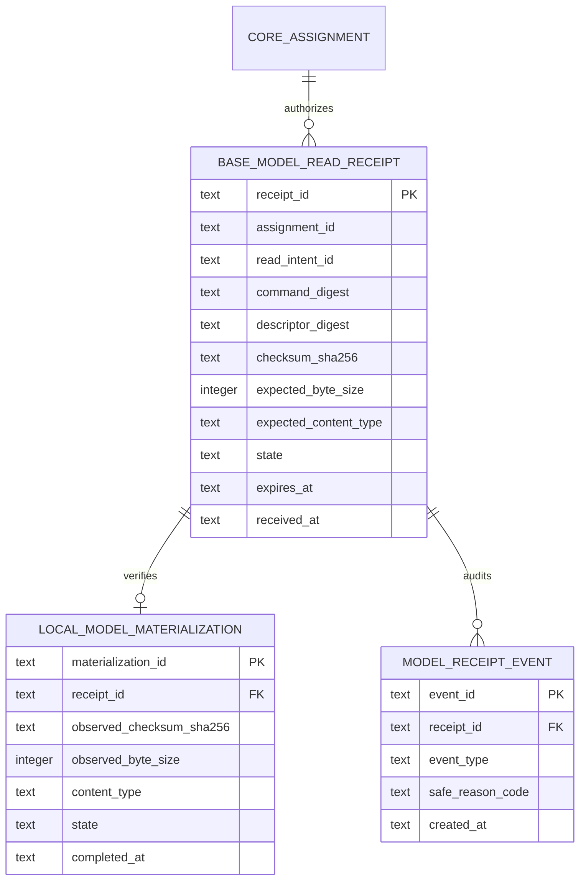
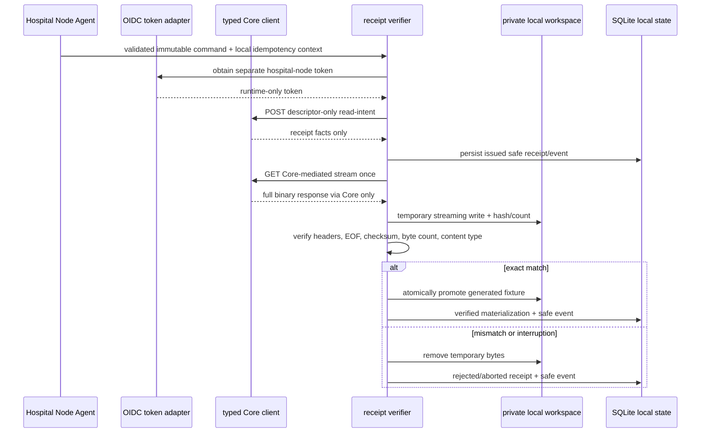
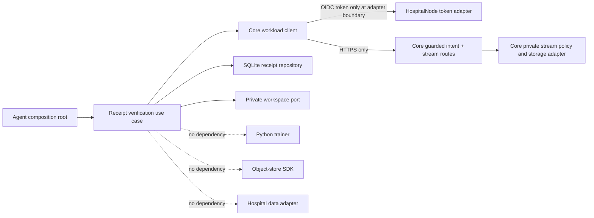

# Hospital Node Agent — Core Stream Receipt Verification and Synthetic Model Persistence

**Status:** Design gate published after a bounded Core-mediated generated-fixture stream proof; no Agent Core client, token flow, download implementation, local materialization, training, update, submission, or Azure Agent execution is implemented by this document.

**Scope:** The first Agent-side successor to Core-mediated streaming. It defines how a synthetic Hospital Node may request a descriptor-only read intent, consume exactly one Core-mediated generated-model response, independently verify the immutable facts it already holds, and persist only a redacted receipt plus a locally controlled generated-fixture materialization. It is not a patient-data, hospital, storage-provider, model-training, or release boundary.

## 1. Nontechnical requirements and research rationale

The completed Core proof establishes that Core can authorize and proxy one generated non-clinical fixture without disclosing a storage locator or credential. That does **not** establish that an Agent can safely accept the response. This next decision addresses the missing local consumer boundary: the Agent must reject an unbound, malformed, partial, stale, or integrity-mismatched response before it can be represented as locally available for any later synthetic preflight.

| Requirement | Acceptance signal | Explicit non-goal |
|---|---|---|
| Preserve local data sovereignty | The Agent receives generated model bytes only; it sends no local dataset, image, identifier, path, metric, or patient field to Core. | Data synchronization, hospital records, inference, clinical workflow, or a claim of medical validity. |
| Preserve storage opacity end-to-end | The Agent talks only to the Core HTTPS route through a typed client. | Direct provider SDK use, object address, bucket, version, presigned URL, provider credential, or provider response. |
| Preserve immutable research traceability | A local receipt binds the received response to the prior command and descriptor facts, then records a safe terminal event. | Treating a successful response as proof of trainability, model quality, data compatibility, or update correctness. |
| Fail closed | A mismatch, prohibited range behavior, incomplete body, or unexpected response category never materializes a usable local fixture. | Transparent resume, byte-range retry, silent substitution, or reuse of a consumed intent. |
| Keep evidence falsifiable | The first future end-to-end exercise may use one tiny generated non-clinical fixture and aggregate-safe assertions only. | Real checkpoint rollout, real hospital onboarding, throughput benchmark, or clinical evidence. |

NIST describes zero trust as resource-oriented authorization rather than implicit trust based on network location or ownership. [1] The Agent therefore treats the authenticated Core response as an input requiring local verification against its immutable assignment and receipt context; a successful TLS connection alone does not authorize local materialization.

## 2. Technical requirements and boundaries

The new Agent adapter is a **Core client**, not an object-store client. It may request a descriptor-only read-intent receipt from the existing guarded Core route and subsequently call the existing Core-mediated full-body stream route. The runtime token remains in the existing workload identity adapter and is never passed to domain objects, SQLite, events, returned receipts, logs, or test snapshots. The Agent must not rely on a provider URL, a storage SDK, or a new public endpoint.

| Concern | Required rule | Must not happen |
|---|---|---|
| Authorization sequence | Validate immutable command locally; obtain one descriptor-only read intent; call the Core stream route with the same authenticated workload context. | Inventing an intent, calling storage directly, reusing a human route, or using the ML-worker identity/callback. |
| Expected facts | Bind assignment ID, command digest, descriptor digest, checksum, byte size, content-type policy, and expiry from the locally validated command/read-intent context. | Accepting a checksum, size, model selector, file name, path, or locator supplied by a caller or response body. |
| Response processing | Require full-body `200`, exact allowed content type, exact `Content-Length`, `Cache-Control: no-store`, `X-Content-Type-Options: nosniff`, and attachment disposition before final receipt acceptance. | Following redirects, accepting `206`, emitting a Range request, processing multipart content, or trusting a provider header. |
| Integrity | Stream to a private temporary sink while computing SHA-256 and observed byte count; atomically materialize only after EOF and exact equality. | Buffering unbounded bytes in memory, storing bytes in SQLite, accepting a partial body, or materializing on mismatch. |
| Persistence | Store only scalar-safe receipt and materialization facts in SQLite; fixture bytes remain in a private, configured local workspace outside SQLite and redacted exports. | Persisting token, authorization header, URL, locator, storage version, provider response, raw headers, local path, dataset facts, or bytes. |
| Retry | A pre-body `503` or classified transport failure may be surfaced as retryable only under a later explicit retry policy. A body interruption or integrity failure is terminal for that intent. | Automatic retry, reuse of a consumed/aborted intent, range resume, or re-training. |

## 3. Local data and schema design

The existing `local_runs` and `run_events` remain authoritative for execution state. This increment adds a separate receipt projection so future training cannot infer local readiness merely from an assignment or a raw file. SQLite records only safe scalar facts; the generated fixture is held in a private local workspace controlled by a new filesystem adapter and is never represented by a stored pathname.



| Record | Required fields | State and invariants | Never stored |
|---|---|---|---|
| `base_model_read_receipts` | Local receipt ID, assignment ID, Core read-intent ID, command/descriptor digests, expected checksum, positive byte size, expected content type, expiry, timestamps. | One nonterminal receipt per `(assignment_id, read_intent_id)`; immutable expected facts; `issued → streaming → verified` or terminal `rejected`/`aborted`/`expired`. | Bearer token, secret, URL, object key/version, provider response, response headers, file name/path, bytes, local data. |
| `local_model_materializations` | Receipt ID, observed checksum/byte count/content type, state, completion time, generated-fixture class. | Exactly one `verified` materialization per verified receipt; no record becomes usable before EOF and equality checks. | Workspace path, encrypted key, object locator, bytes, model architecture payload, dataset facts, raw header/body. |
| `model_receipt_events` | Receipt ID, allowlisted event type, safe reason code, timestamp, optional Core correlation ID only when already supplied as a safe identifier. | Append-only and transactionally coupled to a receipt/materialization transition. | Free-text exceptions, header dumps, payload, provider details, token, path, patient/local-data fields. |

The private workspace adapter may receive an opaque configuration root at process startup, but neither the root nor resulting local paths enter domain values, SQLite, redacted exports, the status endpoint, or documentation. It writes a temporary generated-fixture file with restrictive local permissions, streams the digest calculation as it writes, and atomically promotes it only after all checks pass. A cleanup failure is safe evidence requiring operator review; it must not be converted into a path-bearing log message.

## 4. Workflow and state transition design



| Step | Normal behavior | Failure behavior |
|---|---|---|
| Local command precondition | Canonical command digest, deadline, and descriptor facts are locally validated before any network call. | Terminal local refusal without a network request if command facts are absent, expired, or inconsistent. |
| Intent request | Typed client requests one read-intent receipt with a local idempotency key. | Persist only a safe classified outcome; do not create a synthetic receipt locally if Core denies or times out. |
| Stream initialization | Verify HTTP method/result class and required safe binary response semantics before opening a materialization transaction. | Reject redirect, `206`, `416`, unallowed type, missing/nonpositive length, cache-policy mismatch, or non-`200` response; do not write usable bytes. |
| Body verification | Incremental byte count and SHA-256 run while data is written to a temporary private workspace sink. | Delete temporary content and terminally mark the local receipt when disconnect, count mismatch, hash mismatch, or EOF failure occurs. |
| Finalization | Promote exactly verified generated bytes and append a `base_model_materialized` safe event in the same SQLite transaction as `verified`. | A persistence/promote failure leaves no usable materialization; a safe cleanup-needed reason is recorded without a path. |
| Future handoff | A later, separately designed preflight may consume only a `verified` local materialization. | This design does not call Python training, package an update, submit a descriptor, or retry automatically. |

## 5. Architecture and dependency direction



| Module | Responsibility | Forbidden dependency |
|---|---|---|
| `contracts` | Versioned read-intent receipt, Core stream result classification, scalar-safe local receipt/materialization values, and cross-language fixtures. | Fetch, filesystem, SQLite, OIDC, raw headers, storage SDK, or training code. |
| `domain` | Receipt state matrix, immutable expected-fact equality, allowlisted event/reason vocabulary, and terminality rules. | Runtime token, HTTP response, Node stream, SQL, local path, or Python import. |
| `application` | Orchestrates idempotency, receipt persistence, response verification, temporary materialization, cleanup, and safe result projection. | Nest/Express, provider SDK, direct database driver, raw exception logging, or trainer invocation. |
| `core-client` | Uses the existing separate workload token to call only Core’s descriptor-intent and stream endpoints; converts HTTP into typed safe outcomes. | Storage SDK, redirects, human/ML-worker route, payload logging, or selector input. |
| `local-state-sqlite` | Persists scalar-safe receipts/materializations/events atomically. | Token, secret, bytes, workspace path, provider metadata, or free-text errors. |
| `local-workspace` | Writes/deletes generated fixture bytes under private process configuration and exposes no path in its public result. | Core API, OIDC, local dataset, upload/submission, or public status route. |
| `python` | Remains uninvolved in this slice. A later preflight may receive only an explicitly verified local materialization capability. | Direct Core stream, SQLite inspection, token, or storage access. |

## 6. Engineering standards and safety rules

> Receipt verification is a local **integrity and provenance gate**, not a claim that the fixture is a valid clinical model or that a training run has begun.

| Rule | Required enforcement |
|---|---|
| One protocol path | The Agent obtains a descriptor-only Core intent and then calls the existing Core stream route; it never contacts an object provider. |
| Runtime-only identity | The OIDC adapter owns the workload token and authorization header; all other layers receive typed results only. |
| Canonical equality | Compare Core receipt and observed response to already validated assignment/command/descriptor facts using canonical digest and exact positive byte size rules. |
| Full-body-only pilot | Send no `Range`; treat partial, redirect, multipart, compressed transformation, or mismatched length as rejection. |
| Bounded resources | Cap expected bytes before allocation; stream incrementally; use a controlled temporary sink; delete on every error path. |
| Crash/restart safety | SQLite transaction/event state must let a restart distinguish `verified`, terminally failed, and uncertain temporary materialization without accepting bytes twice. |
| Safe observability | Export only receipt state, event label, digests, byte-count equality boolean, duration bucket, and classified response outcome. |
| No implicit recovery | Never reissue/reuse an intent or resume a body automatically. Any retry semantics require a later contract and fresh Core receipt. |
| No trainer coupling | The use case cannot import or invoke the Python trainer, dataset adapter, update packager, submission client, or aggregation control. |

## 7. API contract and readout

The Core HTTP contract is already implemented and bounded; this Agent design introduces a typed internal adapter around it, not a new Core endpoint.

```ts
export interface BaseModelReadIntentReceipt {
  readonly assignmentId: string;
  readonly readIntentId: string;
  readonly commandDigest: string;
  readonly descriptorDigest: string;
  readonly checksumSha256: string;
  readonly byteSize: number;
  readonly expiresAt: string;
  readonly state: "issued";
}

export interface CoreModelStreamClient {
  requestReadIntent(input: {
    assignmentId: string;
    idempotencyKey: string;
  }): Promise<BaseModelReadIntentReceipt>;

  openVerifiedStream(input: {
    assignmentId: string;
    readIntentId: string;
  }): Promise<{
    readonly status: 200;
    readonly contentType: string;
    readonly contentLength: number;
    readonly cacheControl: "no-store";
    readonly contentDispositionClass: "attachment";
    readonly nosniff: true;
    readonly body: AsyncIterable<Uint8Array>;
  }>;
}
```

The contract above is intentionally a local adapter projection. It excludes arbitrary headers, redirect URLs, provider fields, filenames, and any body conversion to JSON. The client classifies non-`200` outcomes by stable Core status only; it does not expose raw response bodies. `401/403/404/409/416/422` are terminal for the presented context; a pre-body `503` or network-unavailable result is only classified for a future explicit retry decision. A disconnect or integrity mismatch after body opening is terminal for the current intent.

## 8. Test plan and bounded proof plan

| Test layer | Required positive evidence | Required denial evidence |
|---|---|---|
| Domain | Exact command/intent/descriptor fact binding and terminal receipt transition. | Expired command/intent, changed digest, nonpositive byte size, illegal state regression, non-allowlisted content type. |
| Contracts | TypeScript and Python-safe fixture parsing for scalar receipt data; canonical digests round-trip. | Unknown fields, omitted receipt facts, provider-like fields, token-like fields, path fields, raw headers, and byte payload in SQLite/event projections. |
| Core-client adapter | Separate hospital-node token is used only at adapter boundary; one typed Core intent then stream result. | Human/ML-worker endpoint, redirect, range response/request, raw error body exposure, storage SDK call, or automatic retry. |
| Workspace adapter | Tiny generated body reaches a temporary sink, exact hash/length succeeds, then one atomic promotion occurs. | Mid-stream disconnect, checksum/length/type mismatch, cleanup failure, duplicate promotion, path leak, or byte persistence in SQLite. |
| SQLite integration | Receipt/materialization/event transaction is restart-safe and terminal states do not call Core again. | Duplicate receipt materialization, mutable expected facts, token/path/header persistence, or free-text exception capture. |
| Full Agent proof (future) | One existing Hospital Node workload obtains one Core intent, consumes one generated fixture through Core, verifies/persists locally, and closes all safe state. | Real model/data, training, update, submission, aggregation, provider contact, public listener, hospital claim, or worker enablement. |

The future Azure proof is not authorized by this document alone. It must first be preceded by implementation records, local quality gates, protected Core and Agent deployment checks, a fresh no-secret health/worker check, and a proof profile that prints only safe success/failure markers and aggregate closure evidence. If the first Agent-integrated stream reaches Core but fails verification, the failure must be published before any retry or code change.

## 9. AI implementation handoff

| Delivery slice | Deliverable | Stop condition |
|---|---|---|
| L1 — Contract | Versioned local receipt/materialization contracts, event/reason vocabulary, and golden generated-fixture facts. | No HTTP, filesystem, token, SQLite, or trainer import in domain/contracts. |
| L2 — Local persistence | Additive SQLite migration/repository with atomic receipt, materialization, and safe-event transitions. | No bytes, path, header, token, secret, storage locator, dataset fact, or free-text diagnostic column. |
| L3 — Verification use case | Application service validates receipt/response facts, hashes streamed bytes, coordinates temporary materialization/cleanup, and returns a safe local projection. | No Core HTTP call in tests without a fake adapter; no Python trainer/update/submission dependency. |
| L4 — Core client/workspace adapters | Typed OIDC-backed Core client and private generated-fixture workspace adapter with redaction and negative tests. | No direct provider access, redirect, Range, automatic retry, public endpoint, or real model/data. |
| L5 — Quality and deployment | Agent quality gate, Core compatibility test, protected release checks, public Core health, and disabled aggregation worker verification. | No Azure Agent stream invocation during a code/deployment increment. |
| L6 — Bounded proof | One opt-in Agent/Core generated-fixture exercise with terminal closure and aggregate-safe evidence. | No training, update, submission, aggregation, clinical data, real hospital, or provider capability disclosure. |

Implementation must stop after each slice and add a dated Research Ledger entry before advancing. Any requirement that forces an object locator, provider credential, raw header/body, workspace path, data field, mutable model selection, implicit retry, or Python training call across this boundary is a fail-closed design error and requires a new dossier revision before coding continues.

## References

[1] [NIST SP 800-207: Zero Trust Architecture](https://csrc.nist.gov/pubs/sp/800/207/final)

[2] [Core-mediated generated-model streaming dossier](https://github.com/hstu-research/federated-aggregator-docs/blob/main/docs/CORE_MEDIATED_MODEL_STREAMING.md)

[3] [Hospital Node Agent engineering and API design](https://github.com/hstu-research/federated-aggregator-docs/blob/main/docs/HOSPITAL_NODE_AGENT_ENGINEERING_AND_API.md)

[4] [Hospital Node Agent local data and schema design](https://github.com/hstu-research/federated-aggregator-docs/blob/main/docs/HOSPITAL_NODE_AGENT_DATA_AND_SCHEMA.md)
